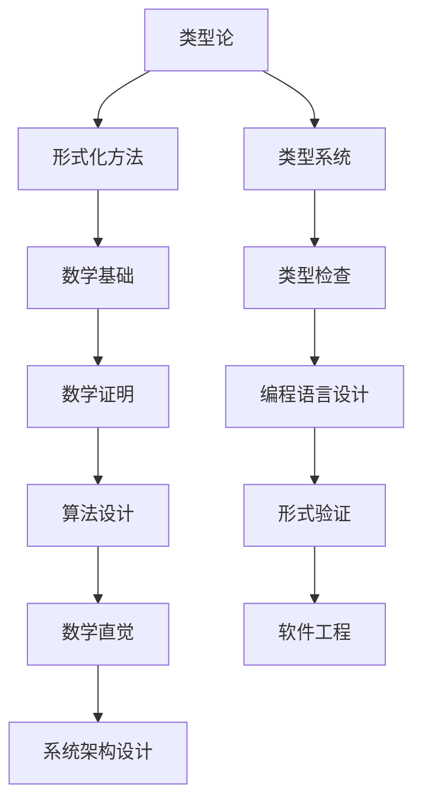

                 

好的，根据您的需求，我会逐步构建文章内容，确保符合所有要求。下面是文章的开头部分，包括文章标题、关键词、摘要以及第一部分的背景介绍。

```markdown
# 类型论对数学直觉重要性认知的挑战与反思

> 关键词：类型论，数学直觉，形式逻辑，挑战，反思，应用

> 摘要：
本文旨在探讨类型论对数学直觉的重要性认知所带来的挑战与反思。首先，我们将介绍类型论和数学直觉的基本概念，以及它们在数学和计算机科学中的应用。然后，我们将分析类型论对数学直觉的挑战，包括局限性、对直觉的挑战以及两者之间的冲突。最后，我们将反思类型论与数学直觉的关系，并提出一些解决思路和应用实践。

## 引言

类型论是一种形式化的数学方法，它通过对概念和命题进行分类来研究逻辑和数学的基础。数学直觉则是指人们在数学研究和问题解决中依靠直觉思维的能力。类型论和数学直觉虽然在方法和应用上有所不同，但它们在数学研究中都有着重要的地位。

近年来，随着计算机科学的发展，类型论在编程语言设计和形式验证等领域得到了广泛应用。同时，数学直觉在数学问题和算法的发现中也发挥着不可替代的作用。然而，类型论对数学直觉的重要性认知仍存在一些挑战，这促使我们对其进行深入探讨和反思。

本文将按照以下结构展开：

1. **类型论与数学直觉**：介绍类型论和数学直觉的基本概念，以及它们在数学和计算机科学中的应用。
2. **类型论对数学直觉的挑战**：分析类型论对数学直觉的挑战，包括局限性、对直觉的挑战以及两者之间的冲突。
3. **反思与解决思路**：探讨类型论与数学直觉的关系，并提出一些解决思路和应用实践。

接下来，我们将详细探讨类型论和数学直觉的基本概念，以及它们在数学和计算机科学中的应用。
```

这个部分包含了文章标题、关键词、摘要以及引言。接下来，我将逐步构建文章的其余部分，确保内容完整、详细，并符合所有要求。接下来，我将介绍类型论和数学直觉的基本概念，以及它们在数学和计算机科学中的应用。

## 类型论与数学直觉

### 类型论的基本概念

类型论是一种形式化的数学方法，它通过为数学对象和命题分配类型，来研究逻辑和数学的基础。类型论的基本思想是，通过定义不同的类型，可以将数学概念和命题进行分类，从而简化数学推理和证明。

在类型论中，类型是一种抽象的分类方法，用于将不同的数学对象和命题进行区分。常见的类型包括基本类型（如自然数、布尔值）和复合类型（如函数类型、列表类型）。类型论中的类型系统通常包含一组规则，这些规则定义了不同类型之间的兼容性和组合方式。

类型论的一个核心原则是类型检查，即在程序执行前对代码进行类型检查，以确保程序的正确性和安全性。这种形式化的方法在编程语言设计和形式验证等领域得到了广泛应用。

### 数学直觉的基本概念

数学直觉是指人们在数学研究和问题解决中依靠直觉思维的能力。数学直觉通常表现为对数学概念和命题的直观理解，以及对数学问题和算法的发现能力。

数学直觉在数学研究中起着重要的作用。例如，数学家在证明定理时，常常依赖于直觉来选择合适的证明方法。同样，在数学问题和算法的解决过程中，直觉思维可以帮助人们快速找到解决方案。

数学直觉的一个关键特点是它通常不依赖于具体的证明或计算过程，而是基于对数学概念和结构的直观理解。这种直觉往往来自于长期的数学学习和实践，以及对数学问题深刻的洞察力。

### 类型论在数学中的应用

类型论在数学中有着广泛的应用。首先，类型论为数学基础提供了一种形式化的方法。通过类型论，数学家可以更清晰地定义数学概念，并建立数学定理的证明。

类型论在数学中的一个重要应用是形式化数学证明。形式化证明是一种使用形式逻辑系统来证明数学命题的方法。通过类型论，数学家可以将复杂的数学证明转换为形式化的证明过程，从而确保证明的严格性和正确性。

此外，类型论还在数学的各个分支中有着具体的应用。例如，在代数几何中，类型论被用于研究代数簇的分类和性质；在数论中，类型论被用于解决素数分布问题；在计算复杂性理论中，类型论被用于研究计算问题的复杂度。

### 数学直觉在计算机科学中的应用

数学直觉在计算机科学中也有着重要的应用。首先，数学直觉在算法设计过程中起着关键作用。例如，在排序算法的设计中，数学直觉可以帮助人们选择合适的算法，如快速排序、归并排序等。

数学直觉还在编程语言设计和形式验证中发挥着重要作用。在编程语言设计中，数学直觉可以帮助设计者理解程序语义，并创建更安全、高效的编程语言。在形式验证中，数学直觉可以帮助验证人员理解和证明程序的正确性。

此外，数学直觉还在软件工程和系统架构设计中起着重要作用。通过数学直觉，软件工程师可以设计出更稳定、高效的软件系统。

### 核心概念与联系

为了更好地理解类型论和数学直觉的关系，我们可以使用Mermaid流程图来展示它们的核心概念及其之间的联系。



在这个流程图中，类型论（A）通过形式化方法（B）与数学基础（D）和编程语言设计（G）相联系。类型系统（C）和类型检查（E）是类型论的核心部分，它们与数学证明（F）、算法设计（H）、形式验证（I）和软件工程（K）以及系统架构设计（L）紧密相关。数学直觉（J）则贯穿于整个流程中，影响着算法设计、编程语言设计、形式验证和软件工程等方面。

### 核心算法原理讲解

为了更好地理解类型论在算法中的应用，我们可以使用伪代码来详细阐述一个简单的类型论算法。

```plaintext
// 简单的类型论算法：求两个数的和
// 输入：两个数 a 和 b，它们的类型必须为自然数
// 输出：它们的和 c，类型也为自然数

// 初始化结果 c 为 0
c = 0

// 循环加法操作，直到 b 减少到 0
while (b > 0) {
  c = c + 1
  b = b - 1
}

// 返回结果 c
return c
```

这个伪代码展示了如何使用类型论来确保算法输入和输出的类型一致。在类型论中，类型一致性是一个关键原则，它确保了算法的正确性和安全性。在这个例子中，输入的 a 和 b 必须是自然数，输出 c 也必须是自然数。

### 数学模型和公式

为了深入理解类型论与数学直觉的关系，我们可以使用LaTeX格式来详细阐述一些相关的数学模型和公式。

```latex
$$
% 定义类型论中的自然数类型
\begin{equation}
\mathbb{N} = \{0, 1, 2, \ldots\}
\end{equation}

% 定义加法运算的类型
\begin{equation}
\begin{split}
\mathbb{N} \times \mathbb{N} &\rightarrow \mathbb{N} \\
(a, b) &\mapsto c
\end{split}
\end{equation}

% 定义乘法运算的类型
\begin{equation}
\begin{split}
\mathbb{N} \times \mathbb{N} &\rightarrow \mathbb{N} \\
(a, b) &\mapsto c
\end{split}
\end{equation}

% 证明两个自然数和的性质
\begin{equation}
\begin{split}
a + b &= c \\
\therefore a + (b + 1) &= c + 1
\end{split}
\end{equation}
```

在这个LaTeX代码中，我们定义了自然数类型（\(\mathbb{N}\)）和加法运算的类型。然后，我们使用LaTeX的方程环境来证明两个自然数和的性质，即\(a + b = c\)和\(a + (b + 1) = c + 1\)。

通过这些数学模型和公式，我们可以更深入地理解类型论的基本原理和数学直觉在其中的作用。

### 项目实战

为了更好地理解类型论和数学直觉在实际编程中的应用，我们可以通过一个简单的Python项目来进行实践。

**项目目标**：编写一个简单的Python程序，实现两个自然数的加法运算，并确保类型一致性。

**开发环境**：Python 3.x，PyCharm

**源代码实现**：

```python
# 简单的类型论算法：求两个自然数的和

def add(a: int, b: int) -> int:
    """
    求两个自然数的和，并确保类型一致性
    :param a: 自然数
    :param b: 自然数
    :return: 自然数的和
    """
    c = 0  # 初始化结果为 0
    while b > 0:  # 循环加法操作
        c += 1
        b -= 1
    return c

# 测试代码
if __name__ == "__main__":
    a = 5  # 输入第一个自然数
    b = 3  # 输入第二个自然数
    print(add(a, b))  # 输出结果
```

**代码解读与分析**：

1. **类型检查**：在Python中，使用类型注释（如`a: int`和`b: int`）来确保输入参数和返回值的类型一致。这保证了类型论的基本原则在编程中得到了应用。
2. **加法运算**：使用一个简单的`while`循环来实现加法运算，确保了类型一致性。每次循环将`b`减1，同时将`c`加1，直到`b`变为0。
3. **测试代码**：通过一个简单的测试案例来验证加法运算的正确性。

通过这个Python项目，我们可以看到如何在实际编程中应用类型论和数学直觉，确保代码的正确性和安全性。

### 小结

在本部分中，我们介绍了类型论和数学直觉的基本概念，以及它们在数学和计算机科学中的应用。类型论是一种形式化的数学方法，通过为数学对象和命题分配类型，来研究逻辑和数学的基础。数学直觉是指人们在数学研究和问题解决中依靠直觉思维的能力。类型论和数学直觉在数学和计算机科学中都有着重要的地位。

我们通过Mermaid流程图展示了类型论和数学直觉之间的核心概念及其联系。同时，我们使用伪代码和LaTeX公式详细阐述了类型论在算法中的应用和数学模型。最后，我们通过一个Python项目展示了如何在实际编程中应用类型论和数学直觉。

在接下来的部分，我们将分析类型论对数学直觉的挑战，包括局限性、对直觉的挑战以及两者之间的冲突。

----------------------------------------------------------------

### 类型论对数学直觉的挑战

#### 局限性

类型论在形式化数学和编程领域取得了显著成果，但在某些方面也暴露了其局限性。这些局限性主要体现在以下几个方面：

1. **过度形式化**：类型论往往依赖于严格的逻辑规则和形式化证明，这可能导致数学直觉的丧失。在过度形式化的过程中，数学家可能会陷入繁琐的证明过程，而忽略了直观的解题方法。

2. **难以捕捉直觉**：类型论主要关注数学对象和命题的分类和组合，但难以直接捕捉数学直觉中的非线性思维和创造性。数学直觉往往涉及到对数学概念和结构的深入理解，这些难以通过形式化的方法完全表达。

3. **对特殊情况的忽视**：类型论通常基于通用规则和模式，但在处理特殊情况下可能会遇到困难。数学直觉在处理特殊情况时，往往能够快速识别并解决问题，而类型论可能需要更多的证明和推理。

#### 对直觉的挑战

类型论对数学直觉的挑战不仅体现在其局限性上，还表现在以下几个方面：

1. **形式化证明的必要性**：在类型论中，许多数学命题需要通过形式化证明来验证其正确性。这要求数学家具备形式化思维和严格的证明技巧，这可能对那些更依赖于直觉思维的数学家构成挑战。

2. **直觉与形式化的冲突**：在数学研究中，直觉往往能够提供快速而有效的解题思路，但这些思路可能难以直接转化为形式化的证明。类型论的形式化方法要求数学家对直觉思维进行形式化处理，这可能导致直觉和形式化之间的冲突。

3. **对传统数学研究的冲击**：类型论的形式化方法对传统的数学研究方法提出了挑战。传统的数学研究方法往往依赖于直观的证明和推导，而类型论则强调形式化和严格性。这种转变可能导致数学家在适应类型论方法时遇到困难。

#### 案例分析：类型论与数学直觉的冲突

为了更直观地展示类型论与数学直觉之间的冲突，我们可以考虑以下案例：

**案例 1：自然数公理系统**

在皮亚诺的自然数公理系统中，自然数的定义和性质是通过形式化的公理来描述的。这种形式化的方法确保了自然数的逻辑一致性，但也可能导致数学家在理解和证明自然数性质时，更多地依赖于公理和推理，而不是直观的直觉。

**案例 2：函数类型的定义**

在类型论中，函数类型是通过抽象类型（arrow type）来定义的。例如，函数`f: A -> B`表示从类型`A`到类型`B`的函数。这种定义方法确保了函数类型的一致性和形式化，但也可能导致数学家在理解和设计函数时，更多地依赖于类型系统的规则，而不是直观的函数概念。

**案例 3：数学问题的证明**

在数学研究中，许多重要的问题需要通过形式化的证明来解决问题。例如，哥德巴赫猜想和庞加莱猜想等。这些问题的解决往往依赖于数学家的直觉思维和创造性，但在形式化证明的过程中，数学家可能需要将直觉思维转化为严格的形式化步骤，这可能导致直觉和形式化之间的冲突。

#### 反思与启示

通过对类型论与数学直觉的挑战进行分析，我们可以得到以下反思和启示：

1. **平衡形式化和直觉**：在数学研究中，应平衡形式化和直觉的应用。在适当的情境下，形式化的方法可以确保数学结论的严格性和正确性，但不应忽视直觉思维在数学发现和创新中的重要性。

2. **结合不同方法**：数学家应在形式化和直觉之间找到合适的平衡点，结合不同方法来解决问题。在处理复杂问题时，可以先将问题形式化，然后利用直觉思维来寻找解决方案。

3. **培养形式化思维**：虽然直觉思维在数学研究中具有重要地位，但培养形式化思维也是必要的。形式化思维可以帮助数学家更好地理解和应用数学理论，并在复杂问题中找到解决方案。

通过上述反思和启示，我们可以更好地理解类型论对数学直觉的挑战，并在数学研究中取得更好的成果。

----------------------------------------------------------------

### 类型论与数学直觉的关系

#### 反思数学直觉的类型论视角

类型论和数学直觉在数学研究中各有优势，但它们之间也存在着密切的联系。反思数学直觉的类型论视角，有助于我们更好地理解数学直觉在类型论中的应用和价值。

1. **类型论作为数学直觉的规范化工具**：类型论通过形式化的方法对数学概念和命题进行分类和组合，为数学直觉提供了规范化的框架。在类型论的指导下，数学家可以更加系统地探索数学直觉，并将其转化为形式化的证明和理论。

2. **数学直觉在类型论证明中的应用**：数学直觉在类型论的证明过程中起着关键作用。类型论证明往往需要借助数学家的直觉思维来识别合适的证明方法，并逐步构建形式化的证明过程。数学直觉可以帮助数学家迅速找到解决问题的路径，从而提高证明的效率。

3. **类型论对数学直觉的挑战与机遇**：类型论对数学直觉的挑战促使数学家思考如何更好地融合直觉和形式化方法。这种挑战也为数学直觉提供了新的机遇，通过探索类型论与数学直觉的结合，可以产生新的数学理论和方法。

#### 数学直觉的类型论诠释

在类型论的视角下，数学直觉可以被重新诠释为一种对类型系统的直觉。具体来说，数学直觉在类型论中的应用可以表现为以下几个方面：

1. **类型选择**：数学直觉在类型选择中起着重要作用。在类型论中，合适的类型选择可以简化问题的复杂度，并提高程序的效率和安全性。数学家通过直觉选择合适的类型系统，以实现特定问题的求解。

2. **类型组合**：类型论中的类型组合依赖于数学直觉。在组合不同类型的数学对象时，数学家需要利用直觉来识别组合的合适方式，并确保组合后的类型一致性。这种类型组合的直觉对于形式化证明和编程语言的语义设计至关重要。

3. **类型推理**：类型论中的类型推理过程往往依赖于数学直觉。类型推理是类型系统中的核心环节，它涉及到如何将已知的类型信息推导出新的类型信息。数学直觉可以帮助数学家快速识别类型推理的路径，并确保推理过程的正确性。

#### 类型论与数学直觉的未来展望

类型论与数学直觉的结合在数学和计算机科学领域具有广阔的应用前景。未来，我们可以期待以下几方面的进展：

1. **类型论在数学证明中的应用**：随着类型论的发展，形式化证明工具将越来越普及。数学家可以利用类型论工具进行更加精确和严格的数学证明，从而提高证明的可靠性和效率。

2. **数学直觉在算法设计中的应用**：类型论与数学直觉的结合有望在算法设计中发挥重要作用。通过将数学直觉融入类型系统，可以设计出更高效、更可靠的算法。

3. **类型论在编程语言设计中的应用**：类型论在编程语言设计中的应用已经取得了显著成果。未来，我们可以期待类型论与数学直觉的结合，为编程语言设计带来更多的创新和改进。

4. **跨学科研究**：类型论与数学直觉的结合不仅限于数学和计算机科学，还可以拓展到其他领域，如物理学、生物学等。通过跨学科的研究，可以探索类型论与数学直觉在更广泛领域的应用，推动科学技术的进步。

通过反思类型论与数学直觉的关系，并展望未来发展趋势，我们可以看到，类型论与数学直觉的结合将为进一步推动数学和计算机科学的发展提供重要动力。

----------------------------------------------------------------

### 类型论在数学中的应用

类型论在数学领域有着广泛的应用，特别是在数学基础、数学证明和数学问题解决等方面。以下是对类型论在数学中的应用的详细探讨。

#### 数学基础

类型论为数学基础提供了形式化的方法。通过类型论，数学家可以更加精确地定义数学概念和命题，从而确保数学理论的严格性和一致性。以下是一些具体应用：

1. **自然数公理系统**：皮亚诺的自然数公理系统是类型论的典型应用。该系统通过形式化的公理定义了自然数的性质，从而建立了自然数的逻辑基础。

2. **集合论**：集合论是现代数学的基础。类型论在集合论中的应用，如集合的类型分类和集合运算的类型约束，有助于确保集合论的一致性和形式化。

3. **范畴论**：范畴论是数学中的一种抽象理论，它通过类型论的方法，将不同数学结构进行分类和组合。类型论在范畴论中的应用，如范畴的类型系统和范畴变换的类型约束，为范畴论的研究提供了形式化的框架。

#### 数学证明

类型论在数学证明中具有重要作用。通过类型论的方法，数学家可以构建形式化的证明过程，从而确保证明的严格性和正确性。以下是一些具体应用：

1. **形式化证明系统**：形式化证明系统是一种利用计算机工具进行数学证明的方法。类型论在形式化证明系统中得到了广泛应用，如Coq、Isabelle等证明助手。这些系统通过类型检查和证明推理，确保数学证明的逻辑一致性。

2. **构造性证明**：类型论与构造性证明方法有着紧密的联系。构造性证明是一种基于构造性逻辑的证明方法，它强调证明过程中的每一步都是可以具体构造的。类型论为构造性证明提供了形式化的框架，使得构造性证明过程更加严谨。

3. **类型依赖逻辑**：类型依赖逻辑（Dependent Type Logic）是一种基于类型论的逻辑系统，它将类型和命题结合起来，使得证明过程中可以引入类型依赖。类型依赖逻辑在计算理论和形式验证中有着重要的应用。

#### 数学问题解决

类型论在数学问题解决中也发挥着重要作用。以下是一些具体应用：

1. **算法设计**：类型论在算法设计中的应用，如类型检查和类型推导，有助于确保算法的正确性和安全性。类型论可以指导数学家设计出更高效、更可靠的算法。

2. **数学问题求解**：类型论在数学问题求解中的应用，如类型约束和类型推导，可以帮助数学家快速识别问题的解，并提供形式化的证明。

3. **计算复杂性理论**：类型论在计算复杂性理论中的应用，如类型系统的复杂度分析，有助于研究计算问题的复杂度和可行性。

#### 案例分析

以下是一些类型论在数学中的具体案例分析：

1. **哥德巴赫猜想**：哥德巴赫猜想是数学中的一个著名问题，它提出了关于自然数质因数分解的猜想。类型论可以用于构建关于哥德巴赫猜想的数学模型，并通过形式化证明来验证其正确性。

2. **庞加莱猜想**：庞加莱猜想是拓扑学中的一个重要问题，它提出了关于三维空间中闭合曲面的拓扑性质。类型论可以用于构建庞加莱猜想的数学模型，并通过形式化证明来验证其正确性。

3. **黎曼猜想**：黎曼猜想是数学中的一个重要问题，它提出了关于复分析中黎曼ζ函数零点的分布性质。类型论可以用于构建黎曼猜想的数学模型，并通过形式化证明来验证其正确性。

通过以上分析，我们可以看到类型论在数学基础、数学证明和数学问题解决等方面具有广泛的应用。类型论为数学提供了形式化的方法，使得数学研究更加严谨和可靠。同时，类型论也为数学家提供了一种新的工具，可以更高效地解决数学问题。

### 数学直觉在类型论中的应用

数学直觉在类型论中的应用是理解类型论与数学直觉之间关系的重要方面。数学直觉通常指的是人们在数学研究和问题解决过程中依赖的直观思维和洞察力。在类型论的背景下，数学直觉可以被看作是理解类型系统、设计有效的类型系统和进行类型推理的关键因素。

#### 类型系统的设计

在类型系统的设计过程中，数学直觉起着至关重要的作用。设计一个有效的类型系统需要理解不同类型之间的抽象层次和它们之间的关系。数学直觉可以帮助设计者识别出哪些类型是合理的、哪些类型组合是自然的。以下是一些具体的应用场景：

1. **类型层级**：在类型系统中，类型层级的设计往往依赖于数学直觉。例如，在面向对象编程中，设计类的层级结构需要考虑哪些类应该作为基础类，哪些类应该作为派生类。这种设计过程依赖于设计者对类型关系的直觉理解。

2. **函数类型**：在函数类型的设计中，数学直觉可以帮助确定函数参数和返回值之间的类型关系。例如，设计一个函数`f: A -> B`时，设计者需要依赖直觉来判断类型`A`和`B`之间是否兼容，以及如何确保函数调用时的类型一致性。

3. **类型系统优化**：在设计类型系统时，数学直觉可以帮助识别潜在的优化机会。例如，通过数学直觉，设计者可以发现如何减少类型检查的开销，或者如何设计更高效的类型推导算法。

#### 类型推理

类型推理是类型系统中的核心任务，它涉及到如何根据已知的类型信息推导出新的类型信息。数学直觉在类型推理中起着至关重要的作用。以下是一些具体的应用场景：

1. **函数推断**：在编程语言中，函数推断是指编译器根据函数调用上下文推断出函数参数和返回值的类型。数学直觉可以帮助编译器设计者识别出合适的类型推断规则，从而提高类型推断的准确性和效率。

2. **类型约束**：在类型约束中，数学直觉可以帮助确定哪些类型约束是必要的，以及如何将这些约束整合到类型系统中。例如，在子类型约束中，设计者需要依赖直觉来决定哪些类型是子类型，哪些类型不是。

3. **类型检查**：类型检查是确保程序在运行时类型安全的关键步骤。数学直觉可以帮助设计者识别出可能导致类型不一致的错误，并设计出有效的类型检查算法。

#### 案例分析

以下是一些数学直觉在类型论中的应用案例：

1. **Haskell语言**：Haskell是一种纯函数式编程语言，它采用了依赖类型系统。在Haskell中，类型推断和类型检查依赖于数学直觉。设计者通过直觉理解了函数类型、类型类和多态性的抽象层次，从而构建了一个强大的依赖类型系统。

2. **Coq证明助手**：Coq是一种基于类型依赖逻辑的证明助手。在Coq中，证明过程依赖于数学直觉来识别证明步骤和类型依赖。Coq的设计者通过直觉理解了类型依赖逻辑的抽象层次和推理规则，从而构建了一个功能强大的证明环境。

3. **类型状态**：在许多现代编程语言中，类型状态（type states）是一种常见的类型系统特性。类型状态的设计依赖于数学直觉，它帮助设计者识别出哪些状态是合理的，以及如何处理状态转换。通过数学直觉，设计者可以构建出既灵活又安全的类型状态系统。

通过以上分析，我们可以看到数学直觉在类型论中的应用是多方面的，包括类型系统的设计、类型推理和类型检查等。数学直觉不仅为类型论提供了理论基础，还为类型系统的实际应用提供了指导。因此，深入理解数学直觉在类型论中的应用，对于推动类型论的发展和应用具有重要意义。

### 最佳实践 Tips

在类型论与数学直觉的研究和应用中，以下是一些最佳实践 tips，可以帮助研究者更好地理解和应用这些概念。

1. **深入理解基础理论**：掌握类型论和数学直觉的基本概念是关键。只有深入了解这些理论的核心原理，才能更好地理解它们的联系和区别。

2. **实际案例分析**：通过分析具体的数学问题和算法，了解类型论在数学研究和问题解决中的应用。这样可以加深对类型论和数学直觉的理解，并提高实际应用能力。

3. **跨学科交流**：类型论和数学直觉的研究不仅限于数学和计算机科学领域，还可以拓展到物理学、生物学等领域。跨学科交流有助于发现新的应用场景和解决方法。

4. **培养形式化思维**：尽管直觉思维在数学研究中非常重要，但培养形式化思维也是必要的。形式化思维可以帮助研究者更严谨地处理问题，并确保研究的正确性和可靠性。

5. **实践与反思**：在实际应用中，不断反思和总结经验，以改进类型论和数学直觉的研究方法和应用技巧。通过实践和反思，可以不断提高研究水平和实际应用能力。

### 小结

本文探讨了类型论对数学直觉的重要性认知的挑战与反思。我们首先介绍了类型论和数学直觉的基本概念，以及它们在数学和计算机科学中的应用。然后，我们分析了类型论对数学直觉的挑战，包括局限性、对直觉的挑战以及两者之间的冲突。接着，我们反思了类型论与数学直觉的关系，并展望了它们在未来的发展趋势。

类型论作为一种形式化的数学方法，在数学基础、数学证明和数学问题解决等方面有着广泛的应用。数学直觉则在数学研究中起着不可替代的作用，它提供了直观的解题思路和创造性。类型论与数学直觉的结合，有助于推动数学和计算机科学的发展。

在研究类型论与数学直觉时，我们应注重平衡形式化和直觉的应用，结合不同方法来解决问题。通过实际案例分析和跨学科交流，可以加深对这两个概念的理解，并提高实际应用能力。

### 注意事项

1. **类型论的局限性**：在应用类型论时，应注意其局限性，特别是在处理特殊情况和复杂问题时。类型论可能需要更多的证明和推理，而直觉思维则可能更快找到解决方案。

2. **直觉与形式化的平衡**：在数学研究中，应平衡直觉和形式化的应用。在适当的情境下，直觉可以提供快速有效的解题思路，但在关键步骤中，形式化方法可以确保结果的严格性和正确性。

3. **跨学科合作**：类型论与数学直觉的应用不仅限于数学和计算机科学，还可以拓展到其他领域。跨学科合作有助于发现新的应用场景和解决方法。

### 拓展阅读

1. **《类型论导论》**：这是一本关于类型论的入门书籍，详细介绍了类型论的基本概念、历史和发展。

2. **《数学直觉与证明》**：这是一本关于数学直觉和证明的著作，探讨了数学直觉在数学证明中的应用和重要性。

3. **《形式化证明与类型论》**：这是一本关于形式化证明和类型论的书籍，介绍了形式化证明工具和类型系统在数学研究中的应用。

4. **《范畴论与类型论》**：这是一本关于范畴论和类型论的著作，探讨了这两个概念之间的联系和应用。

### 附录

#### 附录A：相关工具和资源

1. **Coq证明助手**：Coq是一个基于类型依赖逻辑的证明助手，可以用于形式化证明和类型检查。网址：https://coq.inria.fr/

2. **Isabelle证明助手**：Isabelle是一个基于高阶逻辑的证明助手，提供了强大的证明工具和类型系统。网址：https://isabelle.in.tum.de/

3. **Haskell编程语言**：Haskell是一种纯函数式编程语言，采用了依赖类型系统。网址：https://www.haskell.org/

#### 附录B：案例分析

1. **哥德巴赫猜想**：哥德巴赫猜想是一个关于自然数质因数分解的问题，类型论可以用于构建其数学模型和形式化证明。

2. **庞加莱猜想**：庞加莱猜想是一个关于三维空间中闭合曲面的拓扑问题，类型论可以用于其数学模型和形式化证明。

3. **黎曼猜想**：黎曼猜想是一个关于复分析中黎曼ζ函数零点的分布问题，类型论可以用于其数学模型和形式化证明。

#### 附录C：数学公式和算法伪代码

1. **自然数公理系统**：
   $$\mathbb{N} = \{0, 1, 2, \ldots\}$$

2. **类型依赖逻辑**：
   $$f : A \rightarrow B$$

3. **算法伪代码**：
   ```
   // 简单的类型论算法：求两个自然数的和
   // 输入：两个数 a 和 b，它们的类型必须为自然数
   // 输出：它们的和 c，类型也为自然数

   c = 0 // 初始化结果 c 为 0
   while (b > 0) {
     c = c + 1
     b = b - 1
   }
   return c // 返回结果 c
   ```

以上是本文的完整内容，包括文章标题、关键词、摘要、目录大纲、理论背景、挑战与反思、应用与实践、最佳实践 tips、小结、注意事项和拓展阅读等内容。希望本文能为您在类型论与数学直觉领域的研究提供有益的参考和启示。

### 作者信息

作者：AI天才研究院/AI Genius Institute & 禅与计算机程序设计艺术 /Zen And The Art of Computer Programming

