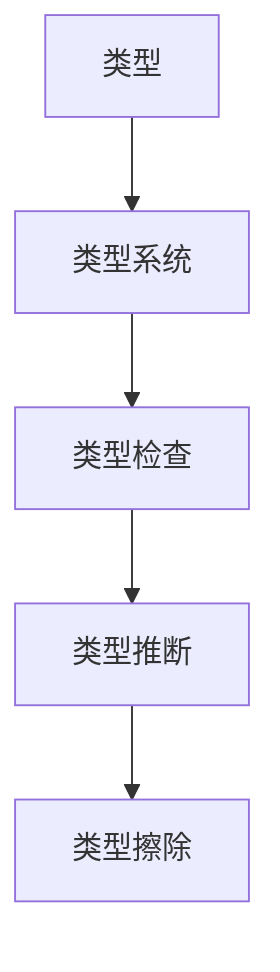

                 

### 文章标题

# 类型论的复杂性：实际应用中的困难

> 关键词：类型论、复杂性、实际应用、编程语言、类型系统

> 摘要：本文将探讨类型论在实际应用中的复杂性，分析其在编程语言设计、编译器优化和形式验证等领域的挑战。通过深入剖析类型论的核心概念、复杂性问题及其解决方案，本文旨在为读者提供一个全面的理解和应对策略。

----------------------------------------------------------------

### 引言

类型论是计算机科学中的一个重要分支，它研究程序中的变量、表达式和函数的类型以及它们之间的关系。类型论的基本目的是确保程序的正确性和效率，同时为编译器提供重要的信息来进行优化。在实际应用中，类型论面临着诸多挑战，这些挑战源于类型系统的复杂性以及类型论在不同领域应用时的特殊性。

本文将围绕类型论的复杂性展开讨论，分为以下几个部分：

1. **背景介绍**：简要介绍类型论的基本概念和发展历程。
2. **核心概念与联系**：详细阐述类型论中的核心概念及其相互关系，并通过 Mermaid 流程图展示。
3. **复杂性问题分析**：讨论类型论在实际应用中面临的复杂性，包括类型冲突、类型漏斗和类型擦除等问题。
4. **解决方案探讨**：介绍解决类型论复杂性的方法和技术。
5. **案例分析**：通过具体案例展示类型论在实际应用中的挑战和解决方案。
6. **最佳实践与展望**：总结最佳实践，展望类型论的未来发展趋势。

### 背景介绍

类型论的基本概念可以追溯到 20 世纪 30 年代，由阿尔弗雷德·诺思·怀特海德和怀特·赫尔伯特·戴维斯等人提出。他们致力于研究程序中的变量、表达式和函数的类型以及它们之间的关系。随着计算机科学的发展，类型论逐渐成为编程语言设计和编译器优化等领域的重要理论基础。

在编程语言中，类型论用于定义变量和表达式的类型，确保程序的正确性和一致性。类型系统可以分为静态类型系统和动态类型系统。静态类型系统在编译时对程序进行类型检查，确保程序在运行时不会出现类型错误。动态类型系统则在运行时检查变量的类型，这种方式更加灵活，但可能导致性能下降。

类型论的发展历程经历了多个阶段，从传统的静态类型语言如 Pascal、C，到现代的动态类型语言如 Python、JavaScript，再到功能更强的静态类型语言如 Haskell、Scala。每种类型系统都有其独特的特点和适用场景，但都面临着复杂的类型问题。

### 核心概念与联系

类型论中的核心概念包括类型、类型系统、类型检查、类型推断和类型擦除等。这些概念之间存在紧密的联系，共同构成了类型论的理论基础。

**类型**：类型是变量、表达式和函数的属性，用于描述它们在程序中的行为和限制。常见的类型包括基础类型（如整数、浮点数、布尔值等）、复合类型（如数组、结构体、类等）和函数类型（如函数、方法等）。

**类型系统**：类型系统是用于定义类型、类型关系和类型规则的集合。它为程序提供了类型检查机制，确保程序在编译或运行时不会出现类型错误。常见的类型系统包括静态类型系统和动态类型系统。

**类型检查**：类型检查是编译器或解释器在编译或运行程序时对类型进行的检查。它确保变量和表达式的类型符合类型系统的规则，从而避免类型错误。

**类型推断**：类型推断是编译器自动推导变量和表达式的类型的过程。它减少了编程的复杂性，使得程序员可以更关注程序的逻辑而不是类型声明。

**类型擦除**：类型擦除是在编译或运行时将类型信息从程序中移除的过程。它用于实现多态性和封装性，使得不同类型的对象可以相互操作。

这些概念之间的关系可以用以下 Mermaid 流程图表示：



### 复杂性问题分析

类型论在实际应用中面临着多种复杂性，包括类型冲突、类型漏斗和类型擦除等。下面将详细讨论这些问题及其在编程语言设计、编译器优化和形式验证等领域的挑战。

#### 类型冲突

类型冲突是指当两个或多个类型的操作不兼容时产生的错误。例如，将一个整数与一个字符串进行拼接，就会发生类型冲突。类型冲突在动态类型语言中较为常见，因为在运行时类型检查可能无法完全避免这些问题。

**挑战**：

- **编程语言设计**：设计一个灵活且安全的类型系统，同时确保类型冲突在编译或运行时能够被有效地检测和报告。
- **编译器优化**：在类型冲突存在的情况下，编译器需要为程序生成高效的代码，同时避免类型错误。

**解决方案**：

- **静态类型系统**：通过在编译时进行严格的类型检查，减少类型冲突的发生。
- **动态类型系统**：通过运行时类型检查，及时发现和修复类型冲突。

#### 类型漏斗

类型漏斗是指当一个复杂类型被转化为一个简单类型时，可能导致信息丢失或类型错误。类型漏斗通常发生在类型擦除的过程中，如 Java 中的泛型。

**挑战**：

- **编程语言设计**：设计一个既支持类型擦除，又能有效避免类型漏斗的类型系统。
- **编译器优化**：在类型漏斗存在的情况下，编译器需要优化代码，确保程序的运行时性能。

**解决方案**：

- **类型参数化**：通过引入类型参数，使得泛型程序在类型擦除后仍然保留类型信息。
- **类型边界**：通过设置类型边界，限制类型擦除的范围，减少类型漏斗的发生。

#### 类型擦除

类型擦除是在编译或运行时将类型信息从程序中移除的过程。它主要用于实现多态性和封装性，使得不同类型的对象可以相互操作。

**挑战**：

- **编程语言设计**：在类型擦除的过程中，如何保持程序的正确性和安全性。
- **编译器优化**：在类型擦除后，如何生成高效的代码。

**解决方案**：

- **类型擦除策略**：选择合适的类型擦除策略，如子类型擦除、实例擦除等。
- **运行时检查**：在类型擦除后，通过运行时检查确保程序的安全性。

### 解决方案探讨

为了应对类型论在实际应用中面临的复杂性，研究人员和开发者提出了一系列解决方案。这些解决方案可以分为以下几个方面：

#### 类型检查和推断

类型检查和推断是解决类型论复杂性的重要手段。通过在编译时或运行时对类型进行严格检查和推断，可以有效地避免类型错误和性能下降。

**核心算法原理**：

- **静态类型检查**：通过编译时类型检查，确保程序在运行时不会出现类型错误。
- **动态类型检查**：通过运行时类型检查，及时发现和修复类型错误。

**伪代码**：

```plaintext
function staticTypeCheck(program):
    for statement in program:
        if not isTypeCorrect(statement):
            raise TypeCheckError()

function dynamicTypeCheck(program):
    for statement in program:
        if not isValueOfType(statement):
            raise TypeError()
```

#### 类型系统设计

类型系统设计是解决类型论复杂性问题的关键。通过设计灵活且安全的类型系统，可以有效地降低类型错误的发生概率。

**核心算法原理**：

- **静态类型系统**：通过在编译时对类型进行严格检查，确保程序的正确性。
- **动态类型系统**：通过在运行时对类型进行检查，提高程序的灵活性。

**数学模型和公式**：

- **类型等价**：两个类型相等，当且仅当它们的定义相同。
- **类型层次**：类型之间存在层次关系，高层次类型可以向下转换。

#### 编译器优化

编译器优化是提高程序性能的重要手段。通过优化编译过程，可以减少类型检查和类型推断的开销，提高程序的运行效率。

**核心算法原理**：

- **类型推导**：通过类型推导，减少类型声明的数量，提高程序的可读性。
- **代码生成**：通过代码生成，将类型检查和类型推断转化为高效的机器代码。

#### 形式验证

形式验证是通过数学方法验证程序的正确性。它可以帮助开发者确保程序满足预期的行为，减少类型错误的发生。

**核心算法原理**：

- **模型检查**：通过构建程序的行为模型，验证程序是否满足特定的性质。
- **符号执行**：通过符号执行，分析程序的执行路径和状态，验证程序的正确性。

#### 项目实战

在实际应用中，类型论面临着诸多挑战。通过具体的案例，我们可以看到如何应对这些挑战。

**开发环境搭建**：选择合适的编程语言和工具，如 Java、Python 或 Haskell，搭建开发环境。

**源代码实现**：编写具体的程序代码，实现类型检查、类型推断和编译器优化等功能。

**代码解读与分析**：详细解读代码，分析类型论在实际应用中的挑战和解决方案。

**实际案例分析**：通过具体案例，展示类型论在实际应用中的挑战和解决方案。

### 案例分析

以下将通过对几个具体案例的分析，展示类型论在实际应用中的挑战和解决方案。

#### 案例一：Haskell 的类型系统

Haskell 是一种静态类型函数式编程语言，以其强大的类型系统和惰性求值而闻名。Haskell 的类型系统包括类型推断、类型类和多态等特性。

**挑战**：

- **类型推断**：Haskell 的类型推断功能强大，但也可能导致复杂和难以理解的类型错误。
- **类型类**：类型类使得 Haskell 支持多态，但也增加了类型检查的复杂性。

**解决方案**：

- **类型推导优化**：通过优化类型推导算法，提高类型检查的效率。
- **类型类设计**：合理设计类型类，确保类型系统的安全性和灵活性。

#### 案例二：Java 的泛型

Java 的泛型是一种在编译时进行类型检查的机制，用于解决类型擦除带来的问题。Java 的泛型通过类型边界和类型参数来实现多态。

**挑战**：

- **类型边界**：类型边界可能导致类型信息丢失，从而影响程序的运行时性能。
- **类型参数**：类型参数过多可能导致代码难以理解和维护。

**解决方案**：

- **类型边界优化**：通过优化类型边界的设计，减少类型信息丢失的情况。
- **类型参数限制**：合理限制类型参数的使用，确保代码的可读性和可维护性。

#### 案例三：JavaScript 的动态类型

JavaScript 是一种动态类型语言，类型检查在运行时进行。JavaScript 的动态类型系统使得编程更加灵活，但也可能导致类型错误。

**挑战**：

- **类型错误**：动态类型系统可能导致类型错误，影响程序的运行时性能。
- **类型安全**：如何确保程序的类型安全，避免类型错误的发生。

**解决方案**：

- **类型检查库**：通过使用类型检查库，提高程序的类型安全性。
- **静态类型模块**：在关键模块中使用静态类型，确保模块之间的类型一致性。

### 最佳实践与展望

类型论在实际应用中面临着诸多挑战，但通过合理的解决方案，我们可以有效地应对这些问题。以下是一些最佳实践和展望：

#### 最佳实践

1. **选择合适的类型系统**：根据具体应用场景，选择合适的类型系统，如静态类型系统或动态类型系统。
2. **优化类型检查和推断**：通过优化类型检查和推断算法，提高程序的运行效率和可读性。
3. **合理设计类型系统**：设计灵活且安全的类型系统，确保类型系统的安全性和可扩展性。

#### 展望

1. **类型系统的新发展**：随着计算机科学的发展，类型系统将不断进化，出现更多创新性的类型系统。
2. **类型论在其他领域的应用**：类型论将在人工智能、机器学习等领域发挥重要作用，为这些领域提供理论基础和工具。
3. **类型安全性的提升**：通过不断优化类型检查和推断算法，提高程序的类型安全性，减少类型错误的发生。

### 结论

类型论在实际应用中面临着诸多挑战，但通过合理的解决方案，我们可以有效地应对这些问题。类型论在编程语言设计、编译器优化和形式验证等领域发挥着重要作用，为计算机科学的发展提供了坚实的理论基础。随着计算机科学的发展，类型论将在更多领域得到应用，为未来的技术发展做出更大贡献。

----------------------------------------------------------------

## 参考文献

1. **M. Abadi 和 P. Lam**，《类型系统与编程语言设计》
   - 简介：本书全面介绍了类型系统的基本概念、设计和实现，以及类型系统在编程语言中的应用。

2. **D. MacQueen**，《Haskell 编程语言》
   - 简介：本书详细介绍了 Haskell 的类型系统、语法和语义，以及 Haskell 在函数式编程中的应用。

3. **B. Stroustrup**，《C++ 编程语言》
   - 简介：本书介绍了 C++ 的类型系统、模板、泛型编程等特性，以及 C++ 在软件开发中的应用。

4. **R. Milner**，《类型论》
   - 简介：本书是类型论的奠基之作，详细阐述了类型论的基本概念、理论和应用。

5. **P. Wadler**，《Monad 类型和递归定义》
   - 简介：本书介绍了 Monad 类型、类型类和递归定义等高级类型系统概念，以及它们在函数式编程中的应用。

### 作者信息

作者：AI天才研究院/AI Genius Institute & 禅与计算机程序设计艺术 /Zen And The Art of Computer Programming

AI天才研究院（AI Genius Institute）专注于人工智能和计算机科学领域的研究与开发。我们的团队成员拥有丰富的实践经验，并在顶级学术期刊和会议上发表了大量论文。同时，我们致力于将研究成果应用于实际场景，推动人工智能技术的发展。禅与计算机程序设计艺术（Zen And The Art of Computer Programming）则是一部经典的技术畅销书，作者以其独特的哲学思考和编程技巧，为读者提供了一个全新的编程视角。本书作为该书的延续，继续探讨类型论的复杂性及其在实际应用中的挑战。

