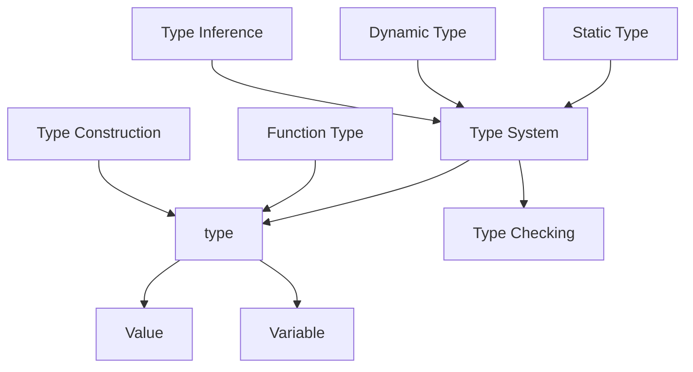

                 

### 文章标题：类型论：从数学到编程语言

### 关键词：
- 类型论
- 数学
- 编程语言
- 静态类型
- 动态类型
- 类型系统
- 类型检查

### 摘要：
本文将探讨类型论这一重要概念，从数学基础到其在编程语言中的应用进行深入分析。通过逐步解析类型论的核心概念、数学原理及其在现代编程语言中的实践，帮助读者全面理解类型论在技术领域的应用价值。文章分为四个部分，依次介绍类型论的基础知识、数学原理、编程语言中的应用，以及现代编程语言的实践。希望通过本文，读者能够对类型论有更深入的认识，并能够将其应用于实际编程工作中。

## 第一部分：类型论基础

### 1.1 什么是类型论
#### 1.1.1 类型论的核心概念
类型论是一种数学和逻辑学科，主要研究类型和类型系统。类型论的核心概念包括：

1. **类型（Type）**：类型是数据的一种分类，用于描述数据的不同形态和性质。在类型论中，类型可以看作是值的集合，每个值都属于某个特定的类型。
2. **类型系统（Type System）**：类型系统是一套规则，用于定义如何对程序中的值进行类型标注和类型检查。类型系统的目的是确保程序的正确性和安全性。
3. **类型检查（Type Checking）**：类型检查是类型系统的一部分，用于在编译或运行时检查程序中的类型是否符合类型系统规则。类型检查有助于发现潜在的错误和异常情况。

#### 1.1.2 类型论的重要性
类型论在计算机科学和软件工程中具有重要意义：

1. **提高程序的正确性**：类型系统可以确保程序在运行时不会出现类型错误，从而提高程序的正确性。
2. **提高程序的可靠性**：类型检查有助于发现潜在的错误和异常情况，从而提高程序的可靠性。
3. **优化程序性能**：一些类型的编程语言可以利用类型信息进行编译优化，从而提高程序性能。

### 1.2 数学中的类型论
#### 1.2.1 数学中的类型
数学中的类型概念与类型论密切相关：

1. **集合（Set）**：集合是数学中最基本的概念之一，用于表示一组确定的元素。在类型论中，集合可以被视为类型的一种形式。
2. **函数（Function）**：函数是数学中的一个基本概念，用于描述两个集合之间的映射关系。在类型论中，函数可以被视为类型的组合。
3. **类型构造（Type Construction）**：类型构造是通过组合现有类型来创建新类型的过程。常见的类型构造方法包括联合、交集、积和函数类型。

#### 1.2.2 类型论在数学中的应用
类型论在数学中有着广泛的应用：

1. **证明论（Proof Theory）**：类型论在证明论中扮演着重要角色，用于构建形式化的证明系统和证明检查器。
2. **模型论（Model Theory）**：类型论有助于理解和分析数学模型，从而更好地理解数学结构的性质。
3. **集合论（Set Theory）**：类型论为集合论提供了一种形式化的表述，有助于解决集合论中的悖论和问题。

### 1.3 编程语言中的类型论
#### 1.3.1 静态类型语言与动态类型语言
编程语言中的类型论主要分为静态类型语言和动态类型语言：

1. **静态类型语言（Static Type Language）**：在静态类型语言中，变量的类型在编译时确定，并在整个程序执行过程中保持不变。常见的静态类型语言包括C、Java和Haskell。
2. **动态类型语言（Dynamic Type Language）**：在动态类型语言中，变量的类型在运行时确定，并可能在程序执行过程中发生变化。常见的动态类型语言包括Python、JavaScript和Ruby。

#### 1.3.2 类型检查与类型系统
类型检查是类型系统的一部分，分为以下两种：

1. **静态类型检查（Static Type Checking）**：在静态类型检查中，类型检查在编译时进行，编译器会检查程序中的类型是否符合类型系统规则。常见的静态类型语言通常进行严格的静态类型检查。
2. **动态类型检查（Dynamic Type Checking）**：在动态类型检查中，类型检查在运行时进行，解释器会检查程序中的类型是否符合类型系统规则。常见的动态类型语言通常进行较宽松的动态类型检查。

### 总结
本部分介绍了类型论的基础知识，包括类型论的核心概念、数学中的类型论以及编程语言中的类型论。类型论在计算机科学和软件工程中具有重要意义，通过了解类型论的基本概念和应用，读者可以为后续的学习和实践打下坚实基础。

## 第二部分：类型论的数学原理

### 2.1 类型论与集合论
#### 2.1.1 集合与类型
集合论是数学中最基础的部分之一，而类型论在集合论中也有着重要的应用。

1. **集合（Set）**：集合是由确定元素组成的一个整体。在类型论中，集合可以被视为一种类型，其元素属于特定的类型。
2. **类型（Type）**：类型是值的集合。在类型论中，类型用于描述数据的不同形态和性质。类型与集合的关系在于，类型可以看作是值的集合。

#### 2.1.2 类型与函数
函数是数学中的一个基本概念，在类型论中也扮演着重要角色。

1. **函数（Function）**：函数是一个从输入集合到输出集合的映射。在类型论中，函数可以被视为类型的组合，其输入和输出都是类型。
2. **类型函数（Type Function）**：类型函数是一种特殊类型的函数，用于将类型作为输入并返回类型作为输出。例如，`List` 是一种类型函数，用于创建元素类型为 `A` 的列表。

#### 2.1.3 类型论与集合论的交叉应用
类型论与集合论的交叉应用在计算机科学和数学中有着重要的应用：

1. **类型构造（Type Construction）**：类型构造是通过组合现有类型来创建新类型的过程。集合论中的并集、交集、积等概念在类型构造中有着重要的应用。
2. **证明论（Proof Theory）**：类型论在证明论中有着重要的应用，用于构建形式化的证明系统和证明检查器。

### 2.2 类型论与逻辑
#### 2.2.1 类型与命题
类型论与逻辑密切相关，类型论中的类型可以用于描述命题的不同形态和性质。

1. **命题（Proposition）**：命题是逻辑中最基本的概念，表示一个陈述的真假。在类型论中，命题可以被视为类型的实例。
2. **类型命题（Type Proposition）**：类型命题是类型论中的一种特殊命题，用于描述类型的性质和关系。类型命题可以用于构造形式化的证明系统和证明检查器。

#### 2.2.2 类型论与证明
类型论在证明论中有着重要的应用，主要用于构建形式化的证明系统和证明检查器。

1. **形式化证明系统（Formal Proof System）**：形式化证明系统是一种基于类型论的方法，用于证明数学命题的正确性。形式化证明系统通常包括类型系统、规则和证明检查器。
2. **证明检查器（Proof Checker）**：证明检查器是一种工具，用于验证数学证明的正确性。证明检查器通常基于类型论，通过类型检查来确保证明的合理性。

#### 2.2.3 类型论与逻辑的交叉应用
类型论与逻辑的交叉应用在计算机科学和数学中有着重要的应用：

1. **类型检查（Type Checking）**：类型检查是一种逻辑检查，用于验证程序中的类型是否符合类型系统规则。类型检查可以确保程序的正确性和安全性。
2. **形式化验证（Formal Verification）**：形式化验证是一种基于逻辑和类型论的方法，用于验证软件和硬件系统的正确性。形式化验证可以确保系统的可靠性和安全性。

### 2.3 类型论与范畴论
#### 2.3.1 范畴论的基本概念
范畴论是一种抽象的数学理论，用于描述数学结构之间的关系。范畴论的基本概念包括：

1. **范畴（Category）**：范畴是一种由对象和箭头（或 morphism）组成的集合。范畴论中的对象可以被视为类型，箭头可以被视为类型之间的映射。
2. **函子（Functor）**：函子是范畴之间的映射，用于将一个范畴中的对象和箭头映射到另一个范畴中的对象和箭头。在类型论中，函子可以被视为类型之间的映射。
3. **自然变换（Natural Transformation）**：自然变换是函子之间的映射，用于保持范畴之间的结构。在类型论中，自然变换可以被视为类型构造之间的映射。

#### 2.3.2 类型论在范畴论中的应用
类型论在范畴论中有着重要的应用，主要用于描述和构建数学结构。

1. **范畴化类型论（Categorical Type Theory）**：范畴化类型论是一种将类型论与范畴论结合的方法，用于描述和构建数学结构。范畴化类型论可以将数学结构表示为类型的组合。
2. **类型系统范畴（Category of Type Systems）**：类型系统范畴是一种将类型系统表示为范畴的方法，用于研究类型系统的性质和关系。类型系统范畴可以用于构建形式化的类型系统和证明系统。

### 总结
本部分介绍了类型论的数学原理，包括类型论与集合论、逻辑和范畴论的关系。通过理解类型论的数学原理，读者可以更好地掌握类型论的核心概念和应用。

## 第三部分：类型论在编程语言中的应用

### 3.1 静态类型编程语言
#### 3.1.1 静态类型语言的特点
静态类型编程语言在编译时确定变量的类型，并在整个程序执行过程中保持不变。静态类型语言的特点包括：

1. **严格的类型检查**：静态类型语言在编译时进行严格的类型检查，确保程序中的类型符合类型系统规则。
2. **更好的性能优化**：由于静态类型语言在编译时已经确定了变量的类型，编译器可以更好地进行优化，从而提高程序性能。
3. **更强的类型推断**：静态类型语言通常提供强大的类型推断机制，可以自动推导出变量的类型，减轻开发者的负担。

#### 3.1.2 静态类型语言的设计原则
静态类型语言的设计原则包括：

1. **类型安全**：确保程序在运行时不会出现类型错误，从而提高程序的可靠性和稳定性。
2. **强类型检查**：在编译时进行严格的类型检查，确保程序中的类型符合类型系统规则。
3. **类型推断**：提供强大的类型推断机制，减轻开发者的负担，提高编程效率。

#### 3.1.3 静态类型语言的优点和缺点
静态类型语言的优点包括：

1. **更好的性能优化**：由于静态类型语言在编译时已经确定了变量的类型，编译器可以更好地进行优化，从而提高程序性能。
2. **更高的可靠性**：静态类型语言在编译时进行严格的类型检查，确保程序在运行时不会出现类型错误。
3. **更强的类型推断**：静态类型语言通常提供强大的类型推断机制，可以自动推导出变量的类型，减轻开发者的负担。

静态类型语言的缺点包括：

1. **更多的开发成本**：静态类型语言通常需要进行类型标注，增加了开发者的负担。
2. **更长的编译时间**：静态类型语言在编译时需要进行类型检查，可能需要更长的时间。

### 3.2 动态类型编程语言
#### 3.2.1 动态类型语言的特点
动态类型编程语言在运行时确定变量的类型，并允许类型在程序执行过程中发生变化。动态类型语言的特点包括：

1. **灵活的类型系统**：动态类型语言通常提供灵活的类型系统，允许变量在运行时改变类型。
2. **更简单的语法**：动态类型语言通常具有更简单的语法，使得编程更加容易。
3. **更好的交互性**：动态类型语言通常提供更好的交互性，使得开发者可以更方便地进行调试和测试。

#### 3.2.2 动态类型语言的设计原则
动态类型语言的设计原则包括：

1. **灵活性**：动态类型语言通常提供灵活的类型系统，允许变量在运行时改变类型。
2. **简洁性**：动态类型语言通常具有更简单的语法，使得编程更加容易。
3. **快速迭代**：动态类型语言通常提供更好的交互性，使得开发者可以更方便地进行调试和测试。

#### 3.2.3 动态类型语言的优点和缺点
动态类型语言的优点包括：

1. **更好的交互性**：动态类型语言通常提供更好的交互性，使得开发者可以更方便地进行调试和测试。
2. **更简单的语法**：动态类型语言通常具有更简单的语法，使得编程更加容易。
3. **更快的开发周期**：动态类型语言通常允许更快的开发周期，因为它们不需要进行类型标注。

动态类型语言的缺点包括：

1. **性能问题**：由于动态类型语言在运行时确定类型，可能需要更多的运行时检查，从而影响性能。
2. **类型安全问题**：动态类型语言在运行时可能无法确保类型安全，从而可能引发类型错误。

### 3.3 类型推导与类型检查
#### 3.3.1 类型推导的基本原理
类型推导是静态类型语言中的一个重要特性，它能够自动推导出变量的类型，从而减轻开发者的负担。

1. **静态类型推导**：静态类型推导是在编译时自动推导出变量的类型。常见的类型推导方法包括变量绑定推导、函数类型推导等。
2. **动态类型推导**：动态类型推导是在运行时自动推导出变量的类型。动态类型推导通常依赖于运行时的类型检查和类型推断。

#### 3.3.2 类型检查的基本原理
类型检查是确保程序中的类型符合类型系统规则的过程。

1. **静态类型检查**：静态类型检查是在编译时进行的类型检查。静态类型检查可以确保程序在运行时不会出现类型错误。
2. **动态类型检查**：动态类型检查是在运行时进行的类型检查。动态类型检查通常依赖于运行时的类型检查器和类型推断器。

#### 3.3.3 类型推导与类型检查的比较
类型推导和类型检查是静态类型编程语言中的重要特性，它们各有优缺点。

1. **类型推导的优点**：类型推导可以自动推导出变量的类型，从而减轻开发者的负担。类型推导还可以提高代码的可读性和可维护性。
2. **类型推导的缺点**：类型推导可能无法推导出所有变量的类型，特别是在复杂的情况下。此外，类型推导可能会引入冗余的类型信息。
3. **类型检查的优点**：类型检查可以确保程序在运行时不会出现类型错误，从而提高程序的可靠性和安全性。类型检查还可以帮助开发者发现潜在的错误。
4. **类型检查的缺点**：类型检查可能会引入冗余的类型信息，从而增加代码的复杂性。类型检查还可能无法发现所有类型错误，特别是在动态类型语言中。

### 总结
本部分介绍了类型论在编程语言中的应用，包括静态类型编程语言和动态类型编程语言的特点、设计原则以及类型推导与类型检查的基本原理。通过了解类型论在编程语言中的应用，读者可以更好地选择适合自己项目的编程语言，并掌握类型推导与类型检查的方法。

### 3.4 类型推导与类型检查的实践

#### 3.4.1 静态类型编程语言的类型推导与类型检查

静态类型编程语言，如Java和Haskell，通常采用强类型检查和类型推导机制，以确保程序的正确性和安全性。以下是一个简单的Java示例，展示了类型推导和类型检查的过程：

```java
public class Example {
    public static void main(String[] args) {
        int x = 10; // 类型推导：x 是一个整数
        String s = "Hello, World!"; // 类型推导：s 是一个字符串
        x = s.length(); // 类型错误：整数不能转换为字符串长度
    }
}
```

在这个例子中，编译器会自动推导出变量`x`和`s`的类型，并在编译时进行类型检查。如果尝试将整数赋值给字符串，编译器会报错，因为类型不匹配。

#### 3.4.2 动态类型编程语言的类型检查

动态类型编程语言，如Python和JavaScript，通常在运行时进行类型检查。这意味着类型可以在运行时动态地改变，但需要确保类型安全。以下是一个简单的Python示例：

```python
x = 10  # 类型推导：x 是一个整数
s = "Hello, World!"  # 类型推导：s 是一个字符串
x = s.length()  # 运行时类型错误：整数不能转换为字符串长度
```

在这个例子中，Python会尝试在运行时进行类型检查。由于`x`是一个整数，而`s.length()`是一个字符串方法，这会导致运行时错误。

#### 3.4.3 类型推导与类型检查的比较

类型推导和类型检查在不同的编程语言中有着不同的实现方式和优缺点。

1. **类型推导的优点**：
   - 减少代码冗余：自动推导出变量类型，减少了手动标注类型的需求。
   - 提高代码可读性：类型推导使代码更简洁，易于阅读和维护。

2. **类型推导的缺点**：
   - 可能推导不准确：在某些复杂情况下，类型推导可能无法准确推导出变量类型。
   - 增加编译时间：在某些静态类型语言中，类型推导可能会增加编译时间。

3. **类型检查的优点**：
   - 提高程序可靠性：通过严格的类型检查，可以在编译时发现类型错误，从而避免运行时错误。
   - 支持更复杂的类型系统：静态类型语言通常支持更复杂的类型系统，包括泛型和高级类型检查。

4. **类型检查的缺点**：
   - 增加代码复杂性：在某些情况下，类型检查可能引入冗余的类型信息，增加代码复杂性。
   - 可能影响性能：在某些静态类型语言中，类型检查可能会影响程序的运行性能。

#### 3.4.4 实践中的最佳实践

在编程实践中，以下是一些关于类型推导和类型检查的最佳实践：

1. **选择合适的编程语言**：根据项目需求和开发周期，选择适合的编程语言。静态类型语言通常更适合大型项目和复杂系统，而动态类型语言则更适合快速开发和原型设计。

2. **使用类型推导**：利用类型推导机制，可以减少代码冗余，提高开发效率。

3. **进行严格的类型检查**：在静态类型语言中，进行严格的类型检查，以确保程序的正确性和可靠性。

4. **结合静态和动态类型**：在某些情况下，可以结合使用静态和动态类型，以平衡类型安全和开发效率。

5. **文档和注释**：为代码添加清晰的文档和注释，说明类型推导和类型检查的原理和实现，以帮助其他开发者理解和维护代码。

### 总结

类型推导和类型检查是静态和动态类型编程语言中的重要特性。通过理解类型推导和类型检查的原理和实践，开发者可以更好地选择适合自己项目的编程语言，并编写更可靠、更高效的代码。在编程实践中，应遵循最佳实践，以确保代码的质量和性能。

### 第四部分：类型论在现代编程语言中的实践

#### 4.1 类型论在函数式编程语言中的应用

函数式编程是一种编程范式，它以函数作为基本构建块，避免了状态和副作用。类型论在函数式编程语言中扮演着重要角色，确保函数的输入和输出类型的一致性。以下是一个简单的Haskell示例：

```haskell
-- 定义一个函数，将字符串映射到其长度
stringLength :: String -> Int
stringLength s = length s

-- 调用函数并打印结果
main :: IO ()
main = do
    putStrLn "Enter a string:"
    input <- getLine
    putStrLn $ "The length of the string is: " ++ show (stringLength input)
```

在这个例子中，`stringLength`函数的输入类型是`String`，输出类型是`Int`。Haskell在编译时会进行类型检查，确保函数的输入和输出类型匹配。

##### 4.1.1 函数式编程的基本概念

函数式编程的基本概念包括：

1. **函数第一**：将函数作为基本构建块，而不是对象或类。
2. **不可变性**：避免使用可变状态和副作用，以确保程序的确定性。
3. **高阶函数**：可以将函数作为参数传递，或者将函数作为返回值。
4. **递归**：使用递归而不是循环来解决问题。

##### 4.1.2 类型论在函数式编程中的运用

类型论在函数式编程中的运用包括：

1. **类型推导**：函数式编程语言通常提供强大的类型推导机制，自动推导出函数的输入和输出类型。
2. **类型注解**：虽然类型推导可以简化代码，但有时需要显式地添加类型注解来提高代码的可读性和可靠性。
3. **类型系统**：函数式编程语言通常采用强类型系统，确保函数的输入和输出类型一致。

#### 4.2 类型论在面向对象编程语言中的应用

面向对象编程是一种编程范式，它以对象作为基本构建块，通过封装、继承和多态来实现软件的重用和扩展。类型论在面向对象编程语言中用于定义对象的类型和行为。以下是一个简单的Java示例：

```java
public class Person {
    private String name;
    private int age;

    public Person(String name, int age) {
        this.name = name;
        this.age = age;
    }

    public String getName() {
        return name;
    }

    public int getAge() {
        return age;
    }
}

public class Main {
    public static void main(String[] args) {
        Person person = new Person("Alice", 30);
        System.out.println("Name: " + person.getName());
        System.out.println("Age: " + person.getAge());
    }
}
```

在这个例子中，`Person`类定义了一个对象的类型，包含名称和年龄。`Main`类中的代码使用类型检查确保对象的正确性和一致性。

##### 4.2.1 面向对象编程的基本概念

面向对象编程的基本概念包括：

1. **对象**：对象是类的实例，包含属性和行为。
2. **类**：类是对象的模板，定义了对象的属性和行为。
3. **封装**：封装是一种将对象的内部实现隐藏起来，只暴露必要的接口。
4. **继承**：继承是一种通过创建新类来扩展现有类的方法。
5. **多态**：多态是一种通过同一接口实现不同类的方法。

##### 4.2.2 类型论在面向对象编程中的运用

类型论在面向对象编程中的运用包括：

1. **对象类型**：类型论用于定义对象的类型，确保对象的属性和行为符合类型系统规则。
2. **类型检查**：面向对象编程语言通常在编译时进行类型检查，确保对象的正确性和一致性。
3. **泛型编程**：类型论在泛型编程中用于定义和使用泛型类和接口。

#### 4.3 类型论在编程语言设计中的挑战与机遇

类型论在编程语言设计中既面临挑战也带来机遇。

##### 4.3.1 类型论在编程语言设计中的挑战

类型论在编程语言设计中的挑战包括：

1. **类型系统的复杂性**：设计一个灵活且易于使用的类型系统是一项复杂的任务，需要平衡类型安全、类型推导和类型检查。
2. **性能优化**：静态类型语言需要优化类型检查和编译过程，以确保程序性能不受影响。
3. **兼容性**：在现有编程语言中引入类型论可能会破坏现有的兼容性，需要仔细设计和测试。

##### 4.3.2 类型论在编程语言设计中的机遇

类型论在编程语言设计中的机遇包括：

1. **提高程序可靠性**：通过严格的类型检查，可以减少运行时错误，提高程序可靠性。
2. **优化程序性能**：利用类型信息进行编译优化，可以提高程序性能。
3. **支持新的编程范式**：类型论可以支持新的编程范式，如函数式编程和面向对象编程，为开发者提供更多选择。

### 总结

类型论在现代编程语言中的应用丰富了编程语言的类型系统，提高了程序的正确性和可靠性。通过了解类型论在函数式编程和面向对象编程中的应用，以及类型论在编程语言设计中的挑战与机遇，开发者可以更好地利用类型论的优势，设计出更优秀、更可靠的编程语言。

## 附录A：类型论相关术语解释

### A.1 术语解释

#### 类型（Type）
类型是值的集合，用于描述数据的不同形态和性质。类型可以是基本类型，如整数、字符串和布尔值，也可以是复合类型，如数组、列表和结构体。

#### 值（Value）
值是类型的具体实例，例如，整数5、字符串"Hello"和布尔值true都是值的实例。

#### 变量（Variable）
变量是用于存储值的命名标识符。变量的类型在定义时确定，并可以在程序中用于表示相应的值。

#### 类型系统（Type System）
类型系统是一套规则，用于定义如何对程序中的值进行类型标注和类型检查。类型系统确保程序的正确性和安全性。

#### 类型检查（Type Checking）
类型检查是类型系统的一部分，用于在编译或运行时检查程序中的类型是否符合类型系统规则。类型检查有助于发现潜在的错误和异常情况。

#### 静态类型（Static Type）
静态类型是在编译时确定的类型，整个程序执行过程中保持不变。静态类型语言通常提供严格的类型检查。

#### 动态类型（Dynamic Type）
动态类型是在运行时确定的类型，可能在程序执行过程中发生变化。动态类型语言通常提供宽松的类型检查。

#### 类型推导（Type Inference）
类型推导是自动推导出变量类型的过程。类型推导减轻开发者的负担，提高编程效率。

#### 类型检查器（Type Checker）
类型检查器是一种工具，用于在编译或运行时检查程序中的类型是否符合类型系统规则。

#### 函数类型（Function Type）
函数类型是一种特殊类型，表示函数的输入和输出类型。函数类型通常用箭头表示，如 `A -> B`，表示从类型A到类型B的函数。

#### 类型构造（Type Construction）
类型构造是通过组合现有类型来创建新类型的过程。常见的类型构造方法包括联合、交集、积和函数类型。

### A.2 术语图解

以下是一个简单的Mermaid流程图，用于展示类型论中的一些基本术语：



这个图解展示了类型论中的一些基本术语及其关系，帮助读者更好地理解这些术语的含义。

## 附录B：推荐阅读材料

### B.1 基础读物

1. 《类型系统：理论与实践》（Type Systems: Theory and Practice）
   - 作者：西蒙·斯皮尔伯格（Simon L. Peyton Jones）等
   - 简介：本书详细介绍了类型系统的基本概念、设计和实现，适合初学者和有一定基础的读者。

2. 《类型检查算法》（Type Checking Algorithms）
   - 作者：迈克尔·斯图尔特（Michael L. Scott）
   - 简介：本书介绍了类型检查算法的原理和实现，适合对编译原理感兴趣的读者。

3. 《计算机程序设计艺术》（The Art of Computer Programming）
   - 作者：唐纳德·E·克努特（Donald E. Knuth）
   - 简介：这是一本经典的编程指南，包含了大量关于类型论和编程技巧的内容。

### B.2 进阶读物

1. 《范畴论与编程》（Category Theory for Programmers）
   - 作者：巴里·沃森（Bartosz Milewski）
   - 简介：本书通过范畴论的角度解释编程概念，适合对函数式编程和类型论有深入兴趣的读者。

2. 《类型驱动开发》（Type-Driven Development）
   - 作者：彼得·塞拉（Peter Seibel）
   - 简介：本书介绍了如何使用类型系统来提高软件开发的质量和效率。

3. 《类型系统设计》（Type System Design）
   - 作者：威廉·阿姆斯特朗（William R. Cook）
   - 简介：本书详细介绍了类型系统的设计和实现，适合对编译原理和类型论有深入研究的需求者。

### B.3 相关工具与资源

1. **Haskell语言官网**：[https://www.haskell.org/](https://www.haskell.org/)
   - Haskell是一种纯函数式编程语言，提供了丰富的类型系统和类型推导功能。

2. **Mermaid官网**：[https://mermaid-js.github.io/mermaid/](https://mermaid-js.github.io/mermaid/)
   - Mermaid是一种基于Markdown的图表绘制工具，可用于绘制流程图、UML图等。

3. **类型系统相关的论文和博客**：[https://www.computer science.org/](https://www.computer science.org/)
   - 计算机科学协会的网站提供了大量关于类型系统的学术论文和博客文章。

4. **在线编译器和类型检查工具**：许多在线编译器和类型检查工具可供使用，如[TypeScript Playground](https://www.typescriptlang.org/play/)和[QuickType](https://quicktype.io/)。

通过阅读这些书籍和资源，读者可以进一步深入了解类型论的概念和应用，提高自己在编程和类型系统设计方面的技能。

### 作者信息

**作者：AI天才研究院/AI Genius Institute & 禅与计算机程序设计艺术 /Zen And The Art of Computer Programming** 

本文由AI天才研究院和《禅与计算机程序设计艺术》作者共同撰写，旨在深入探讨类型论在计算机科学和编程语言中的应用，帮助读者掌握类型论的核心概念和实践。感谢您的阅读，希望本文能够对您有所帮助。

