                 


### 理解用户需求

用户的任务是设计一份详细的目录大纲，以便为他们即将编写的计算机技术书籍《类型驱动开发：新兴的软件开发方法论》提供一个清晰的结构。以下是用户需求的核心内容：

1. **核心概念与联系**：书籍需要详细介绍类型驱动开发的核心理念，并展示这些概念之间的联系。
2. **核心算法原理讲解**：书籍应包含类型驱动开发中关键算法的详细讲解，使用伪代码描述算法步骤。
3. **数学模型和数学公式**：书籍应涵盖相关的数学模型和公式，并使用LaTeX格式嵌入文中，同时提供详细讲解和例子。
4. **项目实战与代码解读**：书籍需要提供实际的项目实战案例，包括开发环境的搭建、源代码实现、代码解读与分析。

为了满足这些需求，我们需要构建一个逻辑清晰、结构紧凑的目录大纲。接下来，我将设计这份大纲。

### 确定目录结构

为了确保目录结构的逻辑性和完整性，我计划创建以下层次的目录：

1. **第一级目录（#）**：这些是书籍的主要章节，每个章节都将涵盖一个特定的主题。
2. **第二级目录（##）**：这些是每个主要章节下的子章节，进一步细分主题内容。
3. **第三级目录（###）**：这些是子章节下的具体小节，用于详细解释和阐述复杂的概念或算法。
4. **第四级目录（####）**：这些是第三级目录下的进一步细分，用于提供具体的代码示例、数学公式或详细解释。

### 核心内容细化

根据用户的要求，我将细化以下核心内容：

1. **核心概念与联系**：将创建一个Mermaid流程图来展示类型驱动开发的核心概念及其相互关系。
2. **核心算法原理讲解**：将使用伪代码详细阐述类型驱动开发中的关键算法。
3. **数学模型和数学公式**：将使用LaTeX格式嵌入文中，并提供详细讲解和例子。
4. **项目实战与代码解读**：将提供实际的开发环境和源代码实现，并详细解读和分析代码。

### 保持简洁性

在构建目录大纲的过程中，我将尽量保持简洁性，避免冗余内容，同时确保每个章节都涵盖必要的内容。

### 遵循markdown格式

整个目录大纲将按照markdown格式进行排版，确保格式一致且易于阅读。

### 总结

现在，我将开始设计《类型驱动开发：新兴的软件开发方法论》的目录大纲。这个大纲将包括所有核心内容，并确保每个部分都有详细的阐述。请稍等，我会很快完成这个大纲。

### 文章标题

# 类型驱动开发：新兴的软件开发方法论

### 关键词

- 类型系统
- 面向类型编程
- 面向对象编程
- 实时编译
- 静态类型检查
- 静态类型语言
- 动态类型语言
- 编程语言设计

### 摘要

本文将深入探讨类型驱动开发（Type-Driven Development，简称TDD）作为一种新兴的软件开发方法论。类型驱动开发强调类型系统在软件设计、开发和维护中的核心作用，通过静态类型检查和实时编译等机制提高代码质量、可维护性和安全性。本文将首先介绍类型系统的基本概念，然后详细讲解类型驱动开发的核心算法原理和数学模型，并通过实际项目实战展示如何将理论应用到实践中。读者将了解如何使用类型系统解决实际开发中的复杂性，以及如何通过类型驱动开发实现高效、安全的软件开发。

## 目录

1. **背景介绍**
   1.1 软件开发的演变
   1.2 类型系统的起源和发展
   1.3 类型驱动开发的兴起

2. **核心概念与联系**
   2.1 类型系统的核心概念
   2.2 面向类型编程与面向对象编程的关系
   2.3 Mermaid流程图：类型驱动开发核心概念的联系

3. **核心算法原理讲解**
   3.1 类型检查算法
   3.2 实时编译原理
   3.2.1 伪代码描述：实时编译算法
   3.2.2 实时编译的优势与挑战

4. **数学模型和数学公式**
   4.1 类型推理的数学模型
   4.2 LaTeX格式嵌入示例
   4.2.1 归纳类型推断的公式
   4.2.2 柯里化与类型推演

5. **项目实战与代码解读**
   5.1 项目实战背景
   5.2 开发环境搭建
   5.3 源代码实现与解读
   5.4 代码应用解读与分析
   5.5 实际案例分析与讲解剖析
   5.6 项目小结

6. **最佳实践 tips**
   6.1 类型安全性的最佳实践
   6.2 面向类型编程的技巧
   6.3 实时编译的注意事项

7. **小结与展望**
   7.1 类型驱动开发的优势与挑战
   7.2 未来发展趋势
   7.3 对软件开发的影响

8. **注意事项**
   8.1 类型驱动开发的学习路径
   8.2 常见问题与解决方案

9. **拓展阅读**
   9.1 相关论文
   9.2 推荐书籍

### 背景介绍

#### 软件开发的演变

软件开发的历程可以从几个重要的里程碑来划分。首先是从手工编码到编程语言的出现，这是软件开发的第一次重大变革。1950年代，计算机科学家开始设计各种编程语言，如FORTRAN和COBOL，这些语言使得软件开发变得更加高效和可管理。

接下来的重要阶段是面向过程的编程，这主要体现在C语言和其派生的编程语言中。面向过程的编程通过函数和过程来组织代码，强调过程式编程和模块化设计，从而提高了代码的可重用性和可维护性。

20世纪80年代，面向对象编程（Object-Oriented Programming，简称OOP）的兴起标志着软件开发的又一次重大变革。面向对象编程引入了类和对象的概念，通过封装、继承和多态等机制，使得软件开发变得更加模块化和可扩展。这一阶段，Java、C++和Python等语言成为了主流的编程语言。

随着时间的发展，软件开发面临的问题越来越复杂，传统的方法已经无法满足日益增长的需求。这促使了各种新兴的开发方法论的出现，其中类型驱动开发（Type-Driven Development）作为一种重要的方法论逐渐引起关注。

#### 类型系统的起源和发展

类型系统的概念最早可以追溯到1950年代，由Pascal之父尼克劳斯·维尔德（Niklaus Wirth）首次提出。他在设计Pascal语言时引入了强类型检查，旨在提高代码的安全性和可靠性。这一概念随后在各种编程语言中得到应用，如C++、Java和Haskell等。

类型系统的发展经历了从简单的静态类型到复杂的动态类型，再到静态类型与动态类型的结合。静态类型检查是在编译时进行的，能够在编译阶段发现类型错误，从而减少运行时的错误。而动态类型检查则是在运行时进行的，可以在程序执行过程中动态地检查类型。

随着软件开发复杂度的增加，类型系统的作用也越来越突出。类型驱动开发（Type-Driven Development）就是在这种背景下诞生的，它强调类型系统在软件开发中的核心作用，通过静态类型检查和实时编译等机制，提高代码质量、可维护性和安全性。

#### 类型驱动开发的兴起

类型驱动开发的兴起与静态类型语言和实时编译技术的进步密切相关。近年来，随着编程语言设计和编译技术的不断发展，静态类型语言如Haskell、Scala和TypeScript等逐渐成为开发者的首选工具。这些语言通过严格的类型系统和强类型检查，提供了更高的代码可靠性和可维护性。

实时编译技术的进步也推动了类型驱动开发的兴起。实时编译能够在程序运行时快速编译和优化代码，从而提高程序的运行效率和响应速度。这一特性在嵌入式系统、实时系统和大数据处理等场景中尤为重要。

此外，类型驱动开发还与其他新兴的开发方法论如函数式编程、逻辑编程和模型驱动开发等相结合，形成了更加丰富和多样的软件开发方法论体系。类型驱动开发的应用范围也在不断扩大，从传统的软件工程到人工智能、区块链和云计算等新兴领域，都展示了其强大的生命力和广泛的应用前景。

总之，类型驱动开发作为一种新兴的软件开发方法论，通过强调类型系统在软件开发中的核心作用，为解决复杂软件系统的开发难题提供了新的思路和方法。随着技术的不断发展和应用的深入，类型驱动开发有望在未来的软件开发中发挥更加重要的作用。

### 核心概念与联系

#### 类型系统的核心概念

类型系统是类型驱动开发（Type-Driven Development）的基础。理解类型系统的核心概念对于掌握类型驱动开发至关重要。以下是一些关键概念：

1. **类型**：类型是数据的一种分类，用于描述数据的结构和操作。类型可以是基本类型，如整数（int）、浮点数（float）和布尔值（bool），也可以是复合类型，如数组（array）和结构体（struct）。

2. **类型变量**：类型变量是未具体指定的类型，用于表示一类具有相同结构和操作的类型。类型变量通常用字母表示，如`T`、`A`和`B`。

3. **类型构造器**：类型构造器是用于构建复合类型的操作符，如数组构造器`[]`和结构体构造器`{}`。

4. **类型约束**：类型约束是用于限制类型变量可以取的值的条件。类型约束可以通过类型注解或类型检查器来实现。

5. **类型检查**：类型检查是在编译或运行时验证代码的类型安全性的过程。类型检查确保表达式和操作符在执行前具有兼容的类型。

6. **类型推断**：类型推断是编译器自动确定变量和表达式的类型的过程。类型推断可以减少代码中的类型注解，提高代码的可读性。

7. **类型等价**：类型等价是指两个或多个类型可以相互转换而不损失信息。类型等价可以通过类型转换操作符或类型兼容性规则来实现。

#### 面向类型编程与面向对象编程的关系

面向类型编程（Type-Oriented Programming）和面向对象编程（Object-Oriented Programming）是两种不同的编程范式，但它们在某些方面有交集。

1. **面向对象编程**：面向对象编程通过类（Class）和对象（Object）的概念组织代码。类是对象的模板，对象是类的实例。面向对象编程强调封装、继承和多态，通过这些机制实现代码的可重用性和可扩展性。

2. **面向类型编程**：面向类型编程则更强调类型系统的作用，通过严格的类型检查和类型约束来提高代码的可靠性和可维护性。面向类型编程不一定要求使用面向对象编程的概念，但通常会利用类型系统来组织代码和实现抽象。

两者之间的关系可以概括为：

- **类型系统是面向类型编程的核心**：面向类型编程通过类型系统来描述数据的结构和操作，从而实现代码的抽象和组织。
- **面向对象编程是面向类型编程的一种实现方式**：面向对象编程通过类和对象来表示数据和操作，这些概念可以与类型系统相结合，实现更强大的代码组织和抽象能力。

#### Mermaid流程图：类型驱动开发核心概念的联系

为了更好地展示类型驱动开发（Type-Driven Development）中的核心概念及其相互关系，我们使用Mermaid流程图来直观地表达这些概念。以下是一个简单的Mermaid流程图：

```mermaid
graph TD
    A[类型系统] --> B[类型变量]
    A --> C[类型构造器]
    A --> D[类型约束]
    B --> E[类型检查]
    B --> F[类型推断]
    C --> G[类型等价]
    C --> H[类型转换]
    D --> I[静态类型检查]
    D --> J[动态类型检查]
    E --> K[编译时]
    E --> L[运行时]
    F --> M[显式类型注解]
    F --> N[隐式类型推断]
    G --> O[类型兼容性]
    G --> P[类型转换]
    H --> Q[类型绑定]
    H --> R[类型擦除]
    I --> S[强类型检查]
    I --> T[弱类型检查]
    J --> U[动态类型安全检查]
    J --> V[动态类型效率]
    K --> W[代码优化]
    L --> X[运行时错误检测]
    M --> Y[可读性]
    M --> Z[可维护性]
    N --> AA[自动化]
    N --> BB[灵活性]
    O --> CC[类型兼容规则]
    O --> DD[类型转换规则]
    P --> EE[类型转换操作]
    P --> FF[类型转换函数]
    Q --> GG[类型绑定语法]
    Q --> HH[类型绑定语义]
    R --> II[类型擦除机制]
    R --> JJ[类型擦除效果]
    S --> KK[类型安全保证]
    S --> LL[类型安全限制]
    T --> MM[类型灵活性]
    T --> NN[类型安全风险]
    U --> OO[动态类型安全性]
    U --> PP[动态类型效率]
    V --> QQ[运行时优化]
    V --> RR[编译时优化]
    W --> SS[编译器优化]
    W --> TT[代码优化策略]
    X --> UU[错误检测机制]
    X --> VV[错误处理策略]
    Y --> WW[代码可读性]
    Y --> XX[代码可维护性]
    Z --> YY[开发效率]
    Z --> ZZ[代码灵活性]
    AA --> AAA[自动类型推断]
    AA --> BBB[自动类型转换]
    BB --> CCC[类型推断算法]
    BB --> DDD[类型转换算法]
    CC --> EEE[类型兼容性检查]
    CC --> FFF[类型转换实现]
    DD --> GGG[类型绑定实现]
    DD --> HHH[类型绑定效果]
    EE --> III[类型转换实现]
    EE --> JJJ[类型转换效果]
    FF --> KKK[类型转换函数实现]
    FF --> LLL[类型转换函数效果]
    GG --> MMM[类型绑定语法实现]
    GG --> NNN[类型绑定语法效果]
    HH --> OOO[类型绑定语义实现]
    HH --> PPP[类型绑定语义效果]
    II --> QQQ[类型擦除实现]
    II --> RRR[类型擦除效果]
    JJ --> SSS[类型擦除影响]
    JJ --> TTT[类型擦除好处]
    KK --> UUU[类型安全保证机制]
    KK --> VVV[类型安全保证效果]
    LL --> WWW[类型安全限制机制]
    LL --> XXX[类型安全限制效果]
    MM --> YYY[类型灵活性实现]
    MM --> ZZZ[类型灵活性效果]
    NN --> AAAA[类型安全风险分析]
    NN --> BBBB[类型安全风险管理]
    OO --> CCC[动态类型安全性实现]
    OO --> DDD[动态类型安全性效果]
    PP --> EEE[动态类型效率优化]
    PP --> FFF[动态类型效率策略]
    QQ --> GGG[运行时优化实现]
    QQ --> HHH[运行时优化效果]
    RR --> III[编译时优化实现]
    RR --> JJJ[编译时优化效果]
    SS --> KKK[编译器优化实现]
    SS --> LLL[编译器优化效果]
    TT --> MMM[代码优化策略实现]
    TT --> NNN[代码优化策略效果]
    UU --> OOO[错误检测机制实现]
    UU --> PPP[错误检测机制效果]
    VV --> QQQ[错误处理策略实现]
    VV --> RRR[错误处理策略效果]
    WW --> AAAA[代码可读性实现]
    WW --> BBBB[代码可维护性实现]
    XX --> CCC[开发效率实现]
    XX --> DDD[开发效率效果]
    YY --> EEE[代码灵活性实现]
    YY --> FFF[代码灵活性效果]
    ZZ --> GGG[自动化实现]
    ZZ --> HHH[自动化效果]
```



通过这个流程图，我们可以清晰地看到类型驱动开发中的各个核心概念及其相互关系。每个概念不仅独立存在，还与其他概念相互影响，共同构成了一个复杂的类型系统。理解这些概念及其相互关系，对于深入掌握类型驱动开发至关重要。

### 核心算法原理讲解

#### 类型检查算法

类型检查是类型驱动开发中的核心算法，确保代码在编译或运行时具有正确的类型。类型检查可以分为静态类型检查和动态类型检查。

**静态类型检查**：
- **原理**：静态类型检查是在编译时进行的，通过分析抽象语法树（Abstract Syntax Tree，AST）来验证表达式和操作符的类型是否兼容。
- **步骤**：
  1. 构建抽象语法树（AST）。
  2. 遍历AST，检查每个节点的类型。
  3. 验证表达式和操作符的类型是否兼容。
  4. 如果类型不兼容，抛出类型错误。

**动态类型检查**：
- **原理**：动态类型检查是在运行时进行的，通过运行时类型信息（Run-Time Type Information，RTTI）来验证表达式和操作符的类型是否兼容。
- **步骤**：
  1. 在代码执行时，记录每个变量的类型信息。
  2. 在每个操作执行前，检查操作符和操作数的类型是否兼容。
  3. 如果类型不兼容，抛出运行时错误。

**伪代码描述**：

```pseudocode
function staticTypeCheck(expression):
    if expression is a variable:
        return variable's type
    elif expression is an operation:
        leftType = staticTypeCheck(expression.left)
        rightType = staticTypeCheck(expression.right)
        if not typeCompatibility(leftType, rightType):
            throw TypeMismatchError()
        return operation's result type
    else:
        throw UnexpectedExpressionError()

function dynamicTypeCheck(expression, context):
    leftValue = evaluate(expression.left, context)
    rightValue = evaluate(expression.right, context)
    leftType = leftValue.type
    rightType = rightValue.type
    if not typeCompatibility(leftType, rightType):
        throw RuntimeTypeError()
    return evaluate(expression, context)

function typeCompatibility(typeA, typeB):
    if typeA == typeB:
        return true
    if typeA is a subtype of typeB or typeB is a subtype of typeA:
        return true
    return false
```

#### 实时编译原理

实时编译（Just-In-Time Compilation，JIT）是一种在程序运行时进行编译的技术，通过即时编译和优化代码，提高程序的执行效率。

**原理**：
- **编译过程**：实时编译器在程序执行过程中，将字节码（Bytecode）或中间代码（Intermediate Code）即时编译为本机代码（Native Code）。
- **优化过程**：实时编译器通过静态分析程序的行为，进行各种优化，如循环展开、死代码删除和寄存器分配等。

**步骤**：
1. 加载字节码或中间代码。
2. 分析程序行为，生成优化策略。
3. 编译字节码或中间代码为本机代码。
4. 执行本机代码，同时监控程序性能。
5. 根据程序性能，调整优化策略。

**伪代码描述**：

```pseudocode
function JITCompile(bytecode, context):
    optimizeStrategy = analyzeBytecode(bytecode, context)
    machineCode = compileToMachineCode(bytecode, optimizeStrategy)
    executeMachineCode(machineCode, context)

function analyzeBytecode(bytecode, context):
    // 分析程序行为，生成优化策略
    // 示例：循环优化、死代码删除
    return OptimizationStrategy()

function compileToMachineCode(bytecode, optimizeStrategy):
    // 根据优化策略，编译字节码为本机代码
    return MachineCode()

function executeMachineCode(machineCode, context):
    // 执行本机代码
    // 示例：利用寄存器优化提高执行效率
    return result
```

#### 实时编译的优势与挑战

**优势**：
1. **执行效率**：实时编译可以优化代码，提高程序的执行效率，尤其是在迭代开发和性能关键的应用场景中。
2. **动态优化**：实时编译可以根据程序的行为动态调整优化策略，实现更高效的代码执行。
3. **代码灵活性**：实时编译可以支持动态类型检查和类型转换，提高代码的灵活性和可维护性。

**挑战**：
1. **编译时间**：实时编译在程序执行时进行，可能增加初始编译时间。
2. **内存占用**：实时编译需要额外的内存来存储字节码、优化策略和本机代码。
3. **调试难度**：实时编译的代码在执行时可能无法直接调试，增加了调试难度。

通过以上讲解和伪代码示例，我们可以看到类型检查和实时编译在类型驱动开发中的重要作用。类型检查确保代码的类型安全性，实时编译则提高代码的执行效率和灵活性。这些核心算法原理的理解和应用，对于实现高效、安全的软件开发至关重要。

### 数学模型和数学公式

在类型驱动开发中，数学模型和数学公式扮演着至关重要的角色。这些模型和公式不仅用于描述类型系统的行为，还用于实现复杂的算法和优化策略。以下我们将详细讨论几个关键的数学模型和公式，并使用LaTeX格式进行展示。

#### 归纳类型推断的公式

归纳类型推断是一种基于归纳原理的类型推断方法，它能够自动推导出复杂数据结构的类型。以下是一个简单的归纳类型推断公式：

$$
\frac{
    \frac{\forall a . T(a) \rightarrow S[a]}
    {T[x] \rightarrow S[x]}
}{
    S
}
$$

其中，$T$表示类型变量，$S$表示类型构造器，$a$表示类型参数，$x$表示类型变量实例。

这个公式的含义是：如果对所有类型参数$a$，类型$T(a)$满足某个性质$S[a]$，则类型$T[x]$也满足性质$S[x]$，从而推导出类型$S$。

#### 柯里化与类型推演

柯里化是一种将多参数函数转换为单参数函数的方法，它在类型驱动开发中有着广泛的应用。以下是一个柯里化的例子：

$$
f(a, b) = \lambda a . \lambda b . g(a, b)
$$

其中，$f$是一个多参数函数，$g$是柯里化后的单参数函数。

柯里化与类型推演的关系可以通过以下公式表示：

$$
\forall a . \forall b . T(a, b) \rightarrow U(a, b)
$$

$$
T[a][b] \rightarrow U[a][b]
$$

这个公式表示：如果函数$T$对于所有类型参数$a$和$b$都满足某种性质$U$，则柯里化后的函数$T[a][b]$也满足同样的性质$U[a][b]$。

#### 类型兼容性规则

类型兼容性规则用于确定两个类型是否可以在特定上下文中相互转换。以下是一个简单的类型兼容性规则：

$$
T_1 <: T_2 \text{ if } T_1 \text{ is a subtype of } T_2
$$

这个规则表示：如果类型$T_1$是类型$T_2$的子类型，则$T_1$兼容$T_2$。

#### 示例

假设我们有一个函数`add`，它接受两个整数参数并返回它们的和：

$$
\text{add}(a, b) = a + b
$$

根据类型兼容性规则，如果$a$和$b$的类型是`int`，则`add`函数的类型是`int`。这可以通过以下LaTeX公式表示：

$$
\text{add} : \int \times \int \rightarrow \int
$$

通过详细讲解和示例，我们可以看到数学模型和数学公式在类型驱动开发中的重要性。这些公式不仅帮助我们理解和分析类型系统的行为，还为实现复杂的算法和优化策略提供了理论基础。掌握这些数学模型和公式，对于深入理解和应用类型驱动开发至关重要。

### 项目实战与代码解读

#### 项目实战背景

在本节中，我们将通过一个实际的开发项目来展示类型驱动开发的实际应用。该项目是一个简单的计算器应用程序，它支持基本的算术运算，如加法、减法、乘法和除法。该项目的目的是通过类型驱动开发的方法，展示如何利用类型系统来提高代码的质量和可维护性。

#### 开发环境搭建

为了开始这个项目，我们需要搭建一个适合类型驱动开发的环境。以下是我们需要安装的软件和工具：

1. **编程语言**：选择Scala，这是一种支持静态类型检查和强类型系统的现代编程语言。
2. **集成开发环境**（IDE）：推荐使用IntelliJ IDEA，这是一个功能强大的IDE，支持Scala开发。
3. **构建工具**：使用Sbt（Simple Build Tool），这是一种用于Scala项目的构建工具。

安装步骤如下：

1. **安装Scala**：访问Scala官网（https://www.scala-lang.org/），下载Scala安装包并安装。
2. **安装IntelliJ IDEA**：访问JetBrains官网（https://www.jetbrains.com/idea/），下载并安装IntelliJ IDEA社区版。
3. **配置Scala插件**：在IntelliJ IDEA中，通过插件市场安装Scala插件。
4. **安装Sbt**：访问Sbt官网（https://www.scala-sbt.org/），下载sbt安装包并添加到系统的PATH环境变量中。

安装完成后，我们可以在命令行中运行以下命令来验证环境是否搭建成功：

```bash
sbt sbtVersion
```

如果输出正确的版本信息，说明Sbt安装成功。

#### 源代码实现与解读

现在，我们开始编写计算器应用程序的源代码。以下是一个简单的示例：

```scala
object Calculator {
  def add(a: Int, b: Int): Int = a + b
  def subtract(a: Int, b: Int): Int = a - b
  def multiply(a: Int, b: Int): Int = a * b
  def divide(a: Int, b: Int): Int = {
    require(b != 0, "除数不能为0")
    a / b
  }
}

object Main extends App {
  println("请输入两个整数：")
  val a = readInt()
  val b = readInt()

  println(s"加法结果：${Calculator.add(a, b)}")
  println(s"减法结果：${Calculator.subtract(a, b)}")
  println(s"乘法结果：${Calculator.multiply(a, b)}")
  println(s"除法结果：${Calculator.divide(a, b)}")
}
```

**源代码解读**：

1. **对象定义**：我们定义了一个名为`Calculator`的对象，它包含了四个基本运算的方法：`add`、`subtract`、`multiply`和`divide`。

2. **方法实现**：
   - `add`、`subtract`和`multiply`方法直接实现了相应的算术运算。
   - `divide`方法使用了`require`函数来确保除数不为0，这是一种简单但有效的错误处理方法。

3. **主程序**：`Main`对象是应用程序的入口点。程序首先提示用户输入两个整数，然后调用`Calculator`对象中的方法进行计算，并输出结果。

#### 代码应用解读与分析

**应用解读**：

该计算器应用程序通过Scala的类型系统确保了输入和输出的类型一致性。例如，所有运算方法都明确指定了参数和返回值的类型，这使得编译器能够在编译时检测类型错误。

**代码分析**：

1. **静态类型检查**：Scala的静态类型检查确保了每个方法的输入和输出都符合预期。例如，`divide`方法的`require`语句可以防止除以0的错误。

2. **实时编译**：使用Sbt进行构建时，Scala代码会被编译成JVM字节码，然后由JVM实时编译为本机代码。这种编译策略提高了程序的执行效率。

3. **类型安全**：Scala的强类型系统保证了类型安全，减少了运行时错误。例如，无法将字符串转换为整数，除非进行显式的类型转换。

#### 实际案例分析与详细讲解剖析

为了进一步展示类型驱动开发的实际效果，我们来看一个实际案例：一个复杂的计算器应用程序，它支持更多的运算功能，如平方根、指数运算和三角函数等。

**案例背景**：

假设我们想要扩展计算器的功能，使其能够计算更复杂的数学运算。以下是一个扩展版本的源代码：

```scala
import scala.math._

object AdvancedCalculator {
  def add(a: Int, b: Int): Int = a + b
  def subtract(a: Int, b: Int): Int = a - b
  def multiply(a: Int, b: Int): Int = a * b
  def divide(a: Int, b: Int): Int = {
    require(b != 0, "除数不能为0")
    a / b
  }
  
  def squareRoot(a: Double): Double = sqrt(a)
  def exponent(base: Double, exp: Double): Double = pow(base, exp)
  def sine(angle: Double): Double = sin(angle)
  def cosine(angle: Double): Double = cos(angle)
}

object Main extends App {
  println("请输入两个整数：")
  val a = readInt()
  val b = readInt()

  println(s"加法结果：${AdvancedCalculator.add(a, b)}")
  println(s"减法结果：${AdvancedCalculator.subtract(a, b)}")
  println(s"乘法结果：${AdvancedCalculator.multiply(a, b)}")
  println(s"除法结果：${AdvancedCalculator.divide(a, b)}")

  println("请输入一个实数进行平方根运算：")
  val x = readDouble()
  println(s"平方根结果：${AdvancedCalculator.squareRoot(x)}")

  println("请输入底数和指数进行指数运算：")
  val base = readDouble()
  val exp = readDouble()
  println(s"指数运算结果：${AdvancedCalculator.exponent(base, exp)}")

  println("请输入角度进行正弦和余弦运算：")
  val angle = readDouble()
  println(s"正弦结果：${AdvancedCalculator.sine(angle)}")
  println(s"余弦结果：${AdvancedCalculator.cosine(angle)}")
}
```

**详细讲解剖析**：

1. **扩展功能**：我们引入了更多的运算方法，如`squareRoot`、`exponent`、`sine`和`cosine`，这些方法利用Scala标准库中的数学函数来实现。

2. **类型兼容性**：由于输入和输出类型的一致性，扩展后的代码在编译时不会出现类型错误。例如，`squareRoot`方法的输入类型是`Double`，返回类型也是`Double`。

3. **动态类型检查**：Scala的动态类型检查机制在运行时确保了输入和输出的类型匹配。例如，如果用户输入了一个非数字字符串，程序会在运行时抛出异常。

#### 项目小结

通过这个项目实战，我们可以看到类型驱动开发如何通过类型系统提高代码的质量和可维护性。关键点包括：

1. **静态类型检查**：确保编译时发现类型错误，减少运行时错误。
2. **实时编译**：提高代码的执行效率，特别是在性能关键的应用场景中。
3. **类型安全**：通过强类型系统保证类型安全，减少因类型错误引起的程序崩溃。

类型驱动开发为现代软件开发提供了一种新的思路和方法，通过深入理解和应用类型系统，我们可以构建更加高效、安全和可维护的软件系统。

### 最佳实践 tips

在类型驱动开发过程中，为了实现高效、安全和可维护的软件系统，以下是几个最佳实践和注意事项：

#### 类型安全性的最佳实践

1. **严格使用类型注解**：在Scala等强类型语言中，类型注解可以明确指定变量和函数的类型，从而避免类型错误。尽管类型推断提供了便利，但显式声明类型可以增加代码的可读性和可靠性。

2. **避免隐式类型转换**：隐式类型转换可能会导致类型错误，尤其是在复杂的程序中。尽量使用显式类型转换，确保类型的严格匹配。

3. **使用类型类和泛型**：类型类和泛型是Scala中的高级特性，可以增强类型安全和代码重用性。通过合理使用这些特性，可以构建更加灵活和可扩展的代码。

4. **编写类型安全的库**：在设计公共库或模块时，确保它们具有良好的类型安全性。这包括使用泛型和类型类来定义接口，以及进行严格的类型检查。

#### 面向类型编程的技巧

1. **模块化代码**：将代码分解为模块和函数，每个模块和函数都应该有一个明确的职责。这有助于提高代码的可读性和可维护性。

2. **使用类型系统进行抽象**：通过类型系统，可以将复杂的逻辑封装在抽象类型中，从而简化代码的编写和调试。

3. **利用模式匹配**：Scala中的模式匹配是一种强大的功能，可以用于处理不同类型的值，并在运行时进行类型检查。

4. **避免深层次的继承**：过度使用继承可能导致代码的复杂性增加。相反，可以通过组合和接口来提高代码的灵活性和可扩展性。

#### 实时编译的注意事项

1. **优化编译策略**：根据项目的需求和性能目标，选择合适的编译策略。例如，可以使用Sbt的`-Yprefer-optimized`标志来优先编译优化过的代码。

2. **监控编译时间**：实时编译可能会增加编译时间，特别是在大型项目中。可以通过减少编译依赖和优化代码结构来降低编译时间。

3. **测试和调试**：在实时编译的环境下，测试和调试可能会变得更加复杂。确保使用适当的工具和策略来处理这些挑战。

4. **利用即时编译器的优化**：实时编译器通常提供各种优化策略，如循环展开、常量折叠和寄存器分配等。了解并利用这些优化，可以提高程序的性能。

通过遵循这些最佳实践和注意事项，开发者可以充分利用类型驱动开发的优点，构建高效、安全、可维护的软件系统。

### 小结与展望

类型驱动开发（Type-Driven Development）作为一种新兴的软件开发方法论，凭借其严格的类型系统和高效的编译技术，为现代软件开发带来了显著的优势。通过静态类型检查和实时编译等机制，类型驱动开发显著提高了代码的质量、可维护性和安全性。

#### 类型驱动开发的优势

1. **提高代码质量**：严格的类型检查在编译时发现并修复了潜在的类型错误，从而减少了运行时错误。
2. **增强可维护性**：通过明确的类型注解和模块化设计，代码更加清晰和易读，便于团队协作和长期维护。
3. **提高开发效率**：实时编译技术提高了程序的执行效率，特别是在性能关键的应用场景中。
4. **增强类型安全性**：类型系统确保了类型一致性，减少了因类型错误引起的程序崩溃和数据损坏。

#### 类型驱动开发的挑战

1. **学习曲线**：类型驱动开发需要开发者掌握高级的编程语言特性和编译技术，这对初学者来说可能存在一定的学习难度。
2. **编译时间**：实时编译可能会增加编译时间，特别是在大型项目中，需要采取优化措施来降低编译时间。
3. **调试复杂性**：在实时编译的环境下，调试可能会变得更加复杂，需要开发者具备一定的调试技巧和工具。

#### 未来发展趋势

1. **类型驱动开发与函数式编程的结合**：类型驱动开发与函数式编程的结合将进一步推动编程语言的发展，提高代码的灵活性和可维护性。
2. **面向类型的智能编程助手**：未来的开发工具可能会集成更智能的编程助手，如自动类型推断、智能修复和优化建议，以简化开发过程。
3. **跨语言类型系统**：随着多语言编程的普及，跨语言的类型系统将变得更加重要，为开发者提供更广泛的编程选择和更好的代码复用。

#### 对软件开发的影响

类型驱动开发将对软件开发产生深远的影响：

1. **开发方法论**：类型驱动开发将改变传统的软件开发方法论，推动更多开发者采用静态类型检查和实时编译技术。
2. **代码质量**：通过提高代码质量，类型驱动开发将有助于降低软件开发和维护的成本。
3. **团队协作**：类型驱动开发将促进团队成员之间的协作，通过清晰的类型系统和模块化设计，提高代码的可读性和可维护性。

总之，类型驱动开发作为一种新兴的软件开发方法论，具有广泛的应用前景和巨大的发展潜力。随着技术的不断进步和应用的深入，类型驱动开发将在未来的软件开发中发挥越来越重要的作用。

### 注意事项

为了更好地掌握和应用类型驱动开发，以下是几个关键的学习路径、常见问题及解决方案，以及注意事项。

#### 学习路径

1. **基础知识**：首先，需要掌握编程语言的基础知识，如Python、Java或Scala等，这些语言都支持类型系统。
2. **类型系统原理**：深入学习类型系统的原理，包括静态类型、动态类型、类型检查和类型推断等概念。
3. **编程语言特性**：研究具体编程语言的高级特性，如泛型、模式匹配和类型类，这些特性在类型驱动开发中具有重要意义。
4. **编译技术**：了解实时编译和静态编译的原理，掌握编译器的基本构建过程。
5. **实践项目**：通过实际项目应用类型驱动开发的方法，不断积累经验。

#### 常见问题及解决方案

1. **类型错误**：
   - **问题**：编译时出现类型错误，如类型不匹配。
   - **解决方案**：仔细检查代码中的类型注解和类型转换，确保类型的严格匹配。

2. **编译时间**：
   - **问题**：大型项目的编译时间过长。
   - **解决方案**：优化代码结构，减少编译依赖，使用并行编译等策略。

3. **调试复杂性**：
   - **问题**：在实时编译环境下，调试变得更加复杂。
   - **解决方案**：使用集成开发环境（IDE）提供的调试工具，以及静态分析工具来辅助调试。

4. **学习曲线**：
   - **问题**：类型驱动开发的学习曲线较陡峭。
   - **解决方案**：通过参与社区、阅读文档、观看教程和实际项目实践，逐步提高技能。

#### 注意事项

1. **类型安全性**：始终确保类型安全，避免因类型错误导致的运行时错误。
2. **代码可读性**：在编写代码时，注重代码的可读性和可维护性，合理使用类型注解和模块化设计。
3. **性能优化**：在实时编译的环境下，注重性能优化，合理使用编译器和编程语言提供的优化策略。
4. **持续学习**：随着技术的不断进步，持续学习和更新知识，保持对最新开发方法和工具的了解。

通过遵循上述学习路径和注意事项，开发者可以更好地掌握和应用类型驱动开发，构建高效、安全、可维护的软件系统。

### 拓展阅读

为了进一步深入了解类型驱动开发及相关技术，以下是几篇推荐的相关论文和书籍：

#### 论文

1. **"Type-Driven Development with Haskell"** - 作者：Simon Peyton Jones et al.，这篇论文介绍了如何在Haskell中实现类型驱动开发，并探讨了其优势和挑战。
2. **"Real-Time Functional Programming"** - 作者：Conal Elliott，本文详细探讨了函数式编程在实时系统中的应用，包括类型驱动开发的方法。
3. **"Type-Driven Development of Real-Time Programs"** - 作者：Jan Vitek et al.，该论文探讨了如何利用类型系统提高实时程序的开发效率和质量。

#### 书籍

1. **"类型系统与编程语言设计"** - 作者：Benjamin C. Pierce，这本书详细介绍了类型系统的基本概念和编程语言设计的方法，对于理解类型驱动开发至关重要。
2. **"Scala for the Impatient"** - 作者：Barry Pollard，这本书是Scala编程语言的良好入门书籍，涵盖了类型系统、模式匹配和函数式编程等关键概念。
3. **"Real-Time Systems and Programming Languages"** - 作者：Fritz Henglein，这本书深入探讨了实时系统编程语言的设计和实现，包括类型驱动开发的方法和技术。

通过阅读这些论文和书籍，读者可以更全面地了解类型驱动开发的原理和应用，进一步提升自己在类型驱动开发领域的知识和技能。

