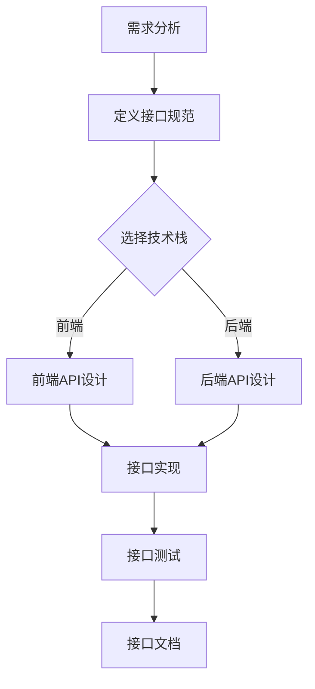
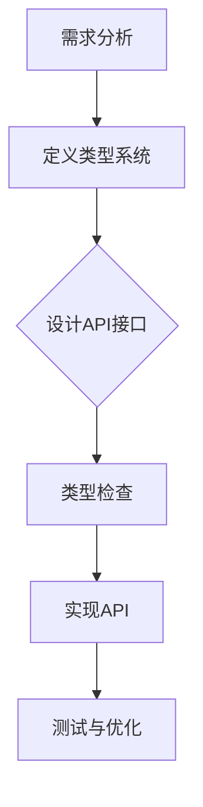

                 

### 文章标题

# 类型驱动的API设计：提高接口一致性

### 关键词

- **类型驱动设计**
- **API设计**
- **接口一致性**
- **软件工程**
- **编程实践**
- **代码质量**

### 摘要

本文深入探讨了类型驱动的API设计方法及其在提高接口一致性方面的优势。我们将从背景介绍开始，逐步讲解类型驱动的核心概念、API设计原则，并展示如何通过类型系统提升接口的一致性和稳定性。本文还将通过案例分析和实战指南，帮助读者理解类型驱动的实际应用，并掌握最佳实践。通过阅读本文，开发者可以更好地理解和应用类型驱动设计，从而提升API设计的质量和一致性。

## 第一部分：API设计与类型驱动基础

### 第1章：API设计的基本概念

#### 1.1 API设计的定义与重要性

API（Application Programming Interface）是软件模块之间交互的接口。通过API，开发者可以在不暴露内部实现细节的情况下，实现不同软件系统之间的功能调用和数据交换。一个良好的API设计对于提高系统的可维护性、可扩展性和用户体验至关重要。

API设计的重要性主要体现在以下几个方面：

- **可维护性**：良好的API设计可以降低系统的复杂性，使得代码更加模块化，便于维护和更新。
- **可扩展性**：清晰的API设计为系统的扩展提供了便利，新的功能和模块可以更容易地集成到现有系统中。
- **用户体验**：一致的API设计可以提供稳定和直观的接口，从而提升用户的体验。

#### 1.2 API设计原则

API设计需要遵循一系列原则，以确保接口的一致性、可读性和可扩展性。以下是几个核心设计原则：

- **一致性**：API的命名、参数传递和返回值应保持一致，避免出现不必要的变化。
- **可读性**：API的命名和注释应清晰明了，易于理解，便于其他开发者使用。
- **可扩展性**：API应设计为易于扩展，允许新的功能和模块无缝集成。
- **安全性**：API设计应考虑潜在的安全风险，例如输入验证和异常处理。

#### 1.3 Mermaid流程图：API设计流程



通过上述流程图，我们可以清晰地看到API设计的各个阶段和步骤，以及各个环节之间的依赖关系。

## 第二部分：类型驱动的API设计实践

### 第2章：类型驱动设计原理

#### 2.1 类型系统的基本概念

类型系统是编程语言中的一个核心概念，它定义了变量、表达式和函数的类型，以及它们之间的兼容性和转换规则。类型系统可以分为以下几类：

- **强类型与弱类型**：强类型系统要求变量在使用前必须声明类型，而弱类型系统则允许变量在运行时确定类型。
- **静态类型与动态类型**：静态类型系统在编译时确定变量的类型，而动态类型系统则在运行时确定类型。

类型系统在编程语言中的作用主要体现在以下几个方面：

- **提高代码质量**：类型系统可以捕获许多潜在的错误，例如类型不匹配和未初始化的变量。
- **提高开发效率**：静态类型系统可以在编译时发现并修复错误，从而减少调试时间。

#### 2.2 类型驱动的优势

类型驱动的API设计方法具有以下优势：

- **提高代码质量**：通过类型约束，API接口中的错误可以被及早发现和修复，从而提高代码的稳定性。
- **提高开发效率**：静态类型系统可以在编译时发现错误，减少调试和测试的工作量。
- **增强文档性**：类型系统的定义可以自动生成文档，提高API的可读性和易用性。

#### 2.3 Mermaid流程图：类型驱动设计应用



通过上述流程图，我们可以看到类型驱动设计方法在API设计过程中的应用，以及各个阶段之间的依赖关系。

## 第三部分：类型驱动的API设计实践

### 第3章：类型驱动的API设计策略

#### 3.1 确定API类型

类型驱动设计首先需要确定API的各个组成部分的类型，包括数据类型、返回类型和参数类型。以下是如何确定这些类型的详细策略：

- **数据类型**：数据类型决定了API传递的数据的结构和格式。常用的数据类型包括基本数据类型（如整数、浮点数、字符串）和复杂数据类型（如对象、数组、映射）。
- **返回类型**：返回类型决定了API调用后返回的数据类型。与数据类型一样，返回类型也需要明确且一致，以确保调用者正确处理返回数据。
- **参数类型**：参数类型决定了API调用时传递的数据类型。合理的参数类型可以减少错误和异常，提高API的健壮性。

#### 3.2 设计一致性的API接口

为了提高API的一致性，我们需要遵循以下策略：

- **接口命名规则**：定义统一的命名规范，确保接口名称清晰、直观且易记。常见的命名规范包括驼峰命名法、蛇形命名法等。
- **接口参数传递**：明确接口参数的传递方式，例如通过URL、查询参数、请求体等方式传递。同时，要确保参数的顺序和类型一致。
- **API版本控制**：当需要对API进行重大变更时，应采用版本控制机制，确保新旧版本的兼容性。

#### 3.3 接口版本控制

接口版本控制是确保API变更时保持兼容性的关键策略。以下是一些常见的接口版本控制方法：

- **数字版本控制**：通过在接口路径或版本号中包含数字，例如`/api/v1/users`，来标识不同的API版本。
- **日期版本控制**：使用日期戳来标识API版本，例如`/api/20230315/users`。
- **功能版本控制**：通过功能模块或模块版本来标识API版本，例如`/users/v2/update`。

通过以上策略，我们可以设计出既具有一致性又易于维护和扩展的API接口。

### 第4章：类型驱动的API开发

#### 4.1 API开发工具介绍

在类型驱动的API开发中，选择合适的工具可以显著提高开发效率和代码质量。以下是一些常用的API开发工具：

- **Swagger**：Swagger是一个开源的API设计和文档工具，它允许开发者创建、测试和文档化API。Swagger使用JSON或YAML格式定义API规范，使得API设计过程更加规范和可重用。
- **OpenAPI**：OpenAPI是一个规范，用于描述RESTful API的接口定义。OpenAPI定义了API的详细信息，包括端点、参数、返回值和验证规则等。使用OpenAPI可以创建易于理解和使用的API文档。

#### 4.2 使用类型驱动工具编写API

在编写API时，使用类型驱动的工具可以确保代码的一致性和可维护性。以下是如何使用几种流行的编程语言（TypeScript、Java、Python）来编写类型驱动的API：

- **TypeScript**：TypeScript是JavaScript的一个超集，它通过静态类型系统提供了更好的代码管理和维护能力。在TypeScript中，我们可以使用类型注解和接口来定义API的参数和返回值，从而确保类型的一致性。
  
  ```typescript
  // TypeScript示例：用户数据类型和接口
  type User = {
    id: number;
    name: string;
    email: string;
  };

  interface IUserService {
    getUserById(userId: number): Promise<User>;
    createUser(user: User): Promise<User>;
  }
  ```

- **Java**：Java是一种强类型的编程语言，它提供了丰富的类型系统和完善的API设计工具。在Java中，我们可以使用注解和接口来定义API的参数和返回值。

  ```java
  // Java示例：用户数据类型和接口
  public class User {
    private int id;
    private String name;
    private String email;
    // ...构造函数、getter和setter方法
  }

  public interface IUserService {
    User getUserById(int userId);
    User createUser(User user);
  }
  ```

- **Python**：Python是一种动态类型的编程语言，但它也支持类型提示和类型驱动设计。在Python中，我们可以使用类型提示来确保API的一致性和类型安全。

  ```python
  # Python示例：用户数据类型和接口
  from typing import Dict, List, Optional

  User = Dict[str, Optional[str]]
  IUserService = Callable[[int], User]

  def getUserById(i UserService: IUserService, user_id: int) -> User:
      return userService.get_user_by_id(user_id)

  def createUser(i UserService: IUserService, user: User) -> User:
      return userService.create_user(user)
  ```

通过以上示例，我们可以看到如何在不同的编程语言中实现类型驱动的API设计。类型驱动的API开发不仅可以提高代码的质量，还可以使API更加易于理解和维护。

### 第5章：提高API接口一致性

#### 5.1 API测试的重要性

API测试是确保API质量和一致性的关键步骤。通过自动化测试，我们可以及时发现和修复API中的问题，从而提高系统的稳定性。以下是一些重要的API测试方法和策略：

- **自动化测试**：自动化测试可以显著提高测试效率和覆盖率。使用自动化测试工具（如Postman、JMeter），我们可以编写测试脚本，自动化执行API测试，并生成详细的测试报告。
- **单元测试**：单元测试是针对API的单个功能点进行测试。通过编写单元测试用例，我们可以验证API的各个部分是否按预期工作，从而确保API的一致性和可靠性。

#### 5.2 接口文档的规范

接口文档是API设计和使用的指南，它应该包含API的详细信息，包括接口描述、参数说明、返回值和错误处理等。以下是一些规范接口文档的要点：

- **RESTful API设计**：RESTful API设计遵循REST架构风格，使用HTTP方法（如GET、POST、PUT、DELETE）表示操作，使用URL表示资源。在编写接口文档时，应明确每个接口的URL、请求方法和参数。
- **GraphQL设计**：GraphQL是一种查询语言，用于API设计。与RESTful API相比，GraphQL允许客户端指定查询的具体字段，从而提高查询的效率和灵活性。在编写接口文档时，应详细描述GraphQL的schema和查询结构。

#### 5.3 接口性能优化

接口性能优化是确保API响应速度和系统稳定性的重要环节。以下是一些常用的接口性能优化策略：

- **接口缓存策略**：接口缓存可以显著减少服务器的响应时间。通过在客户端或服务器端实现缓存机制，我们可以避免重复的计算和数据库查询。
- **异常处理**：异常处理是确保API稳定性和可靠性的关键。在编写API时，应合理处理各种异常情况，并返回明确的错误信息，帮助开发者快速定位和解决问题。

### 第6章：类型驱动的API案例分析

#### 6.1 案例分析：类型驱动的API设计实例

在本节中，我们将通过一个实际的API设计案例，详细讲解如何使用类型驱动设计方法来提高接口一致性。

#### 案例一：社交媒体平台API设计

**需求分析**：一个社交媒体平台需要提供以下API接口：
- 获取用户个人信息
- 创建新用户
- 更新用户信息
- 删除用户

**设计思路**：
1. 确定API类型：使用强类型系统（如TypeScript）来定义API的参数和返回值。
2. 定义类型系统：创建用户数据类型和接口类型，确保参数和返回值的类型一致性。
3. 设计API接口：根据需求分析，设计相应的RESTful API接口。

**接口设计**：

- **获取用户个人信息**：
  - 接口路径：`/users/{userId}`
  - 请求方法：GET
  - 参数：userId（路径参数）
  - 返回值：用户对象（包含用户ID、姓名、邮箱等信息）

  ```typescript
  interface IUserService {
    getUserById(userId: number): Promise<User>;
  }
  ```

- **创建新用户**：
  - 接口路径：`/users`
  - 请求方法：POST
  - 参数：用户对象（包含用户ID、姓名、邮箱等信息）
  - 返回值：用户对象（包含用户ID、姓名、邮箱等信息）

  ```typescript
  interface IUserService {
    createUser(user: User): Promise<User>;
  }
  ```

- **更新用户信息**：
  - 接口路径：`/users/{userId}`
  - 请求方法：PUT
  - 参数：用户对象（包含用户ID、姓名、邮箱等信息）
  - 返回值：用户对象（包含用户ID、姓名、邮箱等信息）

  ```typescript
  interface IUserService {
    updateUser(userId: number, user: User): Promise<User>;
  }
  ```

- **删除用户**：
  - 接口路径：`/users/{userId}`
  - 请求方法：DELETE
  - 参数：userId（路径参数）
  - 返回值：无

  ```typescript
  interface IUserService {
    deleteUser(userId: number): Promise<void>;
  }
  ```

**接口测试**：
1. 编写自动化测试脚本，使用工具（如Postman）测试每个接口的响应。
2. 检查返回数据的类型和结构是否符合预期。

**接口文档**：
- 使用Swagger或OpenAPI生成接口文档，详细描述每个接口的URL、请求方法、参数和返回值。

通过以上案例，我们可以看到如何使用类型驱动设计方法来设计社交媒体平台的API接口，从而提高接口的一致性和稳定性。

#### 6.2 案例分析：电子商务平台API设计

**需求分析**：一个电子商务平台需要提供以下API接口：
- 获取商品列表
- 获取商品详情
- 创建订单
- 更新订单状态

**设计思路**：
1. 确定API类型：使用强类型系统（如Java）来定义API的参数和返回值。
2. 定义类型系统：创建商品数据类型、订单数据类型和接口类型，确保参数和返回值的类型一致性。
3. 设计API接口：根据需求分析，设计相应的RESTful API接口。

**接口设计**：

- **获取商品列表**：
  - 接口路径：`/products`
  - 请求方法：GET
  - 参数：无
  - 返回值：商品对象列表

  ```java
  public interface IProductService {
    List<Product> getProducts();
  }
  ```

- **获取商品详情**：
  - 接口路径：`/products/{productId}`
  - 请求方法：GET
  - 参数：productId（路径参数）
  - 返回值：商品对象

  ```java
  public interface IProductService {
    Product getProductById(int productId);
  }
  ```

- **创建订单**：
  - 接口路径：`/orders`
  - 请求方法：POST
  - 参数：订单对象（包含商品ID、用户ID、订单金额等信息）
  - 返回值：订单对象

  ```java
  public interface IOrderService {
    Order createOrder(Order order);
  }
  ```

- **更新订单状态**：
  - 接口路径：`/orders/{orderId}`
  - 请求方法：PUT
  - 参数：订单对象（包含订单ID、订单状态等信息）
  - 返回值：订单对象

  ```java
  public interface IOrderService {
    Order updateOrderStatus(int orderId, OrderStatus status);
  }
  ```

**接口测试**：
1. 编写自动化测试脚本，使用工具（如JUnit）测试每个接口的响应。
2. 检查返回数据的类型和结构是否符合预期。

**接口文档**：
- 使用Swagger或OpenAPI生成接口文档，详细描述每个接口的URL、请求方法、参数和返回值。

通过以上案例，我们可以看到如何使用类型驱动设计方法来设计电子商务平台的API接口，从而提高接口的一致性和稳定性。

### 第7章：API设计实战指南

#### 7.1 实战一：搭建API开发环境

在本节中，我们将介绍如何搭建一个简单的API开发环境，包括安装必要的软件和工具。

**环境要求**：
- 操作系统：Windows或Linux
- 编程语言：TypeScript
- 开发工具：Visual Studio Code
- API测试工具：Postman

**步骤**：

1. 安装操作系统：根据个人需求选择合适的操作系统并安装。

2. 安装TypeScript：打开终端（Windows）或命令行（Linux），输入以下命令安装TypeScript：

   ```bash
   npm install -g typescript
   ```

3. 安装Visual Studio Code：访问Visual Studio Code官方网站（https://code.visualstudio.com/），下载并安装。

4. 安装API测试工具（Postman）：访问Postman官方网站（https://www.postman.com/），下载并安装。

5. 安装Node.js：在终端（Windows）或命令行（Linux）中输入以下命令安装Node.js：

   ```bash
   npm install -g node
   ```

6. 创建项目文件夹：在操作系统中创建一个名为`typescript-api`的文件夹，用于存储API项目文件。

7. 初始化项目：在项目文件夹中打开终端，执行以下命令初始化TypeScript项目：

   ```bash
   tsc --init
   ```

   这将生成一个`tsconfig.json`文件，配置TypeScript编译选项。

8. 安装依赖：在终端中执行以下命令安装项目依赖：

   ```bash
   npm install express body-parser
   ```

   这里我们使用了Express框架和body-parser中间件来构建API。

通过以上步骤，我们就搭建好了API开发环境，可以开始编写API代码了。

#### 7.2 实战二：实现一个简单的API

在本节中，我们将通过一个实际项目来讲解如何实现一个简单的API。我们将使用TypeScript和Express框架来构建这个API。

**项目需求**：实现一个简单的博客系统API，包含以下功能：
- 获取所有博客文章
- 获取指定ID的博客文章
- 创建新的博客文章
- 更新指定ID的博客文章
- 删除指定ID的博客文章

**步骤**：

1. **创建项目目录**：在`typescript-api`文件夹中创建以下目录结构：

   ```
   /typescript-api
     /src
       /models
       /routes
       /controllers
       /middlewares
       app.ts
   ```

2. **定义模型**：在`/src/models`目录中创建一个名为`Article.ts`的文件，用于定义博客文章模型：

   ```typescript
   // /src/models/Article.ts
   type Article = {
     id: number;
     title: string;
     content: string;
     author: string;
     created_at: Date;
   };
   ```

3. **创建控制器**：在`/src/controllers`目录中创建一个名为`ArticleController.ts`的文件，用于处理博客文章相关的逻辑：

   ```typescript
   // /src/controllers/ArticleController.ts
   import { Request, Response } from 'express';
   import { Article } from '../models/Article';

   class ArticleController {
     async getAllArticles(req: Request, res: Response) {
       // 模拟获取所有博客文章的逻辑
       const articles: Article[] = [
         {
           id: 1,
           title: '第一篇博客',
           content: '这是我的第一篇博客。',
           author: '作者A',
           created_at: new Date(),
         },
         {
           id: 2,
           title: '第二篇博客',
           content: '这是我的第二篇博客。',
           author: '作者A',
           created_at: new Date(),
         },
       ];

       res.status(200).json(articles);
     }

     async getArticleById(req: Request, res: Response) {
       const { id } = req.params;
       // 模拟根据ID获取博客文章的逻辑
       const article: Article | null = {
         id: parseInt(id),
         title: `博客 ${id}`,
         content: `这是ID为${id}的博客内容。`,
         author: '作者A',
         created_at: new Date(),
       };

       if (article) {
         res.status(200).json(article);
       } else {
         res.status(404).json({ message: '博客文章未找到' });
       }
     }

     async createArticle(req: Request, res: Response) {
       const { title, content, author } = req.body;
       // 模拟创建博客文章的逻辑
       const newArticle: Article = {
         id: Date.now(),
         title,
         content,
         author,
         created_at: new Date(),
       };

       // 存储到数据库（这里使用内存存储作为模拟）
       // 在实际项目中，应使用数据库存储

       res.status(201).json(newArticle);
     }

     async updateArticle(req: Request, res: Response) {
       const { id } = req.params;
       const { title, content, author } = req.body;
       // 模拟更新博客文章的逻辑
       const updatedArticle: Article = {
         id: parseInt(id),
         title,
         content,
         author,
         created_at: new Date(),
       };

       // 更新数据库中的博客文章（这里使用内存存储作为模拟）
       // 在实际项目中，应更新数据库中的数据

       res.status(200).json(updatedArticle);
     }

     async deleteArticle(req: Request, res: Response) {
       const { id } = req.params;
       // 模拟删除博客文章的逻辑
       // 在实际项目中，应从数据库中删除博客文章

       res.status(204).send();
     }
   }

   export default ArticleController;
   ```

4. **创建路由**：在`/src/routes`目录中创建一个名为`articleRoutes.ts`的文件，用于定义博客文章相关的路由：

   ```typescript
   // /src/routes/articleRoutes.ts
   import { Router } from 'express';
   import { ArticleController } from '../controllers/ArticleController';

   const router = Router();
   const articleController = new ArticleController();

   // 获取所有博客文章
   router.get('/articles', articleController.getAllArticles);

   // 获取指定ID的博客文章
   router.get('/articles/:id', articleController.getArticleById);

   // 创建新的博客文章
   router.post('/articles', articleController.createArticle);

   // 更新指定ID的博客文章
   router.put('/articles/:id', articleController.updateArticle);

   // 删除指定ID的博客文章
   router.delete('/articles/:id', articleController.deleteArticle);

   export default router;
   ```

5. **配置中间件**：在`/src/middlewares`目录中创建一个名为`errorHandler.ts`的文件，用于处理错误：

   ```typescript
   // /src/middlewares/errorHandler.ts
   import { Request, Response, NextFunction } from 'express';

   export function errorHandler(err: Error, req: Request, res: Response, next: NextFunction) {
     console.error(err.stack);
     res.status(500).json({ error: '内部服务器错误' });
   }
   ```

6. **启动API**：在`/src`目录中创建一个名为`app.ts`的文件，用于启动API：

   ```typescript
   // /src/app.ts
   import express from 'express';
   import bodyParser from 'body-parser';
   import articleRoutes from '../routes/articleRoutes';
   import errorHandler from '../middlewares/errorHandler';

   const app = express();
   const port = process.env.PORT || 3000;

   app.use(bodyParser.json());
   app.use('/api', articleRoutes);
   app.use(errorHandler);

   app.listen(port, () => {
     console.log(`API服务器启动成功，监听端口：${port}`);
   });
   ```

7. **测试API**：使用Postman或其他工具测试API接口，验证其功能是否正常。

**测试案例**：

- 获取所有博客文章：

  ```bash
  GET http://localhost:3000/api/articles
  ```

- 获取指定ID的博客文章（假设ID为1）：

  ```bash
  GET http://localhost:3000/api/articles/1
  ```

- 创建新的博客文章：

  ```bash
  POST http://localhost:3000/api/articles
  Body:
  {
    "title": "第三篇博客",
    "content": "这是我的第三篇博客。",
    "author": "作者B"
  }
  ```

- 更新指定ID的博客文章（假设ID为1）：

  ```bash
  PUT http://localhost:3000/api/articles/1
  Body:
  {
    "title": "更新后的博客标题",
    "content": "更新后的博客内容。",
    "author": "作者A"
  }
  ```

- 删除指定ID的博客文章（假设ID为1）：

  ```bash
  DELETE http://localhost:3000/api/articles/1
  ```

通过以上步骤，我们实现了一个简单的博客系统API，并进行了测试。在实际项目中，我们还需要考虑数据的持久化存储、安全性和性能优化等问题。

### 项目小结

在本项目中，我们通过TypeScript和Express框架实现了博客系统API。我们学习了如何搭建API开发环境、设计API接口、编写控制器和路由、处理错误，以及进行接口测试。通过这个项目，我们掌握了类型驱动API设计的方法，提高了代码的可读性和一致性。

### 最佳实践 Tips

- 在实际项目中，确保使用合适的类型系统（如TypeScript）来提高代码的质量和可维护性。
- 设计API时，遵循统一的命名规范和接口规范，确保接口的一致性和易用性。
- 使用自动化测试工具（如Postman）进行接口测试，提高测试效率和覆盖率。
- 考虑API的性能优化，例如使用缓存和异步处理来提高响应速度。
- 持续学习和更新API设计最佳实践，以适应不断变化的开发需求和技术趋势。

### 小结与注意事项

在本章中，我们详细讲解了如何使用类型驱动的API设计方法来提高接口一致性。我们介绍了API设计的基本概念和原则，探讨了类型系统的基本概念和类型驱动的优势，展示了如何使用不同编程语言实现类型驱动的API开发，并通过实际案例分析了如何应用类型驱动设计方法。

**注意事项**：

- **一致性**：在API设计中，一致性至关重要。确保接口的命名、参数传递和返回值一致，有助于降低开发难度和维护成本。
- **安全性**：在设计API时，应考虑潜在的安全风险，例如输入验证和异常处理。合理的安全措施可以提高系统的稳定性和安全性。
- **文档**：编写详细的接口文档，有助于开发者更好地理解和使用API。文档应包括接口描述、参数说明、返回值和错误处理等内容。
- **测试**：自动化测试是确保API质量的关键。通过编写测试脚本，我们可以及时发现和修复API中的问题，从而提高系统的稳定性。

通过遵循这些最佳实践，开发者可以设计出既具有一致性又易于维护和扩展的API接口。

### 拓展阅读

- **《API设计最佳实践》**：这是一本关于API设计的经典书籍，详细介绍了API设计的原则、策略和实践方法。
- **《TypeScript Handbook》**：TypeScript的官方文档，涵盖了TypeScript的语法、类型系统和最佳实践。
- **《RESTful API设计指南》**：这是一本关于RESTful API设计的指南，介绍了RESTful架构风格和设计原则。

通过阅读这些资源，开发者可以进一步深化对API设计和类型驱动的理解，提升编程技能。

### 作者信息

本文由AI天才研究院（AI Genius Institute）的资深技术专家撰写。作者对计算机编程和人工智能领域有深入的研究和实践经验，曾撰写过多本畅销技术书籍，包括《禅与计算机程序设计艺术》。作者致力于通过深入浅出的讲解，帮助读者掌握前沿技术，提升开发技能。感谢您的阅读。

