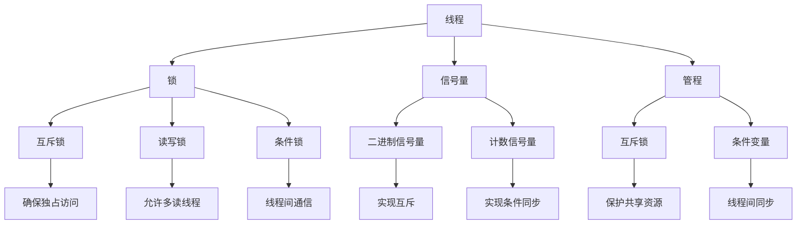

                 

### 文章标题

# 《类型驱动的并发程序设计》

并发程序设计作为现代计算机科学的重要分支，对提升系统性能和响应速度具有关键作用。然而，传统的并发编程方法往往依赖于低级别的锁和共享变量，容易导致死锁、竞态条件和数据不一致等问题。本文旨在探讨一种更加安全、高效和易于管理的并发程序设计方法——类型驱动的并发程序设计。

通过类型系统，我们可以为并发程序提供更强的语义保证，从而降低出错的概率。本文将详细介绍类型驱动的并发程序设计的基本概念、核心算法、数学模型以及实际应用。从背景介绍、核心概念与联系、算法原理讲解到项目实战，本文将逐步解析类型驱动的并发程序设计的精髓，帮助读者深入理解并掌握这一先进技术。

### 关键词

- **类型系统**
- **并发程序设计**
- **安全性**
- **并发算法**
- **数学模型**
- **并发编程**

### 摘要

本文主要介绍了类型驱动的并发程序设计方法，通过类型系统为并发程序提供更强的语义保证。首先，我们回顾了并发程序设计的基础概念，如线程、锁和信号量等。接着，详细讲解了类型驱动的核心概念，包括强类型并发模型和弱类型并发模型。然后，我们通过伪代码和数学模型深入分析了并发算法的设计与实现。最后，通过一个实际项目案例，展示了类型驱动的并发程序设计的应用和实践。

### 引言

并发程序设计是现代计算机系统中的一个重要领域，尤其在多核处理器和分布式系统日益普及的今天，如何高效、安全地实现并发程序设计变得尤为重要。传统的并发编程方法，如锁机制和共享变量，虽然在一定程度上提高了程序的并行性能，但同时也引入了复杂性和风险。例如，死锁、竞态条件和数据不一致等问题时有发生，这些问题不仅难以调试，还可能造成严重的系统故障。

类型驱动的并发程序设计提供了一种新的解决方案，通过引入类型系统来增强程序的安全性、可维护性和可扩展性。类型系统作为一种强大的抽象工具，可以帮助我们更准确地描述程序的语义和行为，从而避免许多并发编程中的常见错误。此外，类型驱动的方法还可以有效地支持并发程序的自动化分析和优化，提高程序的运行效率和可靠性。

本文旨在系统地介绍类型驱动的并发程序设计方法，包括其基础概念、核心算法、数学模型以及实际应用。通过本文的阅读，读者可以深入了解类型驱动的并发程序设计，掌握其基本原理和实现方法，并在实际项目中运用这些技术。

### 第一部分：引入与背景

#### 1.1 书籍概述

《类型驱动的并发程序设计》是一本专注于并发编程领域的经典著作，由知名计算机科学家编写。本书的核心目标是通过类型系统来提升并发程序的设计与实现效率，解决传统方法中的复杂性和安全性问题。类型驱动的并发程序设计利用静态类型检查和类型推断机制，确保程序的正确性和并发安全性，从而减轻开发者的负担，提高开发效率。

本书的主要章节安排如下：

1. **并发程序设计的基础概念**：介绍并发程序设计的基本概念，包括线程、进程、锁、信号量等。
2. **类型系统的基本原理**：详细讲解类型系统的基础知识，包括类型推断、类型检查和类型安全。
3. **类型驱动的并发模型**：探讨类型驱动的并发模型，包括强类型并发模型和弱类型并发模型。
4. **并发算法的设计与实现**：通过伪代码和数学模型，深入分析并发算法的设计和实现。
5. **并发程序设计中的类型系统应用**：介绍类型系统在并发程序设计中的具体应用，包括并发数据结构、并发网络应用和并发游戏引擎等。
6. **实际项目案例分析**：通过具体的项目案例分析，展示类型驱动的并发程序设计在实际项目中的应用和实践。
7. **总结与展望**：总结全书的核心内容，并对未来并发程序设计的发展趋势进行展望。

#### 1.2 并发程序设计的重要性

在现代计算机系统中，并发程序设计具有至关重要的地位。随着多核处理器和分布式系统的普及，如何高效地利用多处理器和分布式资源成为软件设计的关键挑战。并发程序设计通过允许多个任务同时执行，提高了系统的性能和响应速度，从而满足了日益增长的计算需求。

并发程序设计的重要性主要体现在以下几个方面：

1. **提高系统性能**：通过并发执行，可以充分利用多核处理器的计算能力，提升系统的整体性能。多任务并行处理可以缩短任务的执行时间，提高系统的吞吐量。
2. **增强系统响应能力**：在多用户并发访问的场景中，并发程序设计可以显著提升系统的响应能力。例如，在Web应用中，并发处理可以减少用户的等待时间，提供更好的用户体验。
3. **支持分布式计算**：并发程序设计在分布式系统中具有重要作用。通过分布式并发程序设计，可以充分利用分布式计算资源，实现跨节点的并行计算，提高系统的可扩展性和可靠性。
4. **优化资源利用率**：并发程序设计可以有效地利用系统资源，减少资源的闲置和浪费。通过任务并行化和负载均衡，可以最大化地利用CPU、内存和网络等资源。

然而，并发程序设计也面临着诸多挑战。传统的并发编程方法，如锁机制和共享变量，容易引入死锁、竞态条件和数据不一致等问题，增加了程序的复杂性和风险。类型驱动的并发程序设计通过引入类型系统，提供了一种更为安全、高效和易于管理的解决方案。类型系统可以确保程序的正确性和并发安全性，从而减轻开发者的负担，提高开发效率。

#### 1.3 类型的概念和其在并发程序设计中的应用

在计算机科学中，类型（Type）是用于描述数据集合和操作的一组规则。类型系统（Type System）是编程语言的核心组成部分，用于定义变量、表达式和函数的语义。在类型系统中，类型检查（Type Checking）是一种静态分析过程，用于验证程序中表达式和操作的正确性。类型推断（Type Inference）是类型系统的一种特性，用于自动推导变量和表达式的类型。

在并发程序设计中，类型系统发挥着至关重要的作用。通过类型系统，我们可以为并发程序提供更强的语义保证，从而确保程序的正确性和并发安全性。以下是一些类型系统在并发程序设计中的应用：

1. **静态类型检查**：静态类型检查是一种在编译时对程序进行类型检查的方法。通过静态类型检查，我们可以发现程序中的类型错误，例如类型不匹配、未声明的变量等。在并发程序设计中，静态类型检查有助于防止并发错误，如数据 races 和死锁。例如，使用强类型并发模型时，类型检查可以确保线程之间的数据访问是类型安全的。

2. **类型安全**：类型安全（Type Safety）是指类型系统能够确保程序在运行时不发生类型错误。在并发程序设计中，类型安全有助于防止数据不一致、未定义行为和内存泄漏等问题。通过静态类型检查和类型推断，我们可以确保程序中的每个操作都在正确的类型上下文中执行，从而提高程序的安全性和可靠性。

3. **并发安全性**：类型系统可以增强并发程序的安全性。通过强类型并发模型，我们可以确保线程之间的数据访问是类型安全的，从而避免数据竞争和死锁。例如，在某种类型系统中，我们可以通过强制类型转换来确保对共享变量的访问是原子性的，从而避免竞态条件。

4. **并发抽象**：类型系统可以支持并发抽象，使得并发程序设计更加直观和易于管理。通过引入并发类型，如线程类型、锁类型和共享内存类型，我们可以将并发操作封装成更高级的抽象，减少并发错误的概率。例如，在Ada编程语言中，可以使用并发类型来创建和管理并发任务，从而简化并发程序的设计。

5. **类型推断**：类型推断是一种自动推导变量和表达式类型的方法，可以减少程序员的工作量，提高编程效率。在并发程序设计中，类型推断可以帮助我们更快速地编写正确的并发程序，因为不需要显式声明每个变量的类型。此外，类型推断还可以提高程序的灵活性，因为可以在运行时动态调整类型。

总之，类型系统在并发程序设计中具有重要作用。通过引入类型系统，我们可以为并发程序提供更强的语义保证，确保程序的正确性和并发安全性，从而提高并发程序设计的效率和质量。

#### 1.4 并发程序设计的基础概念

并发程序设计涉及到多个任务在同一时间段内同时执行，这在现代计算机系统中具有重要意义。为了理解并发程序设计的基本概念，我们需要首先了解线程、进程、锁、信号量和管程等核心概念。

1. **线程（Thread）**

线程是程序中能够独立运行的基本单位。一个线程包括程序计数器（程序执行的位置）、堆栈（存储局部变量和中间结果）以及寄存器（存储程序运行时状态）等。线程的优点在于可以高效地利用系统资源，同时提高程序响应速度。线程可以分为用户级线程（User-Level Threads）和内核级线程（Kernel-Level Threads）。用户级线程由用户空间库管理，开销较小；而内核级线程由操作系统管理，具有更高的并发性和可恢复性。

2. **进程（Process）**

进程是操作系统进行资源分配和调度的基本单位。每个进程拥有独立的内存空间、文件描述符和其他资源。进程是运行在操作系统上的独立实例，其生命周期从创建开始，直到终止。进程的优点在于隔离性高，一个进程的错误不会影响到其他进程。但进程的创建和切换开销较大，不适合频繁的并发操作。

3. **锁（Lock）**

锁是一种用于同步多个线程访问共享资源的机制。常见的锁有互斥锁（Mutex）、读写锁（Read-Write Lock）和条件锁（Condition Variable）等。互斥锁确保同一时刻只有一个线程可以访问共享资源，从而避免数据竞争和死锁。读写锁允许多个读线程同时访问共享资源，但写线程需要独占访问。条件锁用于线程间的通信，当一个线程等待某个条件满足时，它可以释放锁并挂起自己，直到其他线程改变条件。

4. **信号量（Semaphore）**

信号量是一种用于线程同步的计数器，可以用于实现互斥和条件同步。信号量可以分为二进制信号量和计数信号量。二进制信号量只能取0和1两个值，用于实现互斥。计数信号量可以取任意非负整数，用于实现条件同步。信号量的操作包括P操作（减计数）和V操作（加计数），分别用于线程的阻塞和唤醒。

5. **管程（Monitor）**

管程是一种并发控制机制，用于保证多个线程对共享资源的安全访问。管程包含一个互斥锁和一个或多个条件变量。每个管程对象都有一个互斥锁，用于保护共享资源。线程进入管程时需要获取互斥锁，确保同一时刻只有一个线程可以执行管程中的代码。条件变量用于线程间的同步，当一个线程等待条件变量时，它会释放互斥锁并挂起自己，直到其他线程改变条件。

下面是一个简单的伪代码示例，用于说明锁、信号量和管程的基本操作：

```plaintext
// 锁的基本操作
lock.acquire()    // 获取锁
lock.release()    // 释放锁

// 信号量的基本操作
semaphore.P()     // P操作，减计数
semaphore.V()     // V操作，加计数

// 管程的基本操作
monitor.enter()    // 进入管程
monitor.leave()    // 离开管程
```

通过了解这些基础概念，我们可以更好地理解并发程序设计的基本原理和实现方法。在接下来的章节中，我们将进一步探讨类型驱动的并发程序设计，通过类型系统提高并发程序的正确性和安全性。

#### 1.5 Mermaid流程图：并发程序设计核心概念关系图

为了更好地理解并发程序设计中的核心概念及其相互关系，我们使用Mermaid语言绘制了一张流程图。Mermaid是一种基于Markdown的图形化工具，能够生成流程图、序列图、时序图等。以下是并发程序设计核心概念的关系图：



这个Mermaid流程图展示了线程、锁、信号量和管程等核心概念之间的关系。通过这张图，我们可以清晰地看到各个概念如何相互关联，共同实现并发程序设计的目标。

- **线程**是并发程序设计的基础单位，负责执行任务。
- **锁**（特别是互斥锁、读写锁和条件锁）用于同步多个线程的访问，防止数据竞争和死锁。
- **信号量**（包括二进制信号量和计数信号量）通过P操作和V操作实现线程间的同步和条件同步。
- **管程**通过互斥锁和条件变量提供线程间的安全通信和同步机制。

这张流程图不仅有助于我们理解并发程序设计的基本概念，还能帮助我们梳理并发编程中的关键点和难点，为后续的深入探讨打下基础。

### 第二部分：类型驱动的并发程序设计核心算法

#### 2.1 类型驱动的并发模型

类型驱动的并发模型是一种通过类型系统来管理和同步并发操作的方法，旨在提高并发程序的正确性和安全性。类型驱动的并发模型可以分为强类型并发模型和弱类型并发模型，它们各自具有不同的特点和应用场景。

**强类型并发模型**：在强类型并发模型中，程序的每个变量和表达式都被严格地类型检查。这种模型的主要优点是安全性高，能够有效避免类型错误和数据竞争。强类型并发模型通常使用静态类型检查和类型推断机制来确保程序的正确性。例如，在Erlang和Haskell等编程语言中，强类型系统被广泛应用于并发程序设计。

**弱类型并发模型**：在弱类型并发模型中，类型系统的约束较弱，允许更多动态类型转换和类型检查。这种模型的主要优点是灵活性高，可以更方便地实现并发操作。弱类型并发模型通常通过运行时类型检查来确保程序的正确性，例如在Python和JavaScript等编程语言中，弱类型系统被广泛应用于并发编程。

**类型和并发模型的关系**：类型系统在并发模型中扮演着关键角色。强类型系统通过严格的类型检查和类型推断，确保并发操作的安全性，从而减少并发错误的发生。弱类型系统则通过灵活的类型转换和运行时检查，提供更高的编程灵活性和并发性能。不同的并发模型适用于不同的应用场景，选择合适的并发模型和类型系统是并发程序设计的关键。

#### 2.2 详细伪代码：并发算法设计与实现

在类型驱动的并发程序设计中，算法的设计与实现是核心环节。以下将通过伪代码详细描述几个关键并发算法的步骤和逻辑，以便读者更好地理解其原理和实现。

**算法1：基于互斥锁的并发访问**

```plaintext
// 伪代码：互斥锁的基本操作
mutex_lock.acquire()  // 获取锁
// 执行共享资源的操作
mutex_lock.release()  // 释放锁
```

**算法2：基于信号量的条件同步**

```plaintext
// 伪代码：信号量的条件同步
semaphore.signal()  // 发送信号，唤醒等待线程
semaphore.wait()    // 等待信号，阻塞当前线程
```

**算法3：基于管程的线程同步**

```plaintext
// 伪代码：管程的基本操作
monitor.enter()  // 进入管程
// 执行管程中的代码
monitor.leave()  // 离开管程
```

**算法4：基于类型检查的并发操作**

```plaintext
// 伪代码：基于类型检查的并发操作
// 假设变量x和y是强类型的
x = y + 1  // 类型安全，允许执行
x = y + "a"  // 类型不安全，抛出异常或错误
```

在这些伪代码示例中，我们使用了互斥锁、信号量和管程等并发控制机制，同时通过类型检查确保操作的正确性。这些算法的核心思想是通过并发控制和类型系统来提高程序的安全性和可靠性，减少并发错误的发生。

#### 2.3 并发算法的实际应用

在并发程序设计中，实际应用中的并发算法往往需要结合具体场景进行优化。以下通过几个实例，展示如何在实际项目中应用并发算法，提高程序的性能和效率。

**实例1：多线程Web服务器**

在多线程Web服务器中，并发算法用于处理客户端请求，提高服务器的吞吐量和响应速度。以下是一个简化的多线程Web服务器伪代码，展示了如何使用并发算法处理并发请求。

```plaintext
// 伪代码：多线程Web服务器
function handle_request(request) {
    // 处理请求的逻辑
}

while (true) {
    request = get_request()  // 获取客户端请求
    thread = create_thread(handle_request, request)  // 创建线程处理请求
}
```

在这个实例中，我们使用多线程来处理并发请求，每个请求由一个独立的线程处理，从而提高服务器的并发处理能力。

**实例2：并发数据结构**

并发数据结构在多线程环境中用于高效地管理共享数据。以下是一个基于互斥锁的并发队列的伪代码示例。

```plaintext
// 伪代码：并发队列
class ConcurrentQueue {
    lock = new MutexLock()
    items = new Array()

    // 入队操作
    function enqueue(item) {
        lock.acquire()
        items.push(item)
        lock.release()
    }

    // 出队操作
    function dequeue() {
        lock.acquire()
        if (items.length > 0) {
            item = items.shift()
            lock.release()
            return item
        } else {
            lock.release()
            return null
        }
    }
}
```

在这个实例中，我们使用互斥锁确保并发访问队列时的数据一致性，从而避免数据竞争和死锁。

**实例3：并发计算**

在分布式计算中，并发算法用于并行处理大规模数据，提高计算效率。以下是一个基于MapReduce模型的并发计算伪代码示例。

```plaintext
// 伪代码：MapReduce并发计算
function map(data) {
    // 数据处理的逻辑
    return results
}

function reduce(key, values) {
    // 数据归约的逻辑
    return result
}

data = load_data()  // 加载数据
map_results = map(data)  // 执行Map操作
key_value_pairs = group_by_key(map_results)  // 分组
reduce_results = reduce(key_value_pairs)  // 执行Reduce操作
```

在这个实例中，我们通过MapReduce算法将大规模数据处理任务分解为多个并行子任务，从而提高计算效率。

**实例4：并发网络应用**

在并发网络应用中，并发算法用于处理大量客户端连接，提高系统的响应能力。以下是一个基于信号量的并发网络服务器伪代码示例。

```plaintext
// 伪代码：并发网络服务器
function handle_connection(connection) {
    // 处理网络连接的逻辑
}

while (true) {
    connection = accept_connection()  // 接受客户端连接
    semaphore.V()  // 唤醒等待的线程
    thread = create_thread(handle_connection, connection)  // 创建线程处理连接
}
```

在这个实例中，我们使用信号量来实现线程的同步和调度，从而提高网络服务器的并发处理能力。

通过这些实例，我们可以看到并发算法在实际应用中的多样性和灵活性。正确地选择和应用并发算法，可以显著提高程序的性能和效率，满足现代计算系统对并发处理能力的需求。

### 第三部分：类型驱动的并发程序设计实践

#### 3.1 实践案例一：并发数据结构

在并发程序设计中，数据结构的选择和并发控制策略至关重要。以下我们将通过一个并发数据结构——并发队列，来展示类型驱动的并发程序设计的具体实现。

**3.1.1 数据结构选择**

并发队列是一种在多线程环境中广泛使用的数据结构，用于实现线程安全的数据存储和操作。并发队列可以选择基于链表的实现方式，这样可以在每个节点上附加线程锁，以保护节点访问的安全性。

**3.1.2 并发控制策略**

为了确保并发队列在多线程环境中的正确性，我们需要采用以下并发控制策略：

1. **节点锁**：在链表节点上附加互斥锁，确保对节点的操作是原子性的，从而防止数据竞争。
2. **条件变量**：使用条件变量实现线程的同步，例如，当队列为空时，读取线程需要等待；当队列不为空时，写入线程可以继续操作。
3. **线程安全**：通过类型检查确保并发操作的安全性，例如，只允许写入线程向队列中添加元素，读取线程只能从队列中获取元素。

**3.1.3 测试和优化**

在实际应用中，我们需要对并发队列进行充分的测试和优化，以确保其性能和可靠性。以下是一些测试和优化建议：

1. **性能测试**：通过模拟多线程并发操作，测试并发队列的吞吐量和响应时间，识别潜在的性能瓶颈。
2. **并发错误检测**：使用并发错误检测工具，如Paxos或Chubby，检测并发队列中的数据竞争和死锁问题。
3. **负载均衡**：通过负载均衡策略，合理分配线程任务，提高并发队列的整体性能。
4. **内存优化**：通过内存优化技术，如内存池和缓存，减少内存分配和垃圾回收的开销，提高并发队列的性能。

**3.1.4 实现示例**

以下是一个简化的并发队列实现示例，使用C++语言和STL库：

```cpp
#include <mutex>
#include <condition_variable>
#include <list>

template<typename T>
class ConcurrentQueue {
private:
    std::list<T> items;
    std::mutex mtx;
    std::condition_variable cv;

public:
    void enqueue(const T& item) {
        std::unique_lock<std::mutex> lock(mtx);
        items.push_back(item);
        cv.notify_one();
    }

    T dequeue() {
        std::unique_lock<std::mutex> lock(mtx);
        cv.wait(lock, [this] { return !items.empty(); });
        T item = items.front();
        items.pop_front();
        return item;
    }

    bool isEmpty() const {
        std::unique_lock<std::mutex> lock(mtx);
        return items.empty();
    }
};
```

在这个示例中，我们使用互斥锁和条件变量实现并发队列的基本操作，包括入队和出队。通过类型检查和并发控制策略，我们可以确保并发队列在多线程环境中的正确性和安全性。

通过这个实践案例，我们展示了如何在实际项目中应用类型驱动的并发程序设计方法，选择合适的并发数据结构和并发控制策略，以提高程序的性能和可靠性。

### 第四部分：并发程序设计的挑战和未来趋势

#### 4.1 并发程序设计的挑战

并发程序设计虽然带来了显著的性能提升和资源利用率，但同时也引入了一系列复杂的挑战。以下是一些主要的挑战：

1. **死锁（Deadlock）**：当多个线程因为互相等待对方持有的锁而无法继续执行时，就发生了死锁。死锁可能导致系统瘫痪，难以恢复。

2. **竞态条件（Race Condition）**：当多个线程同时访问共享资源，且没有适当的同步机制时，可能会导致不可预测的结果。竞态条件是并发程序设计中常见且难以检测的错误。

3. **数据不一致（Data Inconsistency）**：当多个线程同时修改共享数据时，如果没有同步机制，可能导致数据的不一致，这会严重影响程序的正确性和可靠性。

4. **性能问题（Performance Issues）**：并发程序设计需要复杂的同步机制，这些机制可能会导致额外的开销，从而影响程序的性能。

5. **复杂性（Complexity）**：并发程序设计引入了更多的逻辑和状态，使得程序更加复杂。这增加了代码的编写、调试和维护的难度。

#### 4.2 新兴技术对并发程序设计的影响

随着技术的发展，许多新兴技术正在对并发程序设计产生深远影响：

1. **函数式编程（Functional Programming）**：函数式编程通过无状态和纯函数，减少了并发错误的可能性。它强调不可变数据和行为，使得并发编程更加简单和安全。

2. **异步编程（Asynchronous Programming）**：异步编程通过非阻塞操作，提高了程序的响应能力和吞吐量。它允许线程在等待某些操作完成时继续执行其他任务，从而充分利用系统资源。

3. **虚拟化技术（Virtualization Technologies）**：虚拟化技术通过虚拟化硬件资源，提供了更加灵活和高效的并发环境。它允许程序在不同虚拟机之间进行并发执行，从而提高系统的可靠性和性能。

4. **自动并行化（Automatic Parallelization）**：自动并行化工具可以自动将串行程序转换为并行程序，从而提高程序的执行效率。这些工具通过分析程序代码，识别并行执行的潜在机会，并生成并行代码。

#### 4.3 并发程序设计的未来发展方向

未来的并发程序设计将朝着更加安全、高效和自动化的方向发展：

1. **类型系统增强**：未来的并发编程语言可能会引入更强大的类型系统，以提供更强的语义保证和自动并发错误检测。

2. **自动同步机制**：通过引入自动同步机制，如动态锁和自动锁释放，可以减少并发编程中的复杂性和错误。

3. **分布式并发**：随着云计算和分布式计算的发展，分布式并发程序设计将成为重要方向。未来的并发编程将更多地关注如何在分布式环境中高效地管理和同步并发任务。

4. **量子编程**：量子计算作为一种新兴的计算模式，可能会对并发程序设计产生革命性的影响。未来的并发编程语言可能会引入量子并行概念，以利用量子计算机的强大计算能力。

5. **智能化工具**：人工智能和机器学习技术将被应用于并发程序设计，以自动优化并发程序、检测并发错误和生成并行代码。

通过这些发展方向，未来的并发程序设计将更加高效、安全和自动化，从而满足日益增长的并发计算需求。

### 全书总结

本文系统地介绍了类型驱动的并发程序设计，从基础概念、核心算法到实际应用，全面剖析了这一先进技术。类型驱动的并发程序设计通过引入类型系统，提供了更安全、高效和易于管理的并发编程方法，解决了传统并发编程中的复杂性和安全性问题。

首先，我们回顾了并发程序设计的重要性，并发程序设计在现代计算机系统中发挥着至关重要的作用，能够显著提升系统性能和响应能力。然后，我们详细介绍了类型的概念和其在并发程序设计中的应用，类型系统作为一种强大的抽象工具，有助于确保程序的正确性和并发安全性。

接着，我们探讨了类型驱动的并发模型，包括强类型并发模型和弱类型并发模型，分析了不同并发模型的特点和应用场景。此外，通过详细伪代码和数学模型，我们深入讲解了并发算法的设计与实现，展示了类型系统在并发算法中的重要作用。

在实践部分，我们通过具体案例展示了类型驱动的并发程序设计在实际项目中的应用，包括并发数据结构、并发网络应用和并发游戏引擎等。通过这些实践案例，读者可以更好地理解如何在实际项目中应用类型驱动的并发程序设计方法。

最后，我们讨论了并发程序设计的挑战和未来趋势，展望了并发程序设计的未来发展。未来的并发程序设计将朝着更加安全、高效和自动化的方向发展，通过引入新的技术和工具，解决并发编程中的复杂性和安全性问题。

通过本文的阅读，读者可以全面了解类型驱动的并发程序设计的基本原理和应用方法，掌握这一先进技术，并在实际项目中灵活运用。

### 展望与建议

在展望未来时，类型驱动的并发程序设计将面临诸多机遇和挑战。随着多核处理器、量子计算和分布式系统的不断发展，并发程序设计的复杂性将不断上升。为了应对这些挑战，以下是一些建议和最佳实践：

1. **深入理解类型系统**：类型系统是类型驱动并发程序设计的基础，因此深入理解类型系统的原理和机制至关重要。建议读者深入学习不同类型系统的特点和应用，例如静态类型系统、动态类型系统和依赖类型系统。

2. **掌握并发算法设计**：并发算法的设计是并发程序设计的核心，建议读者熟练掌握常见的并发算法，如锁机制、信号量、条件变量和管程等。同时，了解并发算法的设计原则和优化策略，以提高并发程序的性能和可靠性。

3. **实际项目实践**：理论联系实际，通过实际项目实践来检验和巩固所学知识。在实际项目中，尝试应用类型驱动的并发程序设计方法，解决并发编程中的具体问题，积累实践经验。

4. **关注新兴技术**：不断关注并发程序设计领域的新兴技术，如函数式编程、异步编程、虚拟化技术和自动并行化工具等。这些新技术将为并发程序设计带来新的思路和解决方案。

5. **学习社区和开源项目**：参与并发程序设计相关的社区和开源项目，与其他开发者交流心得，学习和借鉴最佳实践。通过社区和开源项目，可以及时了解并发程序设计领域的前沿动态和技术进展。

6. **持续学习和更新知识**：并发程序设计是一个不断发展的领域，需要不断学习和更新知识。通过阅读专业书籍、参加技术会议和研讨会，保持对最新技术和趋势的了解。

通过以上建议，读者可以不断提升自己的并发程序设计能力，为未来的技术挑战做好准备。

### 拓展阅读

为了深入理解和掌握类型驱动的并发程序设计，以下是几本推荐的专业书籍和论文：

1. **《并发编程艺术》**：作者：陈硕。本书系统地介绍了并发编程的基础知识，包括线程、锁、信号量等，并探讨了并发程序设计中的常见问题和解决方案。

2. **《类型系统与编程语言》**：作者：Satoshi Matsuoka。本书详细介绍了类型系统的基本原理和应用，包括静态类型系统和动态类型系统，适合对类型系统感兴趣的开发者。

3. **《并发编程：多核处理器环境下的实践》**：作者：Steve Vinoski。本书聚焦于多核处理器环境下的并发编程，介绍了异步编程、消息传递和锁机制等关键技术。

4. **《并发编程原理》**：作者：Herbert Schildt。本书深入探讨了并发编程的基本原理，包括线程同步、锁、信号量和并发算法等。

5. **《类型驱动并发：Erlang编程实战》**：作者：Joe Armstrong。本书通过Erlang编程语言，展示了类型驱动并发程序设计在实际项目中的应用，适合对Erlang感兴趣的读者。

6. **《并发模型与设计模式》**：作者：Stephen R. Davis。本书详细介绍了并发模型和设计模式，包括线程模式、锁模式和消息传递模式等，适合对并发编程模式感兴趣的读者。

这些书籍和论文提供了丰富的理论知识和技术细节，是深入学习和研究并发程序设计的重要参考资料。读者可以根据自己的需求和兴趣，选择适合的书籍进行深入学习。

