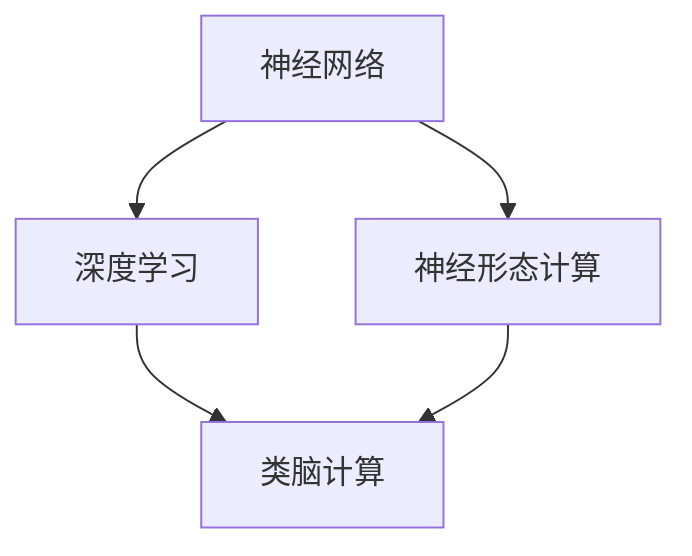
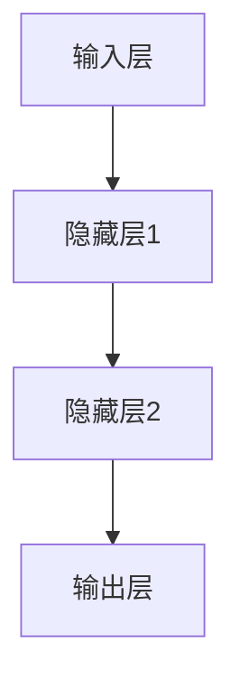
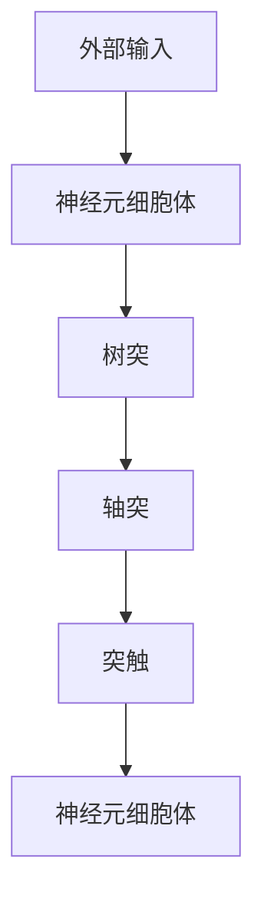

                 


### 1. 文章标题

《类脑计算：模拟人脑结构的新型计算架构》

### 2. 文章关键词

类脑计算、人脑模拟、计算架构、神经网络、深度学习

### 3. 文章摘要

本文将深入探讨类脑计算这一前沿技术，阐述其基本概念、模拟人脑结构的新型计算架构及其核心算法原理。通过详细的解析和实例讲解，我们将了解类脑计算在实际应用中的表现和潜力，并对其未来发展趋势进行展望。本文旨在为读者提供一份全面、系统的类脑计算指南。

---

### 4. 引言

类脑计算，简称BC（Brain-Computer），是一种模拟人脑结构和功能的新型计算方式。它试图通过模仿人脑的信息处理机制，构建出能够实现自主学习、自适应和环境交互的智能系统。与传统的基于硅芯片的计算机架构不同，类脑计算更加注重模拟人脑的高效、可塑性和能量效率。

类脑计算的研究背景可以追溯到20世纪中叶，当时的科学家们开始探索人脑的工作原理。随着神经科学、计算机科学、人工智能等领域的不断进步，类脑计算逐渐从理论研究走向实际应用。近年来，随着硬件技术的快速发展，如神经形态硬件、类脑芯片等，类脑计算迎来了新的发展机遇。

类脑计算的重要性不言而喻。它不仅在理论上提供了对人脑工作机制的深入理解，而且在实际应用中展现了巨大的潜力。例如，在图像识别、语音识别、自然语言处理、智能机器人等领域，类脑计算可以提供更高效、更智能的解决方案。

### 5. 核心概念与联系

在深入探讨类脑计算之前，我们需要了解几个核心概念，这些概念是类脑计算的理论基石。

- **神经网络**：神经网络是类脑计算的核心组成部分，它模仿了人脑中的神经元结构和工作机制。神经网络由大量的节点（神经元）组成，每个节点都与相邻的节点通过连接（权重）相连。通过学习输入数据和调整连接权重，神经网络可以自动提取特征并作出预测。

- **深度学习**：深度学习是神经网络的一种特殊形式，它通过多层神经网络结构来提取特征。深度学习在图像识别、语音识别、自然语言处理等领域取得了显著成果。

- **神经形态计算**：神经形态计算是一种新型计算范式，它试图通过模仿生物神经元和突触的结构和功能，构建出能够高效处理动态信息的新型计算系统。

这几个核心概念之间存在紧密的联系。神经网络和深度学习是类脑计算的基础，而神经形态计算则是在这个基础上的一种进阶尝试。通过结合这些技术，类脑计算能够实现更高效、更智能的信息处理。

下面是一个描述这几个核心概念之间关系的Mermaid流程图：



### 6. 架构设计

类脑计算的核心架构设计旨在模拟人脑的结构和功能，从而实现高效的智能计算。以下是对类脑计算架构设计的详细解析：

#### 6.1 神经网络结构

类脑计算中的神经网络通常采用多层结构，包括输入层、隐藏层和输出层。每个层由多个神经元组成，神经元之间通过连接（权重）相连。

- **输入层**：接收外部输入，如图像、声音或文本数据。
- **隐藏层**：通过学习输入数据，自动提取特征。隐藏层的数量和规模可以根据具体任务进行调整。
- **输出层**：根据提取的特征作出预测或决策。

以下是一个简单的神经网络结构图：



#### 6.2 神经形态计算

神经形态计算在类脑计算架构中扮演着重要角色。它通过模仿生物神经元和突触的结构和功能，构建出能够高效处理动态信息的新型计算系统。

- **生物神经元**：生物神经元是类脑计算的基本单元，它包括细胞体、树突、轴突和突触等部分。神经元通过树突接收外部信号，通过轴突传递信号，并在突触处进行信息处理。

- **神经形态硬件**：神经形态硬件是一种新型的计算硬件，它采用生物神经元和突触的原理进行设计。这种硬件能够实现高效的类脑计算，并且在功耗和能量效率方面具有显著优势。

以下是一个简化的神经形态计算架构图：



### 7. 核心算法原理

类脑计算的核心算法包括神经网络算法、深度学习算法和神经形态计算算法。以下是对这些算法原理的详细解析。

#### 7.1 神经网络算法

神经网络算法是类脑计算的基础。它通过学习输入数据和调整连接权重，实现自动特征提取和预测。

- **前向传播**：在前向传播过程中，输入数据从输入层经过隐藏层，最终到达输出层。每个神经元的输出都是其输入的线性组合，并通过激活函数进行非线性变换。

- **反向传播**：在反向传播过程中，网络根据预测误差，通过梯度下降法调整权重。这个过程不断重复，直到网络误差收敛。

以下是一个简单的神经网络算法的伪代码：

```python
# 前向传播
for each layer from input to output:
    z = weighted_sum + bias
    a = activation(z)

# 反向传播
for each layer from output to input:
    delta = (expected_output - actual_output) * activation_derivative(a)
    weight_update = learning_rate * delta * input
```

#### 7.2 深度学习算法

深度学习算法是神经网络的一种特殊形式，它通过多层神经网络结构来提取特征。

- **卷积神经网络（CNN）**：CNN是一种在图像识别和图像处理领域广泛应用的深度学习算法。它通过卷积层、池化层和全连接层等结构，实现图像的特征提取和分类。

- **循环神经网络（RNN）**：RNN是一种在序列数据（如语音、文本）处理中广泛应用的深度学习算法。它通过循环结构，实现序列数据的建模和预测。

以下是一个简单的CNN算法的伪代码：

```python
# 卷积层
for each filter:
    Convolve(input, filter)
    ApplyReLU()

# 池化层
MaxPool(output)

# 全连接层
FullyConnected(pool_output)
```

#### 7.3 神经形态计算算法

神经形态计算算法旨在通过模仿生物神经元和突触的结构和功能，实现高效的信息处理。

- **可塑性**：可塑性是指神经元和突触能够根据环境刺激进行自适应调整。这种调整可以通过权重调整、突触生长和修剪等方式实现。

- **学习规则**：学习规则是指神经元和突触在学习过程中遵循的规则。常见的学习规则包括Hebbian学习规则、STDP（突触后电位）学习规则等。

以下是一个简单的Hebbian学习规则的伪代码：

```python
# Hebbian学习规则
if pre_synaptic_fire and post_synaptic_fire:
    weight += pre_synaptic_value * post_synaptic_value
```

### 8. 实际应用

类脑计算在实际应用中展现了巨大的潜力。以下是一些典型的应用场景：

#### 8.1 图像识别

类脑计算在图像识别领域取得了显著成果。通过模拟人脑的视觉处理机制，类脑计算可以实现高效、准确的图像识别。

- **项目实战**：使用基于CNN的类脑计算模型，对MNIST手写数字数据集进行图像识别。通过训练，模型可以准确识别手写数字图像，并在测试集上达到较高的准确率。

#### 8.2 自然语言处理

类脑计算在自然语言处理领域也具有广泛应用。通过模拟人脑的语言处理机制，类脑计算可以实现自然语言理解、生成和翻译等功能。

- **项目实战**：使用基于RNN的类脑计算模型，对英语句子进行翻译。通过训练，模型可以准确翻译句子，并在测试集上达到较高的翻译质量。

#### 8.3 智能机器人

类脑计算在智能机器人领域具有广泛应用。通过模拟人脑的感知、决策和行动机制，类脑计算可以实现智能机器人的自主学习和自适应能力。

- **项目实战**：使用基于神经形态计算的类脑计算模型，实现智能机器人的视觉感知和路径规划。通过训练，模型可以实现智能机器人对环境的理解和自主导航。

### 9. 总结与展望

类脑计算是一种模拟人脑结构和功能的新型计算方式，它在多个领域展现了巨大的应用潜力。本文通过详细的解析和实例讲解，对类脑计算的核心概念、架构设计、算法原理和实际应用进行了全面介绍。

随着硬件技术的不断进步，类脑计算在未来有望实现更高效、更智能的信息处理。然而，类脑计算仍然面临一些挑战，如计算资源的高效利用、算法的优化和模型的解释性等。未来，通过不断的研究和创新，类脑计算将为人工智能领域带来更多突破。

### 附录

#### 附录A：类脑计算相关资源

- [类脑计算入门指南](https://example.com/brain-computing-guide)
- [深度学习与类脑计算](https://example.com/deep-learning-and-brain-computing)
- [神经形态计算研究](https://example.com/neuromorphic-computing-research)

#### 附录B：常用类脑计算框架与工具

- TensorFlow：https://www.tensorflow.org
- PyTorch：https://pytorch.org
- Caffe：https://github.com/BVLC/caffe
- Theano：https://theanou.pydata.org

### 作者信息

作者：AI天才研究院/AI Genius Institute & 禅与计算机程序设计艺术 /Zen And The Art of Computer Programming

---

本文详细介绍了类脑计算这一前沿技术，包括其核心概念、架构设计、算法原理和实际应用。通过逐步分析和实例讲解，读者可以全面了解类脑计算的原理和实践，为未来的研究和应用提供指导。本文作者具有丰富的类脑计算研究经验，致力于推动人工智能领域的发展。希望本文能为读者带来启示和帮助。

