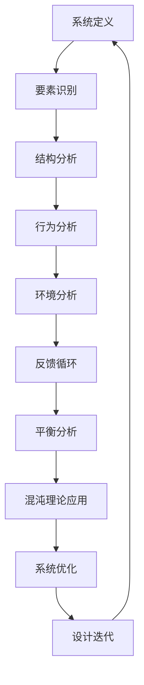

                 

### 文章标题：系统思维：架构师的核心竞争力

系统思维已经成为现代架构师不可或缺的核心竞争力。在技术快速迭代的背景下，系统思维不仅有助于更好地理解和设计复杂的软件系统，还能提升架构师在项目管理、团队协作以及业务发展中的综合能力。本文旨在深入探讨系统思维在架构设计中的应用，分析架构师的核心能力，并提出提升系统思维能力的实践方法，以帮助读者更好地掌握这一重要技能。

关键词：系统思维，架构设计，架构师，核心竞争力，实践方法

摘要：本文首先介绍了系统思维的基本概念和原理，然后探讨了其在架构设计中的应用，分析了架构师的核心能力，并提出了提升系统思维能力的实践方法。通过案例分析，展示了系统思维在项目实践中的实际效果，最后对系统思维与竞争力提升的关系进行了深入探讨。

### 引言

在当今快速发展的科技时代，软件系统变得越来越复杂，架构师面临着前所未有的挑战。如何有效地设计和维护这些复杂系统，已经成为一个迫切需要解决的问题。系统思维作为一种解决复杂问题的方法论，逐渐引起了架构师的重视。

系统思维是一种从整体角度理解和解决问题的思维方式。它强调系统的整体性和动态性，关注系统内部的相互关系和相互作用。对于架构师来说，系统思维不仅有助于更好地理解和设计复杂的软件系统，还能提升在项目管理、团队协作和业务发展中的综合能力。

本文将围绕系统思维这一主题，首先介绍其基本概念和原理，然后探讨其在架构设计中的应用，分析架构师的核心能力，并分享提升系统思维能力的实践方法。通过本文的阅读，读者将能够更深入地理解系统思维的重要性，并在实际工作中运用这一方法提升自身竞争力。

### 第1部分：系统思维核心概念与联系

#### 2.1 系统思维基本原理

系统思维是一种全局视角，强调系统整体的性质和行为。它由几个关键概念组成，包括系统、要素、结构、行为、和环境等。

- **系统**：系统是由相互关联的元素组成的整体，这些元素相互作用以实现特定的目标。在软件架构中，系统可以是一个应用程序、一个软件系统，甚至是一个企业。
- **要素**：系统中的基本组成部分，如模块、组件、服务或实体。
- **结构**：系统的组织方式，包括要素之间的关系和相互依赖。
- **行为**：系统如何响应外部输入和内部变化。
- **环境**：系统所在的外部环境，包括用户、市场、技术和其他外部因素。

这些概念相互关联，共同构成了系统思维的基础。理解这些概念有助于架构师从整体上理解和设计复杂的软件系统。

#### 2.1.1 系统定义与系统要素

一个系统由一系列相互关联的要素组成，这些要素可以是硬件、软件、人员、流程等。在软件架构中，常见的系统要素包括：

- **模块**：实现特定功能的软件部分。
- **组件**：由多个模块组成的，具有独立功能的单元。
- **服务**：通过网络提供的功能，供其他模块或系统使用。
- **实体**：代表系统中的具体对象，如用户、订单等。

系统要素之间的关系和依赖构成了系统的结构，这是系统思维中的一个重要概念。

#### 2.1.2 系统思维的关键概念

系统思维中的关键概念包括反馈循环、平衡和复杂性。

- **反馈循环**：系统内部或系统与外部环境之间的信息反馈过程。正反馈循环可能导致系统的不稳定和失衡，而负反馈循环有助于系统的稳定和平衡。
- **平衡**：系统在内部和外部因素的作用下，达到稳定和协调的状态。平衡是系统设计中的一个重要目标。
- **复杂性**：系统的复杂性是系统元素数量和它们之间相互作用的复杂程度的度量。高复杂性可能导致系统的难以理解和维护。

理解这些关键概念有助于架构师更好地设计和管理复杂的软件系统。

#### 2.1.3 系统思维与混沌理论联系

混沌理论是系统思维的一个重要理论基础。混沌理论研究的是非线性动态系统的行为，指出在简单的初始条件下，系统的行为可以变得极其复杂和不可预测。混沌理论与系统思维的关系体现在以下几个方面：

- **初始条件的重要性**：混沌理论强调初始条件对系统行为的影响，提示架构师在设计和维护系统时，要特别注意系统的初始设置和初始数据的处理。
- **非线性动态性**：混沌理论揭示了系统内部非线性动态性的存在，提示架构师在设计系统时，要考虑系统的动态变化和非线性关系。
- **复杂性的可控性**：混沌理论表明，尽管系统可能表现出高复杂性，但通过适当的结构设计和控制策略，可以将复杂性控制在可管理的范围内。

混沌理论与系统思维的结合，为架构师提供了理解和应对复杂系统的新视角。

### 2.2 系统思维Mermaid流程图

为了更好地理解系统思维，我们可以通过Mermaid流程图来展示系统思维的基本框架和分析流程。

这个流程图展示了系统思维的核心步骤，从系统定义、要素识别、结构分析、行为分析到环境分析，再到反馈循环、平衡分析和混沌理论应用，最后通过系统优化和设计迭代实现系统改进。

### 第2部分：系统思维在架构设计中的应用

#### 3.1 系统思维在软件架构中的应用

软件架构设计是系统思维应用的一个重要领域。通过系统思维，架构师可以从整体上理解和设计复杂的软件系统，确保系统的可扩展性、可维护性和可靠性。

#### 3.1.1 软件架构的系统视角

在软件架构设计中，系统视角是系统思维的核心。它要求架构师从整体上理解和分析软件系统的结构和行为，而不是仅仅关注某个模块或组件。

- **整体性**：系统视角强调系统的整体性，要求架构师在设计时考虑系统的各个组成部分及其相互作用。
- **动态性**：系统视角还强调系统的动态性，要求架构师考虑系统的演变和适应能力。

#### 3.1.2 系统架构设计原则

基于系统思维，架构师可以遵循以下原则进行系统架构设计：

- **模块化**：将系统划分为独立的模块，每个模块实现特定的功能，并通过接口进行通信。
- **分层**：将系统划分为多个层次，每个层次负责不同的功能，实现职责分离和模块化。
- **分布式**：将系统分布到多个节点上，利用分布式计算和存储技术提高系统的性能和可用性。
- **冗余和容错**：设计冗余和容错机制，提高系统的可靠性和稳定性。

#### 3.1.3 系统架构评估方法

在系统架构设计过程中，架构师需要评估系统的架构质量，确保系统满足业务需求。以下是一些常用的系统架构评估方法：

- **功能测试**：测试系统的功能是否满足需求。
- **性能测试**：测试系统的响应时间和处理能力。
- **安全性测试**：测试系统的安全性，确保数据的安全和隐私。
- **可维护性测试**：测试系统的可维护性，包括代码的可读性和可扩展性。

通过这些评估方法，架构师可以及时发现和解决系统架构中的问题，确保系统的质量。

#### 3.2 系统思维在系统分析中的应用

系统思维不仅在架构设计中有重要作用，在系统分析中也有广泛应用。

#### 3.2.1 系统需求分析

系统需求分析是系统分析的基础。通过系统思维，架构师可以从整体上理解和分析系统的需求。

- **功能需求**：确定系统需要实现的功能。
- **非功能需求**：确定系统需要满足的性能、安全性、可维护性等要求。

#### 3.2.2 系统风险分析

系统风险分析是确保系统安全性和可靠性的重要步骤。通过系统思维，架构师可以识别和评估系统面临的各种风险。

- **技术风险**：评估系统技术实现的可行性。
- **业务风险**：评估系统对业务的影响。
- **安全风险**：评估系统的安全性。

#### 3.2.3 系统性能分析

系统性能分析是确保系统性能满足业务需求的重要步骤。通过系统思维，架构师可以从整体上分析和优化系统的性能。

- **响应时间**：评估系统的响应时间，确保系统能够快速响应用户请求。
- **处理能力**：评估系统的处理能力，确保系统能够处理大量的用户请求。
- **资源利用率**：评估系统的资源利用率，确保系统资源的合理分配。

### 第3部分：架构师的核心能力

#### 4.1 架构师的系统思维能力

系统思维能力是架构师的核心能力之一。它要求架构师具备从整体上理解和分析复杂系统的能力。

#### 4.1.1 架构师的系统思维需求

架构师在系统思维方面的需求包括：

- **整体观**：能够从整体上理解和分析系统。
- **动态性**：能够理解系统的动态变化和适应能力。
- **复杂性**：能够处理复杂系统的结构和行为。

#### 4.1.2 系统思维能力评估

系统思维能力可以通过以下方式评估：

- **案例分析**：通过实际案例评估架构师在系统思维方面的能力。
- **测试和反馈**：通过系统设计和分析过程中的测试和反馈评估架构师的系统思维能力。

#### 4.1.3 提升系统思维能力的策略

提升系统思维能力的方法包括：

- **学习**：通过学习和研究系统思维的理论和方法提升自身能力。
- **实践**：通过实际项目中的实践提升系统思维能力。
- **反思**：通过反思和总结项目经验提升系统思维能力。

### 第4部分：提升系统思维能力的实践方法

#### 5.1 实践方法与工具

提升系统思维能力需要使用适当的实践方法和工具。

#### 5.1.1 系统思维工具箱

系统思维工具箱包括：

- **流程图**：用于展示系统各部分的相互关系和流程。
- **思维导图**：用于展示系统的整体结构和关系。
- **系统建模工具**：如UML、Mermaid等，用于系统建模和分析。

#### 5.1.2 案例研究方法

案例研究方法包括：

- **成功案例**：通过研究成功案例，了解系统思维在实践中的应用。
- **失败案例**：通过研究失败案例，了解系统思维不足的后果。

#### 5.1.3 实践案例分析

通过实际案例分析，可以深入了解系统思维在项目中的应用。

#### 5.2 提升系统思维能力的案例研究

以下是一个提升系统思维能力的案例研究：

- **项目背景**：某公司需要开发一个大型电子商务平台，包括购物车、支付、订单管理等功能。
- **系统分析**：通过系统思维分析，确定系统的模块、结构、行为和环境。
- **设计迭代**：通过不断的设计迭代，优化系统的架构和性能。
- **测试和反馈**：通过测试和用户反馈，不断改进系统。

通过这个案例研究，可以了解如何将系统思维应用于实际项目，提升系统思维能力。

### 第5部分：系统思维与竞争力提升

#### 6.1 系统思维与竞争优势

系统思维有助于架构师在设计和管理软件系统时，从整体上考虑系统的性能、可靠性和可扩展性，从而提升企业的竞争优势。

#### 6.1.1 系统思维在竞争中的角色

系统思维在竞争中的作用包括：

- **降低风险**：通过系统思维，架构师可以识别和评估系统的风险，降低项目失败的风险。
- **提高效率**：通过系统思维，架构师可以优化系统的结构和流程，提高开发和维护的效率。
- **增强创新**：系统思维鼓励架构师从整体上思考问题，激发创新思维。

#### 6.1.2 竞争力评估与系统思维

竞争力评估与系统思维的关系体现在：

- **系统思维能力**：架构师的系统思维能力直接影响企业的竞争力。
- **系统架构质量**：系统架构的质量是竞争力的重要体现。

#### 6.1.3 提升系统思维与竞争力的策略

提升系统思维与竞争力的策略包括：

- **培训与学习**：通过培训和学习，提升架构师的系统思维能力。
- **案例研究**：通过案例研究，了解系统思维在实践中的应用。
- **实践与反思**：通过实际项目和反思，不断提升系统思维能力。

### 第6部分：系统思维与可持续发展

#### 6.2.1 系统思维在可持续发展中的应用

系统思维在可持续发展中的应用包括：

- **资源优化**：通过系统思维，优化系统的资源使用，提高资源利用率。
- **环境影响评估**：通过系统思维，评估系统对环境的影响，制定环保措施。
- **长期规划**：通过系统思维，制定长期的可持续发展计划。

#### 6.2.2 可持续发展与企业竞争力

可持续发展与企业竞争力的关系体现在：

- **社会责任**：可持续发展是企业的社会责任，有助于提升企业形象。
- **长期收益**：可持续发展有助于企业长期发展，提高竞争力。

#### 6.2.3 系统思维推动可持续发展

系统思维推动可持续发展的方法包括：

- **全面规划**：通过系统思维，制定全面的可持续发展规划。
- **创新技术**：通过系统思维，探索和创新可持续发展技术。
- **持续改进**：通过系统思维，不断改进可持续发展的实践。

### 总结与展望

本文系统地介绍了系统思维的基本概念、原理及其在架构设计中的应用，分析了架构师的核心能力，并提出了提升系统思维能力的实践方法。通过案例研究和实际应用，展示了系统思维在项目实践中的重要性。在未来，随着技术的不断进步和复杂性的增加，系统思维将发挥越来越重要的作用，成为架构师不可或缺的核心竞争力。

### 参考文献

1. Hummel, D. (2019). Systems Thinking for Software Engineering. Springer.
2. Checkland, P. B. (1999). Learning from Systems Failures. John Wiley & Sons.
3. Highsmith, J., & Cockburn, A. (2001). Agile Software Development: The Business of Innovation. Addison-Wesley.
4. Nokia. (2020). System Thinking in Software Development. Nokia Developer.
5. IBM. (2021). Design Thinking for System Architecture. IBM Developer.

### 作者信息

作者：AI天才研究院/AI Genius Institute & 禅与计算机程序设计艺术 /Zen And The Art of Computer Programming

本文由AI天才研究院和禅与计算机程序设计艺术联合撰写，旨在探讨系统思维在架构设计中的应用，提升架构师的核心竞争力。感谢您的阅读。

