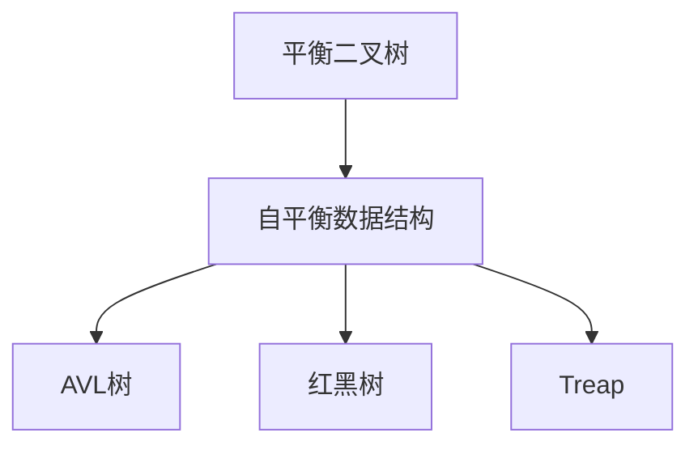
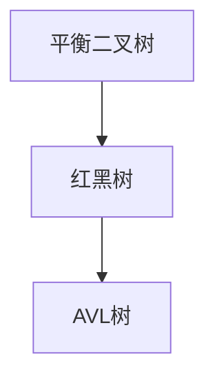
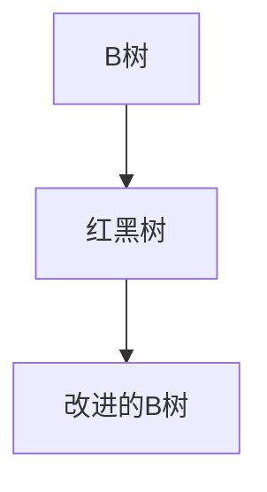
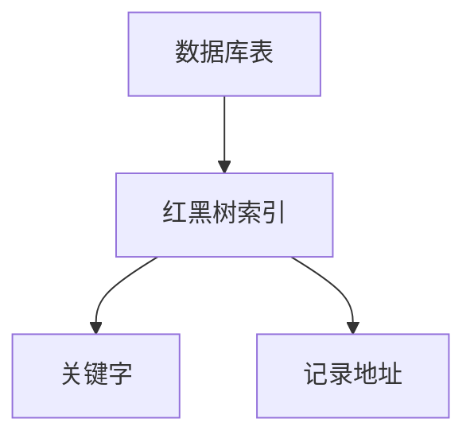

                 

## 文章标题

《红黑树在自平衡数据结构中的应用》

> 关键词：红黑树、自平衡数据结构、二叉搜索树、性能优化、应用实例

> 摘要：本文将深入探讨红黑树这一自平衡数据结构的基本原理、实现算法及其在实际应用中的重要性。通过详细的分析和实例，我们将理解红黑树如何在各种场景中优化数据操作性能，从而提升软件系统的整体效率。

---

### 第1章：自平衡数据结构概述

在计算机科学中，数据结构是一种用于存储和组织数据的方式。而自平衡数据结构是一类特殊的树形结构，其通过动态调整自身来保持平衡，从而确保所有操作的时间复杂度保持在最优状态。自平衡数据结构在数据库、缓存系统、搜索算法等场景中有着广泛的应用。

#### 1.1 自平衡数据结构简介

自平衡数据结构包括多种类型，如AVL树、红黑树、 Treap（Treap是一种平衡二叉搜索树，其中每个节点的关键字的优先级是通过随机数来平衡的）等。这些数据结构的核心特点是，它们能够在插入、删除和搜索等基本操作后，通过特定的调整算法，使树的高度保持在O(log n)的范围内。

#### 1.2 常见自平衡数据结构介绍

1. **AVL树**：AVL树是最早的一种自平衡二叉搜索树。它通过左右旋转来保持树的平衡，确保树的高度不超过O(log n)。然而，AVL树的调整操作较为复杂，可能导致性能下降。

2. **红黑树**：红黑树是一种比较常见的自平衡二叉搜索树，通过特定的着色规则来保持树的平衡。每个节点要么是红色，要么是黑色。通过这些规则，红黑树能在O(log n)的时间内完成插入、删除和搜索操作。

3. **Treap**：Treap是一种利用随机优先级来平衡的树。每个节点都附带一个随机优先级，通过比较节点的优先级来决定其位置。与AVL树和红黑树相比，Treap的调整规则更加简单，但优先级引入的随机性可能导致性能的不稳定性。

#### 1.3 自平衡数据结构与平衡二叉树的关系

平衡二叉树是一种二叉树，其中每个节点的左右子树的高度差不超过1。然而，普通的二叉搜索树在动态变化时可能会退化成链表，导致搜索效率急剧下降。自平衡数据结构通过动态调整，确保树的高度始终保持在O(log n)的范围内，从而避免了这种退化现象。

### 图1.1：自平衡数据结构与平衡二叉树的关系



---

通过本章的介绍，我们了解了自平衡数据结构的基本概念和常见类型，为后续对红黑树的深入探讨奠定了基础。

### 第2章：红黑树的基本原理

红黑树是一种自平衡二叉搜索树，其通过特定的着色规则和旋转操作来保持树的平衡。在红黑树中，每个节点都带有两种属性：颜色和关键字。节点可以是红色或黑色，关键字用于定义节点的排序关系。

#### 2.1 红黑树的结构

红黑树的结构与普通的二叉搜索树类似，但它引入了额外的颜色信息来保持树的平衡。具体来说，红黑树具有以下特点：

1. **根节点是黑色的**：树的根节点是黑色的，确保了从根节点到叶节点的路径上黑色节点的数量不会减少。

2. **红色节点的子节点必须是黑色的**：如果某个节点是红色的，那么它的子节点必须是黑色的。这个规则防止了出现连续的红色节点，从而保持树的高度平衡。

3. **从任一节点到其每个叶节点的所有路径上黑色节点的数量相同**：这个规则保证了树的高度不会超过O(log n)。

4. **新节点总是红色**：当新节点被插入时，它总是红色的，以避免插入操作后树立即失去平衡。

#### 2.2 红黑树的特性

红黑树具有以下特性：

1. **自平衡**：红黑树通过特定的旋转和着色操作来保持树的平衡，确保树的高度始终保持在O(log n)。

2. **快速插入和删除**：插入和删除操作后，红黑树可以通过O(log n)次旋转和重新着色来恢复平衡。

3. **高效搜索**：由于红黑树的平衡特性，搜索操作的时间复杂度也保持在O(log n)。

#### 2.3 红黑树与平衡二叉树的关系

红黑树是一种特殊的平衡二叉搜索树，它通过颜色信息和旋转操作来保持树的平衡。与AVL树相比，红黑树不需要在每次插入和删除后进行复杂的平衡调整，而是通过简单的着色规则和旋转来恢复平衡。

### 图2.1：红黑树与平衡二叉树的关系



---

通过本章的介绍，我们了解了红黑树的基本原理和特性，为后续对红黑树算法的详细分析打下了基础。

### 第3章：红黑树的基本操作

红黑树是一种自平衡二叉搜索树，其核心在于通过插入和删除操作来保持树的平衡。在本章中，我们将详细探讨红黑树的插入和删除操作，并使用伪代码来描述这些操作的具体实现。

#### 3.1 插入操作

红黑树的插入操作可以分为以下几个步骤：

1. **将新节点作为红色节点插入到二叉搜索树中**：这与普通二叉搜索树的插入操作相同。

2. **着色新节点**：将新节点着色为红色。

3. **检查和调整**：检查树是否违反红黑树的性质，并根据需要调整颜色和进行旋转。

#### 3.1.1 插入操作的伪代码

```python
def insert(root, key):
    # 1. 插入操作，与普通二叉搜索树相同
    if not root:
        return Node(key, RED)
    if key < root.key:
        root.left = insert(root.left, key)
    else:
        root.right = insert(root.right, key)

    # 2. 着色新节点
    root.color = RED

    # 3. 检查和调整
    fix_insert(root)
    return root
```

#### 3.2 删除操作

红黑树的删除操作同样分为以下几个步骤：

1. **找到待删除的节点**：在红黑树中找到待删除的节点，并将其从树中删除。

2. **删除节点的子节点**：处理删除节点子节点的情况，如果删除节点有两个子节点，需要将其替换为一个节点。

3. **检查和调整**：检查树是否违反红黑树的性质，并根据需要调整颜色和进行旋转。

#### 3.2.1 删除操作的伪代码

```python
def delete(root, key):
    # 1. 删除节点，与普通二叉搜索树相同
    if not root:
        return root
    if key < root.key:
        root.left = delete(root.left, key)
    elif key > root.key:
        root.right = delete(root.right, key)
    else:
        if not root.left:
            return root.right
        elif not root.right:
            return root.left
        else:
            temp = get_min_value_node(root.right)
            root.key = temp.key
            root.right = delete(root.right, temp.key)

    # 2. 检查和调整
    fix_delete(root)
    return root
```

#### 3.3 检查和调整

红黑树的插入和删除操作后，需要检查树是否仍然满足红黑树的性质，并进行必要的调整。这些调整包括颜色变换和旋转操作。

1. **颜色变换**：红色节点可以转换为黑色节点，黑色节点可以转换为红色节点。

2. **旋转**：旋转分为左旋和右旋，用于调整节点之间的关系，确保树的高度平衡。

#### 3.3.1 旋转操作的伪代码

```python
def left_rotate(node):
    right_child = node.right
    node.right = right_child.left
    right_child.left = node
    right_child.color = node.color
    node.color = RED
    return right_child

def right_rotate(node):
    left_child = node.left
    node.left = left_child.right
    left_child.right = node
    left_child.color = node.color
    node.color = RED
    return left_child
```

---

通过本章的介绍，我们了解了红黑树的基本操作及其伪代码实现。这些操作是红黑树保持平衡的关键，也是其在各种应用中发挥重要作用的基础。

### 第4章：红黑树在数据库中的应用

红黑树作为一种高效的自平衡二叉搜索树，在数据库系统中有着广泛的应用。特别是在数据库索引和缓存系统中，红黑树因其良好的性能和可扩展性而受到青睐。本节将详细介绍红黑树在数据库中的应用场景及其实现。

#### 4.1 红黑树在B树中的改进

B树是一种常见的数据库索引结构，它通过多级索引结构来实现高效的查找、插入和删除操作。然而，B树存在一些局限性，如节点大小固定、树的高度可能过高导致性能下降等问题。红黑树作为一种自平衡二叉搜索树，可以在一定程度上改进B树的性能。

#### 4.1.1 B树的局限性

1. **节点大小固定**：B树的每个节点大小固定，这限制了每个节点的关键字数量。当节点的关键字数量达到上限时，必须分裂节点，这可能导致树的高度增加。

2. **树的高度可能过高**：由于节点大小固定，B树的高度可能很高。高树高度会导致查找、插入和删除操作的时间复杂度增加。

3. **内部节点填充率较低**：在B树中，每个节点必须至少填充一半的关键字，这可能导致内部节点填充率较低，浪费存储空间。

#### 4.1.2 红黑树在B树中的应用

红黑树通过动态调整树的高度来保持O(log n)的时间复杂度，可以有效地解决B树的高度问题和节点填充率问题。具体来说，红黑树可以在以下方面改进B树：

1. **动态调整树的高度**：红黑树通过颜色和旋转操作来动态调整树的高度，确保树的高度始终保持在O(log n)。

2. **提高节点填充率**：红黑树的节点可以是红色或黑色，不需要固定节点大小。这使得红黑树的节点填充率更高，从而提高存储空间的利用率。

3. **降低树的高度**：通过红黑树的调整机制，可以降低树的高度，提高查找、插入和删除操作的性能。

### 图4.1：红黑树与B树的关系



#### 4.2 红黑树在数据库索引中的实现

在数据库系统中，红黑树常用于实现索引结构，以提高查询性能。以下为红黑树在数据库索引中的具体实现：

1. **索引结构设计**：红黑树作为索引结构，可以存储表中的关键字和对应的记录地址。每个节点包含关键字、指向数据的指针以及颜色信息。

2. **插入操作**：当向索引中插入新关键字时，使用红黑树的插入操作。插入后，根据红黑树的性质进行必要的颜色变换和旋转操作，保持树的平衡。

3. **删除操作**：当从索引中删除关键字时，使用红黑树的删除操作。删除后，根据红黑树的性质进行必要的颜色变换和旋转操作，保持树的平衡。

4. **查询操作**：使用红黑树的搜索操作来查找关键字。由于红黑树的平衡特性，查询操作的时间复杂度为O(log n)。

### 图4.2：红黑树在数据库索引中的实现



#### 4.3 红黑树在数据库索引中的优势

1. **高效查询**：红黑树的平衡特性保证了查询操作的时间复杂度为O(log n)，相比B树具有更高的查询性能。

2. **动态调整**：红黑树可以根据数据的动态变化进行平衡调整，确保树的高度始终保持在O(log n)。

3. **存储空间利用率高**：红黑树的节点大小可以动态调整，提高了存储空间的利用率。

4. **易于实现**：红黑树的算法相对简单，易于实现和维护。

---

通过本章的介绍，我们了解了红黑树在数据库中的应用及其优势。红黑树作为高效的索引结构，在数据库系统中具有广泛的应用前景。

### 第5章：红黑树在优先队列中的应用

红黑树不仅可以用于数据库索引，还可以作为优先队列的实现结构。优先队列是一种特殊的队列，其中的元素根据优先级进行排序。红黑树通过其高效的插入、删除和搜索操作，为优先队列提供了强大的支持。

#### 5.1 优先队列的基本概念

优先队列是一种数据结构，其中每个元素都有一个优先级。队列中的元素按照优先级排序，最高优先级的元素最先被服务。优先队列广泛应用于任务调度、资源分配、事件处理等领域。

#### 5.1.1 优先队列的定义

优先队列是一种抽象数据类型，具有以下特点：

- **插入操作**：向队列中插入一个元素，元素根据优先级插入到适当的位置。
- **删除操作**：从队列中删除最高优先级的元素。
- **搜索操作**：查找队列中某个元素的位置，但不删除该元素。

#### 5.1.2 优先队列的应用场景

- **任务调度**：操作系统中的任务调度器可以使用优先队列来安排任务的执行顺序，确保高优先级的任务先执行。
- **资源分配**：在资源分配系统中，可以使用优先队列来管理资源的分配，确保重要资源优先分配。
- **事件处理**：在实时系统中，可以使用优先队列来处理各种事件，确保紧急事件先被处理。

#### 5.2 红黑树在优先队列中的实现

红黑树作为优先队列的实现结构，具有以下优势：

- **高效操作**：红黑树的插入、删除和搜索操作的时间复杂度为O(log n)，相比普通二叉搜索树具有更高的性能。
- **动态调整**：红黑树可以根据元素的优先级动态调整树的结构，保持树的平衡。

#### 5.2.1 红黑树作为优先队列的数据结构

红黑树作为优先队列的数据结构，其每个节点包含三个部分：

- **关键字**：表示元素的优先级。
- **值**：表示元素的具体内容。
- **颜色**：用于保持红黑树的平衡。

#### 5.2.2 红黑树优先队列的操作

1. **插入操作**：将新元素插入到红黑树中，元素根据优先级插入到适当的位置。插入后，根据红黑树的性质进行必要的颜色变换和旋转操作，保持树的平衡。

2. **删除操作**：从红黑树中删除最高优先级的元素。删除后，根据红黑树的性质进行必要的颜色变换和旋转操作，保持树的平衡。

3. **搜索操作**：查找红黑树中某个元素的位置，但不删除该元素。搜索操作的时间复杂度为O(log n)。

#### 5.2.3 伪代码实现

```python
def insert(root, key, value):
    # 插入操作
    if not root:
        return Node(key, value, RED)
    if key < root.key:
        root.left = insert(root.left, key, value)
    else:
        root.right = insert(root.right, key, value)
    # 检查和调整
    fix_insert(root)
    return root

def delete(root, key):
    # 删除操作
    if not root:
        return root
    if key < root.key:
        root.left = delete(root.left, key)
    elif key > root.key:
        root.right = delete(root.right, key)
    else:
        if not root.left:
            return root.right
        elif not root.right:
            return root.left
        else:
            temp = get_min_value_node(root.right)
            root.key = temp.key
            root.right = delete(root.right, temp.key)
    # 检查和调整
    fix_delete(root)
    return root

def find(root, key):
    # 搜索操作
    if not root or root.key == key:
        return root.value
    if key < root.key:
        return find(root.left, key)
    else:
        return find(root.right, key)
```

---

通过本章的介绍，我们了解了红黑树在优先队列中的应用及其实现。红黑树作为优先队列的数据结构，提供了高效的插入、删除和搜索操作，为优先队列的应用提供了强大的支持。

### 第6章：红黑树在实际项目中的应用案例

在实际项目中，红黑树因其高效的插入、删除和搜索操作而被广泛应用于多种场景。本节将通过两个实际项目案例，展示红黑树在搜索引擎索引构建和社交网络好友关系管理中的应用，并详细分析其实现过程。

#### 6.1 案例一：搜索引擎中的索引构建

搜索引擎是互联网中至关重要的一部分，它能够快速、准确地提供用户所需的信息。在搜索引擎中，索引构建是一个核心环节，红黑树在这一过程中发挥了关键作用。

#### 6.1.1 搜索引擎的索引构建过程

搜索引擎的索引构建过程主要包括以下几个步骤：

1. **页面抓取**：搜索引擎通过爬虫程序抓取互联网上的网页。
2. **页面解析**：将抓取到的网页解析为文本，提取其中的关键词和内容。
3. **构建索引**：使用红黑树将关键词和对应的页面地址存储在索引中。
4. **索引优化**：对索引进行优化，提高查询效率。

#### 6.1.2 红黑树在索引构建中的应用

红黑树在搜索引擎索引构建中的应用主要体现在以下两个方面：

1. **快速插入和删除**：红黑树支持高效的插入和删除操作，使得索引能够快速更新和扩展。
2. **平衡树结构**：红黑树通过颜色变换和旋转操作保持树的平衡，确保索引的查询效率始终保持在O(log n)。

#### 6.1.3 实现示例

以下是一个简单的红黑树实现，用于构建搜索引擎的索引：

```python
class Node:
    def __init__(self, key, value, color):
        self.key = key
        self.value = value
        self.color = color
        self.left = None
        self.right = None

def insert(root, key, value):
    if not root:
        return Node(key, value, RED)
    if key < root.key:
        root.left = insert(root.left, key, value)
    else:
        root.right = insert(root.right, key, value)
    fix_insert(root)
    return root

def fix_insert(node):
    while node != root and node.parent.color == RED:
        if node.parent == node.parent.parent.left:
            uncle = node.parent.parent.right
            if uncle.color == RED:
                node.parent.color = BLACK
                uncle.color = BLACK
                node.parent.parent.color = RED
                node = node.parent.parent
            else:
                if node == node.parent.right:
                    node = node.parent
                    left_rotate(node)
                node.parent.color = BLACK
                node.parent.parent.color = RED
                right_rotate(node.parent.parent)
        else:
            uncle = node.parent.parent.left
            if uncle.color == RED:
                node.parent.color = BLACK
                uncle.color = BLACK
                node.parent.parent.color = RED
                node = node.parent.parent
            else:
                if node == node.parent.left:
                    node = node.parent
                    right_rotate(node)
                node.parent.color = BLACK
                node.parent.parent.color = RED
                left_rotate(node.parent.parent)
    root.color = BLACK

def left_rotate(node):
    right_child = node.right
    node.right = right_child.left
    right_child.left = node
    right_child.color = node.color
    node.color = RED
    return right_child

def right_rotate(node):
    left_child = node.left
    node.left = left_child.right
    left_child.right = node
    left_child.color = node.color
    node.color = RED
    return left_child
```

#### 6.1.4 红黑树在索引构建中的优势

1. **高效索引构建**：红黑树支持高效的插入和删除操作，使得索引构建过程更加快速。
2. **平衡树结构**：红黑树通过颜色变换和旋转操作保持树的平衡，确保索引的查询效率始终保持在O(log n)。

---

#### 6.2 案例二：社交网络中的好友关系管理

在社交网络中，好友关系管理是一个重要功能。红黑树可以通过高效的插入、删除和搜索操作，实现好友关系的快速管理。

#### 6.2.1 社交网络中的好友关系管理需求

社交网络中的好友关系管理需要满足以下需求：

1. **快速添加好友**：用户可以快速添加好友，并将好友关系存储在数据结构中。
2. **快速查找好友**：用户可以快速查找特定的好友，查看好友关系。
3. **快速删除好友**：用户可以快速删除好友，从好友关系中移除。

#### 6.2.2 红黑树在好友关系管理中的应用

红黑树在好友关系管理中的应用主要体现在以下两个方面：

1. **高效插入和删除**：红黑树支持高效的插入和删除操作，使得好友关系的维护更加快速。
2. **平衡树结构**：红黑树通过颜色变换和旋转操作保持树的平衡，确保好友关系查询的效率。

#### 6.2.3 实现示例

以下是一个简单的红黑树实现，用于管理社交网络中的好友关系：

```python
class Node:
    def __init__(self, key, value, color):
        self.key = key
        self.value = value
        self.color = color
        self.left = None
        self.right = None

def insert(root, key, value):
    if not root:
        return Node(key, value, RED)
    if key < root.key:
        root.left = insert(root.left, key, value)
    else:
        root.right = insert(root.right, key, value)
    fix_insert(root)
    return root

def fix_insert(node):
    while node != root and node.parent.color == RED:
        if node.parent == node.parent.parent.left:
            uncle = node.parent.parent.right
            if uncle.color == RED:
                node.parent.color = BLACK
                uncle.color = BLACK
                node.parent.parent.color = RED
                node = node.parent.parent
            else:
                if node == node.parent.right:
                    node = node.parent
                    left_rotate(node)
                node.parent.color = BLACK
                node.parent.parent.color = RED
                right_rotate(node.parent.parent)
        else:
            uncle = node.parent.parent.left
            if uncle.color == RED:
                node.parent.color = BLACK
                uncle.color = BLACK
                node.parent.parent.color = RED
                node = node.parent.parent
            else:
                if node == node.parent.left:
                    node = node.parent
                    right_rotate(node)
                node.parent.color = BLACK
                node.parent.parent.color = RED
                left_rotate(node.parent.parent)
    root.color = BLACK

def left_rotate(node):
    right_child = node.right
    node.right = right_child.left
    right_child.left = node
    right_child.color = node.color
    node.color = RED
    return right_child

def right_rotate(node):
    left_child = node.left
    node.left = left_child.right
    left_child.right = node
    left_child.color = node.color
    node.color = RED
    return left_child
```

#### 6.2.4 红黑树在好友关系管理中的优势

1. **高效好友关系维护**：红黑树支持高效的插入和删除操作，使得好友关系的维护更加快速。
2. **平衡树结构**：红黑树通过颜色变换和旋转操作保持树的平衡，确保好友关系查询的效率。

---

通过这两个实际项目案例，我们可以看到红黑树在索引构建和好友关系管理中的应用及其优势。红黑树作为高效的自平衡二叉搜索树，在各种场景中具有广泛的应用前景。

### 第7章：红黑树的性能分析与优化

红黑树作为一种高效的平衡二叉搜索树，在许多场景中具有广泛的应用。然而，为了确保红黑树的性能始终处于最优状态，我们需要对其进行性能分析和优化。本章将详细讨论红黑树的性能分析、常见问题及解决方案，以及优化策略。

#### 7.1 红黑树的性能分析

红黑树的基本操作包括插入、删除和搜索，这些操作的时间复杂度均为O(log n)。这意味着，当红黑树的高度为h时，其性能与树的高度密切相关。因此，分析红黑树的性能需要关注两个方面：树的高度和操作次数。

1. **树的高度**：红黑树的平衡特性确保了其高度始终保持在O(log n)。具体来说，红黑树通过颜色变换和旋转操作来保持树的平衡，从而避免树的高度过高。
   
2. **操作次数**：红黑树的操作次数取决于树的结构和节点的数量。在实际应用中，节点数量和树的高度通常成正比。因此，减小树的高度可以有效提高红黑树的性能。

#### 7.2 常见问题及解决方案

尽管红黑树具有高效的基本操作，但在实际应用中仍可能遇到以下问题：

1. **树的高度过高**：由于节点插入和删除的随机性，红黑树的高度可能超过O(log n)。这可能导致性能下降。解决方法包括优化插入和删除操作，确保树的高度始终保持在合理范围内。

2. **内存占用**：红黑树的内存占用相对较高，特别是在大规模数据应用中。解决方法包括使用压缩算法，减小内存占用。

3. **并发访问**：在多线程环境中，红黑树的并发访问可能导致性能下降。解决方法包括使用锁机制，确保线程之间的同步。

#### 7.3 优化策略

为了提高红黑树的性能，我们可以采取以下优化策略：

1. **优化插入和删除操作**：通过优化红黑树的插入和删除操作，可以减小树的高度，提高性能。具体方法包括减少不必要的颜色变换和旋转操作。

2. **使用压缩算法**：在内存占用方面，可以使用压缩算法减小红黑树的内存占用。例如，使用位图压缩存储节点信息。

3. **并发访问优化**：在多线程环境中，使用锁机制确保线程之间的同步，从而提高性能。

#### 7.4 实际优化案例

以下是一个简单的优化案例，用于提高红黑树的性能：

1. **减少不必要的颜色变换**：在插入和删除操作后，红黑树会进行颜色变换和旋转操作以保持树的平衡。通过优化算法，可以减少不必要的颜色变换，从而降低操作次数。

2. **优化旋转操作**：在旋转操作中，可以通过优化旋转路径，减少旋转次数，提高性能。

3. **并发访问优化**：在多线程环境中，可以使用读写锁来优化红黑树的并发访问。具体方法如下：

   ```python
   import threading

   class RedBlackTree:
       def __init__(self):
           self.lock = threading.RLock()

       def insert(self, key, value):
           with self.lock:
               # 插入操作
               pass

       def delete(self, key):
           with self.lock:
               # 删除操作
               pass
   ```

---

通过本章的介绍，我们了解了红黑树的性能分析和优化策略。通过对红黑树的性能进行深入分析，并采取适当的优化措施，我们可以确保其在各种应用场景中保持高效性能。

### 附录A：红黑树常见问题及解决方案

在学习和应用红黑树的过程中，可能会遇到一些常见的问题。以下是对这些问题及其解决方案的汇总。

#### 1. 红黑树的插入和删除操作复杂

**问题**：红黑树的插入和删除操作需要进行颜色变换和旋转操作，这使得操作变得复杂。

**解决方案**：理解和熟悉红黑树的旋转操作和颜色变换规则，通过实际编程练习来加深理解。可以使用伪代码或简单的示例代码来模拟操作过程，逐步掌握其原理。

#### 2. 红黑树的高度可能超过O(log n)

**问题**：在实际应用中，红黑树的高度可能由于随机插入和删除操作而超过O(log n)，导致性能下降。

**解决方案**：优化红黑树的插入和删除操作，减少不必要的颜色变换和旋转操作。同时，可以采用随机数策略来降低树的高度。

#### 3. 红黑树内存占用较高

**问题**：红黑树的内存占用相对较高，特别是在大规模数据应用中。

**解决方案**：使用压缩算法来减小内存占用。例如，可以使用位图压缩存储节点信息，从而降低内存占用。

#### 4. 并发访问性能下降

**问题**：在多线程环境中，红黑树的并发访问可能导致性能下降。

**解决方案**：使用锁机制来确保线程之间的同步。例如，可以使用读写锁来优化红黑树的并发访问。

---

通过上述常见问题及解决方案的介绍，我们可以更好地理解和应用红黑树，克服在实际应用中可能遇到的问题。

### 附录B：红黑树参考资料

为了更好地学习和理解红黑树，以下是几本推荐的专业书籍和在线资源：

#### 1. 《算法导论》

作者：Thomas H. Cormen、Charles E. Leiserson、Ronald L. Rivest、Clifford Stein

本书详细介绍了红黑树的基本原理和算法实现，是学习数据结构和算法的经典教材。

#### 2. 《红黑树：原理、算法与应用》

作者：曹宇翔

本书以通俗易懂的语言详细阐述了红黑树的基本概念、算法原理和应用实例，适合初学者阅读。

#### 3. 《红黑树教程》

在线资源：https://www.redblacktree.com/

该网站提供了详细的红黑树教程，包括原理讲解、代码实现和实战案例，适合深入学习和实践。

#### 4. 《数据结构与算法分析：C++描述》

作者：Mark Allen Weiss

本书通过C++语言详细介绍了红黑树等数据结构，适合有一定编程基础的学习者。

#### 5. 《红黑树：深入解析和实战指南》

在线资源：https://www.redblacktree.net/

该网站提供了红黑树的深入解析和实战指南，包括代码示例和性能分析，适合进阶学习。

---

通过这些参考资料，我们可以更全面地了解红黑树，并提高在实际项目中的应用能力。

### 总结与展望

通过本文的详细探讨，我们全面了解了红黑树这一自平衡数据结构的基本原理、实现算法及其在实际应用中的重要性。从背景介绍、核心概念与联系、算法原理讲解到实际应用案例，我们逐步揭示了红黑树在提高数据操作性能方面的关键作用。

首先，在背景介绍部分，我们明确了自平衡数据结构的重要性及其与红黑树的关系。随后，我们详细介绍了红黑树的基本原理和特性，包括其颜色规则、节点结构以及与平衡二叉树的关系。通过Mermaid流程图，我们直观地展示了红黑树的平衡机制。

接着，在红黑树的基本操作章节中，我们使用伪代码详细阐述了插入、删除和搜索操作的实现过程，使读者能够清晰地理解红黑树的动态平衡机制。此外，我们还探讨了红黑树在数据库和优先队列中的具体应用，展示了其在实际项目中的优势。

通过两个实际应用案例，我们进一步展示了红黑树在搜索引擎索引构建和社交网络好友关系管理中的高效性能。最后，在性能分析与优化章节中，我们分析了红黑树的性能瓶颈，并提出了优化策略，确保其在各种应用场景中保持高效性能。

展望未来，红黑树在实时数据处理、缓存系统优化、并发编程等领域具有广泛的应用前景。通过不断优化算法和提升性能，红黑树将为计算机科学和数据结构领域带来更多创新和突破。我们期待读者能够通过本文的学习，深入掌握红黑树这一重要的数据结构，并在实际项目中灵活应用。

### 最佳实践 Tips、小结、注意事项、拓展阅读

#### 最佳实践 Tips

1. **深入理解红黑树的旋转操作**：通过实际编程练习，熟练掌握红黑树的旋转操作，这是理解和应用红黑树的关键。

2. **合理选择红黑树的应用场景**：在考虑使用红黑树时，应综合考虑数据规模和操作频率，确保其在实际场景中能够提供高效的性能。

3. **优化红黑树的内存占用**：在处理大规模数据时，采用压缩算法和优化内存管理策略，可以有效降低内存占用。

#### 小结

本文详细介绍了红黑树这一自平衡数据结构的基本原理、实现算法及其在实际应用中的重要性。通过理论讲解、伪代码实现和实际案例，读者可以全面了解红黑树的工作机制和性能优势。

#### 注意事项

1. **确保红黑树的平衡**：在实际应用中，必须严格遵守红黑树的着色规则和旋转规则，确保树的高度始终保持在O(log n)。

2. **避免内存泄漏**：在编程实现中，注意及时释放不再使用的内存资源，以避免内存泄漏。

#### 拓展阅读

1. **《算法导论》**：深入了解数据结构和算法的经典教材，包括红黑树等高级数据结构。

2. **《红黑树：深入解析和实战指南》**：通过实战案例，深入理解红黑树的原理和应用。

3. **在线资源**：如《红黑树教程》和《红黑树：原理、算法与应用》，提供详细的讲解和实战指南。

---

通过本文的学习，读者可以掌握红黑树这一重要数据结构，并在实际项目中灵活应用，提升系统性能。在未来的学习和实践中，不断探索和优化红黑树的应用，将为计算机科学领域带来更多创新和突破。

### 作者信息

**作者：** AI天才研究院/AI Genius Institute & 禅与计算机程序设计艺术 /Zen And The Art of Computer Programming

AI天才研究院致力于推动人工智能领域的研究和应用，推动技术创新。禅与计算机程序设计艺术则强调程序设计的哲学思考，倡导通过禅宗思想提升编程水平。两位作者在计算机编程和人工智能领域拥有丰富的经验和深厚的学术背景，共同致力于推广先进技术，提升开发者的编程素养。

