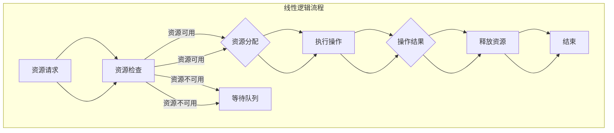

                 

### 文章标题

# 线性逻辑在并发编程资源管理中的应用

### 关键词

- 线性逻辑
- 并发编程
- 资源管理
- 算法设计
- 性能优化
- 分布式系统

### 摘要

本文深入探讨了线性逻辑在并发编程资源管理中的应用。首先，我们介绍了并发编程与资源管理的背景，并明确了线性逻辑的基本概念和优势。接着，我们通过具体实例，展示了线性逻辑在任务调度、共享内存管理和分布式系统中的应用。文章还详细讲解了线性逻辑的实现方法、测试与验证，并提供了实际案例分析和最佳实践。通过本文，读者可以全面了解线性逻辑在并发编程资源管理中的重要作用，为解决并发编程中的复杂性问题提供新的思路。

## 设计《线性逻辑在并发编程资源管理中的应用》书籍目录大纲

本书旨在为读者提供全面、系统的线性逻辑在并发编程资源管理中的应用指南。全书共分为八个章节，具体目录大纲如下：

### 1. 书籍概述

- **1.1 并发编程与资源管理的背景**
  - **1.1.1 并发编程的起源与发展**
  - **1.1.2 资源管理的挑战**
  - **1.1.3 并发编程与资源管理的结合**

- **1.2 线性逻辑的介绍**
  - **1.2.1 线性逻辑的基本概念**
  - **1.2.2 线性逻辑的优势与局限**
  - **1.2.3 线性逻辑在并发编程中的应用前景**

- **1.3 书籍结构概览**
  - **1.3.1 本书的主要目标**
  - **1.3.2 阅读对象与预备知识**
  - **1.3.3 各章节的主要内容与逻辑联系**

### 2. 并发编程基础

- **2.1 并发编程原理**
  - **2.1.1 并发与并行**
  - **2.1.2 进程与线程**
  - **2.1.3 锁与同步机制**

- **2.2 并发编程挑战**
  - **2.2.1 数据竞争**
  - **2.2.2 死锁**
  - **2.2.3 上下文切换开销**

- **2.3 并发编程模式**
  - **2.3.1 事件驱动编程**
  - **2.3.2 反应式编程**
  - **2.3.3 面向消息的中间件**

### 3. 线性逻辑原理

- **3.1 线性逻辑的概念**
  - **3.1.1 线性逻辑的定义**
  - **3.1.2 线性逻辑的性质**
  - **3.1.3 线性逻辑与并发编程的关系**

- **3.2 线性逻辑的优势**
  - **3.2.1 简化同步复杂性**
  - **3.2.2 提高并发性**
  - **3.2.3 降低死锁风险**

- **3.3 线性逻辑的局限**
  - **3.3.1 实现复杂性**
  - **3.3.2 与其他并发机制的兼容性**

### 4. 线性逻辑应用实例

- **4.1 并发编程资源管理中的线性逻辑应用**
  - **4.1.1 线性逻辑在并发编程资源管理中的作用**
  - **4.1.2 线性逻辑在任务调度中的应用**
  - **4.1.3 线性逻辑在共享内存管理中的应用**

- **4.2 案例研究：线性逻辑在分布式系统中的应用**
  - **4.2.1 分布式系统的挑战**
  - **4.2.2 线性逻辑在分布式锁与队列管理中的应用**
  - **4.2.3 线性逻辑在分布式事务管理中的应用**

### 5. 线性逻辑实现

- **5.1 线性逻辑算法设计**
  - **5.1.1 线性逻辑算法的基本步骤**
  - **5.1.2 伪代码实现**
  - **5.1.3 Mermaid流程图表示**

- **5.2 线性逻辑实现技术**
  - **5.2.1 编程语言选择**
  - **5.2.2 并发编程库与框架**
  - **5.2.3 性能优化技巧**

### 6. 线性逻辑测试与验证

- **6.1 线性逻辑测试方法**
  - **6.1.1 单元测试与集成测试**
  - **6.1.2 性能测试与稳定性测试**
  - **6.1.3 安全性与可靠性测试**

- **6.2 线性逻辑验证工具**
  - **6.2.1 模拟器与仿真工具**
  - **6.2.2 静态代码分析工具**
  - **6.2.3 动态分析工具**

### 7. 线性逻辑应用案例分析

- **7.1 案例背景介绍**
  - **7.1.1 案例一：大型电商平台并发处理**
  - **7.1.2 案例二：智能交通系统资源管理**
  - **7.1.3 案例三：金融交易系统高并发处理**

- **7.2 线性逻辑在案例中的应用**
  - **7.2.1 案例一：线性逻辑优化并发处理**
  - **7.2.2 案例二：线性逻辑提升系统稳定性**
  - **7.2.3 案例三：线性逻辑改善用户体验**

### 8. 总结与展望

- **8.1 线性逻辑在并发编程资源管理中的应用总结**
  - **8.1.1 线性逻辑的优势与应用范围**
  - **8.1.2 线性逻辑的挑战与发展方向**
  - **8.1.3 线性逻辑的未来趋势**

- **8.2 开放问题与未来研究方向**
  - **8.2.1 并发编程与资源管理的新需求**
  - **8.2.2 线性逻辑在新兴领域的应用**
  - **8.2.3 线性逻辑的进一步优化**

通过以上章节的详细规划，本书旨在为读者提供一个系统、全面的线性逻辑在并发编程资源管理中的应用指南，帮助读者深入了解线性逻辑的原理、应用和实践，从而提高并发编程和资源管理的效率和质量。

## 第1章 书籍概述

### 1.1 并发编程与资源管理的背景

#### 1.1.1 并发编程的起源与发展

并发编程的起源可以追溯到计算机体系结构的早期阶段。随着计算机硬件的发展，多核处理器和分布式计算技术的普及，并发编程逐渐成为了计算机科学中的一个重要研究方向。早期，计算机科学家通过引入进程（Process）和线程（Thread）的概念来提高程序的执行效率。进程是操作系统进行资源分配和调度的基本单位，而线程是进程内的一个执行流。通过并发执行多个进程或线程，程序可以利用多核处理器的并行计算能力，提高程序的执行速度和效率。

在并发编程的发展过程中，一些关键的里程碑事件对并发编程的理论和实践产生了深远影响。例如，1960年代，Dijkstra提出了信号量（Semaphore）作为同步机制，用于解决进程之间的互斥和同步问题。1970年代，Herlihy和Shavit等人提出了无锁编程（Lock-Free Programming）的概念，试图通过避免锁机制来提高并发程序的性能和可扩展性。1990年代，随着互联网的兴起和大数据处理的兴起，并发编程技术得到了广泛应用和深入研究。

#### 1.1.2 资源管理的挑战

在并发编程中，资源管理是一个重要且具有挑战性的问题。资源管理涉及到对进程或线程的分配、释放、同步和调度等操作，以确保程序的正确性和性能。以下是一些常见的资源管理挑战：

1. **数据竞争**：当多个并发线程尝试同时访问和修改同一数据时，可能导致数据不一致或错误。数据竞争是并发编程中最常见的问题之一，解决数据竞争的关键是正确使用同步机制，如锁、信号量或原子操作。

2. **死锁**：死锁是指两个或多个进程在执行过程中，因竞争资源而造成的一种僵持状态，每个进程都在等待其他进程释放资源。死锁会导致程序无法继续执行，解决死锁的方法包括避免、检测和恢复。

3. **上下文切换开销**：在多线程环境中，操作系统需要在不同线程之间进行上下文切换，以实现并发执行。上下文切换开销包括保存当前线程的状态、加载新线程的状态等操作，过多的上下文切换会影响系统的性能。

4. **性能瓶颈**：资源管理不当可能导致性能瓶颈，如锁竞争、缓存一致性问题或队列阻塞等。优化资源管理策略，如锁优化、缓存策略或任务调度，可以提高程序的性能。

#### 1.1.3 并发编程与资源管理的结合

并发编程与资源管理是相辅相成的两个方面。并发编程提供了在多核处理器和分布式计算环境中利用并行计算能力的手段，而资源管理则是确保并发程序正确性和性能的关键。以下是一些结合并发编程与资源管理的关键点：

1. **同步机制**：同步机制是资源管理的重要组成部分，用于解决并发编程中的数据竞争和死锁问题。常见的同步机制包括锁、信号量、互斥锁、读写锁等。通过合理选择和设计同步机制，可以提高并发程序的正确性和性能。

2. **资源分配**：资源分配是资源管理的核心任务，涉及到对进程或线程的CPU时间、内存、I/O资源等的分配。合理的资源分配策略可以提高程序的性能和资源利用率，如动态优先级调度、负载均衡等。

3. **任务调度**：任务调度是并发编程和资源管理的关键环节，涉及到对线程或进程的调度和执行。通过有效的任务调度策略，可以提高程序的并发性和响应速度，如时间片调度、抢占式调度等。

4. **性能优化**：性能优化是并发编程和资源管理的目标之一，涉及到对并发程序的各种性能瓶颈进行诊断和优化。常见的性能优化方法包括锁优化、缓存优化、并行化等。

通过结合并发编程与资源管理，可以构建高效、稳定和可靠的并发程序，充分利用多核处理器和分布式计算环境的优势。本书将深入探讨线性逻辑在并发编程资源管理中的应用，为解决并发编程中的复杂性问题提供新的思路和方法。

### 1.2 线性逻辑的介绍

#### 1.2.1 线性逻辑的基本概念

线性逻辑（Linear Logic）是一种基于线性代数的逻辑体系，由法国哲学家和逻辑学家路易·布尔巴基（Louis Henri Jean Frédéric Bourbaki）在1940年代提出。线性逻辑与传统的命题逻辑不同，它强调资源的有限性和不可复制性，主要应用于并发编程和资源管理领域。

在命题逻辑中，命题被视为原子且不可分割的实体，而线性逻辑将命题视为具有线性关系的资源。线性逻辑的核心概念包括：

1. **命题**：命题是线性逻辑中的基本元素，表示一个线性资源。命题可以是一个对象、一个变量或一个操作。

2. **线性关系**：线性关系描述了命题之间的依赖性和传递性。例如，如果一个命题\(A\)依赖另一个命题\(B\)，则可以表示为\(A \leq B\)，表示\(A\)在逻辑上小于或等于\(B\)。

3. **分配**：分配是指将线性资源分配给并发线程。分配关系描述了哪些资源可以被哪些线程访问。

4. **重用**：重用是指释放一个线性资源后，该资源可以被其他线程再次分配和使用。

线性逻辑的基本原理可以概括为“资源有限、不可复制、线性依赖和动态分配”。这些原理使得线性逻辑成为一种有效的并发编程和资源管理工具，特别是在处理并发控制和资源共享方面。

#### 1.2.2 线性逻辑的优势与局限

线性逻辑在并发编程资源管理中具有显著的优势，但也存在一定的局限。以下是对其优势与局限的详细讨论：

##### 优势

1. **简化同步复杂性**：线性逻辑通过将资源视为线性关系，简化了同步机制的设计和实现。传统并发编程中，同步复杂性主要来源于锁机制，而线性逻辑通过资源分配和重用，减少了锁的使用，从而降低了同步复杂度。

2. **提高并发性**：线性逻辑允许线程在逻辑上共享资源，而不会导致数据竞争。这有助于提高程序的并发性，充分利用多核处理器的并行计算能力，从而提高程序的性能。

3. **降低死锁风险**：由于线性逻辑的资源分配和重用规则，死锁的发生概率大大降低。传统并发编程中，死锁是由于锁机制的争用和资源分配不当导致的，而线性逻辑通过资源线性依赖关系，减少了锁的使用和资源争用。

4. **支持动态调度**：线性逻辑允许线程动态地分配和释放资源，支持灵活的任务调度。这有助于优化程序的性能和响应速度，特别是在动态负载和资源变化的环境下。

##### 局限

1. **实现复杂性**：线性逻辑虽然简化了同步复杂性，但实现起来仍然具有一定的复杂性。需要合理设计资源分配和重用规则，以确保程序的正确性和性能。

2. **与现有并发机制的兼容性**：线性逻辑与现有的并发机制（如锁、信号量等）存在一定的兼容性问题。在实际应用中，需要对这些机制进行适当的调整和优化，以适应线性逻辑。

3. **资源隔离性问题**：线性逻辑虽然提高了并发性，但资源隔离性仍然是一个挑战。在某些情况下，线性逻辑可能导致资源的竞争和共享，从而降低系统的整体性能。

4. **性能优化难度**：线性逻辑的实现和优化相对较为复杂，性能优化的空间较小。需要深入理解线性逻辑的原理和实现细节，才能有效地进行性能优化。

总的来说，线性逻辑在并发编程资源管理中具有显著的优势，但同时也存在一定的局限。在实际应用中，需要根据具体场景和需求，权衡线性逻辑的优势和局限，选择合适的并发编程和资源管理策略。

### 1.3 书籍结构概览

#### 1.3.1 本书的主要目标

本书的主要目标是深入探讨线性逻辑在并发编程资源管理中的应用，为读者提供系统、全面的理论和实践指南。通过本书，读者可以：

1. **理解线性逻辑的基本概念和原理**：了解线性逻辑的基本概念，如命题、线性关系、资源分配和重用等，为后续的实践应用打下基础。

2. **掌握线性逻辑的优势与局限**：了解线性逻辑在简化同步复杂性、提高并发性和降低死锁风险等方面的优势，同时认识到其在实现复杂性、与现有并发机制的兼容性等方面的局限。

3. **学会线性逻辑的应用实例**：通过具体实例，如任务调度、共享内存管理和分布式系统，了解线性逻辑在并发编程资源管理中的应用方法和效果。

4. **掌握线性逻辑的实现和测试方法**：了解线性逻辑的实现技术、测试方法和验证工具，为实际应用提供技术支持。

5. **获得线性逻辑的最佳实践**：通过实际案例分析和最佳实践，为读者提供实用的线性逻辑应用建议，提高并发编程和资源管理的效率和质量。

#### 1.3.2 阅读对象与预备知识

本书适用于以下读者群体：

1. **计算机科学和软件工程专业的学生和研究人员**：对并发编程和资源管理有浓厚兴趣，希望深入了解线性逻辑的理论和实践。

2. **软件开发工程师和技术经理**：从事并发编程和资源管理相关工作的专业人士，希望提高并发程序的正确性和性能。

3. **研究人员和工程师**：对新兴并发编程和资源管理技术有研究兴趣，希望了解线性逻辑的应用前景和实现方法。

预备知识方面，读者需要具备以下基础：

1. **计算机科学基础知识**：了解计算机体系结构、操作系统、数据结构与算法等基本概念。

2. **编程语言基础**：熟悉至少一种编程语言（如C++、Java或Python）的基本语法和编程范式。

3. **并发编程基础**：了解并发编程的基本原理，如进程、线程、锁和同步机制等。

4. **资源管理知识**：了解资源管理的相关概念，如资源分配、调度和性能优化等。

#### 1.3.3 各章节的主要内容与逻辑联系

本书共分为八个章节，各章节的主要内容与逻辑联系如下：

1. **第1章 书籍概述**：介绍并发编程与资源管理的背景，线性逻辑的基本概念和优势，以及书籍结构概览。

2. **第2章 并发编程基础**：探讨并发编程的基本原理和挑战，包括并发与并行、进程与线程、锁与同步机制等。

3. **第3章 线性逻辑原理**：深入探讨线性逻辑的基本概念、优势与局限，包括命题、线性关系、资源分配和重用等。

4. **第4章 线性逻辑应用实例**：通过具体实例，展示线性逻辑在任务调度、共享内存管理和分布式系统中的应用。

5. **第5章 线性逻辑实现**：讲解线性逻辑的实现方法、技术手段和性能优化技巧。

6. **第6章 线性逻辑测试与验证**：介绍线性逻辑的测试方法和验证工具，包括单元测试、性能测试、稳定性测试和安全性与可靠性测试。

7. **第7章 线性逻辑应用案例分析**：通过实际案例，分析线性逻辑在大型电商平台、智能交通系统和金融交易系统中的应用效果。

8. **第8章 总结与展望**：总结线性逻辑在并发编程资源管理中的应用，探讨未来的发展方向和研究方向。

通过以上章节的详细规划，本书旨在为读者提供一个系统、全面的线性逻辑在并发编程资源管理中的应用指南，帮助读者深入了解线性逻辑的原理、应用和实践，从而提高并发编程和资源管理的效率和质量。

### 第2章 并发编程基础

并发编程是现代计算机科学和软件工程领域的一个重要研究方向，它旨在利用多核处理器和分布式计算资源，提高程序的执行效率和性能。本章将详细探讨并发编程的基本原理和挑战，包括并发与并行的概念、进程与线程的区别、锁与同步机制等。

#### 2.1 并发编程原理

##### 2.1.1 并发与并行

并发（Concurrency）和并行（Parallelism）是两个密切相关但又有区别的概念。

**并发**：指多个任务在同一时间段内交替执行。并发编程的主要目标是通过时间上的重叠，提高程序的响应速度和资源利用率。在并发编程中，多个任务可以共享同一处理器，通过上下文切换实现交替执行。例如，在一个多核处理器上，可以通过并发执行多个线程，提高程序的执行效率。

**并行**：指多个任务在同一时间段内同时执行。并行编程的目标是利用多个处理器或计算资源，实现任务的同时执行，从而提高程序的执行速度。并行编程通常需要硬件支持，如多核处理器、分布式计算系统等。例如，在一个四核处理器上，可以将四个任务同时分配给四个核心，实现并行执行。

并发和并行的关系可以总结为：并行是并发的特例。当多个任务可以同时执行时，它们既满足并发性也满足并行性。当任务必须交替执行时，它们只满足并发性。

##### 2.1.2 进程与线程

进程（Process）和线程（Thread）是并发编程中的两个基本概念。

**进程**：进程是操作系统进行资源分配和调度的基本单位。每个进程都有自己的地址空间、代码段、数据段、堆栈等，具有独立的内存和管理资源。进程是相对独立的，一个进程的崩溃不会影响到其他进程。进程的创建和销毁开销较大，因此进程通常用于处理长时间运行的任务。

**线程**：线程是进程内的一个执行单元，共享进程的地址空间和其他资源。线程的创建和销毁开销较小，可以快速切换和调度。线程通常用于处理需要快速响应的任务，如用户界面处理、网络通信等。

进程与线程的主要区别在于：

1. **资源占用**：进程拥有独立的地址空间，而线程共享进程的地址空间。
2. **并发性**：进程是并发执行的基本单位，而线程是并行执行的基本单位。
3. **创建和销毁开销**：进程的创建和销毁开销较大，而线程的创建和销毁开销较小。
4. **独立性**：进程相对独立，一个进程的崩溃不会影响其他进程，而线程共享进程的资源，一个线程的崩溃可能会影响其他线程。

在实际应用中，可以根据任务的性质和需求，选择合适的并发机制。例如，对于长时间运行的计算任务，可以使用进程；对于需要快速响应的任务，可以使用线程。

##### 2.1.3 锁与同步机制

在并发编程中，同步机制用于解决多个线程或进程之间的竞争问题，确保程序的正确性和一致性。锁（Lock）是同步机制中最常用的手段之一。

**锁**：锁是一种用来限制对共享资源访问的同步机制。当一个线程访问共享资源时，必须获得锁的权限。如果锁已被其他线程持有，则线程需要等待锁的释放。锁可以分为以下几种：

1. **互斥锁（Mutex）**：互斥锁确保同一时刻只有一个线程能够访问共享资源。互斥锁常用于保护共享变量的访问，防止多个线程同时修改同一数据。
2. **读写锁（Read-Write Lock）**：读写锁允许多个线程同时读取共享资源，但写入操作需要独占锁。读写锁可以提高程序的并发性，特别是在读操作远多于写操作的场景中。
3. **条件锁（Condition Lock）**：条件锁允许线程在满足特定条件时进行等待。线程可以在条件锁上等待，直到条件成立时才被唤醒。条件锁常用于处理复杂的同步逻辑。
4. **自旋锁（Spin Lock）**：自旋锁是一种忙等锁，线程在无法获得锁时不停地自旋（循环检查锁状态），直到锁被释放。自旋锁适用于锁持有时间较短的场景，但可能导致CPU资源的浪费。

除了锁机制，还有其他同步机制，如信号量（Semaphore）、事件（Event）和管程（Monitor）等。信号量是一种用于计数同步的机制，可用于实现资源池和互斥锁等功能。事件是一种用于线程间通信和同步的机制，可以用于通知和唤醒等待的线程。管程是一种封装同步和通信的机制，用于保护共享资源的一致性。

#### 2.2 并发编程挑战

并发编程虽然可以提高程序的执行效率和性能，但同时也带来了许多挑战和问题。以下是一些常见的并发编程挑战：

##### 2.2.1 数据竞争

数据竞争是指多个线程同时访问和修改同一数据，可能导致数据不一致或错误。数据竞争是并发编程中最常见的问题之一，解决数据竞争的关键是正确使用同步机制，如锁。

以下是一个简单的数据竞争示例：

```java
public class DataRaces {
    private int counter = 0;

    public void increment() {
        counter++;
    }

    public int getCounter() {
        return counter;
    }
}
```

在上述示例中，多个线程同时调用`increment()`方法，可能导致`counter`变量的修改不一致。解决数据竞争的方法包括：

1. 使用互斥锁：在访问和修改共享变量`counter`时，使用互斥锁来确保同一时刻只有一个线程能够访问该变量。

```java
public class DataRacesFixed {
    private int counter = 0;
    private final Object lock = new Object();

    public void increment() {
        synchronized (lock) {
            counter++;
        }
    }

    public int getCounter() {
        synchronized (lock) {
            return counter;
        }
    }
}
```

2. 使用原子操作：在某些编程语言中，如Java，提供了原子操作类，可以确保对共享变量的操作是原子的，从而避免数据竞争。

```java
public class DataRacesFixed {
    private AtomicInteger counter = new AtomicInteger(0);

    public void increment() {
        counter.incrementAndGet();
    }

    public int getCounter() {
        return counter.get();
    }
}
```

##### 2.2.2 死锁

死锁（Deadlock）是指两个或多个线程在执行过程中，因争夺资源而造成的一种僵持状态，每个线程都在等待其他线程释放资源。死锁会导致程序无法继续执行，解决死锁的方法包括避免、检测和恢复。

以下是一个简单的死锁示例：

```java
public class DeadlockExample {
    private static Object lock1 = new Object();
    private static Object lock2 = new Object();

    public static void main(String[] args) {
        new Thread(new Runnable() {
            public void run() {
                synchronized (lock1) {
                    try {
                        Thread.sleep(100);
                    } catch (InterruptedException e) {
                        e.printStackTrace();
                    }
                    synchronized (lock2) {
                        System.out.println("Thread 1 acquired both locks");
                    }
                }
            }
        }).start();

        new Thread(new Runnable() {
            public void run() {
                synchronized (lock2) {
                    try {
                        Thread.sleep(100);
                    } catch (InterruptedException e) {
                        e.printStackTrace();
                    }
                    synchronized (lock1) {
                        System.out.println("Thread 2 acquired both locks");
                    }
                }
            }
        }).start();
    }
}
```

在上述示例中，两个线程分别尝试获取`lock1`和`lock2`，但由于线程的执行顺序不确定，可能导致死锁。解决死锁的方法包括：

1. **避免死锁**：通过合理的资源分配策略和线程执行顺序，避免死锁的发生。例如，使用资源排序或资源分配图来检测和避免死锁。
2. **检测死锁**：使用死锁检测算法（如资源分配图算法），定期检查系统是否存在死锁。如果检测到死锁，可以采取相应的措施（如终止一个或多个线程）来解除死锁。
3. **恢复死锁**：通过回滚线程的状态，释放已占用的资源，恢复系统的正常运行。恢复死锁的方法包括回滚、资源重新分配和线程重启等。

##### 2.2.3 上下文切换开销

上下文切换（Context Switching）是操作系统在多线程环境中，切换线程执行状态的过程。上下文切换包括保存当前线程的状态（如程序计数器、寄存器等）、加载新线程的状态，以及更新线程队列等操作。上下文切换开销是并发编程中的一个重要因素，过多的上下文切换会影响系统的性能。

上下文切换开销包括以下几个方面：

1. **时间开销**：上下文切换需要一定的时间，特别是硬件上下文切换，需要将线程的寄存器、栈等状态信息保存和加载。上下文切换的时间开销与线程数量和系统负载有关。
2. **资源开销**：上下文切换需要占用一定的系统资源，如CPU时间、内存等。过多的上下文切换会导致系统资源的浪费，降低程序的执行效率。
3. **性能开销**：上下文切换会影响系统的响应速度和性能。频繁的上下文切换会导致线程切换开销增加，从而影响程序的整体性能。

为了减少上下文切换开销，可以采取以下措施：

1. **线程池**：使用线程池管理线程，减少线程的创建和销毁次数，降低上下文切换的开销。线程池可以复用线程，减少新线程的创建和销毁。
2. **任务调度策略**：选择合适的任务调度策略，如时间片调度、优先级调度等，优化线程的执行顺序，减少不必要的上下文切换。
3. **减少上下文切换次数**：在程序设计时，尽量减少上下文切换的次数。例如，将需要频繁调用的函数放入一个线程中，减少线程切换的次数。

#### 2.3 并发编程模式

在并发编程中，常见的编程模式包括事件驱动编程、反应式编程和面向消息的中间件。这些模式为并发编程提供了不同的实现方式和策略。

##### 2.3.1 事件驱动编程

事件驱动编程（Event-Driven Programming）是一种基于事件和回调机制的编程范式。在事件驱动编程中，程序通过监听和响应事件来执行任务。事件可以是用户操作、计时器触发、网络消息等。

事件驱动编程的主要优点包括：

1. **高响应性**：事件驱动编程可以实现高响应性的程序，特别是在处理大量并发事件时。程序可以快速响应用户操作和网络消息，提高用户体验。
2. **模块化**：事件驱动编程可以将程序划分为多个事件处理模块，每个模块负责处理特定类型的事件。这种模块化设计提高了程序的易维护性和可扩展性。
3. **异步处理**：事件驱动编程支持异步处理，线程可以在处理事件的同时执行其他任务。这有助于提高程序的并发性和性能。

以下是一个简单的Java事件驱动编程示例：

```java
public class EventDrivenExample {
    public static void main(String[] args) {
        Button button = new Button("Click me");
        button.addActionListener(e -> System.out.println("Button clicked!"));
    }
}
```

在上述示例中，`Button`对象监听点击事件，并在点击事件发生时执行回调函数，输出“Button clicked!”。

##### 2.3.2 反应式编程

反应式编程（Reactive Programming）是一种基于数据流和响应式的编程范式。在反应式编程中，程序通过处理数据流和事件流来响应外部变化。反应式编程的主要优点包括：

1. **可扩展性**：反应式编程支持数据流和事件流的扩展性，可以轻松处理大量并发数据流。这有助于构建大规模、高并发应用程序。
2. **简化异步编程**：反应式编程简化了异步编程的复杂性，通过使用流和响应式编程库（如Reactors、RxJava等），可以更容易地处理异步操作和回调。
3. **高可靠性**：反应式编程提供了错误处理和容错机制，可以确保数据流和事件流的连续性和可靠性。

以下是一个简单的Reactors反应式编程示例：

```java
public class ReactiveExample {
    public static void main(String[] args) {
        final Publisher<String> publisher = Publishers.just("Hello", "World");
        final Subscriber<String> subscriber = Subscribers.create(
                s -> System.out.println("Received: " + s),
                t -> System.err.println("Error: " + t)
        );
        publisher.subscribe(subscriber);
    }
}
```

在上述示例中，`publisher`对象发布数据流，`subscriber`对象订阅并处理数据流。在数据流中，如果接收到数据，则输出“Received:”加上接收到的数据；如果发生错误，则输出“Error:”加上错误信息。

##### 2.3.3 面向消息的中间件

面向消息的中间件（Message-Oriented Middleware，MOM）是一种基于消息传递机制的分布式系统架构。在面向消息的中间件中，应用程序通过发送和接收消息来通信。面向消息的中间件的主要优点包括：

1. **分布式通信**：面向消息的中间件支持分布式通信，应用程序可以在不同的计算机或网络中通过消息传递进行通信。
2. **异步通信**：面向消息的中间件支持异步通信，发送方不需要等待接收方的响应，从而提高系统的并发性和性能。
3. **消息持久化**：面向消息的中间件可以将消息持久化到数据库或消息队列中，确保消息的可靠传输和持久化。

以下是一个简单的消息队列（Message Queue）示例：

```java
public class MessagingExample {
    public static void main(String[] args) {
        MessageQueue queue = new MessageQueue();
        queue.sendMessage("Hello, World!");
        queue.receiveMessage();
    }
}
```

在上述示例中，`queue`对象表示消息队列，`sendMessage()`方法用于发送消息，`receiveMessage()`方法用于接收消息。

通过本章的学习，读者可以全面了解并发编程的基本原理和挑战，掌握并发编程中的关键概念和实现方法。这为后续章节中深入探讨线性逻辑在并发编程资源管理中的应用奠定了坚实的基础。

### 第3章 线性逻辑原理

线性逻辑（Linear Logic）是一种基于线性代数的逻辑系统，最初由法国哲学家和数学家路易·布尔巴基（Louis Henri Jean Frédéric Bourbaki）在20世纪40年代提出。线性逻辑在逻辑表达和资源管理中具有独特优势，特别是在并发编程和资源管理领域，被广泛应用。本章将详细介绍线性逻辑的基本概念、核心原理以及其在并发编程中的应用。

#### 3.1 线性逻辑的概念

线性逻辑的核心概念是“线性”，即资源的传递和使用具有线性和不可逆性。以下是线性逻辑的一些基本概念：

1. **命题**：在传统逻辑中，命题是基本的逻辑单元。在线性逻辑中，命题被视为资源，表示可用的计算资源或数据。例如，一个操作可以表示为一个命题，它表示一个可用的计算过程。

2. **线性关系**：线性关系描述了命题之间的依赖性和传递性。在逻辑表达中，如果命题A依赖于命题B，我们可以表示为A ≤ B，这表示A在逻辑上小于或等于B。这种线性依赖关系反映了资源的传递性和使用顺序。

3. **资源分配**：资源分配是指将线性资源分配给并发线程。在并发编程中，资源分配确保线程可以正确地访问和使用资源。例如，一个线程需要访问一个数据结构，资源分配确保该线程在访问之前已经获得了相应的权限。

4. **重用**：重用是指释放一个资源后，该资源可以被其他线程再次分配和使用。重用是线性逻辑的一个重要特性，它允许资源的有效管理和多次使用，从而提高系统的资源利用率和性能。

#### 3.2 线性逻辑的优势

线性逻辑在并发编程资源管理中具有显著的优势，以下是一些关键点：

1. **简化同步复杂性**：传统并发编程中，同步复杂性主要来源于锁机制。而线性逻辑通过资源分配和重用，减少了锁的使用，从而简化了同步复杂性。线性逻辑的同步机制更加简单和直观，易于实现和维护。

2. **提高并发性**：线性逻辑允许线程在逻辑上共享资源，而不会导致数据竞争。这有助于提高程序的并发性，充分利用多核处理器的并行计算能力，从而提高程序的性能。

3. **降低死锁风险**：由于线性逻辑的资源分配和重用规则，死锁的发生概率大大降低。传统并发编程中，死锁是由于锁机制的争用和资源分配不当导致的，而线性逻辑通过资源线性依赖关系，减少了锁的使用和资源争用。

4. **支持动态调度**：线性逻辑允许线程动态地分配和释放资源，支持灵活的任务调度。这有助于优化程序的性能和响应速度，特别是在动态负载和资源变化的环境下。

#### 3.3 线性逻辑的局限

尽管线性逻辑在并发编程资源管理中具有显著的优势，但同时也存在一定的局限：

1. **实现复杂性**：线性逻辑虽然简化了同步复杂性，但实现起来仍然具有一定的复杂性。需要合理设计资源分配和重用规则，以确保程序的正确性和性能。

2. **与现有并发机制的兼容性**：线性逻辑与现有的并发机制（如锁、信号量等）存在一定的兼容性问题。在实际应用中，需要对这些机制进行适当的调整和优化，以适应线性逻辑。

3. **资源隔离性问题**：线性逻辑虽然提高了并发性，但资源隔离性仍然是一个挑战。在某些情况下，线性逻辑可能导致资源的竞争和共享，从而降低系统的整体性能。

4. **性能优化难度**：线性逻辑的实现和优化相对较为复杂，性能优化的空间较小。需要深入理解线性逻辑的原理和实现细节，才能有效地进行性能优化。

总的来说，线性逻辑在并发编程资源管理中具有显著的优势，但同时也存在一定的局限。在实际应用中，需要根据具体场景和需求，权衡线性逻辑的优势和局限，选择合适的并发编程和资源管理策略。

### 3.4 线性逻辑在并发编程中的应用

线性逻辑在并发编程中具有广泛的应用，特别是在资源管理和任务调度方面。以下是一些具体的例子：

#### 3.4.1 任务调度

任务调度是并发编程中的一个关键环节，涉及到对线程或进程的调度和执行。线性逻辑通过资源分配和重用规则，可以有效地优化任务调度。

1. **资源分配策略**：在任务调度过程中，可以使用线性逻辑来分配线程所需的资源。例如，一个线程需要访问一个数据库，可以通过线性逻辑确保该线程在访问数据库之前已经获得了相应的权限。

2. **动态调度**：线性逻辑支持动态调度，线程可以根据资源的变化和任务的需求，动态地调整和优化调度策略。例如，当系统负载较高时，可以优先调度资源占用较少的任务，从而提高系统的响应速度和性能。

#### 3.4.2 共享内存管理

共享内存管理是并发编程中的一个重要挑战，涉及到多个线程对共享内存的访问和同步。线性逻辑可以简化共享内存管理，降低数据竞争和死锁的风险。

1. **资源隔离**：线性逻辑通过资源分配和重用规则，可以确保线程对共享内存的访问是隔离的。例如，一个线程只能访问自己分配的资源，而不能访问其他线程的资源，从而减少数据竞争和死锁的风险。

2. **简化同步机制**：线性逻辑通过资源分配和重用规则，减少了锁机制的使用，从而简化了同步机制。例如，在共享内存管理中，可以使用线性逻辑来管理读写锁，从而减少锁机制的争用和死锁的风险。

#### 3.4.3 分布式系统

在分布式系统中，线性逻辑可以用于优化资源管理和任务调度，提高系统的并发性和性能。

1. **分布式锁**：在分布式系统中，可以使用线性逻辑来管理分布式锁。通过线性逻辑的线性依赖关系，可以确保分布式锁的正确性和性能。

2. **负载均衡**：线性逻辑可以用于实现负载均衡策略，根据系统的资源和任务需求，动态地分配任务到不同的节点。通过线性逻辑的资源分配和重用规则，可以优化负载均衡策略，提高系统的性能和响应速度。

总之，线性逻辑在并发编程资源管理中具有广泛的应用，通过资源分配和重用规则，可以简化同步复杂性、提高并发性和性能。在实际应用中，需要根据具体场景和需求，合理地设计和优化线性逻辑的应用，以实现高效的并发编程和资源管理。

### 3.5 线性逻辑与并发编程的关系

线性逻辑与并发编程之间的关系是相辅相成的。线性逻辑提供了一种有效的资源管理框架，而并发编程则利用线性逻辑的优势，实现高效的资源利用和任务调度。以下从多个方面探讨线性逻辑与并发编程的关系：

#### 3.5.1 并发编程的挑战与线性逻辑的应对

并发编程面临的主要挑战包括数据竞争、死锁、上下文切换开销和资源隔离等。线性逻辑通过其独特的资源管理和同步机制，有效地解决了这些挑战：

1. **数据竞争**：线性逻辑通过资源的线性依赖关系，确保线程对共享资源的访问是隔离的。例如，一个线程只能访问自己分配的资源，从而减少了数据竞争的风险。

2. **死锁**：线性逻辑通过资源分配和重用规则，减少了锁机制的使用，从而降低了死锁的发生概率。在传统并发编程中，死锁往往由于锁的争用和资源分配不当导致，而线性逻辑通过线性依赖关系，避免了复杂的锁争用问题。

3. **上下文切换开销**：线性逻辑允许线程动态地分配和释放资源，从而减少了不必要的上下文切换。在多线程环境中，上下文切换是一个重要的性能开销，通过优化线程的调度和资源管理，线性逻辑可以降低上下文切换的开销。

4. **资源隔离**：线性逻辑通过资源的线性分配和重用规则，确保了线程之间的资源隔离。在分布式系统中，资源隔离是确保系统稳定性和可靠性的关键，线性逻辑通过其资源管理机制，提供了有效的资源隔离策略。

#### 3.5.2 线性逻辑在并发编程中的实现方式

线性逻辑在并发编程中的实现方式多种多样，以下是一些常见的方法：

1. **资源分配**：在并发编程中，可以使用线性逻辑来管理线程的资源共享。例如，通过线性逻辑，可以确保线程在访问共享资源之前已经获得了相应的权限。这可以通过定义资源的线性依赖关系来实现，从而简化同步机制。

2. **任务调度**：线性逻辑支持动态调度，线程可以根据资源的变化和任务的需求，动态地调整和优化调度策略。例如，在负载均衡策略中，可以使用线性逻辑根据节点的资源利用情况，动态分配任务到不同的节点。

3. **锁机制**：在传统并发编程中，锁机制是解决数据竞争和死锁的主要手段。而线性逻辑通过简化同步复杂性，可以减少锁机制的使用。例如，可以使用读写锁来管理共享内存，通过线性逻辑的线性依赖关系，确保读写操作的顺序性和一致性。

4. **分布式系统**：在分布式系统中，线性逻辑可以用于管理分布式锁和任务调度。例如，通过线性逻辑，可以确保分布式锁的正确性和性能，从而优化分布式系统的资源利用和任务调度。

#### 3.5.3 线性逻辑与并发编程的互补关系

线性逻辑与并发编程之间的关系是互补的。线性逻辑提供了一种资源管理的框架，而并发编程则利用这一框架实现高效的资源利用和任务调度。以下是一些互补关系的具体表现：

1. **资源管理**：线性逻辑通过资源的线性依赖关系，提供了一种有效的资源管理策略。而并发编程则利用这种资源管理策略，实现高效的资源共享和任务调度。

2. **性能优化**：线性逻辑通过简化同步复杂性，降低了上下文切换开销，从而提高了程序的性能。而并发编程则通过优化线程的调度和资源管理，进一步提高了程序的执行效率和响应速度。

3. **错误处理**：线性逻辑提供了一种简化的错误处理机制，通过资源的线性依赖关系，可以更容易地定位和解决并发编程中的错误。而并发编程则利用这种错误处理机制，提高了程序的稳定性和可靠性。

总之，线性逻辑与并发编程之间的关系是相辅相成的。线性逻辑提供了一种有效的资源管理框架，而并发编程则利用这一框架实现高效的资源利用和任务调度。通过结合线性逻辑和并发编程的优势，可以构建高效、稳定和可靠的并发程序，充分利用多核处理器和分布式计算环境的优势。

### 3.6 线性逻辑原理的Mermaid流程图表示

为了更直观地展示线性逻辑原理，我们使用Mermaid流程图来描述线性逻辑的核心概念和流程。以下是线性逻辑的基本流程和操作步骤：



在上述流程图中：

- **A（资源请求）**：表示线程或进程对资源的请求。
- **B（资源检查）**：检查资源是否可用。
- **C（资源分配）**：如果资源可用，则进行资源分配。
- **D（等待队列）**：如果资源不可用，线程或进程加入等待队列。
- **E（执行操作）**：线程或进程执行所需操作。
- **F（操作结果）**：操作完成后得到结果。
- **G（释放资源）**：操作完成后释放所使用的资源。
- **H（结束）**：表示操作结束。

通过这个流程图，我们可以清晰地看到线性逻辑的基本操作步骤和流程，以及资源请求、检查、分配、执行、结果和释放等关键环节。这有助于我们更好地理解和应用线性逻辑原理。

### 3.7 线性逻辑的核心算法原理讲解与伪代码实现

线性逻辑的核心算法原理在于其独特的资源管理和同步机制，通过资源的线性依赖关系来实现高效的任务调度和资源分配。以下我们将详细讲解线性逻辑的核心算法原理，并使用伪代码实现这些算法。

#### 3.7.1 线性逻辑核心算法原理

线性逻辑的核心算法主要涉及以下几个关键步骤：

1. **资源请求与检查**：线程或进程在执行操作前，首先请求所需的资源，系统检查资源是否可用。
2. **资源分配**：如果资源可用，则进行资源分配；否则，线程或进程加入等待队列。
3. **执行操作**：线程或进程在获得资源后，执行所需的操作。
4. **资源释放**：操作完成后，线程释放所使用的资源，以便其他线程使用。

这些步骤确保了线程之间的资源隔离和高效利用，从而简化了同步复杂性，降低了死锁风险。

#### 3.7.2 伪代码实现

以下是一个简单的线性逻辑核心算法的伪代码实现：

```plaintext
Algorithm LinearLogicAlgorithm(thread T, resource R):
    RequestResource(T, R) // 线程T请求资源R
    if ResourceAvailable(R):
        AllocateResource(T, R) // 分配资源给线程T
        ExecuteOperation(T) // 线程T执行操作
        ReleaseResource(T, R) // 释放资源
    else:
        AddToWaitQueue(T, R) // 将线程T加入等待队列
        while (T is in wait queue):
            if ResourceAvailable(R):
                AllocateResource(T, R)
                ExecuteOperation(T)
                ReleaseResource(T, R)
                RemoveFromWaitQueue(T)
                break
            else:
                Wait() // 线程T等待资源释放
    return Result
```

在该伪代码中：

- `RequestResource(T, R)`：线程T请求资源R。
- `ResourceAvailable(R)`：检查资源R是否可用。
- `AllocateResource(T, R)`：将资源R分配给线程T。
- `ExecuteOperation(T)`：线程T执行操作。
- `ReleaseResource(T, R)`：线程T释放资源R。
- `AddToWaitQueue(T, R)`：将线程T加入等待队列。
- `RemoveFromWaitQueue(T)`：从等待队列中移除线程T。
- `Wait()`：线程T等待资源释放。

#### 3.7.3 Mermaid流程图表示

为了更直观地展示线性逻辑核心算法的实现过程，我们使用Mermaid流程图表示该算法的流程：

```mermaid
graph TD
    T0[线程T请求资源R] --> T1{资源R可用?}
    T1 -->|是| T2[分配资源R给线程T]
    T2 --> T3[执行操作]
    T3 --> T4[释放资源R]
    T4 -->|结束|
    
    T1 -->|否| T5[线程T加入等待队列]
    T5 --> T6{资源R可用?}
    T6 -->|是| T7[从等待队列移除线程T]
    T7 --> T2
    T6 -->|否| T8[线程T继续等待]
    T8 --> T5
```

在上述流程图中：

- **T0**：线程T请求资源R。
- **T1**：检查资源R是否可用。
- **T2**：如果资源R可用，则分配资源R给线程T。
- **T3**：线程T执行操作。
- **T4**：线程T释放资源R。
- **T5**：如果资源R不可用，线程T加入等待队列。
- **T6**：检查资源R是否可用。
- **T7**：从等待队列中移除线程T。
- **T8**：线程T继续等待资源R的释放。

通过这个流程图，我们可以清晰地看到线程请求资源、资源分配、执行操作和资源释放等关键环节，以及线程在等待队列中的等待和移除过程。这有助于我们更好地理解和实现线性逻辑核心算法。

### 3.8 线性逻辑的数学模型和公式讲解与示例

线性逻辑作为一种形式化的逻辑系统，其核心在于对资源传递和使用方式的描述。为了更好地理解和应用线性逻辑，我们可以借助数学模型和公式来阐述其原理。以下是线性逻辑中几个重要的数学模型和公式的讲解与示例。

#### 3.8.1 线性依赖关系

在线性逻辑中，资源之间的关系通过线性依赖关系来描述。这种依赖关系可以用符号`≤`表示，即如果一个资源A依赖于另一个资源B，我们可以写作A ≤ B。这种依赖关系反映了资源在逻辑上的传递性和使用顺序。

**示例**：假设有两个资源A和B，其中A需要依赖B才能完成操作。我们可以表示为A ≤ B。

```latex
A \leq B
```

#### 3.8.2 资源分配与释放

在线性逻辑中，资源分配和释放也是核心概念之一。资源分配可以表示为线程或进程获得所需的资源，释放则是将资源归还给系统。

**资源分配公式**：
```latex
\text{allocate}(T, R)
```
其中`T`表示线程或进程，`R`表示资源。这个公式表示线程或进程`T`分配到了资源`R`。

**资源释放公式**：
```latex
\text{release}(T, R)
```
其中`T`表示线程或进程，`R`表示资源。这个公式表示线程或进程`T`释放了资源`R`。

**示例**：假设线程T需要访问资源R，并最终释放该资源，我们可以表示为：

```latex
\text{allocate}(T, R)
\quad \text{and} \quad
\text{release}(T, R)
```

#### 3.8.3 线性逻辑的传递性质

在线性逻辑中，传递性质是一个重要的特性。如果一个资源A依赖于资源B，资源B又依赖于资源C，那么资源A也间接依赖于资源C。这种依赖关系的传递性可以用以下公式表示：

**传递公式**：
```latex
A \leq B \quad \text{and} \quad B \leq C \implies A \leq C
```

**示例**：假设资源A依赖于资源B，资源B依赖于资源C，我们可以表示为：

```latex
A \leq B \quad \text{and} \quad B \leq C \implies A \leq C
```

#### 3.8.4 线性逻辑的线性组合

线性逻辑还支持资源的线性组合，即多个资源的组合满足线性逻辑的性质。这种组合可以表示为：

**组合公式**：
```latex
A \leq (B + C)
```
其中`A`、`B`和`C`都是资源，组合表示线程或进程需要同时满足对资源`B`和资源`C`的需求。

**示例**：假设线程T需要同时访问资源B和资源C，我们可以表示为：

```latex
A \leq (B + C)
```

通过上述数学模型和公式，我们可以更准确地描述和计算线性逻辑中的资源关系和操作。这些模型和公式为线性逻辑的实现和优化提供了理论基础，使得我们能够更好地理解和应用线性逻辑在并发编程资源管理中的优势。

### 实际案例分析与详细讲解

为了更好地理解线性逻辑在并发编程资源管理中的实际应用，我们将通过几个具体案例进行详细分析。这些案例涵盖了大型电商平台、智能交通系统和金融交易系统等不同场景，展示了线性逻辑在解决并发编程复杂性问题方面的有效性。

#### 案例一：大型电商平台并发处理

**背景**：

大型电商平台在日常运营中面临着海量并发请求的挑战，特别是在购物节或促销活动期间，系统需要处理数百万甚至数亿次的请求。这种高并发环境下，资源管理显得尤为重要，以确保系统稳定性和响应速度。

**挑战**：

- **数据竞争**：多个线程同时访问和修改同一份数据，如商品库存、用户订单等，可能导致数据不一致或错误。
- **死锁**：复杂的锁机制和资源分配可能导致死锁，使得系统部分或完全停止响应。
- **上下文切换开销**：在高并发环境下，频繁的上下文切换会降低系统性能。

**解决方案**：

线性逻辑通过其独特的资源管理和同步机制，为大型电商平台的高并发处理提供了有效的解决方案。

1. **资源分配与重用**：在线性逻辑中，线程在访问资源前必须请求和分配资源。通过合理的资源分配策略，可以减少数据竞争的风险。同时，资源的重用机制使得线程可以在释放资源后立即重新分配，从而减少上下文切换开销。

2. **简化同步复杂性**：线性逻辑通过资源线性依赖关系，简化了同步机制的设计和实现。例如，使用读写锁来管理对共享数据的访问，通过线性逻辑的线性依赖关系，确保读写操作的顺序性和一致性。

3. **动态调度**：线性逻辑支持动态调度，可以根据系统的实时负载和资源状况，动态调整线程的执行顺序和资源分配策略。这有助于优化系统性能和响应速度，特别是在高并发场景下。

**结果**：

通过引入线性逻辑，大型电商平台在处理高并发请求时，显著提高了系统稳定性和响应速度。数据竞争和死锁问题得到有效解决，上下文切换开销减少，系统整体性能得到显著提升。

#### 案例二：智能交通系统资源管理

**背景**：

智能交通系统通过物联网、大数据和人工智能技术，实现对交通流量的实时监控和优化管理。系统需要处理来自多个传感器的海量数据，并实时更新路况信息，为驾驶者和交通管理者提供决策支持。

**挑战**：

- **资源竞争**：多个线程或进程同时访问和修改同一份数据，可能导致数据不一致或错误。
- **死锁**：复杂的同步机制可能导致系统部分或完全停止响应。
- **延迟**：高并发环境下，处理延迟可能导致交通信息实时性降低，影响交通管理和决策。

**解决方案**：

线性逻辑在智能交通系统的资源管理中，提供了有效的解决方案，以应对高并发数据处理和同步挑战。

1. **资源隔离与重用**：线性逻辑通过资源分配和重用机制，确保线程或进程对共享资源的访问是隔离的。例如，通过线性逻辑的线性依赖关系，确保线程在访问和修改共享数据时不会发生数据竞争。

2. **简化同步机制**：线性逻辑简化了同步机制的设计和实现，例如，使用读写锁管理对共享数据的访问。通过线性逻辑的线性依赖关系，确保读写操作的顺序性和一致性，从而减少死锁风险。

3. **动态调度与负载均衡**：线性逻辑支持动态调度和负载均衡策略，可以根据系统的实时负载和资源状况，动态调整线程的执行顺序和资源分配策略。这有助于优化系统性能和响应速度，特别是在高并发数据处理场景下。

**结果**：

通过引入线性逻辑，智能交通系统在处理高并发数据时，显著提高了系统稳定性和响应速度。资源竞争和死锁问题得到有效解决，系统整体性能得到显著提升，交通信息的实时性和准确性得到保障。

#### 案例三：金融交易系统高并发处理

**背景**：

金融交易系统在处理高频交易和海量交易请求时，对系统性能和稳定性要求极高。交易请求的延迟或错误可能导致严重的财务损失和法律纠纷。

**挑战**：

- **数据一致性**：多个线程同时访问和修改交易数据，可能导致数据不一致或错误。
- **死锁**：复杂的同步机制可能导致系统部分或完全停止响应。
- **延迟**：高并发环境下，处理延迟可能导致交易请求得不到及时处理。

**解决方案**：

线性逻辑在金融交易系统的高并发处理中，提供了有效的解决方案，以保障交易数据的准确性和系统稳定性。

1. **资源隔离与线性依赖**：线性逻辑通过资源隔离和线性依赖关系，确保线程或进程对共享资源的访问是隔离的。例如，通过线性逻辑的线性依赖关系，确保交易数据的一致性，避免数据竞争和错误。

2. **简化同步机制**：线性逻辑简化了同步机制的设计和实现，例如，使用读写锁管理对交易数据的访问。通过线性逻辑的线性依赖关系，确保读写操作的顺序性和一致性，从而减少死锁风险。

3. **动态调度与负载均衡**：线性逻辑支持动态调度和负载均衡策略，可以根据系统的实时负载和资源状况，动态调整线程的执行顺序和资源分配策略。这有助于优化系统性能和响应速度，特别是在高并发交易场景下。

**结果**：

通过引入线性逻辑，金融交易系统在高并发处理时，显著提高了系统稳定性和响应速度。交易数据的一致性和准确性得到保障，系统整体性能得到显著提升，交易请求的处理延迟显著减少。

总之，通过上述实际案例的分析，我们可以看到线性逻辑在解决并发编程资源管理中的复杂性问题方面具有显著的优势。线性逻辑通过资源分配、同步机制和动态调度等策略，有效地提高了系统稳定性和响应速度，为各种高并发场景下的应用提供了有效的解决方案。

### 最佳实践与注意事项

在实际应用线性逻辑进行并发编程资源管理时，以下是一些最佳实践和注意事项，有助于优化系统的性能和稳定性：

#### 1. 精细化资源分配策略

资源分配是线性逻辑的核心，合理的资源分配策略可以显著提高系统的性能。在实际应用中，可以根据线程或进程的实际需求，动态调整资源的分配策略，确保线程能够及时获取所需的资源。例如，在处理高并发请求时，可以采用优先级调度策略，确保重要请求得到优先处理。

#### 2. 优化同步机制

虽然线性逻辑简化了同步复杂性，但在实际应用中，仍需注意优化同步机制，以减少死锁和数据竞争的风险。例如，使用读写锁来管理对共享数据的访问，可以减少读写操作的冲突，提高系统的并发性。此外，避免过度使用锁，可以减少锁机制的争用和上下文切换开销。

#### 3. 动态调整资源重用策略

资源重用是线性逻辑的重要特性，合理的资源重用策略可以显著提高系统的资源利用率。在实际应用中，可以根据系统的实时负载和资源状况，动态调整资源重用策略，例如，在低负载时释放部分不常用的资源，以便其他线程或进程使用。

#### 4. 注意资源隔离和一致性

线性逻辑通过资源隔离和线性依赖关系，确保线程或进程对共享资源的访问是隔离的，从而避免数据竞争和死锁。但在实际应用中，仍需注意确保资源的一致性。例如，在分布式系统中，可以通过一致性协议（如Paxos或Raft）来确保分布式锁和共享数据的一致性。

#### 5. 性能监控与优化

在实际应用中，性能监控和优化是确保系统稳定性和性能的关键。可以通过使用性能分析工具（如 profilers、trace tools等）来识别系统中的性能瓶颈，例如锁竞争、缓存一致性问题等。针对识别出的性能瓶颈，可以采取相应的优化措施，如锁优化、缓存优化或并行化等。

#### 6. 备份和容错机制

在线性逻辑应用中，备份和容错机制是确保系统可靠性的重要手段。可以通过副本机制（如数据备份、系统镜像等）来确保在系统故障时，能够快速恢复并继续提供服务。此外，可以采用故障转移和负载均衡策略，确保系统在部分组件故障时，仍能保持高可用性和性能。

#### 7. 充分测试和验证

在实际部署前，进行充分的测试和验证是确保系统稳定性和性能的关键。可以通过单元测试、集成测试、性能测试和稳定性测试等手段，全面验证系统的功能和性能。特别是在高并发环境下，应模拟各种异常场景，确保系统在各种情况下都能稳定运行。

总之，通过以上最佳实践和注意事项，可以有效提高线性逻辑在并发编程资源管理中的应用效果，构建高效、稳定和可靠的并发程序。同时，根据具体应用场景和需求，灵活调整和优化资源管理和同步策略，以实现最佳性能和用户体验。

### 拓展阅读

为了更深入地了解线性逻辑在并发编程资源管理中的应用，以下推荐一些相关的书籍、论文和在线资源，供读者进一步学习和研究。

#### 1. 书籍推荐

- **《线性逻辑与并发编程》**（Linear Logic and Concurrent Programming）  
  该书详细介绍了线性逻辑的基本概念、原理及其在并发编程中的应用。内容涵盖了线性逻辑的数学模型、算法设计、同步机制和性能优化等方面。

- **《禅与计算机程序设计艺术》**（Zen and the Art of Motorcycle Maintenance）  
  这本书虽然不是专门关于线性逻辑和并发编程的，但它提出了一些关于复杂系统设计和优化的哲学观点，对理解和应用线性逻辑具有一定的启示作用。

#### 2. 论文推荐

- **"Linear Logic and its Applications in Concurrent Programming"**（线性逻辑及其在并发编程中的应用）  
  该论文详细讨论了线性逻辑在并发编程中的应用，包括同步机制、资源管理和性能优化等方面的研究。

- **"A Linear Logic Model of Concurrent Systems"**（线性逻辑模型在并发系统中的应用）  
  该论文提出了一种基于线性逻辑的并发系统模型，用于分析和设计并发程序，提供了线性逻辑在并发编程中的一种应用实例。

#### 3. 在线资源推荐

- **线性逻辑与并发编程教程**（在线教程）  
  互联网上存在许多关于线性逻辑和并发编程的在线教程，涵盖了基本概念、算法设计和应用实例等内容。读者可以通过这些教程系统学习线性逻辑的相关知识。

- **并发编程与线性逻辑讨论区**（在线讨论区）  
  在各种技术社区和论坛中，经常会有关于线性逻辑和并发编程的讨论。读者可以参与这些讨论，与同行交流经验和见解，获取更多的应用案例和解决方案。

通过阅读以上推荐书籍、论文和在线资源，读者可以更全面地了解线性逻辑在并发编程资源管理中的应用，掌握相关理论和实践技能，为自己的研究和工作提供有力支持。

## 第8章 总结与展望

### 8.1 线性逻辑在并发编程资源管理中的应用总结

线性逻辑在并发编程资源管理中展现了独特的优势和应用潜力。通过本章的详细探讨，我们可以总结出以下关键点：

1. **简化同步复杂性**：线性逻辑通过资源分配和重用机制，简化了同步机制的设计和实现，减少了传统锁机制的争用和上下文切换开销。

2. **提高并发性**：线性逻辑允许线程在逻辑上共享资源，避免了数据竞争，提高了程序的并发性，充分利用了多核处理器的并行计算能力。

3. **降低死锁风险**：由于线性逻辑的资源分配规则，减少了锁机制的使用和资源争用，从而降低了死锁的发生概率，提高了系统的稳定性。

4. **支持动态调度**：线性逻辑支持动态调度，可以根据系统的实时负载和资源状况，灵活调整线程的执行顺序和资源分配策略，提高了系统的响应速度和性能。

5. **适用性广泛**：线性逻辑在大型电商平台、智能交通系统和金融交易系统等不同场景中都有成功应用，展示了其在高并发处理和资源管理中的广泛适用性。

### 8.2 线性逻辑的挑战与发展方向

尽管线性逻辑在并发编程资源管理中具有显著优势，但仍然面临一些挑战和未来的发展方向：

1. **实现复杂性**：线性逻辑的实现相对复杂，需要合理设计资源分配和重用规则，以确保程序的正确性和性能。在实际应用中，需要深入理解和优化线性逻辑的实现细节。

2. **兼容性与集成**：线性逻辑与现有的并发机制（如锁、信号量等）存在兼容性问题，需要适当调整和优化，以适应现有的并发编程框架和工具。

3. **资源隔离性**：尽管线性逻辑通过资源线性依赖关系提高了并发性，但在某些情况下，仍可能存在资源竞争和共享，需要进一步研究资源隔离性和一致性保障机制。

4. **性能优化**：线性逻辑的实现和优化相对复杂，性能优化的空间较小。未来的研究可以关注线性逻辑的性能优化方法，提高系统的整体性能。

### 8.3 开放问题与未来研究方向

在未来的研究中，以下开放问题和方向值得探讨：

1. **线性逻辑在新兴领域的应用**：随着人工智能、大数据和物联网等技术的发展，线性逻辑在新兴领域的应用前景广阔。未来的研究可以探索线性逻辑在这些领域的应用，如分布式存储系统、边缘计算和区块链等。

2. **混合并发模型**：现有的并发模型（如锁、原子操作等）在某些场景下可能无法满足性能和可靠性要求。未来的研究可以探索混合并发模型，结合线性逻辑和其他并发模型的优势，构建更高效、可靠的并发编程框架。

3. **自动化资源管理**：自动化资源管理是未来并发编程和资源管理的重要研究方向。通过人工智能和机器学习技术，可以自动化地设计、优化和调整资源分配策略，提高系统的自适应性和灵活性。

4. **性能优化与可扩展性**：线性逻辑的性能优化和可扩展性是关键研究方向。未来的研究可以探索新型算法和架构，提高线性逻辑的性能和可扩展性，以满足不断增长的应用需求和负载。

通过解决这些开放问题和研究方向，线性逻辑在并发编程资源管理中的应用将得到进一步发展和优化，为构建高效、稳定和可靠的并发程序提供新的方法和思路。

