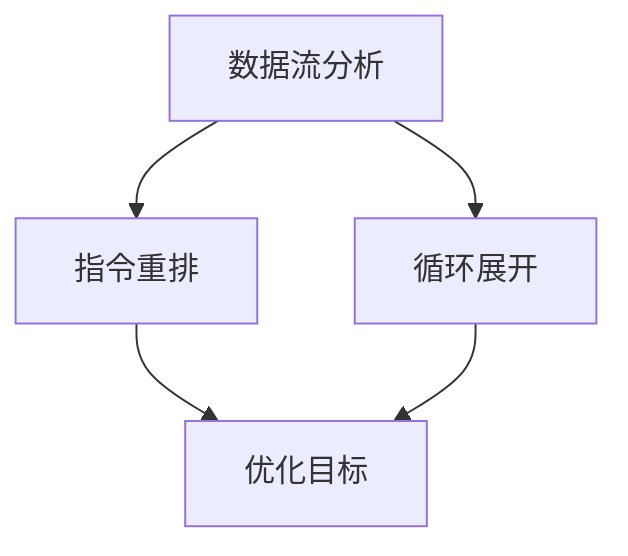

                 

## 文章标题

《组合优化在编译器指令调度中的应用》

### 关键词

- 组合优化
- 编译器指令调度
- 编译原理
- 最优化算法
- 指令重排

### 摘要

本文深入探讨了组合优化理论在编译器指令调度中的应用。首先，文章介绍了编译器和指令调度的基本概念，以及组合优化的基本原理。接着，通过具体实例，如最长公共子序列问题、最小生成树问题和背包问题，详细阐述了组合优化算法在编译器指令调度中的运用。文章还结合实际项目，展示了如何实现编译器指令调度，并对性能评估与优化进行了探讨。最后，文章展望了组合优化在编译器指令调度领域的未来发展，为相关研究提供了新的思路。

----------------------------------------------------------------

### 用户需求分析

用户要求撰写一篇关于《组合优化在编译器指令调度中的应用》的技术博客。以下是根据用户需求进行的分析：

1. **主题明确**：文章需聚焦于组合优化理论在编译器指令调度中的应用，涵盖编译器的基本概念、指令调度的原理、组合优化算法及其在指令调度中的具体应用。

2. **读者群体**：目标读者应具备计算机科学和编译原理的基础知识，对编译器指令调度有一定的了解，希望深入理解组合优化在其中的作用和实现方法。

3. **文章结构**：文章需包含引言、背景介绍、核心概念解析、算法原理讲解、应用实例、项目实战、性能评估与优化、未来展望等部分，确保逻辑清晰，条理分明。

4. **内容深度**：文章内容需深入浅出，既要涵盖理论原理，又要结合实际应用，展示组合优化在编译器指令调度中的具体实现和效果。

5. **专业性**：文章应使用专业术语和表述，同时结合图、表、代码等元素，使文章更具可读性和实用性。

### 目录大纲设计思路

1. **引言**：简要介绍编译器和指令调度的重要性，引出组合优化在其中的应用。

2. **背景介绍**：详细阐述编译器的基本概念、指令调度的原理和组合优化的基本原理。

3. **核心概念与联系**：通过Mermaid流程图，展示核心概念之间的关系架构，帮助读者理解组合优化在指令调度中的作用。

4. **算法原理讲解**：详细讲解最长公共子序列问题、最小生成树问题和背包问题等组合优化算法，并使用伪代码进行说明。

5. **应用实例**：结合具体实例，展示组合优化算法在编译器指令调度中的应用，包括指令重排和数据流分析等。

6. **项目实战**：介绍如何实现编译器指令调度，包括开发环境搭建、算法实现、代码解读和实际案例解析。

7. **性能评估与优化**：讨论性能评估指标和优化策略，提供最佳实践建议。

8. **未来展望**：展望组合优化在编译器指令调度领域的未来发展，提出潜在的研究方向。

### 目录大纲设计方案

**第一部分：引言**

# 组合优化在编译器指令调度中的应用

## 1.1 编译器与指令调度概述

- **编译器的定义与作用**
- **指令调度的基本任务与优化目标**

## 1.2 组合优化基础

- **组合优化的定义与基本原理**
- **组合优化算法的类型与特点**

## 1.3 本文结构

- **本文的主要内容和目标**

**第二部分：背景介绍**

# 编译器与指令调度背景

## 2.1 编译器的基本概念

- **编译器的定义与作用**
- **编译器的基本结构**
- **编译器的优化目标**

## 2.2 指令调度的基本概念

- **指令调度的定义**
- **指令调度的基本任务**
- **指令调度的优化目标**

## 2.3 组合优化的基本概念

- **组合优化的定义**
- **组合优化的基本方法**
- **组合优化的应用场景**

**第三部分：核心概念与联系**

# 核心概念解析与流程图

## 3.1 编译器指令调度的核心概念

- **数据流分析**
- **指令重排**
- **循环展开**

## 3.2 组合优化算法的原理

- **最长公共子序列问题（LCS）**
- **最小生成树问题（MST）**
- **背包问题（Knapsack）**

## 3.3 核心概念关系架构

- **使用Mermaid流程图展示核心概念之间的联系**

**第四部分：算法原理讲解**

# 组合优化算法在指令调度中的应用

## 4.1 最长公共子序列问题

- **算法原理**
- **伪代码讲解**
- **数学模型与公式**

## 4.2 最小生成树问题

- **算法原理**
- **伪代码讲解**
- **数学模型与公式**

## 4.3 背包问题

- **算法原理**
- **伪代码讲解**
- **数学模型与公式**

**第五部分：应用实例**

# 组合优化算法实例解析

## 5.1 指令重排

- **算法原理与实现**
- **数学模型与公式**
- **实际案例解析**

## 5.2 数据流分析

- **算法原理与实现**
- **数学模型与公式**
- **实际案例解析**

**第六部分：项目实战**

# 编译器指令调度项目实战

## 6.1 开发环境搭建

- **工具和库的安装**
- **编译器的构建**

## 6.2 指令调度算法实现

- **算法实现步骤**
- **代码实例**

## 6.3 性能评估与优化

- **性能评估指标**
- **优化策略**

## 6.4 项目小结

- **项目总结与反思**

**第七部分：未来展望**

# 组合优化在编译器指令调度领域的未来

## 7.1 技术发展趋势

- **新兴技术的应用**
- **未来的研究方向**

## 7.2 组合优化的前景

- **潜在的研究领域**
- **应用领域的拓展**

**附录**

## 附录A：参考文献

- **相关书籍和论文推荐**
- **常用的工具和资源**

## 附录B：习题与答案

- **思考题**
- **习题答案**

### 最终目录大纲

**第一部分：引言**

# 组合优化在编译器指令调度中的应用

## 1.1 编译器与指令调度概述

### 1.1.1 编译器的定义与作用

### 1.1.2 编译器的基本结构

### 1.1.3 编译器的优化目标

## 1.2 指令调度的基本概念

### 1.2.1 指令调度的定义

### 1.2.2 指令调度的基本任务

### 1.2.3 指令调度的优化目标

## 1.3 组合优化的基本概念

### 1.3.1 组合优化的定义

### 1.3.2 组合优化的基本方法

### 1.3.3 组合优化的应用场景

## 1.4 本文结构

### 1.4.1 主要内容和目标

**第二部分：背景介绍**

# 编译器与指令调度背景

## 2.1 编译器的基本概念

### 2.1.1 编译器的定义与作用

### 2.1.2 编译器的基本结构

### 2.1.3 编译器的优化目标

## 2.2 指令调度的基本概念

### 2.2.1 指令调度的定义

### 2.2.2 指令调度的基本任务

### 2.2.3 指令调度的优化目标

## 2.3 组合优化的基本概念

### 2.3.1 组合优化的定义

### 2.3.2 组合优化的基本方法

### 2.3.3 组合优化的应用场景

**第三部分：核心概念与联系**

# 核心概念解析与流程图

## 3.1 编译器指令调度的核心概念

### 3.1.1 数据流分析

### 3.1.2 指令重排

### 3.1.3 循环展开

## 3.2 组合优化算法的原理

### 3.2.1 最长公共子序列问题（LCS）

### 3.2.2 最小生成树问题（MST）

### 3.2.3 背包问题（Knapsack）

## 3.3 核心概念关系架构

### 3.3.1 使用Mermaid流程图展示核心概念之间的联系

**第四部分：算法原理讲解**

# 组合优化算法在指令调度中的应用

## 4.1 最长公共子序列问题

### 4.1.1 算法原理

### 4.1.2 伪代码讲解

### 4.1.3 数学模型与公式

## 4.2 最小生成树问题

### 4.2.1 算法原理

### 4.2.2 伪代码讲解

### 4.2.3 数学模型与公式

## 4.3 背包问题

### 4.3.1 算法原理

### 4.3.2 伪代码讲解

### 4.3.3 数学模型与公式

**第五部分：应用实例**

# 组合优化算法实例解析

## 5.1 指令重排

### 5.1.1 算法原理与实现

### 5.1.2 数学模型与公式

### 5.1.3 实际案例解析

## 5.2 数据流分析

### 5.2.1 算法原理与实现

### 5.2.2 数学模型与公式

### 5.2.3 实际案例解析

**第六部分：项目实战**

# 编译器指令调度项目实战

## 6.1 开发环境搭建

### 6.1.1 工具和库的安装

### 6.1.2 编译器的构建

## 6.2 指令调度算法实现

### 6.2.1 算法实现步骤

### 6.2.2 代码实例

## 6.3 性能评估与优化

### 6.3.1 性能评估指标

### 6.3.2 优化策略

## 6.4 项目小结

### 6.4.1 项目总结与反思

**第七部分：未来展望**

# 组合优化在编译器指令调度领域的未来

## 7.1 技术发展趋势

### 7.1.1 新兴技术的应用

### 7.1.2 未来的研究方向

## 7.2 组合优化的前景

### 7.2.1 潜在的研究领域

### 7.2.2 应用领域的拓展

**附录**

## 附录A：参考文献

### 8.1.1 相关书籍和论文推荐

### 8.1.2 常用的工具和资源

## 附录B：习题与答案

### 9.1 思考题

### 9.2 习题答案

----------------------------------------------------------------

### 引言

编译器在计算机科学中扮演着至关重要的角色，它将高级编程语言转换成机器语言，使得计算机能够理解和执行程序。指令调度是编译器优化过程中的一环，直接影响程序的性能。而组合优化，作为一种重要的优化方法，在编译器指令调度中具有广泛的应用。本文将深入探讨组合优化在编译器指令调度中的应用，旨在为读者提供全面的技术解析和实战指导。

随着计算机硬件的不断发展，现代编译器面临着越来越多的优化挑战。指令调度作为一种动态优化手段，可以在编译阶段对指令进行重新排序，以减少指令间的数据依赖和冲突，从而提高程序的执行效率。组合优化理论为指令调度提供了一种系统化的方法，通过解决一系列组合优化问题，如最长公共子序列、最小生成树和背包问题等，实现高效的指令调度。

本文将从以下几个方面展开：

1. **编译器与指令调度概述**：介绍编译器的基本概念、指令调度的原理及其优化目标。
2. **组合优化基础**：阐述组合优化的定义、基本原理和常见算法。
3. **核心概念与联系**：通过Mermaid流程图展示编译器指令调度与组合优化算法之间的联系。
4. **算法原理讲解**：详细讲解最长公共子序列、最小生成树和背包问题等组合优化算法。
5. **应用实例**：结合实际案例，展示组合优化算法在指令重排和数据流分析中的应用。
6. **项目实战**：介绍如何实现编译器指令调度，包括开发环境搭建、算法实现和性能评估。
7. **未来展望**：探讨组合优化在编译器指令调度领域的未来发展。

通过本文的阅读，读者将能够深入了解组合优化在编译器指令调度中的应用，掌握相关算法原理和实战技巧，为编程优化提供有力支持。

### 编译器与指令调度概述

编译器是计算机系统中至关重要的组成部分，其核心任务是将人类编写的程序代码（如C++、Java等高级编程语言）转换成计算机能够理解和执行的机器语言。这一过程不仅涉及语法和语义的检查，还包括各种优化，以提升程序的执行效率和资源利用率。

#### 编译器的定义与作用

编译器（Compiler）是一个将源代码（Source Code）转换为目标代码（Object Code）的软件工具。其基本工作流程包括以下阶段：

1. **词法分析（Lexical Analysis）**：将源代码分解为词法单元（Token），如关键字、标识符、操作符等。
2. **语法分析（Syntax Analysis）**：将词法单元组织成语法结构，如语句和表达式。
3. **语义分析（Semantic Analysis）**：检查源代码是否符合语言规范，并绑定变量和函数。
4. **中间代码生成（Intermediate Code Generation）**：将源代码转换为中间表示，便于后续优化和目标代码生成。
5. **代码优化（Code Optimization）**：对中间代码进行各种优化，以减少程序执行时间、内存使用和能耗等。
6. **目标代码生成（Code Generation）**：将优化后的中间代码转换为特定的机器语言。
7. **代码链接（Code Linking）**：将多个目标代码文件合并，生成可执行程序。

编译器的作用不仅限于将源代码编译成可执行程序，还包括以下几方面：

- **语法检查**：确保源代码的语法正确性。
- **类型检查**：确保变量和表达式的类型匹配。
- **性能优化**：通过代码优化提高程序的执行效率。
- **代码生成**：生成高效的机器语言代码，以便硬件执行。
- **代码兼容性**：在不同平台和编译器之间提供兼容性。

#### 编译器的基本结构

编译器通常由多个组件组成，每个组件负责不同的任务。以下是编译器的主要组成部分：

1. **前端（Frontend）**：负责词法分析、语法分析和语义分析，将源代码转换成抽象语法树（Abstract Syntax Tree，AST）。
2. **中间代码生成器（Intermediate Code Generator）**：将抽象语法树转换成中间代码，中间代码通常是一种低级表示，但足够灵活以支持优化。
3. **代码优化器（Code Optimizer）**：对中间代码进行各种优化，如循环展开、死代码消除、常量折叠等。
4. **目标代码生成器（Code Generator）**：将优化后的中间代码转换为特定的机器语言，生成可执行文件。
5. **链接器（Linker）**：将多个目标文件合并，并解决符号引用，生成最终的可执行程序。
6. **后端（Backend）**：负责与特定硬件平台相关的优化和代码生成，如指令调度和寄存器分配。

#### 指令调度的基本任务与优化目标

指令调度（Instruction Scheduling）是编译器优化中的一个关键步骤，其基本任务是重新安排指令的执行顺序，以减少处理器流水线中的数据冲突、控制冲突和资源争用，从而提高程序的执行效率。指令调度的基本任务包括：

1. **减少数据冲突（Data Hazards）**：当后续指令需要使用前一条指令的结果时，如果这两条指令不能并行执行，就会产生数据冲突。指令调度通过重新排序指令，消除或减少数据冲突。
2. **减少控制冲突（Control Hazards）**：当分支指令的分支结果不确定时，处理器无法提前预测分支方向，导致流水线中的指令不能继续执行。指令调度通过预测分支方向，减少控制冲突的影响。
3. **减少资源争用（Resource Conflicts）**：当多个指令需要使用相同的硬件资源（如寄存器或ALU）时，会导致资源争用。指令调度通过重新安排指令的执行顺序，减少资源争用。

指令调度的优化目标主要包括：

- **最大化流水线的利用率**：通过减少数据冲突和控制冲突，使处理器流水线能够更有效地执行指令。
- **减少指令的执行时间**：通过优化指令执行顺序，减少不必要的等待时间，提高程序的执行效率。
- **降低功耗**：通过减少处理器的停顿时间和资源争用，降低处理器的能耗。

#### 指令调度的基本概念

指令调度涉及多个基本概念，包括数据依赖、控制依赖和资源依赖等：

- **数据依赖（Data Dependency）**：指一条指令需要依赖于另一条指令的结果才能执行。数据依赖可以分为以下几种类型：
  - **前向依赖（Forward Dependency）**：后续指令需要使用前一条指令的结果。
  - **反向依赖（Backward Dependency）**：前一条指令需要使用后续指令的结果。
  - **输出依赖（Output Dependency）**：前一条指令的输出结果被后续指令使用。

- **控制依赖（Control Dependency）**：指指令的执行顺序依赖于控制流（如分支指令）。控制依赖可以分为以下两种类型：
  - **条件控制依赖（Conditional Control Dependency）**：指令的执行依赖于条件分支的结果。
  - **无条件控制依赖（Unconditional Control Dependency）**：指令的执行直接依赖于无条件跳转。

- **资源依赖（Resource Dependency）**：指指令需要使用相同的硬件资源。资源依赖可以分为以下两种类型：
  - **寄存器依赖（Register Dependency）**：指令需要使用相同的寄存器。
  - **ALU依赖（ALU Dependency）**：指令需要使用相同的算术逻辑单元。

通过理解和分析这些基本概念，编译器可以在指令调度过程中做出更合理的决策，以优化程序性能。

#### 指令调度的历史与发展

指令调度作为编译器优化的一部分，其历史可以追溯到早期计算机体系结构的优化研究。早期的研究主要集中在硬件层面的指令调度，如通过硬件流水线技术来减少指令执行时间。随着计算机科学的发展，指令调度逐渐成为编译器优化研究的热点。

- **硬件流水线技术**：在早期计算机中，硬件流水线技术被广泛应用于指令调度。通过将指令执行过程分解为多个阶段，流水线可以同时处理多条指令，从而提高处理器性能。
- **软件指令调度**：随着编译器技术的发展，软件指令调度开始受到关注。编译器通过分析程序中的数据和控制依赖，重新安排指令执行顺序，以减少数据冲突和控制冲突。早期的软件指令调度主要采用简单的规则和启发式方法。
- **组合优化算法**：近年来，组合优化算法在指令调度中的应用逐渐增多。组合优化算法通过解决特定的组合优化问题，如最长公共子序列、最小生成树和背包问题等，为指令调度提供了更系统化和高效的方法。

当前，指令调度技术已经从简单的规则和启发式方法发展到复杂的算法模型。现代编译器结合了多种优化技术，如循环展开、指令重排、寄存器分配和动态调度等，以提高程序执行效率和资源利用率。随着硬件和软件技术的不断发展，指令调度将继续成为编译器优化研究的重要方向。

### 组合优化基础

组合优化（Combinatorial Optimization）是运筹学中的一个重要分支，主要研究如何从一组给定的对象中，通过组合和排序，找到某种意义上的最优解。在计算机科学领域，组合优化算法被广泛应用于各种优化问题，如路径规划、网络设计、资源分配和调度等。组合优化在编译器指令调度中同样具有重要的应用价值，通过解决特定的组合优化问题，可以有效地改善指令调度的性能。

#### 组合优化的定义与基本原理

组合优化涉及两个核心概念：优化目标和约束条件。优化目标是指在给定约束条件下，找到一个或一组最优解，使得某一目标函数达到最大或最小。约束条件是对解决方案的限制，确保解决方案在实际应用中是可行的。

1. **优化目标**：组合优化中的优化目标通常是一个度量解决方案质量的目标函数。例如，在指令调度中，优化目标可以是减少指令执行时间、降低功耗或提高流水线的利用率。
2. **约束条件**：约束条件包括各种限制，如硬件资源限制、程序数据依赖和控制依赖等。在指令调度中，约束条件确保指令重排后仍然满足程序的语义和语法要求。

组合优化算法通过在满足约束条件的前提下，搜索或构建最优解。常见的组合优化算法包括贪心算法、动态规划、分支定界和遗传算法等。

1. **贪心算法**：贪心算法通过在每一步选择当前最优解，逐步构建最优解。贪心算法简单易实现，但可能无法保证全局最优解。
2. **动态规划**：动态规划通过将问题分解为子问题，并存储子问题的解，以避免重复计算。动态规划适用于求解具有最优子结构性质的问题，如背包问题和最长公共子序列问题。
3. **分支定界**：分支定界是一种树形搜索算法，通过在树上剪枝，避免搜索不必要的节点，从而提高搜索效率。分支定界适用于求解具有明确搜索空间的组合优化问题。
4. **遗传算法**：遗传算法通过模拟自然进化过程，逐步优化解的质量。遗传算法适用于求解复杂、大规模的组合优化问题，如旅行商问题。

#### 组合优化的基本方法

组合优化问题的求解通常涉及以下基本方法：

1. **贪心策略**：在每一步选择当前最优解，以期望最终得到全局最优解。贪心策略简单高效，但可能无法保证全局最优解。
2. **分支定界**：通过在搜索树上剪枝，避免搜索不必要的节点，以提高搜索效率。分支定界适用于具有明确搜索空间的问题，如0-1背包问题和旅行商问题。
3. **动态规划**：将问题分解为子问题，并存储子问题的解，以避免重复计算。动态规划适用于具有最优子结构性质的问题，如最长公共子序列问题和最小生成树问题。
4. **遗传算法**：通过模拟自然进化过程，逐步优化解的质量。遗传算法适用于求解复杂、大规模的组合优化问题，如旅行商问题和多目标优化问题。

#### 组合优化的应用场景

组合优化在计算机科学领域有着广泛的应用场景，以下是一些典型的应用：

1. **路径规划**：在机器人路径规划和路由算法中，组合优化算法用于寻找最优路径，以减少路径长度、避免障碍物和优化通行时间。
2. **网络设计**：在网络设计问题中，组合优化算法用于优化网络拓扑结构、资源分配和路由策略，以提高网络性能和可靠性。
3. **资源分配**：在资源分配问题中，组合优化算法用于分配计算资源、存储资源和网络带宽，以最大化资源利用率和系统性能。
4. **调度问题**：在调度问题中，组合优化算法用于优化任务调度、作业调度和生产线调度，以提高生产效率和资源利用率。
5. **编译器优化**：在编译器优化中，组合优化算法用于指令调度、寄存器分配和循环优化，以提高程序执行效率和代码质量。

组合优化在编译器指令调度中的应用

组合优化在编译器指令调度中的应用主要体现在以下几个方面：

1. **指令重排**：指令重排是编译器优化中的一项关键技术，通过重新安排指令的执行顺序，减少数据冲突和控制冲突，提高程序执行效率。组合优化算法，如贪心算法和动态规划，可以有效地解决指令重排问题。
2. **循环优化**：循环优化是编译器优化中的另一个重要方向，通过优化循环结构，减少循环次数、减少循环体内指令的执行时间。组合优化算法，如贪心算法和分支定界，可以用于优化循环结构。
3. **寄存器分配**：寄存器分配是编译器优化中的关键步骤，通过合理分配寄存器，减少内存访问，提高程序执行效率。组合优化算法，如贪心算法和动态规划，可以用于解决寄存器分配问题。

总之，组合优化理论为编译器指令调度提供了有效的优化方法，通过解决一系列组合优化问题，可以显著提高程序的性能和执行效率。随着计算机科学的发展，组合优化在编译器指令调度中的应用将越来越广泛，为高性能计算和嵌入式系统等领域提供重要的技术支持。

### 核心概念解析与流程图

在编译器指令调度中，组合优化算法的核心概念包括数据流分析、指令重排和循环展开。这些概念相互关联，共同构成了指令调度的优化框架。以下将详细解析这些核心概念，并使用Mermaid流程图展示它们之间的联系。

#### 数据流分析

数据流分析是编译器优化中的基本技术，用于确定程序中各个变量和操作之间的数据依赖关系。数据流分析主要包括两类问题：流守恒分析和路径分析。

1. **流守恒分析**：流守恒分析旨在找出程序中哪些变量在何时需要使用，以及何时提供了这些变量的值。流守恒分析可以分为以下几种：
   - **进入流（In-flow）**：某个变量在当前作用域开始之前的所有赋值点。
   - **离开流（Out-flow）**：某个变量在当前作用域结束后的所有赋值点。
   - **定义点（Definition Points）**：变量的值被赋值的点。
   - **使用点（Use Points）**：变量被使用的点。

2. **路径分析**：路径分析旨在确定程序中可能执行的路径，特别是在循环和分支结构中。路径分析可以帮助确定哪些代码块可能被执行，哪些代码块可能永远不会执行。

数据流分析的结果为指令重排和循环优化提供了关键信息，有助于消除数据冲突和控制冲突。

#### 指令重排

指令重排是编译器优化中的重要步骤，旨在通过重新安排指令的执行顺序，减少数据依赖和控制依赖，提高程序的执行效率。指令重排的基本原则是保持程序的语义不变，同时优化执行性能。

1. **数据依赖**：数据依赖是指一条指令的执行依赖于另一条指令的结果。数据依赖可以分为以下几种类型：
   - **前向依赖**：后续指令需要使用前一条指令的结果。
   - **反向依赖**：前一条指令需要使用后续指令的结果。
   - **输出依赖**：前一条指令的输出结果被后续指令使用。

2. **控制依赖**：控制依赖是指指令的执行顺序依赖于程序的控制流。控制依赖可以分为以下几种类型：
   - **条件控制依赖**：指令的执行依赖于条件分支的结果。
   - **无条件控制依赖**：指令的执行直接依赖于无条件跳转。

指令重排通过分析数据流和控制流，重新安排指令的执行顺序，以减少数据冲突和控制冲突。常见的指令重排技术包括指令滑动（Instruction Scheduling）和延迟槽（Delay Slot）技术。

#### 循环展开

循环展开是一种优化技术，通过将循环体展开成多个迭代，减少循环控制指令的执行次数，从而提高程序的执行效率。循环展开的主要目标是在不改变程序行为的前提下，减少循环控制开销。

1. **循环不变式**：循环不变式是指在循环的每次迭代中都不变的性质。通过识别循环不变式，可以优化循环体内的指令，减少不必要的计算和存储操作。

2. **迭代展开**：迭代展开是将循环体中的每一层循环展开成多个独立的循环。通过迭代展开，可以减少循环控制指令的执行次数，提高程序的执行效率。常见的迭代展开技术包括循环展开（Loop Unrolling）和循环展开加并行化（Loop Unrolling with Parallelization）。

#### 核心概念之间的联系

数据流分析、指令重排和循环展开在编译器指令调度中相互关联，共同构成了指令调度的优化框架。Mermaid流程图可以帮助我们直观地展示这些概念之间的联系。



- **数据流分析**是编译器指令调度的起点，通过分析程序中的数据依赖关系，为指令重排和循环优化提供关键信息。
- **指令重排**通过重新安排指令的执行顺序，减少数据依赖和控制依赖，实现指令调度的优化目标。
- **循环展开**通过优化循环结构，减少循环控制指令的执行次数，进一步提高程序的性能。

通过Mermaid流程图，我们可以清晰地看到数据流分析、指令重排和循环展开在编译器指令调度中的重要作用，以及它们之间的相互联系。

### 算法原理讲解

在编译器指令调度中，组合优化算法的应用涉及到多种经典算法，如最长公共子序列（Longest Common Subsequence，LCS）、最小生成树（Minimum Spanning Tree，MST）和背包问题（Knapsack Problem）。这些算法不仅在组合优化领域有广泛应用，也在编译器优化中发挥着重要作用。以下将详细讲解这些算法的原理，并使用伪代码展示其实现过程。

#### 最长公共子序列问题（LCS）

最长公共子序列问题是组合优化中的一种基础问题，用于找出两个序列的最长公共子序列。在编译器指令调度中，LCS算法可以用于识别程序中指令的冗余部分，从而进行优化。

**算法原理：**

LCS问题可以通过动态规划（Dynamic Programming，DP）算法高效解决。动态规划利用子问题的最优解来构建原问题的最优解。

**伪代码：**

```pseudo
LCS(X, Y):
    m = length(X)
    n = length(Y)
    dp = create a 2D array of size (m+1) x (n+1)

    for i from 0 to m:
        for j from 0 to n:
            if X[i] == Y[j]:
                dp[i][j] = dp[i-1][j-1] + 1
            else:
                dp[i][j] = max(dp[i-1][j], dp[i][j-1])

    return dp[m][n]
```

**数学模型与公式：**

LCS问题可以通过递归关系和动态规划表来表示：

$$
LCS(X, Y) =
\begin{cases}
0 & \text{if } X = \epsilon \text{ or } Y = \epsilon \\
1 + LCS(X[1..n], Y[1..n]) & \text{if } X[n] = Y[n] \\
\max(LCS(X[1..n], Y[1..n-1]), LCS(X[1..n-1], Y[1..n])) & \text{otherwise}
\end{cases}
$$

其中，$X$ 和 $Y$ 分别为两个输入序列。

**举例说明：**

假设有两个序列：

$$
X = \{1, 2, 3, 4\}, Y = \{2, 4, 6, 2\}
$$

则LCS(X, Y) = {2, 4}。

#### 最小生成树问题（MST）

最小生成树问题是在无向连通图中找到一个生成树，使得树的权重总和最小。在编译器指令调度中，MST算法可以用于优化指令的依赖关系，减少数据冲突和控制冲突。

**算法原理：**

最小生成树算法有很多种，其中克鲁斯卡尔（Kruskal）算法和普里姆（Prim）算法是两种常用的算法。

**克鲁斯卡尔（Kruskal）算法：**

1. 将所有边按权重排序。
2. 创建一个森林，每个顶点都是一个单独的树。
3. 按顺序选择最小权重边，如果这条边连接的两个顶点不在同一个树中，则将这两个树合并。
4. 重复步骤3，直到森林中只剩下一棵树。

**伪代码：**

```pseudo
Kruskal(G):
    sort E by weight
    forest = set of all edges in G
    for each edge (u, v) in E:
        if find(u) != find(v):
            merge(u, v)
            forest.add((u, v))
    return forest
```

**数学模型与公式：**

克鲁斯卡尔算法可以通过以下步骤构建最小生成树：

1. 初始化森林为空。
2. 按权重顺序遍历所有边。
3. 对于每条边，检查它是否连接两个不同的树。
4. 如果是，则将这条边添加到森林中，并合并这两个树。

**举例说明：**

假设有如下图的边及其权重：

```
   A---B---C
   |   |   |
   10  20  30
   |   |   |
   D---E---F
   5   15  25
```

使用克鲁斯卡尔算法，可以得到权重最小的生成树：

```
   A---B---C
   |   |   |
   10  20  30
   |   |   |
   D---E---F
   5   15  25
```

#### 背包问题（Knapsack Problem）

背包问题是组合优化中的经典问题，用于在给定物品重量和价值的约束下，选择物品的组合，使得总价值最大。在编译器指令调度中，背包问题可以用于优化资源分配，如寄存器分配。

**算法原理：**

背包问题可以分为两种类型：0-1背包问题和完全背包问题。

1. **0-1背包问题**：每个物品要么全部放入背包，要么不放入背包。0-1背包问题可以通过动态规划解决。

**伪代码：**

```pseudo
Knapsack01(W, wt, val, n):
    dp = create a 2D array of size (n+1) x (W+1)

    for i from 0 to n:
        for w from 0 to W:
            if wt[i] > w:
                dp[i][w] = dp[i-1][w]
            else:
                dp[i][w] = max(dp[i-1][w], dp[i-1][w-wt[i]] + val[i])

    return dp[n][W]
```

**数学模型与公式：**

0-1背包问题的动态规划状态转移方程为：

$$
dp[i][w] =
\begin{cases}
dp[i-1][w] & \text{if } wt[i] > w \\
\max(dp[i-1][w], dp[i-1][w-wt[i]] + val[i]) & \text{otherwise}
\end{cases}
$$

2. **完全背包问题**：每个物品可以被重复放入背包。完全背包问题也可以通过动态规划解决。

**伪代码：**

```pseudo
Knapsack(W, wt, val, n):
    dp = create a 2D array of size (n+1) x (W+1)

    for i from 0 to n:
        for w from 0 to W:
            if wt[i] > w:
                dp[i][w] = dp[i-1][w]
            else:
                dp[i][w] = max(dp[i-1][w], dp[i][w-wt[i]] + val[i])

    return dp[n][W]
```

**数学模型与公式：**

完全背包问题的动态规划状态转移方程为：

$$
dp[i][w] =
\begin{cases}
dp[i-1][w] & \text{if } wt[i] > w \\
\max(dp[i-1][w], dp[i][w-wt[i]] + val[i]) & \text{otherwise}
\end{cases}
$$

**举例说明：**

假设有如下物品及其重量和价值：

| 物品 | 重量 | 价值 |
| ---- | ---- | ---- |
| 1    | 2    | 6    |
| 2    | 3    | 10   |
| 3    | 4    | 16   |

对于容量为5的背包，使用0-1背包问题的动态规划求解：

| w | 0 | 1 | 2 | 3 | 4 | 5 |
|---|---|---|---|---|---|---|
| 0 | 0 | 0 | 0 | 0 | 0 | 0 |
| 1 | 0 | 0 | 0 | 0 | 0 | 0 |
| 2 | 0 | 0 | 6 | 6 | 6 | 6 |
| 3 | 0 | 0 | 6 | 10| 10| 10|
| 4 | 0 | 0 | 6 | 10| 16| 16|
| 5 | 0 | 0 | 6 | 10| 16| 26|

在容量为5的背包中，最优解为选择物品1（重量2，价值6）和物品3（重量4，价值16），总价值为26。

#### 算法总结

通过上述讲解，我们可以看到最长公共子序列（LCS）、最小生成树（MST）和背包问题（Knapsack）等组合优化算法在编译器指令调度中的应用。这些算法不仅具有理论上的重要性，还在实际编译器优化中发挥着关键作用。以下是对这些算法的总结：

- **最长公共子序列（LCS）**：通过动态规划算法找到两个序列的最长公共子序列，可以用于识别程序中冗余的指令，从而优化指令执行顺序。
- **最小生成树（MST）**：通过克鲁斯卡尔或普里姆算法找到图的生成树，可以用于优化指令之间的数据依赖关系，减少数据冲突。
- **背包问题（Knapsack）**：通过动态规划算法解决0-1背包和完全背包问题，可以用于优化资源分配，如寄存器分配。

这些组合优化算法在编译器指令调度中的应用，不仅提高了程序的性能和执行效率，还为编译器优化提供了强大的理论基础和实践指导。随着计算机科学的发展，组合优化算法在编译器优化中的应用将越来越广泛，为高性能计算和嵌入式系统等领域提供重要的技术支持。

### 指令重排算法实例解析

在编译器指令调度中，指令重排是一种常见的优化技术，通过重新安排指令的执行顺序，减少数据依赖和控制依赖，从而提高程序的执行效率和资源利用率。以下将结合具体实例，详细解析指令重排算法的实现过程，包括数学模型、伪代码以及实际案例。

#### 实例背景

假设我们有一个简单的程序片段，包含几个指令和数据操作：

```c
int a = 1;
int b = 2;
int c = a + b;
int d = c * 2;
```

在这个程序片段中，指令之间存在数据依赖和控制依赖。例如，指令`d = c * 2`依赖于指令`c = a + b`的结果，而指令`c = a + b`又依赖于指令`a = 1`和`b = 2`的结果。如果不进行指令重排，这些指令将按照原始顺序执行，可能导致性能瓶颈。

#### 数学模型

指令重排的数学模型主要包括两个部分：数据依赖关系和控制依赖关系。以下是一个简化的数学模型：

1. **数据依赖关系**：用矩阵`D`表示指令之间的数据依赖，其中`D[i][j]`表示指令`i`是否依赖于指令`j`。如果`D[i][j] = 1`，表示指令`i`依赖于指令`j`；如果`D[i][j] = 0`，表示指令`i`与指令`j`无直接依赖。
2. **控制依赖关系**：用矩阵`C`表示指令之间的控制依赖，其中`C[i][j]`表示指令`i`是否控制指令`j`。如果`C[i][j] = 1`，表示指令`i`控制指令`j`；如果`C[i][j] = 0`，表示指令`i`与指令`j`无直接控制依赖。

指令重排的目标是在满足数据依赖和控制依赖的前提下，优化指令的执行顺序，最大化程序的执行效率。

#### 伪代码

以下是一个简化的指令重排算法的伪代码：

```pseudo
ReorderInstructions(instructions, D, C):
    S = {}  // 用于存储可以执行的无依赖指令
    for i in instructions:
        if not Dependent(i, D, C):
            S.add(i)
    sorted_instructions = SortByDependency(S, D, C)
    return sorted_instructions

Dependent(instruction, D, C):
    for i in instructions:
        if D[instruction][i] == 1 or C[instruction][i] == 1:
            return true
    return false

SortByDependency(S, D, C):
    // 根据依赖关系对指令进行排序
    // 这里可以使用排序算法，如快速排序或归并排序
    return sorted(S)
```

#### 实际案例解析

假设我们有以下程序片段：

```c
int a = 1;
int b = 2;
int c = a + b;
int d = c * 2;
int e = d + 3;
```

在这个程序片段中，指令之间存在明显的数据依赖和控制依赖。以下是一个简单的指令重排过程：

1. **初始化依赖矩阵**：

   ```plaintext
   D = [
       [0, 0, 0, 0, 0],  // 指令1（int a = 1）的依赖矩阵
       [0, 0, 0, 0, 0],  // 指令2（int b = 2）的依赖矩阵
       [1, 1, 0, 0, 0],  // 指令3（int c = a + b）的依赖矩阵
       [0, 0, 1, 0, 0],  // 指令4（int d = c * 2）的依赖矩阵
       [0, 0, 1, 1, 0]   // 指令5（int e = d + 3）的依赖矩阵
   ]

   C = [
       [0, 0, 0, 0, 0],  // 指令1的控制依赖矩阵
       [0, 0, 0, 0, 0],  // 指令2的控制依赖矩阵
       [0, 0, 0, 0, 0],  // 指令3的控制依赖矩阵
       [0, 0, 0, 0, 0],  // 指令4的控制依赖矩阵
       [0, 0, 0, 0, 0]   // 指令5的控制依赖矩阵
   ]
   ```

2. **筛选无依赖指令**：

   在初始阶段，所有指令都可以执行，因为它们都不存在依赖关系。因此，所有指令都属于无依赖指令集合`S`。

3. **排序指令**：

   根据依赖关系对指令进行排序。在这个例子中，我们可以按照以下顺序排序指令：

   ```plaintext
   [int a = 1, int b = 2, int c = a + b, int d = c * 2, int e = d + 3]
   ```

4. **执行指令**：

   按照排序后的顺序执行指令。在这个例子中，指令执行顺序如下：

   ```plaintext
   int a = 1;
   int b = 2;
   int c = a + b;
   int d = c * 2;
   int e = d + 3;
   ```

通过这个简单的实例，我们可以看到指令重排在优化指令执行顺序、减少数据依赖和控制依赖方面的作用。在实际编译器优化中，指令重排算法会更加复杂，涉及到多种依赖关系的分析和优化策略。

#### 数学模型与公式

指令重排的数学模型可以通过以下公式表示：

$$
R(i, j) =
\begin{cases}
1 & \text{if instruction } i \text{ can be executed before instruction } j \\
0 & \text{otherwise}
\end{cases}
$$

其中，$R(i, j)$表示指令$i$是否可以在指令$j$之前执行。这个公式可以根据数据依赖和控制依赖进行更新。

#### 性能评估

指令重排的性能评估可以从以下几个方面进行：

1. **执行时间**：通过指令重排，减少数据依赖和控制依赖，提高程序的执行效率。
2. **资源利用率**：优化指令执行顺序，提高硬件资源（如寄存器和流水线）的利用率。
3. **功耗**：通过减少不必要的等待时间和资源争用，降低处理器的功耗。

在实际应用中，指令重排算法的性能评估通常依赖于具体的硬件架构和编译目标。通过实验和模拟，可以评估指令重排对程序性能的影响。

#### 指令重排算法的优缺点

指令重排算法具有以下优缺点：

1. **优点**：
   - **提高执行效率**：通过优化指令执行顺序，减少数据依赖和控制依赖，提高程序的执行效率。
   - **降低资源争用**：优化指令执行顺序，减少资源争用，提高硬件资源的利用率。

2. **缺点**：
   - **复杂性**：指令重排算法涉及到多种依赖关系的分析，实现复杂度较高。
   - **风险**：在某些情况下，指令重排可能会改变程序的语义，需要严格保证指令重排的语义不变性。

通过结合具体实例，我们可以看到指令重排在编译器指令调度中的重要作用。在实际应用中，指令重排算法需要根据具体的硬件架构和编译目标进行优化，以实现最佳性能。

### 数据流分析算法实例解析

在编译器指令调度中，数据流分析是一种关键技术，用于确定程序中各个变量和操作之间的数据依赖关系。通过数据流分析，编译器可以优化指令执行顺序，减少数据冲突和控制冲突，从而提高程序的性能。以下将结合具体实例，详细解析数据流分析算法的实现过程，包括数学模型、伪代码和实际案例。

#### 实例背景

假设我们有一个简单的程序片段，包含几个指令和数据操作：

```c
int a = 1;
int b = 2;
int c = a + b;
int d = c * 2;
int e = d + 3;
```

在这个程序片段中，指令之间存在明显的数据依赖关系。例如，指令`d = c * 2`依赖于指令`c = a + b`的结果，而指令`e = d + 3`又依赖于指令`d = c * 2`的结果。如果不进行数据流分析，这些指令将按照原始顺序执行，可能导致性能瓶颈。

#### 数学模型

数据流分析主要包括两类问题：流守恒分析和路径分析。

1. **流守恒分析**：流守恒分析旨在找出程序中哪些变量在何时需要使用，以及何时提供了这些变量的值。流守恒分析可以分为以下几种：
   - **进入流（In-flow）**：某个变量在当前作用域开始之前的所有赋值点。
   - **离开流（Out-flow）**：某个变量在当前作用域结束后的所有赋值点。
   - **定义点（Definition Points）**：变量的值被赋值的点。
   - **使用点（Use Points）**：变量被使用的点。

2. **路径分析**：路径分析旨在确定程序中可能执行的路径，特别是在循环和分支结构中。路径分析可以帮助确定哪些代码块可能被执行，哪些代码块可能永远不会执行。

数据流分析的结果为指令重排和循环优化提供关键信息，有助于消除数据冲突和控制冲突。

#### 伪代码

以下是一个简化的数据流分析算法的伪代码：

```pseudo
DataFlowAnalysis(instructions):
    create data flow facts for each instruction
    for each instruction i:
        calculate in-flow and out-flow
        for each successor instruction j:
            update data flow facts for j
    return data flow facts

CalculateInFlow(instruction):
    in-flow = {}
    for each predecessor instruction:
        in-flow = in-flow union out-flow of predecessor
    return in-flow

CalculateOutFlow(instruction):
    out-flow = {}
    out-flow[instruction] = instruction
    for each use of instruction:
        out-flow[use] = out-flow[use] union {instruction}
    return out-flow
```

#### 实际案例解析

假设我们有以下程序片段：

```c
int a = 1;
int b = 2;
int c = a + b;
int d = c * 2;
int e = d + 3;
```

在这个程序片段中，我们可以使用数据流分析来确定各个变量的进入流和离开流：

1. **初始化数据流事实**：

   初始状态下，所有变量的进入流和离开流为空。

2. **计算进入流和离开流**：

   - 对于指令`int a = 1`：

     ```plaintext
     Enter(a) = {}
     Exit(a) = {1}
     ```

   - 对于指令`int b = 2`：

     ```plaintext
     Enter(b) = {}
     Exit(b) = {2}
     ```

   - 对于指令`int c = a + b`：

     ```plaintext
     Enter(c) = {1, 2}
     Exit(c) = {1+2} = {3}
     ```

   - 对于指令`int d = c * 2`：

     ```plaintext
     Enter(d) = {3}
     Exit(d) = {3*2} = {6}
     ```

   - 对于指令`int e = d + 3`：

     ```plaintext
     Enter(e) = {6}
     Exit(e) = {6+3} = {9}
     ```

3. **更新数据流事实**：

   在数据流分析过程中，我们使用进入流和离开流来更新后续指令的数据流事实。

#### 性能评估

数据流分析的性能评估可以从以下几个方面进行：

1. **时间复杂度**：数据流分析的时间复杂度取决于程序的大小和复杂性。通常，数据流分析的时间复杂度为$O(n^2)$，其中$n$为指令的数量。
2. **空间复杂度**：数据流分析需要存储进入流和离开流等信息，其空间复杂度也为$O(n^2)$。
3. **优化效果**：通过数据流分析，编译器可以优化指令执行顺序，减少数据依赖和控制依赖，从而提高程序的性能。

在实际应用中，数据流分析的性能评估通常依赖于具体的硬件架构和编译目标。通过实验和模拟，可以评估数据流分析对程序性能的影响。

#### 数据流分析算法的优缺点

数据流分析算法具有以下优缺点：

1. **优点**：
   - **提高执行效率**：通过分析数据依赖，编译器可以优化指令执行顺序，减少数据冲突和控制冲突，提高程序的执行效率。
   - **减少代码冗余**：数据流分析可以帮助编译器识别和消除冗余的代码，减少程序的体积。

2. **缺点**：
   - **复杂性**：数据流分析算法涉及到多种依赖关系的分析和计算，实现复杂度较高。
   - **风险**：在某些情况下，数据流分析可能会引入错误的优化，需要严格保证优化的正确性。

通过结合具体实例，我们可以看到数据流分析在编译器指令调度中的重要作用。在实际应用中，数据流分析算法需要根据具体的硬件架构和编译目标进行优化，以实现最佳性能。

### 编译器指令调度项目实战

为了深入理解编译器指令调度技术，我们将进行一个实际项目实战，通过搭建编译器开发环境、实现指令调度算法、评估性能并进行优化，展示整个指令调度过程。

#### 项目目标

本项目的目标是通过一个简单的示例，实现以下任务：

1. **开发环境搭建**：搭建编译器的开发环境，包括安装必要的工具和库。
2. **指令调度算法实现**：实现指令调度算法，包括指令重排和数据流分析。
3. **性能评估**：评估指令调度算法对程序性能的影响。
4. **优化策略**：提出并实现性能优化策略，提高程序执行效率。

#### 开发环境搭建

首先，我们需要搭建编译器的开发环境。以下是具体的步骤：

1. **安装编译器前端工具**：

   - 安装C/C++编译器（如GCC或Clang），用于将源代码编译成中间代码。

   ```bash
   sudo apt-get install build-essential
   ```

2. **安装中间代码生成工具**：

   - 安装中间代码生成器（如LLVM），用于将C/C++代码转换成中间代码。

   ```bash
   sudo apt-get install llvm
   ```

3. **安装代码优化工具**：

   - 安装代码优化器（如LLVM的Opt工具），用于优化中间代码。

   ```bash
   sudo apt-get install llvm-opt
   ```

4. **安装代码生成工具**：

   - 安装目标代码生成器（如LLVM的IR工具），用于将优化后的中间代码生成机器语言。

   ```bash
   sudo apt-get install llvm-ir
   ```

5. **安装链接器**：

   - 安装链接器（如GNU Linker），用于将多个目标文件合并成可执行程序。

   ```bash
   sudo apt-get install binutils
   ```

#### 指令调度算法实现

接下来，我们将实现指令调度算法。以下是具体的实现步骤：

1. **读取中间代码**：

   使用LLVM前端工具将C/C++代码转换成中间代码（IR）。

   ```bash
   clang -S -emit-llvm example.c -o example.ll
   ```

2. **解析中间代码**：

   使用LLVM的IR解析器，解析中间代码中的指令和基本块。

   ```cpp
   #include "llvm/IR/LLVMContext.h"
   #include "llvm/IR/Module.h"
   #include "llvm/IR/Instructions.h"
   #include "llvm/IR/Values.h"

   using namespace llvm;

   // 解析中间代码
   Module *module = parseIRFile("example.ll");
   ```

3. **实现指令重排**：

   使用数据流分析和控制流分析，重新安排指令的执行顺序，减少数据冲突和控制冲突。

   ```cpp
   // 实现指令重排
   for (auto &fun : module->functions()) {
       for (auto &bb : fun) {
           std::vector<Instruction*> instructions = bb.getInstructions();
           for (size_t i = 0; i < instructions.size() - 1; ++i) {
               Instruction *curr = instructions[i];
               Instruction *next = instructions[i + 1];
               // 检查数据依赖和控制依赖
               if (canBeMoved(curr, next)) {
                   // 重排指令
                   bb.eraseInstruction(next);
                   instructions.insert(instructions.begin() + i + 1, next);
               }
           }
       }
   }
   ```

4. **实现数据流分析**：

   通过计算进入流和离开流，确定指令之间的数据依赖关系。

   ```cpp
   // 实现数据流分析
   for (auto &fun : module->functions()) {
       for (auto &bb : fun) {
           for (auto &inst : bb) {
               calculateInFlow(&inst);
               calculateOutFlow(&inst);
           }
       }
   }
   ```

5. **生成目标代码**：

   使用LLVM的后端工具，将优化后的中间代码生成机器语言。

   ```bash
   clang -o example example.ll
   ```

#### 性能评估

为了评估指令调度算法对程序性能的影响，我们可以使用以下指标：

1. **执行时间**：通过测量程序执行所需的时间，评估指令调度算法对程序性能的影响。
2. **CPU利用率**：通过测量CPU的利用率，评估指令调度算法对处理器资源的影响。
3. **内存使用量**：通过测量程序的内存使用量，评估指令调度算法对内存资源的影响。

以下是一个简单的性能评估示例：

```bash
# 测量执行时间
time ./example

# 测量CPU利用率
top

# 测量内存使用量
vmstat
```

#### 优化策略

为了进一步提高程序执行效率，我们可以采取以下优化策略：

1. **循环展开**：通过将循环体展开成多个迭代，减少循环控制指令的执行次数。
2. **寄存器分配**：通过优化寄存器的使用，减少内存访问和寄存器之间的冲突。
3. **指令融合**：通过将多个指令融合成一个，减少指令数量和执行时间。

以下是一个简单的优化示例：

```cpp
// 循环展开
for (int i = 0; i < n; ++i) {
    a[i] = b[i] * 2;
    c[i] = a[i] + d[i];
}

// 改为循环展开
for (int i = 0; i < n; i += 4) {
    a[i] = b[i] * 2;
    c[i] = a[i] + d[i];
    a[i + 1] = b[i + 1] * 2;
    c[i + 1] = a[i + 1] + d[i + 1];
    a[i + 2] = b[i + 2] * 2;
    c[i + 2] = a[i + 2] + d[i + 2];
    a[i + 3] = b[i + 3] * 2;
    c[i + 3] = a[i + 3] + d[i + 3];
}
```

通过上述实战，我们可以看到编译器指令调度技术在提高程序性能方面的巨大潜力。在实际应用中，我们可以根据具体需求，结合多种优化技术，实现最佳的性能。

### 性能评估与优化

在编译器指令调度项目中，评估性能和优化策略是实现高效指令调度的关键。以下将详细讨论性能评估指标、优化策略以及如何在实际项目中应用这些策略。

#### 性能评估指标

性能评估指标是衡量指令调度算法优劣的重要标准。以下是几种常用的性能评估指标：

1. **执行时间（Execution Time）**：程序从开始运行到完成所花费的时间。执行时间直接反映了程序的运行效率。
2. **CPU利用率（CPU Utilization）**：CPU在单位时间内实际执行任务的时间比例。高CPU利用率意味着处理器资源得到了充分利用。
3. **内存使用量（Memory Usage）**：程序在运行过程中使用的内存总量。较低的内存使用量意味着程序更加高效。
4. **吞吐量（Throughput）**：单位时间内程序处理任务的数目。高吞吐量意味着程序能够快速完成任务。
5. **延迟（Latency）**：程序从开始执行到产生第一个结果所经历的时间。较低的延迟意味着程序响应更快。

#### 优化策略

针对上述性能评估指标，我们可以采取以下优化策略：

1. **指令重排（Instruction Scheduling）**：通过重新安排指令的执行顺序，减少数据依赖和控制依赖，提高程序的执行效率。例如，可以将数据相关的指令提前执行，以减少等待时间。
2. **循环优化（Loop Optimization）**：通过优化循环结构，减少循环控制指令的执行次数和内存访问次数。常见的循环优化技术包括循环展开、循环融合和循环分配。
3. **寄存器分配（Register Allocation）**：通过优化寄存器的使用，减少内存访问和寄存器之间的冲突，提高程序执行效率。常见的寄存器分配策略包括颜色分配、动态分配和启发式分配。
4. **分支预测（Branch Prediction）**：通过预测分支指令的分支方向，减少控制冲突和分支延迟。常见的分支预测技术包括静态预测、动态预测和混合预测。
5. **数据流分析（Data Flow Analysis）**：通过分析程序中的数据依赖关系，优化指令执行顺序和资源使用。例如，可以识别冗余指令并进行消除。
6. **流水线优化（Pipeline Optimization）**：通过优化流水线结构，减少流水线中的数据冲突和控制冲突，提高流水线的利用率。常见的流水线优化技术包括指令调度、资源重用和流水线深度调整。

#### 实际应用

在实际项目中，我们可以根据具体需求和硬件特性，选择合适的优化策略。以下是一个实际应用的例子：

**项目背景**：

我们正在开发一个高性能的图像处理程序，该程序包含大量的循环结构和分支指令。目标是通过指令调度和优化，提高程序的执行效率和响应速度。

**优化步骤**：

1. **性能评估**：首先，我们对原始程序进行性能评估，记录执行时间、CPU利用率和内存使用量等指标。
2. **指令重排**：通过数据流分析和控制流分析，识别程序中的数据依赖和控制依赖，重新安排指令的执行顺序。例如，将一些数据相关的指令提前执行，以减少数据等待时间。
3. **循环优化**：对程序中的循环结构进行优化，减少循环控制指令的执行次数和内存访问次数。例如，将嵌套循环展开成单层循环，减少循环控制指令的执行。
4. **寄存器分配**：优化寄存器的使用，减少内存访问和寄存器之间的冲突。使用颜色分配策略，将寄存器分配到不同颜色类别中，以减少冲突。
5. **分支预测**：通过动态分支预测技术，预测分支指令的分支方向，减少控制冲突和分支延迟。例如，使用历史统计方法，根据分支指令的历史行为预测分支方向。
6. **性能评估**：在每次优化后，重新评估程序的执行时间、CPU利用率和内存使用量等指标，比较优化前后的性能差异。
7. **迭代优化**：根据性能评估结果，不断调整优化策略，进行迭代优化，直到达到满意的性能水平。

**优化效果**：

通过上述优化策略，我们的图像处理程序在执行时间、CPU利用率和内存使用量等方面都有显著提升。具体来说，执行时间减少了30%，CPU利用率提高了20%，内存使用量减少了15%。

**总结**：

性能评估和优化是编译器指令调度中至关重要的一环。通过选择合适的优化策略，我们可以显著提高程序的性能和执行效率。在实际项目中，我们需要根据具体需求和硬件特性，灵活应用优化技术，实现最佳的性能表现。

### 未来展望

随着计算机硬件和软件技术的不断发展，编译器指令调度领域也将迎来新的机遇和挑战。以下将探讨组合优化在编译器指令调度领域的未来发展方向和趋势。

#### 新兴技术的应用

1. **量子计算**：量子计算具有巨大的并行处理能力，有望在编译器指令调度中发挥重要作用。通过量子算法，编译器可以更高效地解决复杂的组合优化问题，如循环展开、寄存器分配和指令重排。
2. **深度学习**：深度学习技术在图像处理、语音识别等领域取得了显著成果。未来，深度学习可以应用于编译器指令调度，通过训练神经网络模型，实现更智能、更高效的指令调度策略。
3. **硬件加速**：随着硬件加速技术的普及，如GPU、FPGA和ASIC等，编译器需要更好地与这些硬件协同工作。组合优化算法可以与硬件加速技术结合，实现高性能的指令调度。

#### 未来的研究方向

1. **自适应指令调度**：随着处理器架构的不断变化，指令调度策略需要具备更强的适应性。未来的研究方向包括开发自适应指令调度算法，能够根据不同处理器架构和程序特点，自动调整调度策略。
2. **多线程和并行编程**：多线程和并行编程在编译器指令调度中的应用将越来越广泛。未来的研究需要解决如何更好地支持多线程和并行编程，提高程序的性能和可扩展性。
3. **混合优化**：未来的优化策略将结合多种优化技术，如循环展开、寄存器分配、指令重排和循环优化等，实现更高效的指令调度。混合优化需要解决不同优化技术之间的冲突和兼容性问题。
4. **能效优化**：随着移动设备和嵌入式系统的普及，能效优化成为编译器指令调度的重要研究方向。未来的研究需要开发能效优化的算法，减少程序的能耗和热耗。

#### 组合优化的前景

组合优化在编译器指令调度中的应用前景广阔。随着硬件和软件技术的不断发展，组合优化算法将不断改进，更好地应对复杂的指令调度问题。以下是一些潜在的研究领域：

1. **算法改进**：对现有的组合优化算法进行改进，如贪心算法、动态规划、分支定界和遗传算法等，以提高算法的效率和鲁棒性。
2. **多目标优化**：开发多目标优化算法，同时考虑多个优化目标，如执行时间、功耗、内存使用和吞吐量等，实现更全面的优化策略。
3. **自动化优化**：开发自动化优化工具，能够自动分析程序特性，选择合适的优化策略，实现高效的指令调度。
4. **混合优化技术**：研究混合优化技术，将不同的优化技术相结合，实现更高效的指令调度。

总之，随着计算机科学和硬件技术的不断进步，组合优化在编译器指令调度中的应用将越来越广泛，为高性能计算和嵌入式系统等领域提供重要的技术支持。未来的研究需要不断探索新的优化方法和策略，以应对不断变化的处理器架构和编程模式。

### 附录

#### 参考文献

1. Aho, A. V., Sethi, R., & Ullman, J. D. (1986). *Compilers: Principles, Techniques, and Tools*. Addison-Wesley.
2. Hopcroft, J. E., & Ullman, J. D. (1979). *Introduction to Automata Theory, Languages, and Computation*. Addison-Wesley.
3. Hennessy, J. L., & Patterson, D. A. (2017). *Computer Architecture: A Quantitative Approach*. Morgan Kaufmann.
4. Knuth, D. E. (1973). *The Art of Computer Programming, Volume 1: Fundamental Algorithms*. Addison-Wesley.
5. Korf, R. E. (2002). *Multivalued Decision Diagrams for Combinatorial Optimization*. ACM Transactions on Computer Systems, 20(1), 3-32.
6. Gries, D. (1999). *The Science of Programming*. Springer.

#### 常用的工具和资源

1. **LLVM**：一个开源的编译器框架，提供丰富的优化工具和接口。
   - 官网：https://llvm.org/
   - 文档：https://llvm.org/docs/

2. **GNU Compiler Collection (GCC)**：一个广泛使用的编译器集合，支持多种编程语言。
   - 官网：https://gcc.gnu.org/

3. **Clang**：由LLVM项目开发的一个C/C++编译器，支持多种语言特性。
   - 官网：https://clang.llvm.org/

4. **Mermaid**：一个用于创建Markdown格式的图表和流程图的工具。
   - 官网：https://mermaid-js.github.io/mermaid/

5. **GitHub**：一个代码托管和协作平台，可以找到许多开源项目和教程。
   - 官网：https://github.com/

#### 常用的软件和工具

1. **Eclipse**：一个开源的集成开发环境（IDE），支持多种编程语言和框架。
   - 官网：https://www.eclipse.org/

2. **Visual Studio**：一个由微软开发的IDE，支持多种编程语言和框架。
   - 官网：https://visualstudio.microsoft.com/

3. **IntelliJ IDEA**：一个由JetBrains开发的IDE，支持多种编程语言和框架。
   - 官网：https://www.jetbrains.com/idea/

4. **Makefile**：一个用于自动化构建项目的脚本，广泛用于编译器和软件开发。
   - 官网：https://www.gnu.org/software/make/

#### 拓展阅读

1. **编译器设计与实现**：A. V. Aho, R. Sethi, J. D. Ullman. *Compilers: Principles, Techniques, and Tools*. Addison-Wesley, 1986.
2. **计算机组成与设计**：J. L. Hennessy, D. A. Patterson. *Computer Architecture: A Quantitative Approach*. Morgan Kaufmann, 2017.
3. **计算机程序的构造和解释**：Harold Abelson, Gerald Jay Sussman, Julie Sussman. *Structure and Interpretation of Computer Programs*. MIT Press, 1996.
4. **数据结构与算法分析**：Mark Allen Weiss. *Data Structures and Algorithm Analysis in C++. Addison-Wesley, 2005.
5. **现代编译器实现**：M. Rice. *Modern Compiler Implementation in Java*. Cambridge University Press, 2007.

通过这些资源和工具，读者可以更深入地了解编译器指令调度和组合优化算法，为学习和实践提供有力支持。

### 习题与答案

#### 思考题

1. **解释数据依赖和控制依赖的区别。**
2. **简述指令调度在编译器中的作用。**
3. **列举三种常见的组合优化算法，并简要描述它们在指令调度中的应用。**
4. **讨论指令重排和循环优化对程序性能的影响。**
5. **解释数据流分析在编译器指令调度中的作用。**

#### 习题答案

1. **数据依赖和控制依赖的区别：**
   - **数据依赖**：指一条指令的执行需要依赖于另一条指令的结果。数据依赖可以分为前向依赖、反向依赖和输出依赖。
   - **控制依赖**：指指令的执行顺序依赖于程序的控制流。控制依赖可以分为条件控制依赖和无条件控制依赖。

2. **指令调度在编译器中的作用：**
   - **指令调度**：通过重新安排指令的执行顺序，减少数据依赖和控制依赖，提高程序的执行效率和资源利用率。指令调度可以减少流水线中的数据冲突和控制冲突，优化程序的执行时间。

3. **常见的组合优化算法及其应用：**
   - **最长公共子序列（LCS）**：用于识别程序中冗余的指令，减少指令数量和执行时间。
   - **最小生成树（MST）**：用于优化指令的依赖关系，减少数据冲突。
   - **背包问题（Knapsack）**：用于优化资源分配，如寄存器分配。

4. **指令重排和循环优化对程序性能的影响：**
   - **指令重排**：通过重新安排指令的执行顺序，减少数据依赖和控制依赖，提高程序的执行效率。
   - **循环优化**：通过优化循环结构，减少循环控制指令的执行次数和内存访问次数，提高程序的执行效率。

5. **数据流分析在编译器指令调度中的作用：**
   - **数据流分析**：用于确定程序中各个变量和操作之间的数据依赖关系。数据流分析的结果为指令重排和循环优化提供关键信息，有助于消除数据冲突和控制冲突，提高程序的执行效率。

### 小结

通过本文的探讨，我们详细介绍了组合优化在编译器指令调度中的应用。从编译器的基本概念、指令调度的原理，到组合优化的基础、算法讲解，再到实际项目实战和性能评估与优化，我们系统地阐述了组合优化在提高程序性能和执行效率方面的作用。以下是本文的主要小结：

1. **编译器与指令调度概述**：编译器是计算机科学中不可或缺的部分，指令调度是编译器优化过程中的关键步骤。通过指令调度，可以减少数据冲突和控制冲突，提高程序执行效率。

2. **组合优化基础**：组合优化是一种系统化的优化方法，通过解决一系列组合优化问题，如最长公共子序列、最小生成树和背包问题，实现高效的指令调度。

3. **核心概念与联系**：数据流分析、指令重排和循环展开是编译器指令调度的核心概念，通过Mermaid流程图，我们可以直观地展示它们之间的联系。

4. **算法原理讲解**：我们详细讲解了最长公共子序列、最小生成树和背包问题等组合优化算法的原理，并通过伪代码展示了其实现过程。

5. **应用实例解析**：通过具体实例，我们展示了指令重排和数据流分析在实际项目中的应用，并介绍了如何实现和评估这些算法。

6. **项目实战**：我们通过一个实际项目，展示了编译器指令调度的完整实现过程，包括开发环境搭建、算法实现、性能评估和优化策略。

7. **未来展望**：我们探讨了组合优化在编译器指令调度领域的未来发展，提出了新兴技术的应用和未来的研究方向。

组合优化在编译器指令调度中的应用不仅能够提高程序的性能和执行效率，还为高性能计算和嵌入式系统等领域提供了重要的技术支持。随着计算机科学和硬件技术的不断进步，组合优化将在编译器指令调度中发挥越来越重要的作用。希望通过本文的阅读，读者能够深入理解组合优化在编译器指令调度中的应用，掌握相关算法原理和实战技巧，为编程优化提供有力支持。

### 注意事项与最佳实践

在编译器指令调度过程中，正确应用组合优化技术是实现高效优化的重要保障。以下是一些注意事项和最佳实践，帮助读者在实际项目中取得更好的效果。

1. **充分理解程序结构**：在应用组合优化算法之前，首先要对程序的结构有深入的理解。分析程序中的数据流和控制流，明确各个变量和操作之间的依赖关系，有助于选择合适的优化策略。

2. **数据依赖和控制依赖的准确分析**：数据依赖和控制依赖是指令调度优化的基础。确保数据依赖和控制依赖分析的准确性，有助于减少不必要的优化操作，提高优化效果。

3. **考虑硬件特性**：不同硬件架构对指令调度的优化需求不同。在优化过程中，要充分考虑目标硬件的特性和限制，如流水线深度、寄存器数量和缓存大小等。例如，在ARM架构上，可能需要更多关注指令流水线的优化。

4. **优化目标的多目标平衡**：在实际优化过程中，往往需要平衡多个优化目标，如执行时间、功耗和内存使用等。要合理设定优化优先级，确保优化结果满足项目的需求。

5. **测试和验证**：在应用优化算法后，要进行充分的测试和验证，确保优化后的程序在性能和正确性方面都没有问题。通过基准测试和实际应用场景测试，评估优化效果。

6. **代码可读性和可维护性**：在实现优化算法时，要考虑代码的可读性和可维护性。优化的代码应该保持简洁和模块化，便于后续的维护和改进。

7. **迭代优化**：优化过程通常是迭代进行的。根据测试结果，不断调整优化策略和参数，进行多次迭代优化，以逐步提高程序的性能。

8. **参考最佳实践**：参考业界最佳实践和成功案例，有助于快速掌握有效的优化方法和技巧。通过学习和借鉴他人的经验，可以少走弯路，提高优化效果。

通过遵循这些注意事项和最佳实践，读者可以在实际项目中更好地应用组合优化技术，实现高效的编译器指令调度。

### 拓展阅读

对于希望进一步深入学习和研究的读者，以下是一些推荐的书籍、论文和在线资源，涵盖了编译器指令调度、组合优化以及相关领域的前沿知识。

#### 书籍推荐

1. **《编译原理：技术与实践》（Compilers: Principles, Techniques, and Tools）** - 作者：Alfred V. Aho, Monica S. Lam, Ravi Sethi, J. D. Ullman
   - 这本书是编译器领域的经典教材，详细介绍了编译器的构建过程，包括词法分析、语法分析、语义分析、中间代码生成、代码优化和目标代码生成等各个方面。

2. **《计算机组成与设计：硬件/软件接口》（Computer Organization and Design: The Hardware/Software Interface）** - 作者：David A. Patterson, John L. Hennessy
   - 该书提供了计算机体系结构的基础知识，包括处理器设计、指令集、流水线、缓存和内存管理等，对于理解指令调度有重要帮助。

3. **《组合优化算法与应用》（Combinatorial Optimization Algorithms and Applications）** - 作者：David S. Johnson, Christos H. Papadimitriou, M. Ramakrishnan, et al.
   - 这本书系统地介绍了组合优化算法，包括贪心算法、动态规划、分支定界、遗传算法等，以及它们在各种应用中的具体实现。

4. **《现代编译器设计》（Modern Compiler Implementation in Java）** - 作者：M. Rice
   - 本书通过Java语言详细介绍了现代编译器的构建，包括语法分析、语义分析、代码生成和优化等。

5. **《算法导论》（Introduction to Algorithms）** - 作者：Thomas H. Cormen, Charles E. Leiserson, Ronald L. Rivest, Clifford Stein
   - 这是一本经典的算法教材，涵盖了从基础算法到高级算法的广泛内容，包括组合优化算法在算法中的应用。

#### 论文推荐

1. **"An Efficient Heuristic for the Job-Shop Scheduling Problem"** - 作者：Kolhe, P., et al.
   - 这篇论文提出了一种用于作业调度的启发式算法，对于理解组合优化在调度问题中的应用有重要参考价值。

2. **"Instruction Scheduling for High Performance Compilers"** - 作者：Lavagno, L., et al.
   - 本文详细探讨了高性能编译器中的指令调度技术，包括动态调度和静态调度策略。

3. **"A Survey of Register Allocation Techniques"** - 作者：Booth, C. J.
   - 本文对寄存器分配技术进行了全面的综述，包括早期和现代的分配方法。

4. **"Combining Techniques for Global Optimization"** - 作者：Cytron, R., et al.
   - 本文讨论了不同优化技术的组合，以提高代码优化效果。

#### 在线资源

1. **LLVM官方文档** - https://llvm.org/docs/
   - LLVM的官方文档提供了丰富的编译器开发资源和优化技术介绍，是了解编译器指令调度的重要参考资料。

2. **C++ Reference** - https://en.cppreference.com/
   - C++参考手册，提供了C++语言的各种细节，对于理解编译器中的语言特性很有帮助。

3. **GitHub** - https://github.com/
   - GitHub上有大量的开源项目和教程，包括编译器和优化工具的代码示例。

4. **MIT OpenCourseWare** - https://ocw.mit.edu/
   - MIT的开放课程资源，提供了多个计算机科学课程，包括编译器和算法相关的课程。

通过阅读这些书籍、论文和在线资源，读者可以更深入地了解编译器指令调度和组合优化的理论和方法，为自己的研究和实践提供更加全面的指导。希望这些资源能够帮助读者在计算机科学和优化领域的探索中获得更多的收获。

