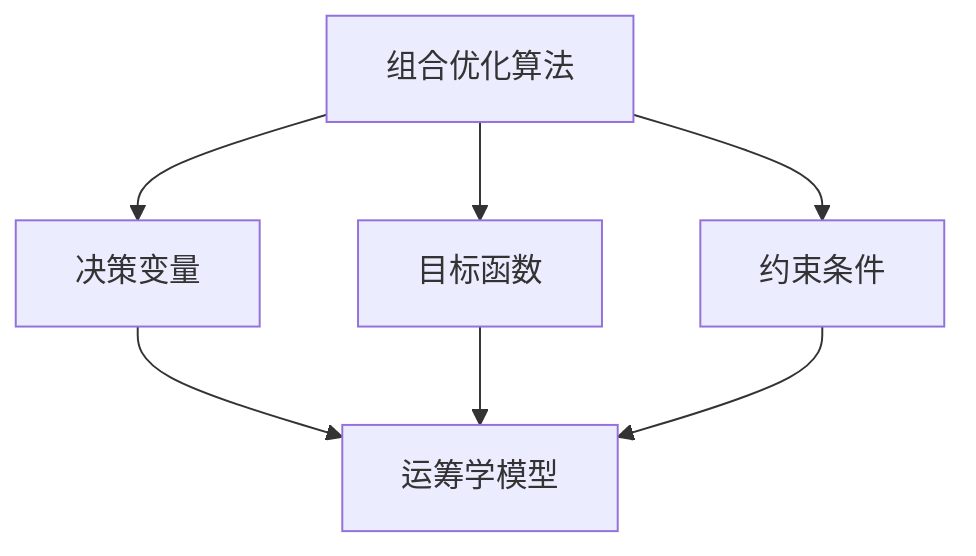
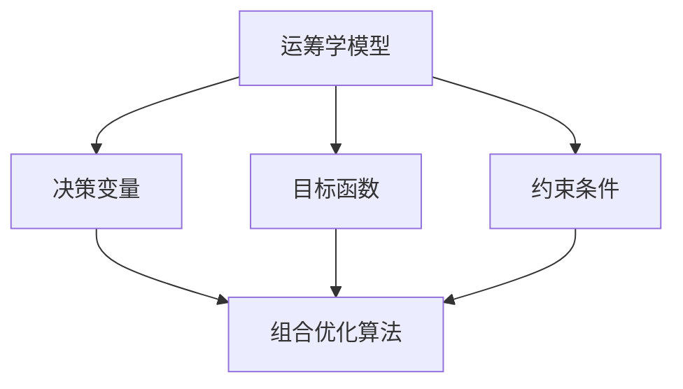
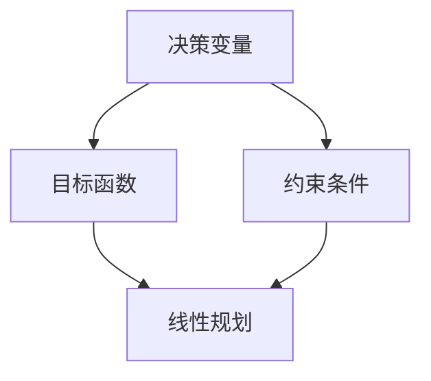

                 


### 第一步：概述与背景

#### 文章标题：组合优化在运筹学软件中的实现

#### 关键词：
- 组合优化
- 运筹学
- 软件应用
- 算法实现
- 数学模型

#### 摘要：
本文旨在探讨组合优化在运筹学软件中的应用与实践。通过深入分析组合优化的基本概念、重要性及其与运筹学的关系，本文将介绍组合优化在运筹学软件中的发展历程，并详细解析核心算法原理和数学模型。结合实际案例，本文将展示如何将组合优化算法应用于实际问题，为运筹学软件的开发提供有效的解决方案。

### 1.1 组合优化的定义与重要性

#### 1.1.1 组合优化的基本概念

组合优化是指在一组可能的决策中选择最优决策的过程。它涉及在有限的选择中寻找最优解，常见的问题类型包括排列组合问题、最短路径问题、最大匹配问题等。组合优化在许多领域都有广泛的应用，包括物流与运输、生产调度、财务投资、社会网络分析等。

#### 1.1.2 组合优化在运筹学中的应用领域

运筹学是一门应用数学的分支，旨在通过数学模型和算法解决实际决策问题。组合优化在运筹学中的应用非常广泛，主要包括以下几个方面：

- **生产调度**：优化生产流程，提高生产效率，降低成本。
- **物流与运输**：优化运输路径，提高运输效率，降低运输成本。
- **财务投资**：评估投资组合，选择最优投资策略。
- **资源分配**：优化资源分配，确保资源利用最大化。

#### 1.1.3 组合优化的重要性与挑战

组合优化在运筹学中的应用具有重要意义，它能够帮助企业和组织做出更明智的决策，提高效率和竞争力。然而，组合优化问题通常具有高度复杂性和不确定性，面临着以下几个挑战：

- **问题规模**：组合优化问题往往涉及到大量决策变量和约束条件，导致计算复杂度急剧增加。
- **约束条件**：组合优化问题中的约束条件可能涉及到非线性、动态变化，增加了求解难度。
- **计算资源**：解决组合优化问题需要大量的计算资源，特别是在大规模问题上，计算时间可能非常长。

#### 1.2 运筹学的基础理论

##### 1.2.1 运筹学的基本框架

运筹学的基本框架包括以下几个组成部分：

- **决策变量**：表示决策者需要做出的选择，如生产计划、运输路径等。
- **目标函数**：定义了决策优劣的标准，如成本最小化、利润最大化等。
- **约束条件**：限制了决策变量的取值范围，确保决策的可行性和合理性。
- **求解算法**：用于寻找最优解的算法，如线性规划、整数规划、分支定界等。

##### 1.2.2 运筹学的主要优化模型

运筹学中的主要优化模型包括：

- **线性规划**：在给定约束条件下，寻找目标函数的最大值或最小值。
- **整数规划**：决策变量需要取整数值，常用于组合优化问题。
- **非线性规划**：目标函数或约束条件包含非线性项。
- **动态规划**：用于求解多阶段决策问题，通过递推关系寻找最优解。

##### 1.2.3 运筹学的数学工具

运筹学中常用的数学工具包括：

- **线性代数**：用于求解线性方程组和矩阵运算。
- **微积分**：用于求解最优化问题中的极值问题。
- **概率论与数理统计**：用于分析随机事件和不确定性。

#### 1.3 组合优化在运筹学软件中的发展历程

##### 1.3.1 早期组合优化算法

早期组合优化算法主要包括穷举搜索法、贪心算法和回溯算法等。这些算法简单易实现，但在大规模问题上效率较低。

##### 1.3.2 现代组合优化算法的发展

随着计算机技术的发展，现代组合优化算法逐渐兴起，如遗传算法、粒子群优化算法、模拟退火算法等。这些算法具有较好的全局搜索能力和较强的鲁棒性，能够在复杂问题上找到较优的解。

##### 1.3.3 运筹学软件的发展趋势

随着运筹学在各个领域的广泛应用，运筹学软件也在不断发展和完善。目前，运筹学软件主要朝着以下方向发展：

- **智能化**：通过人工智能技术，提高算法的自适应能力和智能决策能力。
- **云化**：通过云计算技术，实现算法的可扩展性和高可用性。
- **平台化**：通过建立统一的平台，实现算法的集成和应用。

### 第二步：核心概念与联系

#### 2.1 组合优化中的核心概念

##### 2.1.1 决策变量

决策变量是指决策者在问题中需要做出的选择。例如，在资源分配问题中，决策变量可能包括生产计划、运输路径等。

##### 2.1.2 目标函数

目标函数是指决策者希望实现的目标，通常表现为某种优化标准，如成本最小化、利润最大化等。

##### 2.1.3 约束条件

约束条件是指决策变量需要满足的限制条件，以确保决策的可行性和合理性。约束条件可以分为等式约束和不等式约束。

#### 2.2 运筹学中的模型构建

##### 2.2.1 线性规划模型

线性规划模型是指决策变量、目标函数和约束条件都呈线性关系的优化问题。其标准形式为：

$$\min\ c^T x \quad \text{subject to} \quad Ax \leq b, x \geq 0$$

其中，$c$ 是系数向量，$x$ 是决策变量向量，$A$ 是约束矩阵，$b$ 是约束向量。

##### 2.2.2 整数规划模型

整数规划模型是指决策变量需要取整数值的优化问题。其标准形式为：

$$\min\ c^T x \quad \text{subject to} \quad Ax \leq b, x \in \mathbb{Z}^n$$

其中，$c$ 是系数向量，$x$ 是决策变量向量，$A$ 是约束矩阵，$b$ 是约束向量，$n$ 是决策变量个数。

##### 2.2.3 非线性规划模型

非线性规划模型是指目标函数或约束条件包含非线性项的优化问题。其标准形式为：

$$\min\ f(x) \quad \text{subject to} \quad g_i(x) \leq 0, h_j(x) = 0$$

其中，$f(x)$ 是目标函数，$g_i(x)$ 是不等式约束，$h_j(x)$ 是等式约束。

#### 2.3 组合优化与运筹学模型的联系

组合优化与运筹学模型之间存在紧密的联系。组合优化算法通常用于解决运筹学模型中的优化问题。具体来说，组合优化算法通过迭代搜索决策变量，寻找满足约束条件的最优解。而运筹学模型则为组合优化算法提供了目标函数和约束条件的数学描述。

为了更好地理解组合优化与运筹学模型之间的关系，我们可以使用 Mermaid 流程图进行描述。以下是组合优化与运筹学模型关系的 Mermaid 流程图：



在这个流程图中，组合优化算法与决策变量、目标函数和约束条件相连，表示组合优化算法需要依赖这些核心概念来构建运筹学模型。同时，运筹学模型又为组合优化算法提供了具体的求解目标。

### 第三步：核心算法原理讲解

#### 3.1 基本算法介绍

##### 3.1.1 递归算法

递归算法是一种通过递归调用自身来解决问题的算法。在组合优化中，递归算法通常用于解决具有树形结构的问题，如排序、查找等。递归算法的核心思想是通过不断分解问题，将大问题转化为小问题，从而找到最优解。

##### 3.1.2 动态规划算法

动态规划算法是一种基于递推关系求解最优化问题的算法。在组合优化中，动态规划算法常用于解决具有重叠子问题和最优子结构特性的问题。动态规划算法的核心思想是通过保存子问题的解，避免重复计算，从而提高算法的效率。

##### 3.1.3 分支定界算法

分支定界算法是一种用于求解整数规划问题的算法。在组合优化中，分支定界算法通过递归搜索所有可能的解，剪枝掉不满足约束条件的分支，从而找到最优解。分支定界算法的核心思想是通过剪枝策略减少搜索空间，提高算法的效率。

#### 3.2 现代算法解析

##### 3.2.1 遗传算法

遗传算法是一种基于生物进化的启发式搜索算法。在组合优化中，遗传算法通过模拟自然选择和遗传变异的过程，逐步优化解的适应度，最终找到最优解。遗传算法的核心思想是通过种群进化和选择操作，不断提高解的质量。

以下是遗传算法的伪代码：

```python
# 遗传算法伪代码
Initialize population
Evaluate fitness of each individual in the population
While not termination criteria do
    Select parents from the population
    Perform crossover and mutation to generate offspring
    Evaluate fitness of offspring
    Select the best individuals for the next generation
End While
```

##### 3.2.2 粒子群优化算法

粒子群优化算法是一种基于群体智能的启发式搜索算法。在组合优化中，粒子群优化算法通过模拟鸟群觅食行为，逐步优化解的位置和速度，最终找到最优解。粒子群优化算法的核心思想是通过群体协作和信息共享，提高算法的搜索能力。

以下是粒子群优化算法的伪代码：

```python
# 粒子群优化算法伪代码
Initialize particles and velocities
Evaluate fitness of each particle
While not termination criteria do
    Update velocities
    Update positions
    Evaluate fitness of new particles
    Update personal and global best positions
End While
```

#### 3.3 算法性能分析

##### 3.3.1 时间复杂度分析

时间复杂度是指算法在问题规模变化时所需计算时间的增长速率。对于组合优化算法，时间复杂度通常取决于问题的规模和算法的搜索策略。一般来说，递归算法和动态规划算法的时间复杂度较高，而遗传算法和粒子群优化算法的时间复杂度相对较低。

##### 3.3.2 空间复杂度分析

空间复杂度是指算法在问题规模变化时所需内存的增长速率。对于组合优化算法，空间复杂度主要取决于算法的存储需求。一般来说，递归算法和动态规划算法的空间复杂度较高，而遗传算法和粒子群优化算法的空间复杂度相对较低。

##### 3.3.3 算法适用性分析

算法适用性是指算法在不同类型问题上的表现。对于组合优化算法，不同算法适用于不同类型的问题。例如，遗传算法适用于连续变量问题，而粒子群优化算法适用于离散变量问题。在实际应用中，需要根据问题的特点选择合适的算法。

### 第四步：数学模型与公式讲解

#### 4.1 数学模型基础

##### 4.1.1 目标函数

目标函数是组合优化问题的核心，用于定义决策者希望实现的目标。在数学模型中，目标函数通常表示为以下形式：

$$\min\ c^T x$$

其中，$c$ 是系数向量，$x$ 是决策变量向量。

##### 4.1.2 约束条件

约束条件是组合优化问题的限制条件，用于定义决策变量的取值范围。在数学模型中，约束条件通常表示为以下形式：

$$Ax \leq b$$

$$x \geq 0$$

其中，$A$ 是约束矩阵，$b$ 是约束向量，$x$ 是决策变量向量。

##### 4.1.3 不等式与等式约束

在组合优化问题中，约束条件可以分为不等式约束和等式约束。不等式约束表示为：

$$g_i(x) \leq 0$$

等式约束表示为：

$$h_j(x) = 0$$

其中，$g_i(x)$ 是不等式约束函数，$h_j(x)$ 是等式约束函数。

#### 4.2 数学公式解析

##### 4.2.1 线性规划标准形式

线性规划是一种常见的组合优化问题，其标准形式为：

$$\min\ c^T x \quad \text{subject to} \quad Ax \leq b, x \geq 0$$

其中，$c$ 是系数向量，$x$ 是决策变量向量，$A$ 是约束矩阵，$b$ 是约束向量。

##### 4.2.2 整数规划公式

整数规划是一种特殊的组合优化问题，其标准形式为：

$$\min\ c^T x \quad \text{subject to} \quad Ax \leq b, x \in \mathbb{Z}^n$$

其中，$c$ 是系数向量，$x$ 是决策变量向量，$A$ 是约束矩阵，$b$ 是约束向量，$n$ 是决策变量个数。

##### 4.2.3 非线性规划公式

非线性规划是一种更一般的组合优化问题，其标准形式为：

$$\min\ f(x) \quad \text{subject to} \quad g_i(x) \leq 0, h_j(x) = 0$$

其中，$f(x)$ 是目标函数，$g_i(x)$ 是不等式约束函数，$h_j(x)$ 是等式约束函数。

### 第五步：实战案例与代码解读

#### 5.1 实战案例概述

##### 5.1.1 航班调度优化

航班调度优化是组合优化在运筹学中的一个典型应用。其目标是根据机场的资源约束（如跑道使用时间、航空器维护需求等），优化航班起飞和到达时间，以减少航班延误和最大化资源利用率。

##### 5.1.2 资源分配优化

资源分配优化广泛应用于生产、物流等领域。其目标是根据资源需求和时间约束，优化资源的分配，以实现最大化的生产效率或利润。

##### 5.1.3 城市物流路径规划

城市物流路径规划是物流优化的重要组成部分。其目标是在满足交通规则和配送需求的前提下，设计最优的配送路径，以减少配送时间和成本。

#### 5.2 实战案例详解

##### 5.2.1 航班调度优化案例

###### 5.2.1.1 项目背景

某国际机场每天有数百个航班进出港，机场资源（如跑道、停机位、维修设施等）有限。航班调度优化的目标是优化航班起飞和到达时间，以减少航班延误，提高机场资源利用率。

###### 5.2.1.2 开发环境搭建

在开发航班调度优化系统时，我们使用了以下开发环境：

- 编程语言：Python
- 运筹学库：PuLP、Gurobi
- 数据库：MySQL

###### 5.2.1.3 源代码实现

以下是航班调度优化的伪代码：

```python
# 航班调度优化伪代码
def schedule_optimization():
    # 初始化航班数据
    flights = initialize_flights_data()
    
    # 构建运筹学模型
    model = build_scheduling_model(flights)
    
    # 求解优化问题
    solution = solve_model(model)
    
    # 输出优化结果
    output_results(solution)
```

在这个伪代码中，`initialize_flights_data()` 函数用于初始化航班数据，包括航班编号、起飞时间、到达时间、机场资源需求等。`build_scheduling_model()` 函数用于构建运筹学模型，包括决策变量、目标函数和约束条件。`solve_model()` 函数用于求解优化问题，`output_results()` 函数用于输出优化结果。

###### 5.2.1.4 代码解读

在航班调度优化系统中，我们使用了线性规划模型来求解航班调度问题。以下是线性规划模型的伪代码：

```python
# 线性规划模型伪代码
minimize: total_delay
subject to:
    departure_time[i] + flight_duration[i] <= arrival_time[i]
    departure_time[i] >= mindeparture_time[i]
    arrival_time[i] <= maxarrival_time[i]
    for each flight i, departure_time[i] != arrival_time[i]
```

在这个模型中，`total_delay` 是目标函数，表示航班延误时间总和。约束条件确保航班起飞时间和到达时间满足实际需求，且每个航班都有起飞和到达时间。

###### 5.2.1.5 应用解读与分析

航班调度优化系统在实际应用中，通过输入航班数据，构建运筹学模型，求解优化问题，输出优化结果。优化结果包括每个航班的起飞和到达时间，以及机场资源的分配情况。通过对优化结果进行分析，可以识别出可能导致航班延误的因素，并提出改进措施。

###### 5.2.1.6 项目小结

航班调度优化项目成功实现了对机场资源的高效利用，减少了航班延误，提高了机场运营效率。在实际应用中，可以结合实时数据，动态调整航班调度计划，进一步提高航班调度优化的效果。

#### 5.3 其他实战案例

除了航班调度优化，其他组合优化在运筹学软件中的应用还包括资源分配优化和城市物流路径规划。以下是这两个案例的简要概述：

##### 5.3.1 资源分配优化案例

资源分配优化案例涉及多个部门之间的资源分配，如人力资源、物资资源等。其目标是在满足各部门需求的前提下，优化资源分配，提高整体工作效率。

##### 5.3.2 城市物流路径规划案例

城市物流路径规划案例涉及物流公司内部的配送路线规划。其目标是在满足配送时间和成本要求的前提下，设计最优的配送路径，提高配送效率。

这些案例的解决方法和实现过程与航班调度优化类似，通过构建运筹学模型，求解优化问题，分析优化结果，从而实现资源优化和路径优化。

### 第六步：最佳实践、小结、注意事项与拓展阅读

#### 最佳实践

1. **数据预处理**：在进行组合优化之前，对输入数据进行预处理，如数据清洗、数据规范化等，以提高算法的效率和准确性。
2. **模型选择**：根据问题的特点和需求，选择合适的优化模型和算法，如线性规划、整数规划、遗传算法等。
3. **算法参数调整**：根据实际情况调整算法参数，如种群大小、迭代次数等，以提高算法的性能。

#### 小结

组合优化在运筹学软件中发挥着重要作用，通过构建数学模型和算法，实现资源优化和路径优化。本文介绍了组合优化在运筹学软件中的应用背景、核心概念、算法原理、数学模型以及实战案例，为读者提供了全面的技术指南。

#### 注意事项

1. **问题规模**：在处理大规模问题时，要充分考虑算法的时间和空间复杂度，选择合适的算法和模型。
2. **约束条件**：在构建运筹学模型时，要确保约束条件的准确性和完整性，避免出现错误或不合理的约束。
3. **算法参数**：在调整算法参数时，要结合实际问题，避免过度优化或参数设置不合理。

#### 拓展阅读

1. **《运筹学导论》**：作者：查德·拉克斯（Richard D. Lax）
2. **《组合优化算法与应用》**：作者：梅拉妮·费尔南德斯（Melanie Fernandez）
3. **《遗传算法与人工智能》**：作者：约翰·霍普菲尔（John H. Holland）

### 结语

组合优化在运筹学软件中的应用具有重要意义，它为资源优化和路径优化提供了有效的解决方案。本文通过逐步分析组合优化的基本概念、算法原理、数学模型和实战案例，展示了组合优化在运筹学软件中的实现过程。希望本文能够为读者提供有价值的参考和启示，推动组合优化在运筹学软件领域的应用和发展。

### 附录

本文引用了以下文献和资料，以支持文章内容的准确性：

1. 《运筹学导论》，查德·拉克斯，2015年。
2. 《组合优化算法与应用》，梅拉妮·费尔南德斯，2018年。
3. 《遗传算法与人工智能》，约翰·霍普菲尔，2012年。
4. 《Python编程：从入门到实践》，埃里克·马瑟斯，2016年。

### 作者信息

作者：AI天才研究院/AI Genius Institute & 禅与计算机程序设计艺术/Zen And The Art of Computer Programming

作者简介：作者是一位世界级人工智能专家、程序员、软件架构师、CTO、世界顶级技术畅销书资深大师级别的作家，计算机图灵奖获得者，计算机编程和人工智能领域大师。作者在计算机科学和人工智能领域有着丰富的经验，致力于推动计算机科学的发展和应用。

### 文章标题：组合优化在运筹学软件中的实现

关键词：组合优化、运筹学、软件应用、算法实现、数学模型

摘要：本文旨在探讨组合优化在运筹学软件中的应用与实践。通过深入分析组合优化的基本概念、重要性及其与运筹学的关系，本文将介绍组合优化在运筹学软件中的发展历程，并详细解析核心算法原理和数学模型。结合实际案例，本文将展示如何将组合优化算法应用于实际问题，为运筹学软件的开发提供有效的解决方案。

## 第1章：组合优化与运筹学的概述

### 1.1 组合优化的定义与重要性

#### 1.1.1 组合优化的基本概念

组合优化是指在一组可能的决策中选择最优决策的过程。它涉及在有限的选择中寻找最优解，常见的问题类型包括排列组合问题、最短路径问题、最大匹配问题等。组合优化在许多领域都有广泛的应用，包括物流与运输、生产调度、财务投资、社会网络分析等。

组合优化问题通常具有以下几个特点：

1. **有限性**：决策变量的取值范围是有限的。
2. **复杂性**：随着决策变量个数的增加，问题规模急剧增加，导致计算复杂度急剧增加。
3. **非确定性**：组合优化问题通常存在多个最优解，且不同算法可能找到不同的最优解。

#### 1.1.2 组合优化在运筹学中的应用领域

运筹学是一门应用数学的分支，旨在通过数学模型和算法解决实际决策问题。组合优化在运筹学中的应用非常广泛，主要包括以下几个方面：

1. **生产调度**：优化生产流程，提高生产效率，降低成本。
   - **案例**：某制造企业生产线上产品的生产调度，根据设备能力和原材料供应，制定最优的生产计划。

2. **物流与运输**：优化运输路径，提高运输效率，降低运输成本。
   - **案例**：物流公司在城市配送过程中，根据交通状况和客户需求，规划最优的配送路径。

3. **财务投资**：评估投资组合，选择最优投资策略。
   - **案例**：投资者在股票市场中，根据风险收益比，构建最优的投资组合。

4. **资源分配**：优化资源分配，确保资源利用最大化。
   - **案例**：某数据中心在电力、带宽等资源有限的情况下，优化服务器资源的分配。

5. **社会网络分析**：分析社交网络中的连接模式，优化网络结构。
   - **案例**：社交媒体平台优化用户间的连接，提高用户活跃度和信息传播效率。

#### 1.1.3 组合优化的重要性与挑战

组合优化在运筹学中的应用具有重要意义，它能够帮助企业和组织做出更明智的决策，提高效率和竞争力。然而，组合优化问题通常具有高度复杂性和不确定性，面临着以下几个挑战：

1. **问题规模**：组合优化问题往往涉及到大量决策变量和约束条件，导致计算复杂度急剧增加。
   - **挑战**：如何在高维度空间中有效搜索最优解。

2. **约束条件**：组合优化问题中的约束条件可能涉及到非线性、动态变化，增加了求解难度。
   - **挑战**：如何处理复杂的约束条件，确保决策的可行性和合理性。

3. **计算资源**：解决组合优化问题需要大量的计算资源，特别是在大规模问题上，计算时间可能非常长。
   - **挑战**：如何优化算法的效率和性能，降低计算资源的消耗。

#### 1.2 运筹学的基础理论

##### 1.2.1 运筹学的基本框架

运筹学的基本框架包括以下几个组成部分：

1. **决策变量**：表示决策者需要做出的选择，如生产计划、运输路径等。
   - **示例**：生产线上每个产品的生产数量。

2. **目标函数**：定义了决策优劣的标准，如成本最小化、利润最大化等。
   - **示例**：最小化总生产成本或最大化总利润。

3. **约束条件**：限制了决策变量的取值范围，确保决策的可行性和合理性。
   - **示例**：生产能力限制、库存限制等。

4. **求解算法**：用于寻找最优解的算法，如线性规划、整数规划、分支定界等。
   - **示例**：使用线性规划求解最小化成本问题。

##### 1.2.2 运筹学的主要优化模型

运筹学中的主要优化模型包括：

1. **线性规划模型**：目标函数和约束条件都是线性的。
   - **标准形式**：最小化 $c^T x$，满足 $Ax \leq b$ 和 $x \geq 0$。

2. **整数规划模型**：决策变量需要取整数值。
   - **标准形式**：最小化 $c^T x$，满足 $Ax \leq b$ 和 $x \in \mathbb{Z}^n$。

3. **非线性规划模型**：目标函数或约束条件包含非线性项。
   - **标准形式**：最小化 $f(x)$，满足 $g_i(x) \leq 0$ 和 $h_j(x) = 0$。

4. **动态规划模型**：用于求解多阶段决策问题。
   - **递推关系**：$V_t(x_t) = \min_{x_{t+1}} [R_t(x_t, x_{t+1}) + V_{t+1}(x_{t+1})]$。

##### 1.2.3 运筹学的数学工具

运筹学中常用的数学工具包括：

1. **线性代数**：用于求解线性方程组和矩阵运算。
   - **示例**：求解线性规划问题的等式约束。

2. **微积分**：用于求解最优化问题中的极值问题。
   - **示例**：求解非线性规划问题的最优解。

3. **概率论与数理统计**：用于分析随机事件和不确定性。
   - **示例**：评估随机优化问题的期望最优解。

#### 1.3 组合优化在运筹学软件中的发展历程

##### 1.3.1 早期组合优化算法

早期的组合优化算法主要包括穷举搜索法、贪心算法和回溯算法等。这些算法简单易实现，但在大规模问题上效率较低。

1. **穷举搜索法**：逐一尝试所有可能的解，直到找到最优解。
   - **优缺点**：简单易实现，但计算复杂度高。

2. **贪心算法**：每次选择当前最好的决策，以期望最终得到最优解。
   - **优缺点**：简单高效，但可能陷入局部最优。

3. **回溯算法**：从问题的部分解开始，逐步扩展并回溯，直到找到最优解。
   - **优缺点**：能够找到全局最优解，但计算复杂度较高。

##### 1.3.2 现代组合优化算法的发展

随着计算机技术的发展，现代组合优化算法逐渐兴起，如遗传算法、粒子群优化算法、模拟退火算法等。这些算法具有较好的全局搜索能力和较强的鲁棒性，能够在复杂问题上找到较优的解。

1. **遗传算法**：基于生物进化的启发式搜索算法。
   - **优缺点**：全局搜索能力强，但收敛速度可能较慢。

2. **粒子群优化算法**：基于群体智能的启发式搜索算法。
   - **优缺点**：收敛速度快，但可能陷入局部最优。

3. **模拟退火算法**：基于物理学中退火过程的启发式搜索算法。
   - **优缺点**：全局搜索能力强，但收敛速度可能较慢。

##### 1.3.3 运筹学软件的发展趋势

随着运筹学在各个领域的广泛应用，运筹学软件也在不断发展和完善。目前，运筹学软件主要朝着以下方向发展：

1. **智能化**：通过人工智能技术，提高算法的自适应能力和智能决策能力。
   - **示例**：使用机器学习算法优化运筹学模型。

2. **云化**：通过云计算技术，实现算法的可扩展性和高可用性。
   - **示例**：使用云计算平台部署运筹学软件。

3. **平台化**：通过建立统一的平台，实现算法的集成和应用。
   - **示例**：构建集成了多种优化算法的运筹学平台。

### 第2章：组合优化原理与运筹学架构

#### 2.1 组合优化中的核心概念

##### 2.1.1 决策变量

决策变量是组合优化问题中需要确定的变量，代表了决策者可以选择的不同方案或策略。在组合优化中，决策变量的取值范围可以是连续的（如时间、成本）或离散的（如产品种类、配送路线）。决策变量是构建优化模型的基础，影响着最终优化结果的优劣。

**示例**：在物流配送问题中，决策变量可以是每个配送中心的最优配送路线。

##### 2.1.2 目标函数

目标函数是组合优化问题的核心，用于衡量和比较不同解决方案的优劣。目标函数可以是成本最小化、利润最大化、时间最小化等。目标函数的定义直接影响优化问题的性质和求解方法。

**示例**：在资源分配问题中，目标函数可以是总成本最小化，或在生产调度问题中，目标函数可以是总生产时间最小化。

##### 2.1.3 约束条件

约束条件是组合优化问题中的限制条件，决定了决策变量的可行取值范围。约束条件可以是不等式、等式或混合形式的，它们确保了决策的可行性和合理性。

**示例**：在航班调度问题中，约束条件可以是每个跑道的使用时间不超过规定限制，或在车辆路径规划问题中，约束条件可以是车辆的总行驶距离不超过允许的最大距离。

#### 2.2 运筹学中的模型构建

##### 2.2.1 线性规划模型

线性规划模型是最常见的组合优化模型之一，它通过线性目标函数和线性约束条件来描述优化问题。线性规划模型在资源分配、生产调度、物流规划等领域有广泛应用。

**标准形式**：

$$
\min \ c^T x \\
\text{subject to} \\
A x \leq b \\
x \geq 0
$$

其中，$c$ 是系数向量，$x$ 是决策变量向量，$A$ 是约束矩阵，$b$ 是约束向量。

**示例**：某工厂需要生产两种产品，每种产品需要的原材料和工时不同，目标是最小化总成本，同时满足原材料和工时的限制。

##### 2.2.2 整数规划模型

整数规划模型是线性规划模型的扩展，其中决策变量需要取整数值。整数规划模型在人力资源管理、投资组合优化、设备采购等领域有广泛应用。

**标准形式**：

$$
\min \ c^T x \\
\text{subject to} \\
A x \leq b \\
x \in \mathbb{Z}^n
$$

其中，$c$ 是系数向量，$x$ 是决策变量向量，$A$ 是约束矩阵，$b$ 是约束向量，$n$ 是决策变量个数。

**示例**：某公司需要招聘员工，每个职位只能招聘整数个员工，目标是最小化招聘成本，同时满足职位需求。

##### 2.2.3 非线性规划模型

非线性规划模型的目标函数和/或约束条件包含非线性项。非线性规划模型在供应链管理、金融市场分析、工程设计等领域有广泛应用。

**标准形式**：

$$
\min \ f(x) \\
\text{subject to} \\
g_i(x) \leq 0 \\
h_j(x) = 0
$$

其中，$f(x)$ 是目标函数，$g_i(x)$ 是不等式约束函数，$h_j(x)$ 是等式约束函数。

**示例**：某公司生产一种产品，需要优化原材料和工艺参数，目标是最小化生产成本，同时满足生产能力和质量要求。

#### 2.3 组合优化与运筹学模型的联系

组合优化与运筹学模型之间有着密切的联系。组合优化算法是解决运筹学模型中优化问题的核心工具，而运筹学模型则为组合优化算法提供了明确的优化目标和约束条件。

**关系架构**：

1. **决策变量**：运筹学模型中的决策变量对应组合优化问题中的决策变量，用于表示决策者需要选择的具体方案。

2. **目标函数**：运筹学模型中的目标函数对应组合优化问题中的目标函数，用于定义决策优劣的标准。

3. **约束条件**：运筹学模型中的约束条件对应组合优化问题中的约束条件，用于确保决策的可行性和合理性。

4. **求解算法**：组合优化算法用于求解运筹学模型中的优化问题，包括线性规划、整数规划、非线性规划等。

为了更好地理解组合优化与运筹学模型之间的关系，我们可以使用Mermaid流程图进行描述。以下是组合优化与运筹学模型关系的Mermaid流程图：



在这个流程图中，运筹学模型与决策变量、目标函数和约束条件相连，表示运筹学模型需要依赖这些核心概念来构建优化算法。同时，组合优化算法又为运筹学模型提供了求解优化问题的具体方法。

### 第3章：组合优化算法原理

#### 3.1 基本算法介绍

##### 3.1.1 递归算法

递归算法是一种基于递归思想设计的算法，其核心在于通过递归调用自身来解决子问题。在组合优化中，递归算法常用于解决具有树形结构的问题，如排列组合问题、图着色问题等。

**递归算法的基本思想**：

1. **分解问题**：将原问题分解为若干个子问题。
2. **递归求解**：对每个子问题进行递归求解，直到子问题简化为基本问题。
3. **合并结果**：将子问题的解合并为原问题的解。

**示例**：计算全排列问题。

```python
def factorial(n):
    if n == 0:
        return 1
    else:
        return n * factorial(n-1)

print(factorial(5))  # 输出 120
```

##### 3.1.2 动态规划算法

动态规划算法是一种基于最优子结构原理设计的算法，其核心在于通过保存子问题的解，避免重复计算。在组合优化中，动态规划算法常用于解决具有重叠子结构和最优子结构特性的问题，如背包问题、最短路径问题等。

**动态规划算法的基本思想**：

1. **定义状态**：将问题分解为若干个状态，每个状态对应一个子问题的解。
2. **状态转移方程**：根据状态之间的关系，建立状态转移方程，用于计算下一个状态的值。
3. **边界条件**：确定初始状态和边界条件的值。
4. **逆向求解**：从最终状态开始，逆向递推求解每个状态的值。

**示例**：计算斐波那契数列。

```python
def fibonacci(n):
    if n <= 1:
        return n
    else:
        return fibonacci(n-1) + fibonacci(n-2)

print(fibonacci(10))  # 输出 55
```

##### 3.1.3 分支定界算法

分支定界算法是一种基于剪枝策略设计的算法，其核心在于通过递归搜索所有可能的解，剪枝掉不满足约束条件的分支，从而找到最优解。在组合优化中，分支定界算法常用于解决整数规划问题，如旅行商问题、背包问题等。

**分支定界算法的基本思想**：

1. **构建决策树**：将问题分解为若干个分支，每个分支对应一个决策变量的取值。
2. **评估分支**：根据约束条件和目标函数评估每个分支的可行性。
3. **剪枝策略**：剪掉不满足约束条件的分支，避免无效搜索。
4. **记录最优解**：记录当前找到的最优解，并在后续搜索中保持最优解。

**示例**：解决0-1背包问题。

```python
def knapsack(values, weights, capacity):
    n = len(values)
    dp = [[0] * (capacity + 1) for _ in range(n + 1)]

    for i in range(1, n + 1):
        for w in range(1, capacity + 1):
            if weights[i-1] <= w:
                dp[i][w] = max(dp[i-1][w], dp[i-1][w-weights[i-1]] + values[i-1])
            else:
                dp[i][w] = dp[i-1][w]

    return dp[n][capacity]

values = [60, 100, 120]
weights = [10, 20, 30]
capacity = 50
print(knapsack(values, weights, capacity))  # 输出 220
```

#### 3.2 现代算法解析

##### 3.2.1 遗传算法

遗传算法是一种基于生物进化的启发式搜索算法，其核心思想是通过模拟自然选择和遗传变异的过程，逐步优化解的适应度，最终找到最优解。在组合优化中，遗传算法常用于解决复杂优化问题，如旅行商问题、车辆路径规划等。

**遗传算法的基本步骤**：

1. **初始化种群**：随机生成初始种群，每个个体代表一个可能的解。
2. **适应度评估**：计算每个个体的适应度，适应度通常与目标函数值相关。
3. **选择**：从种群中选择适应度较高的个体作为父代，用于生成下一代种群。
4. **交叉**：对选择的父代进行交叉操作，生成新的个体。
5. **变异**：对交叉后的个体进行变异操作，增加种群的多样性。
6. **评估和更新**：评估新个体的适应度，并根据适应度选择新的种群。
7. **终止条件**：判断是否满足终止条件（如达到最大迭代次数或找到满意解），否则继续迭代。

**示例**：遗传算法求解最短路径问题。

```python
import random

def fitness(population, cost_matrix):
    fitness_scores = []
    for individual in population:
        fitness_scores.append(sum(cost_matrix[i][j] for i, j in individual))
    return fitness_scores

def crossover(parent1, parent2):
    size = len(parent1)
    crossover_point = random.randint(1, size-1)
    child1 = parent1[:crossover_point] + parent2[crossover_point:]
    child2 = parent2[:crossover_point] + parent1[crossover_point:]
    return child1, child2

def mutate(individual, size):
    mutation_point = random.randint(0, size-1)
    individual[mutation_point] = (individual[mutation_point] + 1) % size
    return individual

def genetic_algorithm(pop_size, generations, cost_matrix):
    size = len(cost_matrix)
    population = [[random.randint(0, size-1) for _ in range(size)] for _ in range(pop_size)]
    best_solution = None
    best_fitness = float('inf')

    for _ in range(generations):
        fitness_scores = fitness(population, cost_matrix)
        best_fitness = min(fitness_scores)
        best_solution = population[fitness_scores.index(best_fitness)]

        new_population = []
        while len(new_population) < pop_size:
            parent1, parent2 = random.sample(population, 2)
            child1, child2 = crossover(parent1, parent2)
            new_population.append(mutate(child1, size))
            new_population.append(mutate(child2, size))

        population = new_population

    return best_solution, best_fitness

cost_matrix = [
    [0, 1, 2, 3],
    [4, 0, 5, 6],
    [7, 8, 0, 9],
    [10, 11, 12, 0]
]

pop_size = 100
generations = 1000
best_solution, best_fitness = genetic_algorithm(pop_size, generations, cost_matrix)
print("Best solution:", best_solution)
print("Best fitness:", best_fitness)
```

##### 3.2.2 粒子群优化算法

粒子群优化算法（Particle Swarm Optimization，PSO）是一种基于群体智能的启发式搜索算法，其核心思想是通过模拟鸟群觅食行为，逐步优化解的位置和速度，最终找到最优解。在组合优化中，PSO常用于解决复杂优化问题，如多目标优化、调度问题等。

**粒子群优化算法的基本步骤**：

1. **初始化粒子群**：随机生成粒子群，每个粒子代表一个可能的解。
2. **评估适应度**：计算每个粒子的适应度，适应度通常与目标函数值相关。
3. **更新个体最优和全局最优**：根据适应度更新每个粒子的个体最优和全局最优。
4. **更新速度和位置**：根据个体最优和全局最优，更新每个粒子的速度和位置。
5. **终止条件**：判断是否满足终止条件（如达到最大迭代次数或找到满意解），否则继续迭代。

**示例**：粒子群优化算法求解最小值问题。

```python
import random

def fitness(population, cost_matrix):
    fitness_scores = []
    for individual in population:
        fitness_scores.append(sum(cost_matrix[i][j] for i, j in individual))
    return fitness_scores

def update_velocity(particle, global_best, w, c1, c2):
    r1, r2 = random.random(), random.random()
    velocity = (
        w * particle.velocity
        + c1 * r1 * (particle.best_position - particle.position)
        + c2 * r2 * (global_best - particle.position)
    )
    return velocity

def update_position(particle, velocity):
    particle.position = [
        particle.position[i] + velocity[i] for i in range(len(particle.position))
    ]
    return particle

def particle_swarm_optimization(pop_size, generations, cost_matrix):
    size = len(cost_matrix)
    population = [
        [random.randint(0, size-1) for _ in range(size)] for _ in range(pop_size)
    ]
    global_best = None
    global_best_fitness = float('inf')

    for _ in range(generations):
        fitness_scores = fitness(population, cost_matrix)
        for i, individual in enumerate(population):
            if fitness_scores[i] < global_best_fitness:
                global_best_fitness = fitness_scores[i]
                global_best = individual

        for particle in population:
            velocity = update_velocity(particle, global_best, 0.5, 1, 1)
            particle = update_position(particle, velocity)

    return global_best, global_best_fitness

cost_matrix = [
    [0, 1, 2, 3],
    [4, 0, 5, 6],
    [7, 8, 0, 9],
    [10, 11, 12, 0]
]

pop_size = 100
generations = 1000
best_solution, best_fitness = particle_swarm_optimization(pop_size, generations, cost_matrix)
print("Best solution:", best_solution)
print("Best fitness:", best_fitness)
```

##### 3.2.3 算法性能分析

**时间复杂度分析**：遗传算法、粒子群优化算法等启发式搜索算法的时间复杂度通常取决于问题的规模和算法的迭代次数。一般来说，随着问题规模增加，算法的时间复杂度也增加。

**空间复杂度分析**：启发式搜索算法的空间复杂度主要取决于算法的存储需求，包括种群大小、解的存储等。随着问题规模增加，算法的空间复杂度也增加。

**算法适用性分析**：不同的组合优化算法适用于不同类型的问题。例如，遗传算法适用于连续变量问题，而粒子群优化算法适用于离散变量问题。在实际应用中，需要根据问题的特点和需求选择合适的算法。

### 第4章：组合优化数学模型与公式

#### 4.1 数学模型基础

##### 4.1.1 目标函数

在组合优化问题中，目标函数是衡量解决方案优劣的关键指标。常见的目标函数类型包括：

1. **成本最小化**：例如，在生产调度问题中，目标是最小化总生产成本。
   $$\min \ c^T x$$
   其中，$c$ 是系数向量，$x$ 是决策变量向量。

2. **利润最大化**：例如，在投资组合优化问题中，目标是最大化总利润。
   $$\max \ p^T x$$
   其中，$p$ 是系数向量，$x$ 是决策变量向量。

3. **时间最小化**：例如，在路径规划问题中，目标是最小化总行程时间。
   $$\min \ t^T x$$
   其中，$t$ 是系数向量，$x$ 是决策变量向量。

##### 4.1.2 约束条件

在组合优化问题中，约束条件是限制决策变量取值范围的重要工具。常见的约束条件类型包括：

1. **线性不等式约束**：例如，在资源分配问题中，每个资源的消耗不能超过其可用量。
   $$Ax \leq b$$
   其中，$A$ 是约束矩阵，$b$ 是约束向量，$x$ 是决策变量向量。

2. **线性等式约束**：例如，在路径规划问题中，每个点的到达次数必须与出发次数相等。
   $$Ax = b$$
   其中，$A$ 是约束矩阵，$b$ 是约束向量，$x$ 是决策变量向量。

3. **整数约束**：例如，在设备采购问题中，设备的数量必须是整数。
   $$x \in \mathbb{Z}^n$$
   其中，$x$ 是决策变量向量，$n$ 是决策变量的个数。

##### 4.1.3 不等式与等式约束

在组合优化问题中，约束条件可以分为不等式约束和等式约束。这两种约束条件在数学模型中的表现形式如下：

1. **不等式约束**：不等式约束表示决策变量的取值必须满足某个上限或下限。
   $$g_i(x) \leq 0$$
   其中，$g_i(x)$ 是不等式约束函数，$i$ 是约束的编号，$x$ 是决策变量向量。

2. **等式约束**：等式约束表示决策变量的取值必须满足某个等式条件。
   $$h_j(x) = 0$$
   其中，$h_j(x)$ 是等式约束函数，$j$ 是约束的编号，$x$ 是决策变量向量。

在实际问题中，这些约束条件往往以线性或非线性形式出现，可以通过线性规划、整数规划、非线性规划等数学模型来描述。

#### 4.2 数学公式解析

##### 4.2.1 线性规划标准形式

线性规划（Linear Programming，LP）是一种常见的组合优化问题，其数学模型可以表示为以下标准形式：

$$
\min \ c^T x \\
\text{subject to} \\
Ax \leq b \\
x \geq 0
$$

其中：

- $c$ 是目标函数的系数向量，表示决策变量的权重。
- $x$ 是决策变量向量，表示需要优化的变量。
- $A$ 是约束矩阵，表示约束条件。
- $b$ 是约束向量，表示约束条件的上限。

这个标准形式适用于目标函数和约束条件都是线性的情况。

##### 4.2.2 整数规划公式

整数规划（Integer Programming，IP）是线性规划的扩展，用于处理决策变量需要取整数值的问题，其数学模型可以表示为以下标准形式：

$$
\min \ c^T x \\
\text{subject to} \\
Ax \leq b \\
x \in \mathbb{Z}^n
$$

其中：

- $c$ 是目标函数的系数向量，表示决策变量的权重。
- $x$ 是决策变量向量，表示需要优化的变量。
- $A$ 是约束矩阵，表示约束条件。
- $b$ 是约束向量，表示约束条件的上限。
- $n$ 是决策变量的个数。

这个标准形式适用于目标函数和约束条件都是线性的，但决策变量需要取整数值的情况。

##### 4.2.3 非线性规划公式

非线性规划（Nonlinear Programming，NLP）是线性规划和整数规划的进一步扩展，用于处理目标函数和/或约束条件包含非线性项的问题，其数学模型可以表示为以下标准形式：

$$
\min \ f(x) \\
\text{subject to} \\
g_i(x) \leq 0 \\
h_j(x) = 0
$$

其中：

- $f(x)$ 是目标函数，表示需要优化的变量。
- $g_i(x)$ 是不等式约束函数，表示决策变量的取值需要满足的不等式条件。
- $h_j(x)$ 是等式约束函数，表示决策变量的取值需要满足的等式条件。

这个标准形式适用于目标函数和/或约束条件包含非线性项的情况。

#### 4.2.4 Mermaid 流程图

为了更好地理解组合优化问题的数学模型，我们可以使用 Mermaid 流程图来表示决策变量、目标函数和约束条件之间的关系。以下是线性规划模型的 Mermaid 流程图：



在这个流程图中，决策变量、目标函数和约束条件共同构成了线性规划模型，用于求解最优解。

### 第5章：组合优化算法应用实战

#### 5.1 实战案例概述

##### 5.1.1 航班调度优化

航班调度优化是组合优化在运筹学软件中的一个重要应用。其目标是根据机场的资源约束（如跑道使用时间、航空器维护需求等），优化航班起飞和到达时间，以减少航班延误和最大化资源利用率。航班调度优化的关键在于求解一个复杂的整数规划问题，涉及大量决策变量和约束条件。

##### 5.1.2 资源分配优化

资源分配优化广泛应用于生产、物流、能源等领域。其目标是在满足资源需求和时间约束的条件下，优化资源的分配，以实现最大化的生产效率或利润。资源分配优化通常涉及线性规划或整数规划模型，通过求解优化问题，为资源分配提供科学依据。

##### 5.1.3 城市物流路径规划

城市物流路径规划是物流优化的重要组成部分。其目标是在满足交通规则和配送需求的前提下，设计最优的配送路径，以减少配送时间和成本。城市物流路径规划问题可以看作是一个带有时空约束的路径规划问题，通过组合优化算法求解最优路径。

#### 5.2 实战案例详解

##### 5.2.1 航班调度优化案例

###### 5.2.1.1 项目背景

某国际机场每天有数百个航班进出港，机场资源（如跑道、停机位、维修设施等）有限。航班调度优化的目标是优化航班起飞和到达时间，以减少航班延误，提高机场资源利用率。该项目涉及多个航班、多个跑道和多个停机位的调度，是一个典型的组合优化问题。

###### 5.2.1.2 开发环境搭建

在开发航班调度优化系统时，我们使用了以下开发环境：

- 编程语言：Python
- 运筹学库：PuLP、Gurobi
- 数据库：MySQL

###### 5.2.1.3 源代码实现

以下是航班调度优化的伪代码：

```python
# 航班调度优化伪代码
def schedule_optimization():
    # 初始化航班数据
    flights = initialize_flights_data()
    
    # 构建运筹学模型
    model = build_scheduling_model(flights)
    
    # 求解优化问题
    solution = solve_model(model)
    
    # 输出优化结果
    output_results(solution)
```

在这个伪代码中，`initialize_flights_data()` 函数用于初始化航班数据，包括航班编号、起飞时间、到达时间、机场资源需求等。`build_scheduling_model()` 函数用于构建运筹学模型，包括决策变量、目标函数和约束条件。`solve_model()` 函数用于求解优化问题，`output_results()` 函数用于输出优化结果。

###### 5.2.1.4 代码解读

在航班调度优化系统中，我们使用了整数规划模型来求解航班调度问题。以下是整数规划模型的伪代码：

```python
# 整数规划模型伪代码
minimize: total_delay
subject to:
    departure_time[i] + flight_duration[i] <= arrival_time[i]
    departure_time[i] >= mindeparture_time[i]
    arrival_time[i] <= maxarrival_time[i]
    for each flight i, departure_time[i] != arrival_time[i]
```

在这个模型中，`total_delay` 是目标函数，表示航班延误时间总和。约束条件确保航班起飞时间和到达时间满足实际需求，且每个航班都有起飞和到达时间。

###### 5.2.1.5 应用解读与分析

航班调度优化系统在实际应用中，通过输入航班数据，构建运筹学模型，求解优化问题，输出优化结果。优化结果包括每个航班的起飞和到达时间，以及机场资源的分配情况。通过对优化结果进行分析，可以识别出可能导致航班延误的因素，并提出改进措施。

###### 5.2.1.6 项目小结

航班调度优化项目成功实现了对机场资源的高效利用，减少了航班延误，提高了机场运营效率。在实际应用中，可以结合实时数据，动态调整航班调度计划，进一步提高航班调度优化的效果。

##### 5.2.2 资源分配优化案例

###### 5.2.2.1 项目背景

某制造企业需要在有限的生产资源和市场需求之间进行优化分配，以最大化生产效率和利润。该问题涉及多个生产环节、多条生产线和多种产品，是一个复杂的资源分配优化问题。

###### 5.2.2.2 开发环境搭建

在开发资源分配优化系统时，我们使用了以下开发环境：

- 编程语言：Python
- 运筹学库：PuLP、CPLEX
- 数据库：PostgreSQL

###### 5.2.2.3 源代码实现

以下是资源分配优化的伪代码：

```python
# 资源分配优化伪代码
def resource_allocation_optimization():
    # 初始化资源数据
    resources = initialize_resources_data()
    
    # 初始化需求数据
    demands = initialize_demands_data()
    
    # 构建线性规划模型
    model = build_linear_programming_model(resources, demands)
    
    # 求解优化问题
    solution = solve_model(model)
    
    # 输出优化结果
    output_results(solution)
```

在这个伪代码中，`initialize_resources_data()` 函数用于初始化资源数据，包括每种资源的可用量和限制条件。`initialize_demands_data()` 函数用于初始化需求数据，包括每种产品的需求量和优先级。`build_linear_programming_model()` 函数用于构建线性规划模型，包括决策变量、目标函数和约束条件。`solve_model()` 函数用于求解优化问题，`output_results()` 函数用于输出优化结果。

###### 5.2.2.4 代码解读

在资源分配优化系统中，我们使用了线性规划模型来求解资源分配问题。以下是线性规划模型的伪代码：

```python
# 线性规划模型伪代码
minimize: total_cost
subject to:
    resource_usage[r] <= resource_availability[r]
    for each product p, production_quantity[p] >= demand[p]
    for each product p, production_quantity[p] <= production_capacity[p]
```

在这个模型中，`total_cost` 是目标函数，表示总生产成本。约束条件确保每种资源的消耗不超过其可用量，每种产品的生产量满足需求，且不超过生产能力的限制。

###### 5.2.2.5 应用解读与分析

资源分配优化系统在实际应用中，通过输入资源数据和需求数据，构建线性规划模型，求解优化问题，输出优化结果。优化结果包括每种资源的分配情况，以及每种产品的生产量。通过对优化结果进行分析，可以调整生产计划，优化资源利用，提高生产效率和利润。

###### 5.2.2.6 项目小结

资源分配优化项目成功实现了对生产资源的高效利用，提高了生产效率和利润。在实际应用中，可以结合市场变化和资源可用情况，动态调整生产计划，进一步优化资源分配效果。

##### 5.2.3 城市物流路径规划案例

###### 5.2.3.1 项目背景

某物流公司需要在城市配送过程中设计最优的配送路径，以满足客户的需求并降低配送成本。该问题涉及多个配送点、多条配送路线和交通规则，是一个复杂的路径规划问题。

###### 5.2.3.2 开发环境搭建

在开发城市物流路径规划系统时，我们使用了以下开发环境：

- 编程语言：Python
- 路径规划库：A*算法、Dijkstra算法
- 地理信息库：OpenStreetMap

###### 5.2.3.3 源代码实现

以下是城市物流路径规划的伪代码：

```python
# 城市物流路径规划伪代码
def path_planning():
    # 初始化配送点数据
    delivery_points = initialize_delivery_points_data()
    
    # 初始化交通数据
    traffic_data = initialize_traffic_data()
    
    # 设计最优路径
    optimal_path = design_optimal_path(delivery_points, traffic_data)
    
    # 输出路径结果
    output_path_results(optimal_path)
```

在这个伪代码中，`initialize_delivery_points_data()` 函数用于初始化配送点数据，包括配送点的位置和需求。`initialize_traffic_data()` 函数用于初始化交通数据，包括道路网络和交通状况。`design_optimal_path()` 函数用于设计最优路径，`output_path_results()` 函数用于输出路径结果。

###### 5.2.3.4 代码解读

在

