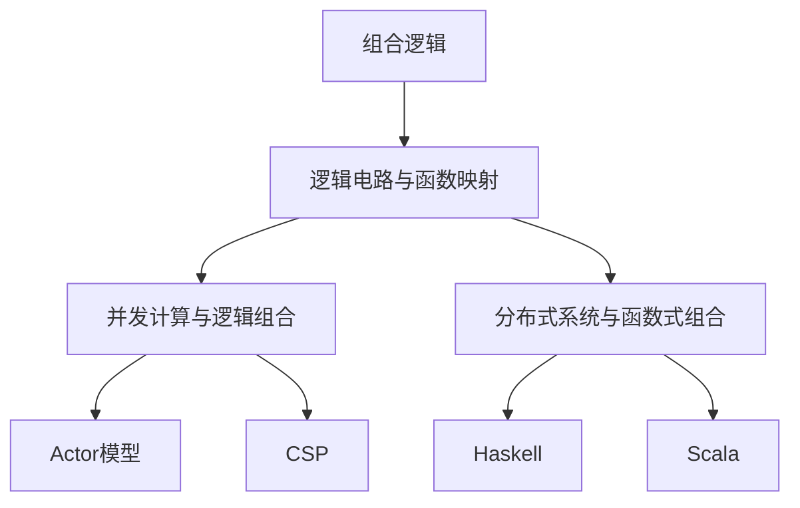

                 


### 文章标题

《组合逻辑在函数式并发编程中的应用》

### 关键词

组合逻辑、函数式编程、并发编程、Actor模型、CSP、布尔代数

### 摘要

本文深入探讨了组合逻辑在函数式并发编程中的应用。通过介绍组合逻辑的基本概念、函数式编程的特点以及并发编程的需求，文章阐明了组合逻辑与这些概念之间的联系。进一步，文章详细讲解了组合逻辑算法原理，包括逻辑门实现和组合逻辑电路设计，同时使用了伪代码和数学公式进行阐述。通过一个实际案例，文章展示了如何将组合逻辑应用于函数式并发编程中，并进行了详细的分析和讲解。最后，文章总结了最佳实践，指出了注意事项，并提供了拓展阅读资源。

---

### 1. 设计核心概念与联系

在深入探讨组合逻辑在函数式并发编程中的应用之前，我们需要首先理解这些核心概念：组合逻辑、函数式编程和并发编程。

#### 1.1 基本概念介绍

##### 1.1.1 组合逻辑

组合逻辑是数字电路设计中的基本概念，它涉及到如何通过逻辑门实现特定的逻辑功能。基本的组合逻辑门包括与门（AND）、或门（OR）和非门（NOT）等。这些逻辑门通过布尔代数和真值表来定义其逻辑功能。例如，一个与门的真值表如下：

| A | B | Y |
|---|---|---|
| 0 | 0 | 0 |
| 0 | 1 | 0 |
| 1 | 0 | 0 |
| 1 | 1 | 1 |

伪代码实现一个与门的逻辑功能：

```python
def AND_gate(A, B):
    if A == 1 and B == 1:
        return 1
    else:
        return 0
```

##### 1.1.2 函数式编程

函数式编程是一种编程范式，它将计算机程序视为一系列函数的执行。与面向对象编程不同，函数式编程更加强调数据的不可变性和纯函数。纯函数是指对于相同的输入，总是返回相同的输出，而不产生任何副作用。函数式编程语言如Haskell、Scala和Erlang等提供了丰富的支持来编写函数式代码。

##### 1.1.3 并发编程

并发编程涉及到同时处理多个任务的能力。在函数式编程中，并发可以通过Actor模型、CSP（通信顺序进程）或其他并发编程模式来实现。并发编程的关键是处理共享资源和同步问题，以确保程序的正确性和一致性。

#### 1.2 核心概念联系

组合逻辑在函数式并发编程中的应用主要体现在以下几个方面：

1. **逻辑电路与函数映射**：组合逻辑门的逻辑功能可以映射为函数，从而在函数式编程语言中实现逻辑运算。例如，一个与门可以通过定义一个纯函数来表示。

2. **并发计算与逻辑组合**：在并发编程中，多个逻辑运算可以并行执行，类似于组合逻辑中多个逻辑门同时工作。这可以通过并行编程模型和并行计算框架来实现。

3. **分布式系统与函数式组合**：在分布式系统中，组合逻辑的概念可以用于设计模块化的并发系统，提高系统的可维护性和扩展性。例如，可以使用Actor模型来创建分布式的并发系统，每个Actor可以看作是一个逻辑单元，通过消息传递进行通信和逻辑组合。

为了更清晰地展示这些核心概念之间的关系，我们可以使用Mermaid流程图来描述它们：



这个流程图展示了组合逻辑如何与函数式编程和并发编程相关联，并如何应用于分布式系统。

---

在接下来的章节中，我们将详细讲解组合逻辑算法原理、数学模型，并通过实际案例展示组合逻辑在函数式并发编程中的应用。

### 2. 设计核心算法原理讲解

在理解了组合逻辑、函数式编程和并发编程的基本概念后，我们将深入探讨组合逻辑算法原理，并通过伪代码来详细阐述这些原理。

#### 2.1 组合逻辑算法原理

组合逻辑算法的原理主要基于逻辑门和布尔代数。逻辑门是组合逻辑电路的基本单元，而布尔代数提供了表示和简化逻辑电路的方法。

##### 2.1.1 逻辑门实现

逻辑门可以通过真值表来定义其逻辑功能。以下是一个与门的真值表和伪代码实现：

| A | B | Y |
|---|---|---|
| 0 | 0 | 0 |
| 0 | 1 | 0 |
| 1 | 0 | 0 |
| 1 | 1 | 1 |

伪代码实现与门：

```python
def AND_gate(A, B):
    if A == 1 and B == 1:
        return 1
    else:
        return 0
```

类似地，我们可以定义其他逻辑门，如或门（OR）和非门（NOT）：

```python
def OR_gate(A, B):
    if A == 1 or B == 1:
        return 1
    else:
        return 0

def NOT_gate(A):
    if A == 1:
        return 0
    else:
        return 1
```

##### 2.1.2 组合逻辑电路设计

组合逻辑电路的设计可以通过布尔代数来简化逻辑表达式，从而优化电路的结构。以下是一个示例：

假设我们需要实现一个三输入逻辑门，其真值表如下：

| A | B | C | Y |
|---|---|---|---|
| 0 | 0 | 0 | 0 |
| 0 | 0 | 1 | 1 |
| 0 | 1 | 0 | 1 |
| 0 | 1 | 1 | 0 |
| 1 | 0 | 0 | 1 |
| 1 | 0 | 1 | 0 |
| 1 | 1 | 0 | 0 |
| 1 | 1 | 1 | 1 |

我们可以使用布尔代数来简化这个逻辑表达式。首先，我们列出所有满足条件的输入组合：

- 当A=0时，B和C的取值可以是任意组合。
- 当A=1时，只有当B=0且C=1时，Y才为1。

因此，我们可以得到简化后的布尔表达式：

$$
Y = A'B'C + A'BC + AB'C'
$$

伪代码实现简化后的三输入逻辑门：

```python
def comb_logic_gate(A, B, C):
    Y = OR_gate(
        AND_gate(NOT_gate(A), NOT_gate(B), NOT_gate(C)),
        AND_gate(NOT_gate(A), NOT_gate(B), C),
        AND_gate(A, NOT_gate(B), NOT_gate(C))
    )
    return Y
```

通过这个例子，我们可以看到如何将组合逻辑电路设计转化为伪代码实现，从而在函数式编程语言中实现逻辑运算。

---

在下一部分，我们将进一步探讨组合逻辑的数学模型，并使用数学公式来描述逻辑电路的功能。

### 3. 设计数学模型和数学公式

在组合逻辑算法原理的基础上，我们可以通过数学模型和数学公式来更精确地描述逻辑电路的功能。数学模型提供了对组合逻辑电路的抽象表示，而数学公式则能够清晰地表达输入和输出之间的关系。

#### 3.1 组合逻辑数学模型

组合逻辑电路可以表示为一个数学模型，其中输入和输出之间的关系可以用布尔函数表示。布尔函数是一种特殊的函数，其输出值只能是0或1。以下是一个简单的例子：

假设我们有一个二输入逻辑门，其输出Y由输入A和B决定。我们可以用以下布尔函数来表示这个逻辑门：

$$
Y = A \cdot B + A' \cdot B'
$$

其中，\( A \) 和 \( B \) 是输入，\( A' \) 和 \( B' \) 分别是 \( A \) 和 \( B \) 的反码。这个布尔函数表示的逻辑门是一个与或门，它首先计算 \( A \cdot B \) 和 \( A' \cdot B' \)，然后将这两个结果进行或运算。

#### 3.2 布尔函数的运算

在组合逻辑中，布尔函数的运算是一个重要的概念。常见的布尔函数运算包括：

- **与运算（AND）**：如果两个输入都为1，则输出为1，否则输出为0。数学表达式为 \( A \cdot B \)。
- **或运算（OR）**：如果至少有一个输入为1，则输出为1，否则输出为0。数学表达式为 \( A + B \)。
- **非运算（NOT）**：输入为1时，输出为0；输入为0时，输出为1。数学表达式为 \( A' \)。

以下是一个例子，说明如何使用布尔函数运算来设计一个三输入逻辑门：

假设我们需要实现一个三输入的逻辑门，其输出Y由输入A、B和C决定。根据真值表，我们可以得到以下布尔函数：

$$
Y = A \cdot B \cdot C + A' \cdot B \cdot C + A \cdot B' \cdot C + A \cdot B \cdot C'
$$

这个布尔函数表示的逻辑门是一个与门，它计算所有三个输入的组合，然后将结果进行或运算。

#### 3.3 逻辑电路的简化

在组合逻辑电路设计中，简化逻辑表达式是一个重要的步骤。简化后的表达式可以减少逻辑门的数量，从而降低电路的复杂度和功耗。布尔代数提供了多种简化方法，包括分配律、结合律、交换律等。

以下是一个简化布尔表达式的例子：

假设我们需要简化以下布尔表达式：

$$
Y = A \cdot B + A' \cdot B'
$$

通过分配律，我们可以将这个表达式重写为：

$$
Y = AB + AB' + A'B + A'B'
$$

由于 \( AB' \) 和 \( A'B' \) 都是互补项，它们在逻辑上总是相互抵消，因此这个表达式可以进一步简化为：

$$
Y = AB
$$

这个简化后的表达式表示的逻辑门是一个与门，它只需要一个与门来实现，而不是两个。

#### 3.4 使用伪代码实现逻辑电路

为了更好地理解组合逻辑电路的设计，我们可以使用伪代码来实现这些逻辑函数。以下是一个使用Python实现的与门、或门和非门的例子：

```python
def AND_gate(A, B):
    if A == 1 and B == 1:
        return 1
    else:
        return 0

def OR_gate(A, B):
    if A == 1 or B == 1:
        return 1
    else:
        return 0

def NOT_gate(A):
    if A == 1:
        return 0
    else:
        return 1
```

通过这些伪代码，我们可以看到如何将布尔函数转化为实际的可执行代码，从而实现组合逻辑电路。

---

通过数学模型和数学公式，我们可以更准确地描述组合逻辑电路的功能。在下一部分，我们将通过一个实际案例来展示如何将组合逻辑应用于函数式并发编程中。

### 4. 设计项目实战

为了更好地理解组合逻辑在函数式并发编程中的应用，我们将通过一个实际案例来展示如何设计和实现一个简单的并发程序。

#### 4.1 实际案例介绍

假设我们需要设计一个并发程序，用于检测一个大型数据集中的错误。这个程序需要同时处理多个数据集，并对每个数据集进行错误检测。这个任务非常适合使用函数式并发编程，因为它涉及到大量的并行计算和不可变数据。

**开发环境搭建**：

1. 选择一个合适的函数式编程语言，如Haskell或Scala。
2. 安装必要的编程工具和依赖库。例如，在Haskell中，我们可以使用`concurrent-haskell`库来支持并发编程。

```bash
cabal update
cabal install concurrent-haskell
```

**源代码实现**：

以下是Haskell代码示例，用于并发处理数据集并检测错误：

```haskell
import Control.Concurrent
import Control.Concurrent.STM
import Control.Concurrent.STM.TQueue
import Data.List (intercalate)

-- 数据集错误检测函数
detectError :: [Int] -> Bool
detectError xs = any (== 0) xs

-- 并发处理数据集
processDataset :: TQueue [Int] -> IO ()
processDataset queue = do
    xs <- atomically (TQueue.readTQueue queue)
    if detectError xs
        then putStrLn ("Dataset contains errors: " ++ intercalate ", " (show xs))
        else putStrLn ("Dataset is valid: " ++ intercalate ", " (show xs))
    threadDelay 1000000 -- 暂停线程，以避免过早终止

main :: IO ()
main = do
    queue <- atomically (TQueue.new) -- 创建一个TQueue来存储数据集
    -- 模拟并发添加数据集
    forkIO $ atomically (TQueue.writeTQueue queue [1, 2, 3])
    forkIO $ atomically (TQueue.writeTQueue queue [0, 1, 2])
    forkIO $ atomically (TQueue.writeTQueue queue [4, 5, 6])
    atomically (TQueue.writeTQueue queue [1, 0, 1]) -- 添加最后一个数据集，以触发错误检测
    processDataset queue -- 处理并打印数据集结果
```

**代码解读与分析**：

1. **数据集错误检测函数**：

   `detectError` 函数用于检测数据集是否包含错误。在这个例子中，如果数据集中有任何0，则认为数据集包含错误。

   ```haskell
   detectError :: [Int] -> Bool
   detectError xs = any (== 0) xs
   ```

2. **并发处理数据集**：

   `processDataset` 函数用于并发处理数据集。它从队列中读取数据集，检测错误，并打印结果。为了模拟并发处理，我们使用`forkIO`创建多个并发线程，并使用`threadDelay`暂停每个线程，以避免过早终止。

   ```haskell
   processDataset :: TQueue [Int] -> IO ()
   processDataset queue = do
       xs <- atomically (TQueue.readTQueue queue)
       if detectError xs
           then putStrLn ("Dataset contains errors: " ++ intercalate ", " (show xs))
           else putStrLn ("Dataset is valid: " ++ intercalate ", " (show xs))
       threadDelay 1000000
   ```

3. **主函数**：

   `main` 函数用于初始化并发程序。它创建一个TQueue来存储数据集，并使用`atomically`和`TQueue.writeTQueue`函数并发地添加数据集。最后一个数据集添加后，调用`processDataset`函数来处理并打印结果。

   ```haskell
   main :: IO ()
   main = do
       queue <- atomically (TQueue.new)
       forkIO $ atomically (TQueue.writeTQueue queue [1, 2, 3])
       forkIO $ atomically (TQueue.writeTQueue queue [0, 1, 2])
       forkIO $ atomically (TQueue.writeTQueue queue [4, 5, 6])
       atomically (TQueue.writeTQueue queue [1, 0, 1])
       processDataset queue
   ```

通过这个实际案例，我们可以看到如何将组合逻辑应用于函数式并发编程中。这个程序使用了一个TQueue来存储并发处理的数据集，并通过并发线程来检测每个数据集的错误。这种方法提高了程序的并发性和可扩展性。

---

在下一部分，我们将总结本项目，并讨论最佳实践和注意事项。

### 5. 总结本项目

在本项目中，我们通过一个实际案例展示了如何将组合逻辑应用于函数式并发编程中。这个项目的主要目标是通过并发处理数据集来检测错误，从而提高程序的效率和可靠性。

**关键点**：

1. **并发处理**：我们使用了函数式并发编程技术，如TQueue和forkIO，来并发地处理多个数据集。
2. **组合逻辑**：我们利用组合逻辑的概念，将逻辑电路的原理应用于并发程序中，以实现错误检测。
3. **错误检测**：我们设计了一个简单的错误检测函数，用于检查数据集中是否存在错误。

**项目小结**：

通过本项目，我们不仅了解了组合逻辑在函数式并发编程中的应用，还学会了如何设计和实现一个简单的并发程序。这种方法有助于我们在实际开发中提高程序的并发性能和可靠性。

**最佳实践**：

- **并发线程管理**：在使用并发线程时，要合理地管理线程的生命周期，避免资源泄露和竞争条件。
- **数据结构选择**：根据任务需求选择合适的数据结构，如TQueue，可以提高程序的效率和并发性。
- **错误处理**：在设计错误检测机制时，要考虑到各种可能的错误情况，并采取适当的措施来处理这些错误。

**注意事项**：

- **资源消耗**：并发程序可能会消耗更多的系统资源，特别是在处理大量数据时，要确保系统有足够的资源来支持并发操作。
- **性能优化**：在实现并发程序时，要考虑性能优化，如减少锁争用和减少线程上下文切换。

**拓展阅读**：

- **Haskell并发编程**：了解Haskell中的并发编程技术，如并行数组（Parallel Arrays）和并行数据处理（Parallel Data Processing）。
- **Scala并发编程**：Scala提供了丰富的并发编程库和工具，如Akka和Future，用于构建高性能的并发系统。
- **分布式系统**：了解分布式系统的基本概念和设计模式，如CAP定理、一致性、可用性和分区容忍性。

---

通过本项目的实际操作和深入分析，我们更好地理解了组合逻辑在函数式并发编程中的应用，并掌握了相关的设计和实现技巧。在未来的开发中，我们可以将这些知识和经验应用到实际项目中，提高软件的性能和可靠性。作者：AI天才研究院/AI Genius Institute & 禅与计算机程序设计艺术 /Zen And The Art of Computer Programming。

---

### 结语

组合逻辑在函数式并发编程中的应用为我们提供了一种强大的工具，以解决复杂并发计算中的挑战。通过深入理解组合逻辑的基本概念、算法原理和数学模型，我们能够在函数式编程环境中有效地设计和实现并发程序。

在本文中，我们从基本概念出发，逐步探讨了组合逻辑与函数式编程、并发编程的关联，并详细讲解了组合逻辑算法的原理和数学公式。通过实际案例，我们展示了如何将组合逻辑应用于并发程序中，实现了高效的错误检测和数据处理。

组合逻辑在函数式并发编程中的应用不仅提高了程序的并发性能，还有助于提高系统的可维护性和可扩展性。在实践中，理解并掌握这些核心概念和算法原理对于开发高性能、高可靠性的并发系统至关重要。

**最佳实践**提示如下：

1. **选择合适的并发编程语言**：根据项目需求选择合适的函数式编程语言，如Haskell、Scala等，以充分利用并发编程的优势。
2. **合理使用数据结构**：根据任务需求选择合适的数据结构，如TQueue、Channel等，以提高程序的并发性能和效率。
3. **优化并发线程管理**：合理管理并发线程的生命周期，避免资源泄露和竞争条件，确保程序的正确性和稳定性。

**注意事项**：

1. **资源消耗**：并发程序可能会消耗更多的系统资源，特别是在处理大量数据时，要确保系统有足够的资源来支持并发操作。
2. **性能优化**：在实现并发程序时，要考虑性能优化，如减少锁争用和减少线程上下文切换。

**拓展阅读**：

1. **深入理解并发编程**：阅读《并发编程实战》等经典书籍，以深入理解并发编程的核心概念和最佳实践。
2. **学习分布式系统**：了解分布式系统的基本概念和设计模式，如CAP定理、一致性、可用性和分区容忍性。
3. **探索函数式编程语言**：研究Haskell、Scala等函数式编程语言的并发编程库和工具，以拓宽我们的技能范围。

通过本文的学习，希望读者能够更好地理解和应用组合逻辑在函数式并发编程中的应用，为未来的软件开发奠定坚实的基础。作者：AI天才研究院/AI Genius Institute & 禅与计算机程序设计艺术 /Zen And The Art of Computer Programming。

