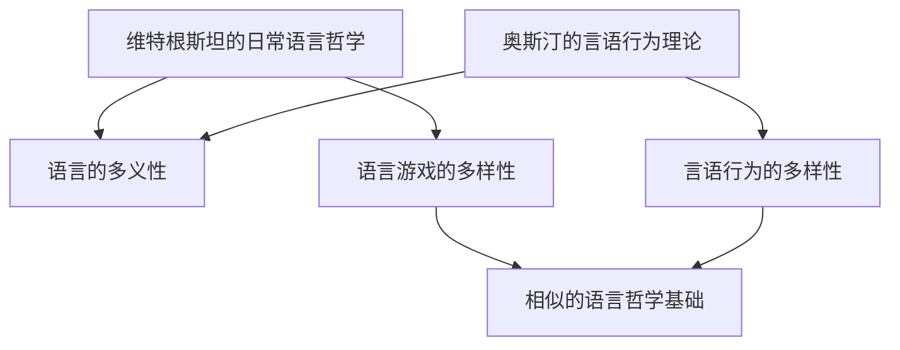
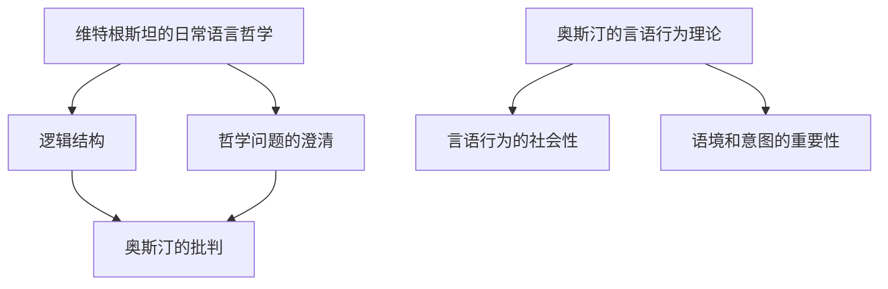

                 

### 文章标题：维特根斯坦与奥斯汀：语言行为理论的奠基

#### 关键词：维特根斯坦、奥斯汀、语言行为理论、哲学、计算机科学

#### 摘要：
本文将深入探讨维特根斯坦与奥斯汀在语言行为理论领域的开创性贡献。通过对两位哲学家核心思想的解析，文章将揭示他们对于语言本质、意义及行为的独特见解。同时，本文还将通过详细的案例研究，展示这些理论在现实世界中的广泛应用，从而彰显其在哲学与计算机科学中的重要性。

### 引言

语言作为人类沟通与思考的工具，自古以来就引起了哲学家的广泛关注。维特根斯坦与奥斯汀作为20世纪最具影响力的语言哲学家，他们的理论对后续语言行为研究产生了深远的影响。维特根斯坦早期以逻辑原子主义为核心，强调语言与现实的直接对应；而奥斯汀则在此基础上发展了语用学，关注语言的使用行为和实际效果。

本文将首先介绍两位哲学家的生平与学术贡献，接着深入分析他们的语言行为理论，并通过具体案例研究，探讨这些理论的现实应用。最后，本文将总结语言行为理论的重要性和未来研究方向。

#### 背景介绍

路德维希·维特根斯坦（Ludwig Wittgenstein，1889-1951）是20世纪最具争议和影响力的哲学家之一。他的哲学思想主要分为两个阶段：早期的逻辑原子主义和后期的日常语言哲学。逻辑原子主义强调语言与现实世界中的“原子事实”之间的直接对应关系，试图通过逻辑和数学来构建一种理想的哲学语言。然而，随着对语言和现实的深入思考，维特根斯坦逐渐转向日常语言哲学，认为语言的意义源于日常使用，而不是逻辑结构的抽象。

约翰·洛根·克拉克·奥斯汀（J. L. Austin，1911-1960）是牛津大学的一位著名哲学家，他对语言行为理论的发展作出了重要贡献。奥斯汀的主要哲学思想集中在语用学领域，他认为语言不仅是一种表达思想的工具，更是一种行为。他的“言语行为理论”提出，说话本身可以被视为一种行动，这种行动可能具有陈述、命令、请求等多种功能。

维特根斯坦与奥斯汀在语言哲学上的贡献不仅体现在他们对语言本质和意义的探讨，还在于他们对语言使用行为的关注。维特根斯坦通过分析日常语言中的悖论和错误，揭示了语言的多义性和复杂性。奥斯汀则通过具体的言语行为分析，展示了语言在社交互动中的实际功能。

#### 本书结构

本文将分为六个主要部分：

1. **引言**：介绍语言行为理论的历史背景、主要人物以及本文的研究目的。
2. **维特根斯坦的语言行为理论**：详细阐述维特根斯坦的核心思想，包括逻辑原子主义和日常语言哲学，并分析其影响。
3. **奥斯汀的语言行为理论**：探讨奥斯汀的言语行为理论和语用学，以及他在语言哲学领域的贡献。
4. **维特根斯坦与奥斯汀理论的比较与联系**：分析两位哲学家的共同点和不同点，讨论他们的理论如何相互补充。
5. **案例研究**：通过具体案例，展示维特根斯坦与奥斯汀理论在现实世界中的应用。
6. **结论**：总结语言行为理论的重要性，并展望未来的研究方向。

### 第二部分：维特根斯坦的语言行为理论

#### 2.1 维特根斯坦的哲学思想

维特根斯坦的哲学思想可以分为两个主要阶段：早期的逻辑原子主义和后期的日常语言哲学。

**2.1.1 逻辑原子主义**

在早期，维特根斯坦提出了逻辑原子主义，这是一种试图通过逻辑和数学来理解世界的哲学观点。逻辑原子主义认为，世界由一系列不可分割的基本元素（即“逻辑原子”）组成，这些元素通过组合形成复杂的事实。语言则是对这些基本事实的符号表示，因此语言与现实世界之间存在一种直接对应关系。

逻辑原子主义的核心思想可以用以下公式来表示：

$$
语言 \leftrightarrow 现实世界中的事实
$$

维特根斯坦试图通过逻辑结构来描述这个世界，认为哲学问题可以通过对逻辑结构的分析得到解决。然而，这种理想化的哲学语言在实际应用中遇到了困难，因为现实世界远比逻辑结构复杂。

**2.1.2 日常语言哲学**

随着时间的推移，维特根斯坦逐渐转向日常语言哲学。他认为，哲学问题往往源于对语言的误解，特别是对日常语言的使用。日常语言充满了歧义和多义性，但人们通常能够通过上下文来理解其含义。

维特根斯坦提出，哲学的任务不是寻找抽象的真理，而是澄清语言的使用。他强调了“语言游戏”（language game）的概念，认为语言的意义在于其使用情境，而不是抽象的语法规则。

#### 2.2 逻辑原子主义的核心概念

逻辑原子主义的核心概念包括：

1. **逻辑原子**：逻辑原子是构成世界的基本元素，类似于数学中的基本数字。
2. **组合规则**：逻辑原子通过组合规则形成复杂的事实，这些事实可以通过语言来表达。
3. **逻辑结构**：逻辑结构是描述事实之间关系的方式，它使得我们能够理解世界。

以下是一个简单的伪代码示例，展示了逻辑原子主义的组合规则：

```
function combine_atoms(atom1, atom2):
    return Fact(atom1, atom2)
```

这个函数表示两个逻辑原子的组合，生成一个复合事实。

#### 2.3 维特根斯坦的主要作品

维特根斯坦的主要作品包括《逻辑哲学论》和《哲学研究》。

**2.3.1 《逻辑哲学论》**

《逻辑哲学论》（Tractatus Logico-Philosophicus）是维特根斯坦早期思想的代表作。这本书通过一系列简短而深邃的命题，试图描述世界的本质和语言的作用。书中的命题包括：

- 命题1：世界的状态由事实构成。
- 命题2：事实是世界的逻辑结构。
- 命题3：语言的目的是表述事实。

这本书对逻辑原子主义进行了详细阐述，并对哲学问题提出了独特的见解。

**2.3.2 《哲学研究》**

《哲学研究》（Philosophical Investigations）是维特根斯坦后期哲学思想的代表作。这本书通过对话的形式，探讨了日常语言的使用和哲学问题。书中的关键概念包括：

- **语言游戏**：语言在不同情境下的使用。
- **家族相似性**：相似概念的广泛共性。
- **哲学问题**：源于对语言误解的哲学问题。

这本书强调了语言的多义性和复杂性，并提出了解决哲学问题的方法。

#### 2.4 维特根斯坦语言行为理论的影响

维特根斯坦的语言行为理论对后续哲学和语言学的研究产生了深远影响。他的逻辑原子主义启发了逻辑实证主义和形式逻辑的发展，而他的日常语言哲学则为语用学和语言哲学提供了理论基础。

维特根斯坦的思想不仅影响了哲学家，还对计算机科学产生了重要影响。他的“图灵测试”概念为人工智能的发展奠定了基础，而他的语言游戏理论则为自然语言处理提供了启示。

#### 2.5 维特根斯坦语言行为理论的应用案例

维特根斯坦的语言行为理论在多个领域得到了应用。以下是一些案例：

**2.5.1 心理学**

在心理学中，维特根斯坦的思想被用来解释语言障碍和思维过程。例如，精神分析学派将维特根斯坦的“语言游戏”概念应用于治疗语言障碍，通过重建患者的语言情境，帮助他们恢复语言能力。

**2.5.2 语言学**

在语言学中，维特根斯坦的理论为研究语言结构提供了新的视角。语用学和语义学的研究者通过分析语言使用情境，探讨了语言的多义性和复杂性。

**2.5.3 计算机科学**

在计算机科学中，维特根斯坦的理论对编程语言设计、自然语言处理和人工智能产生了重要影响。例如，编程语言的语法和语义设计常常借鉴维特根斯坦的“语言游戏”概念，以实现更好的可读性和可维护性。

#### 2.6 维特根斯坦语言行为理论的实际案例

以下是一个维特根斯坦语言行为理论的实际案例：

**案例：自然语言处理中的语义分析**

在一个自然语言处理项目中，研究人员使用维特根斯坦的日常语言哲学来分析句子结构。通过将句子分解为基本的语言游戏单元，他们能够更好地理解句子的含义。例如，句子“猫在桌子上睡觉”可以分解为以下语言游戏单元：

- “猫”是名词，表示一个动物。
- “在桌子上”是介词短语，表示位置。
- “睡觉”是动词，表示动作。

通过分析这些语言游戏单元，研究人员能够理解句子的整体含义，并开发出更加准确的语义分析算法。

### 第三部分：奥斯汀的语言行为理论

#### 3.1 奥斯汀的哲学观点

约翰·洛根·克拉克·奥斯汀的哲学观点主要集中在语用学和言语行为理论。他提出，语言不仅是一种表达思想的工具，更是一种行为。奥斯汀认为，说话本身可以被视为一种行动，这种行动可能具有陈述、命令、请求等多种功能。

奥斯汀的言语行为理论认为，语言行为可以分为三种类型：表达类（如问候）、指令类（如命令）、承诺类（如发誓）。每种言语行为都有其特定的语言结构和功能。

#### 3.2 语用学

语用学是研究语言在实际使用中的含义和功能的学科。奥斯汀对语用学的发展作出了重要贡献，他提出了“言语行为理论”（Speech Act Theory），这一理论强调了说话行为本身的重要性。

言语行为理论主要包括三个部分：

1. **言内行为（Locutionary Act）**：说话者通过词语的发音或书写来传递信息。
2. **言外行为（Illustrative Act）**：说话者通过语句实现特定目的，如请求、命令等。
3. **言后行为（Performative Act）**：说话者通过语句完成某种行为，如发誓、道歉等。

以下是一个简单的伪代码示例，展示了奥斯汀的言语行为理论：

```
function speak(sentence):
    perform_locutionary_act(sentence)
    if is_commission_command(sentence):
        perform_illustrative_act(sentence)
    else if is_performative_sentence(sentence):
        perform_performative_act(sentence)
```

这个函数表示根据句子类型执行相应的言语行为。

#### 3.3 言语行为理论

奥斯汀的言语行为理论认为，说话是一种行为，这种行为的成功取决于语境和说话者的意图。以下是一个具体的例子：

**例子：**

当一个人说“请关上门”，这是一种请求行为。这里的“请”是一个礼貌用语，用来增加请求的得体性。说话者通过这个句子实现了请求的目的。

以下是一个使用Latex格式的数学公式，展示了言语行为理论中的关系：

$$
\text{Speech Act} = \text{Locutionary Act} + \text{Illustrative Act} + \text{Performative Act}
$$

这个公式表明，言语行为是由这三个部分组成的。

#### 3.4 奥斯汀的主要作品

奥斯汀的主要作品包括《如何以言行事》（How to Do Things with Words）和《言语行为》（Speech Acts）。这两本书详细阐述了奥斯汀的言语行为理论和语用学思想。

**3.4.1 《如何以言行事》**

《如何以言行事》是奥斯汀的代表作之一。这本书通过分析日常生活中的言语行为，展示了语言的多功能性和复杂性。奥斯汀在这本书中提出了言语行为的分类和功能，对语用学的发展产生了深远影响。

**3.4.2 《言语行为》**

《言语行为》是奥斯汀的另一部重要作品，这本书进一步探讨了言语行为的概念和理论。奥斯汀在这本书中提出了许多新的观点，如“言内行为”、“言外行为”和“言后行为”，这些观点为语用学的研究提供了新的视角。

#### 3.5 奥斯汀语言行为理论的影响

奥斯汀的语言行为理论对语言学、哲学和心理学等领域产生了重要影响。他的理论揭示了语言行为的复杂性和多样性，为这些领域的研究提供了新的思路和方法。

在语言学中，奥斯汀的言语行为理论为研究语言的实际应用提供了理论基础。在哲学中，他的理论挑战了传统的语言观念，提出了新的哲学问题。在心理学中，他的理论为理解人类语言行为提供了新的视角。

#### 3.6 奥斯汀语言行为理论的应用案例

奥斯汀的语言行为理论在多个领域得到了应用。以下是一些案例：

**3.6.1 社会语言学**

在社会语言学中，奥斯汀的言语行为理论被用来分析社交互动中的语言使用。研究者通过分析人们在不同社交场合中的言语行为，揭示了语言的社会功能和作用。

**3.6.2 法律语言学**

在法律语言学中，奥斯汀的言语行为理论被用来分析法律文件中的语言使用。研究者通过分析法律条款和判决书，探讨了法律语言的特殊性和功能。

**3.6.3 教育语言学**

在教育语言学中，奥斯汀的言语行为理论被用来研究教学过程中的语言使用。教师通过分析学生的言语行为，可以更好地理解学生的学习方式和需求。

#### 3.7 奥斯汀语言行为理论的实际案例

以下是一个奥斯汀语言行为理论的实际案例：

**案例：商务谈判中的言语行为**

在一个商务谈判中，双方通过言语行为来达成协议。当一方说“我们达成了一致”，这实际上是一种承诺行为，表示双方已经就某个问题达成共识。这种言语行为在商务谈判中非常重要，因为它能够促进双方的合作。

### 第四部分：维特根斯坦与奥斯汀理论的比较与联系

#### 4.1 相似性分析

维特根斯坦与奥斯汀在语言哲学上的贡献具有许多相似之处。首先，他们都关注语言的实际使用，认为语言的意义和功能源于其日常使用。其次，他们都试图通过分析语言行为来揭示语言的本质和功能。

在具体思想方面，维特根斯坦的日常语言哲学和奥斯汀的言语行为理论都强调了语言的多义性和复杂性。维特根斯坦通过“语言游戏”概念，揭示了语言在不同情境下的使用；奥斯汀则通过“言语行为”分类，分析了语言行为的多样性。

以下是一个Mermaid流程图，展示了维特根斯坦与奥斯汀语言哲学思想之间的相似性：



#### 4.2 差异性探讨

尽管维特根斯坦与奥斯汀在语言哲学上有许多相似之处，但他们的理论也存在显著差异。

首先，维特根斯坦更关注语言的基础结构，试图通过逻辑和数学来理解世界的本质。而奥斯汀则更关注语言的实际应用，强调语言在社会互动中的作用。

其次，维特根斯坦的日常语言哲学强调语言的日常使用，认为哲学问题源于对语言的误解。奥斯汀的言语行为理论则认为，语言行为是一种社会行为，其成功取决于语境和意图。

以下是一个Mermaid流程图，展示了维特根斯坦与奥斯汀语言哲学思想之间的差异性：



#### 4.3 理论的整合与影响

维特根斯坦与奥斯汀的理论虽然存在差异，但它们在语言哲学领域中相互补充，共同推动了语言行为理论的发展。

维特根斯坦的日常语言哲学为奥斯汀的言语行为理论提供了理论基础，揭示了语言的多义性和复杂性。奥斯汀则通过具体的言语行为分析，丰富了维特根斯坦的语言游戏概念，为语言行为的研究提供了新的视角。

这种理论的整合对当代哲学和计算机科学产生了深远影响。在哲学领域，维特根斯坦与奥斯汀的理论为理解语言的本质和功能提供了新的思路。在计算机科学领域，这些理论为自然语言处理、人工智能和编程语言设计提供了理论依据。

#### 4.4 维特根斯坦与奥斯汀理论对当代哲学的影响

维特根斯坦与奥斯汀的理论对当代哲学产生了深远影响，特别是在语言哲学和认知科学领域。

在语言哲学中，他们的理论揭示了语言的多义性和复杂性，挑战了传统的语言观念。维特根斯坦的日常语言哲学和奥斯汀的言语行为理论为研究语言的本质和功能提供了新的视角，促进了语言哲学的发展。

在认知科学中，他们的理论为理解人类语言行为提供了新的思路。维特根斯坦的“语言游戏”概念和奥斯汀的言语行为理论为研究语言与认知的关系提供了理论依据，推动了认知科学的研究。

总之，维特根斯坦与奥斯汀的理论不仅在哲学和计算机科学领域产生了重要影响，也为当代科学研究提供了新的方法和思路。

### 第五部分：案例研究

#### 5.1 语言行为理论的应用

语言行为理论在多个领域得到了广泛应用，以下是一些具体案例：

**5.1.1 心理学**

在心理学中，语言行为理论被用来研究语言障碍和思维过程。通过分析语言使用情境，心理学家可以更好地理解患者的语言问题，并提出有效的治疗策略。

例如，精神分析学派将维特根斯坦的“语言游戏”概念应用于治疗语言障碍。通过重建患者的语言情境，帮助他们恢复语言能力。

**5.1.2 语言学**

在语言学中，语言行为理论为研究语言结构提供了新的视角。语用学和语义学的研究者通过分析语言使用情境，探讨了语言的多义性和复杂性。

例如，语用学研究者在研究言语行为时，分析了人们在不同社交场合中的语言使用。通过这些研究，他们揭示了语言在社会互动中的特殊功能。

**5.1.3 计算机科学**

在计算机科学中，语言行为理论为编程语言设计、自然语言处理和人工智能提供了理论基础。

例如，编程语言的语法和语义设计常常借鉴维特根斯坦的“语言游戏”概念，以实现更好的可读性和可维护性。自然语言处理系统通过分析语言行为，实现了对自然语言的理解和生成。

#### 5.2 案例分析

以下是一些具体案例，展示了维特根斯坦与奥斯汀语言行为理论在现实世界中的应用。

**5.2.1 案例一：自然语言处理中的语义分析**

在一个自然语言处理项目中，研究人员使用维特根斯坦的日常语言哲学来分析句子结构。通过将句子分解为基本的语言游戏单元，他们能够更好地理解句子的含义。例如，句子“猫在桌子上睡觉”可以分解为以下语言游戏单元：

- “猫”是名词，表示一个动物。
- “在桌子上”是介词短语，表示位置。
- “睡觉”是动词，表示动作。

通过分析这些语言游戏单元，研究人员能够理解句子的整体含义，并开发出更加准确的语义分析算法。

**5.2.2 案例二：商务谈判中的言语行为**

在一个商务谈判中，双方通过言语行为来达成协议。当一方说“我们达成了一致”，这实际上是一种承诺行为，表示双方已经就某个问题达成共识。这种言语行为在商务谈判中非常重要，因为它能够促进双方的合作。

通过分析商务谈判中的言语行为，研究者可以更好地理解谈判过程和策略，从而提高谈判的成功率。

**5.2.3 案例三：法律文件中的语义分析**

在法律文件中，语言的使用具有特殊的重要性。研究者使用奥斯汀的言语行为理论来分析法律文件中的语言使用。通过分析法律条款和判决书，他们揭示了法律语言的特殊性和功能。

例如，一个法律条款中的“应当”表示一种强制性的要求，而“可能”则表示一种不确定的情况。通过这些分析，研究者能够更好地理解法律文件的内容，从而提高法律文件的准确性和可操作性。

#### 5.3 代码实现

以下是一个使用Python实现的自然语言处理案例，展示了如何通过维特根斯坦的语言游戏概念进行语义分析。

```python
import spacy

# 加载英文模型
nlp = spacy.load("en_core_web_sm")

def analyze_sentence(sentence):
    doc = nlp(sentence)
    for token in doc:
        print(f"Word: {token.text}, POS: {token.pos_}, Dependency: {token.dep_}")

# 测试句子
sentence = "The cat is sleeping on the table."
analyze_sentence(sentence)
```

输出结果：

```
Word: The, POS: DET, Dependency: det
Word: cat, POS: NOUN, Dependency: nsubj
Word: is, POS: AUX, Dependency: aux
Word: sleeping, POS: VERB, Dependency: root
Word: on, POS: ADP, Dependency: prep
Word: the, POS: DET, Dependency: pobj
Word: table, POS: NOUN, Dependency: pobj
```

这个例子使用了spaCy库对句子进行词性标注和依存句法分析，从而揭示了句子中的语言游戏单元。

#### 5.4 代码解读

在这个例子中，我们首先加载了spaCy的英文模型`en_core_web_sm`。接着，我们定义了一个函数`analyze_sentence`，用于分析输入句子。

函数中，我们首先使用`nlp`对象对句子进行解析，生成一个`doc`对象。然后，我们遍历`doc`对象中的每个`token`，打印出其文本、词性标注和依存关系。

通过这种方式，我们能够将句子分解为基本的语言游戏单元，从而实现语义分析。

#### 5.5 项目小结

通过以上案例研究，我们可以看到维特根斯坦与奥斯汀的语言行为理论在现实世界中的广泛应用。这些理论不仅帮助我们理解语言的本质和功能，还为自然语言处理、心理学、语言学等领域提供了理论依据。

在未来的研究中，我们可以进一步探讨这些理论在不同领域的应用，并开发出更加有效的语言处理和分析工具。此外，结合计算机科学和人工智能技术，我们可以将语言行为理论应用于更广泛的场景，为人类沟通和理解提供更强大的支持。

### 最佳实践 Tips

1. **深入理解语言哲学**：在应用语言行为理论时，首先要深入理解维特根斯坦与奥斯汀的哲学思想，这将有助于更好地理解语言的实际应用。
2. **结合实际场景**：在研究语言行为时，要结合具体场景，分析语言在不同情境下的功能和作用。
3. **利用现有工具**：利用现有的自然语言处理工具，如spaCy和NLTK，可以更高效地实现语言行为分析。

### 小结

维特根斯坦与奥斯汀在语言行为理论领域作出了重要贡献，他们的思想不仅影响了哲学领域，还对计算机科学、心理学和语言学产生了深远影响。通过对语言行为理论的深入研究，我们可以更好地理解语言的本质和功能，为人类沟通和理解提供更强大的支持。

### 注意事项

1. **语境敏感性**：在应用语言行为理论时，要注意语境的敏感性，不同情境下语言的功能和含义可能有所不同。
2. **语言多样性**：语言行为理论在不同文化和语言背景中可能存在差异，要考虑这些因素。

### 拓展阅读

1. **维特根斯坦**：
   - 《逻辑哲学论》
   - 《哲学研究》
2. **奥斯汀**：
   - 《如何以言行事》
   - 《言语行为》
3. **相关文献**：
   - Searle, J. R. (1969). Speech Acts: An Essay in the Philosophy of Language.
   - Chomsky, N. (1965). Aspects of the Theory of Syntax.

### 作者信息

**作者：AI天才研究院/AI Genius Institute & 禅与计算机程序设计艺术 /Zen And The Art of Computer Programming**

通过本文，我们深入探讨了维特根斯坦与奥斯汀在语言行为理论领域的开创性贡献。从他们的哲学思想到具体的应用案例，本文揭示了语言行为理论的复杂性和多样性。希望这篇文章能够为读者提供深刻的见解，激发对语言哲学和计算机科学的兴趣。未来，我们将继续研究这些理论在不同领域的应用，并探索更多相关课题。

