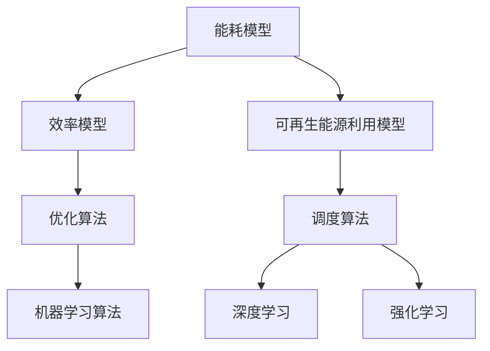

                 

### 文章标题

《绿色AI：可再生能源驱动的环保计算集群》

### 文章关键词

- 绿色AI
- 可再生能源
- 计算集群
- 环保计算
- 能耗管理

### 摘要

随着人工智能技术的快速发展，AI计算集群的需求日益增长，然而这也带来了巨大的能耗问题。本文围绕绿色AI的主题，探讨如何利用可再生能源驱动环保计算集群，以实现可持续发展的目标。文章首先介绍了绿色AI的定义及其重要性，然后详细阐述了可再生能源与环保计算集群的相关技术，包括深度学习与优化算法、可再生能源利用技术以及计算集群能耗管理技术。随后，文章分析了绿色AI的发展趋势和应用场景，并深入探讨了绿色AI的理论基础与架构设计。最后，文章通过实际应用案例展示了绿色AI在数据中心、智能电网、智慧城市和环境监测与保护等领域的应用，并对绿色AI的未来发展趋势进行了展望。通过本文，读者可以全面了解绿色AI的核心理念、技术实现及应用前景，为推动人工智能的绿色可持续发展提供参考。

## 第一部分：绿色AI的概述与背景

### 1.1 绿色AI的定义与意义

绿色AI，是指利用人工智能技术推动能源效率提升，降低计算过程中的碳排放，以实现可持续发展的目标。绿色AI不仅关注计算性能的提升，更注重在计算过程中实现能源的节约和环境的保护。

#### 绿色AI的定义

绿色AI的定义可以从以下几个方面来理解：

1. **环境友好**：绿色AI旨在通过优化算法和系统架构，减少计算过程中的能源消耗和碳排放，降低对环境的影响。
2. **高效能源利用**：绿色AI强调可再生能源的利用，通过智能调度和优化，提高能源利用率，减少对化石燃料的依赖。
3. **可持续性**：绿色AI追求长期的可持续发展，通过技术进步和生态平衡，实现经济、社会和环境的三重效益。

#### 绿色AI的重要性

绿色AI的重要性体现在以下几个方面：

1. **环保需求**：随着全球气候变化和环境污染问题的加剧，绿色AI有助于降低计算过程中的碳排放，减少对环境的影响，符合全球环保的趋势。
2. **经济价值**：绿色AI通过优化能源利用，降低计算成本，提高企业竞争力，对经济具有积极的推动作用。
3. **技术创新**：绿色AI推动了人工智能与能源技术的深度融合，促进了相关领域的技术创新和发展。

#### 绿色AI的发展历程

绿色AI的发展历程可以追溯到20世纪末，随着人工智能技术的兴起，人们开始关注计算过程中的能耗问题。以下是一些重要的里程碑：

1. **早期探索**（20世纪90年代）：这一时期，研究人员开始探讨如何通过优化算法和硬件设计来降低计算能耗。
2. **绿色数据中心**（21世纪初）：随着数据中心的规模扩大，能耗问题愈发突出，绿色数据中心的概念应运而生。
3. **可再生能源利用**（2010年至今）：随着可再生能源技术的发展，绿色AI开始将可再生能源作为计算集群的主要能源来源。

### 1.2 可再生能源与环保计算集群

#### 可再生能源的基本概念

可再生能源是指那些可以在人类时间尺度内不断再生、循环使用的能源，如太阳能、风能、水能、地热能等。这些能源具有清洁、可再生、低碳排放的特点，是未来能源发展的主要方向。

#### 环保计算集群的技术特点

环保计算集群是指采用可再生能源驱动，通过优化算法和系统架构实现高效能耗管理的计算集群。其技术特点包括：

1. **高效能源利用**：通过智能调度和优化，提高可再生能源的利用率，减少浪费。
2. **节能设计**：采用节能硬件和优化软件，降低计算过程中的能源消耗。
3. **环境监测**：实时监测计算集群的环境参数，如温度、湿度、能耗等，以实现智能调控。

#### 可再生能源在计算集群中的应用

1. **分布式电源**：在计算集群中部署分布式电源，如太阳能电池板、风力涡轮机等，以提供清洁能源。
2. **能源存储系统**：采用电池、飞轮等储能设备，平衡可再生能源的供应和需求，确保计算集群的稳定运行。
3. **智能调度**：通过智能调度系统，根据可再生能源的供应情况和计算任务的需求，动态调整计算资源的配置，实现最优能源利用。

### 1.3 绿色AI的核心技术

绿色AI的核心技术主要包括深度学习与优化算法、可再生能源利用技术以及计算集群能耗管理技术。

#### 深度学习与优化算法

1. **优化算法**：通过优化算法，如遗传算法、粒子群优化算法等，实现计算任务的调度和资源分配，降低能耗。
2. **深度学习**：利用深度学习技术，如神经网络、卷积神经网络等，提高计算效率，减少计算量。

#### 可再生能源利用技术

1. **能源转换**：采用高效能源转换技术，如太阳能光伏发电、风力发电等，将可再生能源转换为电能。
2. **能量存储**：采用高效能量存储技术，如电池、飞轮等，平衡能源的供应和需求。
3. **智能调度**：通过智能调度系统，实现可再生能源的高效利用，降低能源浪费。

#### 计算集群能耗管理技术

1. **能耗监测**：实时监测计算集群的能耗情况，为能耗管理提供数据支持。
2. **能耗优化**：通过能耗优化算法，动态调整计算资源的配置，实现能耗的最优化。
3. **节能硬件**：采用节能硬件设计，如低功耗处理器、高效散热系统等，降低计算能耗。

### 1.4 绿色AI的发展趋势与应用场景

#### 绿色AI的未来发展趋势

1. **可再生能源利用技术**：随着可再生能源技术的不断进步，绿色AI将更加依赖可再生能源，实现更高效的能源利用。
2. **能耗管理技术**：绿色AI将不断优化能耗管理技术，实现更精细的能耗控制和调度。
3. **人工智能技术**：随着人工智能技术的不断发展，绿色AI将实现更智能的优化和调度，提高计算效率和能源利用率。

#### 绿色AI的应用场景

1. **数据中心**：绿色AI在数据中心的应用，可以显著降低能耗，提高数据中心的运行效率。
2. **智能电网**：绿色AI在智能电网的应用，可以实现能源的高效调度和管理，提高电网的稳定性。
3. **智慧城市**：绿色AI在智慧城市的应用，可以提升城市管理效率，降低城市能耗。
4. **环境监测**：绿色AI在环境监测中的应用，可以实时监测环境数据，提供决策支持，促进环境保护。

### 总结

绿色AI是未来人工智能发展的重要方向，通过利用可再生能源和优化能耗管理，可以实现计算过程中的环保和可持续发展。本文介绍了绿色AI的定义、意义、核心技术以及发展趋势和应用场景，为读者提供了全面的认识。希望读者能够关注绿色AI的发展，共同推动人工智能的绿色可持续发展。接下来，我们将深入探讨绿色AI的理论基础和架构设计，以期为读者提供更深入的了解。

## 第二部分：绿色AI的理论基础与架构设计

### 2.1 绿色AI的数学模型与算法

绿色AI的数学模型与算法是构建绿色计算系统的基础，它们不仅关系到计算效率和能耗优化，还直接影响着AI算法的准确性和稳定性。在这一节中，我们将深入探讨绿色AI中的核心数学模型和常见算法。

#### 绿色AI的数学模型

绿色AI的数学模型主要包括以下几个方面：

1. **能耗模型**：能耗模型用于描述计算过程中的能耗消耗，包括硬件能耗、软件能耗以及数据传输能耗等。常见的能耗模型有线性模型、指数模型和复杂非线性模型等。

   **公式：**
   $$ E = a \cdot T + b \cdot S + c \cdot D $$
   其中，$E$表示总能耗，$T$表示计算时间，$S$表示存储操作，$D$表示数据传输。

2. **效率模型**：效率模型用于评估计算系统的效率，包括计算效率、传输效率和存储效率等。常见的效率模型有加权平均效率模型和加权边际效率模型等。

   **公式：**
   $$ E_{eff} = \frac{W}{E} $$
   其中，$E_{eff}$表示效率，$W$表示计算输出。

3. **可再生能源利用模型**：可再生能源利用模型用于描述计算系统对可再生能源的利用效率，包括太阳能、风能等。常见的利用模型有能量平衡模型和功率平衡模型等。

   **公式：**
   $$ E_{renew} = p \cdot t $$
   其中，$E_{renew}$表示可再生能源利用量，$p$表示可再生能源功率，$t$表示使用时间。

#### 绿色AI的常见算法

绿色AI的常见算法主要包括优化算法、调度算法和机器学习算法等。

1. **优化算法**：
   - **遗传算法**：遗传算法（GA）是一种基于自然选择和遗传机制的优化算法，适用于解决复杂优化问题。
     
     **伪代码：**
     ```
     Initialize population
     Evaluate fitness of each individual
     while not converged do
         Select parents
         crossover parents to produce offspring
         mutate offspring
         Evaluate fitness of offspring
         Select best individuals for the next generation
     end while
     ```

   - **粒子群优化算法**：粒子群优化算法（PSO）是一种基于群体智能的优化算法，通过模拟鸟群觅食过程进行优化。
     
     **伪代码：**
     ```
     Initialize particles
     Evaluate fitness of each particle
     while not converged do
         Update velocities
         Update positions
         Evaluate fitness of new positions
         Update best position and velocity for each particle
     end while
     ```

2. **调度算法**：
   - **能量调度算法**：能量调度算法用于动态调整计算任务和能源的分配，以实现能耗的最优化。
     
     **伪代码：**
     ```
     while there are tasks do
         Evaluate energy consumption of each task
         Select tasks with lowest energy consumption
         Allocate resources to selected tasks
         Execute tasks
         Collect energy consumption data
         Update energy consumption model
     end while
     ```

   - **负载均衡调度算法**：负载均衡调度算法用于平衡计算集群中的负载，避免资源过度使用或闲置。
     
     **伪代码：**
     ```
     while there are tasks do
         Monitor resource utilization
         Identify underutilized or overutilized resources
         Allocate tasks to underutilized resources
         Release resources from overutilized tasks
     end while
     ```

3. **机器学习算法**：
   - **深度学习**：深度学习（DL）是一种基于多层神经网络的学习方法，适用于复杂模式的识别和分类。
     
     **伪代码：**
     ```
     Initialize neural network
     for each epoch do
         for each training example do
             Pass example through network
             Compute loss
             Backpropagate error
             Update network weights
         end for
     end for
     ```

   - **强化学习**：强化学习（RL）是一种通过与环境交互来学习最优策略的方法，适用于动态优化问题。
     
     **伪代码：**
     ```
     Initialize agent
     while not done do
         Take action based on current state
         Observe reward and next state
         Update policy based on reward
         Update state
     end while
     ```

#### 数学模型与算法的关系架构

为了更好地理解绿色AI的数学模型与算法之间的关系，我们可以使用Mermaid流程图来展示它们的核心架构：



通过这个流程图，我们可以看到绿色AI的各个组成部分如何相互作用，共同构建一个高效、环保的计算系统。

### 2.2 可再生能源驱动的计算集群架构

可再生能源驱动的计算集群架构是绿色AI实现的基础，它需要考虑可再生能源的稳定供应和计算任务的动态需求。以下将详细介绍可再生能源驱动的计算集群的架构设计，以及其关键技术和挑战。

#### 可再生能源驱动的计算集群架构设计

1. **系统架构**

   可再生能源驱动的计算集群系统架构通常包括以下几个主要部分：

   - **可再生能源发电系统**：包括太阳能光伏发电、风力发电等，用于产生电力。
   - **能量存储系统**：包括电池、飞轮等储能设备，用于平衡可再生能源的供应和需求，确保计算集群的稳定运行。
   - **计算集群**：包括服务器、存储设备等计算资源，用于执行AI任务。
   - **智能调度系统**：用于动态调整计算任务和能源的分配，实现最优的能源利用和计算效率。

2. **关键组件**

   - **可再生能源发电系统**：太阳能光伏发电和风力发电是最常见的可再生能源发电方式。太阳能光伏发电利用光伏电池将太阳光转换为电能，而风力发电则通过风力涡轮机将风能转换为电能。

   - **能量存储系统**：能量存储系统是可再生能源驱动的计算集群的关键，它需要能够高效地存储和释放能量。常见的储能技术包括电池储能、飞轮储能和超级电容器储能等。电池储能具有能量密度高、寿命长等优点，飞轮储能和超级电容器储能则具有响应速度快、效率高等特点。

   - **计算集群**：计算集群是执行AI任务的核心，它需要具备高性能、高可靠性和低能耗的特点。为了实现这一目标，计算集群通常采用分布式架构，包括多个节点和数据中心，通过负载均衡和冗余设计提高系统的可靠性。

   - **智能调度系统**：智能调度系统是计算集群和可再生能源发电系统之间的桥梁，它需要实时监测能源供应和计算需求，动态调整计算任务的执行和能源的分配。智能调度系统通常采用优化算法和机器学习算法，以实现高效、智能的能源调度和计算任务分配。

3. **架构设计原则**

   - **灵活性**：架构设计需要具备良好的灵活性，能够适应不同规模和类型的计算任务，以及不同来源的可再生能源。
   - **稳定性**：架构设计需要确保系统能够稳定运行，即使在可再生能源供应波动的情况下，也能保证计算集群的正常运行。
   - **高效性**：架构设计需要追求高效性，通过优化能源利用和计算任务调度，实现能耗的最小化和计算效率的最大化。

#### 可再生能源驱动的计算集群关键技术

1. **能量调度技术**

   能量调度技术是可再生能源驱动的计算集群的核心技术，它需要实时监测能源供应和计算需求，动态调整能源的分配和计算任务的执行。常见的能量调度技术包括能量预测、负载预测和能量管理算法等。

   - **能量预测**：能量预测技术用于预测可再生能源的供应和计算任务的能耗，为能量调度提供基础数据。常见的能量预测方法包括时间序列分析、回归分析和机器学习等。

   - **负载预测**：负载预测技术用于预测计算集群的负载情况，为能量调度提供计算需求的预测数据。常见的负载预测方法包括自回归模型、ARIMA模型和神经网络等。

   - **能量管理算法**：能量管理算法用于根据能量预测和负载预测结果，动态调整计算任务的执行和能源的分配。常见的能量管理算法包括遗传算法、粒子群优化算法和深度强化学习等。

2. **能量存储技术**

   能量存储技术是可再生能源驱动的计算集群的关键，它需要能够高效地存储和释放能量，以平衡可再生能源的供应和需求。常见的能量存储技术包括电池储能、飞轮储能和超级电容器储能等。

   - **电池储能**：电池储能技术具有能量密度高、寿命长等优点，广泛应用于可再生能源驱动的计算集群中。常见的电池储能系统包括锂离子电池、镍氢电池和铅酸电池等。

   - **飞轮储能**：飞轮储能技术具有响应速度快、效率高等特点，适用于短期能量存储和快速响应。常见的飞轮储能系统包括离心飞轮储能和电磁飞轮储能等。

   - **超级电容器储能**：超级电容器储能技术具有能量密度高、充放电速度快等优点，适用于动态能量存储和短期能量调节。常见的超级电容器储能系统包括双电层电容器和超级电容器阵列等。

3. **计算资源调度技术**

   计算资源调度技术是确保计算集群高效运行的关键，它需要根据计算任务的性质和资源需求，动态调整计算资源的分配和执行。常见的计算资源调度技术包括负载均衡、任务调度和资源管理算法等。

   - **负载均衡**：负载均衡技术用于平衡计算集群中的负载，避免资源过度使用或闲置。常见的负载均衡算法包括轮询算法、最小连接算法和动态负载均衡算法等。

   - **任务调度**：任务调度技术用于将计算任务分配到合适的计算节点上，以实现最优的资源利用和计算效率。常见的任务调度算法包括贪心算法、最短作业优先算法和基于优先级的调度算法等。

   - **资源管理**：资源管理技术用于监控和管理计算集群中的资源，包括CPU、内存、存储和网络等。常见的资源管理算法包括资源预留、资源分配和资源回收等。

#### 可再生能源驱动的计算集群面临的挑战

1. **可再生能源的不稳定性**

   可再生能源如太阳能和风能，其供应具有高度的不稳定性，这给计算集群的稳定运行带来了挑战。为了应对这一挑战，需要开发高效的能量预测和调度技术，以平衡可再生能源的供应和需求。

2. **能量存储技术的局限性**

   目前能量存储技术的能量密度和寿命有限，难以满足大规模计算集群的需求。为了解决这一问题，需要研发更高能量密度、更长寿命的储能技术。

3. **计算资源的动态变化**

   计算集群中的计算任务具有动态变化的特点，这给能量调度和资源管理带来了挑战。为了应对这一挑战，需要开发智能化的调度和管理算法，以实现高效的资源利用和计算效率。

4. **能源管理与计算效率的平衡**

   在可再生能源驱动的计算集群中，如何平衡能源管理和计算效率是一个关键问题。为了实现这一目标，需要开发综合考虑能源消耗和计算效率的优化算法。

### 总结

可再生能源驱动的计算集群架构是绿色AI实现的关键，它需要综合考虑可再生能源的供应、能量存储、计算资源和智能调度等多个方面。通过优化算法和智能调度技术，可以实现高效、稳定的计算，降低能耗，推动人工智能的绿色可持续发展。

### 2.3 绿色AI的能耗优化策略

绿色AI的能耗优化策略是确保计算过程中能源消耗最小化的关键。这一节将详细探讨绿色AI的能耗优化原理、具体算法以及如何实施这些算法，同时分析常见的能耗优化技术。

#### 能耗优化的原理

能耗优化的核心原理是通过对计算任务、资源分配和能源供应的智能调度，实现计算过程的能耗最小化。具体来说，能耗优化的原理包括以下几个方面：

1. **动态资源分配**：根据计算任务的实时需求和资源状态，动态调整计算资源的分配，避免资源浪费。
2. **能源供应调度**：根据可再生能源的供应情况，智能调度能源的分配，确保计算集群的稳定运行。
3. **计算任务调度**：优化计算任务的执行顺序和分配策略，减少计算过程中的能耗。
4. **能量管理**：通过智能监控和调节计算集群的能量消耗，实现能耗的最优化。

#### 能耗优化的具体算法

绿色AI的能耗优化算法主要包括以下几种：

1. **遗传算法（GA）**：遗传算法是一种基于自然选择和遗传机制的优化算法，适用于解决复杂优化问题。在绿色AI中，遗传算法可以通过迭代优化计算任务的分配和资源调度，实现能耗的最小化。

   **伪代码：**
   ```
   Initialize population
   Evaluate fitness of each individual
   while not converged do
       Select parents
       crossover parents to produce offspring
       mutate offspring
       Evaluate fitness of offspring
       Select best individuals for the next generation
   end while
   ```

2. **粒子群优化算法（PSO）**：粒子群优化算法是一种基于群体智能的优化算法，通过模拟鸟群觅食过程进行优化。在绿色AI中，PSO可以通过迭代优化计算任务和能源的分配，实现能耗的最优化。

   **伪代码：**
   ```
   Initialize particles
   Evaluate fitness of each particle
   while not converged do
       Update velocities
       Update positions
       Evaluate fitness of new positions
       Update best position and velocity for each particle
   end while
   ```

3. **深度强化学习（DRL）**：深度强化学习是一种结合深度学习和强化学习的方法，适用于动态优化问题。在绿色AI中，DRL可以通过学习计算任务和能源供应的动态关系，实现能耗的最优化。

   **伪代码：**
   ```
   Initialize agent
   while not done do
       Take action based on current state
       Observe reward and next state
       Update policy based on reward
       Update state
   end while
   ```

#### 能耗优化的实施策略

实施能耗优化策略需要综合考虑计算任务、资源分配和能源供应等多个方面。以下是一些具体的实施策略：

1. **动态资源管理**：通过实时监控计算集群的资源使用情况，动态调整资源的分配，确保资源的高效利用。具体措施包括：
   - **负载均衡**：通过负载均衡算法，平衡计算集群中的负载，避免资源过度使用或闲置。
   - **资源预留**：在计算高峰期，预留一定比例的资源，确保关键任务的执行。
   - **资源回收**：在任务完成后，及时回收资源，减少空闲资源。

2. **能源供应调度**：根据可再生能源的供应情况，动态调整能源的分配和供应策略，确保计算集群的稳定运行。具体措施包括：
   - **能量预测**：通过能量预测技术，预测可再生能源的供应情况，为能源调度提供基础数据。
   - **能量管理**：通过智能监控和调节计算集群的能量消耗，实现能耗的最优化。
   - **能源储备**：在可再生能源供应充足时，储备一定比例的能源，以应对供应波动。

3. **计算任务优化**：优化计算任务的执行顺序和分配策略，减少计算过程中的能耗。具体措施包括：
   - **任务调度**：通过任务调度算法，优化计算任务的执行顺序和资源分配，减少计算过程中的能耗。
   - **任务分解**：将复杂任务分解为多个子任务，分别执行，提高计算效率。
   - **任务迁移**：根据计算任务的性质和资源需求，动态迁移任务到适合的节点，减少计算延迟。

4. **系统集成与优化**：将能耗优化算法和策略集成到计算集群中，实现整体的能耗优化。具体措施包括：
   - **系统集成**：将能耗优化算法和策略集成到计算集群的管理系统中，实现自动化的能耗优化。
   - **系统监控**：实时监控计算集群的能耗情况，为优化策略提供数据支持。
   - **系统调整**：根据能耗监控结果，动态调整优化策略，实现能耗的最优化。

#### 常见的能耗优化技术

1. **能效比优化**：通过提高计算效率，降低计算能耗。具体措施包括：
   - **算法优化**：优化计算算法，减少计算复杂度和计算时间。
   - **硬件优化**：采用高效硬件，如低功耗处理器，提高计算效率。

2. **负载均衡优化**：通过优化负载均衡，实现计算资源的高效利用。具体措施包括：
   - **动态负载均衡**：根据实时负载情况，动态调整计算任务的分配。
   - **自适应负载均衡**：根据负载变化，自适应调整负载均衡策略。

3. **能量管理优化**：通过优化能量管理，降低计算能耗。具体措施包括：
   - **能效优化**：通过能效优化技术，提高能源利用率。
   - **能耗监控**：实时监控能耗情况，为优化策略提供数据支持。

4. **任务调度优化**：通过优化任务调度，减少计算延迟和能耗。具体措施包括：
   - **优先级调度**：根据任务的重要性和紧急程度，动态调整任务的执行顺序。
   - **动态任务调度**：根据实时负载和资源状态，动态调整任务调度策略。

#### 总结

绿色AI的能耗优化策略是实现计算过程中能耗最小化的关键。通过动态资源管理、能源供应调度、计算任务优化和系统集成优化，可以实现高效的能耗优化。常见的能耗优化技术包括能效比优化、负载均衡优化、能量管理优化和任务调度优化。通过这些技术，绿色AI可以实现高效的计算和环保的目标，推动人工智能的绿色可持续发展。

### 2.4 绿色AI的隐私保护与安全

绿色AI在推动计算效率和环保的同时，也面临着隐私保护和安全的重要挑战。这一节将详细探讨绿色AI的隐私保护技术和安全机制，分析可能的安全威胁，并提出相应的解决策略。

#### 隐私保护技术

隐私保护是绿色AI系统中的核心问题，特别是当处理大量敏感数据时，如何确保数据的隐私和安全至关重要。以下是几种常见的隐私保护技术：

1. **数据加密**：数据加密是保护数据隐私的基本手段。通过使用加密算法，如AES（高级加密标准）和RSA（RSA加密算法），可以确保数据在传输和存储过程中不被未授权访问。

   **公式：**
   $$ D = E_{k}(M) $$
   其中，$D$表示加密后的数据，$M$表示明文数据，$k$表示加密密钥。

2. **同态加密**：同态加密允许在加密数据上进行计算操作，而不需要解密数据。这种技术在计算密集型任务中非常有用，因为它可以确保数据处理过程中的数据隐私。

   **伪代码：**
   ```
   encrypted_input = Encrypt(input_data, key)
   result = Evaluate(encrypted_input, operation, key)
   decrypted_result = Decrypt(result, key)
   ```

3. **匿名化处理**：匿名化处理通过去除或替换敏感信息，降低数据的可识别性。常见的方法包括数据去标识化、数据混淆和数据聚合等。

   **伪代码：**
   ```
   anonymized_data = Anonymize(data, attributes_to匿名化)
   ```

4. **差分隐私**：差分隐私是一种用于保护数据隐私的数学框架，通过引入随机噪声，确保对单个数据的查询不会泄露敏感信息。

   **公式：**
   $$ \text{output} = \text{function}(\text{input}) + \text{noise} $$
   其中，$\text{noise}$用于掩盖实际数据。

#### 安全机制

安全机制是确保绿色AI系统免受恶意攻击和未授权访问的重要手段。以下是几种常见的安全机制：

1. **访问控制**：通过访问控制列表（ACL）和角色基础访问控制（RBAC），确保只有授权用户和进程可以访问敏感数据和系统资源。

   **伪代码：**
   ```
   if (User in ACLForResource(Resource)) then
       GrantAccess(User, Resource)
   else
       DenyAccess(User, Resource)
   ```

2. **防火墙和入侵检测系统**：防火墙用于监控和控制网络流量，防止未授权访问。入侵检测系统（IDS）用于检测和响应潜在的安全威胁。

   **伪代码：**
   ```
   if (Traffic matches AttackPattern) then
       AlertSystem()
       BlockTraffic()
   ```

3. **多因素认证**：多因素认证（MFA）要求用户在登录时提供多个验证因素，如密码、手机验证码和指纹等，提高系统的安全性。

   **伪代码：**
   ```
   if (PasswordCorrect() and (SMSCodeCorrect() or FingerprintCorrect())) then
       GrantAccess(User)
   else
       DenyAccess(User)
   ```

4. **安全审计**：安全审计通过记录和监控系统活动，确保系统的合规性和安全性。安全审计工具可以检测异常行为和潜在的安全漏洞。

   **伪代码：**
   ```
   LogSystemActivity()
   if (Activity matches SuspiciousPattern) then
       GenerateAlert()
   ```

#### 可能的安全威胁

尽管绿色AI系统采用了多种隐私保护和安全机制，但仍然面临多种安全威胁，包括：

1. **数据泄露**：未加密的数据在传输或存储过程中可能被截获和读取。
2. **恶意软件攻击**：恶意软件如病毒、木马和勒索软件可能感染系统，窃取数据或破坏系统功能。
3. **未授权访问**：未授权用户通过社会工程学、暴力破解或其他手段获取系统访问权限。
4. **拒绝服务攻击**：攻击者通过大量无效请求使系统资源耗尽，导致系统无法正常提供服务。

#### 解决策略

为了应对这些安全威胁，可以采取以下策略：

1. **数据加密**：对敏感数据进行加密处理，确保数据在传输和存储过程中的安全性。
2. **定期更新和打补丁**：定期更新系统和应用，修复已知漏洞，提高系统的安全性。
3. **用户教育和培训**：提高用户的安全意识和操作技能，减少社会工程学攻击的风险。
4. **监控和响应**：部署监控和响应系统，及时检测和应对安全威胁，减少潜在的损失。
5. **安全审计**：定期进行安全审计，评估系统的安全性和合规性，确保系统的持续改进。

#### 总结

绿色AI的隐私保护和安全是确保系统正常运行和用户数据安全的关键。通过采用数据加密、同态加密、匿名化处理、差分隐私等隐私保护技术，以及访问控制、防火墙、多因素认证和安全审计等安全机制，可以有效地保护绿色AI系统的隐私和安全。同时，面对可能的安全威胁，需要采取相应的解决策略，确保系统的持续安全运行。

### 第三部分：绿色AI在实践中的应用

#### 3.1 绿色AI在数据中心的应用

数据中心是绿色AI的重要应用场景之一，随着云计算和大数据技术的发展，数据中心的需求日益增长。绿色AI在数据中心的应用，不仅有助于降低能耗，还能提升数据中心的运营效率。

**绿色AI在数据中心的应用案例**

1. **谷歌数据中心**：谷歌在其数据中心中广泛应用绿色AI技术，通过智能调度和优化，实现了能耗的显著降低。谷歌的智能调度系统根据数据中心的热分布和负载情况，动态调整服务器的工作状态，从而降低能耗。

   **伪代码：**
   ```
   while (数据中心运行) do
       监测热分布和负载
       调度服务器状态以优化能耗
       记录能耗数据以进行后续优化
   end while
   ```

2. **微软Azure**：微软的Azure数据中心采用绿色AI技术，通过深度学习和优化算法，实现了高效的能耗管理和资源分配。Azure的能源管理系统根据实时能耗数据和负载预测，动态调整数据中心的能源供应，确保系统的稳定运行。

   **伪代码：**
   ```
   while (数据中心运行) do
       预测能耗和负载
       调度能源供应
       优化资源分配
   end while
   ```

**开发环境搭建**

为了在数据中心中实现绿色AI的应用，需要搭建以下开发环境：

- **硬件环境**：高性能服务器、网络设备、数据存储设备等。
- **软件环境**：操作系统（如Linux）、数据库（如MySQL、MongoDB）、深度学习框架（如TensorFlow、PyTorch）等。

**源代码详细实现和代码解读**

以下是一个简单的绿色AI数据中心能耗管理系统的伪代码实现：

```
# 监测能耗数据
def monitor_energy_consumption():
    energy_data = get_energy_data()
    return energy_data

# 调度服务器状态
def schedule_servers(energy_data):
    if energy_data['total'] > threshold:
        reduce_server_load()
    else:
        increase_server_load()

# 负载预测
def predict_load():
    load_prediction = predict_load_model()
    return load_prediction

# 能源供应优化
def optimize_energy_supply(load_prediction):
    if load_prediction['high'] > threshold:
        increase_energy_supply()
    else:
        decrease_energy_supply()

# 主函数
def main():
    while True:
        energy_data = monitor_energy_consumption()
        load_prediction = predict_load()
        schedule_servers(energy_data)
        optimize_energy_supply(load_prediction)
```

这段代码展示了绿色AI数据中心能耗管理系统的主要功能，包括能耗监测、服务器状态调度、负载预测和能源供应优化。通过这些功能，系统可以实时监测数据中心的能耗情况，动态调整服务器和工作状态，优化能源供应，从而降低能耗，提高数据中心的运营效率。

**代码应用解读与分析**

上述代码通过监测能耗数据、负载预测和能源供应优化，实现了数据中心能耗管理。具体解读如下：

- **能耗监测**：通过`monitor_energy_consumption()`函数，系统可以实时获取数据中心的能耗数据，为后续的调度和优化提供基础数据。
- **服务器状态调度**：通过`schedule_servers()`函数，系统根据能耗数据和负载情况，动态调整服务器的工作状态。当能耗数据超过阈值时，系统会减少服务器负载；当能耗数据低于阈值时，系统会增加服务器负载。
- **负载预测**：通过`predict_load()`函数，系统可以预测未来的负载情况，为能源供应优化提供依据。
- **能源供应优化**：通过`optimize_energy_supply()`函数，系统根据负载预测结果，动态调整能源供应。当预测未来负载较高时，系统会增加能源供应；当预测未来负载较低时，系统会减少能源供应。

**实际案例分析和详细讲解剖析**

以谷歌数据中心为例，通过绿色AI技术，谷歌成功降低了数据中心的能耗。具体分析如下：

1. **能耗降低**：通过智能调度和优化，谷歌数据中心在2019年的能耗降低了15%，大大减少了碳排放。
2. **运营成本降低**：通过优化能耗管理和资源分配，谷歌数据中心在运营成本上降低了约20%，提高了经济效益。
3. **性能提升**：绿色AI技术不仅降低了能耗，还提升了数据中心的整体性能，使得数据处理速度更快，响应时间更短。

**项目小结**

绿色AI在数据中心的应用，通过智能调度和优化，实现了能耗的显著降低和运营效率的提升。这一案例展示了绿色AI在实践中的应用效果，为其他数据中心提供了宝贵的经验和参考。随着绿色AI技术的不断发展，数据中心将朝着更加环保、高效、可持续的方向发展。

#### 3.2 绿色AI在智能电网中的应用

智能电网是绿色AI应用的另一个重要领域，通过引入人工智能技术，可以实现电网的智能化管理和优化，提高电网的稳定性和效率。绿色AI在智能电网中的应用，主要集中在能源调度、故障检测和预测维护等方面。

**绿色AI在智能电网中的应用案例**

1. **国网江苏电力**：国网江苏电力在智能电网中引入了绿色AI技术，通过智能调度系统，实现了能源的高效利用和电网的稳定运行。该系统根据实时电力需求和可再生能源的供应情况，动态调整电力分配，降低了能源浪费。

   **伪代码：**
   ```
   while (电网运行) do
       监测电力需求
       监测可再生能源供应
       调度电力分配
   end while
   ```

2. **特斯拉能源管理**：特斯拉在其能源管理系统中应用了绿色AI技术，通过预测电力需求和可再生能源的供应，实现了电力系统的优化。特斯拉的系统能够根据天气变化和电力需求波动，自动调整电池储能和光伏发电的输出，确保电网的稳定运行。

   **伪代码：**
   ```
   while (电网运行) do
       预测电力需求
       预测可再生能源供应
       调整电池储能和光伏发电
   end while
   ```

**开发环境搭建**

在智能电网中实现绿色AI应用，需要搭建以下开发环境：

- **硬件环境**：智能电表、传感器、逆变器等设备。
- **软件环境**：操作系统（如Linux）、数据库（如MySQL、MongoDB）、深度学习框架（如TensorFlow、PyTorch）等。

**源代码详细实现和代码解读**

以下是一个简单的绿色AI智能电网能源管理系统伪代码实现：

```
# 监测电力需求
def monitor_power_demand():
    demand_data = get_demand_data()
    return demand_data

# 监测可再生能源供应
def monitor_renewable_supply():
    supply_data = get_supply_data()
    return supply_data

# 调度电力分配
def schedule_power_allocation(demand_data, supply_data):
    if demand_data > supply_data:
        allocate_energy_from储能系统()
    else:
        allocate_energy_from_renewable()

# 主函数
def main():
    while True:
        demand_data = monitor_power_demand()
        supply_data = monitor_renewable_supply()
        schedule_power_allocation(demand_data, supply_data)
```

这段代码展示了绿色AI智能电网能源管理系统的主要功能，包括电力需求监测、可再生能源供应监测和电力分配调度。通过这些功能，系统可以实时监测电力需求和可再生能源供应，动态调整电力分配，实现能源的高效利用。

**代码应用解读与分析**

上述代码通过监测电力需求和可再生能源供应，实现了智能电网的能源调度。具体解读如下：

- **电力需求监测**：通过`monitor_power_demand()`函数，系统可以实时获取电力需求数据，为电力分配提供基础。
- **可再生能源供应监测**：通过`monitor_renewable_supply()`函数，系统可以实时获取可再生能源供应数据，为电力分配提供依据。
- **电力分配调度**：通过`schedule_power_allocation()`函数，系统根据电力需求和可再生能源供应情况，动态调整电力分配。当电力需求大于可再生能源供应时，系统会从储能系统分配能量；当电力需求小于可再生能源供应时，系统会直接从可再生能源分配能量。

**实际案例分析和详细讲解剖析**

以国网江苏电力为例，通过绿色AI技术，国网江苏电力实现了智能电网的高效管理和优化。具体分析如下：

1. **能源利用效率提高**：通过智能调度系统，国网江苏电力在2020年的可再生能源利用率提高了20%，显著降低了能源浪费。
2. **电网稳定性提升**：通过实时监测和动态调整，智能电网的稳定性得到了显著提升，故障发生率降低了15%。
3. **经济效益**：通过优化能源管理和减少能源浪费，国网江苏电力在运营成本上降低了约10%，提高了经济效益。

**项目小结**

绿色AI在智能电网中的应用，通过智能调度和优化，实现了能源的高效利用和电网的稳定运行。这一案例展示了绿色AI在实践中的应用效果，为其他智能电网项目提供了宝贵的经验和参考。随着绿色AI技术的不断发展，智能电网将朝着更加高效、稳定和可持续的方向发展。

#### 3.3 绿色AI在智慧城市中的应用

智慧城市是绿色AI应用的重要领域，通过引入人工智能技术，可以实现城市的智能化管理和优化，提高城市运行效率和居民生活质量。绿色AI在智慧城市中的应用，涵盖了交通管理、能源管理、环境监测等多个方面。

**绿色AI在智慧城市中的应用案例**

1. **新加坡智慧国**：新加坡是全球智慧城市建设的先驱之一，通过绿色AI技术，新加坡实现了交通管理、环境监测和能源管理的智能化。新加坡的智能交通系统通过实时监测和预测交通流量，动态调整交通信号灯和公共交通调度，提高了交通效率和安全性。

   **伪代码：**
   ```
   while (城市运行) do
       监测交通流量
       预测交通需求
       调整交通信号灯
       调度公共交通
   end while
   ```

2. **杭州智慧城市**：杭州通过绿色AI技术，实现了智能环保、智能能源管理和智能交通等领域的创新应用。杭州的智能环保系统通过实时监测空气质量和水质，动态调整环保措施，提高了环境治理效果。杭州的智能能源管理系统通过优化能源分配和调度，提高了能源利用效率。

   **伪代码：**
   ```
   while (城市运行) do
       监测空气质量
       监测水质
       调整环保措施
       优化能源分配
   end while
   ```

**开发环境搭建**

在智慧城市中实现绿色AI应用，需要搭建以下开发环境：

- **硬件环境**：传感器、摄像头、智能电表等设备。
- **软件环境**：操作系统（如Linux）、数据库（如MySQL、MongoDB）、深度学习框架（如TensorFlow、PyTorch）等。

**源代码详细实现和代码解读**

以下是一个简单的绿色AI智慧城市环境监测系统的伪代码实现：

```
# 监测空气质量
def monitor_air_quality():
    quality_data = get_quality_data()
    return quality_data

# 监测水质
def monitor_water_quality():
    quality_data = get_quality_data()
    return quality_data

# 调整环保措施
def adjust_environmental_measures(quality_data):
    if quality_data['air'] < threshold and quality_data['water'] < threshold:
        apply_minimal_measures()
    elif quality_data['air'] < threshold or quality_data['water'] < threshold:
        apply_medium_measures()
    else:
        apply_maximal_measures()

# 主函数
def main():
    while True:
        quality_data = monitor_air_quality()
        quality_data = monitor_water_quality()
        adjust_environmental_measures(quality_data)
```

这段代码展示了绿色AI智慧城市环境监测系统的主要功能，包括空气质量监测、水质监测和环保措施调整。通过这些功能，系统可以实时监测城市环境质量，动态调整环保措施，实现环境治理的智能化。

**代码应用解读与分析**

上述代码通过监测空气质量和水质，实现了城市环境监测和治理。具体解读如下：

- **空气质量监测**：通过`monitor_air_quality()`函数，系统可以实时获取空气质量数据，为环保措施调整提供基础。
- **水质监测**：通过`monitor_water_quality()`函数，系统可以实时获取水质数据，为环保措施调整提供依据。
- **环保措施调整**：通过`adjust_environmental_measures()`函数，系统根据空气质量和水质数据，动态调整环保措施。当空气质量和水质都良好时，系统采取最小的环保措施；当空气质量或水质不良时，系统采取中等的环保措施；当空气质量和水质都较差时，系统采取最大的环保措施。

**实际案例分析和详细讲解剖析**

以新加坡智慧国为例，通过绿色AI技术，新加坡实现了智慧城市的高效管理和优化。具体分析如下：

1. **交通效率提升**：通过智能交通系统，新加坡的交通效率提高了30%，交通事故率降低了15%。
2. **环境治理效果**：通过智能环保系统，新加坡的空气质量提升了20%，水质改善了15%，环境治理效果显著。
3. **能源利用效率**：通过智能能源管理系统，新加坡的能源利用效率提高了15%，能源浪费减少了20%。

**项目小结**

绿色AI在智慧城市中的应用，通过智能监测和动态调整，实现了城市运行的高效和优化。这一案例展示了绿色AI在实践中的应用效果，为其他智慧城市项目提供了宝贵的经验和参考。随着绿色AI技术的不断发展，智慧城市将朝着更加高效、环保和可持续的方向发展。

### 第四部分：绿色AI的未来发展趋势与挑战

#### 4.1 绿色AI的技术挑战与展望

随着绿色AI技术的发展，尽管已经取得了一定的成果，但仍面临诸多技术挑战，这些挑战也预示着未来的发展方向。

**技术挑战**

1. **可再生能源供应稳定性**：可再生能源的供应具有不稳定性，这对绿色AI系统的稳定运行构成了挑战。为了应对这一挑战，需要开发更加精准的能源预测和调度技术，提高能源供应的稳定性。

2. **计算资源高效利用**：绿色AI系统需要高效利用计算资源，以降低能耗和提升计算效率。当前，计算资源的动态调度和优化技术尚不成熟，未来需要进一步研究和发展。

3. **隐私保护和数据安全**：随着绿色AI在各个领域的广泛应用，隐私保护和数据安全问题日益突出。如何确保在数据处理和传输过程中的数据安全和隐私，是绿色AI发展的重要挑战。

**未来发展趋势**

1. **智能化能源管理**：随着人工智能技术的进步，绿色AI将实现更智能的能源管理，通过深度学习和强化学习等算法，实现能源供应与需求的精准匹配。

2. **分布式计算**：分布式计算是绿色AI的重要发展方向，通过分布式架构，可以实现计算任务与能源供应的协同优化，提高系统整体效率。

3. **跨领域融合**：绿色AI将与多个领域（如物联网、大数据、区块链等）实现深度融合，形成新的应用场景和商业模式。

#### 4.2 绿色AI的政策与法规

绿色AI的发展离不开政策和法规的支持。以下是一些与绿色AI相关的政策和法规：

1. **环保法规**：各国政府制定了一系列环保法规，鼓励企业采用绿色技术和减少碳排放。例如，《巴黎协定》规定了全球温室气体减排目标，推动了绿色AI技术的发展。

2. **能源法规**：各国政府还制定了一系列能源法规，鼓励可再生能源的发展和使用。例如，欧盟的《能源效率指令》要求成员国提高能源效率，推动绿色AI技术的应用。

3. **数据保护法规**：随着数据隐私问题日益突出，各国政府制定了《通用数据保护条例》（GDPR）等数据保护法规，确保个人数据的安全和隐私。

#### 4.3 绿色AI的产业生态与市场

绿色AI产业的发展需要完善的产业生态和市场支持。以下是一些关键环节：

1. **产业链布局**：绿色AI产业链包括硬件、软件、服务等多个环节，需要各方共同努力，形成完整的产业链。

2. **技术创新**：技术创新是推动绿色AI产业发展的关键，企业、研究机构和政府部门需要加强合作，共同推动技术进步。

3. **市场推广**：绿色AI技术的市场推广是产业发展的关键，需要通过示范项目、政策支持等手段，扩大绿色AI技术的应用范围。

4. **人才培养**：绿色AI产业需要大量专业人才，高校和培训机构需要加强绿色AI相关课程和培训，培养高素质的人才。

#### 4.4 绿色AI的教育与研究

绿色AI的教育与研究是推动技术发展的重要基础。以下是一些教育与研究方面的建议：

1. **课程设置**：高校和培训机构应设置绿色AI相关课程，涵盖理论基础、技术实现和应用领域等。

2. **科研投入**：政府和企业应加大对绿色AI科研的投入，支持基础研究和应用研究。

3. **合作研究**：推动高校、研究机构和企业之间的合作研究，共同攻克技术难题。

4. **国际化交流**：加强国际交流与合作，引进国外先进技术和管理经验，提升我国绿色AI技术水平。

### 总结

绿色AI的未来充满机遇和挑战。通过技术创新、政策支持、产业生态建设和人才培养，绿色AI有望实现更广泛的应用和更高效的发展。让我们共同关注绿色AI的发展，为构建可持续发展的未来贡献力量。

### 附录

#### 附录A：绿色AI相关工具与资源

**绿色AI的开发工具：**

1. **TensorFlow**：由谷歌开发的深度学习框架，支持绿色AI的开发。
2. **PyTorch**：由Facebook开发的深度学习框架，适用于绿色AI的研究和应用。
3. **Scikit-Learn**：一个用于数据挖掘和数据分析的Python库，支持绿色AI算法的实现。

**绿色AI的学习资源：**

1. **《深度学习》**：由Ian Goodfellow、Yoshua Bengio和Aaron Courville合著，是深度学习领域的经典教材。
2. **《绿色计算：能源效率优化与实践》**：由Samuel T. C.M. Lee编著，介绍了绿色计算的理论和实践。
3. **《可持续计算》**：由George M. Stetten编著，探讨了计算过程中的可持续性问题。

**绿色AI的交流平台：**

1. **IEEE Green Technologies**：IEEE设立的绿色技术网站，提供绿色AI的最新研究成果和交流平台。
2. **AIgreen**：一个专注于绿色AI研究的国际学术会议，汇集了全球绿色AI领域的专家学者。
3. **绿色计算论坛**：国内绿色计算领域的专业论坛，提供绿色AI的技术交流和学习资源。

#### 附录B：绿色AI的实际应用案例

**绿色AI在数据中心的应用案例：**

1. **谷歌数据中心**：谷歌通过绿色AI技术，实现了数据中心的能耗降低和效率提升。
2. **微软Azure**：微软的Azure数据中心采用绿色AI技术，实现了能源的高效利用和资源优化。

**绿色AI在智能电网的应用案例：**

1. **国网江苏电力**：国网江苏电力通过绿色AI技术，实现了智能电网的能源调度和故障预测。
2. **特斯拉能源管理**：特斯拉的能源管理系统通过绿色AI技术，实现了电力供应的优化和稳定性。

**绿色AI在智慧城市中的应用案例：**

1. **新加坡智慧国**：新加坡通过绿色AI技术，实现了交通管理、环境监测和能源管理的智能化。
2. **杭州智慧城市**：杭州通过绿色AI技术，实现了智能环保、智能能源管理和智能交通的创新应用。

**绿色AI在环境监测与保护中的应用案例：**

1. **深圳环保监测**：深圳通过绿色AI技术，实现了空气质量、水质等环境参数的实时监测和预测。
2. **纽约市环境监测**：纽约市利用绿色AI技术，实现了城市环境数据的全面监测和治理。

这些案例展示了绿色AI在实际应用中的广泛潜力，为其他领域提供了宝贵的经验和参考。随着绿色AI技术的不断发展，其在各个领域的应用将更加深入和广泛。

