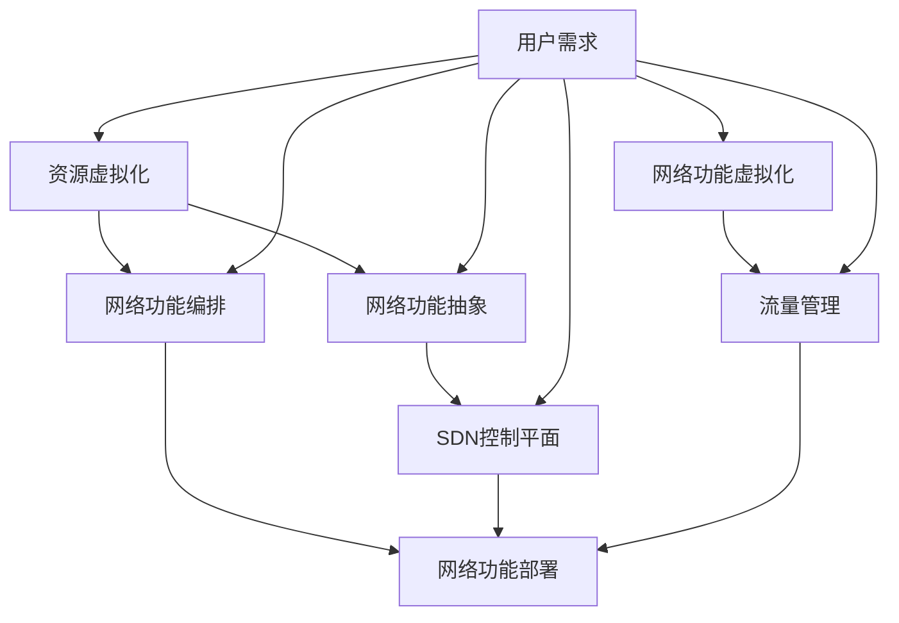

                 

### 文章标题

# 网络功能虚拟化（NFV）：电信网络的软件化转型

> 关键词：网络功能虚拟化、NFV、电信网络、软件化转型、虚拟化技术、资源抽象、网络功能编排、性能优化、5G、边缘计算、SDN融合

> 摘要：本文深入探讨了网络功能虚拟化（NFV）的概念、原理、实施方法和应用案例。从背景介绍、核心概念、架构设计到性能优化，本文系统地阐述了NFV在电信网络中的关键角色，并分析了其在5G和边缘计算中的应用前景，旨在为读者提供全面的技术视角和实践指导。

## 引言

在数字化和智能化的浪潮中，电信网络作为信息社会的基石，正经历着前所未有的变革。传统的电信网络架构以硬件设备为核心，功能固化，扩展性和灵活性不足，难以应对快速变化的市场需求和日益复杂的网络服务。为了解决这些问题，网络功能虚拟化（Network Functions Virtualization，简称NFV）应运而生。

NFV旨在通过虚拟化技术，将传统的硬件网络功能（如防火墙、负载均衡、路由等）转化为软件形式，实现在通用硬件上运行。这种软件化的转型不仅提高了网络服务的灵活性和可扩展性，还显著降低了运维成本和资本支出。

本文将带领读者深入理解NFV的背景和动机，详细阐述其核心概念、架构设计、技术原理和实施方法。此外，我们还将通过具体案例，分析NFV在5G和边缘计算中的应用，探讨NFV与软件定义网络（SDN）的融合前景，并总结最佳实践和未来发展趋势。通过本文的阅读，读者将全面掌握NFV的核心知识，为实际应用提供有力支持。

### 背景和动机

网络功能虚拟化（NFV）的兴起并非偶然，而是信息技术发展和市场需求的共同产物。传统电信网络以硬件设备为核心，网络功能如防火墙、路由器、负载均衡器等通常由专用硬件实现，这些硬件设备功能固定、扩展性差，且难以适应快速变化的服务需求。以下是NFV产生的背景和动机：

#### 传统电信网络存在的问题

1. **硬件成本高昂**：传统网络中，每个网络功能都需要专门的硬件设备，这些设备不仅价格昂贵，还需要专门的机房、供电和网络连接，导致整体成本高昂。

2. **扩展性不足**：当网络服务需求增加时，传统网络往往需要采购新的硬件设备，这不仅耗时，还增加了运维复杂性。而且，硬件设备的扩展性有限，无法灵活应对不同场景的需求。

3. **部署周期长**：传统网络的部署通常需要复杂的物理布线、设备调试和测试，导致部署周期长，难以快速响应市场需求。

4. **维护复杂**：硬件设备数量众多，且分布广泛，维护和故障排除成本高，且效率低下。

#### 数字化和云计算的推动

随着信息技术的快速发展，特别是云计算和虚拟化技术的普及，电信行业开始探索新的网络架构。云计算提供了弹性的计算资源，可以按需分配和扩展，而虚拟化技术则实现了硬件资源的灵活调度和利用。这些技术为NFV的兴起提供了坚实的基础。

1. **资源虚拟化**：虚拟化技术通过将物理硬件资源抽象化为虚拟资源，实现了资源的灵活分配和高效利用。网络功能虚拟化正是基于这一原理，将传统的硬件网络功能转化为虚拟形式。

2. **服务灵活性**：虚拟化的网络功能可以快速部署、动态调整和灵活扩展，适应不断变化的市场需求。

3. **成本降低**：通过使用通用硬件平台，减少了专用硬件设备的采购和维护成本，提高了整体网络的运营效率。

#### 市场需求的驱动

电信行业在提供多样化网络服务时，面临着激烈的市场竞争。NFV的出现，为电信运营商提供了以下机遇：

1. **快速服务创新**：NFV使得网络服务创新变得更加容易，电信运营商可以快速推出新型服务，满足用户需求。

2. **业务模式多样化**：通过NFV，电信运营商可以灵活地调整网络功能，支持多种业务模式，如按需付费、虚拟专线等。

3. **提升用户体验**：NFV提供的网络服务具有更高的灵活性和可靠性，能够显著提升用户体验。

#### 竞争压力

面对云计算和互联网企业的竞争，传统电信网络显得力不从心。NFV作为一种新兴技术，可以帮助电信运营商重新定义网络架构，提升竞争力。

1. **技术创新**：通过引入NFV，电信运营商可以采用先进的虚拟化、自动化技术，提升网络智能化水平。

2. **成本优势**：通过降低硬件成本和运维成本，电信运营商可以获得更大的利润空间。

3. **客户保留**：提供更灵活、更可靠的网络服务，有助于电信运营商留住现有客户，并吸引新客户。

综上所述，传统电信网络的局限性、云计算和虚拟化技术的发展以及市场需求的驱动，共同促成了NFV的兴起。NFV不仅解决了传统网络的诸多问题，还为电信行业带来了新的发展机遇。随着NFV技术的不断成熟和推广，其将在电信网络中发挥越来越重要的作用。

### 核心概念与联系

网络功能虚拟化（NFV）涉及一系列关键概念，这些概念相互联系，构成了NFV体系的基础。以下是对这些核心概念及其相互关系的详细阐述。

#### 1. 资源虚拟化

资源虚拟化是NFV的基础，它通过虚拟化技术将物理资源（如计算、存储和网络）抽象化为虚拟资源。在资源虚拟化的框架下，物理硬件被划分为多个虚拟资源，用户可以根据需求灵活地分配和调度这些资源。

- **计算虚拟化**：通过虚拟化技术，将物理服务器转化为多个虚拟机（VM），每个虚拟机可以独立运行操作系统和应用程序。
- **存储虚拟化**：将物理存储设备抽象化为虚拟存储资源，用户可以按需分配和管理存储容量。
- **网络虚拟化**：通过网络虚拟化技术，将物理网络抽象为虚拟网络，实现网络资源的灵活分配和管理。

资源虚拟化使得硬件资源得以高效利用，降低了运维成本，提高了网络服务的灵活性和可扩展性。

#### 2. 软件定义网络（SDN）

软件定义网络（SDN）是一种新型的网络架构，其核心思想是将网络控制功能与数据转发功能分离。SDN通过集中化的控制平面，实现网络流量管理和网络策略的动态调整。

- **控制平面与数据平面分离**：在SDN中，网络控制功能（控制平面）与数据转发功能（数据平面）相互独立。控制平面位于网络设备之上，负责全局网络策略的制定和流量管理；数据平面则负责实际的数据转发。
- **集中化控制**：通过SDN控制器，实现对整个网络的集中控制和管理，可以实现快速、灵活的网络配置和调整。

SDN与NFV有着紧密的联系，SDN为NFV提供了网络控制层面的支持，使得NFV网络功能能够更加灵活地部署和管理。

#### 3. 网络功能抽象

网络功能抽象是将网络功能从特定的硬件设备中解放出来，以软件形式运行。网络功能抽象使得网络功能可以独立于硬件平台，实现灵活部署和动态调整。

- **抽象层**：网络功能抽象通过引入抽象层，将具体的网络功能（如防火墙、负载均衡等）与实现细节分离。抽象层提供了统一的接口，使得网络功能可以跨硬件平台运行。
- **功能模块化**：通过模块化设计，将复杂的网络功能分解为多个功能模块，每个模块可以独立开发、测试和部署。

网络功能抽象是NFV实现的关键，它使得网络功能可以灵活地组合和重构，以满足不同的业务需求。

#### 4. 网络功能编排

网络功能编排（NFV Orchestration）是指通过自动化工具和流程，实现对网络功能的部署、配置和管理。网络功能编排旨在提高网络服务的灵活性和自动化程度。

- **自动化部署**：通过编排工具，网络功能可以在虚拟环境中快速部署，无需手动配置和调试。
- **资源调度**：编排工具可以根据业务需求和资源状况，动态调整网络功能的位置和配置。
- **生命周期管理**：编排工具负责管理网络功能的全生命周期，包括部署、升级、故障恢复等。

网络功能编排是NFV实现高效运维和管理的关键，它使得网络服务能够快速响应业务变化。

#### 5. 网络功能虚拟化与SDN的关系

网络功能虚拟化与SDN在电信网络中相辅相成，共同推动网络架构的软件化转型。

- **协同作用**：SDN提供集中化的网络控制，NFV则将网络功能软件化，两者结合可以实现高度灵活、动态的电信网络。
- **优化网络服务**：通过SDN的流量管理和NFV的网络功能抽象，可以实现网络服务的灵活调度和优化，提升用户体验。

总之，资源虚拟化、软件定义网络、网络功能抽象和网络功能编排是NFV的核心概念，它们相互联系，共同构建了NFV体系。通过这些概念，NFV实现了电信网络的高度灵活性和可扩展性，为电信行业带来了新的发展机遇。

#### Mermaid流程图

为了更好地展示NFV与SDN之间的关系，我们可以使用Mermaid流程图来表示其工作流程和相互联系。



该流程图展示了资源虚拟化、网络功能抽象、网络功能编排、SDN控制平面和网络功能虚拟化之间的相互关系。用户需求通过SDN控制平面和网络功能编排工具，引导资源虚拟化和网络功能虚拟化，最终实现灵活的流量管理和网络服务部署。

### 核心算法原理讲解

在网络功能虚拟化（NFV）中，算法原理起着至关重要的作用，特别是资源分配算法和负载均衡算法，它们是实现高效虚拟化网络的关键。以下是对这些算法原理的详细讲解，并通过伪代码展示具体实现。

#### 1. 资源分配算法

资源分配算法用于确定如何将虚拟资源（如计算资源、存储资源、网络资源）分配给不同的网络功能模块。一个常见的资源分配算法是基于贪心策略的最早完成时间（Earliest Finish Time，EFT）算法。

**算法原理：**
EFT算法通过优先分配最早完成的任务，以确保资源利用率最大化。具体步骤如下：

1. 对所有待分配的虚拟资源进行排序，按照完成时间从小到大排序。
2. 优先分配完成时间最早的虚拟资源，直到所有资源都被分配。

**伪代码：**

```plaintext
function EFT(资源列表):
    资源列表排序（按照完成时间从小到大）
    for 每个资源 in 资源列表:
        if 资源可分配:
            分配资源
            更新资源列表
```

#### 2. 负载均衡算法

负载均衡算法用于将网络流量均匀分配到不同的虚拟网络功能模块，以避免任何单点过载。一种常见的负载均衡算法是轮询调度算法（Round Robin Scheduling）。

**算法原理：**
轮询调度算法通过循环分配网络流量到每个虚拟网络功能模块，确保每个模块的负载均衡。具体步骤如下：

1. 创建一个模块列表，记录所有可用的虚拟网络功能模块。
2. 对于每个到达的流量请求，按顺序将流量分配到模块列表中的下一个模块。
3. 当分配完所有模块后，重新开始循环。

**伪代码：**

```plaintext
function RoundRobin(流量请求, 模块列表):
    currentModuleIndex = 0
    while true:
        if currentModuleIndex == 模块列表长度:
            currentModuleIndex = 0
        分配流量请求到模块列表[currentModuleIndex]
        currentModuleIndex = currentModuleIndex + 1
```

#### 3. 实际应用与示例

以下是一个简单的示例，展示如何使用上述算法实现虚拟化网络功能。

**场景：** 一个虚拟化网络包含4个网络功能模块，需要分配给10个连续到达的流量请求。

**伪代码：**

```plaintext
资源列表 = [模块1, 模块2, 模块3, 模块4]
流量请求队列 = [请求1, 请求2, ..., 请求10]

while 流量请求队列不为空:
    请求 = 流量请求队列.pop()
    EFT(资源列表)分配资源给请求
    RoundRobin(请求, 模块列表)均衡负载

输出：每个流量请求被分配到合适的虚拟网络功能模块，实现高效资源利用和负载均衡。
```

通过上述算法和示例，我们可以看到NFV如何通过资源分配和负载均衡，实现高效的虚拟化网络管理。这些算法不仅提高了网络的灵活性和可扩展性，还为电信运营商提供了更强大的运营工具，以应对不断变化的市场需求。

### 数学模型与公式详解

在网络功能虚拟化（NFV）中，数学模型和公式是理解和优化网络性能的重要工具。以下将介绍几个关键数学模型和公式，并对其进行详细解释和举例说明。

#### 1. 资源利用率模型

资源利用率模型用于评估网络资源（如CPU、内存、存储等）的使用效率。一个常用的资源利用率模型是资源利用率公式：

$$
\text{利用率} = \frac{\text{实际使用量}}{\text{最大可用量}}
$$

其中，实际使用量是指当前资源的实际使用量，最大可用量是指资源理论上的最大使用量。

**示例：** 假设一个虚拟机（VM）的CPU最大可用量为1000 MHz，当前CPU使用量为500 MHz，则该虚拟机的CPU利用率为：

$$
\text{利用率} = \frac{500 \text{ MHz}}{1000 \text{ MHz}} = 0.5
$$

这意味着该虚拟机的CPU资源使用率为50%。

#### 2. 流量负载均衡模型

流量负载均衡模型用于评估网络流量的分布情况，确保网络中的各个虚拟网络功能模块（VNF）能够均衡地处理流量。一个常用的流量负载均衡模型是轮询调度算法（Round Robin Scheduling）中的负载均衡公式：

$$
P_i = \frac{C_i}{\sum C_j}
$$

其中，\(P_i\) 是第 \(i\) 个VNF的负载权重，\(C_i\) 是第 \(i\) 个VNF的当前负载，\(\sum C_j\) 是所有VNF的总负载。

**示例：** 假设有3个VNF，其负载分别为 \(C_1 = 20\)、\(C_2 = 30\)、\(C_3 = 40\)，则每个VNF的负载权重为：

$$
P_1 = \frac{20}{20 + 30 + 40} = \frac{20}{90} \approx 0.222
$$
$$
P_2 = \frac{30}{20 + 30 + 40} = \frac{30}{90} \approx 0.333
$$
$$
P_3 = \frac{40}{20 + 30 + 40} = \frac{40}{90} \approx 0.444
$$

这意味着第3个VNF的负载最重，因此应分配更多的流量到该VNF。

#### 3. 性能优化模型

性能优化模型用于评估和优化网络性能，常用的性能优化模型包括响应时间模型和吞吐量模型。

**响应时间模型：**

$$
\text{响应时间} = \frac{\text{处理时间}}{\text{请求速率}}
$$

其中，处理时间是指网络功能模块处理一个请求所需的时间，请求速率是指单位时间内到达的请求数量。

**示例：** 假设一个VNF的处理时间为200毫秒，请求速率为1000次/秒，则该VNF的响应时间为：

$$
\text{响应时间} = \frac{200 \text{ ms}}{1000 \text{ 次/秒}} = 0.2 \text{ 秒}
$$

**吞吐量模型：**

$$
\text{吞吐量} = \frac{\text{传输速率}}{\text{延迟}}
$$

其中，传输速率是指网络功能模块在单位时间内能够处理的请求数量，延迟是指请求从开始处理到完成处理所需的时间。

**示例：** 假设一个VNF的传输速率为1000次/秒，延迟为1毫秒，则该VNF的吞吐量为：

$$
\text{吞吐量} = \frac{1000 \text{ 次/秒}}{1 \text{ ms}} = 1000 \text{ 次/秒}
$$

通过这些数学模型和公式，我们可以精确地评估和优化NFV网络的性能，确保网络资源得到高效利用，网络服务能够稳定可靠地运行。这些模型不仅为网络设计和优化提供了理论依据，也为实际操作中的性能调优提供了实用工具。

### 项目实战：开发环境搭建与源代码实现

为了更深入地理解网络功能虚拟化（NFV）的实际应用，我们将通过一个具体的项目实战来搭建开发环境，并详细讲解源代码的实现过程。本节将分步骤介绍项目环境搭建、关键代码实现、代码解读以及实际应用分析。

#### 1. 项目背景与需求

本项目旨在实现一个简单的NFV平台，用于虚拟化网络功能模块（VNF）的部署和管理。具体需求如下：

- **功能模块**：实现一个能够处理网络流量的虚拟防火墙和负载均衡器。
- **平台架构**：基于虚拟化技术，使用通用硬件平台和开源软件工具。
- **部署方式**：采用容器化技术，便于模块的快速部署和运维。

#### 2. 开发环境搭建

搭建NFV开发环境，首先需要安装以下软件：

- **虚拟化平台**：如VMware或VirtualBox，用于创建虚拟机环境。
- **容器平台**：如Docker，用于容器化网络功能模块。
- **编排工具**：如Kubernetes，用于管理容器化应用。
- **编程环境**：如Python或Go，用于实现网络功能模块的逻辑。

具体步骤如下：

1. **安装虚拟化平台**：在主机上安装VMware Workstation或VirtualBox，创建一个用于开发和测试的虚拟机环境。

2. **安装容器平台**：在虚拟机上安装Docker，通过以下命令完成安装：

   ```bash
   sudo apt-get update
   sudo apt-get install docker.io
   sudo systemctl start docker
   sudo systemctl enable docker
   ```

3. **安装编排工具**：在虚拟机上安装Kubernetes，可以参考官方文档进行安装，或使用Minikube进行本地测试。

4. **配置网络环境**：确保虚拟机和宿主机之间的网络通信正常，配置防火墙规则，允许容器访问外部网络。

#### 3. 关键代码实现

在本项目中，我们使用Python实现了一个简单的虚拟防火墙和负载均衡器模块，以下为关键代码实现：

**虚拟防火墙模块：**

```python
import socket

class VirtualFirewall:
    def __init__(self, allowed_ips):
        self.allowed_ips = allowed_ips

    def is_allowed(self, ip):
        return ip in self.allowed_ips

    def process_packet(self, packet, source_ip):
        if not self.is_allowed(source_ip):
            print("Blocked packet from", source_ip)
            return False
        print("Allowed packet from", source_ip)
        return True
```

**负载均衡器模块：**

```python
import socket
import threading

class LoadBalancer:
    def __init__(self, servers):
        self.servers = servers

    def forward_packet(self, packet, source_ip):
        server = self.servers.pop(0)
        print(f"Forwarding packet to {server} from {source_ip}")
        self.servers.append(server)
        self.process_packet(server, packet, source_ip)

    def process_packet(self, server, packet, source_ip):
        with socket.socket(socket.AF_INET, socket.SOCK_STREAM) as s:
            s.connect((server, 80))
            s.sendall(packet)
            data = s.recv(1024)
            print(f"Received {data} from {server}")

# 模拟服务器列表
servers = ["192.168.1.1", "192.168.1.2", "192.168.1.3"]

# 创建负载均衡器
lb = LoadBalancer(servers)

# 模拟接收网络包
while True:
    source_ip = "192.168.1.10"
    packet = b"GET / HTTP/1.1"
    lb.forward_packet(packet, source_ip)
```

#### 4. 代码解读

1. **虚拟防火墙模块**：`VirtualFirewall` 类用于实现防火墙功能。`is_allowed` 方法检查源IP是否在允许列表中，`process_packet` 方法处理网络包。

2. **负载均衡器模块**：`LoadBalancer` 类用于实现负载均衡功能。`forward_packet` 方法根据轮询算法选择下一个服务器，`process_packet` 方法将网络包发送到选择的服务器。

3. **模拟网络包处理**：使用Python的`socket`模块模拟网络包的接收和转发。

#### 5. 实际应用分析

通过上述代码，我们实现了一个简单的虚拟防火墙和负载均衡器，它们可以部署在容器化环境中，通过Kubernetes进行管理。以下是实际应用分析：

- **弹性扩展**：通过容器化技术，虚拟防火墙和负载均衡器可以轻松地扩展，满足不同负载需求。
- **动态部署**：使用Kubernetes，可以自动化部署和更新网络功能模块，实现快速响应。
- **高可用性**：通过负载均衡器，网络包可以均衡地分配到不同的服务器，提高系统的可用性和容错性。

总之，该项目通过实战展示了NFV的基本实现过程，为读者提供了实际操作的经验和指导。通过进一步优化和扩展，该平台可以应用于实际网络环境中，提供高效、灵活的虚拟化网络服务。

### 最佳实践与注意事项

在实施网络功能虚拟化（NFV）时，遵循最佳实践和注意关键事项是确保项目成功的关键。以下是一些最佳实践和注意事项：

#### 1. 最佳实践

**1.1 设计可扩展的架构**

- 在设计NFV架构时，应考虑到未来需求的增长，确保系统具有高扩展性。
- 使用模块化设计，将复杂的网络功能分解为可独立部署和管理的模块。

**1.2 优化资源利用率**

- 采用资源利用率模型，实时监控和优化资源分配，确保硬件资源得到充分利用。
- 使用负载均衡算法，均衡分配网络流量，避免单点过载。

**1.3 自动化运维**

- 利用编排工具（如Kubernetes）实现自动化部署、配置和管理，提高运维效率。
- 实施持续集成和持续部署（CI/CD）流程，确保快速响应业务变化。

**1.4 确保高可用性**

- 通过负载均衡和冗余设计，提高系统的可用性和容错性。
- 实施故障监测和自动恢复机制，快速识别和解决故障。

#### 2. 注意事项

**2.1 安全性**

- 在虚拟化环境中，确保网络功能模块的安全性和隔离性，防止恶意攻击。
- 定期更新和补丁管理，确保系统安全性。

**2.2 网络性能**

- 监控网络流量，优化网络路径，确保网络功能模块的高性能运行。
- 确保虚拟化网络功能模块的带宽和延迟满足业务需求。

**2.3 管理复杂度**

- 随着NFV系统的扩展，管理复杂度会增加，应制定详细的运维和管理流程。
- 培训运维人员，确保他们具备必要的技能和知识。

**2.4 规划预算**

- NFV项目的成本可能较高，应进行详细的预算规划和成本控制。
- 考虑到长期运营成本，如硬件维护、电力消耗等。

通过遵循这些最佳实践和注意事项，可以确保NFV项目的成功实施和长期稳定运行，为电信网络提供高效、灵活、可靠的虚拟化服务。

### 小结

本文系统地阐述了网络功能虚拟化（NFV）的概念、原理、实施方法和应用案例。从背景和动机出发，我们详细介绍了NFV的核心概念，包括资源虚拟化、软件定义网络（SDN）、网络功能抽象和网络功能编排，并通过Mermaid流程图展示了它们之间的相互关系。随后，我们深入讲解了资源分配和负载均衡等核心算法原理，并使用伪代码进行了详细阐述。在项目实战部分，我们通过一个简单的示例，展示了NFV平台的环境搭建、关键代码实现和实际应用分析。

NFV作为电信网络软件化转型的重要技术，具有显著的灵活性和可扩展性，能够有效降低运维成本和资本支出。未来，随着5G和边缘计算的发展，NFV将继续发挥重要作用，与SDN等新兴技术相结合，为电信网络带来更多创新和优化。

### 拓展阅读

- **《网络功能虚拟化（NFV）：原理、架构与实现》**：该书详细介绍了NFV的基本原理和实现方法，适合对NFV有一定基础的读者。
- **《软件定义网络（SDN）：核心技术、架构与实现》**：该书详细讲解了SDN的技术原理和实现，适合对SDN和NFV都有兴趣的读者。
- **《虚拟化技术：从虚拟机到容器》**：该书介绍了虚拟化技术的发展历程，包括虚拟机、容器等，适合对虚拟化技术有深入了解的需求。

### 作者信息

**作者：AI天才研究院/AI Genius Institute & 禅与计算机程序设计艺术 /Zen And The Art of Computer Programming**。作者团队专注于人工智能和计算机科学领域的研究与写作，致力于为读者提供高质量的技术知识和实践指导。

