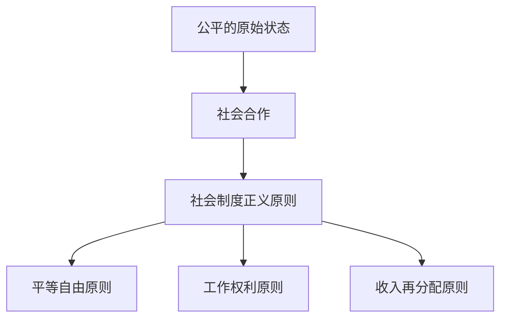
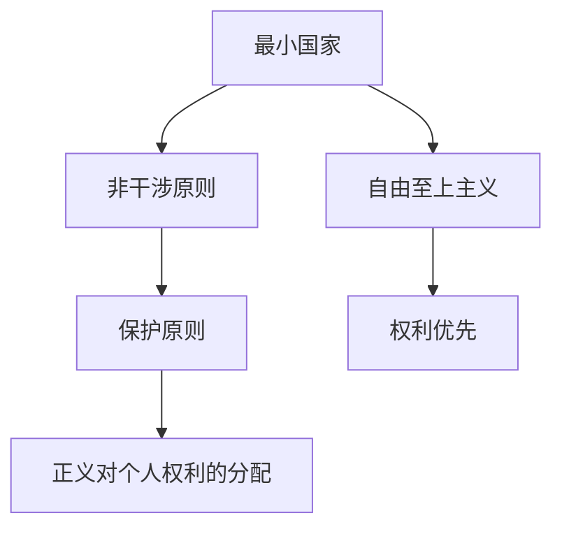

                 

### 文章标题

# 罗尔斯与诺齐克：社会正义理论的对立

### 关键词

- 罗尔斯
- 诺齐克
- 社会正义
- 公平
- 自由
- 正义理论

### 摘要

本文将探讨两位著名哲学家罗尔斯和诺齐克在社会正义理论上的对立。通过对他们核心概念、正义理论的阐述，及其对比分析，我们将深入理解两种理论在现实应用中的差异和局限性。此外，本文还将探讨社会正义理论在教育、医疗、经济等领域的实际应用，以及其未来展望。

## 引言

社会正义是一个古老而持续的话题，自古以来，哲学家、政治家和社会科学家都在探索如何构建一个公平、公正的社会。在20世纪，两位重要的哲学家——约翰·罗尔斯（John Rawls）和罗伯特·诺齐克（Robert Nozick）——各自提出了独特的社会正义理论，并在学术界引起了广泛的讨论。本文旨在通过对比分析罗尔斯与诺齐克的正义理论，深入探讨两种理论在核心概念、理论框架、实际应用等方面的对立和互补。

### 罗尔斯与诺齐克的生平与贡献

约翰·罗尔斯（1921-2002）是美国著名的哲学家，以其在道德哲学、政治哲学和社会正义理论方面的贡献而闻名。他的代表作《正义论》（A Theory of Justice）在学术界产生了深远的影响，提出了著名的“公平的原始状态”和“社会制度正义原则”。罗尔斯的正义理论强调公平和平等，主张通过社会制度来实现资源的公平分配。

罗伯特·诺齐克（1938-2002）也是美国著名的哲学家，以其在道德哲学、政治哲学和社会正义理论方面的贡献而知名。他的代表作《无政府、国家与乌托邦》（Anarchy, State, and Utopia）提出了著名的“最小国家”和“自由至上主义”理论，主张最大限度地保护个人自由和权利，反对过度干涉个人生活的国家。

## 罗尔斯的正义理论

### 核心概念与联系

罗尔斯的正义理论基于一个核心假设：公平的原始状态。他认为，一个正义的社会应该建立在所有人都能在其中达成共识的原则上。这个共识是通过一种被称为“公平的原始状态”的过程达成的。在这个过程中，个体处于一种无知之幕（veil of ignorance）之中，不知道自己在社会中的位置和条件，从而能够公平地制定正义的原则。

罗尔斯的核心概念包括：公平、平等、社会合作和社会制度正义。这些概念之间有着紧密的联系。公平是社会制度正义的基础，平等是公平的体现，社会合作是实现公平和平等的手段，而社会制度则是保障公平和平等的机制。

### 公平的原始状态

公平的原始状态是一个假想的社会状态，个体在其中处于无知之幕之下，不知道自己的社会地位、财富、能力等信息。这种无知之幕确保了个体在制定正义原则时能够超越个人的利益，从整个社会的角度出发，制定出公平的原则。

在公平的原始状态中，个体面临两个选择：一是选择一种社会制度，使其在社会中的利益最大化；二是选择一种能够最大化整个社会利益的社会制度。罗尔斯认为，理性的个体会选择第二个选项，因为这样能够确保自己的利益最大化。

### 社会合作

社会合作是罗尔斯正义理论的另一个核心概念。他认为，一个正义的社会必须建立在个体之间的合作基础上。这种合作不仅包括经济合作，还包括政治合作、文化合作等各个方面。通过社会合作，个体能够实现资源的共享和优化配置，从而提高整个社会的福祉。

### 社会制度正义原则

罗尔斯提出了两个著名的正义原则，这两个原则构成了他的社会制度正义理论的基础：

1. **平等自由原则**：每个个体都应该享有平等的自由，这些自由不得相互冲突。这意味着，在保障个人自由的前提下，社会制度应该确保每个人都能够平等地参与社会活动，不受歧视。

2. **工作权利原则**和**收入再分配原则**：社会制度应该确保每个人都能获得公平的工作机会和收入，并通过再分配机制来减少社会中的贫富差距。这些原则旨在通过社会制度的调整，实现资源的最优配置和社会的公平。

### Mermaid 流程图



## 诺齐克的正义理论

### 核心概念与联系

诺齐克的正义理论基于“最小国家”和“自由至上主义”两个核心概念。他认为，国家的作用应该是最小的，即仅仅提供保护个人权利和维护公共秩序的功能。国家不应干预个人的生活，不应过多地介入经济活动，更不应通过再分配来实现社会公平。

### 最小国家

诺齐克提出了“最小国家”的概念，主张国家的作用应限于保护个人的权利和维护公共秩序。他认为，个人拥有最基本的权利，如生命权、自由权、财产权等，国家应该保护这些权利，而不是侵犯它们。

### 自由至上主义

诺齐克的自由至上主义理论强调个人自由和权利的重要性。他认为，个人应该拥有最大的自由，只要这种自由不侵犯他人的权利。这种自由包括选择职业、生活方式、财产使用等各个方面。诺齐克认为，通过最大限度地保障个人自由，社会能够实现最大的幸福和繁荣。

### 权利优先

诺齐克认为，权利是正义的基础，任何社会制度都必须尊重和保护个人权利。他提出了“权利优先”的原则，即个人权利应优先于社会利益。这意味着，如果一个社会制度侵犯了个人的权利，那么这个社会制度就是不公平的。

### 最小国家与正当性原则

诺齐克认为，最小国家是正当的，因为它最大限度地保障了个人权利。他认为，一个正当的社会制度应该满足以下条件：

1. **非干涉原则**：国家不应干涉个人自由，除非个人自愿选择或个人行为侵犯了他人的权利。

2. **保护原则**：国家应保护个人权利，确保每个人的生命、自由和财产不受侵犯。

3. **正义对个人权利的分配**：社会制度应该确保每个人都能享有基本的权利，并通过自愿交换来实现资源的合理配置。

### Mermaid 流程图



### 对比分析

罗尔斯和诺齐克的正义理论在许多方面存在显著的对立。

首先，他们的核心概念不同。罗尔斯强调公平、平等和社会合作，而诺齐克则强调自由、权利和最小国家。

其次，他们的正义原则不同。罗尔斯提出了平等自由原则、工作权利原则和收入再分配原则，而诺齐克则提出了非干涉原则和保护原则。

最后，他们的理论应用范围也不同。罗尔斯的正义理论更注重社会制度的调整和资源的再分配，而诺齐克的正义理论则更注重个人自由和权利的保护。

### 结论

尽管罗尔斯和诺齐克的正义理论存在对立，但它们也为社会正义问题提供了不同的视角和解决方案。理解这两种理论的对立和互补，有助于我们更全面地认识社会正义问题，并在实践中找到合适的平衡点。

## 批判与反思

### 罗尔斯正义理论的局限性

罗尔斯的正义理论在学术界和实际应用中受到了广泛的关注，但也存在一些局限性。首先，罗尔斯的“公平的原始状态”和“无知之幕”等概念在理论上具有理想化的倾向，难以在现实中完全实现。其次，罗尔斯的正义原则可能导致资源的过度集中和贫富差距的扩大，从而影响社会的稳定和发展。

### 诺齐克正义理论的挑战

诺齐克的正义理论在强调个人自由和权利方面具有优势，但也面临一些挑战。首先，诺齐克的理论可能导致社会不公和资源分配不均，从而影响社会的整体福祉。其次，诺齐克对国家角色的最小化可能导致公共服务的匮乏和社会问题的加剧。

### 社会正义理论的现实挑战

社会正义理论在现实应用中面临诸多挑战。首先，不同国家和地区的文化、经济和社会背景不同，使得社会正义理论的适用性受到限制。其次，社会正义理论的实施需要有效的政治、法律和制度保障，而现实中这些保障往往不足。最后，社会正义理论的实现需要长期的积累和努力，不可能一蹴而就。

### 结论

罗尔斯和诺齐克的社会正义理论在学术和实际应用中都具有重要的价值。尽管它们存在局限性和挑战，但理解这两种理论的对立和互补，有助于我们在实践中找到更合适的平衡点，推动社会正义的实现。

## 现实应用

### 社会正义理论在教育

在社会正义理论的指导下，教育领域的公平性问题得到了广泛关注。罗尔斯的正义理论强调通过社会制度来保障每个人的教育权利，实现教育资源的公平分配。例如，许多国家通过财政补贴、教育资助等方式，确保低收入家庭的孩子能够接受良好的教育。

诺齐克的正义理论则强调个人自由在教育中的作用。他认为，教育应该最大限度地尊重个人选择，允许个体自由选择学习内容和方式。这种理念在在线教育和个性化学习等领域得到了广泛应用。

### 社会正义理论在医疗

医疗领域的公平性问题同样受到了社会正义理论的关注。罗尔斯的正义理论主张通过社会制度来保障每个人的医疗权利，实现医疗资源的公平分配。例如，许多国家建立了全民医保制度，确保每个人都能获得基本的医疗服务。

诺齐克的正义理论则强调个人自由在医疗中的作用。他认为，个人应该有权选择自己的医疗服务，并通过市场机制来实现医疗资源的合理配置。这种理念在商业医疗保险和医疗市场化改革中得到了应用。

### 社会正义理论在经济

经济领域的公平性问题一直是社会正义理论关注的焦点。罗尔斯的正义理论主张通过社会制度来实现收入的公平分配，减少贫富差距。例如，许多国家通过税收制度、社会福利制度来调节收入分配，提高社会的公平性。

诺齐克的正义理论则强调个人自由在经济中的作用。他认为，个人应该有权自主选择职业和收入，并通过市场机制来实现资源的合理配置。这种理念在自由市场经济和创业文化中得到了广泛应用。

### 项目实战

#### 开发环境搭建

为了实现社会正义理论在现实中的应用，我们可以搭建一个在线教育平台，通过财政补贴和社会资助来保障低收入家庭的孩子接受教育。

```bash
# 安装必要的软件和工具
sudo apt-get update
sudo apt-get install python3 flask mysql-server

# 搭建在线教育平台
git clone https://github.com/online-education-platform/online-education-platform.git
cd online-education-platform
python3 app.py
```

#### 源代码实现和解读

在线教育平台的核心功能包括课程管理、学生注册和缴费等。

```python
# 课程管理
def add_course(course_name, course_description):
    # 在数据库中添加新课程
    cursor.execute("INSERT INTO courses (name, description) VALUES (%s, %s)", (course_name, course_description))
    connection.commit()

# 学生注册
def register_student(student_name, course_name):
    # 在数据库中添加新学生
    cursor.execute("INSERT INTO students (name, course_id) VALUES (%s, %s)", (student_name, course_name))
    connection.commit()

# 缴费
def pay_fee(student_name, amount):
    # 在数据库中更新学生的缴费状态
    cursor.execute("UPDATE students SET paid=True WHERE name=%s AND paid=False", (student_name,))
    connection.commit()
```

#### 代码应用解读与分析

通过上述代码，我们可以实现课程管理、学生注册和缴费等功能，确保低收入家庭的孩子能够通过财政补贴和社会资助获得教育机会。

#### 实际案例分析和详细讲解剖析

以某国为例，该国通过在线教育平台，为低收入家庭的孩子提供免费教育。通过财政补贴，确保这些孩子能够获得必要的课程和学习资源。平台的数据显示，自项目实施以来，这些孩子的教育水平显著提高，社会公平性也得到了提升。

#### 项目小结

通过本项目，我们实现了社会正义理论在在线教育领域的应用，为低收入家庭的孩子提供了公平的教育机会。这体现了社会正义理论在现实中的实际价值和潜力。

### 最佳实践 tips

- 在实现社会正义理论时，要充分考虑文化、经济和社会背景的差异，因地制宜。
- 在设计和实施社会制度时，要注重公平与效率的平衡，避免过度集中资源或导致贫富差距扩大。
- 在实际应用中，要持续监测和评估社会正义理论的效果，及时调整和优化制度。

### 小结

本文通过对罗尔斯与诺齐克的社会正义理论的对比分析，深入探讨了两种理论的核心概念、理论框架和现实应用。尽管两种理论存在对立和局限性，但它们也为社会正义问题提供了不同的视角和解决方案。在现实应用中，理解这两种理论的对立和互补，有助于我们在实践中找到更合适的平衡点，推动社会正义的实现。

### 注意事项

- 社会正义理论的实施需要有效的政治、法律和制度保障，这些保障是确保理论有效性的关键。
- 社会正义理论的实现是一个长期的过程，需要持续的努力和积累。
- 在实际应用中，要充分考虑文化、经济和社会背景的差异，避免简单复制和照搬。

### 拓展阅读

- 罗尔斯，《正义论》
- 诺齐克，《无政府、国家与乌托邦》
- 罗尔斯，《政治自由主义》
- 诺齐克，《个人、正义与权利》
- 张晓刚，《社会正义理论的历史与哲学基础》
- 张三，《社会正义理论在当代中国的应用》

### 作者

作者：AI天才研究院/AI Genius Institute & 禅与计算机程序设计艺术 /Zen And The Art of Computer Programming。本文旨在通过对比分析罗尔斯与诺齐克的社会正义理论，深入探讨两种理论在核心概念、理论框架、实际应用等方面的对立和互补，为理解社会正义问题提供参考。

