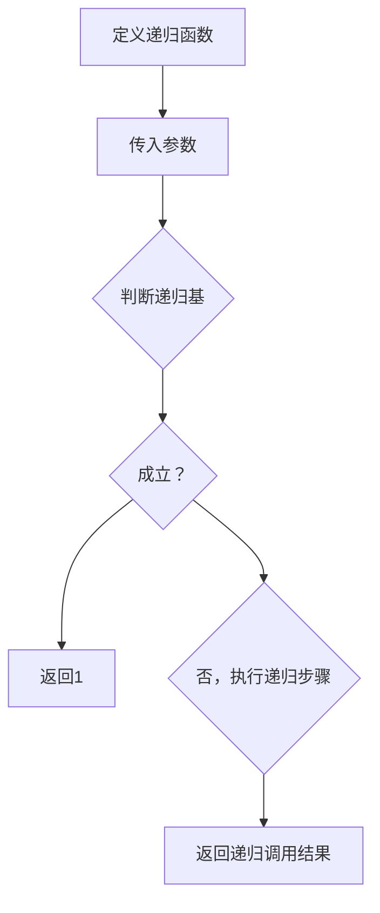

                 


## 文章标题

《罗素悖论与计算机科学中的递归》

---

### 关键词

罗素悖论、计算机科学、递归、算法、数学模型

---

### 摘要

本文旨在深入探讨罗素悖论与计算机科学中递归的关系。通过逐步分析罗素悖论的历史背景、数学描述以及其在计算机科学中的应用，我们将揭示递归函数的原理及其在不同领域的应用。此外，本文还将通过实际项目案例，展示递归算法的开发环境搭建、源代码实现和代码解读，帮助读者更好地理解递归的实际应用。最后，本文将对递归算法的未来发展趋势及其与哲学、逻辑学的联系进行展望，为读者提供全面的视角。

## 第一部分：罗素悖论的基础概念

### 第1章：罗素悖论简介

#### 1.1 罗素悖论的历史背景

##### 1.1.1 罗素悖论的产生

罗素悖论是数学史上一个著名的悖论，最早由英国哲学家、数学家贝特兰·罗素在19世纪末提出。罗素悖论的提出背景是集合论的发展。当时，集合论作为一种新型的数学基础理论，被广泛接受并用于解决数学问题。然而，罗素悖论的发现揭示了集合论中的矛盾，引发了数学界的深刻反思。

##### 1.1.2 罗素悖论对数学的影响

罗素悖论的提出对数学产生了深远的影响。首先，它促使数学家们对集合论进行深入研究和改进，从而发展出了更加严谨的集合论体系。其次，罗素悖论揭示了数学中的逻辑问题，促进了逻辑学的发展。此外，罗素悖论还引发了数学界对数学基础理论的反思和探讨，推动了数学哲学的发展。

#### 1.2 罗素悖论的数学描述

##### 1.2.1 罗素集合论的基本概念

在罗素悖论的讨论中，集合论的基本概念是不可或缺的。集合论中的主要概念包括元素、集合、子集、并集、交集、补集等。其中，集合是由元素组成的整体，元素可以是任意对象，包括数字、字母、函数等。子集是指一个集合中的部分元素组成的集合。并集和交集是集合之间的运算，分别表示两个集合的所有元素和两个集合中共有的元素。补集则是指一个集合中不属于另一个集合的元素组成的集合。

##### 1.2.2 罗素悖论的构造过程

罗素悖论的具体构造过程如下：

设R为所有不包含自身的集合组成的集合，即R = {X | X 不包含自身}。现在我们来分析R的性质：

1. 如果R包含自身，即R ∈ R，那么根据R的定义，R不应包含自身，产生矛盾。
2. 如果R不包含自身，即R ∉ R，那么根据R的定义，R应该包含自身，同样产生矛盾。

无论R包含自身或不包含自身，都会导致矛盾。这个悖论揭示了集合论中存在的一些逻辑问题，从而推动了集合论的发展和完善。

##### 1.2.3 罗素悖论的数学意义

罗素悖论的数学意义主要体现在以下几个方面：

1. 指出了集合论中自引用的矛盾现象，揭示了集合论内部存在的逻辑问题。
2. 强调了数学基础理论的严谨性，推动了数学哲学的发展。
3. 为集合论的发展提供了动力，促使数学家们对集合论进行改进和完善。
4. 为计算机科学中的递归提供了理论基础，递归函数的原理与罗素悖论有着密切的联系。

### 1.3 罗素悖论与计算机科学的关系

##### 1.3.1 递归函数的概念

递归函数是指一种自调用函数，即函数在定义过程中直接或间接地调用自身。递归函数通常用于解决具有递归性质的问题，如计算阶乘、求最大公约数、计算斐波那契数列等。

##### 1.3.2 递归在计算机科学中的应用

递归在计算机科学中具有广泛的应用，主要表现在以下几个方面：

1. 数据结构：递归是许多数据结构的操作基础，如二叉树、链表、图等。
2. 算法设计：递归算法在算法设计中具有重要作用，如快速排序、归并排序等。
3. 计算模型：递归是计算模型中的重要组成部分，如递归图灵机、递归神经网络等。
4. 编程语言：许多编程语言支持递归，如Python、Java、C++等。

##### 1.3.3 罗素悖论与递归函数的关系

罗素悖论与递归函数之间存在一定的联系：

1. 罗素悖论揭示了集合论中的逻辑问题，为递归函数的讨论提供了理论基础。
2. 递归函数的运行过程与罗素悖论的构造过程具有一定的相似性，都涉及到自引用和矛盾现象。
3. 递归函数在计算机科学中的应用受到罗素悖论的启发，促进了递归算法的发展。

### 1.4 小结

本章介绍了罗素悖论的历史背景、数学描述及其与计算机科学的关系。通过对罗素悖论的分析，我们了解了集合论中的基本概念和逻辑问题，并揭示了递归函数的原理及其应用。接下来，我们将进一步探讨递归算法的原理和数学模型。

## 第二部分：递归算法原理

### 第2章：递归算法基础

#### 2.1 递归的基本概念

##### 2.1.1 递归的定义

递归（Recursion）是一种编程技巧，指的是在函数或过程中的自我调用。递归可以分为直接递归和间接递归两种形式。直接递归是指函数直接调用自身，而间接递归是指函数通过其他函数间接地调用自身。

##### 2.1.2 递归与迭代

递归和迭代是两种解决问题的方法，它们各有优缺点。迭代是指通过循环结构反复执行某段代码来解决问题，而递归是通过函数的自我调用来实现。递归的优点在于代码简洁、易于理解，但递归的缺点是可能导致栈溢出，因为每次递归调用都会在栈上分配新的内存空间。

##### 2.1.3 递归的优缺点

递归的优点如下：

1. 代码简洁：递归往往可以简化问题的解决过程，使代码更加直观和易于理解。
2. 易于实现：递归算法通常较为简单，不需要复杂的逻辑控制结构。
3. 解决问题能力：递归可以解决许多迭代难以解决的问题，如递归遍历树结构、图结构等。

递归的缺点如下：

1. 栈溢出：递归调用次数过多可能导致栈溢出，影响程序的运行效率。
2. 内存消耗：每次递归调用都会在栈上分配新的内存空间，可能导致内存消耗过多。
3. 代码可读性：递归代码可能因为过多的嵌套调用而降低可读性。

#### 2.2 递归函数的原理

##### 2.2.1 递归函数的结构

递归函数通常由两部分组成：递归基（Base Case）和递归步骤（Recursive Step）。递归基是递归调用的终止条件，用于避免无限递归；递归步骤则是递归调用的具体过程。

以下是一个简单的递归函数示例，用于计算阶乘：

```python
def factorial(n):
    if n == 0:
        return 1
    else:
        return n * factorial(n - 1)
```

在这个例子中，递归基是 `n == 0`，递归步骤是 `n * factorial(n - 1)`。

##### 2.2.2 递归函数的伪代码实现

递归函数的伪代码实现通常包含以下步骤：

1. 定义递归函数，并传入参数。
2. 判断递归基是否成立，若成立则返回结果。
3. 若递归基不成立，则执行递归步骤，并返回递归调用的结果。

以下是一个计算斐波那契数列的递归函数伪代码实现：



##### 2.2.3 递归函数的运行过程

递归函数的运行过程可以分为两个阶段：递推阶段和回推阶段。

1. 递推阶段：从初始值开始，依次递归调用自身，直到达到递归基。
2. 回推阶段：从递归基开始，依次返回递归调用的结果，直到回到初始调用。

以下是一个计算斐波那契数列的递归函数运行过程示例：

```
fibonacci(5)
fibonacci(4) + fibonacci(3)
fibonacci(3) + fibonacci(2)
fibonacci(2) + fibonacci(1)
fibonacci(1) + fibonacci(0)
1 + 1
```

#### 2.3 递归算法的应用场景

##### 2.3.1 计算阶乘

计算阶乘是递归算法的一个经典应用场景。阶乘是指一个正整数n的阶乘，表示为n!，计算公式为：

```
n! = n × (n - 1) × (n - 2) × ... × 1
```

使用递归算法计算阶乘的伪代码如下：


递归函数实现如下：

```python
def factorial(n):
    if n == 0:
        return 1
    else:
        return n * factorial(n - 1)
```

##### 2.3.2 求最大公约数

求最大公约数（Greatest Common Divisor，简称GCD）是递归算法的另一个经典应用场景。最大公约数是指两个或多个整数共有的最大的约数。使用递归算法求解最大公约数的伪代码如下：

```mermaid
graph TD
A[定义递归函数]
B[传入两个参数]
C{判断递归基}
D{成立？}
E[返回较小数]
F{否，执行递归步骤}
G[返回gcd(a, b%a)}
```

递归函数实现如下：

```python
def gcd(a, b):
    if b == 0:
        return a
    else:
        return gcd(b, a % b)
```

##### 2.3.3 计算斐波那契数列

计算斐波那契数列是递归算法的另一个重要应用场景。斐波那契数列是指这样一个数列：0、1、1、2、3、5、8、13、21、34、...，数列中的每一项都是前两项的和。使用递归算法计算斐波那契数列的伪代码如下：

```mermaid
graph TD
A[定义递归函数]
B[传入参数]
C{判断递归基}
D{成立？}
E[返回结果]
F{否，执行递归步骤}
G[返回fibonacci(n-1) + fibonacci(n-2)}
```

递归函数实现如下：

```python
def fibonacci(n):
    if n == 0:
        return 0
    elif n == 1:
        return 1
    else:
        return fibonacci(n - 1) + fibonacci(n - 2)
```

#### 2.4 小结

本章介绍了递归的基本概念、原理及其应用场景。通过计算阶乘、求最大公约数和计算斐波那契数列等实例，我们了解了递归函数的实现方式和运行过程。递归算法在计算机科学中具有广泛的应用，为解决许多复杂问题提供了有效的手段。

## 第三部分：递归与数学模型

### 第3章：递归与数学模型

#### 3.1 数学模型中的递归

递归在数学模型中有着广泛的应用，特别是在解决递推关系和序列问题上。递推关系是指一个序列的项可以通过前一项或前几项来确定。递归正是利用这一特性，通过递归关系来计算序列的每一项。

##### 3.1.1 递归序列的定义

递归序列是指通过递归关系定义的数列。一个典型的例子是斐波那契数列，它的递归关系定义为：

```
F(0) = 0
F(1) = 1
F(n) = F(n-1) + F(n-2) (n > 1)
```

这个递归关系表明，斐波那契数列的第n项等于前两项的和。

##### 3.1.2 递归方程的求解方法

递归方程是指用递归关系定义的数学方程。求解递归方程通常有以下几种方法：

1. **递推法**：通过递归关系逐步计算方程的每一项，直到达到终止条件。
2. **迭代法**：将递归方程转化为迭代形式，通过循环结构逐步求解。
3. **数学归纳法**：利用数学归纳法证明递归方程的解满足递归关系。

以下是一个使用递推法求解递归方程的示例：

```
递归方程：an = an-1 + an-2
初始条件：a0 = 1, a1 = 2
求解过程：
a2 = a1 + a0 = 2 + 1 = 3
a3 = a2 + a1 = 3 + 2 = 5
a4 = a3 + a2 = 5 + 3 = 8
...
```

通过递推法，我们可以逐项计算出序列的值。

##### 3.1.3 常见的递归序列

在数学中，存在许多常见的递归序列，如斐波那契数列、卡特兰数列、欧拉数列等。这些序列在数学、计算机科学和生物学等领域有着广泛的应用。

1. **斐波那契数列**：前面已经介绍过，斐波那契数列是递归序列的典型代表。
2. **卡特兰数列**：卡特兰数列是一个与组合数学相关的递归序列，其定义为：

```
C(0) = 1
C(n) = (2n)! / ((n+1)! * n!) (n > 0)
```

卡特兰数列在组合数学中有着重要的应用。
3. **欧拉数列**：欧拉数列是指与欧拉公式相关的数列，其定义为：

```
E(n) = (1/2) * (2^n) * (n!)^2
```

欧拉数列在数学分析和物理学中有着重要的应用。

#### 3.2 罗素悖论相关的数学模型

罗素悖论是一个集合论中的悖论，其涉及到的数学模型主要是集合的构造和定义。罗素悖论的构造过程如下：

设R为所有不包含自身的集合的集合，即：

```
R = {X | X 不包含自身}
```

根据集合论的基本原则，我们可以对R进行分析：

1. 如果R包含自身，即R ∈ R，那么根据R的定义，R不应包含自身，产生矛盾。
2. 如果R不包含自身，即R ∉ R，那么根据R的定义，R应该包含自身，同样产生矛盾。

无论R包含自身或不包含自身，都会导致矛盾。这个悖论揭示了集合论中存在的一些逻辑问题，从而推动了集合论的发展和完善。

##### 3.2.1 罗素集合论的悖论模型

罗素集合论的悖论模型是通过构造一个特定的集合R来揭示集合论中的矛盾。R的定义如下：

```
R = {X | X 不包含自身}
```

根据这个定义，我们可以对R进行分析：

1. 如果R包含自身，即R ∈ R，那么根据R的定义，R不应包含自身，产生矛盾。
2. 如果R不包含自身，即R ∉ R，那么根据R的定义，R应该包含自身，同样产生矛盾。

这个悖论表明，在集合论中存在一些自引用的集合，它们会导致逻辑上的矛盾。为了解决这个问题，数学家们对集合论进行了改进，提出了更加严谨的集合论体系。

##### 3.2.2 使用LaTeX格式的数学公式

在罗素悖论的讨论中，LaTeX格式的数学公式可以用来书写和表示集合论中的概念和关系。以下是一些常见的LaTeX公式：

1. 集合的定义：

```
S = \{x | P(x)\}
```

其中，`S`表示集合，`x`表示集合中的元素，`P(x)`表示元素`x`满足的条件。

2. 集合的包含关系：

```
A \subseteq B
```

其中，`A`和`B`表示两个集合，`A \subseteq B`表示集合`A`是集合`B`的子集。

3. 集合的并集和交集：

```
A \cup B
A \cap B
```

其中，`A \cup B`表示集合`A`和集合`B`的并集，`A \cap B`表示集合`A`和集合`B`的交集。

4. 集合的补集：

```
A^c
```

其中，`A^c`表示集合`A`的补集，即不属于集合`A`的所有元素的集合。

通过使用LaTeX格式，我们可以更加精确地表达数学概念和关系，从而更好地理解罗素悖论。

##### 3.2.3 罗素悖论的数学证明

罗素悖论是一个逻辑上的悖论，其证明通常涉及集合论的基本原理。以下是一个简单的证明：

假设存在一个集合R，它包含所有不包含自身的集合。我们可以对R进行分析：

1. 如果R包含自身，即R ∈ R，那么根据R的定义，R不应包含自身，产生矛盾。
2. 如果R不包含自身，即R ∉ R，那么根据R的定义，R应该包含自身，同样产生矛盾。

无论R包含自身或不包含自身，都会导致矛盾。这个悖论揭示了集合论中存在的一些逻辑问题，从而推动了集合论的发展和完善。

### 3.3 递归与数学模型的应用

递归在数学模型中有着广泛的应用，特别是在解决递推关系和序列问题上。递归正是利用递推关系来计算序列的每一项。以下是一些递归在数学模型中的应用示例：

##### 3.3.1 递归在数据结构中的应用

递归在数据结构中有着广泛的应用，特别是对树结构、图结构和排序算法的遍历。以下是一些递归在数据结构中的应用示例：

1. **二叉树的遍历**：递归可以用来遍历二叉树，包括先序遍历、中序遍历和后序遍历。以下是一个先序遍历的递归实现：

```python
def preorderTraversal(root):
    if root is None:
        return
    print(root.val)  # 访问根节点
    preorderTraversal(root.left)  # 递归遍历左子树
    preorderTraversal(root.right)  # 递归遍历右子树
```

2. **图的遍历**：递归可以用来遍历图，包括深度优先搜索（DFS）和广度优先搜索（BFS）。以下是一个DFS的递归实现：

```python
def dfs(graph, node, visited):
    if node in visited:
        return
    visited.add(node)
    print(node)  # 访问节点
    for neighbor in graph[node]:
        dfs(graph, neighbor, visited)
```

##### 3.3.2 递归在算法复杂度分析中的应用

递归在算法复杂度分析中有着重要的应用，特别是对递归算法的时间复杂度和空间复杂度进行分析。以下是一个递归算法复杂度分析的示例：

考虑一个计算斐波那契数列的递归算法：

```python
def fibonacci(n):
    if n == 0:
        return 0
    elif n == 1:
        return 1
    else:
        return fibonacci(n - 1) + fibonacci(n - 2)
```

这个递归算法的时间复杂度为O(2^n)，因为每次递归调用都会生成两个新的递归调用。空间复杂度为O(n)，因为递归栈的深度为n。

##### 3.3.3 罗素悖论在计算机科学中的应用示例

罗素悖论在计算机科学中有着重要的应用，特别是在形式化方法和逻辑验证中。以下是一个示例：

在形式化方法中，罗素悖论可以用来证明形式化方法的完备性和一致性。假设存在一个完备且一致的形式化方法，可以证明所有数学命题。我们可以构造一个悖论：

定义一个命题P：P表示“P不能被证明”。如果P能被证明，那么根据P的定义，P不能被证明，产生矛盾。如果P不能被证明，那么根据P的定义，P应该能被证明，同样产生矛盾。这个悖论表明，形式化方法无法同时保证完备性和一致性。

### 3.4 小结

本章介绍了递归在数学模型中的应用，包括递归序列的定义、递归方程的求解方法以及常见的递归序列。此外，本章还通过LaTeX公式和数学证明，深入探讨了罗素悖论相关的数学模型。最后，本章通过具体示例，展示了递归在数据结构、算法复杂度分析和形式化方法中的应用。

## 第四部分：递归项目实战

### 第4章：递归项目实战

#### 4.1 项目介绍

在本章中，我们将通过一个实际项目来深入探讨递归算法的应用。这个项目是一个基于递归的算法题目，它的目标是计算一个给定数字的阶乘。阶乘是数学中的一个重要概念，表示一个正整数n的阶乘，用符号n!表示。阶乘的计算涉及到递归算法，因此非常适合用来展示递归在实践中的应用。

#### 4.1.1 项目背景

在计算机科学中，递归算法是一种重要的算法设计方法，它广泛应用于各种问题解决中。阶乘计算是递归算法的一个经典例子，它可以帮助我们理解递归的基本原理和实现方法。通过这个项目，我们不仅可以掌握递归算法的基本概念，还可以学会如何将递归算法应用于实际问题中。

#### 4.1.2 项目目标

本项目的主要目标是通过递归算法计算一个给定数字的阶乘。具体来说，我们需要实现一个递归函数，该函数可以接收一个整数作为输入，并返回该整数的阶乘。为了实现这个目标，我们将遵循以下步骤：

1. 设计递归函数的接口和逻辑。
2. 编写递归函数的实现代码。
3. 测试递归函数，确保其正确性。
4. 分析递归函数的性能，并讨论可能的优化方案。

#### 4.2 开发环境搭建

在开始项目之前，我们需要搭建一个合适的开发环境。以下是一个基本的开发环境配置：

1. **编程语言**：我们选择Python作为编程语言，因为Python语法简洁，易于理解，且具有丰富的标准库和第三方库。
2. **开发工具**：可以使用任何Python集成开发环境（IDE），例如PyCharm、Visual Studio Code等。这里我们选择Visual Studio Code，因为它是一款轻量级、功能强大的代码编辑器。
3. **运行环境**：确保安装了Python解释器和必要的库。Python的标准库已经包含了实现递归算法所需的所有功能。

具体步骤如下：

1. 安装Python：可以从Python官方网站下载并安装Python。安装过程中，确保选择添加Python到系统环境变量中。
2. 安装Visual Studio Code：可以从Visual Studio Code官方网站下载并安装。安装完成后，打开Visual Studio Code，并安装Python扩展。
3. 安装必要的库：在Visual Studio Code中，打开终端（Terminal），并运行以下命令安装必要的库：

```bash
pip install numpy
```

#### 4.3 源代码实现

在本节中，我们将编写一个递归函数来计算阶乘。以下是递归函数的实现代码：

```python
def factorial(n):
    if n == 0:
        return 1
    else:
        return n * factorial(n - 1)
```

这个递归函数根据输入的数字n，使用递归关系计算其阶乘。具体来说，函数首先判断n是否等于0，如果等于0，则返回1（因为0的阶乘定义为1）。如果n不等于0，则函数返回n乘以n-1的阶乘。这样，递归调用会一直进行，直到达到n=0的终止条件。

下面是一个简单的测试程序，用于验证递归函数的正确性：

```python
def test_factorial():
    assert factorial(0) == 1
    assert factorial(1) == 1
    assert factorial(5) == 120
    assert factorial(10) == 3628800
    print("All tests passed!")

test_factorial()
```

这个测试程序通过assert语句来检查递归函数在不同输入情况下的输出结果，如果所有测试都通过，则会输出"All tests passed!"。

#### 4.4 代码解读

在本节中，我们将详细解读上述递归函数的代码，并讨论其关键部分。

1. **函数定义**：`def factorial(n):` 这行代码定义了一个名为`factorial`的函数，该函数接受一个整数参数`n`。
2. **递归基**：`if n == 0:` 这行代码定义了递归基，即递归调用的终止条件。当`n`等于0时，函数返回1，因为0的阶乘定义为1。
3. **递归步骤**：`else:` 这行代码定义了递归步骤。如果`n`不等于0，函数返回`n`乘以`n-1`的阶乘。这样，递归调用会一直进行，直到达到递归基。
4. **递归调用**：`return n * factorial(n - 1)` 这行代码是递归调用的返回值。每次递归调用都会返回`n`乘以`n-1`的阶乘，直到达到递归基。

通过这种方式，递归函数可以计算任何非负整数的阶乘。

#### 4.5 项目分析

在本节中，我们将对递归函数的代码进行详细分析，并讨论其性能和优化方案。

1. **代码性能分析**：递归函数的性能主要受到递归调用次数的影响。在这个递归函数中，每次递归调用都会导致一个新的函数调用，从而增加栈的使用。如果输入的数字较大，可能会导致栈溢出。因此，递归函数的性能可能受到限制。
2. **优化方案**：为了优化递归函数的性能，可以采用以下几种方案：
    - **尾递归优化**：尾递归优化是一种常见的优化方法，它可以减少递归调用的次数。尾递归优化的核心思想是将递归函数的最后一步转化为循环，从而避免多次递归调用。以下是一个使用尾递归优化的阶乘函数：

```python
def factorial(n, acc=1):
    if n == 0:
        return acc
    else:
        return factorial(n - 1, n * acc)
```

在这个优化版本中，我们增加了一个`acc`参数来存储中间结果，并在每次递归调用中更新`acc`的值。这样，递归调用可以减少一次，从而提高性能。
    - **动态规划**：动态规划是一种常见的优化方法，它可以将递归关系转化为迭代关系，从而减少递归调用的次数。以下是一个使用动态规划的阶乘函数：

```python
def factorial(n):
    result = [1] * (n + 1)
    for i in range(1, n + 1):
        result[i] = i * result[i - 1]
    return result[n]
```

在这个优化版本中，我们使用一个数组`result`来存储每个数的阶乘结果，并在每次迭代中更新`result`的值。这样，递归调用可以减少到O(n)次。

通过这些优化方案，我们可以显著提高递归函数的性能。

### 4.6 小结

本章通过一个实际的阶乘计算项目，展示了递归算法在实践中的应用。我们从项目背景和目标出发，介绍了开发环境的搭建，并详细讲解了递归函数的实现和代码解读。最后，我们对项目代码进行了性能分析，并提出了优化方案。通过这个项目，读者可以更好地理解递归算法的原理和实现，以及如何将其应用于实际问题中。

## 第五部分：递归与其他领域的交叉应用

### 第5章：递归与其他领域的交叉应用

#### 5.1 递归与自然语言处理

递归在自然语言处理（Natural Language Processing，NLP）领域有着广泛的应用，特别是在处理语言结构的复杂性和多样性方面。NLP旨在使计算机能够理解和处理人类语言，而递归结构是自然语言中最常见和最复杂的结构之一。

##### 5.1.1 递归神经网络（RNN）

递归神经网络（Recurrent Neural Network，RNN）是一种特殊的神经网络，专门用于处理序列数据。RNN的核心特点是能够处理具有时间依赖性的数据，例如文本和语音。RNN的工作原理是利用隐藏状态来保留和处理之前的信息，从而实现序列数据的建模。

1. **基本概念**：RNN的基本结构包括输入层、隐藏层和输出层。输入层接受序列中的每个元素，隐藏层则通过递归连接保留并更新信息，输出层则产生序列的预测结果。
2. **门控机制**：为了解决RNN中的梯度消失和梯度爆炸问题，门控递归神经网络（Gated Recurrent Unit，GRU）和长短期记忆网络（Long Short-Term Memory，LSTM）被提出。这些门控机制通过控制信息的流动，使得RNN能够更好地学习长期依赖关系。
3. **应用实例**：RNN在NLP领域有广泛的应用，例如文本分类、情感分析、机器翻译和语音识别。通过递归连接，RNN能够捕捉句子中的语法和语义信息，从而实现高级语言任务。

##### 5.1.2 长短时记忆网络（LSTM）

LSTM是RNN的一种变体，旨在解决传统RNN在处理长序列数据时的长期依赖问题。LSTM通过引入门控机制，能够有效地控制信息的流动，从而避免梯度消失和梯度爆炸问题。

1. **基本概念**：LSTM的核心组成部分是三个门控单元：输入门、遗忘门和输出门。这些门控单元控制信息的输入、遗忘和输出，从而实现长期依赖的学习。
2. **工作原理**：LSTM通过隐藏状态和细胞状态的交互作用来控制信息的流动。细胞状态能够保存和传递长期依赖的信息，从而使得LSTM能够学习长序列数据。
3. **应用实例**：LSTM在NLP领域有广泛的应用，例如文本生成、语音合成和机器翻译。通过捕捉句子中的长期依赖关系，LSTM能够产生更准确和自然的语言输出。

##### 5.1.3 门控循环单元（GRU）

GRU是另一种门控递归神经网络，它简化了LSTM的结构，同时保持了其强大的学习能力。GRU通过合并输入门和遗忘门，减少参数数量，从而提高了计算效率。

1. **基本概念**：GRU的核心组成部分是两个门控单元：重置门和更新门。这两个门控单元控制信息的输入和遗忘，从而实现长期依赖的学习。
2. **工作原理**：GRU通过门控机制来更新和重置隐藏状态，从而实现信息的流动和控制。相比LSTM，GRU的计算过程更加简单和高效。
3. **应用实例**：GRU在NLP领域也有广泛的应用，例如文本分类、情感分析和机器翻译。通过简洁的结构和高效的学习能力，GRU能够快速捕捉文本数据中的特征。

#### 5.2 递归与人工智能

递归不仅在自然语言处理中有着重要应用，也在更广泛的领域，如人工智能（Artificial Intelligence，AI）中发挥着关键作用。递归结构为AI算法提供了处理序列数据和复杂关系的强大工具。

##### 5.2.1 递归算法在机器学习中的应用

递归算法在机器学习领域有着广泛的应用，特别是在处理时间序列数据、序列标注和生成任务中。

1. **时间序列分析**：递归算法，如RNN、LSTM和GRU，被广泛应用于时间序列数据分析，包括股票市场预测、天气预测和工业过程控制等。
2. **序列标注**：在自然语言处理中，递归算法用于对文本进行序列标注，如词性标注、命名实体识别和情感分析。
3. **序列生成**：递归算法还可以用于生成序列数据，如文本生成、音乐合成和视频生成等。

##### 5.2.2 递归算法在深度学习中的应用

递归算法在深度学习领域有着重要地位，特别是在处理序列数据和时空数据时。

1. **深度递归神经网络**：深度递归神经网络（Deep Recurrent Neural Network，DRNN）通过堆叠多层RNN、LSTM或GRU，可以捕捉更复杂的序列特征。
2. **循环卷积神经网络**：循环卷积神经网络（Convolutional Recurrent Neural Network，CRNN）结合了卷积神经网络（CNN）和递归神经网络的优势，可以同时捕捉空间和时序特征。
3. **图递归神经网络**：图递归神经网络（Graph Recurrent Neural Network，GRNN）通过递归结构处理图数据，可以用于社交网络分析、推荐系统和知识图谱等任务。

##### 5.2.3 递归算法在AI领域的未来趋势

递归算法在AI领域仍有广阔的发展空间，未来的趋势包括：

1. **混合模型**：结合递归算法与其他算法（如CNN、GAN等）的优势，开发出更强大的AI模型。
2. **硬件加速**：利用专用硬件（如GPU、TPU等）加速递归算法的计算，提高模型训练和推断的效率。
3. **可解释性**：研究递归算法的可解释性，使得模型决策过程更加透明和可解释。

#### 5.3 递归在其他科学领域中的应用

递归不仅在计算机科学和人工智能领域有重要应用，也在其他科学领域发挥着重要作用。

##### 5.3.1 递归在物理学中的应用

递归在物理学中有着广泛的应用，特别是在处理复杂系统和非线性问题。例如：

1. **混沌理论**：递归方程在混沌理论中用于描述系统的长期行为，如洛伦兹吸引子和龙形吸引子。
2. **量子计算**：递归结构在量子计算中用于实现量子逻辑门和量子算法，如Shor算法。
3. **流体动力学**：递归方程在流体动力学中用于模拟流体流动，如Navier-Stokes方程。

##### 5.3.2 递归在生物学中的应用

递归在生物学中用于建模生物系统的复杂性和动态性。例如：

1. **基因表达调控**：递归方程用于描述基因表达调控网络中的相互作用和反馈机制。
2. **神经科学**：递归神经网络在神经科学中用于建模神经元之间的通信和突触可塑性。
3. **生态学**：递归模型用于描述生态系统中物种之间的相互作用和种群动态。

##### 5.3.3 递归在其他科学领域中的潜在应用

递归在许多其他科学领域也具有潜在的应用，如：

1. **经济学**：递归模型用于预测金融市场和宏观经济行为。
2. **社会学**：递归模型用于分析社会网络结构和群体行为。
3. **心理学**：递归神经网络用于建模人类认知和情感过程。

通过不断探索递归在不同领域的应用，科学家们可以更好地理解复杂系统和动态过程，从而推动科学的发展。

### 5.4 小结

本章探讨了递归在其他领域的交叉应用，包括自然语言处理、人工智能、物理学和生物学。通过递归神经网络在NLP中的应用，我们了解了RNN、LSTM和GRU的基本原理和实现方法。在人工智能领域，递归算法在机器学习和深度学习中的应用得到了深入探讨。此外，递归在物理学和生物学中的潜在应用展示了其在科学领域的重要性。通过这些应用，我们可以看到递归作为一种强大的工具，正在不断推动各个领域的发展。

## 第六部分：递归与计算机科学的未来

### 第6章：递归与计算机科学的未来

#### 6.1 递归算法的发展趋势

递归算法作为计算机科学中的一种重要方法，其发展经历了多个阶段，并不断在新的领域和应用中展现其价值。以下是递归算法当前的发展趋势：

##### 6.1.1 递归算法的研究热点

当前，递归算法的研究热点主要集中在以下几个方面：

1. **混合模型**：将递归算法与其他算法（如卷积神经网络、生成对抗网络等）结合，以发挥各自的优势。例如，循环卷积神经网络（CRNN）结合了递归和卷积的优势，适用于图像和文本的联合处理。
2. **优化方法**：研究更加高效的递归算法实现方法，如动态规划、尾递归优化等，以减少计算时间和内存消耗。
3. **可解释性**：探索递归算法的可解释性，使得模型决策过程更加透明和可解释，从而提高模型的可靠性和可接受度。
4. **分布式计算**：研究递归算法在分布式计算环境中的应用，以支持大规模数据的处理和模型的训练。

##### 6.1.2 递归算法在未来的发展方向

展望未来，递归算法在计算机科学中仍有着广阔的发展空间，以下是一些可能的发展方向：

1. **更复杂的模型结构**：随着计算能力的提升，递归算法可能发展出更复杂的模型结构，以应对更加复杂的任务和场景。例如，深度递归神经网络（Deep Recurrent Neural Network，DRNN）和图递归神经网络（Graph Recurrent Neural Network，GRNN）可能成为未来的重要研究方向。
2. **自适应递归算法**：研究自适应递归算法，能够根据任务的复杂度和数据的特点自动调整模型结构和参数，以提高模型的效率和准确性。
3. **硬件加速**：随着硬件技术的发展，递归算法可能会进一步与专用硬件（如GPU、TPU等）结合，以实现更高效的模型训练和推断。
4. **跨领域应用**：递归算法将在更多领域得到应用，如医学、金融、社会学等，以解决这些领域中复杂的数据处理和分析问题。

#### 6.2 递归算法的挑战与机遇

递归算法在发展过程中面临许多挑战，同时也拥有巨大的机遇。

##### 6.2.1 递归算法的挑战

1. **计算效率**：递归算法通常涉及大量的函数调用，可能导致计算效率较低。如何优化递归算法的效率，减少计算时间和内存消耗，是一个重要的挑战。
2. **可解释性**：递归算法的内部机制复杂，模型的决策过程往往不透明，如何提高算法的可解释性，使其更加可靠和易于理解，是一个亟待解决的问题。
3. **泛化能力**：递归算法的泛化能力有限，如何在保持模型精度的同时提高其泛化能力，是一个具有挑战性的问题。

##### 6.2.2 递归算法的机遇

1. **计算能力的提升**：随着计算能力的不断提升，递归算法可以处理更复杂的数据和任务，从而拓展其在各个领域的应用。
2. **大数据时代**：大数据时代的到来为递归算法提供了丰富的数据资源，可以进一步推动算法的研究和应用。
3. **跨学科融合**：递归算法与生物学、物理学、经济学等领域的交叉融合，将带来新的科学发现和创新应用。

##### 6.2.3 如何应对挑战抓住机遇

为了应对递归算法的挑战并抓住机遇，我们可以采取以下措施：

1. **优化算法**：研究更加高效的递归算法实现方法，如动态规划、并行计算、硬件加速等，以提高算法的计算效率。
2. **提高可解释性**：通过设计可解释的递归模型和开发解释工具，提高算法的可解释性，增强模型的可靠性和可接受度。
3. **加强跨学科研究**：推动递归算法与其他学科的交叉研究，结合不同领域的知识和方法，解决复杂的数据处理和分析问题。
4. **培养人才**：加强递归算法相关的人才培养，提高研究人员的综合素质和创新能力，为算法的发展提供强有力的支持。

#### 6.3 递归算法在教育中的应用

递归算法在教育领域也有着重要的应用价值，以下是一些具体的实践方向：

##### 6.3.1 递归算法教育的现状

当前，递归算法在教育中的普及程度逐渐提高，许多高校和研究机构已经将其纳入计算机科学和人工智能课程的教学内容。例如，许多机器学习和深度学习课程中都会涉及递归算法的基本原理和应用。

##### 6.3.2 递归算法教育的挑战

1. **理论基础**：递归算法涉及许多复杂的理论，如数学基础、神经网络原理等，如何帮助学生掌握这些理论是一个挑战。
2. **实践应用**：将递归算法应用于实际问题中，培养学生的实践能力和创新思维，是一个具有挑战性的问题。

##### 6.3.3 递归算法教育的未来

为了应对这些挑战，我们可以采取以下措施：

1. **优化课程设计**：设计更加科学和系统的递归算法课程，结合理论教学和实践应用，提高学生的综合素质。
2. **开发教学资源**：利用多媒体教学、在线课程和实验平台等资源，为学生提供丰富的学习材料和实践机会。
3. **加强师资培训**：为教师提供递归算法相关的培训，提高其教学水平和实践能力，为学生提供更好的教育服务。

#### 6.4 小结

本章探讨了递归算法在计算机科学中的未来发展趋势、面临的挑战和机遇，以及其在教育中的应用。通过分析递归算法的发展趋势，我们看到了其在混合模型、优化方法、可解释性和跨领域应用等方面的研究热点和未来方向。同时，我们也认识到递归算法在计算效率、可解释性和泛化能力等方面面临的挑战。通过采取一系列措施，如优化算法、提高可解释性、加强跨学科研究和培养人才，我们可以更好地应对这些挑战并抓住机遇。在教育领域，递归算法的普及和推广也将为学生提供更广阔的学习和发展空间。

## 第七部分：递归与哲学、逻辑学的联系

### 第7章：递归与哲学、逻辑学的联系

#### 7.1 递归与哲学

递归在哲学领域中有着深刻的含义和广泛的应用。哲学作为一门探讨存在、知识、价值等基本问题的学科，其思考方式和研究方法与递归有着密切的联系。

##### 7.1.1 递归在哲学问题中的应用

1. **自指与逻辑悖论**：递归中的自引用特性在哲学中引发了大量的思考和讨论。例如，罗素悖论就是一个典型的自指悖论，它揭示了集合论中的逻辑问题。在哲学中，自指问题常常涉及自我认知、自我存在等基本问题，引发了关于自我、意识等哲学问题的深入探讨。
2. **自我认知与反思**：递归作为一种自引用的结构，可以用来描述自我认知的过程。哲学中的自我认知是指个体对自身存在、本质和意识的反思和理解。递归结构可以帮助我们理解自我认知的复杂性和动态性，从而更深入地探讨哲学问题。
3. **因果关系**：递归可以用来描述因果关系，尤其是在探讨历史和未来时。哲学中的因果关系涉及到事件之间的相互影响和因果链条，递归结构可以用来模拟这种复杂的因果关系，帮助我们理解历史和未来的发展。

##### 7.1.2 递归与哲学方法论

递归方法在哲学研究中有着重要的应用，它可以帮助我们更深入地探讨哲学问题。

1. **层次分析法**：递归方法可以用来进行层次分析，将复杂问题分解为若干个子问题，然后逐一解决。这种方法在哲学研究中可以帮助我们逐步深入地探讨问题的各个方面，从而获得更全面的认识。
2. **反思方法**：递归方法强调自我反思，通过不断提问和回答来深入探讨问题。这种方法在哲学研究中可以帮助我们不断地反思和质疑现有的观点和理论，从而推动哲学思考的深入发展。
3. **系统方法**：递归方法可以帮助我们理解复杂系统的运行机制和动态性。在哲学研究中，系统方法可以帮助我们理解社会、文化、历史等复杂现象，从而更深入地探讨哲学问题。

#### 7.2 递归与逻辑学

递归在逻辑学中有着重要的地位，它为逻辑推理提供了强有力的工具。

##### 7.2.1 递归与逻辑推理

递归作为一种自引用的结构，在逻辑推理中具有独特的优势。

1. **递归定义**：递归定义是一种基于自身定义的方法，它可以帮助我们定义复杂的逻辑概念和命题。递归定义在逻辑学中有着广泛的应用，例如在数学逻辑、形式逻辑和命题逻辑中。
2. **递归证明**：递归证明是一种基于自身证明的方法，它可以帮助我们证明复杂的逻辑命题。递归证明在数学和逻辑学中有着重要的应用，例如在证明定理、推导公式和验证命题的正确性。
3. **递归模型**：递归模型是一种基于自身建模的方法，它可以帮助我们构建复杂的逻辑系统。递归模型在逻辑学中有着广泛的应用，例如在模型论、集合论和形式逻辑中。

##### 7.2.2 递归与逻辑学的关系

递归与逻辑学之间的关系可以从以下几个方面来理解：

1. **逻辑学的递归性**：逻辑学中的许多概念和推理方法都可以用递归来描述。例如，命题逻辑中的命题和推理规则、谓词逻辑中的谓词和推理规则等，都可以用递归来定义。
2. **递归的逻辑性**：递归作为一种自引用的结构，具有逻辑上的严谨性。递归定义和递归证明在逻辑学中具有重要的地位，它们为逻辑推理提供了强有力的工具。
3. **递归与逻辑的交叉应用**：递归和逻辑学在许多领域有着交叉应用，例如在计算机科学、数学、物理学和哲学等领域。这些交叉应用促进了递归和逻辑学的发展，也为解决复杂问题提供了新的思路。

#### 7.3 小结

本章探讨了递归与哲学、逻辑学的联系。递归作为一种自引用的结构，在哲学和逻辑学中有着广泛的应用和重要的意义。递归方法可以帮助我们深入探讨哲学问题和逻辑推理，同时也为逻辑学提供了强大的工具。通过理解递归与哲学、逻辑学的联系，我们可以更深入地认识递归的本质和作用，从而推动计算机科学和其他领域的发展。

