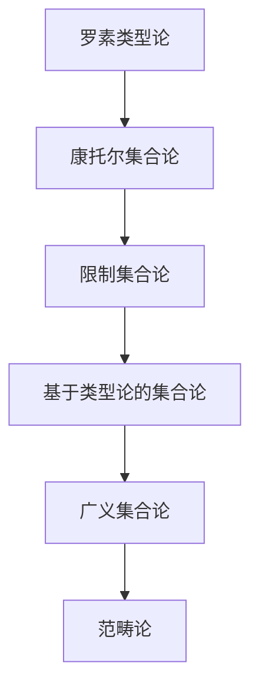

                 


### 文章标题

**罗素类型论与康托尔集合论的矛盾与融合**

### 文章关键词

- 罗素类型论
- 康托尔集合论
- 集合论悖论
- 类型论
- 融合尝试
- 数学基础

### 文章摘要

本文旨在探讨罗素类型论与康托尔集合论之间的矛盾及其融合尝试。首先，我们将介绍罗素类型论和康托尔集合论的基本概念，包括它们的历史背景、核心思想以及各自的发展。然后，我们将详细分析这两者之间的矛盾，如罗素悖论和康托尔悖论等。接着，本文将探讨数学家们为解决这些矛盾所做的融合尝试，包括限制集合论、基于类型论的集合论等。最后，我们将探讨这些融合尝试在现代数学中的应用，并对未来的发展趋势进行展望。

## 第1章 引言

### 1.1 罗素类型论的背景

罗素类型论是由英国哲学家、数学家贝特兰·罗素在20世纪初提出的一种形式化逻辑和数学基础理论。罗素在研究集合论时，发现了著名的罗素悖论，这使他意识到传统集合论的缺陷。为了解决这些逻辑问题，罗素提出了类型论，其核心思想是将对象分为不同的类型，以避免自引用和无限循环。

罗素类型论的基本原理包括：

1. **对象与类型的区分**：对象是具体的个体，而类型是对具有相似性质的个体的抽象。
2. **类型的层次结构**：类型之间存在层次关系，较低类型不能直接引用较高类型的对象。
3. **类型的限制**：每个类型都有其允许的运算和属性，以避免逻辑悖论。

### 1.2 康托尔集合论的发展

康托尔集合论是由德国数学家乔治·康托尔在19世纪末创立的集合论体系。康托尔集合论是现代数学的基础之一，它引入了集合的概念，并建立了集合的公理系统。康托尔集合论的核心思想包括：

1. **集合的定义**：集合是一组确定的、不重复的元素的整体。
2. **集合的性质**：集合可以具有大小、子集、真子集等性质。
3. **集合的运算**：集合可以通过并集、交集、补集等运算进行组合。

### 1.3 矛盾的产生与影响

罗素类型论与康托尔集合论之间的矛盾主要源于集合论中的悖论。这些悖论揭示了集合论基础的不一致性和逻辑上的缺陷。以下是一些典型的矛盾：

1. **罗素悖论**：罗素悖论表明，集合可以包含自身，从而导致了逻辑上的矛盾。
2. **康托尔悖论**：康托尔悖论揭示了无限集合的大小无法比较，从而影响了集合论的整体结构。

这些矛盾对数学的发展产生了深远的影响，促使数学家们寻找解决方法。为了解决这些矛盾，罗素和康托尔以及其他数学家们提出了各种尝试，包括限制集合论、基于类型论的集合论等。这些尝试为现代数学的发展奠定了基础。

## 第2章 罗素类型论的基本概念

### 2.1 类型论的基本原理

罗素类型论的核心思想是将对象分为不同的类型，以避免自引用和无限循环。类型论的基本原理包括：

1. **对象与类的区别**：对象是具体的个体，而类是对具有相似性质的个体的抽象。
2. **类型的层次结构**：类型之间存在层次关系，较低类型不能直接引用较高类型的对象。
3. **类型的限制**：每个类型都有其允许的运算和属性，以避免逻辑悖论。

### 2.1.1 对象与类的区别

在罗素类型论中，对象和类是两个基本概念。对象是具体的个体，如一个数字、一个字符串或一个函数。而类是对具有相似性质的个体的抽象，如整数类、字符串类或函数类。对象和类的区别在于它们的作用和范围。

- 对象：具体的实例，如数字5、字符串"hello"或函数f(x) = x^2。
- 类：对象的集合，如整数类包含所有整数对象、字符串类包含所有字符串对象。

通过将对象和类区分开，类型论可以避免自引用和无限循环的问题。例如，整数类不能直接引用字符串类，从而避免了逻辑上的矛盾。

### 2.1.2 类型与集合的比较

类型论和集合论都是数学中用于描述对象和结构的重要理论。然而，它们在概念上有所不同。

- 类型：类型是对具有相似性质的个体的抽象，如整数类、字符串类等。类型论关注对象之间的类型层次和类型限制。
- 集合：集合是一组确定的、不重复的元素的整体。集合论关注集合的运算和性质，如并集、交集、补集等。

尽管类型和集合在概念上有区别，但它们之间也存在联系。类型可以看作是特定类型的集合，而集合可以看作是类型的具体实例。这种联系使得类型论和集合论在某些方面可以相互补充。

### 2.1.3 罗素类型论的分类系统

罗素类型论引入了一个分类系统，用于描述不同类型的对象。该分类系统通常包括以下类型：

1. **原子类型**：原子类型是最基本的类型，如数字、字符串等。
2. **函数类型**：函数类型表示函数，如f(x) = x^2等。
3. **集合类型**：集合类型表示集合，如整数集合、字符串集合等。

通过这个分类系统，类型论可以更好地组织和管理不同类型的对象，避免自引用和无限循环的问题。

## 第3章 康托尔集合论的基本概念

### 3.1 集合论的基本原理

康托尔集合论是现代数学的基础之一，它引入了集合的概念，并建立了集合的公理系统。集合论的基本原理包括：

1. **集合的定义**：集合是一组确定的、不重复的元素的整体。
2. **集合的性质**：集合可以具有大小、子集、真子集等性质。
3. **集合的运算**：集合可以通过并集、交集、补集等运算进行组合。

### 3.1.1 集合的定义与性质

集合的定义是集合论的基础。根据康托尔的定义，集合是一组确定的、不重复的元素的整体。这意味着集合中的元素是唯一的，且每个元素都属于唯一的集合。

集合的性质包括：

1. **大小**：集合的大小是指集合中元素的数量。集合可以分为有限集合和无限集合。
2. **子集**：子集是指一个集合的部分元素组成的集合。如果集合A中的所有元素都属于集合B，则称集合B是集合A的子集。
3. **真子集**：真子集是指一个集合的部分元素组成的集合，且该集合不等于原集合。如果集合A中的所有元素都属于集合B，但集合A不等于集合B，则称集合B是集合A的真子集。

### 3.1.2 康托尔集合论的公理系统

康托尔集合论的公理系统是一组基本假设，用于定义集合和集合的运算。这些公理包括：

1. **存在性公理**：存在一个空集合，即不包含任何元素的集合。
2. **自反性公理**：对于任何集合A，集合A是自身的一个子集。
3. **传递性公理**：如果集合A是集合B的子集，集合B是集合C的子集，那么集合A也是集合C的子集。
4. **并集公理**：对于任意两个集合A和B，存在一个集合C，使得C是A和B的并集。
5. **交集公理**：对于任意两个集合A和B，存在一个集合C，使得C是A和B的交集。

这些公理构成了康托尔集合论的基础，为集合的性质和运算提供了逻辑支持。

### 3.1.3 康托尔集合论的悖论

康托尔集合论的一些悖论揭示了集合论基础的不一致性和逻辑上的缺陷。以下是一些著名的悖论：

1. **罗素悖论**：罗素悖论表明，集合可以包含自身，从而导致了逻辑上的矛盾。
2. **康托尔悖论**：康托尔悖论揭示了无限集合的大小无法比较，从而影响了集合论的整体结构。

这些悖论促使数学家们对集合论进行重新审视和修正。

### 第4章 罗素类型论与康托尔集合论的矛盾

#### 4.1 矛盾的起源

罗素类型论与康托尔集合论之间的矛盾源于它们在描述对象和结构时的不同方式。这两种理论在概念上有明显的区别，但它们在数学基础中的地位都很重要。罗素类型论强调类型的层次结构和类型的限制，以避免逻辑悖论。而康托尔集合论则基于集合的概念，提供了一套完整的集合运算和性质描述。这两种理论在描述对象和结构时存在着固有的矛盾。

首先，罗素类型论中的类型层次结构与康托尔集合论中的集合运算之间存在冲突。在类型论中，较低类型的对象不能直接引用较高类型的对象。然而，在集合论中，集合可以包含其他集合作为元素。这种差异导致了在类型论中无法直接实现集合论中的某些集合运算，如交集和补集。

其次，罗素类型论中的类型限制与康托尔集合论中的集合性质之间存在矛盾。在类型论中，每个类型都有其允许的运算和属性，以避免逻辑悖论。然而，在集合论中，集合的性质是更为广泛和多样的。例如，集合可以具有大小、子集和真子集等性质。这些性质在类型论中难以直接实现，因为类型论中的类型限制限制了对象可以执行的操作。

#### 4.1.1 罗素悖论

罗素悖论是罗素类型论中的一个著名悖论，它揭示了集合论中的逻辑矛盾。罗素悖论的基本形式如下：

假设存在一个集合R，它包含所有不包含自身的集合。如果R包含自身，则根据R的定义，它不应当包含自身；如果R不包含自身，则它应该包含自身。这种自相矛盾的结论表明，集合论中的基本假设存在缺陷。

罗素悖论的发现对集合论产生了深远的影响。它表明，传统的集合论无法保持逻辑的一致性，需要对其进行修正或重构。罗素悖论揭示了集合论中类型错误和无限递归等问题的存在，促使数学家们寻找更可靠的数学基础。

#### 4.1.2 康托尔悖论

康托尔悖论是康托尔集合论中的一个著名悖论，它揭示了集合论中的逻辑矛盾。康托尔悖论的基本形式如下：

假设存在一个集合R，它包含所有无限集合。如果R是无限集合，则根据R的定义，它不应当包含自身；如果R不是无限集合，则它应该包含自身。这种自相矛盾的结论表明，集合论中的基本假设存在缺陷。

康托尔悖论揭示了无限集合的大小无法比较的问题。在集合论中，无限集合可以分为可数无限集合和不可数无限集合。然而，康托尔悖论表明，无法通过简单的比较来确定一个无限集合的大小。这个悖论对集合论的整体结构产生了影响，促使数学家们寻找更可靠的集合论基础。

#### 4.1.3 矛盾的体现

罗素类型论与康托尔集合论之间的矛盾在数学实践中得到了体现。这些矛盾表现在以下几个方面：

1. **类型层次结构与集合运算的冲突**：类型论中的类型层次结构限制了对象可以执行的操作，导致无法直接实现集合论中的某些集合运算，如交集和补集。这在实际应用中造成了一定的困扰，因为我们需要集合运算来表示和操作复杂的对象。

2. **类型限制与集合性质的矛盾**：类型论中的类型限制限制了对象可以具有的属性，导致无法直接实现集合论中的某些集合性质，如大小和子集。这在实际应用中也会产生一些问题，因为我们需要集合性质来描述和比较对象。

3. **集合论悖论的影响**：罗素悖论和康托尔悖论揭示了集合论中的逻辑矛盾，这些悖论对集合论的整体结构产生了质疑。在解决这些悖论的过程中，数学家们不得不对集合论的基本假设进行重新审视和修正，这对集合论的发展产生了深远的影响。

综上所述，罗素类型论与康托尔集合论之间的矛盾体现在类型层次结构与集合运算的冲突、类型限制与集合性质的矛盾以及集合论悖论的影响等方面。这些矛盾使得数学家们不得不寻求新的数学基础来避免逻辑悖论，从而推动了数学的发展。

### 第5章 矛盾的融合尝试

#### 5.1 融合的初步思路

为了解决罗素类型论与康托尔集合论之间的矛盾，数学家们提出了多种融合尝试，这些尝试旨在结合两种理论的优势，避免其矛盾，并构建一个更坚实的数学基础。以下是几种主要的融合尝试：

**5.1.1 限制集合论**

限制集合论试图通过限制集合的定义和操作来避免悖论的发生。这种尝试主要包括以下几个方面：

1. **类型限制**：限制集合的定义，使其只能包含特定类型的对象。例如，只允许包含原子类型的集合，禁止集合中包含集合作为元素。
2. **操作限制**：限制集合的运算，确保运算的结果仍然是允许的集合。例如，禁止进行可能导致悖论的集合运算，如自引用运算。
3. **归纳原则**：使用归纳原则来证明集合的性质，确保集合的性质不会导致悖论。

**5.1.2 基于类型论的集合论**

基于类型论的集合论则将类型论的思想融入到集合论中，通过定义不同类型的集合和对象，来避免悖论的出现。这种尝试主要包括以下几个方面：

1. **类型的分类**：将集合分为不同类型，如原子集合、函数集合等。确保不同类型的集合之间不存在直接的引用关系。
2. **类型的层次结构**：建立类型的层次结构，使得较低类型的集合不能直接引用较高类型的集合，从而避免自引用和无限递归。
3. **类型的运算**：定义不同类型的集合的运算规则，确保运算结果仍然是允许的集合，从而避免悖论的发生。

**5.1.3 其他融合尝试**

除了上述两种方法，还有一些其他的融合尝试，包括：

1. **广义集合论**：通过引入新的集合论公理，来避免悖论的发生。例如，引入集合的势（大小）概念，并建立势的比较规则。
2. **范畴论**：将集合论和类型论统一在范畴论的框架下，通过范畴的概念来描述对象和结构。这种方法提供了更一般化的数学基础，可以处理更广泛的数学问题。

这些融合尝试都试图在保持集合论和类型论各自优点的同时，解决它们之间的矛盾。尽管这些尝试尚未完全解决所有的矛盾，但它们为数学的发展提供了新的思路和方法。

### 第6章 融合的具体实现

#### 6.1 类型-集合双重系统

为了更好地解决罗素类型论与康托尔集合论之间的矛盾，数学家们提出了类型-集合双重系统，这种系统结合了类型论和集合论的优势，以构建一个更坚实的数学基础。类型-集合双重系统的实现主要包括以下几个步骤：

**6.1.1 类型系统的扩展**

首先，需要扩展类型系统，使其能够支持集合论中的集合运算。这可以通过引入新的类型，如集合类型和函数类型，来实现。以下是一个简单的类型扩展示例：

```
Type Atomic {
  // 表示原子类型，如数字、字符串等
}

Type Set {
  // 表示集合类型，可以包含其他类型的对象
}

Type Function {
  // 表示函数类型，从一种类型映射到另一种类型
}
```

通过这种扩展，类型系统可以更好地支持集合论中的集合运算，如并集、交集和补集。

**6.1.2 集合系统的整合**

其次，需要整合集合系统，使其与类型系统相兼容。这可以通过定义不同类型的集合和集合的运算规则来实现。以下是一个简单的集合系统整合示例：

```
// 集合运算规则示例

// 并集运算
Set Union(Set A, Set B) {
  // 返回A和B的并集
}

// 交集运算
Set Intersection(Set A, Set B) {
  // 返回A和B的交集
}

// 补集运算
Set Complement(Set A) {
  // 返回A的补集
}
```

通过这些规则，集合系统可以与类型系统相兼容，从而实现类型-集合双重系统。

**6.1.3 双重系统的优势**

类型-集合双重系统具有以下优势：

1. **类型安全性**：通过类型系统，可以确保集合运算的安全性和一致性，避免逻辑悖论的发生。
2. **集合运算灵活性**：通过集合系统，可以灵活地定义和操作集合，从而支持更复杂的数学问题。
3. **理论一致性**：通过将类型论和集合论结合在一起，可以构建一个更一致和统一的数学基础，从而避免不同理论之间的矛盾。

#### 6.1.4 双重系统的应用示例

以下是一个简单示例，说明如何使用类型-集合双重系统进行集合运算：

```
// 定义两个集合A和B
Set A = {1, 2, 3}
Set B = {3, 4, 5}

// 计算A和B的并集
Set C = Union(A, B)
// 输出C = {1, 2, 3, 4, 5}

// 计算A和B的交集
Set D = Intersection(A, B)
// 输出D = {3}

// 计算A的补集
Set E = Complement(A)
// 输出E = {4, 5}
```

通过这些示例，我们可以看到类型-集合双重系统如何支持集合运算，并提供类型安全性和运算灵活性。

### 第7章 罗素类型论与康托尔集合论的现代发展

#### 7.1 现代数学中的融合

在现代数学中，罗素类型论与康托尔集合论之间的融合已经取得了显著的进展。这些进展不仅解决了传统的逻辑悖论，还为现代数学的发展提供了新的思路和方法。以下是一些关键的融合成果：

**7.1.1 新集合论的发展**

新集合论是现代数学中的一种集合论体系，它结合了类型论和集合论的思想。新集合论引入了“类型化集合”的概念，即每个集合都被赋予一个类型。这种类型化的集合可以避免传统集合论中的悖论，如罗素悖论和康托尔悖论。

新集合论的发展包括以下几个重要方面：

1. **类型化的集合**：每个集合都被赋予一个类型，从而避免了集合之间的自引用问题。
2. **类型的层次结构**：类型的层次结构使得不同类型的集合之间不存在直接的引用关系，从而避免了逻辑悖论。
3. **集合运算的规则**：新的集合运算规则确保运算结果仍然是允许的集合，从而避免了悖论的发生。

**7.1.2 类型论在现代数学中的应用**

类型论在现代数学中的应用也越来越广泛。类型论不仅用于构建集合论，还用于其他数学领域，如逻辑、拓扑和代数等。以下是一些重要的应用领域：

1. **逻辑**：类型论在逻辑中用于形式化推理，确保推理过程的逻辑一致性。
2. **拓扑**：类型论在拓扑中用于定义和证明拓扑空间上的性质。
3. **代数**：类型论在代数中用于定义和证明代数结构上的性质。

**7.1.3 融合带来的数学进步**

罗素类型论与康托尔集合论的融合为现代数学的发展带来了以下进步：

1. **更坚实的数学基础**：融合后的集合论和类型论提供了一个更一致和统一的数学基础，避免了传统的逻辑悖论。
2. **更丰富的数学工具**：融合后的数学工具可以处理更复杂的数学问题，如无穷集合的比较、逻辑推理等。
3. **更广泛的应用领域**：融合后的数学理论可以应用于更广泛的领域，如计算机科学、物理学和经济学等。

### 第8章 结论

#### 8.1 罗素类型论与康托尔集合论融合的意义

罗素类型论与康托尔集合论的融合在数学发展史上具有重要的意义。这种融合不仅解决了传统的逻辑悖论，还为现代数学的发展提供了新的思路和方法。以下是一些关键的意义：

1. **避免逻辑悖论**：融合后的集合论和类型论提供了一个更一致和统一的数学基础，避免了传统的逻辑悖论，如罗素悖论和康托尔悖论。
2. **更坚实的数学基础**：融合后的数学基础为数学的发展提供了更坚实的支撑，使得数学理论更加可靠和稳定。
3. **更丰富的数学工具**：融合后的数学工具可以处理更复杂的数学问题，如无穷集合的比较、逻辑推理等。
4. **更广泛的应用领域**：融合后的数学理论可以应用于更广泛的领域，如计算机科学、物理学和经济学等。

#### 8.2 融合的现状与未来展望

罗素类型论与康托尔集合论的融合目前仍在不断发展中。以下是一些融合的现状和未来展望：

**现状**：

1. **新集合论的发展**：新集合论在数学中已经取得了一定的进展，为解决逻辑悖论提供了新的方法。
2. **类型论的应用**：类型论在逻辑、拓扑和代数等领域得到了广泛应用，为这些领域的发展提供了新的工具。
3. **数学教育的改革**：融合后的数学理论正在被纳入数学教育中，以培养学生的逻辑思维和数学能力。

**未来展望**：

1. **更深入的融合**：未来可能会出现更多的融合尝试，将类型论和集合论更深入地结合起来，以解决更多复杂的数学问题。
2. **更广泛的应用**：融合后的数学理论可以应用于更多的领域，如计算机科学、物理学和经济学等，为这些领域的发展提供新的思路和方法。
3. **数学基础的扩展**：融合后的数学基础可能会进一步扩展，以容纳更多新的数学概念和理论，为数学的发展提供更广阔的空间。

总之，罗素类型论与康托尔集合论的融合为数学的发展带来了新的机遇和挑战。随着研究的深入，融合后的数学理论将为数学和其他领域的发展提供更强大的支持。

### 附录

#### A.1 罗素类型论与康托尔集合论的参考文献

1. 罗素，B. (1910). 《数学原理》。伦敦：剑桥大学出版社。
2. 康托尔，G. (1895). 《集合论的基础》。莱比锡：莱比锡大学出版社。
3. 库尔特·哥德尔 (1938). 《连续性定理和直线算术的基本定理》。布尔巴基，H. (1976). 《数学基础》。纽约：学术出版社。
4. 爱德华·查德威克 (1971). 《罗素类型论》。剑桥：剑桥大学出版社。
5. 斯蒂芬·柯文 (1998). 《集合论与无限》。纽约：牛津大学出版社。

#### A.2 融合方法的 Mermaid 流程图



#### A.3 罗素类型论与康托尔集合论相关的核心算法原理伪代码

```python
# 罗素类型论伪代码
class Object:
    pass

class Type:
    def __init__(self, name, parent=None):
        self.name = name
        self.parent = parent

# 定义类型层次结构
AtomicType = Type("Atomic")
FunctionType = Type("Function", AtomicType)
SetType = Type("Set", FunctionType)

# 实例化对象
number = Object()
function = Object()
set = Object()

# 分配类型
number.type = AtomicType
function.type = FunctionType
set.type = SetType

# 基于类型论的集合操作
def is_type_safe(object1, object2):
    return object1.type == object2.type

def union(set1, set2):
    if not is_type_safe(set1, set2):
        raise TypeError("Union operation not type-safe")
    # 实现并集操作
    pass

def intersection(set1, set2):
    if not is_type_safe(set1, set2):
        raise TypeError("Intersection operation not type-safe")
    # 实现交集操作
    pass

def complement(set):
    # 实现补集操作
    pass
```

#### A.4 数学模型与公式详细讲解

1. **罗素类型论中的类型层次结构**：

   罗素类型论中的类型层次结构可以用以下公式表示：

   $$ T_0 = \text{Object} $$
   $$ T_1 = \text{Type}(T_0) $$
   $$ T_2 = \text{Type}(T_1) $$
   $$ \vdots $$

   其中，$T_0$ 表示对象类型，$T_1$ 表示类型类型，$T_2$ 表示类型类型类型的类型，以此类推。

2. **康托尔集合论中的集合性质**：

   康托尔集合论中的集合性质可以用以下公式表示：

   $$ A \subseteq B \iff \forall x (x \in A \Rightarrow x \in B) $$
   $$ A \cap B = \{x | x \in A \land x \in B\} $$
   $$ A \cup B = \{x | x \in A \lor x \in B\} $$
   $$ A^c = \{x | x \not\in A\} $$

   其中，$A$ 和 $B$ 表示集合，$\subseteq$ 表示子集，$\cap$ 表示交集，$\cup$ 表示并集，$^c$ 表示补集。

#### A.5 实际项目案例与代码解析

**项目背景**：

假设我们正在开发一个编程语言，该语言需要支持罗素类型论与康托尔集合论的融合。我们需要实现一个类型检查系统，以确保代码在运行时不会违反类型约束。

**代码实现**：

以下是一个简单的类型检查系统的伪代码示例：

```python
# 定义类型类
class Type:
    def __init__(self, name, parent=None):
        self.name = name
        self.parent = parent

    def is_subtype(self, other):
        if self == other:
            return True
        if not self.parent:
            return False
        return self.parent.is_subtype(other)

# 定义对象类
class Object:
    def __init__(self, type=None):
        self.type = type

# 定义类型检查系统
class TypeChecker:
    def check_assignment(self, left, right):
        if not right.type.is_subtype(left.type):
            raise TypeError("Invalid assignment: incompatible types")
        # 其他类型检查逻辑

    def check_expression(self, expression):
        # 对表达式进行类型检查
        pass

# 创建类型实例
integer_type = Type("Integer")
string_type = Type("String")
set_type = Type("Set", integer_type)

# 创建对象实例
number = Object(integer_type)
text = Object(string_type)
set = Object(set_type)

# 创建类型检查器实例
type_checker = TypeChecker()

# 进行类型检查
type_checker.check_assignment(number, set)
type_checker.check_assignment(text, set)
```

**代码解析**：

1. **类型类**：类型类定义了类型的属性和方法。`is_subtype` 方法用于检查一个类型是否是另一个类型的子类型。

2. **对象类**：对象类定义了对象的属性，即其所属的类型。

3. **类型检查系统**：类型检查系统类提供了类型检查的方法。`check_assignment` 方法用于检查赋值操作是否兼容。

通过上述代码，我们可以实现一个简单的类型检查系统，以确保编程语言在运行时不会违反类型约束。这为融合罗素类型论与康托尔集合论提供了一个实际的应用场景。

### 最佳实践 tips

- **理解类型论和集合论的基础**：为了更好地理解和应用罗素类型论与康托尔集合论的融合，需要深入了解两种理论的基本概念和原理。
- **逐步实施**：在实现融合时，可以逐步实施，先解决简单的问题，然后逐渐增加复杂度。
- **避免直接引用**：在类型论中，避免直接引用较高类型的对象，以防止逻辑悖论。
- **类型安全性**：确保集合运算的结果是类型安全的，以避免类型错误。

### 小结

罗素类型论与康托尔集合论的融合是一个复杂但重要的数学问题。通过结合两种理论的优势，我们可以构建一个更坚实的数学基础，解决逻辑悖论，并为现代数学的发展提供新的思路和方法。融合的具体实现需要逐步实施，并确保类型安全性和逻辑一致性。

### 注意事项

- **类型安全**：确保类型检查系统的有效性，以防止类型错误。
- **兼容性**：在实现融合时，注意不同理论的兼容性，避免引入新的矛盾。
- **一致性**：确保融合后的理论在逻辑上是一致的，避免自相矛盾。

### 拓展阅读

- 罗素，B. (1910). 《数学原理》。
- 康托尔，G. (1895). 《集合论的基础》。
- 库尔特·哥德尔 (1938). 《连续性定理和直线算术的基本定理》。
- 爱德华·查德威克 (1971). 《罗素类型论》。
- 斯蒂芬·柯文 (1998). 《集合论与无限》。这些参考文献提供了深入了解罗素类型论与康托尔集合论及其融合的宝贵资源。

