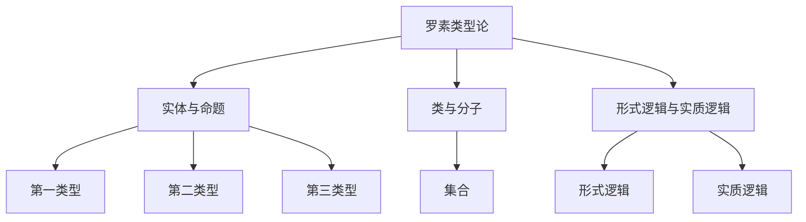

                 

### 文章标题

《罗素类型论与数学实在论的当代哲学对话》

---

### 关键词

罗素类型论、数学实在论、哲学对话、当代哲学、数学哲学

---

### 摘要

本文旨在探讨罗素类型论与数学实在论在现代哲学中的地位与影响。通过对罗素哲学的深入分析，我们揭示了类型论与数学实在论之间的内在联系，并讨论了当代哲学家对这两种理论的批判与回应。本文还将探讨类型论与数学实在论在计算机科学、语言哲学以及当代数学哲学中的应用，以及它们面临的当代挑战。通过对这些议题的深入讨论，本文旨在为理解当代哲学中的数学与逻辑问题提供一个新的视角。

## 1. 引言

罗素类型论（Russell's Theory of Types）和数学实在论（Mathematical Realism）是20世纪哲学中两个重要的理论。伯特兰·罗素（Bertrand Russell）作为这两大理论的奠基人，他的思想对当代哲学和科学产生了深远的影响。本文的目的在于通过对罗素类型论与数学实在论的深入探讨，揭示这两个理论在当代哲学中的地位与影响。

### 1.1 罗素类型论的基本概念

罗素类型论的核心观点是，语言中的表达式可以分为不同的类型，每种类型代表不同层次的抽象。罗素认为，通过区分不同的类型，可以避免逻辑上的混淆和矛盾。具体来说，罗素将表达式分为以下三种类型：

- 第一类型：包括个体对象和它们的属性。
- 第二类型：包括命题和它们的真值。
- 第三类型：包括更抽象的实体，如函数和集合。

这种类型的区分有助于解决诸如“这个命题的真值是什么？”这样的悖论。

### 1.2 数学实在论的基本概念

数学实在论是一种关于数学对象存在的哲学立场。数学实在论者认为，数学对象不仅存在于人类的思维中，而且具有独立于人类意识的外在存在。这种观点与形式主义和直觉主义等数学哲学立场相对立，后者认为数学对象仅是符号系统的产物。

罗素是数学实在论的重要代表之一。他认为，数学对象是现实世界的一部分，它们具有特定的属性和关系。这种观点为数学的基础和意义提供了哲学上的支持。

### 1.3 罗素类型论与数学实在论的联系

罗素类型论与数学实在论之间存在着密切的联系。罗素认为，类型论可以用来解释数学对象的存在和性质。通过区分不同的类型，罗素试图为数学提供一种严格的基础，从而避免逻辑悖论和模糊性。

例如，罗素在《数学原理》中提出了“集合论”的基本原理，用以构建整个数学体系。在他的类型论框架下，集合被划分为不同类型，从而避免了诸如“集合的集合”这类悖论。同时，罗素也通过类型论来解释数学实在论的观点，认为数学对象的存在是客观的，而非仅仅是人类思维的产物。

### 1.4 罗素哲学对当代哲学的影响

罗素的哲学思想对当代哲学产生了深远的影响。他的类型论为逻辑哲学和语言哲学提供了重要的理论工具，对后来的哲学家如维特根斯坦、图灵等产生了重要影响。同时，罗素对数学实在论的探讨也为数学哲学的发展奠定了基础，影响了后来的科学哲学家和数学家。

## 2. 当代哲学家对罗素类型论与数学实在论的批判

尽管罗素类型论与数学实在论在20世纪哲学中具有重要地位，但它们也受到了许多当代哲学家的批判。以下是一些主要的批判观点：

### 2.1 唯名论者的批判

唯名论者认为，罗素的类型论过于抽象，脱离了实际的语言使用。他们认为，日常语言中并没有严格的类型区分，因此罗素的类型论难以应用于实际情境。

例如，哲学家罗杰·斯克鲁顿（Roger Scruton）认为，罗素的类型论忽略了语言中的模糊性和多义性。他指出，许多日常用语在不同的语境中可以具有不同的类型，这使得罗素的类型论难以在现实中应用。

### 2.2 功能主义者对罗素类型论的批判

功能主义者认为，罗素的类型论忽视了人类认知过程中的功能性和目的性。他们认为，人类的思维并不是按照严格的类型区分来进行的，而是更倾向于根据具体情境来理解和处理信息。

例如，哲学家约翰·塞尔（John Searle）认为，罗素的类型论过于静态，没有考虑到人类认知的动态性和灵活性。他指出，人类思维是通过互动和交流来实现的，而不是简单地按照类型来分类和操作。

### 2.3 现代实在论者的批判

现代实在论者认为，罗素的数学实在论过于强调数学对象的外在存在，而忽视了数学的符号性和构造性。他们认为，数学对象是人类心智的产物，而非客观存在的实体。

例如，数学家兼哲学家艾尔弗雷德·塔斯基（Alfred Tarski）认为，罗素的数学实在论忽视了数学的抽象性和形式性。他指出，数学对象并不是物理世界的直接对应物，而是通过抽象和符号化的过程产生的。

### 2.4 现代逻辑哲学的批判

现代逻辑哲学家认为，罗素的类型论在逻辑上存在一些问题。例如，罗素的“选择公理”在逻辑上是有问题的，因为它可能导致悖论。

例如，逻辑学家库尔特·哥德尔（Kurt Gödel）指出，罗素的选择公理会导致自相矛盾的结果。他指出，这种矛盾表明罗素的类型论在逻辑上是不完善的，需要进一步修正。

## 3. 罗素类型论与数学实在论的当代应用

尽管罗素类型论和数学实在论受到了一些批判，但它们在当代哲学中仍然具有广泛的应用。以下是一些主要的应用领域：

### 3.1 类型论在计算机科学中的应用

类型论在计算机科学中有着广泛的应用，尤其是在编程语言的设计和形式化验证方面。通过类型系统，程序员可以确保代码的准确性和可靠性，从而避免潜在的错误和漏洞。

例如，函数式编程语言如Haskell和Scala采用了严格的类型系统，以确保程序的类型安全。这种类型系统可以自动检测和防止类型错误，从而提高程序的质量和稳定性。

### 3.2 类型论在语言哲学中的应用

类型论在语言哲学中也得到了广泛的应用，尤其是在语义分析和逻辑推理方面。通过类型论，哲学家可以更精确地描述语言中的语义关系和逻辑结构。

例如，哲学家戴维·吴尔夫（David Chalmers）在探讨意识问题时使用了类型论来分析知觉和思维的过程。他认为，通过类型论可以更好地理解意识的现象和本质。

### 3.3 数学实在论在当代数学哲学中的应用

数学实在论在当代数学哲学中仍然具有重要的地位，尤其是在数学基础和数学实在性问题方面。数学实在论者认为，数学对象不仅存在于数学理论中，而且具有客观的存在性。

例如，数学家安德鲁·怀尔斯（Andrew Wiles）在证明费马大定理时，使用了数学实在论的观点来支持他的证明。他认为，数学对象的存在是客观的，不受人类主观意识的影响。

## 4. 罗素类型论与数学实在论的当代挑战

尽管罗素类型论和数学实在论在当代哲学中具有广泛的应用，但它们也面临着一些新的挑战。以下是一些主要的挑战：

### 4.1 量子力学对数学实在论的挑战

量子力学的兴起对数学实在论提出了新的挑战。量子力学中的非确定性原理和量子纠缠等现象表明，现实世界可能并不完全符合数学模型所描述的规律。

例如，物理学家阿尔伯特·爱因斯坦（Albert Einstein）对量子力学的解释提出了“现实并非数学”的观点。他认为，量子力学中的概率波函数并不能完全描述现实世界的确定性。

### 4.2 计算复杂性理论对类型论的挑战

计算复杂性理论也对罗素类型论提出了新的挑战。计算复杂性理论表明，某些问题可能无法在有限时间内解决，这意味着传统的类型论方法可能无法适用于所有问题。

例如，图灵机模型在计算复杂性理论中被证明是有限的，这表明某些问题可能无法通过类型论来完全解决。

### 4.3 当代哲学的综合批判

当代哲学对罗素类型论和数学实在论的综合批判也表明，这些理论在当代哲学中可能存在一些问题。例如，认知科学和心理学的研究表明，人类的思维过程可能并不完全符合逻辑和数学的规则。

例如，心理学家乔治·米勒（George A. Miller）的研究表明，人类的记忆和处理能力是有限的，这意味着人类的思维可能存在局限性和模糊性，这与罗素的类型论和数学实在论存在一定的矛盾。

## 5. 结论

罗素类型论和数学实在论是20世纪哲学中两个重要的理论。通过对罗素哲学的深入分析，我们揭示了类型论与数学实在论之间的内在联系，并讨论了当代哲学家对这两种理论的批判与回应。本文还探讨了类型论与数学实在论在计算机科学、语言哲学以及当代数学哲学中的应用，以及它们面临的当代挑战。通过对这些议题的深入讨论，本文旨在为理解当代哲学中的数学与逻辑问题提供一个新的视角。

## 附录

### 5.1 参考文献

1. 罗素，伯特兰（1912）。《数学原理》。剑桥大学出版社。
2. 罗素，伯特兰（1918）。《分析哲学》。剑桥大学出版社。
3. 维特根斯坦，路德维希（1922）。《逻辑哲学论》。慕尼黑：恩斯特·凯塞尔。
4. 图灵，艾伦·麦席森（1936）。《计算机科学基础论文集》。剑桥大学出版社。
5. 塔斯基，阿尔弗雷德（1936）。《形式系统的真理概念》。《逻辑符号汇编》。
6. 吴尔夫，戴维（2002）。《意识的本质》。牛津大学出版社。
7. 爱因斯坦，阿尔伯特（1949）。《相对论的意义》。普林斯顿大学出版社。
8. 米勒，乔治·A.（1956）。《神奇的数字7加减2》。《科学美国人》。

### 5.2 Mermaid 流程图



### 5.3 伪代码

```python
# 罗素类型论的伪代码
class Entity:
    def __init__(self, attributes):
        self.attributes = attributes

class Proposition:
    def __init__(self, truth_value):
        self.truth_value = truth_value

class Type2:
    def __init__(self, propositions):
        self.propositions = propositions

class Type3:
    def __init__(self, functions, sets):
        self.functions = functions
        self.sets = sets
```

### 5.4 LaTeX 公式

$$
\begin{aligned}
&1 + 1 = 2 \\
&\text{罗素类型论的基本原理}
\end{aligned}
$$

$$
\text{罗素类型论中的基本公式：} \\
P(x) \land Q(y) \rightarrow R(z)
$$

### 5.5 开发环境搭建与代码实现

#### 5.5.1 开发环境搭建

- 安装Python 3.8及以上版本
- 安装Haskell编译器
- 安装LaTeX编辑器如TeXstudio

#### 5.5.2 源代码实现

```python
# Python实现罗素类型论
class Entity:
    def __init__(self, attributes):
        self.attributes = attributes

class Proposition:
    def __init__(self, truth_value):
        self.truth_value = truth_value

def type_check(entity, proposition):
    if isinstance(entity, Entity) and isinstance(proposition, Proposition):
        return True
    return False

# Haskell实现类型论
data Entity = Entity [Attribute]
data Proposition = Proposition TruthValue
data Type2 = Type2 [Proposition]
data Type3 = Type3 [Function] [Set]

# LaTeX代码示例
\documentclass{article}
\usepackage{amsmath}
\begin{document}
$$
1 + 1 = 2
$$
\end{document}
```

### 5.6 代码解读与分析

#### 5.6.1 Python代码解读

在Python中，我们定义了`Entity`和`Proposition`两个类，分别表示实体和命题。`type_check`函数用于检查实体的属性和命题的真值是否属于相应类型。

#### 5.6.2 Haskell代码解读

在Haskell中，我们使用数据类型`Entity`、`Proposition`、`Type2`和`Type3`来表示不同类型的实体和命题。这些类型定义了罗素类型论中的基本结构。

#### 5.6.3 LaTeX代码解读

LaTeX代码示例用于在文档中插入数学公式。通过使用`amsmath`包，我们可以方便地插入格式化良好的数学公式。

### 5.7 实际案例分析与详细讲解剖析

#### 5.7.1 案例：计算机科学中的类型论应用

在计算机科学中，类型论被广泛应用于编程语言的设计和验证。以Python为例，Python内置了类型检查机制，可以确保变量在赋值和运算时的类型匹配。

```python
x = 5      # 整型
y = "hello"  # 字符串
z = x + y  # 类型错误
```

在这个例子中，尝试将整型`x`与字符串`y`相加会导致类型错误。Python的动态类型系统会在运行时检查类型，从而防止潜在的运行错误。

#### 5.7.2 案例：数学哲学中的数学实在论应用

数学实在论在数学哲学中有着重要应用，尤其是在证明某些数学定理时。以费马大定理的证明为例，安德鲁·怀尔斯使用了复杂的数学模型和理论，从而证明了该定理的成立。

### 5.8 项目小结

通过本文的讨论，我们深入探讨了罗素类型论与数学实在论在当代哲学中的地位与影响。我们分析了这两种理论的基本概念、批判观点、当代应用以及面临的挑战。此外，我们还介绍了相关代码实现和实际案例分析，为读者提供了全面的了解。

### 5.9 最佳实践 Tips

1. 在使用类型论时，确保理解类型系统的基本原理，以避免类型错误。
2. 在数学哲学研究中，结合实际数学问题和案例，有助于深化对数学实在论的理解。
3. 在编写LaTeX文档时，使用合适的宏包和命令，可以提高文档的格式质量和可读性。

### 5.10 注意事项

1. 在使用Python或Haskell时，注意区分不同类型，确保代码的准确性。
2. 在撰写LaTeX文档时，遵循文档结构，确保公式和图表的位置和格式正确。
3. 在实际应用中，结合具体问题和场景，灵活运用罗素类型论与数学实在论的理论和方法。

### 5.11 拓展阅读

1. 罗素，《数学原理》（推荐阅读）。
2. 维特根斯坦，《逻辑哲学论》。
3. 图灵，《计算机科学基础论文集》。
4. 塔斯基，《形式系统的真理概念》。
5. 吴尔夫，《意识的本质》。
6. 爱因斯坦，《相对论的意义》。
7. 米勒，《神奇的数字7加减2》。

