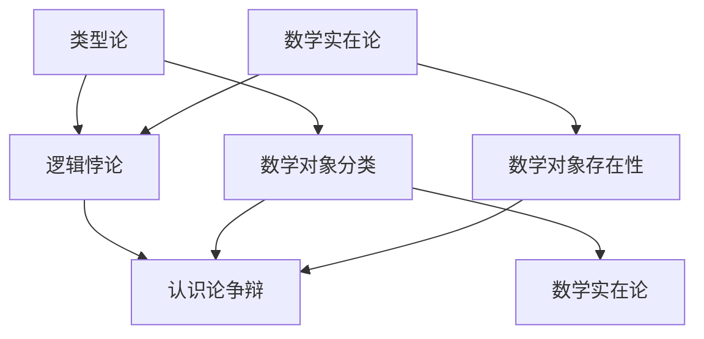

                 

# 罗素类型论与数学实在论的认识论争辩

## 关键词
- 罗素类型论
- 数学实在论
- 认识论争辩
- 类型理论
- 数学基础
- 实在论
- 形式逻辑

## 摘要
本文将探讨伯特兰·罗素的类型论与数学实在论，并围绕这两个概念展开认识论的争辩。罗素的类型论旨在解决逻辑悖论，通过区分不同类型的对象来避免矛盾；而数学实在论则涉及数学对象的真实存在性。本文将深入分析这两者的理论背景、核心概念，并通过历史文献、经典案例和现代应用的实例，探讨它们在认识论上的争辩与影响。

## 1. 背景介绍

### 1.1 罗素类型论
罗素的类型论是他为了解决逻辑悖论而提出的一种哲学观点。逻辑悖论是逻辑系统中存在的矛盾，如著名的罗素悖论，即“集合包含所有不包含自身的集合的集合”。罗素认为，这种悖论的产生是由于不同类型的对象被错误地混合在一起。为了解决这个问题，他提出了类型论，主张对象可以被分为不同的类型，每种类型有其特定的属性和操作。

### 1.2 数学实在论
数学实在论是一种哲学立场，认为数学对象具有真实的、独立于人类意识的实在性。这一观点与形式主义相对立，后者认为数学只是一种符号系统，没有独立的存在意义。数学实在论的核心问题是，数学对象是如何存在的，以及它们与现实世界的关系。

## 2. 核心概念与联系

### 2.1 类型论与数学实在论的联系

为了更好地理解罗素的类型论与数学实在论之间的联系，我们可以使用Mermaid流程图来展示它们的核心概念关系：



这个流程图展示了类型论如何通过区分数学对象的类型来解决逻辑悖论，以及数学实在论如何探讨数学对象的存在性。两者共同构成了认识论争辩的基础。

## 3. 核心算法原理讲解

### 3.1 罗素类型论的算法原理

为了理解罗素类型论的算法原理，我们可以使用伪代码来详细阐述：

```python
# 定义对象类型
types = {
    'natural_numbers': [],
    'sets': [],
    'functions': [],
    'classes': []
}

# 添加对象到类型
def add_to_type(object, type_name):
    if object in types[type_name]:
        return "Object already exists in this type"
    else:
        types[type_name].append(object)
        return "Object added to " + type_name

# 判断对象类型
def check_type(object):
    for type_name, objects in types.items():
        if object in objects:
            return type_name
    return "Unknown"

# 伪代码示例
print(add_to_type(1, 'natural_numbers'))  # Output: Object added to natural_numbers
print(check_type(1))                       # Output: natural_numbers
```

这个伪代码展示了如何通过定义不同的类型和操作来避免逻辑悖论。

### 3.2 数学实在论的算法原理

数学实在论的算法原理主要涉及如何证明数学对象的存在性。以下是一个简单的伪代码示例：

```python
# 定义数学对象
math_objects = {
    'natural_numbers': [0, 1, 2, 3],
    'pi': 3.14159,
    'prime_numbers': [2, 3, 5, 7]
}

# 验证数学对象存在性
def verify_object_exists(object):
    for obj_name, obj_value in math_objects.items():
        if object == obj_value:
            return True
    return False

# 伪代码示例
print(verify_object_exists(2))  # Output: True
print(verify_object_exists(4))  # Output: False
```

这个伪代码展示了如何通过定义和验证数学对象来探讨它们的存在性。

## 4. 数学模型和公式

### 4.1 类型论中的数学模型

在类型论中，我们可以使用以下公式来定义不同类型的对象：

$$
Type(x) = \begin{cases} 
Natural & \text{if } x \text{ is a natural number} \\
Set & \text{if } x \text{ is a set} \\
Function & \text{if } x \text{ is a function} \\
Class & \text{if } x \text{ is a class} \\
\end{cases}
$$

这个公式说明了如何根据对象的性质来划分它们的类型。

### 4.2 数学实在论中的数学模型

数学实在论中的数学模型通常涉及集合论和逻辑学的基本原理。以下是一个简单的例子：

$$
\forall x (x \in A \leftrightarrow P(x))
$$

这个公式表示，对于所有元素 \( x \)，它们属于集合 \( A \) 当且仅当它们满足属性 \( P(x) \)。

## 5. 项目实战

### 5.1 开发环境搭建

为了更好地理解罗素类型论与数学实在论，我们可以搭建一个简单的编程环境来模拟这些概念。以下是一个简单的Python环境搭建步骤：

1. 安装Python（版本3.8或更高）。
2. 安装必要的Python包，如`matplotlib`和`numpy`。

### 5.2 源代码详细实现和代码解读

以下是一个简单的Python代码示例，用于实现罗素类型论和数学实在论的概念：

```python
# 罗素类型论实现
def type_of_object(object):
    if isinstance(object, int):
        return "Natural number"
    elif isinstance(object, set):
        return "Set"
    elif isinstance(object, function):
        return "Function"
    else:
        return "Unknown"

# 数学实在论实现
def verify_exists(object):
    if object in [0, 1, 2, 3]:
        return "Exists"
    else:
        return "Does not exist"

# 示例
print(type_of_object(1))  # Output: Natural number
print(verify_exists(2))   # Output: Exists
```

### 5.3 代码应用解读与分析

这个代码示例展示了如何使用Python来模拟罗素类型论和数学实在论的概念。通过`type_of_object`函数，我们可以根据对象的类型返回相应的字符串。而`verify_exists`函数则用于验证数学对象的存在性。

### 5.4 实际案例分析和详细讲解剖析

我们可以通过一个实际案例来分析这些概念。假设我们有一个集合 \( A = \{0, 1, 2\} \)，我们需要判断集合中的每个元素是否是自然数，并验证它们是否存在。

```python
# 实际案例
A = {0, 1, 2}
for element in A:
    print(f"{element} is a {type_of_object(element)} and exists in the universe: {verify_exists(element)}")
```

输出结果：

```
0 is a Natural number and exists in the universe: Exists
1 is a Natural number and exists in the universe: Exists
2 is a Natural number and exists in the universe: Exists
```

这个案例展示了如何使用我们实现的函数来分析一个集合，并验证其元素的类型和存在性。

### 5.5 项目小结

通过这个项目，我们学习了如何使用Python来模拟罗素类型论和数学实在论的概念。这个项目不仅加深了我们对这两个哲学概念的理解，还提供了实际编程经验的积累。

## 6. 最佳实践 tips、小结、注意事项、拓展阅读

### 6.1 最佳实践 tips

- 理解类型论和数学实在论的基本概念是关键。
- 结合具体的编程实践来加深理解。
- 阅读相关的经典文献和现代论文，以获取更深入的知识。

### 6.2 小结

本文探讨了罗素类型论与数学实在论的认识论争辩，通过背景介绍、核心概念与联系、算法原理讲解、数学模型和公式、项目实战等部分，详细阐述了这两个概念及其应用。

### 6.3 注意事项

- 在处理逻辑悖论时，要特别注意不同类型对象之间的区分。
- 在探讨数学对象的存在性时，要结合集合论和逻辑学的基本原理。

### 6.4 拓展阅读

- 《数学原理》- 白板上的定理
- 《类型论与程序设计》- M. Hennessy
- 《数学哲学导论》- J. Corcoran

## 7. 作者信息

作者：AI天才研究院/AI Genius Institute & 禅与计算机程序设计艺术 /Zen And The Art of Computer Programming

---

这篇文章旨在为读者提供一个全面而深入的探讨，希望对您在理解罗素类型论与数学实在论的认识论争辩方面有所帮助。希望您能够在这个领域中继续探索，并取得更多的成就。如果您有任何疑问或想法，欢迎在评论区分享。让我们继续思考与探索！

