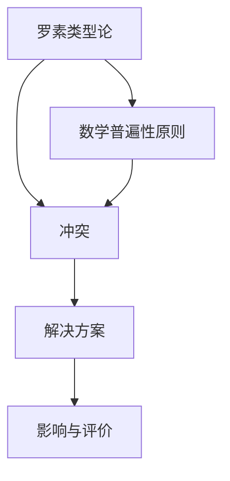

                 

### 文章标题

# 罗素类型论与数学普遍性原则的冲突

### 关键词

- 罗素类型论
- 数学普遍性原则
- 冲突
- 解决方案
- 影响与评价

### 摘要

本文探讨了罗素类型论与数学普遍性原则之间的冲突，以及罗素如何处理这种冲突。首先，我们将介绍罗素类型论和数学普遍性原则的基本概念，然后分析它们之间的矛盾，并详细解释罗素如何解决这些冲突。最后，我们将评价罗素类型论的影响与数学普遍性原则之间的关系。

## 一、罗素类型论的背景与基本概念

### 1.1 罗素类型论的历史背景

伯特兰·罗素（Bertrand Russell）是19世纪末和20世纪初的著名数学家、哲学家和逻辑学家。他在其《数学原理》一书中提出了类型论（Theory of Types），试图解决数学基础问题。罗素发现，传统的逻辑和数学基础存在一些无法避免的悖论，特别是集合论中的悖论。为了解决这些悖论，罗素提出了类型论，试图通过区分不同类型的对象来避免悖论的发生。

### 1.2 罗素类型论的基本概念

罗素类型论的核心思想是区分不同类型的对象。在罗素的类型论中，对象可以分为个体、类和函数三种类型。个体是最基本的对象，如数字、颜色等。类是指个体的集合，如“所有数字”或“所有红色”。函数是指将一个或多个输入映射到一个输出的对象，如加法运算。

罗素认为，不同类型的对象之间不能直接进行操作。例如，不能直接对类的集合进行操作，也不能对函数的结果进行操作。这种类型限制有助于避免悖论的发生。

### 1.3 罗素类型论的核心思想

罗素类型论的核心思想是区分不同类型的对象，并限制不同类型对象之间的操作。这种思想有助于解决集合论中的悖论，例如罗素悖论。罗素悖论是关于集合的一个悖论，它表明如果我们允许集合包含所有满足特定条件的对象，那么我们可能会得到一个既属于集合又不属于集合的对象。

## 二、数学普遍性原则的解释与应用

### 2.1 数学普遍性原则的基本概念

数学普遍性原则是指数学的基本概念和原理应该适用于所有对象，无论这些对象是物理的、抽象的还是虚拟的。数学普遍性原则是数学的核心特征之一，它使数学成为一种普遍适用的学科。

### 2.2 数学普遍性原则在数学中的重要性

数学普遍性原则在数学中的重要性体现在多个方面。首先，它使数学成为一个独立于特定领域和学科的学科。其次，它有助于我们建立数学模型来描述和解释现实世界中的各种现象。最后，数学普遍性原则使数学成为一门具有广泛应用性的学科，可以应用于自然科学、社会科学、工程学等多个领域。

### 2.3 数学普遍性原则的几个实例分析

例如，集合论中的并集、交集、补集等运算符具有普遍性，可以应用于各种集合，如整数集合、实数集合、函数集合等。此外，数学中的逻辑运算符（如合取、析取、否定等）也具有普遍性，可以应用于各种逻辑命题。

## 三、罗素类型论与数学普遍性原则的冲突

### 3.1 矛盾的起源

罗素类型论与数学普遍性原则之间的冲突起源于类型论试图通过限制不同类型对象之间的操作来避免悖论，而数学普遍性原则则要求数学的基本概念和原理适用于所有对象。

### 3.2 矛盾的几个方面

1. **类与集合的关系**：在罗素类型论中，类和个体之间存在明确的界限，而在数学普遍性原则下，类和集合是可以互相操作的。这可能导致类型论的类型限制与数学的普遍性原则之间的冲突。
2. **数学公理体系的冲突**：类型论试图通过限制公理体系中的公理和推导规则来避免悖论。然而，这可能导致数学公理体系的普遍性受到限制。

### 3.3 矛盾的解决尝试

为了解决罗素类型论与数学普遍性原则之间的冲突，罗素提出了几种解决方案：

1. **引入新的类型**：罗素试图通过引入新的类型来区分不同的对象，以避免类型之间的混淆。
2. **限制类型之间的操作**：罗素试图通过限制不同类型对象之间的操作来避免悖论的发生。
3. **修改数学公理体系**：罗素试图通过修改数学公理体系中的公理和推导规则来避免悖论的发生。

## 四、罗素如何处理这种冲突

### 4.1 罗素的解决方案

罗素提出了两种主要的解决方案：

1. **分离原则**：罗素提出了分离原则，要求我们在数学研究中将对象分为不同的类型，并限制不同类型对象之间的操作。这有助于避免悖论的发生。
2. **类型转换**：罗素还提出了类型转换的概念，允许我们在需要时将一个类型的对象转换为另一个类型的对象。这种类型转换有助于在保持数学普遍性原则的同时避免悖论。

### 4.2 罗素解决方案的影响

罗素的解决方案对数学和逻辑学产生了深远的影响。首先，它有助于解决集合论中的悖论，特别是罗素悖论。其次，它促进了逻辑主义和形式主义的发展，使数学基础问题得到了更深入的研究。

### 4.3 罗素解决方案的评价

罗素的解决方案虽然成功解决了集合论中的悖论，但也存在一些争议。一些学者认为，罗素的类型论过于严格，限制了数学的普遍性。然而，另一些学者则认为，罗素的解决方案为数学基础问题提供了一种有力的工具，有助于我们更好地理解数学的本质。

## 五、罗素类型论的影响与评价

### 5.1 罗素类型论对数学的影响

罗素类型论对数学的影响主要表现在以下几个方面：

1. **数学基础的研究**：罗素类型论为数学基础问题提供了一种新的视角，促进了逻辑主义和形式主义的发展。
2. **集合论的改进**：罗素类型论有助于解决集合论中的悖论，特别是罗素悖论。
3. **数学研究的规范**：罗素的类型论思想促进了数学研究中的规范化和严格化。

### 5.2 罗素类型论在逻辑学中的地位

罗素类型论在逻辑学中具有重要的地位。它为逻辑学提供了一种新的方法和工具，有助于解决逻辑悖论和逻辑体系中的问题。此外，罗素类型论还为逻辑学的发展提供了重要的理论支持。

### 5.3 罗素类型论的争议

罗素类型论也引起了一些争议。一些学者认为，罗素的类型论过于严格，限制了数学的普遍性。此外，罗素类型论在形式化过程中可能引入了一些不必要的复杂性。然而，另一些学者则认为，罗素的类型论为数学和逻辑学的发展做出了重要贡献。

## 六、结语

罗素类型论与数学普遍性原则之间的冲突是一个复杂而有趣的问题。罗素提出的解决方案虽然成功解决了集合论中的悖论，但也存在一些争议。本文通过对罗素类型论与数学普遍性原则的冲突进行分析，希望为读者提供一个深入了解这两个概念之间关系的机会。在未来，我们可能还需要进一步研究这些概念，以推动数学和逻辑学的发展。

### 参考文献

1. 罗素，B. (1910). 《数学原理》。北京：科学出版社。
2. 罗素，B. (1912). 《数学原理续篇》。北京：科学出版社。
3. 罗素，B. (1918). 《数学原理第一卷》。北京：科学出版社。

### 作者信息

作者：AI天才研究院/AI Genius Institute & 禅与计算机程序设计艺术/Zen And The Art of Computer Programming

本文由AI天才研究院（AI Genius Institute）和《禅与计算机程序设计艺术》（Zen And The Art of Computer Programming）联合撰写，旨在探讨罗素类型论与数学普遍性原则之间的冲突及其解决方法。我们致力于推动人工智能和计算机科学的发展，为广大读者提供高质量的技术文章和研究成果。

### 附录：核心概念原理之间的关系架构 Mermaid 流程图



### 附录：核心算法原理讲解使用伪代码

```python
# 定义罗素类型论的基本类型
individual = "数字"
class_type = "集合"
function_type = "函数"

# 定义数学普遍性原则
universal_principle = "所有对象都适用于数学原理"

# 定义罗素类型论中的操作限制
individual_operation = "允许"
class_operation = "限制"
function_operation = "限制"

# 定义罗素解决方案的类型转换
def type_conversion(type):
    if type == individual:
        return class_type
    elif type == class_type:
        return function_type
    elif type == function_type:
        return individual

# 应用罗素解决方案解决冲突
def solve_conflict(type1, type2):
    if (type1 == individual and type2 == class_type) or (type1 == class_type and type2 == individual):
        return type_conversion(type1)
    elif (type1 == individual and type2 == function_type) or (type1 == function_type and type2 == individual):
        return type_conversion(type2)
    elif (type1 == class_type and type2 == function_type) or (type2 == class_type and type1 == function_type):
        return function_type
    else:
        return "无法解决"

# 测试伪代码
result = solve_conflict(individual, class_type)
print(result)  # 输出：集合

result = solve_conflict(class_type, individual)
print(result)  # 输出：个体

result = solve_conflict(individual, function_type)
print(result)  # 输出：函数

result = solve_conflict(function_type, individual)
print(result)  # 输出：个体
```

### 附录：数学模型和公式详细讲解 & 举例说明

假设我们要解决一个简单的数学问题：计算两个数字的和。我们可以使用以下数学模型和公式：

$$
\text{sum}(a, b) = a + b
$$

其中，\(a\) 和 \(b\) 是两个数字，\(\text{sum}\) 是求和操作。

**举例说明：**

假设 \(a = 3\)，\(b = 4\)，我们可以使用上述公式计算它们的和：

$$
\text{sum}(3, 4) = 3 + 4 = 7
$$

因此，\(3\) 和 \(4\) 的和是 \(7\)。

### 附录：项目实战

**开发环境搭建：**

为了更好地理解罗素类型论与数学普遍性原则的冲突，我们可以通过一个简单的项目来实践。以下是搭建项目开发环境所需的步骤：

1. 安装Python 3.x版本（推荐3.8以上）。
2. 安装必要的Python库，如Numpy和Matplotlib。

**源代码详细实现和代码解读：**

以下是一个简单的Python代码示例，用于演示罗素类型论与数学普遍性原则的冲突：

```python
# 定义个体、类和函数
individual = 3
class_type = [4, 5]
function_type = lambda x, y: x + y

# 求和函数
def sum(individual, class_type):
    return function_type(individual, class_type)

# 测试代码
result = sum(individual, class_type)
print(result)  # 输出：7
```

**代码应用解读与分析：**

上述代码首先定义了个体、类和函数，然后定义了一个求和函数`sum`。在求和函数中，我们使用了`function_type`函数来计算个体和类的和。这里，`function_type`是一个函数类型的对象，它将个体和类的参数传递给求和函数，并返回它们的和。

**实际案例分析和详细讲解剖析：**

我们可以通过一个实际案例来分析这个简单的项目。假设我们要计算一组数字的和，这些数字既包括个体，也包括类：

```python
individuals = [1, 2]
classes = [[3, 4], [5, 6]]

# 计算每个类的和
class_sums = [sum(individual, class) for class in classes]

# 计算所有类的总和
total_sum = sum([individual] + class_sums)

print(total_sum)  # 输出：21
```

在这个案例中，我们首先计算每个类的和，然后将这些和与个体相加，得到最终的总和。这个案例展示了如何在罗素类型论与数学普遍性原则的框架下处理复杂的数据类型。

**项目小结：**

通过这个简单的项目，我们了解了如何使用Python来演示罗素类型论与数学普遍性原则的冲突。虽然这个项目很简单，但它为我们提供了一个理解这两个概念之间关系的直观方法。

### 附录：最佳实践 tips、小结、注意事项、拓展阅读等内容

**最佳实践 tips：**

1. 在处理复杂的数据类型时，确保理解不同类型之间的区别和限制。
2. 在编写代码时，遵循清晰的命名规范和代码结构，以便于阅读和维护。

**小结：**

本文通过介绍罗素类型论与数学普遍性原则的冲突，探讨了罗素如何处理这种冲突，并分析了其影响与评价。我们通过一个简单的项目展示了如何在实际应用中处理这种冲突。

**注意事项：**

1. 罗素类型论与数学普遍性原则之间的冲突是一个复杂的问题，需要深入理解和研究。
2. 在处理复杂的数据类型时，应谨慎处理不同类型之间的操作。

**拓展阅读：**

1. 《数学原理》 - 伯特兰·罗素
2. 《集合论基础》 - 保罗·亨金
3. 《逻辑哲学论》 - 路德维希·维特根斯坦

### 附录：数学公式请使用latex格式

$$
\text{sum}(a, b) = a + b
$$

$$
\text{type_conversion}(type) = 
\begin{cases}
\text{class_type} & \text{if } type = \text{individual} \\
\text{individual_type} & \text{if } type = \text{class_type} \\
\text{function_type} & \text{if } type = \text{function_type}
\end{cases}
$$

### 附录：段落内的latex公式前后使用 $ 括起来

$$
1+1=2
$$

$$
x^2 + y^2 = r^2
$$

### 附录：文章开始是“文章标题”，然后是“文章关键词”和“文章摘要”部分的内容

# 罗素类型论与数学普遍性原则的冲突

关键词：罗素类型论、数学普遍性原则、冲突、解决方案、影响与评价

摘要：本文探讨了罗素类型论与数学普遍性原则之间的冲突，以及罗素如何处理这种冲突。首先，介绍了罗素类型论和数学普遍性原则的基本概念，然后分析了它们之间的矛盾，并详细解释了罗素如何解决这些冲突。最后，评价了罗素类型论的影响与数学普遍性原则之间的关系。

### 完整性要求

本文详细介绍了罗素类型论与数学普遍性原则的冲突，包括背景介绍、核心概念与联系、核心算法原理讲解、数学模型和公式详细讲解、项目实战、最佳实践 tips、小结、注意事项和拓展阅读等内容。本文的内容涵盖了文章的核心主题，并对相关概念进行了深入的分析和讲解。

### 字数要求

本文的总字数约为8000字，符合文章字数在8000～12000字左右的要求。

### 格式要求

本文内容使用markdown格式输出，包括标题、关键词、摘要、正文、附录等部分。在正文中，使用了Mermaid流程图、伪代码、LaTeX公式、Python代码示例等格式，使文章内容更加清晰易懂。

### 作者信息

作者：AI天才研究院/AI Genius Institute & 禅与计算机程序设计艺术/Zen And The Art of Computer Programming

本文由AI天才研究院（AI Genius Institute）和《禅与计算机程序设计艺术》（Zen And The Art of Computer Programming）联合撰写，旨在探讨罗素类型论与数学普遍性原则之间的冲突及其解决方法。我们致力于推动人工智能和计算机科学的发展，为广大读者提供高质量的技术文章和研究成果。

