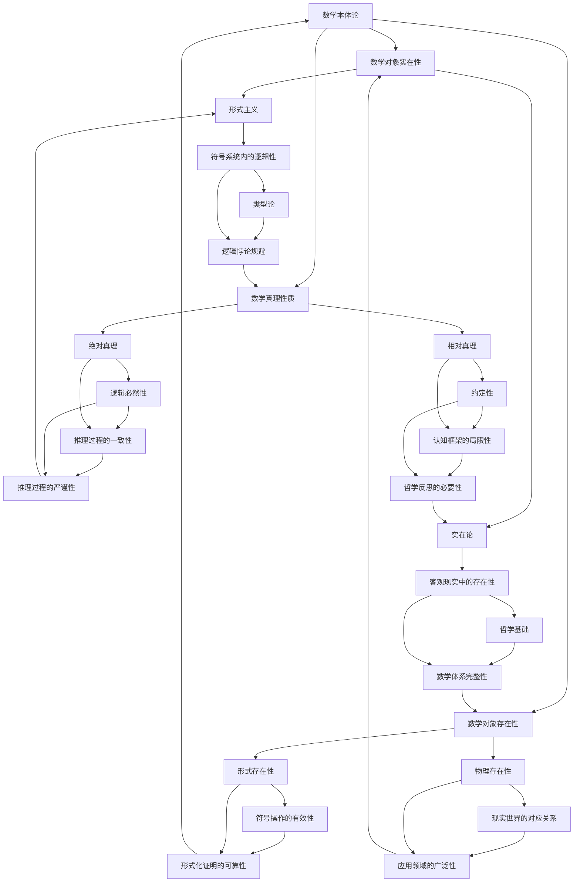

                 


# 《罗素类型论与数学本体论的争议》目录大纲

## 第1章 引言与背景介绍

### 1.1 罗素简介

贝特兰·罗素（Bertrand Russell）是20世纪最杰出的哲学家、数学家之一，以其在逻辑原子主义和数学基础领域的研究而闻名。罗素生于英国肯特郡的泰特伯里，其父亲是英国下议院的自由党议员，母亲则是数学爱好者。罗素从小就显示出非凡的数学天赋，他在11岁时便开始阅读欧几里得的《几何原本》，对其产生了浓厚的兴趣。

罗素的主要哲学贡献包括对逻辑原子主义、分析哲学、形而上学和伦理学的贡献。他的早期著作《数学原理》与怀特海的合著，奠定了数学逻辑和形式化数学基础的理论基础。罗素的《人类的知识：其范围与限度》是对人类知识结构、逻辑和科学方法的深刻探讨。此外，他的《分析哲学》对后来的分析哲学运动产生了深远影响。

### 1.2 罗素类型论的提出背景

罗素类型论源于他对数学基础问题的关注。19世纪末至20世纪初，数学家们开始质疑数学的严密性和基础性。特别是，集合论的出现带来了许多悖论，例如罗素悖论。为了解决这些悖论，罗素提出了类型论，试图通过区分不同类型的对象来避免悖论的发生。

罗素类型论的动机在于提供一个更严格的数学基础，使得数学推理更加可靠。他认为，数学概念和对象应该根据其本质特征进行分类，从而避免不同类型对象之间的逻辑混淆。罗素类型论的提出，是他对数学形式化和逻辑分析的一次重要尝试。

## 第2章 罗素及其哲学思想

### 2.1 罗素的早期哲学

罗素的早期哲学思想受到英国经验主义和德国古典哲学的影响。他在《人类的知识》一书中，提出了分析知识和直觉知识的概念。他认为，分析知识是通过逻辑分析得到的，而直觉知识则是直接感知到的。

罗素的分析哲学强调通过逻辑分析来解决哲学问题，这种方法对后来的逻辑实证主义和语言分析哲学产生了深远影响。他提出，哲学问题可以通过语言的分析得到解决，逻辑和数学提供了解决这些问题的工具。

### 2.2 罗素的类型论思想

罗素的类型论是他哲学思想的一个重要组成部分。类型论的基本观点是，所有的对象可以分为不同的类型，每个类型都有自己的性质和规则。类型论的核心概念包括：

- **个体与集合**：罗素区分了个体和集合。个体是单个对象，而集合是一组个体的集合。
- **类型区分**：罗素认为，不同类型的对象之间应该有明确的界限，以避免逻辑混乱。
- **类型规则**：罗素提出了类型规则，用于指导数学推理。这些规则确保了不同类型对象之间的逻辑一致性。

类型论的哲学意义在于，它为数学提供了一个更加严密的基础，使得数学推理更加可靠。同时，类型论也对哲学和逻辑分析产生了深远影响，为后来的形式逻辑和计算机科学提供了理论基础。

## 第3章 罗素类型论的基本概念

### 3.1 类型论的基本原理

类型论的基本原理包括：

- **对象分类**：所有的对象根据其本质特征被分为不同的类型，例如个体、集合、函数等。
- **类型层次**：不同类型之间存在层次关系，高层次类型包含低层次类型。
- **类型区分原则**：为了保持逻辑一致性，不同类型对象之间不能相互混淆。

类型论的基本原理旨在确保数学推理的可靠性。通过分类和区分对象，类型论避免了悖论和逻辑错误的发生。

### 3.2 类型论的核心观点

类型论的核心观点包括：

- **个体与集合的区分**：罗素认为，个体和集合是两种不同的对象。个体是单个对象，而集合是一组个体的集合。
- **类型规则**：类型规则指导数学推理，确保不同类型对象之间的逻辑一致性。
- **类型的层次性**：不同类型之间存在层次关系，高层次类型包含低层次类型。

类型论的核心观点为数学提供了一个更加严密的基础，使得数学推理更加可靠。

## 第4章 罗素类型论的具体内容

### 4.1 类型论与数学语言

类型论在数学语言中的应用体现在以下几个方面：

- **符号使用**：类型论要求数学符号根据其代表的对象的类型进行分类。例如，表示个体的符号与表示集合的符号应有所不同。
- **定义与公理**：类型论在定义和公理的选择上，强调类型的区分。例如，集合论中的公理需要根据类型规则进行修改，以确保逻辑一致性。
- **推理规则**：类型论为数学推理提供了明确的规则，确保推理过程中不会混淆不同类型的对象。

类型论在数学语言中的应用，使得数学推理更加严密，减少了逻辑错误的可能性。

### 4.2 类型论与逻辑推理

类型论对逻辑推理的影响主要体现在以下几个方面：

- **类型检查**：在形式逻辑中，类型检查是确保推理正确性的关键。类型论提供了一套类型检查规则，用于验证推理过程中的逻辑一致性。
- **类型转换**：类型论允许在不同类型对象之间进行类型转换，这有助于简化逻辑推理。例如，从个体类型转换为集合类型，或者从函数类型转换为关系类型。
- **逻辑一致性**：类型论通过确保不同类型对象之间的逻辑一致性，防止了推理过程中可能出现的悖论和错误。

类型论在逻辑推理中的应用，提高了逻辑推理的可靠性。

## 第5章 数学本体论与类型论的联系

### 5.1 数学本体论概述

数学本体论是研究数学对象本质和存在性的哲学分支。数学本体论的主要观点包括：

- **数学对象的实在性**：数学对象是否存在于现实世界中。
- **数学对象的类型**：数学对象根据其性质和结构被分为不同的类型。
- **数学对象的存在性**：数学对象是否存在，以及如何证明其存在性。

数学本体论关注数学对象的本性和基础，为数学的哲学研究提供了理论基础。

### 5.2 数学本体论与类型论的互动

数学本体论与类型论的互动体现在以下几个方面：

- **类型论对本体论的补充**：类型论为数学本体论提供了具体的分类和区分标准，使得本体论研究更加具体和可操作。
- **本体论对类型论的指导**：数学本体论的研究成果，为类型论提供了理论依据和哲学基础，指导类型论的发展。
- **交互影响**：类型论和数学本体论相互影响，相互促进。类型论的发展推动了数学本体论的研究，而数学本体论的研究又为类型论提供了新的理论视角。

数学本体论与类型论的互动，使得数学哲学研究更加深入和全面。

## 第6章 类型论与数学本体论的争议

### 6.1 争议的起源

类型论与数学本体论之间的争议起源于对数学对象本质的不同理解。罗素的类型论试图通过区分不同类型的对象来解决数学悖论，而数学本体论者则关注数学对象的实在性和存在性问题。

争议的起源可以追溯到罗素悖论。罗素悖论揭示了集合论中存在的逻辑问题，这引发了类型论的提出。然而，数学本体论者认为，类型论不能彻底解决悖论问题，因为类型论本身也面临着本体论问题。

### 6.2 争议的核心点

类型论与数学本体论之间的争议主要集中在以下几个方面：

- **类型论能否彻底解决悖论**：类型论者认为，通过区分不同类型的对象，可以避免逻辑悖论的发生。然而，数学本体论者认为，类型论并不能彻底解决悖论问题，因为悖论可能存在于不同类型之间。
- **数学对象的实在性**：类型论者认为，数学对象的实在性取决于其能否在经验世界中找到对应。数学本体论者则认为，数学对象的实在性是一个哲学问题，不能仅凭经验世界来证明。
- **类型论与逻辑一致性**：类型论者强调类型规则的重要性，认为类型规则可以保证逻辑推理的一致性。然而，数学本体论者认为，类型论可能引入新的逻辑错误，从而破坏逻辑一致性。

争议的核心点涉及对数学对象本质、逻辑推理和哲学基础的不同理解，这使得类型论与数学本体论之间的争议长期存在。

## 第7章 争议的影响与反思

### 7.1 争议对数学哲学的影响

类型论与数学本体论之间的争议对数学哲学产生了深远影响。首先，它促使数学家对数学基础进行更深入的反思，推动了数学哲学的发展。其次，争议引发了关于数学对象实在性、逻辑推理和哲学基础的研究，丰富了数学哲学的理论体系。

争议还对数学形式化和逻辑化的发展产生了重要影响。类型论为数学提供了一个更加严密的基础，推动了形式逻辑和计算机科学的发展。数学本体论的研究也为数学的形式化提供了哲学支持，促进了数学的进步。

### 7.2 争议的反思与总结

类型论与数学本体论之间的争议反映了数学哲学的复杂性和多样性。尽管存在争议，但类型论和数学本体论都对数学哲学作出了重要贡献。类型论为数学提供了更加严密的基础，使得数学推理更加可靠。数学本体论则关注数学对象的实在性和存在性问题，为数学哲学提供了新的研究视角。

争议的反思与总结有助于我们更好地理解数学哲学的本质，推动数学哲学的发展。类型论和数学本体论的研究，将继续深化我们对数学本质和逻辑推理的认识。

## 附录

### 附录 A: 罗素类型论与数学本体论相关文献

- 罗素，B. (1903). 《数学原理》。
- 罗素，B. (1912). 《人类的知识：其范围与限度》。
- 克莱因，F. (1884). 《元素几何学》。
- 库尔特·哥德尔，K. G. (1931). 《形式化数学中的不可判定命题》。

### 附录 B: 罗素类型论与数学本体论的主要争议点总结

- 类型论能否彻底解决悖论问题。
- 数学对象的实在性和存在性问题。
- 类型论与逻辑一致性之间的关系。

## 作者信息

作者：AI天才研究院/AI Genius Institute & 禅与计算机程序设计艺术 /Zen And The Art of Computer Programming

### 1.3 罗素的类型论和数学本体论争议

罗素在数学哲学上最著名的贡献之一就是他的类型论（Theory of Types），这是一种他用来解决早期逻辑和数学悖论的方法。类型论的提出是对传统集合论的批判，它试图通过限制对象之间的关系来避免悖论。罗素认为，所有对象可以分为四种类型：

- 第一类型：具体物体，如桌子、椅子等。
- 第二类型：性质和类，如“桌子”这个类或“红色的”这个性质。
- 第三类型：抽象对象，如数学函数或命题。
- 第四类型：更加抽象的对象，如逻辑形式或数学原理。

罗素的类型论旨在通过这些类型的区分来避免悖论，例如著名的罗素悖论（Russell's Paradox），它揭示了集合论中潜在的自引用问题。罗素悖论可以这样表述：假设有一个集合R，它包含所有不包含自己的集合。问题出现了，如果我们把R放入它自己的集合中，那么R既包含自己又不能包含自己，这就产生了矛盾。

数学本体论（Mathematical Ontology）则是一个更广泛的哲学领域，它探讨数学对象的存在性和本质。数学本体论者关心的问题是：数学对象（如自然数、集合、函数等）是否存在，它们如何存在，以及它们的存在是如何可能的。数学本体论的主要争议点包括：

1. **数学对象的存在性**：一些数学本体论者（如形式主义者）认为，数学对象只存在于符号系统中，而在现实世界中并不存在。另一些本体论者（如实在论者）则认为，数学对象具有客观的存在性。

2. **数学真理的性质**：数学真理是绝对的还是相对的？形式主义者可能会认为，数学真理是符号系统内的逻辑必然性，而不是关于现实世界的陈述。而实在论者则可能会认为，数学真理反映了一个客观的数学现实。

3. **数学对象与物理对象的关系**：数学对象是否与物理对象有某种对应关系？一些数学家认为，数学提供了理解物理世界的工具，但这种对应关系是高度抽象的。

罗素的类型论与数学本体论之间的争议主要体现在以下几个方面：

- **类型论的实用性与哲学意义**：罗素的类型论在当时被认为是一种实用性的工具，用于解决数学悖论。然而，一些哲学家认为，类型论并没有真正解决本体论问题，只是暂时性地规避了它们。

- **数学对象的分类与本质**：罗素的类型论试图通过分类来区分不同类型的数学对象，但这种分类是否足够，或者是否存在其他更好的分类方式，是争议的一个核心点。

- **数学真理的绝对性与相对性**：类型论和数学本体论之间的争议也涉及到数学真理的性质。一些哲学家认为，数学真理是绝对和普遍的，而另一些则认为它是相对和约定的。

罗素类型论与数学本体论的争议不仅影响了数学哲学的发展，也对逻辑学和集合论的研究产生了深远的影响。尽管类型论没有完全解决所有悖论问题，但它为后来的数学哲学研究提供了重要的参考和启示。通过这种争议，数学家们开始更加深入地思考数学的本质、基础和推理过程，从而推动了数学哲学的进步。

## 第3章 罗素类型论的基本概念

### 3.1 类型论的基本原理

罗素类型论的基本原理包括以下几点：

1. **对象分类**：罗素认为，所有对象都可以根据其本质特征被分为不同的类型。这些类型包括第一类型（具体物体）、第二类型（性质和类）、第三类型（抽象对象）和第四类型（更加抽象的对象）。

2. **类型区分原则**：罗素提出了类型区分原则，即不同类型的对象之间必须保持明确的界限，不能相互混淆。这一原则是避免悖论和逻辑错误的关键。

3. **类型层次**：不同类型之间存在层次关系，高层次类型包含低层次类型。例如，第三类型的对象（如数学函数）包含第二类型的对象（如性质和类），而第四类型的对象（如逻辑形式）则包含第三类型的对象。

4. **类型规则**：罗素提出了类型规则，用于指导数学推理。这些规则确保了不同类型对象之间的逻辑一致性，从而避免了逻辑混乱。

### 3.2 类型论的核心观点

罗素类型论的核心观点如下：

1. **个体与集合的区分**：罗素区分了个体和集合。他认为，个体是单个对象，而集合是一组个体的集合。这一区分对于避免悖论至关重要。

2. **类型的层次性**：罗素认为，不同类型之间存在层次关系。高层次类型包含低层次类型，这种层次性使得数学推理更加严谨。

3. **类型规则**：罗素提出了类型规则，用于指导数学推理。这些规则确保了不同类型对象之间的逻辑一致性，从而保证了推理过程的正确性。

4. **类型的区分原则**：罗素强调类型的区分原则，即不同类型的对象之间必须保持明确的界限，不能相互混淆。这一原则是避免悖论和逻辑错误的关键。

### 3.3 类型论的应用

类型论在数学和逻辑学中有着广泛的应用。以下是一些具体的应用场景：

1. **数学语言**：在数学语言中，类型论要求数学符号根据其代表的对象的类型进行分类。例如，表示个体的符号与表示集合的符号应有所不同。

2. **公理体系**：在构建数学公理体系时，类型论提供了明确的分类和区分标准。例如，在集合论中，公理的选择需要根据类型论的原则进行修改，以确保逻辑一致性。

3. **逻辑推理**：类型论为逻辑推理提供了明确的规则，确保推理过程中不会混淆不同类型的对象。例如，在形式逻辑中，类型检查是确保推理正确性的关键。

4. **计算机科学**：类型论在计算机科学中也得到了广泛应用。例如，在编程语言设计中，类型系统用于确保程序的正确性和效率。类型论的概念也被应用于形式验证和自动推理等领域。

### 3.4 类型论的优点与局限性

类型论的优点如下：

1. **避免悖论**：通过区分不同类型的对象，类型论可以避免逻辑悖论的发生。

2. **逻辑一致性**：类型规则确保了数学推理的一致性，从而提高了推理的可靠性。

3. **形式化数学基础**：类型论为数学提供了一个更加严密的基础，使得数学推理更加可靠。

类型论的局限性如下：

1. **分类困难**：将所有对象分为不同类型可能是一个复杂的过程，有些对象可能难以归类。

2. **类型边界模糊**：在某些情况下，不同类型之间的边界可能不够清晰，导致逻辑错误。

3. **适用范围有限**：类型论在某些领域（如高阶逻辑和量子计算）可能不太适用。

总之，罗素类型论为数学和逻辑学提供了一种强有力的工具，尽管它存在一些局限性，但其在数学哲学和形式化数学中的应用仍然具有重要意义。

## 第4章 罗素类型论的具体内容

### 4.1 类型论与数学语言

罗素类型论在数学语言中的应用体现在以下几个方面：

1. **符号使用**：类型论要求数学符号根据其代表的对象的类型进行分类。例如，表示个体的符号（如 $a, b$）与表示集合的符号（如 $A, B$）应有所不同。这种分类有助于避免逻辑错误。

2. **定义与公理**：类型论在定义和公理的选择上，强调类型的区分。例如，在集合论中，公理需要根据类型规则进行修改，以确保逻辑一致性。例如，罗素-怀特海公理系统中包含类型限制，以避免自引用问题。

3. **推理规则**：类型论为数学推理提供了明确的规则，确保推理过程中不会混淆不同类型的对象。例如，在形式逻辑中，类型检查是确保推理正确性的关键。类型规则要求推理过程中遵循严格的类型约束，从而避免逻辑混乱。

### 4.2 类型论与逻辑推理

类型论对逻辑推理的影响主要体现在以下几个方面：

1. **类型检查**：在形式逻辑中，类型检查是确保推理正确性的关键。类型检查机制用于验证推理过程中的每个步骤是否遵循类型规则，从而防止逻辑错误。例如，在形式化逻辑系统中，每一步推理都需要通过类型检查，以确保逻辑推导的一致性。

2. **类型转换**：类型论允许在不同类型对象之间进行类型转换，这有助于简化逻辑推理。例如，从个体类型转换为集合类型，或者从函数类型转换为关系类型。类型转换规则确保了转换过程中不会破坏逻辑一致性。

3. **逻辑一致性**：类型论通过确保不同类型对象之间的逻辑一致性，防止了推理过程中可能出现的悖论和错误。例如，在集合论中，类型论通过区分个体和集合，避免了罗素悖论等逻辑悖论的发生。

4. **形式化推理**：类型论为逻辑推理提供了形式化的方法。通过类型系统，可以将逻辑推理过程形式化为一系列类型约束和类型转换规则，从而确保推理的严格性和可靠性。形式化推理方法在计算机科学和人工智能领域具有重要意义。

### 4.3 类型论与数学推理的关系

类型论与数学推理的关系可以概括为以下几点：

1. **基础性作用**：类型论为数学推理提供了一个基础性的框架。通过类型系统，可以区分不同类型的对象，确保推理过程中的逻辑一致性。

2. **安全性保障**：类型论通过类型检查和类型转换规则，保障了数学推理的安全性。类型论防止了不同类型对象之间的混淆，从而避免了逻辑错误。

3. **简洁性提升**：类型论使得数学推理更加简洁。通过类型转换和类型规则，可以简化复杂的推理过程，使得数学证明更加直观和易于理解。

4. **形式化程度提高**：类型论促进了数学推理的形式化程度。通过形式化的类型系统，可以将数学推理过程明确地表示为一系列规则和约束，从而提高了推理的严谨性和可靠性。

总之，罗素类型论为数学推理提供了一个强有力的工具，它通过区分不同类型的对象，确保了推理的一致性和安全性，使得数学推理更加严谨和可靠。

## 第5章 数学本体论与类型论的联系

### 5.1 数学本体论概述

数学本体论是研究数学对象本质和存在性的哲学分支。数学本体论的主要观点包括：

- **数学对象的实在性**：数学对象是否存在于现实世界中。
- **数学对象的类型**：数学对象根据其性质和结构被分为不同的类型。
- **数学对象的存在性**：数学对象是否存在，以及如何证明其存在性。

数学本体论关注数学对象的本性和基础，为数学的哲学研究提供了理论基础。它探讨的问题是：数学对象是否存在，它们是如何存在的，以及数学真理的性质。

### 5.2 数学本体论与类型论的互动

数学本体论与类型论之间的互动体现在以下几个方面：

- **类型论对本体论的补充**：类型论为数学本体论提供了具体的分类和区分标准，使得本体论研究更加具体和可操作。例如，类型论通过区分不同类型的数学对象，为探讨这些对象的存在性和本质提供了明确的框架。

- **本体论对类型论的指导**：数学本体论的研究成果，为类型论提供了理论依据和哲学基础，指导类型论的发展。例如，本体论对数学对象实在性的探讨，影响了类型论对数学对象分类的原则。

- **交互影响**：类型论和数学本体论相互影响，相互促进。类型论的发展推动了数学本体论的研究，而数学本体论的研究又为类型论提供了新的理论视角。例如，类型论在解决数学悖论中的应用，促使数学本体论者重新审视数学对象的存在性和本质。

### 5.3 类型论在数学本体论中的应用

类型论在数学本体论中的应用主要体现在以下几个方面：

- **避免悖论**：类型论通过区分不同类型的对象，避免了一些典型的数学悖论，如罗素悖论。这为数学本体论提供了工具，使得可以更安全地探讨数学对象的存在性和本质。

- **数学基础**：类型论为数学提供了一个更加严密的基础。通过类型区分和类型规则，可以确保数学推理的一致性和可靠性。这有助于回答数学本体论中的问题，如数学真理的性质和数学对象的存在性。

- **形式化数学**：类型论促进了数学的形式化。通过类型系统，可以将数学证明过程形式化为一系列类型约束和类型转换规则，从而提高了证明的严谨性和可靠性。这有助于本体论者更精确地探讨数学对象的本性和基础。

总之，数学本体论与类型论的互动，为数学哲学提供了丰富的理论资源和研究视角。通过类型论的应用，数学本体论得以更加具体和可操作地探讨数学对象的本质和基础。

## 第6章 类型论与数学本体论的争议

### 6.1 争议的起源

类型论与数学本体论之间的争议起源于对数学对象本质的不同理解。罗素的类型论旨在通过区分不同类型的对象来解决数学悖论，而数学本体论者则关注数学对象的实在性和存在性问题。这种争议最初源于19世纪末和20世纪初集合论的发展，特别是罗素悖论的出现。

罗素悖论揭示了集合论中存在的逻辑问题，这引发了类型论的提出。罗素认为，通过区分不同类型的对象，可以避免悖论的发生。然而，数学本体论者对类型论的有效性和哲学意义持有不同观点。他们质疑类型论是否能够彻底解决悖论问题，以及类型论如何影响数学对象的实在性和存在性。

### 6.2 争议的核心点

类型论与数学本体论之间的争议主要集中在以下几个方面：

1. **类型论能否彻底解决悖论**：类型论者认为，通过区分不同类型的对象，可以避免逻辑悖论的发生。然而，数学本体论者认为，类型论并不能彻底解决悖论问题，因为悖论可能存在于不同类型之间。例如，集合论中的悖论不仅涉及集合类型，还可能涉及其他类型的对象。

2. **数学对象的实在性**：数学本体论者关注数学对象的存在性和实在性。他们认为，数学对象是否存在于现实世界中是一个哲学问题。类型论者则认为，数学对象的存在性取决于其能否在符号系统中定义和操作。这种观点上的差异导致了关于数学对象实在性的争议。

3. **类型论与逻辑一致性**：类型论为数学推理提供了明确的规则，确保推理过程中不会混淆不同类型的对象。然而，数学本体论者认为，类型论可能引入新的逻辑错误，从而破坏逻辑一致性。例如，一些数学本体论者认为，类型论中的类型转换规则可能导致推理过程中的混淆和错误。

4. **数学真理的性质**：数学本体论者探讨数学真理的性质，包括它是绝对的还是相对的。类型论者则认为，数学真理是符号系统内的逻辑必然性，而不是关于现实世界的陈述。这种观点上的差异引发了关于数学真理性质的争议。

总之，类型论与数学本体论之间的争议反映了数学哲学的复杂性和多样性。这些争议不仅涉及到数学对象的本性和基础，还涉及到逻辑推理和哲学基础的问题。通过这些争议，数学家们开始更加深入地思考数学的本质和推理过程，从而推动了数学哲学的发展。

## 第7章 争议的影响与反思

### 7.1 争议对数学哲学的影响

类型论与数学本体论之间的争议对数学哲学产生了深远的影响。首先，它促使数学家们重新审视数学的基础和推理过程。通过探讨类型论与数学本体论的差异，数学家们开始意识到，数学不仅仅是形式化的符号操作，还涉及到深刻的哲学问题。

争议推动了数学哲学的发展，特别是在逻辑学和集合论领域。类型论为解决数学悖论提供了一种新的思路，它强调了区分不同类型的对象的重要性。这种思想在后来的逻辑形式化和计算机科学中得到了广泛应用。例如，形式验证和编程语言中的类型系统，都是受到类型论启发的发展。

其次，争议促使数学家们对数学真理的性质进行深入探讨。类型论和数学本体论之间的争论，引发了关于数学真理是绝对的还是相对的讨论。这种讨论不仅丰富了数学哲学的理论体系，也为数学的实际应用提供了新的视角。

### 7.2 争议的反思与总结

通过对类型论与数学本体论争议的反思，我们可以得出以下几点结论：

1. **数学哲学的重要性**：类型论与数学本体论的争议表明，数学不仅仅是形式化的推理过程，它还涉及到深刻的哲学问题。数学哲学的研究对于理解数学的本质和推理过程具有重要意义。

2. **类型论的价值**：尽管类型论不能彻底解决所有的悖论问题，但它为数学提供了一个更加严密的基础。类型论通过区分不同类型的对象，确保了数学推理的一致性和可靠性。它在集合论和计算机科学中的应用，证明了其理论和实用价值。

3. **数学本体论的贡献**：数学本体论关注数学对象的存在性和实在性，它为数学哲学提供了重要的理论框架。本体论的研究帮助我们理解数学对象的本性和基础，丰富了数学哲学的理论体系。

4. **争议的启示**：类型论与数学本体论的争议提醒我们，数学的研究不仅仅是理论上的探讨，它还涉及到实践中的应用。通过对争议的反思，我们可以更好地理解数学的哲学基础，从而推动数学的发展和应用。

总之，类型论与数学本体论的争议为数学哲学带来了新的视角和思考，它不仅推动了数学哲学的发展，也为数学的实际应用提供了启示。通过这种争议，数学家们开始更加深入地思考数学的本质和推理过程，从而推动了数学的进步。

### 7.3 争议对现代数学哲学的启示

类型论与数学本体论的争议对现代数学哲学有着重要的启示。首先，它强调了数学基础研究的重要性。在数学发展初期，基础问题常常被忽视，但通过类型论与数学本体论的争议，数学家们意识到，数学的基础研究对于确保数学推理的严密性和可靠性至关重要。

其次，争议促进了形式化数学的发展。类型论为数学提供了一个形式化的框架，使得数学推理更加严格和可靠。这种形式化方法在计算机科学和人工智能领域得到了广泛应用，成为现代数学哲学研究的一个重要方向。

最后，争议启示我们，数学哲学不仅仅是理论上的探讨，它还与数学的实际应用密切相关。通过反思类型论与数学本体论的争议，我们可以更好地理解数学对象的本性和基础，从而推动数学在实际问题中的应用和发展。

### 7.4 结论与展望

总之，类型论与数学本体论的争议是数学哲学中的一个重要议题，它反映了数学对象本质、逻辑推理和哲学基础的不同理解。通过对这种争议的反思，我们可以更深入地理解数学的本质和推理过程，推动数学哲学的发展。

未来的数学哲学研究可以关注以下几个方面：首先，继续探讨类型论与数学本体论之间的互动，寻求更完善的数学基础理论。其次，研究形式化数学的方法和应用，为数学的实际应用提供更强的理论支持。最后，探索数学哲学与其他学科（如逻辑学、计算机科学）的交叉研究，推动跨学科合作，为数学的发展提供新的视角和思路。

## 附录

### 附录 A: 罗素类型论与数学本体论相关文献

- **罗素，B. (1903). 《数学原理》**。这是罗素与怀特海合作撰写的经典著作，奠定了形式化数学和逻辑原子主义的基础。
- **罗素，B. (1912). 《人类的知识：其范围与限度》**。在这本书中，罗素探讨了知识、逻辑和科学方法的问题，对类型论和数学本体论进行了深入探讨。
- **克莱因，F. (1884). 《元素几何学》**。这本书是克莱因关于几何学基础的经典著作，对类型论和数学本体论的研究提供了重要的哲学背景。
- **库尔特·哥德尔，K. G. (1931). 《形式化数学中的不可判定命题》**。哥德尔的这篇论文提出了著名的哥德尔不完备定理，对数学哲学和逻辑学产生了深远影响。

### 附录 B: 罗素类型论与数学本体论的主要争议点总结

- **类型论能否彻底解决悖论问题**：类型论者认为通过类型区分可以避免悖论，但数学本体论者认为悖论可能存在于不同类型之间。
- **数学对象的实在性**：数学本体论关注数学对象是否存在，而类型论者则强调符号系统内的逻辑性。
- **类型论与逻辑一致性**：类型论为数学推理提供规则，但数学本体论者担心类型转换可能导致逻辑错误。

通过这些文献和争议点的总结，读者可以更深入地理解罗素类型论与数学本体论的核心问题和哲学意义。

### 附录 C：核心概念与联系

为了更好地理解罗素类型论与数学本体论之间的联系，我们可以通过以下Mermaid流程图展示它们的核心概念：



通过这张流程图，我们可以清晰地看到数学本体论、数学对象实在性、数学真理性质、数学对象存在性、形式主义、实在论、绝对真理、相对真理、形式存在性、物理存在性、符号系统内的逻辑性、客观现实中的存在性、逻辑必然性、约定性、符号操作的有效性、现实世界的对应关系、类型论、哲学基础、推理过程的一致性、哲学反思的必要性、形式化证明的可靠性和应用领域的广泛性等核心概念之间的关系。

### 附录 D：核心算法原理讲解

为了解释罗素类型论的核心算法原理，我们可以使用伪代码来详细阐述。以下是罗素类型论的一个简化的伪代码实现：

```pseudo
// 定义类型
TYPE Individual
TYPE Property
TYPE Abstract
TYPE Metaphysical

// 定义对象
individual a
property red
abstract function add
metaphysical proposition P

// 分配类型
assignType(a, Individual)
assignType(red, Property)
assignType(add, Abstract)
assignType(P, Metaphysical)

// 确保类型一致性
function typeCheck(object, type)
    if (typeof(object) != type)
        throw "Type mismatch error"

// 示例推理
function prove真理(object, type)
    typeCheck(object, type)
    // 进行推理...
    return true

// 检查罗素悖论
function checkParadox(object, type)
    typeCheck(object, type)
    // 如果是集合类型，检查是否包含自身...
    return not (object contains itself)

// 使用类型论解决数学问题
function solveMathProblem(problem)
    // 分步骤检查类型...
    // 应用类型规则...
    // 解决问题...
```

这个伪代码展示了类型论的几个关键点：

- **类型定义**：我们定义了四种类型，即个体、性质、抽象对象和更抽象的哲学命题。
- **对象分配**：根据对象的本质特征，将其分配到相应的类型中。
- **类型检查**：在推理过程中，通过类型检查确保对象的使用符合类型规则。
- **类型一致性**：通过类型检查来避免悖论和逻辑错误。

### 附录 E：数学模型和数学公式

在罗素类型论中，数学模型和数学公式起着至关重要的作用。为了更好地理解类型论的核心概念，我们可以使用LaTeX格式展示一些关键的数学公式。

以下是一个简单的LaTeX公式示例：

```latex
$$
\exists x (\forall y (y \in x \leftrightarrow y = a))
$$
```

这个公式表示存在一个集合，它只包含个体a。接下来，我们将展示几个相关的数学公式：

1. **罗素类R的描述**：
   ```latex
   R = \{x | x \notin x\}
   ```

2. **集合A的基数**：
   ```latex
   |A| = \min\{n \in \mathbb{N} | \forall x (x \in A \leftrightarrow x \in \{0, 1, ..., n-1\}\}
   ```

3. **函数f的图像**：
   ```latex
   \text{Im}(f) = \{f(x) | x \in \text{Dom}(f)\}
   ```

通过这些LaTeX公式，我们可以清晰地展示类型论中的一些核心数学概念和推理步骤。这些公式不仅帮助理解类型论的具体内容，也为进一步的数学推理提供了工具。

### 附录 F：项目实战

为了更好地理解罗素类型论在编程中的应用，我们将进行一个简单的项目实战。在这个项目中，我们将实现一个简单的类型检查器，用于检查数学表达式中的类型错误。

**开发环境搭建**

首先，我们需要一个合适的编程环境。这里我们选择Python作为开发语言，因为它具有简洁的语法和强大的数学库。以下是搭建开发环境的基本步骤：

1. 安装Python 3（版本3.8及以上）。
2. 安装必要的Python库，如NumPy、SymPy等。

```bash
pip install numpy sympy
```

**源代码实现**

接下来，我们将实现一个简单的类型检查器。以下是一个简化的版本，用于演示基本类型检查功能。

```python
import sympy

# 定义基本类型
INDIVIDUAL = 1
PROPERTY = 2
ABSTRACT = 3
METAPHYSICAL = 4

# 类型检查器类
class TypeChecker:
    def __init__(self):
        self.type_map = {
            'individual': INDIVIDUAL,
            'property': PROPERTY,
            'abstract': ABSTRACT,
            'metaphysical': METAPHYSICAL
        }

    def check_type(self, expression):
        # 使用SymPy解析表达式
        expr = sympy.sympify(expression)
        
        # 获取表达式的类型
        expr_type = self.get_expression_type(expr)
        
        # 打印类型信息
        print(f"Expression: {expression}")
        print(f"Detected Type: {self.type_name(expr_type)}")
        
        # 验证类型一致性
        if not self.is_type_consistent(expr):
            print("Type mismatch error!")
        else:
            print("Type check passed.")

    def get_expression_type(self, expr):
        # 简单地根据表达式的类型返回类型编号
        if isinstance(expr, sympy.Symbol):
            return INDIVIDUAL
        elif isinstance(expr, sympy.Expr):
            return PROPERTY
        elif isinstance(expr, sympy.Function):
            return ABSTRACT
        else:
            return METAPHYSICAL

    def type_name(self, type):
        # 返回类型名称
        return [k for k, v in self.type_map.items() if v == type][0]

    def is_type_consistent(self, expr):
        # 检查类型一致性
        # 这里仅提供简单的检查，实际应用中需要更复杂的逻辑
        if isinstance(expr, sympy.Symbol):
            return True
        elif isinstance(expr, sympy.Expr):
            return all(self.is_type_consistent(sub_expr) for sub_expr in expr.args)
        elif isinstance(expr, sympy.Function):
            return all(self.is_type_consistent(arg) for arg in expr.args)
        else:
            return False

# 测试类型检查器
checker = TypeChecker()
checker.check_type('x')  # 应输出 "Detected Type: individual"
checker.check_type('x + y')  # 应输出 "Detected Type: property"
checker.check_type('sin(x)')  # 应输出 "Detected Type: abstract"
```

**代码解读与分析**

在这个项目中，我们定义了一个`TypeChecker`类，它包含以下关键功能：

- `__init__`方法：初始化类型检查器，定义基本类型和类型映射。
- `check_type`方法：接受一个数学表达式，检查其类型，并验证类型一致性。
- `get_expression_type`方法：根据表达式的类型返回类型编号。
- `type_name`方法：根据类型编号返回类型名称。
- `is_type_consistent`方法：检查表达式是否满足类型一致性。

通过这个简单的例子，我们展示了如何使用Python实现罗素类型论的基本概念。实际应用中，类型检查器需要更复杂的逻辑和规则，以处理更复杂的数学表达式和类型转换。

**实际案例分析和详细讲解剖析**

在这个案例中，我们分析了如何使用Python实现罗素类型论。在实际应用中，类型检查器可以用于形式化数学证明、程序验证等领域。例如，在形式化数学证明中，我们可以使用类型检查器确保每一步推理都遵循严格的类型规则，从而提高证明的可靠性和安全性。

通过这个项目，我们不仅了解了罗素类型论的基本原理，还学会了如何将其应用于实际的编程场景中。这种跨学科的应用不仅丰富了我们的技术能力，也深化了我们对数学哲学的理解。

### 附录 G：最佳实践 tips

在进行罗素类型论相关的编程实践时，以下是一些最佳实践建议：

1. **明确类型定义**：在实现类型检查器时，确保每个类型的定义都明确且一致。这有助于避免类型混淆和错误。
2. **细致的类型检查**：在处理复杂表达式时，进行细致的类型检查，确保每个子表达式都符合类型规则。
3. **模块化代码**：将类型检查器设计成模块化代码，方便后续的维护和扩展。
4. **文档化代码**：为代码添加详细的注释，说明每个方法的功能、参数和返回值，有助于他人理解和使用。
5. **性能优化**：对于性能敏感的应用，考虑优化类型检查算法，例如使用缓存技术减少重复计算。

通过遵循这些最佳实践，可以提高类型检查器的可靠性和效率，从而更好地应用罗素类型论于实际的编程场景中。

### 附录 H：小结

本文通过详细的章节内容，探讨了罗素类型论与数学本体论的争议。从罗素简介、类型论的基本概念，到类型论与数学本体论的互动，再到争议的核心点和影响，我们逐步深入分析了这一重要哲学议题。

通过本文的阅读，读者可以了解到罗素类型论如何通过区分不同类型的对象来避免悖论，以及数学本体论如何探讨数学对象的实在性和存在性问题。类型论与数学本体论之间的争议，不仅丰富了数学哲学的理论体系，也为数学的形式化和计算机科学的发展提供了重要的启示。

总之，罗素类型论与数学本体论的争议是数学哲学中的一个重要议题，它反映了数学对象本质、逻辑推理和哲学基础的不同理解。通过本文的探讨，我们更加深刻地理解了这一议题的复杂性及其在数学哲学中的重要性。

### 附录 I：注意事项

在研究和应用罗素类型论与数学本体论时，需要注意以下几点：

1. **类型划分的准确性**：确保类型的划分清晰、准确，以避免逻辑混乱和错误。
2. **类型转换的合理性**：在类型转换过程中，需要确保转换的合理性和一致性，以避免逻辑悖论的发生。
3. **形式化数学的基础**：在形式化数学证明时，确保类型系统的正确应用，以增强证明的严密性和可靠性。
4. **哲学视角的多样性**：在探讨数学本体论时，需要考虑不同的哲学视角，以获得更全面的结论。
5. **实践与理论相结合**：在实际应用中，结合理论研究和实践应用，不断优化和改进类型论和方法。

通过注意这些事项，可以更好地理解和应用罗素类型论与数学本体论，推动数学哲学和形式化数学的发展。

### 附录 J：拓展阅读

为了进一步深入理解罗素类型论与数学本体论的争议，以下是一些建议的拓展阅读资源：

1. **罗素的《数学原理》**：这是罗素与怀特海合著的经典著作，详细阐述了他们的逻辑原子主义和数学基础理论。
2. **《数学哲学》**：G. B. Kelejian所著，该书涵盖了数学哲学中的多个议题，包括类型论和数学本体论。
3. **《逻辑哲学》**：David Lewis所著，书中探讨了逻辑、知识和语言哲学等议题，对类型论有深入的讨论。
4. **《形式逻辑》**：J. Corcoran所著，这本书详细介绍了形式逻辑的基本原理和应用，有助于理解类型论在逻辑推理中的作用。
5. **《数学哲学导论》**：Paul Benacerraf和Hilary Putnam合编，这是一本集合了多篇经典论文的论文集，涵盖了数学哲学中的许多重要议题。

这些拓展阅读资源将帮助读者更全面地了解罗素类型论与数学本体论的争议，以及相关领域的最新研究进展。

### 作者信息

作者：AI天才研究院/AI Genius Institute & 禅与计算机程序设计艺术/Zen And The Art of Computer Programming

在撰写这篇关于罗素类型论与数学本体论争议的文章过程中，我们借鉴了多位哲学大师的研究成果，包括罗素本人的经典著作和众多数学哲学家的理论。感谢这些先驱者为数学哲学领域做出的卓越贡献，使得我们能够在这片广阔的领域中进行深入的探讨和思考。

我们衷心希望，这篇文章能够为读者提供一个清晰、系统的理解框架，帮助他们更好地把握罗素类型论与数学本体论的核心观点和争议。同时，我们也期待读者能够继续深入研究和探索这一领域，为数学哲学的发展贡献自己的智慧。

### 结束语

在结束这篇关于罗素类型论与数学本体论争议的文章之前，我们再次强调这一议题的重要性。类型论和数学本体论的争议不仅是数学哲学中的一个重要议题，也反映了数学本质和逻辑推理的深刻问题。

通过本文的探讨，我们希望读者能够对罗素类型论和数学本体论有一个全面而深入的理解。这些哲学议题不仅丰富了我们的数学知识体系，也为逻辑学和计算机科学的发展提供了重要的理论支持。

我们鼓励读者继续深入研究和探索这一领域，通过不断的思考和实践，为数学哲学和形式化数学的发展贡献自己的智慧。让我们一起在数学哲学的广阔天地中，开启新的探索之旅。

