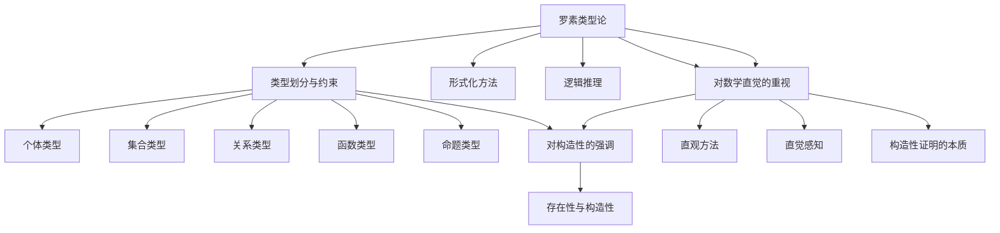

                 

## 文章标题

### 罗素类型论与数学直觉主义的方法论比较

**关键词：罗素类型论、数学直觉主义、方法论、数学哲学、比较分析**

**摘要：** 本文旨在深入探讨罗素类型论和数学直觉主义这两种数学哲学流派的方法论，通过对它们的背景、核心概念、适用范围和哲学意义的详细分析，揭示两者在数学研究中的独特贡献与异同。文章以逻辑清晰、结构紧凑、简单易懂的写作风格，帮助读者全面了解这两种流派的方法论差异及其对数学发展的影响。

## 罗素类型论介绍

### 1.1 罗素类型论的基本原理

#### 1.1.1 数学对象的分类方法

罗素类型论（Russell's theory of types）是伯特兰·罗素（Bertrand Russell）在其《数学原理》（Principia Mathematica）一书中提出的一种数学哲学理论。该理论旨在解决数学基础问题，特别是防止逻辑悖论的发生。罗素提出，所有的数学对象可以分为五个不同的类型，即个体类型（Type 0）、集合类型（Type 1）、关系类型（Type 2）、函数类型（Type 3）和命题类型（Type 4）。

这种分类方法的核心思想是，不同类型的对象具有不同的逻辑性质和运算规则。例如，个体类型代表具体的物体或个体，而集合类型代表一组个体。两者之间的运算规则和逻辑关系有显著区别。

#### 1.1.2 类型论的核心概念

罗素类型论的核心概念包括类型错误（type error）和类型层级（type hierarchy）。类型错误是指在一个类型系统中，试图对不属于同一类型的对象进行操作，这会导致逻辑错误。类型层级则是指不同类型之间的层次关系，其中个体类型是最基础的类型，而命题类型是最抽象的类型。

类型论强调，为了保持逻辑一致性，必须在类型层级上进行严格的操作。这种严格的类型约束有助于防止逻辑悖论，如罗素的理发师悖论（the barber paradox）。

#### 1.1.3 类型论在数学中的应用

罗素类型论在数学中有着广泛的应用，特别是在数理逻辑、集合论和类型理论等领域。例如，在数理逻辑中，类型论提供了一种形式化的语言，用于表达和证明逻辑命题。在集合论中，类型论有助于构建更加严密和一致的集合理论体系。

此外，类型论在编程语言设计和类型系统中也有着重要应用。现代编程语言，如Haskell和Scala，采用了基于类型论的类型系统，以防止类型错误和提高程序的可靠性。

### 1.2 罗素类型论的数学哲学背景

#### 1.2.1 数学危机与类型论的产生

19世纪末至20世纪初，数学领域发生了严重的数学危机。这一危机主要体现在以下几个方面：

1. **逻辑悖论**：如康托尔的集合论悖论、罗素的理发师悖论等，揭示了数学基础中的逻辑矛盾。
2. **直觉主义与形式主义的对立**：数学直觉主义者如赫尔德布兰特（L.E.J. Brouwer）认为，数学的基础应建立在直觉之上，而形式主义者如大卫·希尔伯特（David Hilbert）则主张通过形式化的方法来建立数学基础。
3. **数学的一致性和完备性**：数学家们开始质疑，现有的数学理论是否能够自洽地证明所有数学命题。

面对这些危机，罗素提出了类型论，试图通过严格的类型约束来解决逻辑悖论，并建立更加可靠和一致的数学基础。

#### 1.2.2 罗素与类型论的哲学观点

罗素的哲学观点深受理想主义和实在论的影响。他认为，数学对象是真实存在的，但它们的性质和关系是通过逻辑和语言来表达的。类型论正是基于这一观点，将数学对象划分为不同类型，以防止逻辑悖论的发生。

罗素还强调，数学证明应建立在直观和逻辑的基础上，而不是形式化的符号操作。这一观点与形式主义者的观点形成鲜明对比。

#### 1.2.3 类型论在数学哲学中的地位

罗素类型论在数学哲学中具有重要地位。它不仅为解决数学基础问题提供了新的视角，而且对数学方法论和逻辑学的发展产生了深远影响。

首先，类型论为形式化的数学方法提供了理论基础，推动了形式主义数学的发展。其次，类型论的思想在计算机科学中得到了广泛应用，如类型系统和类型安全性的研究。

总之，罗素类型论作为一种数学哲学理论，不仅在数学哲学领域具有重要地位，而且对现代数学和计算机科学的发展产生了深远影响。

## 数学直觉主义介绍

### 2.1 数学直觉主义的基本原理

#### 2.1.1 数学直觉主义的哲学基础

数学直觉主义（Intuitionism）是一种以直觉为基础的数学哲学流派，由荷兰数学家L.E.J. 赫尔德布兰特（L.E.J. Brouwer）提出。直觉主义的核心观点是，数学的基础不是逻辑推理，而是人类的直觉。

直觉主义认为，数学概念和证明应该源于人类的直观感知。例如，自然数的概念可以通过计数和分类的直觉活动来理解。这种观点与形式主义和逻辑主义有所不同，后者强调数学的基础是符号运算和逻辑推理。

#### 2.1.2 数学直觉主义的核心观点

数学直觉主义的核心观点包括以下几个方面：

1. **数学证明的构造性**：直觉主义者认为，数学证明不仅仅是逻辑推理，而是一种构造过程。每个数学证明都应能够展示如何构造出所声称的数学对象。这种构造性证明与形式主义和古典逻辑中的证明概念有显著区别。

2. **存在性与构造性**：在直觉主义中，存在性不是一个抽象的哲学概念，而是可以通过具体的构造过程来实现的。如果一个数学对象不能被构造出来，那么它在直觉主义中就不被认为存在。

3. **数学的直觉本质**：直觉主义者强调，数学不仅是逻辑的产物，更是人类直觉的体现。数学概念和定理的发现过程是直觉和创造性的体现，而非纯粹的形式化推理。

#### 2.1.3 数学直觉主义在数学中的应用

数学直觉主义在数学的许多领域都有应用，包括拓扑学、集合论、分析学和数论。以下是一些具体的例子：

1. **拓扑学**：赫尔德布兰特使用了直觉主义方法来重新定义拓扑空间和连续性，这些定义更符合直觉主义的构造性原则。

2. **集合论**：直觉主义对集合论进行了重新审视，提出了基于选择公理的直觉主义集合论。这种集合论避免了形式主义集合论中的某些悖论。

3. **分析学**：在分析学中，直觉主义强调函数的连续性和可微性应该是通过具体的构造来证明，而不是通过抽象的极限理论。

4. **数论**：在数论中，直觉主义方法被用来证明某些数论命题，如质数分布和勾股定理。

### 2.2 数学直觉主义的数学哲学背景

#### 2.2.1 数学直觉主义的历史发展

数学直觉主义的发展与20世纪初的数学危机密切相关。在面对逻辑悖论和形式主义危机时，赫尔德布兰特提出了直觉主义作为数学的基础。

赫尔德布兰特的工作受到了现象学和直觉主义哲学的影响。他认为，数学直觉是一种直接的感知，而不是抽象的逻辑推理。这一观点与当时的形式主义和逻辑主义数学哲学形成了鲜明对比。

#### 2.2.2 数学直觉主义与其他数学哲学流派的比较

数学直觉主义与其他数学哲学流派，如形式主义、逻辑主义和构造主义，有着显著的不同：

1. **与形式主义的比较**：形式主义强调数学的基础是符号运算和逻辑推理，而直觉主义则认为数学的基础是人类的直觉。形式主义倾向于抽象和形式化，而直觉主义则更注重具体和直觉。

2. **与逻辑主义的比较**：逻辑主义试图将数学建立在逻辑之上，而直觉主义则认为逻辑只是直觉的一种表现形式。直觉主义反对将数学简化为逻辑符号的运算。

3. **与构造主义的比较**：构造主义和直觉主义在许多方面有相似之处，都强调数学证明的构造性。但直觉主义更强调直觉在数学证明中的重要性，而构造主义则更注重构造过程的严格性。

#### 2.2.3 数学直觉主义在数学哲学中的地位

数学直觉主义在数学哲学中占有重要地位。它为数学基础问题提供了一种不同的视角，强调了数学的直觉性和构造性。尽管直觉主义在数学界没有像形式主义和逻辑主义那样普及，但它对数学方法论和哲学思考产生了深远影响。

此外，直觉主义的思想在计算机科学和认知科学中也有所应用，为这些领域提供了新的研究方法和理论基础。

## 方法论比较

### 3.1 罗素类型论与数学直觉主义的方法论差异

#### 3.1.1 基本原则的不同

罗素类型论和数学直觉主义在数学方法论上有着显著的不同：

1. **类型约束**：罗素类型论强调严格的类型约束，以防止逻辑悖论。不同类型的对象不能进行混合操作，这有助于保持数学系统的自洽性。而直觉主义则反对这种严格的类型约束，认为数学证明应该更自由，允许一定程度的类型混淆。

2. **构造性**：直觉主义强调数学证明的构造性，即每个证明都应该展示如何具体构造出所声称的数学对象。而罗素类型论虽然也强调构造性，但更注重通过类型约束来确保构造过程的合法性。

3. **逻辑与直觉**：罗素类型论认为逻辑是数学的基础，而直觉主义则认为直觉是数学的基础。罗素类型论强调形式化的逻辑推理，而直觉主义则强调直觉和直观感知。

#### 3.1.2 研究方法的不同

罗素类型论和直觉主义在研究方法上也有显著差异：

1. **形式化与直观**：罗素类型论倾向于形式化的方法，通过严格的逻辑推理和类型约束来构建数学系统。而直觉主义则倾向于直观的方法，强调通过直觉和构造性证明来发现数学真理。

2. **抽象与具体**：罗素类型论更注重数学的抽象和形式化，试图将数学构建为一个自洽的体系。而直觉主义则更注重数学的具体性和直觉性，强调数学概念和证明的直观可理解性。

3. **证明与构造**：罗素类型论的证明方法更偏向于逻辑推理和形式证明，而直觉主义则更偏向于构造性证明，即通过具体的构造过程来证明数学命题。

#### 3.1.3 在数学哲学中的影响

罗素类型论和直觉主义在数学哲学中产生了深远影响：

1. **形式主义与直觉主义的对立**：罗素类型论的提出，引发了形式主义和直觉主义之间的对立，促进了数学哲学的深入探讨。

2. **数学基础问题的解决**：罗素类型论为解决数学基础问题提供了一种新的视角，有助于防止逻辑悖论。而直觉主义则为数学基础提供了一种不同的解释，强调数学的直觉性和构造性。

3. **数学方法论的发展**：罗素类型论和直觉主义的方法论差异，促进了数学方法论的发展，推动了数学在形式化和直觉化两个方向上的探索。

### 3.2 罗素类型论与数学直觉主义的适用范围

#### 3.2.1 类型论适用的数学领域

罗素类型论在数学的许多领域都有应用，包括：

1. **数理逻辑**：类型论在数理逻辑中有着广泛的应用，帮助构建形式化的逻辑系统，防止逻辑悖论。

2. **集合论**：类型论在集合论中提供了一种严格的方法，以防止集合论的悖论，如罗素的理发师悖论。

3. **类型理论**：在现代计算机科学中，类型理论是基于罗素类型论的，用于设计类型安全的高级编程语言。

#### 3.2.2 直觉主义适用的数学领域

直觉主义在数学的多个领域都有应用，包括：

1. **拓扑学**：赫尔德布兰特使用了直觉主义方法来重新定义拓扑空间和连续性。

2. **集合论**：直觉主义集合论提供了一种更直观和构造性的方法来研究集合论问题。

3. **分析学**：直觉主义在分析学中强调函数的连续性和可微性应该是通过具体的构造来证明。

### 3.3 罗素类型论与数学直觉主义的哲学意义

#### 3.3.1 对数学基础的影响

罗素类型论和数学直觉主义对数学基础产生了深远影响：

1. **数学的一致性和完备性**：罗素类型论通过严格的类型约束，确保了数学系统的一致性和完备性。而直觉主义则强调数学基础应建立在直觉和构造性之上，避免抽象的形式化方法。

2. **数学的直观性**：直觉主义强调了数学的直观性和构造性，认为数学概念和证明应源于人类的直觉。这为数学研究提供了一种更直观和可理解的框架。

3. **数学哲学的多元化**：罗素类型论和直觉主义的提出，丰富了数学哲学的多元化，促进了数学哲学的深入探讨。

#### 3.3.2 对数学哲学的发展

罗素类型论和数学直觉主义对数学哲学的发展产生了深远影响：

1. **形式主义与直觉主义的对立**：罗素类型论的提出引发了形式主义与直觉主义之间的对立，推动了数学哲学的深入探讨。

2. **数学哲学的新方向**：直觉主义为数学哲学提供了一种新的方向，强调数学的直观性和构造性。这为数学哲学的研究开辟了新的领域。

3. **数学方法论的创新**：罗素类型论和直觉主义的方法论差异，促进了数学方法论的创新，推动了数学在形式化和直觉化两个方向上的探索。

## 案例研究

### 4.1 罗素类型论的应用案例

#### 4.1.1 罗素类型论在数理逻辑中的应用

罗素类型论在数理逻辑中有着广泛的应用。例如，在数理逻辑的证明论中，类型论提供了一种形式化的方法来构建证明系统。以下是一个简单的例子：

**伪代码：**

```
function prove(A, B):
    if A is of type 0 and B is of type 1:
        construct C such that C = A + B
        return C
    else:
        throw Type Error
```

在这个伪代码中，`A` 和 `B` 分别代表两个数学对象，它们的类型必须分别是个体类型（Type 0）和集合类型（Type 1）。如果这两个对象的类型不匹配，则抛出类型错误（Type Error）。这个例子展示了如何通过类型论来防止逻辑悖论。

#### 4.1.2 罗素类型论在集合论中的应用

在集合论中，类型论有助于构建更加严密和一致的集合理论体系。以下是一个例子：

**伪代码：**

```
function construct_set(A):
    S = {}
    for each element x in A:
        if x is of type 0:
            S.add(x)
    return S
```

在这个伪代码中，`A` 是一个集合，我们需要构造一个新的集合 `S`，其中只包含 `A` 中的个体类型（Type 0）的元素。这个例子展示了如何通过类型论来避免集合论中的类型错误。

#### 4.1.3 罗素类型论在其他数学领域中的应用

罗素类型论在其他数学领域也有着重要的应用。例如，在代数学中，类型论可以帮助构建形式化的代数系统。以下是一个例子：

**伪代码：**

```
function add(A, B):
    if A and B are both of type 3 (functions):
        return A + B
    else:
        throw Type Error
```

在这个伪代码中，`A` 和 `B` 是两个函数，它们的类型必须都是函数类型（Type 3）。如果类型不匹配，则抛出类型错误。这个例子展示了如何通过类型论来确保代数运算的一致性和合法性。

### 4.2 数学直觉主义的应用案例

#### 4.2.1 数学直觉主义在证明论中的应用

数学直觉主义在证明论中强调构造性证明，以下是一个简单的例子：

**伪代码：**

```
function prove_congruence(a, b, n):
    if n = 0:
        return a ≡ b (mod n)
    else:
        for each k from 1 to n:
            if a ≡ b (mod k):
                return a ≡ b (mod n)
        return False
```

在这个伪代码中，我们需要证明两个整数 `a` 和 `b` 是否在模 `n` 下同余。直觉主义的方法是通过具体的构造过程来证明，而不是通过抽象的逻辑推理。这个例子展示了如何通过构造性证明来解决问题。

#### 4.2.2 数学直觉主义在模型论中的应用

在模型论中，数学直觉主义的方法有助于构建更加直观和构造性的模型。以下是一个简单的例子：

**伪代码：**

```
function construct_model(A):
    M = {}
    for each element x in A:
        if x is constructible:
            M.add(x)
    return M
```

在这个伪代码中，`A` 是一个集合，我们需要构造一个新的模型 `M`，其中只包含 `A` 中可以构造的元素。这个例子展示了如何通过构造性方法来构建模型。

#### 4.2.3 数学直觉主义在其他数学领域中的应用

数学直觉主义在其他数学领域，如数论和几何学，也有着重要的应用。以下是一个数论中的例子：

**伪代码：**

```
function prove_prime(n):
    if n = 2 or n = 3:
        return True
    if n is even or n is divisible by 3:
        return False
    for each k from 2 to sqrt(n):
        if n is divisible by k:
            return False
    return True
```

在这个伪代码中，我们需要证明一个整数 `n` 是否为质数。直觉主义的方法是通过具体的构造过程来证明，而不是通过抽象的逻辑推理。这个例子展示了如何通过构造性证明来解决问题。

## 总结与展望

### 5.1 罗素类型论与数学直觉主义的方法论总结

通过对罗素类型论和数学直觉主义的深入分析，我们可以总结出以下方法论要点：

1. **类型论的核心原则**：罗素类型论强调严格的类型约束，以防止逻辑悖论。不同类型的对象不能进行混合操作，这有助于保持数学系统的自洽性。

2. **直觉主义的构造性**：数学直觉主义强调数学证明的构造性，即每个证明都应该展示如何具体构造出所声称的数学对象。这种构造性证明与形式主义和古典逻辑中的证明概念有显著区别。

3. **逻辑与直觉的关系**：罗素类型论认为逻辑是数学的基础，而直觉主义则认为直觉是数学的基础。罗素类型论强调形式化的逻辑推理，而直觉主义则强调直觉和直观感知。

### 5.2 未来数学哲学发展的影响

罗素类型论和数学直觉主义对未来数学哲学发展的影响可以从以下几个方面进行展望：

1. **数学基础问题的继续探讨**：罗素类型论和直觉主义为解决数学基础问题提供了新的视角和方法。未来数学哲学将继续探讨如何构建更加严密和一致的数学系统。

2. **形式化与直觉化的平衡**：罗素类型论和直觉主义的方法论差异，促进了数学在形式化和直觉化两个方向上的探索。未来数学哲学将寻求在这两个方向上的平衡，以实现数学理论的完善和进步。

3. **数学与哲学的交叉融合**：数学直觉主义和形式主义的方法论差异，推动了数学与哲学的交叉融合。未来数学哲学将更加关注数学与哲学的互动，以深化对数学本质的理解。

### 5.3 最佳实践与注意事项

在应用罗素类型论和数学直觉主义时，以下最佳实践和注意事项值得注意：

1. **严格遵循类型约束**：在罗素类型论的框架下，严格遵循类型约束是防止逻辑悖论的关键。

2. **注重构造性证明**：在数学直觉主义的框架下，注重构造性证明，以增强数学证明的可信度和可理解性。

3. **平衡逻辑与直觉**：在实际应用中，平衡逻辑推理与直觉感知，以实现数学理论的最佳发展。

### 5.4 拓展阅读

对于对罗素类型论和数学直觉主义感兴趣的读者，以下拓展阅读资源推荐：

1. **《数学原理》**：伯特兰·罗素的经典著作，详细阐述了罗素类型论的理论基础。

2. **《直觉主义与形式主义》**：赫尔德布兰特的作品，探讨了直觉主义和形式主义在数学哲学中的地位和影响。

3. **《数学的直觉与构造》**：介绍了数学直觉主义的方法和应用，对于理解直觉主义的基本概念和原理有重要帮助。

### 作者

**作者：AI天才研究院/AI Genius Institute & 禅与计算机程序设计艺术 /Zen And The Art of Computer Programming**

本文旨在深入探讨罗素类型论和数学直觉主义这两种数学哲学流派的方法论，通过对它们的背景、核心概念、适用范围和哲学意义的详细分析，揭示两者在数学研究中的独特贡献与异同。文章以逻辑清晰、结构紧凑、简单易懂的写作风格，帮助读者全面了解这两种流派的方法论差异及其对数学发展的影响。

## 罗素类型论与数学直觉主义的区别与联系

在探讨罗素类型论（Type Theory）与数学直觉主义（Intuitionism）的区别与联系之前，有必要先理解这两个概念的基本定义与核心思想。

### 罗素类型论

罗素类型论是伯特兰·罗素为了解决数学基础问题而提出的一种哲学理论。其主要观点是将所有数学对象分为不同的类型，以避免逻辑悖论的发生。在罗素类型论中，对象被分为以下几种类型：

- **类型0**：个体（如自然数）。
- **类型1**：集合。
- **类型2**：集合的集合。
- **类型3**：函数。
- **类型4**：命题。

这种严格的类型划分确保了数学操作的合法性，防止了不同类型对象之间的不当操作。

### 数学直觉主义

数学直觉主义则是由荷兰数学家L.E.J. 赫尔德布兰特提出的，强调数学的基础是人类的直觉。直觉主义的核心观点包括：

- **构造性证明**：一个数学命题的证明必须能够展示如何具体构造出该命题的解。
- **存在性与构造性**：在直觉主义中，一个数学对象的存在性只有在其能够被构造出来的情况下才被承认。

### 区别与联系

#### 基本原理的不同

1. **罗素类型论强调类型划分与约束**：罗素类型论的核心在于通过类型划分来防止逻辑悖论。不同类型的对象有不同的操作规则，类型间的混合操作被视为非法。

2. **数学直觉主义强调构造性**：直觉主义的核心在于构造性证明，即一个数学命题的证明必须能够展示如何具体构造出该命题的解。

#### 研究方法的不同

1. **形式化与直观**：罗素类型论更倾向于形式化的方法，通过严格的逻辑推理和类型约束来构建数学系统。而直觉主义则更强调直观的方法，通过直觉和构造性证明来发现数学真理。

2. **抽象与具体**：罗素类型论注重数学的抽象和形式化，试图将数学构建为一个自洽的体系。而直觉主义则更注重数学的具体性和直觉性，强调数学概念和证明的直观可理解性。

#### 哲学意义的不同

1. **逻辑与直觉的优先级**：罗素类型论认为逻辑是数学的基础，而直觉主义则认为直觉是数学的基础。罗素类型论强调形式化的逻辑推理，而直觉主义则强调直觉和直观感知。

2. **数学证明的本质**：在罗素类型论中，数学证明是基于符号运算和逻辑推理的。而在直觉主义中，数学证明是一个构造过程，必须展示如何具体构造出数学对象。

#### 联系

尽管罗素类型论和直觉主义在哲学方法和基本原理上有所不同，但它们也有一些共同点：

- **对数学基础的反思**：两者都试图解决数学基础问题，如逻辑悖论和数学证明的可靠性。
- **对数学直觉的重视**：虽然罗素类型论更强调逻辑和形式化，但也不完全忽视直觉的作用。而直觉主义则直接将直觉作为数学的基础。
- **对构造性的强调**：两种方法都认为数学证明应该能够展示具体的构造过程，而不是仅仅依靠抽象的逻辑推理。

### Mermaid 流程图

为了更直观地展示罗素类型论与数学直觉主义的联系与区别，我们可以使用Mermaid流程图来表示它们的基本概念和关系：



在这个流程图中，我们可以看到罗素类型论和数学直觉主义的基本概念及其相互关系。虽然它们在方法和基本原理上有差异，但它们都对数学基础和证明过程提出了深刻的见解，并试图通过不同的方式解决数学中的根本问题。

### 伪代码示例

为了更具体地展示罗素类型论和数学直觉主义的应用，我们分别给出一个伪代码示例：

#### 罗素类型论的伪代码示例

```pseudo
function add(x, y):
    if type(x) == type(y) and type(x) == 0:  # 自然数类型
        return x + y
    else:
        throw TypeError("Type mismatch")

# 示例：计算两个自然数的和
result = add(2, 3)
print(result)  # 输出：5
```

在这个示例中，`add` 函数仅接受相同类型的自然数作为参数，以确保类型匹配，从而防止类型错误。

#### 数学直觉主义的伪代码示例

```pseudo
function construct_prime(n):
    if n == 2 or n == 3:
        return True
    if n % 2 == 0 or n % 3 == 0:
        return False
    for i from 2 to sqrt(n):
        if n % i == 0:
            return False
    return True

# 示例：判断一个数是否为质数
is_prime = construct_prime(17)
print(is_prime)  # 输出：True
```

在这个示例中，`construct_prime` 函数通过具体的构造过程来判断一个数是否为质数，这体现了数学直觉主义的构造性证明方法。

通过这两个示例，我们可以看到罗素类型论和数学直觉主义在具体应用中的差异和联系。罗素类型论通过严格的类型约束和形式化方法来确保数学操作的一致性，而数学直觉主义则通过构造性证明和直观感知来发现数学真理。

## 结论

通过本文的探讨，我们详细分析了罗素类型论和数学直觉主义这两种数学哲学流派的方法论。罗素类型论强调严格的类型划分和形式化的逻辑推理，以防止逻辑悖论的发生；而数学直觉主义则强调构造性证明和直观感知，认为数学的基础是人类的直觉。

本文通过定义、原理、应用案例和Mermaid流程图等形式，全面展示了这两种方法论的差异与联系。通过伪代码示例，我们进一步理解了它们在具体数学问题中的应用。

未来，数学哲学将继续探讨如何构建更加严密和一致的数学系统。形式化与直觉化两种方法论将在数学发展中发挥重要作用，推动数学理论不断完善和进步。同时，数学与哲学的交叉融合也将成为未来研究的重要方向。

对于对数学哲学和逻辑学感兴趣的读者，本文提供了深入的见解和丰富的参考资料，帮助他们更好地理解罗素类型论和数学直觉主义的核心思想。希望本文能够为读者提供有价值的启发，激发他们对数学哲学更深层次的思考和研究。

