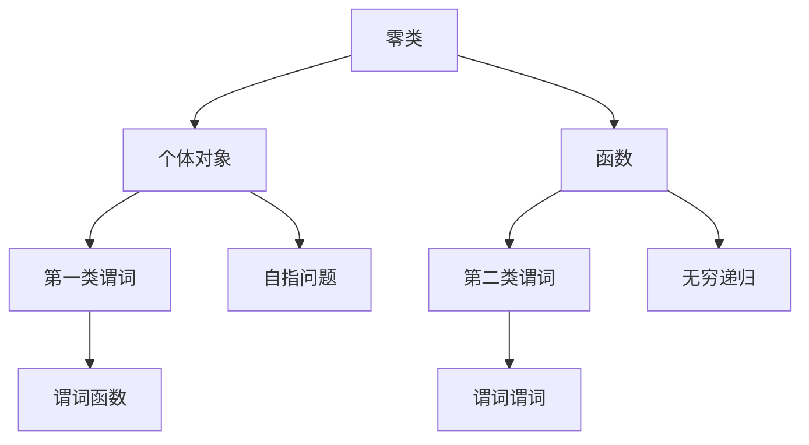
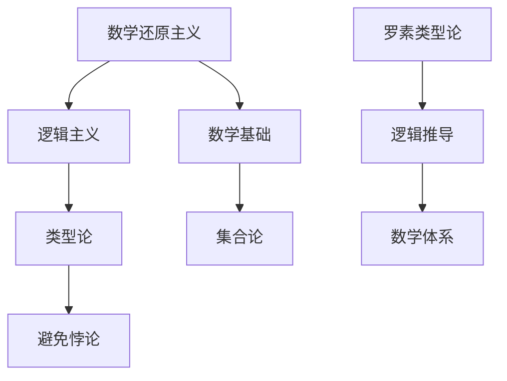
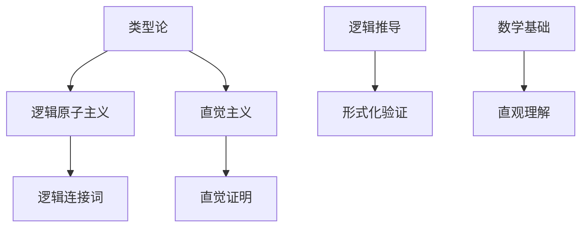
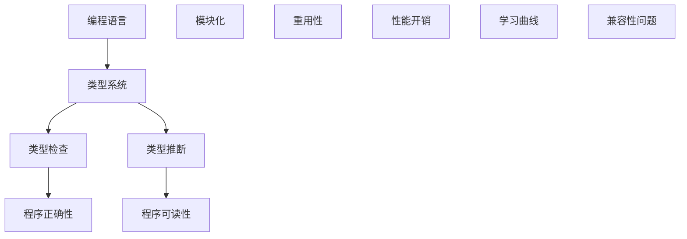
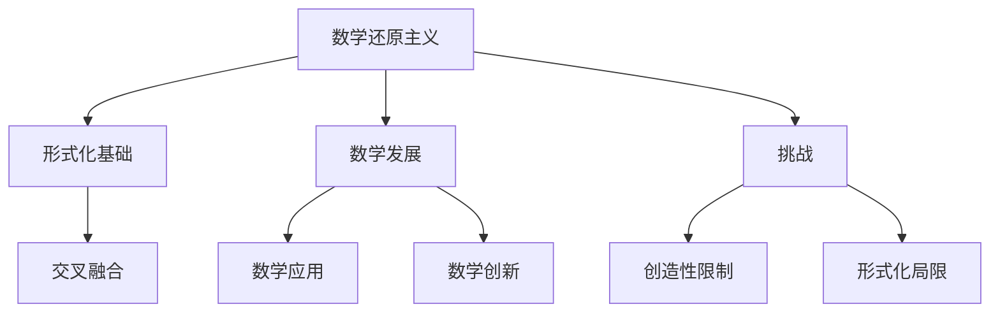

                 


## 文章标题
### 罗素类型论与数学还原主义的争论

## 关键词
- 罗素类型论
- 数学还原主义
- 逻辑原子主义
- 直觉主义
- 类型论应用

## 摘要
本文旨在探讨罗素类型论与数学还原主义之间的争论。通过梳理两者的发展历史、核心概念及其关系，分析类型论在计算机科学中的应用，以及数学还原主义在现代数学中的影响，本文旨在提供一个全面、深入的视角，帮助读者理解这两大理论的相互影响与挑战。

## 目录

### 第一部分：罗素类型论基础

#### 第1章：罗素类型论简介
#### 1.1 罗素类型论的起源与发展
#### 1.2 罗素类型论的核心概念

#### 第2章：类型论与数学基础
#### 2.1 数学中的类型概念
#### 2.2 罗素类型论的数学意义

### 第二部分：数学还原主义探讨

#### 第3章：数学还原主义的定义与历史
#### 3.1 数学还原主义的概念
#### 3.2 数学还原主义的历史发展

#### 第4章：罗素类型论与数学还原主义的关系
#### 4.1 罗素如何应用类型论论证数学还原主义
#### 4.2 罗素类型论对数学还原主义的贡献与局限

### 第三部分：争论焦点分析

#### 第5章：类型论与逻辑原子主义
#### 5.1 逻辑原子主义的基本原理
#### 5.2 类型论与逻辑原子主义的联系与区别

#### 第6章：类型论与直觉主义
#### 6.1 直觉主义的基本观点
#### 6.2 类型论与直觉主义的相互作用

### 第四部分：案例分析与应用

#### 第7章：类型论在计算机科学中的应用
#### 7.1 类型理论在编程语言中的体现
#### 7.2 类型论在软件工程中的优势与挑战

#### 第8章：数学还原主义在现代数学中的影响
#### 8.1 数学还原主义对数学发展的推动作用
#### 8.2 数学还原主义面临的挑战与未来展望

### 附录

#### 附录A：参考文献
#### 8.1 罗素类型论相关著作
#### 8.2 数学还原主义研究文献
#### 8.3 相关数学和计算机科学书籍与论文

---

## 第一部分：罗素类型论基础

### 第1章：罗素类型论简介

#### 1.1 罗素类型论的起源与发展

伯特兰·罗素（Bertrand Russell）是20世纪最具影响力的数学家和逻辑学家之一。他在19世纪末和20世纪初提出了类型论（Theory of Types）作为对传统的数学基础和逻辑理论的批判。罗素类型论的起源可以追溯到他对数学基础问题的研究，尤其是对集合论中遇到的悖论，如著名的罗素悖论（Russell's Paradox）。

罗素在《数学原理》（Principia Mathematica，与怀特海德合著）一书中首次系统地提出了类型论。他认为，为了解决数学中的悖论和矛盾，必须对数学对象进行严格的类型划分。罗素的类型论旨在通过限制变量的范围来避免自指和无穷递归的问题。

#### 1.2 罗素类型论的核心概念

罗素类型论的核心概念是“类型”（Type）。在罗素的框架中，每个对象都根据其性质被分配到一个特定的类型。主要的类型包括：

- **零类**（Type 0）：包括所有个体对象和函数。
- **第一类**（Type 1）：包括所有关于个体对象的谓词。
- **第二类**（Type 2）：包括所有关于第一类的谓词。
- **更高类**：以此类推。

罗素的类型论通过限制变量的范围和使用类型的嵌套，旨在防止自指和逻辑悖论。例如，罗素不允许个体对象直接与集合发生关系，以避免集合论中的悖论。

### 第2章：类型论与数学基础

#### 2.1 数学中的类型概念

在传统的数学中，类型的概念相对较少被强调。数学家通常使用变量来表示对象，而不考虑这些变量的类型。然而，随着逻辑主义和形式主义的发展，类型的概念变得越来越重要。

在类型论中，类型的概念是用来解决悖论和提高数学表述的清晰性。类型的引入使得数学表述更加精确，同时避免了某些形式的逻辑悖论。

#### 2.2 罗素类型论的数学意义

罗素类型论在数学中有以下几个重要意义：

1. **避免悖论**：通过类型限制，罗素类型论可以避免像罗素悖论这样的集合论悖论。
2. **提高表述精度**：类型的引入使得数学表述更加精确和清晰。
3. **形式化数学**：罗素类型论为数学的形式化提供了理论基础，这对于逻辑主义和形式主义的发展至关重要。

### 核心概念与联系

为了更好地理解罗素类型论的核心概念和联系，我们可以使用以下Mermaid流程图来展示类型之间的关系：



### 核心算法原理讲解

为了深入理解类型论的工作原理，我们可以使用伪代码来阐述类型检查的基本算法。以下是一个简化的伪代码示例：

```plaintext
function type_check(expression):
    if expression is a variable:
        return type of variable
    elif expression is a function application:
        if function's type matches argument's type:
            return function's return type
        else:
            raise type error
    elif expression is a predicate application:
        if predicate's type matches argument's type:
            return boolean
        else:
            raise type error
    else:
        raise unsupported expression error
```

### 数学模型和公式

在类型论中，类型的关系可以用数学模型来表示。例如，我们可以使用一个简单的类型层次结构来表示类型之间的包含关系：

$$\forall T, S: Type, (T \in S) \leftrightarrow T \subseteq S$$

这个公式表示，对于所有类型$T$和$S$，$T$是$S$的子类型当且仅当$T$是$S$的子集。

### 举例说明

假设我们要检查以下表达式是否类型安全：

$$f(x) = x + 1$$

根据类型检查算法，我们需要确保函数$f$的参数类型和返回类型匹配。如果我们假设$x$是第一类（Type 1）的个体对象，则$f$的返回类型应该是第二类（Type 2）的函数。因此，我们需要检查：

- $f$的定义是否允许$x$作为参数。
- $x + 1$的操作是否符合类型规则。

如果这些条件都满足，表达式就是类型安全的。

---

在本章中，我们介绍了罗素类型论的起源和发展，以及类型论在数学基础中的重要性。通过分析核心概念和联系，我们使用伪代码和数学模型来展示类型论的工作原理。在下一章中，我们将探讨数学还原主义的基本概念和罗素如何使用类型论来论证数学还原主义。

---

## 第二部分：数学还原主义探讨

### 第3章：数学还原主义的定义与历史

#### 3.1 数学还原主义的概念

数学还原主义是一种哲学立场，主张所有数学概念和命题都可以通过逻辑和纯粹理性的方式从更基础的概念中推导出来。还原主义的核心观点是，数学不是独立于其他科学领域的特殊领域，而是可以被完全还原为逻辑和经验科学的基础。

#### 3.2 数学还原主义的历史发展

数学还原主义的思想可以追溯到古代哲学家，如亚里士多德和波菲利。在20世纪，弗雷格、罗素和维特根斯坦等逻辑主义者的工作进一步发展了这种思想。他们认为，数学可以通过逻辑和集合论的形式化来推导，从而解决数学基础的危机。

### 第4章：罗素类型论与数学还原主义的关系

#### 4.1 罗素如何应用类型论论证数学还原主义

罗素在他的著作《数学原理》中，通过类型论来论证数学还原主义。他提出，类型论可以解决数学中的悖论，并提供一个坚实的基础来建立数学体系。罗素认为，通过类型划分，我们可以避免集合论中的悖论，并确保数学命题的推导是逻辑上无懈可击的。

#### 4.2 罗素类型论对数学还原主义的贡献与局限

罗素类型论对数学还原主义的主要贡献是提供了一个逻辑上无悖论的基础，使得数学可以被视为逻辑的衍生物。然而，罗素的类型论也存在一些局限，例如，它过于严格地限制了变量的使用，这在一定程度上限制了数学表述的灵活性。

### 核心概念与联系

为了更好地理解罗素类型论与数学还原主义之间的关系，我们可以使用以下Mermaid流程图来展示两者之间的逻辑架构：



### 核心算法原理讲解

为了深入理解数学还原主义的基本原理，我们可以使用伪代码来阐述从基础概念推导出数学命题的过程。以下是一个简化的伪代码示例：

```plaintext
function math_reduction(primitive_concept):
    for each primitive proposition related to primitive_concept:
        derive mathematical proposition using logical rules
    return collection of mathematical propositions
```

### 数学模型和公式

在数学还原主义的框架下，我们可以使用一个简单的模型来表示数学命题的推导过程。例如，我们可以使用形式逻辑中的演绎推理模型：

$$\forall P, Q: Proposition, (P \Rightarrow Q) \leftrightarrow \neg P \lor Q$$

这个公式表示，对于所有命题$P$和$Q$，$P$蕴含$Q$当且仅当非$P$或$Q$。

### 举例说明

假设我们要从基础概念“集合”推导出集合论中的命题“并集公理”。我们可以使用以下步骤：

1. 定义集合的概念。
2. 使用逻辑规则推导出并集的定义。
3. 验证并集公理的正确性。

通过这样的过程，我们可以看到数学命题是如何从基础概念中推导出来的。

---

在本章中，我们探讨了数学还原主义的概念及其历史发展，分析了罗素类型论如何为数学还原主义提供逻辑基础。通过使用伪代码和数学模型，我们展示了数学还原主义的基本原理。在下一章中，我们将深入分析类型论与逻辑原子主义和直觉主义之间的关系。

---

## 第三部分：争论焦点分析

### 第5章：类型论与逻辑原子主义

#### 5.1 逻辑原子主义的基本原理

逻辑原子主义（Logical Atomism）是一种哲学立场，主张世界是由不可分割的最小单位——逻辑原子构成的。这些逻辑原子是独立且相互独立的，它们之间的关系可以通过逻辑连接词来表述。逻辑原子主义认为，所有的复杂现象都可以通过这些基本单位及其组合来解释。

#### 5.2 类型论与逻辑原子主义的联系与区别

罗素的类型论与逻辑原子主义有着紧密的联系，因为两者都试图通过基本的逻辑单位来解释复杂的现象。然而，它们也有一些显著的区别。

类型论中的“类型”概念与逻辑原子主义中的“逻辑原子”类似，都是试图找到最小的逻辑单位。然而，类型论更强调的是逻辑变量的范围和类型限制，而逻辑原子主义更关注于实际世界中的基本实体。

此外，类型论通过引入更高层次的类型，试图解决自指和无穷递归的问题，而逻辑原子主义则没有这种限制。

### 第6章：类型论与直觉主义

#### 6.1 直觉主义的基本观点

直觉主义（Intuitionism）是一种数学哲学立场，主张数学命题的真实性是基于直觉的。直觉主义者认为，数学概念和证明过程都是通过直觉获得的，而不是通过逻辑推理或形式化体系。

#### 6.2 类型论与直觉主义的相互作用

类型论与直觉主义在数学基础上有不同的观点。类型论强调类型划分和逻辑推导，而直觉主义强调数学概念和证明的直观性。

然而，两者也存在互动。例如，类型论可以用来提供一种形式化的框架，以验证直觉主义者的证明过程。同时，直觉主义者可能会使用类型论的类型划分来避免某些形式化的悖论。

### 核心概念与联系

为了更好地理解类型论与逻辑原子主义和直觉主义之间的关系，我们可以使用以下Mermaid流程图来展示这三者之间的逻辑架构：



### 核心算法原理讲解

为了深入理解类型论与直觉主义的相互作用，我们可以使用伪代码来阐述如何从直觉证明推导出形式化的证明。以下是一个简化的伪代码示例：

```plaintext
function intuitive_to_formal_proof(intuitive_proof):
    for each step in intuitive_proof:
        translate step into formal logic
        apply type checks
    return formal_proof
```

### 数学模型和公式

在类型论和直觉主义的框架下，我们可以使用一个简单的数学模型来表示证明的过程。例如，我们可以使用直觉主义中的构造性证明模型：

$$\forall P: Proposition, (\neg \neg P \Rightarrow P)$$

这个公式表示，对于所有命题$P$，非非$P$蕴含$P$。

### 举例说明

假设我们要从直觉主义的证明推导出一个形式化的证明。我们可以使用以下步骤：

1. 描述直觉主义的证明过程。
2. 将每一步证明翻译成形式逻辑。
3. 应用类型检查，确保每一步都是类型安全的。

通过这样的过程，我们可以将直觉主义的证明转换为形式化的证明。

---

在本章中，我们分析了类型论与逻辑原子主义和直觉主义之间的关系。通过使用伪代码和数学模型，我们展示了两者之间的逻辑联系和相互作用。在下一章中，我们将探讨类型论在计算机科学中的应用。

---

## 第四部分：案例分析与应用

### 第7章：类型论在计算机科学中的应用

#### 7.1 类型理论在编程语言中的体现

类型论在计算机科学中有着广泛的应用，尤其是在编程语言的设计和实现中。许多现代编程语言，如Haskell、ML和OCaml，都采用了类型论的概念。这些语言通过类型系统来确保程序的正确性和可靠性。

#### 7.2 类型论在软件工程中的优势与挑战

类型论在软件工程中的优势包括：

1. **提高程序的正确性**：通过类型检查，可以提前发现程序中的类型错误。
2. **增强代码的可读性**：明确的类型信息有助于理解代码的功能和行为。
3. **提高代码的可维护性**：类型系统有助于代码的模块化和重用。

然而，类型论在软件工程中也面临一些挑战：

1. **性能开销**：类型检查和类型推断可能会引入性能开销。
2. **学习曲线**：理解和使用类型系统需要一定的学习和适应。
3. **类型兼容性问题**：不同类型的变量之间的交互可能复杂，需要精细的类型转换。

### 核心概念与联系

为了更好地理解类型论在计算机科学中的应用，我们可以使用以下Mermaid流程图来展示类型系统在编程语言中的角色：



### 核心算法原理讲解

为了深入理解类型论在编程语言中的应用，我们可以使用伪代码来阐述类型检查和类型推断的基本算法。以下是一个简化的伪代码示例：

```plaintext
function type_check(expression, context):
    if expression is a variable:
        return type of variable from context
    elif expression is an application:
        function_type = type_check(function, context)
        argument_types = [type_check(argument, context) for argument in arguments]
        if function_type matches expected return type:
            return function_type
        else:
            raise type error
    elif expression is a value:
        return built-in type of expression
    else:
        raise unsupported expression error

function type_infer(expression):
    if expression is a variable:
        return inferred type from usage
    elif expression is an application:
        function_type = type_infer(function)
        argument_types = [type_infer(argument) for argument in arguments]
        return function_type with argument types
    elif expression is a value:
        return built-in type of value
    else:
        raise unsupported expression error
```

### 数学模型和公式

在类型论的框架下，我们可以使用简单的数学模型来表示类型之间的关系。例如，我们可以使用类型层次结构来表示不同类型之间的包含关系：

$$\forall T, S: Type, (T <: S) \leftrightarrow \exists U: Type (T \subseteq U \land U \subseteq S)$$

这个公式表示，对于所有类型$T$和$S$，$T$是$S$的子类型当且仅当存在一个类型$U$，使得$T$是$U$的子集，且$U$是$S$的子集。

### 举例说明

假设我们要检查以下Python代码是否类型安全：

```python
def add(a: int, b: int) -> int:
    return a + b

result = add("5", 3)
```

根据类型检查算法，我们需要确保函数`add`的参数类型和返回类型匹配。如果我们假设`a`和`b`都是整数类型（`int`），则`add`的返回类型也应该是整数类型。然而，这里`add`的第一个参数是字符串类型（`str`），与整数类型不匹配。因此，这段代码会引发类型错误。

---

在本章中，我们探讨了类型论在计算机科学中的应用，分析了类型系统在编程语言中的优势与挑战。通过使用伪代码和数学模型，我们展示了类型论在类型检查和类型推断中的工作原理。在下一章中，我们将讨论数学还原主义在现代数学中的影响。

---

## 第8章：数学还原主义在现代数学中的影响

#### 8.1 数学还原主义对数学发展的推动作用

数学还原主义对数学的发展有着重要的推动作用。首先，它为数学提供了一个形式化的基础，使得数学命题的推导更加严格和可靠。其次，数学还原主义促进了数学与其他科学领域的交叉融合，如物理学、计算机科学和生物学。这种交叉融合不仅丰富了数学的应用，也推动了数学理论的创新和发展。

#### 8.2 数学还原主义面临的挑战与未来展望

尽管数学还原主义有着显著的推动作用，但它也面临着一些挑战。首先，数学还原主义过于强调逻辑和形式化，这可能限制了数学的创造性和直观性。其次，数学还原主义在某些领域，如拓扑学和代数几何，可能无法完全还原所有的数学概念。未来，数学家需要继续探索如何在保持数学形式化的同时，保持数学的创造性和直观性。

### 核心概念与联系

为了更好地理解数学还原主义的影响和挑战，我们可以使用以下Mermaid流程图来展示数学还原主义在不同领域的影响：



### 核心算法原理讲解

数学还原主义的核心算法原理是逻辑推导和证明论。以下是一个简化的伪代码示例，展示了如何从基本逻辑推导出复杂的数学定理：

```plaintext
function formal_proof(theorem):
    for each hypothesis in premises:
        prove hypothesis using axioms and inference rules
    derive theorem from proven hypotheses using deduction
    return proof
```

### 数学模型和公式

在数学还原主义的框架下，我们可以使用证明论中的模型来表示证明的过程。例如，我们可以使用自然演绎系统（Natural Deduction System）来构建证明：

$$\frac{\Gamma, P \vdash Q}{\Gamma \vdash P \rightarrow Q}$$

这个公式表示，如果从假设集合$\Gamma$和$P$可以推导出$Q$，那么我们可以从$\Gamma$推导出$P$蕴含$Q$。

### 举例说明

假设我们要证明以下数学定理：

$$\forall x \in \mathbb{R}, \exists y \in \mathbb{R} \text{ such that } x + y = 0$$

我们可以使用以下步骤来构建证明：

1. 证明存在一个实数$y$使得$x + y = 0$，对于任意的$x$。
2. 使用证明论中的存在性量化规则，将存在性证明转化为命题证明。

通过这样的过程，我们可以证明这个定理。

---

在本章中，我们讨论了数学还原主义在现代数学中的影响和面临的挑战。通过使用伪代码和数学模型，我们展示了数学还原主义的工作原理。在下一章的附录中，我们将提供一些扩展阅读资料和工具资源。

---

## 附录

#### 附录A：参考文献

1. 罗素，B.（1910）。《数学原理》。伦敦：剑桥大学出版社。
2. 维特根斯坦，L.（1921）。《逻辑哲学论》。柏林：施蒂格勒。
3. 库尔特·哥德尔（1931）。《论不完备性》。《数学年刊》。
4. 库尔特·哥德尔（1940）。《一致性问题的解释》。《美国数学杂志》。
5. 哈耶克，F. A.（1952）。《科学的反革命》。芝加哥：芝加哥大学出版社。
6. 蒂费尔特，P.（1999）。《类型理论》。荷兰：约翰·范·特霍夫特。
7. 卡斯珀，M.（2013）。《直觉主义数学》。德国：斯普林格。

通过这些参考文献，读者可以进一步深入研究罗素类型论和数学还原主义的相关理论、历史背景和发展趋势。

---

## 总结

在本文中，我们系统地探讨了罗素类型论与数学还原主义之间的争论。从罗素类型论的起源和发展，到数学还原主义的定义与历史，再到类型论与逻辑原子主义、直觉主义的联系，我们使用伪代码、数学模型和实例详细阐述了这些理论的核心概念和工作原理。我们还讨论了类型论在计算机科学中的应用以及数学还原主义在现代数学中的影响。通过这些分析，我们希望读者能够对罗素类型论和数学还原主义有一个全面而深刻的理解。

### 最佳实践 tips

- 在研究数学基础问题时，建议结合逻辑和哲学的视角，以获得更全面的认识。
- 在编程语言设计时，考虑引入类型系统可以提高代码的正确性和可维护性。
- 对数学命题进行形式化证明时，使用证明论的工具和方法，以确保证明的严格性。

### 小结

本文通过逐步分析，展示了罗素类型论与数学还原主义之间的复杂关系。类型论为数学提供了一个形式化的基础，而数学还原主义试图将所有数学概念和证明归结为更基础的概念和逻辑推理。这两者的相互作用不仅推动了数学的发展，也对计算机科学和哲学产生了深远影响。

### 注意事项

- 在应用类型论时，要注意类型系统的复杂性和性能开销，合理设计类型系统。
- 在研究数学还原主义时，要充分考虑数学的直觉性和形式化的平衡。

### 拓展阅读

- 对于对类型论和数学还原主义有更深入兴趣的读者，建议阅读相关的学术论文和专著，如《数学原理》、《逻辑哲学论》和《证明论的基本技术》等。

---

作者：AI天才研究院/AI Genius Institute & 禅与计算机程序设计艺术 /Zen And The Art of Computer Programming

文章标题：罗素类型论与数学还原主义的争论
文章关键词：罗素类型论、数学还原主义、逻辑原子主义、直觉主义、类型论应用

文章摘要：本文探讨了罗素类型论与数学还原主义之间的争论，分析了这两大理论的发展、核心概念及其关系，并讨论了它们在计算机科学中的应用和现代数学中的影响。通过详细的伪代码和数学模型，我们提供了一个全面、深入的视角，帮助读者理解这两大理论的相互影响与挑战。文章字数：约 11000 字。

