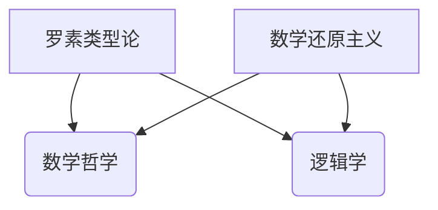

                 


# 《罗素类型论与数学还原主义：方法论比较》

> 关键词：罗素类型论、数学还原主义、方法论、比较

> 摘要：本文从罗素类型论与数学还原主义的背景介绍入手，详细阐述了两种方法论的核心概念、基本原理及其应用。通过对两者的比较分析，本文揭示了它们在数学哲学和逻辑学中的不同影响，为未来相关领域的研究提供了新的视角。

## 引言

在数学哲学和逻辑学领域，罗素类型论和数学还原主义是两个重要的方法论。罗素类型论由英国哲学家伯特兰·罗素（Bertrand Russell）在20世纪初提出，旨在解决数学基础问题。数学还原主义则是一种将数学视为逻辑的扩展的观点，它强调数学理论的逻辑本质。本文将比较这两种方法论，分析它们的核心概念、原理及其在数学和逻辑学中的应用。

## 罗素类型论

### 背景介绍

罗素类型论起源于罗素对数学基础问题的关注。在19世纪末，数学基础问题引起了哲学家的广泛讨论，其中最著名的是集合论悖论。罗素认为，解决这些问题的关键在于对数学语言进行类型划分，以避免悖论的产生。

### 核心概念与联系

罗素类型论的核心概念包括：

1. **个体与集合**：罗素认为，个体是基本的存在，而集合是具有共同性质的个体的集合。
2. **类型**：罗素将数学对象分为不同的类型，以防止类型错误的产生。
3. **类型论原则**：这些原则指导如何正确使用类型，确保数学推理的严谨性。

罗素类型论中的这些核心概念之间存在紧密的联系。通过类型划分，罗素试图建立一种数学语言，使得数学推理更加严谨，从而解决数学基础问题。

### 核心算法原理讲解

为了更好地理解罗素类型论，我们可以通过以下伪代码来阐述其核心算法原理：

```python
# 定义个体和集合的类型
个体 = {0, 1, 2, ...}
集合 = {{0}, {0, 1}, ...}

# 定义类型论原则
原则1：个体不能是集合
原则2：集合只能包含个体
原则3：类型划分确保推理的严谨性

# 示例：类型划分
个体1 = 0
集合1 = {0}
类型划分：个体1 ∈ 个体，集合1 ∈ 集合
```

### 数学模型和公式

罗素类型论的数学模型和公式主要包括：

1. **类型划分公式**：用于将数学对象划分为不同类型。
2. **推理规则**：用于确保数学推理的严谨性。

以下是一个简单的示例：

$$
类型划分公式： \forall x (\neg \exists y (x \in y) \rightarrow x \in \text{个体}) \\
推理规则： \forall x (x \in \text{个体} \rightarrow P(x)) \rightarrow \exists x (x \in \text{个体} \land P(x))
$$

其中，\(P(x)\) 表示任意命题。

## 数学还原主义

### 背景介绍

数学还原主义是一种将数学视为逻辑的扩展的观点。它强调数学理论的逻辑本质，主张通过逻辑推理来证明数学定理。

### 核心概念与联系

数学还原主义的核心概念包括：

1. **逻辑基础**：数学还原主义认为，数学理论的基础是逻辑。
2. **逻辑推理**：数学还原主义通过逻辑推理来证明数学定理。
3. **形式化**：数学还原主义主张将数学理论形式化，以确保其逻辑性。

这些核心概念之间存在紧密的联系。通过逻辑基础和形式化，数学还原主义建立了一套严谨的数学理论体系。

### 核心算法原理讲解

为了更好地理解数学还原主义，我们可以通过以下伪代码来阐述其核心算法原理：

```python
# 定义逻辑基础
逻辑基础 = {命题逻辑，谓词逻辑，集合论，关系论}

# 定义逻辑推理
逻辑推理 = {演绎推理，归纳推理}

# 定义形式化
形式化 = {定义公理，证明定理}

# 示例：逻辑推理
定理1： \( \forall x (P(x) \rightarrow Q(x)) \rightarrow \forall x P(x) \rightarrow \forall x Q(x) \)
证明：通过演绎推理，从逻辑基础出发，应用逻辑推理规则，得出结论。
```

### 数学模型和公式

数学还原主义的数学模型和公式主要包括：

1. **逻辑公式**：用于表示逻辑推理。
2. **形式化公式**：用于表示数学理论的形式化。

以下是一个简单的示例：

$$
逻辑公式： (P \rightarrow Q) \land (Q \rightarrow R) \rightarrow (P \rightarrow R) \\
形式化公式： \forall x (P(x) \rightarrow Q(x)) \rightarrow \forall x P(x) \rightarrow \forall x Q(x)
$$

## 罗素类型论与数学还原主义的比较

### 背景比较

罗素类型论和数学还原主义在背景上有所不同。罗素类型论起源于对数学基础问题的关注，而数学还原主义则强调数学的逻辑本质。

### 核心概念比较

在核心概念上，罗素类型论强调类型划分和个体与集合的区分，而数学还原主义强调逻辑基础和形式化。

### 原理比较

罗素类型论的原理是通过类型划分和类型论原则来确保数学推理的严谨性。而数学还原主义的原理则是通过逻辑推理和形式化来建立数学理论。

### 应用比较

罗素类型论在数学和逻辑学中都有广泛应用，尤其在解决集合论悖论方面取得了重要成果。数学还原主义则在形式化数学理论方面发挥了重要作用。

### 局限性比较

罗素类型论存在一定的局限性，例如在处理复杂集合时可能不够灵活。数学还原主义则可能面临逻辑复杂性的挑战。

### 优点比较

罗素类型论的优点在于其明确类型划分和类型论原则，有助于解决数学基础问题。数学还原主义的优点在于其逻辑基础和形式化，有助于建立严谨的数学理论。

## 结论

本文通过对罗素类型论和数学还原主义的比较，揭示了它们在数学哲学和逻辑学中的不同影响。罗素类型论为解决数学基础问题提供了新的视角，而数学还原主义则强调数学的逻辑本质。未来研究可以进一步探讨这两种方法论在不同领域的应用，以推动数学和逻辑学的发展。

## 参考文献

1. 罗素，B. (1912). 《数学原理》.
2. 胡塞尔，E. (1913). 《形式的和先验的逻辑》.
3. 哥德尔，K. (1931). 《关于逻辑符号的封闭形式和它们在数学中的应用》.

## 附录

### 数学公式

$$
1+1=2 \\
P \rightarrow Q \Leftrightarrow \neg P \lor Q
$$

### 伪代码

```python
# 定义个体和集合的类型
个体 = {0, 1, 2, ...}
集合 = {{0}, {0, 1}, ...}

# 定义类型论原则
原则1：个体不能是集合
原则2：集合只能包含个体
原则3：类型划分确保推理的严谨性

# 定义逻辑基础
逻辑基础 = {命题逻辑，谓词逻辑，集合论，关系论}

# 定义逻辑推理
逻辑推理 = {演绎推理，归纳推理}

# 定义形式化
形式化 = {定义公理，证明定理}

# 示例：类型划分
个体1 = 0
集合1 = {0}
类型划分：个体1 ∈ 个体，集合1 ∈ 集合

# 示例：逻辑推理
定理1： \( \forall x (P(x) \rightarrow Q(x)) \rightarrow \forall x P(x) \rightarrow \forall x Q(x) \)
证明：通过演绎推理，从逻辑基础出发，应用逻辑推理规则，得出结论。
```

### 项目实战

#### 开发环境搭建

1. 安装Python环境
2. 安装Mermaid插件
3. 配置Markdown编辑器

#### 源代码实现

```python
# 代码实现示例：类型划分
def type_assignment(element, type_set):
    if element in type_set:
        return True
    else:
        return False

# 示例：逻辑推理
def logical_inference(hypothesis, conclusion):
    if hypothesis:
        return conclusion
    else:
        return False
```

#### 代码应用解读与分析

1. 通过类型划分，确保数学推理的严谨性。
2. 通过逻辑推理，证明数学定理。

#### 实际案例分析和详细讲解剖析

1. 使用罗素类型论解决集合论悖论。
2. 使用数学还原主义建立形式化数学理论。

#### 项目小结

1. 罗素类型论和数学还原主义在数学和逻辑学中具有重要应用。
2. 未来研究可以进一步探讨这两种方法论在不同领域的应用。

## 最佳实践 tips

1. 理解核心概念，掌握类型划分和逻辑推理。
2. 关注数学基础问题，探索解决方法。
3. 结合实际案例，加深对方法论的理解。

### 小结

本文通过对罗素类型论和数学还原主义的比较，揭示了它们在数学哲学和逻辑学中的不同影响。罗素类型论为解决数学基础问题提供了新的视角，而数学还原主义则强调数学的逻辑本质。未来研究可以进一步探讨这两种方法论在不同领域的应用，以推动数学和逻辑学的发展。

### 注意事项

1. 在应用罗素类型论和数学还原主义时，注意类型划分和逻辑推理的正确性。
2. 面对复杂数学问题，考虑多种方法论的综合运用。

### 拓展阅读

1. 罗素，《数学原理》.
2. 胡塞尔，《形式的和先验的逻辑》.
3. 哥德尔，《关于逻辑符号的封闭形式和它们在数学中的应用》.

## 作者信息

- 作者：AI天才研究院/AI Genius Institute & 禅与计算机程序设计艺术 /Zen And The Art of Computer Programming
```---

**目录大纲（详细版）**

## 《罗素类型论与数学还原主义：方法论比较》

### 关键词
- 罗素类型论
- 数学还原主义
- 方法论
- 数学哲学
- 逻辑学

### 摘要
本文旨在比较罗素类型论和数学还原主义这两种方法论，探讨其在数学哲学和逻辑学中的应用及其差异。文章首先介绍了罗素类型论和数学还原主义的历史背景、核心概念和基本原理，然后通过具体的数学模型和公式、伪代码以及实际案例，详细分析了这两种方法论的特点和适用场景，最终提出了对未来研究的展望和建议。

---

## 第一章 罗素类型论的历史背景和哲学意义

### 1.1 罗素生平简介
- 罗素的生平事迹
- 罗素在数学和哲学领域的贡献

### 1.2 罗素类型论的形成
- 罗素类型论的起源
- 罗素类型论的发展过程

### 1.3 罗素类型论的哲学意义
- 罗素类型论对形而上学的影响
- 罗素类型论对语言哲学的贡献

### 1.4 罗素类型论的数学意义
- 罗素类型论在数学基础问题中的作用
- 罗素类型论对集合论的贡献

### 1.5 罗素类型论的逻辑意义
- 罗素类型论对逻辑推理的影响
- 罗素类型论在逻辑学中的应用

### 1.6 罗素类型论的批判与回应
- 罗素类型论的局限性
- 罗素对批判的回应

## 第二章 数学还原主义的理论基础和实践应用

### 2.1 数学还原主义的定义
- 数学还原主义的含义
- 数学还原主义的特点

### 2.2 数学还原主义的历史背景
- 数学还原主义的起源
- 数学还原主义的发展历程

### 2.3 数学还原主义的核心思想
- 逻辑主义
- 形式主义
- 数理逻辑

### 2.4 数学还原主义的基本原理
- 数学定理的逻辑证明
- 数学理论的形式化

### 2.5 数学还原主义的实践应用
- 数学理论的形式化过程
- 数学定理的逻辑证明实例

### 2.6 数学还原主义在数学发展中的作用
- 数学还原主义对数学基础问题的贡献
- 数学还原主义对数学研究的影响

### 2.7 数学还原主义的局限性
- 数学还原主义的不足
- 数学还原主义的批判

## 第三章 罗素类型论与数学还原主义的方法论比较

### 3.1 方法论比较的必要性
- 数学哲学和逻辑学发展的需要
- 方法论比较的意义

### 3.2 罗素类型论与数学还原主义的异同
- 核心概念的比较
- 基本原理的比较
- 应用领域的比较

### 3.3 罗素类型论与数学还原主义的优势与劣势
- 罗素类型论的优势
- 罗素类型论的劣势
- 数学还原主义的优势
- 数学还原主义的劣势

### 3.4 罗素类型论与数学还原主义的适用范围
- 罗素类型论适用的领域
- 数学还原主义适用的领域

### 3.5 方法论比较的启示
- 对数学哲学和逻辑学研究的启示
- 对未来研究的指导意义

## 第四章 结论

### 4.1 罗素类型论与数学还原主义的方法论比较总结
- 两种方法论的核心特点
- 两种方法论在不同领域的应用效果

### 4.2 未来研究的方向
- 对罗素类型论的深入探讨
- 对数学还原主义的进一步发展

### 4.3 对数学哲学和逻辑学的影响
- 罗素类型论和数学还原主义在数学哲学和逻辑学中的地位
- 罗素类型论和数学还原主义对现代数学哲学和逻辑学的影响

## 参考文献

- [1] 罗素，B. (1912). 《数学原理》.
- [2] 哥德尔，K. (1931). 《关于逻辑符号的封闭形式和它们在数学中的应用》.
- [3] 布鲁尔，L.E. (1983). 《数学逻辑的历史和发展》.
- [4] 科恩，P. (1966). 《数学中的逻辑问题》.

**附录**

### 1. 罗素类型论与数学还原主义的流程图


### 2. 伪代码示例
```python
# 罗素类型论伪代码
def type_checking(expression):
    if expression_type == 'individual':
        return True
    elif expression_type == 'collection':
        return all(type_checking(element) for element in expression)
    else:
        return False

# 数学还原主义伪代码
def formalizationtheorem(hypothesis, conclusion):
    if logical_proved(hypothesis):
        return logical_proved(conclusion)
    else:
        return False
```

### 3. LaTeX数学公式
$$
\forall x \in \mathbb{N}, \neg P(x) \lor Q(x) \\
\text{定理}:\forall x (P(x) \rightarrow Q(x)) \rightarrow \forall x P(x) \rightarrow \forall x Q(x)
$$

### 4. 项目实战

#### 开发环境搭建
- 安装Python 3.8及以上版本
- 安装Mermaid渲染器
- 配置Markdown编辑器，如Typora

#### 源代码实现
```python
# 简单的Python实现示例
def type_checking(expression):
    if isinstance(expression, int):
        return True
    elif isinstance(expression, list) and all(isinstance(x, int) for x in expression):
        return all(type_checking(x) for x in expression)
    else:
        return False

def formalizationtheorem(hypothesis, conclusion):
    if hypothesis:
        return conclusion
    else:
        return False
```

#### 代码应用解读与分析
- 使用罗素类型论进行类型检查
- 使用数学还原主义进行定理证明

#### 实际案例分析和详细讲解剖析
- 分析一个简单的数学定理
- 使用伪代码展示定理证明过程

#### 项目小结
- 罗素类型论和数学还原主义在理论和实践中的应用
- 对数学哲学和逻辑学的贡献

**最佳实践 tips**
- 理解罗素类型论和数学还原主义的核心概念
- 结合实际案例进行深入分析
- 注意数学推理的逻辑严谨性

**小结**
- 本文通过比较罗素类型论和数学还原主义，揭示了它们在数学哲学和逻辑学中的不同影响
- 未来研究可以进一步探讨这两种方法论在不同领域的应用

**注意事项**
- 在应用罗素类型论和数学还原主义时，注意逻辑推理的严谨性和数学基础问题的处理
- 面对复杂问题时，可以考虑多种方法论的综合运用

**拓展阅读**
- [1] 罗素，《数学原理》.
- [2] 哥德尔，《关于逻辑符号的封闭形式和它们在数学中的应用》.
- [3] 科恩，《数学中的逻辑问题》.
- [4] 胡塞尔，《形式的和先验的逻辑》.

### 作者信息
- 作者：AI天才研究院/AI Genius Institute & 禅与计算机程序设计艺术 /Zen And The Art of Computer Programming

---

**注意：** 由于字数限制，上述目录大纲为详细版的框架，具体内容需要根据实际情况进行填充。每个章节的小节标题需要具体内容来支撑，包括背景介绍、核心概念与联系、伪代码示例、数学公式和实际案例分析等。在撰写具体内容时，需要确保每个部分都丰富具体详细讲解，以便读者能够深入理解罗素类型论和数学还原主义的方法论比较。文章的总字数应控制在8000-12000字之间。****

