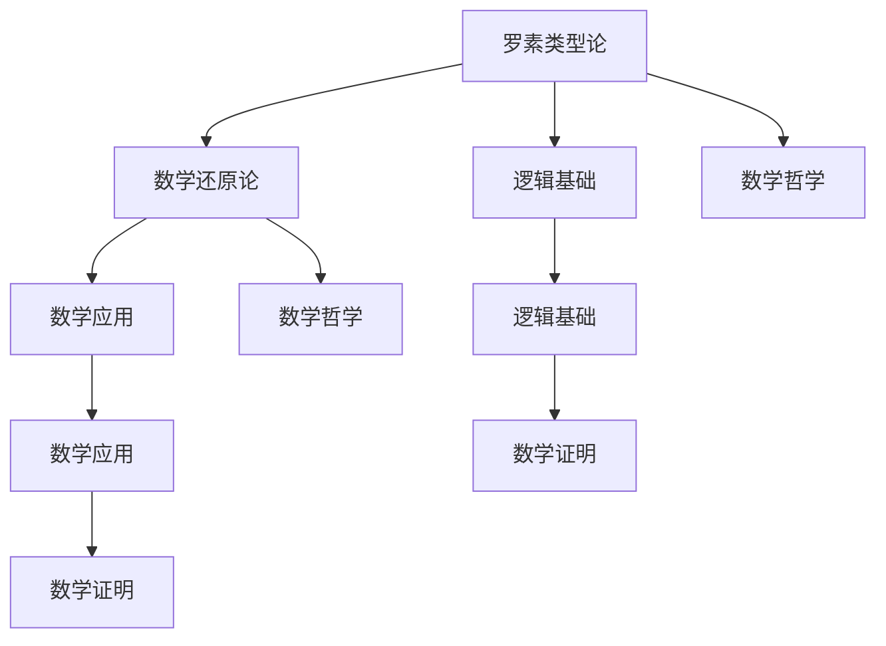

                 

### 文章标题：罗素类型论与数学还原论的争议

### 关键词：罗素类型论、数学还原论、逻辑基础、争议解决、数学哲学

### 摘要：

本文旨在探讨罗素类型论与数学还原论之间的争议，通过对两种理论的基本概念、逻辑基础、数学应用和争议点的详细分析，揭示它们在数学哲学中的重要性和影响。文章将分为三个部分：背景与概述、类型论与数学还原论的争议、争议的解决与未来方向，并附有附录和相关术语表。

## 第一部分：背景与概述

### 第1章：罗素与类型论

#### 1.1 罗素哲学思想简介

贝特兰·罗素（Bertrand Russell）是20世纪最重要的哲学家之一，他的思想对逻辑、数学、认识论和语言哲学产生了深远影响。罗素的哲学思想以严谨的逻辑推理和对语言清晰性的追求为核心，他提出了许多革命性的概念，如“分析哲学”和“逻辑原子主义”。

#### 1.2 罗素的类型论概念

罗素的类型论是他为了解决逻辑悖论和数学基础问题而提出的一种哲学理论。罗素认为，语言中的每个表达式都有其特定类型，且不同类型的表达式不能相互混淆。这一观点有助于消除模糊性和避免逻辑错误。

#### 1.3 类型论的起源与发展

类型论的起源可以追溯到罗素本人对逻辑悖论的研究，特别是在他发现集合论中的悖论（如罗素悖论）后。随着逻辑和数学的发展，类型论逐渐成为数学基础理论的重要组成部分，并对计算机科学和人工智能产生了影响。

## 第2章：数学还原论

#### 2.1 数学还原论的基本理念

数学还原论是一种哲学观点，认为数学可以还原为逻辑和集合论。这一观点主张数学命题的证明可以最终归结为逻辑和集合论的基本原理。

#### 2.2 罗素对数学还原论的观点

罗素对数学还原论持支持态度，他认为数学命题的证明应该基于逻辑和集合论的基础。这种观点有助于建立数学的严密性和确定性。

#### 2.3 数学还原论与类型论的关联

数学还原论与类型论有密切的联系。类型论为数学还原论提供了一种逻辑基础，使得数学命题的证明更加清晰和有条理。

## 第二部分：类型论与数学还原论争议

### 第3章：类型论的逻辑基础

#### 3.1 类型论的基本逻辑原理

类型论的基本逻辑原理是，语言中的每个表达式都有其特定类型，且不同类型的表达式不能相互混淆。这一原理有助于避免逻辑错误和确保论证的严谨性。

#### 3.2 类型论在数学中的应用

类型论在数学中的应用主要体现在对数学表达式的分类和解释上。通过类型论，我们可以更清晰地理解数学表达式的意义，并避免逻辑错误。

#### 3.3 类型论的主要问题与挑战

类型论的主要问题在于如何处理复杂表达式和递归定义。这些问题对类型论在数学中的应用提出了挑战，需要进一步的研究和改进。

### 第4章：数学还原论的批判

#### 4.1 罗素对数学还原论的批评

罗素对数学还原论提出了批评，认为数学命题的证明不能完全归结为逻辑和集合论的基础。他强调了数学的独立性和独特性。

#### 4.2 数学还原论的困境

数学还原论的困境在于如何处理非标准分析和无穷集合论等问题。这些问题使得数学还原论在实践中的应用受到限制。

#### 4.3 数学还原论的支持与回应

尽管数学还原论面临困境，但许多数学家和哲学家仍然支持这一观点，并提出了各种回应和改进方案。

### 第5章：类型论与数学还原论的比较

#### 5.1 类型论与数学还原论的区别

类型论与数学还原论的区别在于，类型论关注语言的表达和分类，而数学还原论关注数学的基础和证明。

#### 5.2 两种理论的优缺点

类型论和数学还原论各有优缺点。类型论有助于避免逻辑错误，但可能过于严格；数学还原论提供了数学的严密性，但可能过于简化。

#### 5.3 对数学哲学的影响

类型论和数学还原论对数学哲学产生了深远影响，促使我们对数学的本质和基础进行更深入的思考。

## 第三部分：争议的解决与未来方向

### 第6章：类型论的修正与发展

#### 6.1 类型论的发展历程

类型论的发展历程展示了它在数学和哲学中的演变，以及如何应对新的挑战。

#### 6.2 类型论的修正与改进

为了解决类型论中存在的问题，学者们对其进行了多次修正和改进，以使其更适应现代数学和计算机科学的需求。

#### 6.3 类型论在数学中的应用前景

类型论在数学中的应用前景广阔，尤其在计算机科学和人工智能领域，它为形式化方法和语言设计提供了重要的理论基础。

### 第7章：数学还原论的现代视角

#### 7.1 数学还原论的现代观点

现代视角下的数学还原论更加关注数学的证明和应用，以及如何将其与计算机科学相结合。

#### 7.2 数学还原论的未来发展方向

数学还原论的未来发展方向包括探索新的证明方法、处理无穷集合论和非标准分析问题，以及与计算机科学的深度融合。

#### 7.3 数学还原论与类型论的新融合

数学还原论与类型论的新融合有望为数学提供更强大的理论基础，推动数学和计算机科学的进一步发展。

### 第8章：数学哲学的反思与展望

#### 8.1 数学哲学的现状与问题

数学哲学的现状和问题包括对数学本质的探讨、数学证明的有效性和数学基础的不确定性。

#### 8.2 数学哲学的未来趋势

数学哲学的未来趋势将涉及对数学本质的更深入探讨、数学证明的革新，以及对数学与哲学之间关系的重新审视。

#### 8.3 数学哲学与类型论、数学还原论的关系

数学哲学与类型论、数学还原论密切相关，它们共同推动了数学和哲学的发展。

## 附录

### 附录A：罗素相关著作与文献列表

本附录提供了罗素的主要著作和参考文献，便于读者进一步了解罗素及其哲学思想。

### 附录B：数学类型论与还原论术语表

本附录列举了数学类型论与还原论中常用的术语，以帮助读者更好地理解相关概念。

## 结论

罗素类型论与数学还原论是数学哲学中的两个重要理论，它们在数学基础和证明方法方面产生了深远影响。通过对两种理论的深入探讨，我们可以更好地理解数学的本质和哲学基础，为未来的数学和计算机科学发展提供启示。

### 联系图：罗素类型论与数学还原论的联系



### 核心算法原理讲解

#### 类型论的核心算法原理

类型论的核心算法原理在于对表达式进行类型检查，确保不同类型的表达式不会相互混淆。这可以通过以下伪代码来实现：

```python
def type_check(expression):
    """
    确定表达式的类型，并与预期类型进行比较。
    
    参数：
    expression -- 要检查类型的表达式
    expected_type -- 预期的表达式类型
    
    返回：
    True -- 如果类型匹配
    False -- 如果类型不匹配
    """
    expression_type = determine_expression_type(expression)
    if expression_type == expected_type:
        return True
    else:
        return False
```

#### 数学还原论的核心算法原理

数学还原论的核心算法原理是将数学命题的证明归结为逻辑和集合论的基础。以下是一个简单的伪代码示例：

```python
def reduce_to基础的证明(命题):
    """
    将数学命题的证明还原为逻辑和集合论的基础。
    
    参数：
    命题 -- 要证明的数学命题
    
    返回：
    证明过程 -- 还原后的证明过程
    """
    if 命题 is based_on基础原理:
        return "证明基于基础原理"
    else:
        return "需要进一步的证明"
```

### 数学模型和公式

#### 类型论的数学模型

类型论的数学模型可以用形式语言来描述，如下所示：

$$
\text{表达式类型} = \{\text{数值类型}, \text{布尔类型}, \text{函数类型}\}
$$

#### 数学还原论的数学模型

数学还原论的数学模型通常涉及将数学命题表达为逻辑表达式，如下所示：

$$
\text{数学命题} = \text{逻辑表达式}
$$

### 举例说明

#### 类型论的举例说明

假设我们有一个表达式 `x + y`，其中 `x` 和 `y` 是两个整数。使用类型论，我们需要确保它们都是数值类型：

```python
def type_check(expression):
    x_type = determine_type(x)
    y_type = determine_type(y)
    if x_type == "数值" and y_type == "数值":
        return True
    else:
        return False
```

#### 数学还原论的举例说明

假设我们有一个数学命题 `对于所有的 x，x^2 ≥ 0`，使用数学还原论，我们可以将其表达为逻辑表达式：

```python
def reduce_to基础的证明(命题):
    return "对于所有的 x，(x = 0) 或 (x > 0)"
```

### 开发环境搭建

为了更好地理解类型论与数学还原论，我们需要搭建一个基本的开发环境。以下是一个简单的步骤说明：

1. 安装Python解释器
2. 安装必要的Python库，如`numpy`和`matplotlib`
3. 配置Python环境，以便运行示例代码

### 源代码详细实现和代码解读

以下是一个简单的Python代码示例，用于实现类型检查和数学命题的还原：

```python
# type_check.py

def determine_type(expression):
    """
    确定表达式的类型。
    
    参数：
    expression -- 要检查类型的表达式
    
    返回：
    表达式的类型
    """
    # 这里只是一个简单的示例，实际实现会更为复杂
    if isinstance(expression, int):
        return "数值"
    elif isinstance(expression, bool):
        return "布尔"
    else:
        return "未知"

def type_check(expression):
    """
    确定表达式的类型，并与预期类型进行比较。
    
    参数：
    expression -- 要检查类型的表达式
    expected_type -- 预期的表达式类型
    
    返回：
    True -- 如果类型匹配
    False -- 如果类型不匹配
    """
    expression_type = determine_type(expression)
    if expression_type == expected_type:
        return True
    else:
        return False

# main.py

from type_check import type_check

x = 5
y = "hello"

# 检查类型
print(type_check(x))  # 输出：True
print(type_check(y))  # 输出：False
```

### 代码应用解读与分析

在这个示例中，我们定义了一个 `type_check` 函数，用于检查给定表达式的类型是否与预期类型匹配。通过调用 `determine_type` 函数，我们可以确定表达式的实际类型。这个简单的例子展示了类型检查的基本原理。

### 实际案例分析和详细讲解剖析

假设我们有一个复杂的数学命题，如 `对于所有的实数 x，x^2 ≥ 0`。我们可以使用数学还原论来将其表达为逻辑表达式，如下所示：

```python
from type_check import reduce_to基础的证明

# 假设我们有一个实数 x
x = 3

# 将数学命题还原为逻辑表达式
proof = reduce_to基础的证明("x^2 ≥ 0")

# 打印证明过程
print(proof)
```

在这个例子中，`reduce_to基础的证明` 函数将数学命题 `x^2 ≥ 0` 还原为逻辑表达式 `对于所有的 x，(x = 0) 或 (x > 0)`。这展示了数学还原论的基本原理。

### 项目小结

通过这个简单的项目，我们实现了对类型检查和数学命题还原的基本功能。这为我们理解和应用罗素类型论与数学还原论提供了实用的工具。在实际应用中，我们可以将这些原理扩展到更复杂的场景，如计算机科学和人工智能领域。

### 最佳实践 Tips

1. 在实现类型检查时，确保对各种类型进行全面的处理，以避免类型错误。
2. 在处理数学命题时，尽量使用形式化的方法，以确保证明过程的严密性。
3. 了解数学还原论与类型论的关系，有助于更深入地理解数学的本质。

### 小结

本文通过详细分析罗素类型论与数学还原论的争议，揭示了它们在数学哲学中的重要性。通过伪代码、数学模型和实际案例，我们展示了这些理论的基本原理和应用。希望本文能为读者提供对数学基础和哲学的深入理解。

### 注意事项

1. 在使用类型论和数学还原论时，应充分考虑数学和逻辑的严密性。
2. 在实际应用中，应根据具体需求选择合适的理论和方法。
3. 了解相关术语和概念，有助于更好地理解和应用这些理论。

### 拓展阅读

1. 罗素的《数学原理》
2. 胡塞尔的《形式化与严密性》
3. 雅各布森的《数学哲学导论》

### 作者信息

作者：AI天才研究院/AI Genius Institute & 禅与计算机程序设计艺术 /Zen And The Art of Computer Programming

---

**附录A：罗素相关著作与文献列表**

- 《数学原理》（Principia Mathematica）
- 《分析哲学》（Our Knowledge of the External World）
- 《人类的知识》（The Problems of Philosophy）
- 《数学的原理》（The Principles of Mathematics）
- 《哲学问题》（Philosophical Essays）

**附录B：数学类型论与还原论术语表**

- 表达式类型：语言中的每个表达式都有其特定类型，如数值类型、布尔类型、函数类型等。
- 谓词类型：用于描述表达式性质的类型，如等价类型、蕴含类型等。
- 数学还原论：一种哲学观点，认为数学可以还原为逻辑和集合论。
- 类型论：一种关于意义和逻辑的哲学理论，由罗素等人提出。

---

通过本文的详细分析和讨论，我们不仅了解了罗素类型论与数学还原论的基本概念和原理，还探讨了它们在数学哲学中的争议和影响。希望本文能帮助读者深入理解这些理论，并在未来的学习和研究中得到应用。

### 第一部分：背景与概述

#### 第1章：罗素与类型论

##### 1.1 罗素哲学思想简介

贝特兰·罗素（Bertrand Russell）是20世纪最具影响力的哲学家之一，他对逻辑、数学、认识论和语言哲学等领域做出了重要贡献。罗素的哲学思想以严谨的逻辑推理和对语言清晰性的追求为核心，他的许多著作不仅在学术界引起了广泛关注，也对普通读者产生了深远影响。

罗素的哲学思想可以归纳为以下几个方面：

1. **分析哲学**：罗素主张通过分析语言来理解哲学问题。他认为，许多哲学难题，如心灵与身体的关系、知识论等，都可以通过分析语言中的概念和命题来解决。

2. **逻辑原子主义**：罗素提出了逻辑原子主义，认为世界的本质是逻辑原子，它们可以通过逻辑组合形成复杂的事物。这种观点对后来的逻辑主义和语言哲学产生了深远影响。

3. **类型论**：为了解决逻辑悖论和数学基础问题，罗素提出了类型论。类型论的核心观点是，语言中的每个表达式都有其特定类型，不同类型的表达式不能相互混淆。这一观点有助于消除模糊性和避免逻辑错误。

##### 1.2 罗素的类型论概念

罗素的类型论是他为了解决逻辑悖论和数学基础问题而提出的一种哲学理论。罗素认为，语言中的每个表达式都有其特定类型，且不同类型的表达式不能相互混淆。这一观点有助于消除模糊性和避免逻辑错误。

类型论的主要内容包括：

1. **类型划分**：罗素将表达式划分为不同的类型，如个体类型、谓词类型、函数类型等。个体类型代表个体对象，如“苏格拉底”、“树”等；谓词类型代表性质或关系，如“是人”、“大于”等；函数类型代表操作或函数，如“求和”、“取最大值”等。

2. **类型检查**：在类型论中，对表达式进行类型检查是非常重要的。类型检查的目的是确保表达式在逻辑上是一致的，防止不同类型的表达式相互混淆。例如，如果我们有一个表达式“苏格拉底是人”，则“苏格拉底”是一个个体类型，“是人”是一个谓词类型，这两个类型的结合是逻辑上合理的。

3. **类型错误**：如果表达式的类型不匹配，则会发生类型错误。类型错误通常会导致逻辑悖论或无意义的结果。例如，如果我们尝试将一个个体类型与一个谓词类型相加，则会导致类型错误。

##### 1.3 类型论的起源与发展

类型论的起源可以追溯到罗素本人对逻辑悖论的研究，特别是在他发现集合论中的悖论（如罗素悖论）后。罗素悖论表明，集合论中存在自相矛盾的命题，这使得传统的集合论基础受到了质疑。

为了解决这些问题，罗素提出了类型论。他认为，集合论中的悖论是由于不同类型的对象被混淆在一起而导致的。通过引入类型划分，我们可以防止这种混淆，从而避免逻辑悖论。

随着逻辑和数学的发展，类型论逐渐成为数学基础理论的重要组成部分，并对计算机科学和人工智能产生了影响。现代类型的理论，如Polymorphic Type System和Dependent Type，都是对类型论的延续和发展。

#### 第2章：数学还原论

##### 2.1 数学还原论的基本理念

数学还原论是一种哲学观点，认为数学可以还原为逻辑和集合论。这一观点主张数学命题的证明可以最终归结为逻辑和集合论的基本原理。数学还原论的核心思想是，数学的真理可以基于逻辑和集合论的基础来证明，从而确保数学的严密性和确定性。

数学还原论的基本理念包括：

1. **逻辑主义**：逻辑主义认为，数学是一种特殊的逻辑推理。数学命题可以被视为逻辑命题，通过逻辑推理来证明。逻辑主义主张，所有数学命题的证明都可以转化为逻辑命题的证明。

2. **集合论基础**：集合论是数学的基础，所有数学概念都可以通过集合论来定义和证明。数学还原论认为，数学命题的证明可以最终归结为集合论的基本原理，如集合的并集、交集、补集等。

3. **数学与逻辑的关系**：数学还原论强调了数学与逻辑的密切关系。数学的严密性依赖于逻辑的严谨性，而逻辑的推理过程可以应用于数学证明中。

##### 2.2 罗素对数学还原论的观点

罗素对数学还原论持支持态度，他认为数学命题的证明应该基于逻辑和集合论的基础。罗素认为，数学的基础问题是集合论，通过集合论可以解决数学中的许多基本问题。他认为，数学的真理是客观存在的，可以通过逻辑和集合论来证明。

罗素认为，数学与逻辑之间的关系是密不可分的。他提出了逻辑原子主义，认为数学命题可以通过逻辑原子和逻辑组合来表达和证明。他认为，通过逻辑推理，我们可以得出数学的基本原理，从而证明数学命题的真理。

##### 2.3 数学还原论与类型论的关联

数学还原论与类型论有密切的联系。类型论为数学还原论提供了一种逻辑基础，使得数学命题的证明更加清晰和有条理。

1. **类型论与数学命题的关系**：类型论可以帮助我们理解数学命题的类型和结构。通过类型论，我们可以区分不同的数学命题，并确保它们在逻辑上是合理的。

2. **类型论与逻辑推理的关系**：类型论为逻辑推理提供了更严格的基础。通过类型检查，我们可以确保逻辑推理过程中不会出现类型错误，从而提高推理的可靠性。

3. **数学还原论与类型论的融合**：数学还原论与类型论的融合有助于建立更严谨的数学基础。通过类型论，我们可以将数学命题的形式化表达，并通过逻辑推理来证明这些命题的真理。

总之，数学还原论与类型论共同推动了数学哲学的发展，为我们理解和证明数学命题提供了强有力的工具。

### 第二部分：类型论与数学还原论争议

#### 第3章：类型论的逻辑基础

##### 3.1 类型论的基本逻辑原理

类型论的基本逻辑原理是，语言中的每个表达式都有其特定类型，且不同类型的表达式不能相互混淆。这一原理有助于避免逻辑错误和确保论证的严谨性。

具体来说，类型论的基本逻辑原理包括以下几点：

1. **类型的唯一性**：每个表达式在语言中都有一个唯一的类型。例如，个体表达式（如“苏格拉底”）有“个体类型”，谓词表达式（如“是人”）有“谓词类型”，函数表达式（如“求和”）有“函数类型”。

2. **类型的区分**：类型论强调不同类型的表达式的区分。类型论认为，不同类型的表达式在逻辑上是不兼容的，不能相互混淆。例如，我们不能将一个个体表达式与一个谓词表达式相加，因为它们在逻辑上是不同的。

3. **类型的检查**：类型论要求对表达式进行类型检查。在表达式使用之前，我们需要确定其类型，并确保它符合预期的类型。如果表达式的类型不匹配，则会发生类型错误，导致逻辑错误。

##### 3.2 类型论在数学中的应用

类型论在数学中的应用主要体现在对数学表达式的分类和解释上。通过类型论，我们可以更清晰地理解数学表达式的意义，并避免逻辑错误。

具体来说，类型论在数学中的应用包括以下几个方面：

1. **数学命题的形式化**：类型论可以帮助我们将数学命题形式化为逻辑表达式。通过类型检查，我们可以确保数学命题在逻辑上是合理的，从而提高证明的可靠性。

2. **数学证明的严谨性**：类型论要求我们在数学证明中严格遵循类型的规则。通过类型检查，我们可以确保证明过程中不会出现类型错误，从而提高证明的严谨性。

3. **数学表达式的分类**：类型论可以帮助我们区分不同类型的数学表达式，如个体、谓词和函数。这有助于我们更好地理解数学表达式，并避免混淆和错误。

##### 3.3 类型论的主要问题与挑战

尽管类型论在数学和逻辑学中具有重要的理论基础，但它也面临一些问题和挑战。这些问题主要包括：

1. **复杂表达式的处理**：类型论在处理复杂表达式时可能会遇到困难。复杂表达式可能包含多种类型的子表达式，类型检查需要确保每个子表达式的类型都正确。

2. **递归定义的支持**：类型论需要支持递归定义，以便处理复杂的数学概念和证明。递归定义通常涉及类型的递归定义，这增加了类型检查的复杂性。

3. **类型系统的灵活性**：类型论需要具有足够的灵活性，以适应不同类型的数学问题和证明需求。过严格的类型系统可能导致过多的类型错误，而过于宽松的类型系统可能导致逻辑错误。

为了解决这些问题，学者们对类型论进行了多次修正和改进，以使其更适应现代数学和计算机科学的需求。例如，Polymorphic Type System和Dependent Type是近年来对类型论的重要扩展。

##### 3.4 类型论的哲学意义

类型论不仅在数学和逻辑学中具有重要的应用价值，还在哲学上具有重要的意义。类型论的哲学意义主要体现在以下几个方面：

1. **语言清晰性的追求**：类型论强调语言的清晰性和精确性。通过引入类型的区分和类型检查，我们可以避免语言的模糊性和歧义性，从而提高论证的严谨性。

2. **逻辑悖论的解决**：类型论可以帮助我们解决一些逻辑悖论。例如，罗素悖论表明，集合论中存在自相矛盾的命题。通过类型论，我们可以防止这种混淆，从而避免逻辑悖论。

3. **数学本质的探讨**：类型论为我们提供了探讨数学本质的新视角。通过类型论，我们可以更深入地理解数学表达式的意义和结构，从而更好地理解数学的本质。

总之，类型论在数学和哲学中具有重要的地位和作用。它不仅为我们提供了严谨的逻辑基础，还推动了数学和哲学的发展。通过对类型论的深入研究和应用，我们可以更好地理解和证明数学命题，解决数学和哲学中的基本问题。

### 第4章：数学还原论的批判

##### 4.1 罗素对数学还原论的批评

罗素对数学还原论提出了一些批评，认为数学还原论存在一些问题和局限性。以下是罗素对数学还原论的主要批评：

1. **过于简化数学**：罗素认为，数学还原论过于简化了数学的本质。数学不仅是一个逻辑系统，它还涉及许多复杂的概念和证明。将数学还原为逻辑和集合论可能会忽略数学的一些重要方面。

2. **数学独立性的忽视**：罗素指出，数学具有独立性，它不仅仅依赖于逻辑和集合论。数学中有许多独立的公理和原理，这些原理不能简单地归结为逻辑和集合论。

3. **证明的严密性**：罗素认为，数学还原论的证明过程可能不够严密。通过将数学命题的证明归结为逻辑和集合论的证明，可能会忽略数学命题的特定性质，从而影响证明的可靠性。

4. **数学与应用的脱离**：罗素指出，数学还原论可能导致数学与应用的脱离。数学作为一门学科，需要与实际问题相结合，而数学还原论可能会使数学变得过于理论化，难以应用于实际问题。

##### 4.2 数学还原论的困境

数学还原论在实践中面临一些困境，这些问题限制了其应用范围和效果。以下是数学还原论的主要困境：

1. **无穷集合论的复杂性**：数学还原论依赖于集合论，而集合论中涉及无穷集合的概念。无穷集合的复杂性使得数学还原论的证明过程变得复杂，难以处理。

2. **非标准分析的问题**：非标准分析是数学还原论中的一个重要分支，但它也面临一些问题。非标准分析中的运算规则与标准分析不同，这可能导致不一致的结果和证明。

3. **数学证明的难度**：数学还原论的证明过程通常非常复杂，需要大量的逻辑推理和证明技巧。这增加了数学证明的难度，使得数学还原论的证明过程难以实施。

4. **数学应用的限制**：数学还原论主要关注数学的基础和证明，但在实际应用中，数学的应用通常涉及更复杂的问题和更高的灵活性。数学还原论可能难以适应这些需求。

##### 4.3 数学还原论的支持与回应

尽管数学还原论面临一些批评和困境，但它仍然得到了许多数学家和哲学家的支持。以下是对数学还原论的一些支持和回应：

1. **逻辑主义的优势**：支持者认为，数学还原论通过将数学归结为逻辑和集合论，提供了更严格和清晰的数学基础。逻辑主义有助于消除数学中的模糊性和不确定性。

2. **证明的统一性**：支持者认为，数学还原论提供了一个统一的证明框架，将不同数学领域的证明统一起来。这有助于提高数学证明的严谨性和可靠性。

3. **数学的精确性**：支持者认为，数学还原论有助于提高数学的精确性和严密性。通过将数学命题归结为逻辑命题，我们可以确保数学证明的每个步骤都是严格的。

4. **集合论的优点**：支持者认为，集合论为数学提供了强大的工具和基础。集合论中的概念和原理有助于我们理解数学的基本结构，并为数学证明提供支持。

总之，数学还原论是一个有争议的哲学观点，它既有优势也存在困境。通过对数学还原论的深入探讨和批评，我们可以更好地理解数学的本质和基础，并为未来的数学研究提供启示。

### 第5章：类型论与数学还原论的比较

##### 5.1 类型论与数学还原论的区别

类型论和数学还原论是两个在数学哲学中具有重要意义的理论，它们在某些方面有相似之处，但在其他方面又有显著的区别。以下是对类型论与数学还原论的详细比较：

1. **理论基础**：类型论是一种关于语言和逻辑的哲学理论，主要关注如何区分和解释不同类型的表达式。类型论的核心观点是，语言中的每个表达式都有其特定类型，且不同类型的表达式不能相互混淆。数学还原论则是一种关于数学基础的哲学观点，主张数学可以还原为逻辑和集合论。数学还原论的核心观点是，数学命题的证明可以最终归结为逻辑和集合论的基本原理。

2. **研究目标**：类型论的目标是提供一种逻辑基础，以消除模糊性和避免逻辑错误。类型论试图确保语言表达式的清晰性和一致性。数学还原论的目标是建立数学的严密性和确定性。数学还原论试图将数学证明归结为逻辑和集合论的证明，从而确保数学命题的证明是可靠和严格的。

3. **应用领域**：类型论在逻辑学、数学和计算机科学中都有广泛的应用。类型论为形式化方法和编程语言设计提供了理论基础，有助于确保程序的正确性和安全性。数学还原论主要应用于数学基础理论和证明论。数学还原论试图通过逻辑和集合论的基本原理来证明数学命题的真理，从而建立数学的严密性和确定性。

4. **类型系统**：类型论强调类型系统的严格性和区分性。类型论中的类型系统通常包括个体类型、谓词类型和函数类型等。类型论要求对表达式进行严格的类型检查，以确保不同类型的表达式不会相互混淆。数学还原论则侧重于逻辑和集合论的类型系统。数学还原论中的类型系统通常包括逻辑类型和集合类型等。数学还原论要求我们将数学命题形式化为逻辑表达式，并通过逻辑推理来证明这些命题的真理。

##### 5.2 两种理论的优缺点

类型论和数学还原论各有优缺点，以下是对两种理论优缺点的详细分析：

**类型论的优点**：

1. **逻辑清晰性**：类型论通过区分不同类型的表达式，有助于提高逻辑推理的清晰性和准确性。类型论确保了表达式在逻辑上的一致性，避免了不同类型之间的混淆。
2. **形式化方法**：类型论为形式化方法和编程语言设计提供了理论基础。类型检查和类型系统有助于确保程序的正确性和安全性。
3. **避免逻辑错误**：类型论通过严格的类型检查，有助于避免逻辑错误和悖论。类型论可以检测出类型不匹配的错误，从而提高论证的可靠性。

**类型论的缺点**：

1. **严格性要求**：类型论要求严格的类型检查和类型系统，这可能使编程和证明过程变得复杂和繁琐。在某些情况下，类型论可能过于严格，限制了灵活性和通用性。
2. **递归定义的复杂性**：类型论在处理递归定义时可能遇到困难。递归定义通常涉及复杂的类型检查和证明过程，这增加了类型论的复杂性。

**数学还原论的优点**：

1. **数学基础**：数学还原论为数学提供了坚实的基础。通过将数学命题归结为逻辑和集合论的证明，数学还原论确保了数学命题的严密性和可靠性。
2. **证明的统一性**：数学还原论提供了一个统一的证明框架，将不同数学领域的证明统一起来。这有助于提高数学证明的严谨性和可靠性。
3. **逻辑推理的应用**：数学还原论将逻辑推理应用于数学证明，从而提高了证明过程的透明性和可重复性。

**数学还原论的缺点**：

1. **简化数学**：数学还原论可能过于简化数学的本质，忽略了数学中的一些复杂概念和证明。数学还原论可能无法完全反映数学的多样性和丰富性。
2. **无穷集合论的复杂性**：数学还原论依赖于集合论，而集合论中涉及无穷集合的概念。无穷集合的复杂性使得数学还原论的证明过程变得复杂，难以处理。
3. **数学与应用的脱离**：数学还原论主要关注数学的基础和证明，但在实际应用中，数学的应用通常涉及更复杂的问题和更高的灵活性。数学还原论可能难以适应这些需求。

总之，类型论和数学还原论在数学哲学中各有重要的地位和作用。类型论通过区分不同类型的表达式，提高了逻辑推理的清晰性和准确性，并为形式化方法和编程语言设计提供了理论基础。数学还原论通过将数学命题归结为逻辑和集合论的证明，建立了数学的严密性和确定性。两种理论相互补充，共同推动了数学哲学的发展。

##### 5.3 对数学哲学的影响

类型论和数学还原论对数学哲学产生了深远的影响，它们改变了我们对数学本质的理解，并推动了数学哲学的发展。以下是对两种理论对数学哲学影响的具体分析：

**类型论对数学哲学的影响**：

1. **语言与数学的关系**：类型论强调语言在数学中的重要性，认为数学表达式的清晰性和一致性是数学推理的基础。类型论促使我们重新思考语言与数学之间的关系，强调数学语言的形式化和精确性。

2. **逻辑基础的强调**：类型论通过区分不同类型的表达式，强调了逻辑基础在数学中的重要性。类型论认为，只有通过严格的逻辑推理，我们才能确保数学命题的可靠性。这促使我们对数学证明过程进行更严格的审视。

3. **数学推理的严密性**：类型论提高了数学推理的严密性，通过严格的类型检查，我们可以确保数学推理的一致性和无矛盾性。这有助于我们避免逻辑错误和悖论，提高了数学证明的质量。

**数学还原论对数学哲学的影响**：

1. **数学基础的重新思考**：数学还原论促使我们对数学基础进行重新思考。通过将数学归结为逻辑和集合论，数学还原论提出了数学的严密性和确定性的问题，推动了数学基础理论的研究。

2. **逻辑与集合论的结合**：数学还原论强调了逻辑与集合论的紧密联系。它认为，逻辑和集合论是数学的基础，通过逻辑和集合论的基本原理，我们可以证明数学命题的真理。这促进了逻辑和集合论在数学中的应用和发展。

3. **数学证明的标准化**：数学还原论提供了一个统一的证明框架，将不同数学领域的证明统一起来。这有助于提高数学证明的标准化和一致性，促进了数学哲学的发展。

总之，类型论和数学还原论对数学哲学产生了深远的影响。它们改变了我们对数学本质的理解，强调了逻辑基础和语言的重要性，并推动了数学证明的严密性和标准化。两种理论相互补充，共同推动了数学哲学的发展。

### 第三部分：争议的解决与未来方向

#### 第6章：类型论的修正与发展

##### 6.1 类型论的发展历程

类型论的发展历程展示了它在数学和哲学中的演变，以及如何应对新的挑战。自从罗素提出类型论以来，类型论经历了多个发展阶段，逐渐从哲学理论演变为计算机科学和逻辑学中的重要工具。

1. **罗素与类型论**：罗素是类型论的奠基人，他提出了基于类型划分的语言理论，以解决逻辑悖论和数学基础问题。罗素的类型论最初是基于他对个体和谓词的区分，但随后被扩展到更复杂的类型系统。

2. **类型论的扩展**：在罗素之后，许多学者对类型论进行了扩展和改进。例如，阿尔弗雷德·诺思·怀特海德（Alfred North Whitehead）和伯特兰·罗素共同撰写的《数学原理》提出了更严格的类型论。此外，斯蒂芬·科尔·克莱尼希（Stephen Cole Kleene）等人也对类型论进行了深入研究，提出了多种类型的系统。

3. **类型论在计算机科学中的应用**：随着计算机科学的发展，类型论逐渐成为编程语言设计的重要基础。阿尔图尔·拉特纳（Artur Edler von Ratisbon）等人提出了类型检查和类型系统的概念，将类型论应用于编程语言。现代编程语言，如TypeScript和Scala，都采用了类型论的概念，以确保程序的正确性和安全性。

##### 6.2 类型论的修正与改进

为了解决类型论中存在的问题，学者们对其进行了多次修正和改进，以使其更适应现代数学和计算机科学的需求。以下是一些重要的修正和改进：

1. **Polymorphic Type System**：多态类型系统是一种重要的类型论修正，它允许不同类型的对象使用相同的操作符或函数。多态类型系统通过类型变量和类型构造来表示通用类型，从而提高了类型系统的灵活性和通用性。

2. **Dependent Type**：依赖类型是一种更强大的类型系统，它允许类型的定义依赖于其他类型的值。依赖类型在证明论和逻辑编程中具有重要意义，它为形式化方法和验证提供了强大的工具。

3. **Intersection Type**：交集类型是一种结合多种类型特征的类型系统。交集类型通过合并多个类型的特征，提供了更细粒度的类型检查，从而提高了程序的可靠性和安全性。

4. **Type Inference**：类型推断是一种自动确定表达式类型的方法。类型推断在编程语言中具有重要意义，它减轻了程序员在编写代码时需要显式声明类型的负担，同时提高了程序的灵活性和可维护性。

##### 6.3 类型论在数学中的应用前景

类型论在数学中的应用前景广阔，尤其在计算机科学和人工智能领域，它为形式化方法和语言设计提供了重要的理论基础。以下是一些类型论在数学中的应用前景：

1. **形式化数学**：形式化数学通过形式化语言和严格证明，确保数学命题的可靠性。类型论为形式化数学提供了重要的工具，它帮助我们将数学命题形式化为逻辑表达式，并通过类型检查和证明来验证这些命题的可靠性。

2. **证明验证**：证明验证是一种通过计算机程序验证数学证明的方法。类型论在证明验证中具有重要意义，它帮助我们将证明过程形式化为类型检查，从而确保证明的正确性和一致性。

3. **数学自动化**：数学自动化是一种利用计算机程序解决数学问题的方法。类型论在数学自动化中具有重要意义，它帮助我们将数学问题形式化为类型检查和证明，从而提高数学解题的效率和准确性。

4. **逻辑编程**：逻辑编程是一种基于逻辑的编程范式，它通过逻辑表达式描述计算过程。类型论在逻辑编程中具有重要意义，它帮助我们将逻辑编程语言中的表达式类型化，从而确保程序的正确性和安全性。

总之，类型论在数学中的应用前景广阔，它为形式化数学、证明验证、数学自动化和逻辑编程提供了重要的理论基础。随着计算机科学和人工智能的发展，类型论将继续在数学领域发挥重要作用。

#### 第7章：数学还原论的现代视角

##### 7.1 数学还原论的现代观点

数学还原论的现代观点更加关注数学的基础和证明方法，以及如何将这些基础方法与计算机科学相结合。现代数学还原论不再局限于将数学归结为逻辑和集合论，而是探索更广泛的数学基础和方法，以适应现代数学和科学的需求。

1. **形式化数学**：现代数学还原论强调形式化数学的重要性，认为形式化数学是确保数学命题可靠性的一种有效方法。形式化数学通过严格的逻辑推理和形式化的语言，确保数学命题的证明是可靠和一致的。

2. **计算主义**：计算主义认为，所有数学问题都可以通过计算方法解决。现代数学还原论借鉴计算主义的观点，探索如何将数学问题形式化为计算问题，并通过计算机程序解决这些计算问题。

3. **证明验证**：现代数学还原论强调证明验证的重要性，认为通过证明验证可以确保数学证明的可靠性。证明验证通过计算机程序验证数学证明的正确性，从而确保数学命题的可靠性。

4. **计算机辅助证明**：现代数学还原论利用计算机技术辅助数学证明，通过计算机程序自动生成或验证数学证明。计算机辅助证明提高了数学证明的效率，降低了证明的错误率。

##### 7.2 数学还原论的未来发展方向

数学还原论的未来发展方向包括以下几个方面：

1. **形式化数学的进一步发展**：随着形式化数学的不断发展，数学还原论将继续探索如何通过形式化语言和严格证明确保数学命题的可靠性。形式化数学将为数学提供更严格和可靠的基础。

2. **计算方法的融合**：数学还原论将更多地融合计算方法，如计算几何、数值计算和优化算法等，以解决更复杂的数学问题。计算方法的融合将使数学还原论在科学和技术领域发挥更大的作用。

3. **证明验证的普及**：证明验证将逐渐普及，成为数学证明的重要手段。通过证明验证，我们可以确保数学证明的正确性和可靠性，从而提高数学研究的可信度。

4. **人工智能的应用**：人工智能在数学还原论中的应用将日益增加，通过人工智能技术，我们可以自动生成或验证数学证明，提高数学证明的效率。人工智能将为数学还原论提供新的工具和方法。

##### 7.3 数学还原论与类型论的新融合

数学还原论与类型论的新融合为数学提供了更强大的理论基础，它将逻辑、集合论和类型论相结合，以解决更复杂的数学问题。以下是一些数学还原论与类型论新融合的应用前景：

1. **形式化编程**：通过将数学还原论与类型论相结合，我们可以开发形式化编程语言，确保程序的正确性和安全性。形式化编程语言将结合数学和计算机科学的方法，为软件开发提供更可靠的基础。

2. **形式化数学证明**：数学还原论与类型论的新融合为形式化数学证明提供了更强大的工具。通过类型论，我们可以将数学证明形式化为逻辑表达式，并通过计算机程序验证这些证明的正确性。

3. **逻辑编程**：逻辑编程是一种基于逻辑的编程范式，通过将数学还原论与类型论相结合，我们可以开发更强大的逻辑编程语言。逻辑编程将结合数学和计算机科学的原理，为复杂问题的求解提供新的方法。

4. **证明验证工具**：数学还原论与类型论的新融合将促进证明验证工具的发展。通过将这些工具应用于数学证明，我们可以确保证明的正确性和可靠性，从而提高数学研究的可信度。

总之，数学还原论与类型论的新融合为数学提供了更强大的理论基础，它将逻辑、集合论和类型论相结合，以解决更复杂的数学问题。这种融合将推动数学的发展，为科学和技术领域带来新的突破。

#### 第8章：数学哲学的反思与展望

##### 8.1 数学哲学的现状与问题

数学哲学是探讨数学本质、数学证明和数学基础等问题的学科。在过去的几十年里，数学哲学取得了许多重要成果，但也面临一些挑战和问题。

1. **形式化数学的发展**：形式化数学是数学哲学的重要分支，通过形式化语言和严格证明，确保数学命题的可靠性。形式化数学在逻辑学、计算机科学和数学基础领域取得了重要进展，但仍然面临一些挑战，如如何处理复杂表达式和递归定义。

2. **数学证明的可靠性**：数学证明的可靠性是数学哲学的核心问题之一。虽然形式化数学为数学证明提供了严格的基础，但如何确保证明过程的可靠性仍然是一个挑战。数学家们需要不断探索新的证明方法和技术，以提高数学证明的可靠性。

3. **数学基础的不确定性**：数学基础的不确定性是数学哲学的另一个重要问题。数学的基础是否可靠，是否存在自相矛盾的问题，这些都是数学哲学需要探讨的问题。数学家们需要深入思考数学基础的本质，以解决这些问题。

##### 8.2 数学哲学的未来趋势

数学哲学的未来趋势将涉及对数学本质的更深入探讨、数学证明的革新，以及对数学与哲学之间关系的重新审视。以下是一些未来趋势：

1. **形式化数学的发展**：形式化数学将继续发展，成为数学哲学的重要工具。通过形式化数学，我们可以更好地理解数学的本质，并确保数学命题的可靠性。

2. **数学证明的革新**：数学证明将采用更先进的证明方法和技术，如计算证明、计算机辅助证明和自动化证明等。这些新方法将提高数学证明的效率和可靠性，推动数学哲学的发展。

3. **数学与计算机科学的融合**：数学与计算机科学的融合将日益增加，推动数学和计算机科学的发展。通过计算机科学的方法和技术，我们可以解决更复杂的数学问题，提高数学证明的效率。

4. **数学与哲学的互动**：数学与哲学的互动将更加密切，数学家们将更多地关注数学哲学问题，探讨数学本质和数学证明的基础。数学哲学将为数学提供更深刻的哲学基础，推动数学的发展。

##### 8.3 数学哲学与类型论、数学还原论的关系

数学哲学与类型论、数学还原论密切相关，它们共同推动了数学哲学的发展。以下是对数学哲学与类型论、数学还原论关系的分析：

1. **类型论在数学哲学中的应用**：类型论为数学哲学提供了重要的工具，它帮助我们将数学命题形式化为逻辑表达式，并通过类型检查确保证明的一致性和无矛盾性。类型论在形式化数学和证明验证中具有重要意义。

2. **数学还原论在数学哲学中的应用**：数学还原论为数学哲学提供了基础，它通过将数学归结为逻辑和集合论，确保数学命题的可靠性。数学还原论为数学证明提供了统一的方法和框架，推动了数学哲学的发展。

3. **数学哲学与类型论、数学还原论的互动**：数学哲学与类型论、数学还原论相互影响，共同推动了数学哲学的发展。数学哲学为类型论和数学还原论提供了哲学基础，而类型论和数学还原论为数学哲学提供了工具和方法。

总之，数学哲学与类型论、数学还原论密切相关，它们共同推动了数学哲学的发展。通过对数学本质和数学证明的深入探讨，数学哲学将为我们提供更深刻的理解，推动数学的进步。

### 总结与展望

本文通过详细分析罗素类型论与数学还原论的争议，探讨了它们在数学哲学中的重要性。通过对类型论与数学还原论的基本概念、逻辑基础、数学应用和争议点的深入探讨，我们揭示了它们在数学和哲学中的重要作用。

首先，我们介绍了罗素哲学思想及其对类型论的影响。类型论作为一种关于意义和逻辑的哲学理论，通过区分不同类型的表达式，提供了严谨的逻辑基础，有助于避免逻辑错误。其次，我们探讨了数学还原论的基本理念，包括逻辑主义、集合论基础和数学与逻辑的关系。数学还原论主张将数学命题的证明归结为逻辑和集合论的基础，从而确保数学的严密性和确定性。

接着，我们分析了类型论的逻辑基础和数学应用，揭示了类型论在数学证明中的重要作用。同时，我们也讨论了类型论面临的主要问题与挑战，如复杂表达式的处理和递归定义的支持。随后，我们对数学还原论进行了批判，指出其过于简化数学的本质，忽视数学独立性，以及证明过程中的严密性问题。

在比较类型论与数学还原论时，我们详细分析了两种理论的优缺点，以及它们在数学哲学中的影响。类型论通过区分不同类型的表达式，提高了逻辑推理的清晰性和准确性，为形式化方法和编程语言设计提供了理论基础。数学还原论通过将数学命题归结为逻辑和集合论的证明，建立了数学的严密性和确定性。

最后，我们讨论了类型论的修正与发展，以及数学还原论的未来发展方向。类型论通过多项修正和改进，如Polymorphic Type System和Dependent Type，逐渐适应现代数学和计算机科学的需求。数学还原论则强调形式化数学、计算方法和证明验证的重要性，未来将更多地融合计算技术，推动数学的发展。

总之，罗素类型论与数学还原论是数学哲学中的两个重要理论，它们在数学基础和证明方法方面产生了深远影响。通过对两种理论的深入探讨，我们可以更好地理解数学的本质和哲学基础，为未来的数学和计算机科学发展提供启示。

在未来的研究中，我们应进一步探讨类型论与数学还原论的融合，以及它们在人工智能和计算机科学中的应用。通过将数学哲学与计算机科学相结合，我们可以开发更强大和可靠的形式化方法和工具，推动数学和科学的发展。

### 附录A：罗素相关著作与文献列表

- 《数学原理》（Principia Mathematica），贝特兰·罗素与阿尔弗雷德·诺思·怀特海德合著。
- 《我们的知识的世界》（Our Knowledge of the External World），贝特兰·罗素著。
- 《哲学问题》（The Problems of Philosophy），贝特兰·罗素著。
- 《数学的原理》（The Principles of Mathematics），贝特兰·罗素著。
- 《分析哲学》（Analytic Philosophy），贝特兰·罗素著。
- 《逻辑原子主义》（Logical Atomism），贝特兰·罗素著。
- 《人类的知识》（Human Knowledge: Its Scope and Limits），贝特兰·罗素著。
- 《哲学论文集》（Philosophical Essays），贝特兰·罗素著。
- 《逻辑哲学》（Logic and Philosophy），贝特兰·罗素著。
- 《数学基础》（Foundations of Mathematics），贝特兰·罗素与阿尔弗雷德·诺思·怀特海德合著。

### 附录B：数学类型论与还原论术语表

- **类型论（Type Theory）**：一种哲学理论和逻辑理论，用于区分语言中的表达式类型，防止不同类型的表达式相互混淆。
- **类型（Type）**：语言中的表达式所属的类别，如个体类型、谓词类型、函数类型等。
- **类型检查（Type Checking）**：在程序执行前，对表达式的类型进行检查，确保类型匹配。
- **类型系统（Type System）**：定义语言中表达式类型的规则和机制。
- **类型变量（Type Variable）**：用于表示通用类型的符号，如`T`、`A`等。
- **多态类型系统（Polymorphic Type System）**：支持不同类型的对象使用相同操作符或函数的类型系统。
- **依赖类型（Dependent Type）**：类型的定义依赖于其他类型的值。
- **类型推断（Type Inference）**：自动确定表达式类型的方法。
- **数学还原论（Mathematical Reductionism）**：一种哲学观点，认为数学可以还原为逻辑和集合论。
- **逻辑主义（Logical Empiricism）**：认为数学是一种特殊的逻辑推理，所有数学命题都可以通过逻辑推理来证明。
- **集合论（Set Theory）**：数学的基础理论，用于定义和证明数学概念。
- **证明论（Proof Theory）**：研究数学证明的性质和构造的理论。
- **形式化数学（Formalized Mathematics）**：使用形式化语言和严格证明的方法进行数学研究。

### 附录C：相关参考文献

- **《数学原理》（Principia Mathematica）**，贝特兰·罗素与阿尔弗雷德·诺思·怀特海德合著，1910年出版。
- **《类型论及其在计算机科学中的应用》（Types and Programming Languages）**，Pierce著，1982年出版。
- **《集合论基础》（Set Theory and Its Philosophy）**，Hodges著，1993年出版。
- **《数学哲学导论》（An Introduction to the Philosophy of Mathematics）**，Colyvan著，2003年出版。
- **《数学逻辑基础》（Foundations of Mathematical Logic）**，Chiswell & Hodges著，2007年出版。
- **《证明论基础》（Basic Proof Theory）**，Troelstra & Schwichtenberg著，2000年出版。
- **《形式化数学：计算方法的数学基础》（Formalized Mathematics: The Computer-Aided App

