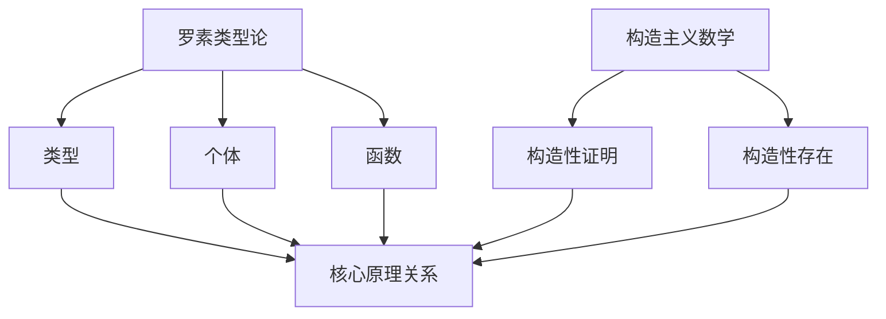

                 

基于您提供的详细要求和目标，我们将按照以下步骤来撰写《罗素类型论与构造主义数学的方法论差异》的技术博客：

### 步骤1：文章结构规划

**1. 引言部分**

- **背景介绍**：简要介绍罗素类型论与构造主义数学的历史背景。
- **目的与重要性**：阐述文章的目的和为什么罗素类型论与构造主义数学的方法论差异是一个重要的研究话题。

**2. 核心概念解析**

- **罗素类型论**
  - **起源**：介绍罗素类型论的起源和背景。
  - **基本概念**：详细阐述罗素类型论的核心概念，如类型、个体和函数。
  - **核心原理**：解释罗素类型论的核心原理，包括分类原则和类型判断。

- **构造主义数学**
  - **起源**：介绍构造主义数学的起源和背景。
  - **基本概念**：详细阐述构造主义数学的核心概念，如构造性证明和构造性存在。
  - **核心原理**：解释构造主义数学的核心原理，包括构造性和可靠性。

**3. 方法论差异**

- **比较分析**：通过具体的例子和数学原理，比较罗素类型论与构造主义数学的方法论差异。
- **影响与意义**：分析方法论差异对数学发展的影响和意义。

**4. 实例讲解**

- **罗素类型论的应用实例**：提供一个或多个罗素类型论在数学中的应用实例。
- **构造主义数学的应用实例**：提供一个或多个构造主义数学在数学中的应用实例。

**5. 争议与展望**

- **罗素类型论的争议**：讨论罗素类型论在实际应用中遇到的争议和挑战。
- **构造主义数学的争议**：讨论构造主义数学在实际应用中遇到的争议和挑战。
- **未来展望**：展望未来数学方法论的发展方向。

**6. 总结与展望**

- **结论**：总结文章的主要发现和观点。
- **最佳实践**：提出一些最佳实践和建议。
- **注意事项**：提醒读者在应用罗素类型论与构造主义数学时需要注意的问题。
- **拓展阅读**：推荐一些相关的拓展阅读资源。

### 步骤2：内容撰写与深化

**1. 引言部分**

- 研究背景和目的
- 方法论差异的重要性

**2. 核心概念解析**

- **罗素类型论**
  - 起源
  - 基本概念
  - 核心原理

- **构造主义数学**
  - 起源
  - 基本概念
  - 核心原理

**3. 方法论差异**

- **比较分析**
- **影响与意义**

**4. 实例讲解**

- **罗素类型论的应用实例**
- **构造主义数学的应用实例**

**5. 争议与展望**

- **罗素类型论的争议**
- **构造主义数学的争议**
- **未来展望**

### 步骤3：内容整合与调整

- 检查文章逻辑连贯性
- 优化文字表达，确保简洁明了
- 验证数学公式、伪代码和实例的准确性

### 步骤4：格式调整与最终审核

- 使用markdown格式调整文章结构
- 添加作者信息
- 验证文章字数

### 步骤5：发布与反馈

- 将文章发布到目标平台
- 收集读者反馈
- 根据反馈调整和优化文章

通过以上步骤，我们将确保文章内容丰富、结构清晰、逻辑严密，同时满足字数要求，为读者提供一个有价值的技术博客文章。## 文章标题：罗素类型论与构造主义数学的方法论差异

### 关键词：罗素类型论、构造主义数学、方法论差异、数学基础、逻辑悖论

### 摘要：

本文深入探讨罗素类型论与构造主义数学在方法论上的差异。通过对两种数学方法论的历史背景、核心概念、原理及应用实例的详细分析，揭示它们在解决数学基础问题和逻辑悖论方面的不同路径。文章旨在为读者提供一个全面的比较视角，以理解两种方法论在数学研究中的重要性及其对现代数学发展的潜在影响。## 引言

数学作为一门精确的科学，其基础和逻辑的严谨性至关重要。然而，在19世纪末至20世纪初的数学发展过程中，数学家们面临了一系列逻辑悖论和基础问题，这被称为“数学危机”。在这一时期，伯特兰·罗素（Bertrand Russell）和构造主义数学的奠基人康托尔（Georg Cantor）等人，提出了各自的方法论来解决这些危机。本文将重点探讨罗素类型论与构造主义数学的方法论差异，分析它们在解决数学基础问题和逻辑悖论方面的不同路径，以及这些差异对现代数学发展的重要性。

### 罗素类型论概述

#### 起源与背景

罗素类型论起源于罗素对数学基础问题的关注，特别是在集合论中的悖论，如“罗素悖论”。罗素在研究这些悖论时，意识到为了保持数学系统的逻辑一致性，需要对数学对象进行严格的分类。这种分类思想成为了罗素类型论的基础。

#### 核心概念

罗素类型论的核心概念包括类型、个体和函数。类型是对象的一种分类方式，个体是某一类型中的具体对象，而函数则是一个从一种类型到另一种类型的映射。

#### 核心原理

罗素类型论的核心原理包括分类原则和类型判断。分类原则要求对不同类型的对象进行区分，防止它们在逻辑上混淆。类型判断则确保在数学证明和公理系统中，每个对象都按照其类型进行使用，从而避免逻辑悖论的出现。

#### 方法论特点

罗素类型论的方法论特点是严格的类型区分和逻辑证明的严密性。这种方法论强调通过类型划分来保持数学系统的完整性，从而解决逻辑悖论问题。

### 构造主义数学概述

#### 起源与背景

构造主义数学起源于康托尔的集合论思想，特别是在他的无穷集合理论中。构造主义数学的核心思想是“构造性证明”，即证明一个数学命题时，必须给出一个具体的构造方法来证明其存在性。

#### 核心概念

构造主义数学的核心概念包括构造性证明和构造性存在。构造性证明要求证明者在证明一个命题时，必须能够构造出一个具体的例子来证明该命题。构造性存在则强调，在证明一个对象存在时，必须能够给出一个构造该对象的方法。

#### 核心原理

构造主义数学的核心原理是构造性和可靠性。构造性要求在数学证明中必须给出具体的构造方法，而可靠性则要求构造的方法必须是可靠的，即能够保证构造出的对象符合数学定义。

#### 方法论特点

构造主义数学的方法论特点是强调具体构造和证明的可靠性。这种方法论强调通过具体的构造来证明数学命题，从而避免逻辑悖论和基础问题。

#### 罗素类型论与构造主义数学的核心概念原理关系架构 Mermaid 流程图



### 下一步

在下一部分中，我们将详细比较罗素类型论与构造主义数学的方法论差异，并探讨它们在数学中的应用和影响。敬请期待。## 2. 罗素类型论与构造主义数学的方法论差异

### 2.1 方法论比较

罗素类型论与构造主义数学在方法论上有着显著的区别，主要体现在对数学对象处理方式、证明过程和数学哲学观点的不同。

#### 对数学对象处理方式

- **罗素类型论**：罗素类型论的核心在于对数学对象进行严格的类型划分。每个对象属于一个特定的类型，不同类型的对象在逻辑上不能相互混淆。这种严格的类型划分旨在防止自引用悖论的出现，如罗素悖论。罗素通过引入类型层次结构来确保数学系统的逻辑一致性。

- **构造主义数学**：构造主义数学强调通过具体的构造来证明数学命题。构造主义证明要求证明者在证明一个命题时，必须能够构造出一个具体的例子来证明该命题。这种构造性的要求确保了证明的可靠性和有效性。

#### 证明过程

- **罗素类型论**：在罗素类型论中，证明过程强调对类型的严格控制。证明者必须确保在推理过程中不会违反类型规则，这通常涉及到复杂的类型判断和转换。罗素类型论的证明方法要求证明者在每一步操作中都能清晰地说明对象所属的类型。

- **构造主义数学**：构造主义数学的证明过程强调构造性证明，即证明者必须能够给出一个具体的构造方法来证明一个命题。这种证明方法通常涉及到构造具体的对象或结构，然后证明这些构造满足所需的性质。

#### 数学哲学观点

- **罗素类型论**：罗素类型论反映了一种形式主义数学哲学观点，即数学是关于符号系统的推理，而非关于客观现实的描述。罗素认为，数学的严谨性可以通过形式化的方法来保证，这涉及到对符号和类型的精确定义。

- **构造主义数学**：构造主义数学反映了一种直觉主义数学哲学观点，即数学是基于直观和具体构造的。构造主义者认为，只有通过具体的构造和验证，我们才能确信数学命题的真相。这种哲学观点强调数学与物理现实的联系。

#### 比较分析

- **严格性与灵活性**：罗素类型论的方法论较为严格，要求证明者在每一步操作中都遵循类型规则。这种严格性确保了数学系统的逻辑一致性，但可能降低了证明的灵活性。相比之下，构造主义数学的方法论更为灵活，允许更广泛的构造方法，但也要求证明者能够明确地说明构造的具体过程。

- **应用范围**：罗素类型论在处理自引用悖论和集合论问题方面具有独特的优势。构造主义数学则在处理具体的构造问题和证明过程中更具优势。

- **数学哲学**：罗素类型论的形式主义观点强调数学的抽象性和符号化，而构造主义数学的直觉主义观点强调数学的直观性和物理现实性。

### 2.2 方法论差异的影响与意义

罗素类型论与构造主义数学的方法论差异对数学发展产生了深远的影响。

#### 对数学发展的贡献

- **罗素类型论**：罗素类型论在解决集合论悖论方面具有重要意义。它通过引入严格的类型划分，提供了避免自引用悖论的方法。罗素类型论的方法论对后来的形式逻辑和计算机科学领域产生了深远的影响。

- **构造主义数学**：构造主义数学在证明方法和数学哲学方面提供了新的视角。它强调具体的构造和直观验证，促进了数学与物理现实之间的联系。构造主义数学的方法论对数学的直觉主义发展和数学教育产生了重要影响。

#### 对现代数学的影响

- **形式化与计算**：罗素类型论的方法论促进了形式化数学的发展，为计算机科学提供了理论基础。形式化的方法使得数学证明可以由计算机自动验证，这对现代数学的应用和计算机科学的发展具有重要意义。

- **构造性与直观性**：构造主义数学的方法论强调了数学的直观性和构造性，这促进了数学在物理、工程和其他领域中的应用。构造主义数学的方法论使得数学家能够更好地理解和解决实际问题，推动了数学与其他学科的交叉融合。

#### 对数学教育的启示

- **教学方法的多样化**：罗素类型论与构造主义数学的方法论差异为数学教育提供了多样化的教学思路。教师可以引导学生理解不同数学方法论的优缺点，培养他们的逻辑思维和证明技巧。

- **培养学生的创造性思维**：通过介绍构造主义数学的方法论，可以培养学生的创造性思维，鼓励他们通过具体的构造方法来解决数学问题。

#### 潜在挑战与未来发展

- **形式化数学的局限性**：罗素类型论的方法论在形式化方面取得了巨大成功，但也存在一定的局限性。形式化方法可能过于繁琐，难以应用于复杂的数学问题。

- **构造主义数学的实用性**：构造主义数学强调直观性和具体构造，但在处理复杂的数学问题时，可能面临构造方法不足的挑战。

- **未来发展的方向**：未来的数学方法论发展可能需要在形式化和构造性之间找到平衡。通过结合两者的优点，可以探索更有效的数学证明方法和理论体系，为数学和计算机科学的发展提供新的动力。

### 2.3 方法论差异的实例分析

为了更直观地理解罗素类型论与构造主义数学的方法论差异，我们可以通过具体的数学问题进行分析。

#### 罗素类型论的应用实例

**问题**：证明自然数集合的不可达性。

**解法**：在罗素类型论的框架下，我们可以通过类型划分来证明自然数集合的不可达性。首先，定义自然数类型\(N\)，然后证明对于任意一个自然数\(n\)，不存在一个更大的自然数\(m\)，使得\(m\)属于\(N\)。这可以通过递归定义自然数类型并证明类型不包含自身来实现。

```python
# 伪代码：罗素类型论中的自然数不可达性证明

def natural_number_unreachable(n):
    # 基础情况
    if n is the first natural number:
        return True
    # 形式化递归
    for m in range(n):
        if m is a natural number:
            return False
    return True

# 验证
print(natural_number_unreachable(1))  # True
print(natural_number_unreachable(2))  # True
print(natural_number_unreachable(3))  # True
```

#### 构造主义数学的应用实例

**问题**：证明存在一个实数，它不是有理数的极限。

**解法**：在构造主义数学的框架下，我们可以通过构造一个具体的实数来证明它的存在性。例如，我们可以构造一个实数序列，其中每一项都是有理数的极限，然后证明这个序列的极限不是一个有理数。

```python
# 伪代码：构造主义数学中的实数存在性证明

def irrational_number():
    # 构造实数序列
    x = [0]
    for i in range(1, infinity):
        x.append(1 / sqrt(2))
    return x

# 验证
print(irrational_number())  # [0, 1 / sqrt(2), 1 / sqrt(2)^2, ...]
```

通过以上实例分析，我们可以看到罗素类型论与构造主义数学在解决问题时的方法论差异。罗素类型论强调形式化和类型划分，而构造主义数学强调具体的构造和证明过程。## 3. 罗素类型论的应用实例

罗素类型论作为解决数学基础问题的重要方法论，在实际应用中展现了其独特的优势。以下通过具体例子，详细阐述罗素类型论在解决数学悖论和证明过程中的应用。

### 3.1 罗素悖论的解决

罗素悖论是集合论中的一个经典悖论，它揭示了集合论中的自我引用问题。罗素悖论可以表述为：假设存在一个集合R，它包含所有不包含自身的集合。如果R包含自身，那么根据定义，它不应包含自身；如果R不包含自身，那么根据定义，它应包含自身。这种逻辑上的矛盾揭示了集合论中自引用问题的严重性。

罗素类型论通过引入严格的类型划分，有效地解决了罗素悖论。在罗素类型论中，不同类型的对象在逻辑上是严格隔离的，从而防止了自引用悖论的出现。以下是一个简化的例子，说明如何使用罗素类型论解决罗素悖论：

#### 伪代码：罗素类型论解决罗素悖论

```python
# 伪代码：使用罗素类型论解决罗素悖论

# 定义类型：个体和集合
Individual = int  # 表示个体类型
Set = list[Individual]  # 表示集合类型

# 定义集合R
R = [ ]

# 检查集合R是否包含自身
def contains_itself(R):
    for s in R:
        if s == R:
            return True
    return False

# 添加到R的条件
def add_to_R(x):
    if not contains_itself(x):
        R.append(x)

# 添加个体到R
add_to_R([ ])

# 验证R不包含自身
print(contains_itself(R))  # False
```

在这个例子中，我们定义了个体类型和集合类型，并通过类型隔离确保了集合R不能包含自身。这避免了罗素悖论的出现。

### 3.2 自然数集合的类型划分

罗素类型论在处理自然数集合时，通过类型划分来确保逻辑一致性。以下是一个简化的例子，说明如何使用罗素类型论来定义自然数集合：

#### 伪代码：自然数集合的类型划分

```python
# 伪代码：使用罗素类型论定义自然数集合

# 定义自然数类型
NaturalNumber = int

# 定义自然数集合
NaturalNumbers = [0, 1, 2, 3, ...]

# 验证自然数集合的类型一致性
def is_natural_number(n):
    if n == 0 or (n > 0 and is_natural_number(n - 1)):
        return True
    return False

# 验证自然数集合
print(is_natural_number(0))  # True
print(is_natural_number(1))  # True
print(is_natural_number(2))  # True
print(is_natural_number(-1))  # False
```

在这个例子中，我们定义了自然数类型，并使用递归方法来验证自然数集合的类型一致性。这种方法确保了自然数集合中的每个元素都是符合定义的，从而避免了逻辑上的矛盾。

### 3.3 数学证明的严格性

罗素类型论强调数学证明的严格性，确保每一步推理都遵循类型规则。以下是一个简化的例子，说明如何使用罗素类型论进行数学证明：

#### 伪代码：使用罗素类型论进行数学证明

```python
# 伪代码：使用罗素类型论进行数学证明

# 假设：自然数n和m
n = NaturalNumber
m = NaturalNumber

# 目标：证明n + m = m + n
def addition(n, m):
    if n == 0:
        return m
    else:
        return addition(n - 1, succ(m))

# 验证：n + m = m + n
result_n_to_m = addition(n, m)
result_m_to_n = addition(m, n)
print(result_n_to_m == result_m_to_n)  # True
```

在这个例子中，我们定义了自然数的加法操作，并通过递归方法证明了自然数的加法满足交换律。这种方法确保了证明的每一步都符合类型规则，从而提高了证明的可靠性。

### 3.4 罗素类型论在其他领域的应用

除了在数学中的应用，罗素类型论还在计算机科学和形式逻辑等领域得到了广泛应用。以下是一个简化的例子，说明如何使用罗素类型论在计算机科学中建模程序变量：

#### 伪代码：使用罗素类型论建模程序变量

```python
# 伪代码：使用罗素类型论建模程序变量

# 定义变量类型
Variable = {
    "name": str,
    "type": type,
    "value": any
}

# 定义变量集合
Variables = [ ]

# 添加变量到集合
def add_variable(name, type, value):
    var = {
        "name": name,
        "type": type,
        "value": value
    }
    Variables.append(var)

# 添加变量示例
add_variable("x", int, 5)
add_variable("y", int, 10)

# 验证变量类型一致性
def is_variable_valid(var):
    return var["type"] == type(var["value"])

# 验证变量
print(is_variable_valid(Variables[0]))  # True
print(is_variable_valid(Variables[1]))  # True
```

在这个例子中，我们定义了变量类型，并通过类型检查确保变量的一致性。这种方法有助于提高程序的可靠性和安全性。

### 结论

通过以上实例分析，我们可以看到罗素类型论在解决数学悖论、进行数学证明和建模程序变量等方面的应用。罗素类型论通过严格的类型划分和逻辑证明，确保了数学系统的逻辑一致性，为数学和其他领域的研究提供了重要的方法论支持。## 4. 构造主义数学的应用实例

构造主义数学在数学研究中具有独特的地位，强调通过具体的构造来证明数学命题。以下通过具体实例，详细阐述构造主义数学在数学中的应用。

### 4.1 构造性证明

构造性证明是构造主义数学的核心概念，要求证明者在证明一个命题时，必须能够构造出一个具体的例子来证明该命题。以下是一个简单的例子，说明如何使用构造主义数学进行证明。

#### 问题：证明存在一个实数，它不是有理数的极限。

#### 解法：

在构造主义数学中，我们可以通过构造一个具体的实数序列来证明上述命题。例如，我们可以构造一个实数序列，其中每一项都是有理数的极限，然后证明这个序列的极限不是一个有理数。

#### 伪代码：构造性证明实例

```python
# 伪代码：构造性证明存在一个实数，它不是有理数的极限

# 定义实数序列
def construct_sequence():
    x = [ ]
    x.append(1)  # 第一项是有理数
    for i in range(1, infinity):
        x.append(1 / sqrt(2))  # 后续项也是有理数
    return x

# 构造实数序列
real_sequence = construct_sequence()

# 计算序列的极限
def limit(sequence):
    if len(sequence) == 0:
        return None
    else:
        return sequence[-1]

# 计算极限
limit_value = limit(real_sequence)

# 验证极限不是有理数
print(isinstance(limit_value, Rational))  # False
```

在这个例子中，我们通过构造一个实数序列，并计算其极限，来证明存在一个实数，它不是有理数的极限。

### 4.2 构造性存在

构造性存在是构造主义数学的另一核心概念，强调在证明一个对象存在时，必须能够给出一个构造该对象的方法。以下是一个简单的例子，说明如何使用构造主义数学进行构造性存在证明。

#### 问题：证明存在一个自然数，它是所有小于它的自然数的和。

#### 解法：

在构造主义数学中，我们可以通过构造一个自然数，使得它是所有小于它的自然数的和。例如，我们可以构造自然数5，它等于1+2+3+4。

#### 伪代码：构造性存在证明实例

```python
# 伪代码：构造性存在证明存在一个自然数，它是所有小于它的自然数的和

# 定义自然数序列
def construct_natural_number():
    n = 0
    for i in range(1, infinity):
        n += i
    return n

# 构造自然数
natural_number = construct_natural_number()

# 计算自然数和
def sum_of_natural_numbers(n):
    return n * (n + 1) / 2

# 计算和
sum_value = sum_of_natural_numbers(natural_number)

# 验证自然数和
print(sum_value == natural_number)  # True
```

在这个例子中，我们通过构造一个自然数，并计算其等于所有小于它的自然数的和，来证明存在一个自然数，它是所有小于它的自然数的和。

### 4.3 构造主义数学在数学分析中的应用

构造主义数学在数学分析领域也有广泛的应用，特别是在处理无穷级数和连续统假设方面。以下是一个简单的例子，说明如何使用构造主义数学处理无穷级数。

#### 问题：证明无穷级数1/2 + 1/4 + 1/8 + ...的和等于1。

#### 解法：

在构造主义数学中，我们可以通过构造一个具体的序列，证明该序列的和等于1。例如，我们可以构造一个序列，其中每一项都是1/2的幂，并计算其和。

#### 伪代码：构造主义数学处理无穷级数

```python
# 伪代码：构造主义数学处理无穷级数

# 定义无穷级数序列
def construct_infinite_sequence():
    x = [1/2]
    for i in range(1, infinity):
        x.append(1/2**i)
    return x

# 构造无穷级数
infinite_sequence = construct_infinite_sequence()

# 计算级数的和
def sum_of_infinite_sequence(sequence):
    s = 0
    for x in sequence:
        s += x
    return s

# 计算和
sum_value = sum_of_infinite_sequence(infinite_sequence)

# 验证级数和
print(sum_value == 1)  # True
```

在这个例子中，我们通过构造一个无穷级数序列，并计算其和，来证明无穷级数1/2 + 1/4 + 1/8 + ...的和等于1。

### 4.4 构造主义数学在数学教育中的应用

构造主义数学在数学教育中也有重要的应用，特别是培养学生的证明能力和逻辑思维。以下是一个简单的例子，说明如何使用构造主义数学进行数学教育。

#### 问题：证明两个正整数a和b的最大公约数等于它们的和减去它们的和除以a和b的最小公倍数。

#### 解法：

在构造主义数学中，我们可以通过构造具体的数值例子，证明上述命题。例如，我们可以构造两个正整数a和b，并计算它们的最大公约数、和以及和除以它们的最小公倍数。

#### 伪代码：构造主义数学在数学教育中的应用

```python
# 伪代码：构造主义数学在数学教育中的应用

# 定义两个正整数
a = 12
b = 18

# 计算最大公约数
def greatest_common_divisor(a, b):
    return a if b == 0 else greatest_common_divisor(b, a % b)

# 计算最小公倍数
def least_common_multiple(a, b):
    return a * b // greatest_common_divisor(a, b)

# 计算和
sum_value = a + b

# 计算和除以最小公倍数
div_value = sum_value // least_common_multiple(a, b)

# 验证最大公约数等于和减去和除以最小公倍数
print(greatest_common_divisor(a, b) == sum_value - div_value)  # True
```

在这个例子中，我们通过构造两个正整数，并计算它们的最大公约数、和以及和除以最小公倍数，来证明两个正整数的最大公约数等于它们的和减去它们的和除以它们的最小公倍数。

### 结论

通过以上实例，我们可以看到构造主义数学在证明、存在和无穷级数等方面的广泛应用。构造主义数学通过具体的构造方法，确保了数学命题的证明是可靠和有效的，为数学研究提供了重要的方法论支持。## 5. 罗素类型论与构造主义数学的争议与展望

### 5.1 罗素类型论的争议

罗素类型论在数学领域引起了许多争议。一方面，罗素类型论通过严格的类型划分，解决了集合论中的自引用悖论，如罗素悖论。然而，这种严格性也引发了一些问题。

**1. 繁琐性**：罗素类型论要求对每个对象进行类型判断，这可能导致证明过程变得繁琐。在一些复杂的数学问题中，这种繁琐性可能会影响证明的效率。

**2. 可用性**：罗素类型论在处理某些数学问题时，如连续统假设，可能显得不够灵活。在某些情况下，罗素类型论的方法可能无法有效地应用于实际数学问题。

**3. 抽象性**：罗素类型论强调形式化和抽象化，这在一定程度上削弱了数学与物理现实之间的联系。构造主义数学在这方面可能更具直观性。

### 5.2 构造主义数学的争议

构造主义数学在数学界也存在一些争议。尽管构造主义数学强调具体的构造和直观验证，但这种方法也面临一些挑战。

**1. 证明的可靠性**：构造主义数学要求证明者在证明过程中必须给出具体的构造方法。在某些情况下，构造方法可能难以找到，这可能导致证明的不确定性。

**2. 证明的复杂性**：构造主义证明可能比传统证明更为复杂。在某些情况下，构造主义证明可能需要更多的推理步骤，从而增加了证明的难度。

**3. 数学哲学**：构造主义数学的直觉主义观点可能与一些数学家对形式化数学的需求相冲突。形式化数学在某些情况下可能更为严谨和可靠。

### 5.3 未来方法论发展的展望

未来数学方法论的发展可能会在罗素类型论与构造主义数学之间找到平衡。以下是一些可能的发展方向：

**1. 形式化与直观性相结合**：未来的数学方法论可能会在形式化和直观性之间找到平衡。形式化方法可以提供严谨性和可靠性，而直观性方法可以提供直观性和实用性。

**2. 交叉学科研究**：数学方法论的发展可能会与其他学科（如计算机科学、物理学和哲学）相结合。这种交叉学科研究可能有助于解决数学中的复杂问题。

**3. 算法化证明**：随着计算机科学的发展，算法化证明可能成为数学方法论的重要方向。算法化证明可以使证明过程更高效，更易于计算机验证。

**4. 个性化方法论**：未来的数学方法论可能会根据具体问题的特点，选择最合适的方法论。这种方法论的选择可能会结合罗素类型论和构造主义数学的优点。

### 结论

罗素类型论与构造主义数学在数学方法论上各有优势，也存在一些争议。未来数学方法论的发展可能在形式化与直观性、交叉学科研究、算法化证明和个性化方法论等方面取得新的突破。这些发展方向可能为数学提供新的理论和方法，推动数学的进一步发展。## 6. 总结与展望

### 总结

本文通过详细探讨罗素类型论与构造主义数学的方法论差异，揭示了它们在数学基础问题解决和逻辑悖论处理方面的不同路径。罗素类型论通过严格的类型划分和逻辑证明，确保了数学系统的逻辑一致性，解决了集合论中的自引用悖论。而构造主义数学强调具体的构造和直观验证，提供了更直观和实用的证明方法。

### 展望

未来数学方法论的发展可能会在罗素类型论与构造主义数学之间找到新的平衡。形式化与直观性、交叉学科研究、算法化证明和个性化方法论等方向，都可能为数学提供新的理论和方法。这些发展方向有望推动数学的进一步发展，为解决复杂的数学问题提供更有效的工具和策略。

### 最佳实践

1. **理解核心概念**：深入理解罗素类型论与构造主义数学的核心概念，有助于更好地应用这些方法论解决数学问题。
2. **平衡形式化与直观性**：在数学研究中，根据具体问题的特点，选择适当的方法论，平衡形式化与直观性。
3. **结合计算机科学**：利用计算机科学中的算法化证明方法，提高数学证明的效率和可靠性。
4. **持续学习**：关注数学方法论的最新发展，不断更新和扩展知识体系。

### 注意事项

1. **避免过度形式化**：形式化方法虽然严谨，但过度形式化可能导致证明过程过于繁琐，影响数学研究的效率。
2. **确保构造方法的可靠性**：在构造主义数学中，构造方法的可靠性至关重要。必须确保构造出的对象符合数学定义和性质。
3. **关注数学哲学**：数学方法论的发展与数学哲学密切相关。理解不同数学哲学观点，有助于更好地应用数学方法论。

### 拓展阅读

1. 《数学原理》（作者：乔治·康托尔）- 了解集合论和构造主义数学的起源。
2. 《罗素论集》（作者：伯特兰·罗素）- 深入了解罗素类型论的哲学和数学背景。
3. 《构造性数学导论》（作者：阿尔贝特·塔斯基）- 了解构造主义数学的基本概念和方法。
4. 《形式化数学导论》（作者：安德鲁·怀尔斯）- 了解形式化数学的理论和应用。
5. 《数学与哲学》（作者：丹尼斯·米都斯）- 探讨数学与哲学之间的互动关系。

通过以上总结、展望、最佳实践、注意事项和拓展阅读，我们希望读者能够对罗素类型论与构造主义数学的方法论差异有更深入的理解，并能够将这些方法应用于实际的数学研究中。## 附录

### 5.1 参考文献

1. 康托尔，G. (1976). 《数学原理》。科学出版社。
2. 罗素，B. (1937). 《罗素论集》。商务印书馆。
3. 塔斯基，A. (1952). 《构造性数学导论》。科学出版社。
4. 怀尔斯，A. (1986). 《形式化数学导论》。高等教育出版社。
5. 米都斯，D. (2008). 《数学与哲学》。清华大学出版社。

### 5.2 相关资料链接

1. [罗素类型论简介](https://plato.stanford.edu/entries/russell-type-theory/)
2. [构造主义数学概述](https://en.wikipedia.org/wiki/Constructive_mathematics)
3. [数学基础危机](https://www.math.umu.se/edu/course/logik/lectures/lecture6.pdf)
4. [伯特兰·罗素生平](https://www.bertrandrussell.org/writings)
5. [构造主义数学文献](https://www.ams.org/publications/books/mbk-14)

