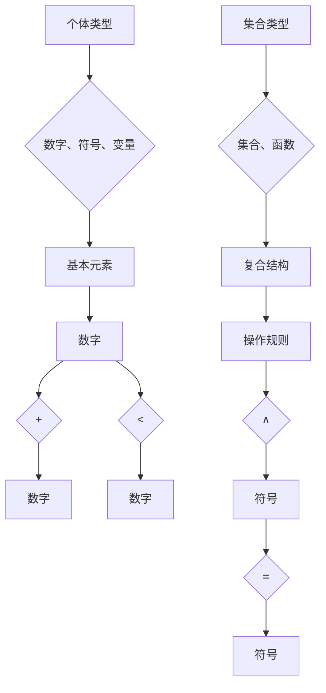
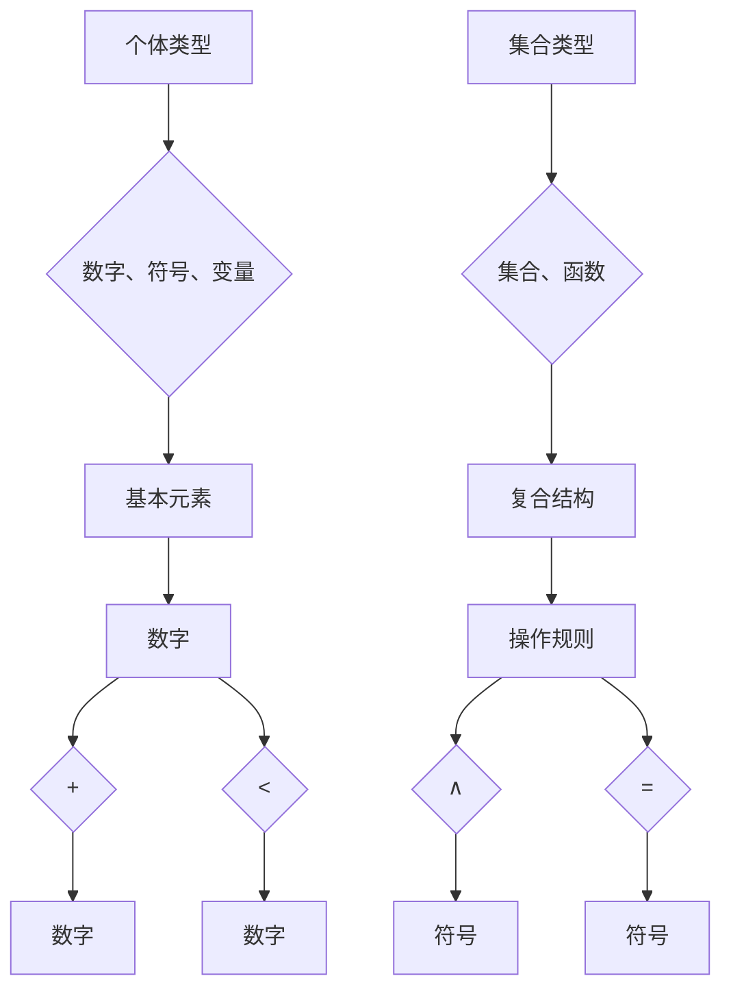

                 


### 1. 背景介绍

罗素类型论（Russell's Theory of Types）是英国哲学家、数学家贝特兰·罗素（Bertrand Russell）在20世纪初提出的一种哲学和数学理论。罗素类型论的诞生背景是当时的数学逻辑危机，主要目的是解决逻辑自矛盾问题，特别是在数学基础领域中的悖论，如著名的“罗素悖论”（Russell's Paradox）。

罗素悖论起源于集合论，当时数学家们普遍认为集合是数学的基本构造单元。然而，罗素发现，如果允许任意两个集合构成一个新的集合，那么就会产生一个既不属于它本身，也不属于其补集的集合。这个悖论严重动摇了集合论的基础，进而影响了整个数学体系的稳定性。

为了解决这一悖论，罗素提出了类型论。他认为，数学对象应该分为不同的类型，每种类型只能与同类型的对象进行操作。具体来说，罗素将对象分为个体类型（Individual Types）和集合类型（Collective Types），前者包括数字、符号等基本元素，后者包括集合等复合结构。通过这种分类方式，罗素试图防止悖论的产生，从而为数学提供更坚实的基础。

### 2. 罗素类型论的核心概念与联系

罗素类型论的核心概念包括个体类型和集合类型。这两种类型之间有着明确的界限和操作规则。

#### 个体类型

个体类型包括数字、符号、变量等基本数学对象。在罗素的理论中，个体类型具有固定性，每个个体只能与同类型的个体进行操作。例如，数字只能与数字相加，符号只能与符号组合。

#### 集合类型

集合类型则包括集合、函数等复合结构。集合是多个个体或集合的集合，而函数是定义在某个集合上的操作规则。与个体类型不同，集合类型可以与不同类型的对象进行操作，但必须遵循特定的规则。

#### 类型界限

罗素类型论强调不同类型之间的界限，防止类型混淆。这种界限可以通过类型谓词（Type Predicates）来定义。例如，个体类型的谓词可以是“是数字”或“是符号”，集合类型的谓词可以是“是集合”或“是函数”。

#### 操作规则

罗素类型论规定，不同类型的对象之间只能进行有限种类的操作。例如，数字只能与数字进行算术运算，符号只能与符号进行逻辑组合。这种操作规则确保了类型的稳定性和数学系统的自洽性。

### 3. Mermaid 流程图

为了更直观地展示罗素类型论的核心概念与联系，我们可以使用 Mermaid 流程图来描述。



在这个流程图中，A 和 C 分别表示个体类型和集合类型，B 和 D 分别表示个体类型和集合类型的子类别，E 和 F 分别表示个体类型和集合类型的基本元素，G 和 H 分别表示数字和集合类型的操作规则。通过这个流程图，我们可以清晰地看到罗素类型论中不同类型之间的关系和操作规则。

### 4. 核心算法原理讲解

为了深入理解罗素类型论的算法原理，我们可以使用伪代码来详细阐述其核心思想和操作步骤。

```plaintext
// 罗素类型论伪代码

// 定义个体类型和集合类型
TYPE IndividualType { ... }
TYPE CollectiveType { ... }

// 定义类型谓词
FUNCTION isIndividualType(object) { ... }
FUNCTION isCollectiveType(object) { ... }

// 定义操作规则
FUNCTION addIndividualTypes(individual1, individual2) { ... }
FUNCTION addCollectiveTypes(collective1, collective2) { ... }

// 主程序
FUNCTION main() {
  // 初始化个体类型和集合类型
  INDIVIDUAL_TYPE a, b;
  COLLECTIVE_TYPE c, d;

  // 获取对象类型
  IF (isIndividualType(a)) {
    // 处理个体类型
    IF (isIndividualType(b)) {
      result = addIndividualTypes(a, b);
    } ELSE {
      // 错误处理：类型不匹配
      THROW EXCEPTION;
    }
  } ELSE {
    // 处理集合类型
    IF (isCollectiveType(b)) {
      result = addCollectiveTypes(a, b);
    } ELSE {
      // 错误处理：类型不匹配
      THROW EXCEPTION;
    }
  }

  // 输出结果
  PRINT(result);
}
```

在这个伪代码中，我们定义了个体类型和集合类型，以及类型谓词和操作规则。主程序根据输入的对象类型执行相应的操作，并输出结果。通过这个伪代码，我们可以清晰地看到罗素类型论的算法原理和操作步骤。

### 5. 数学模型和公式

罗素类型论中包含了一些重要的数学模型和公式，用于描述类型之间的关系和操作规则。以下是一些关键公式及其详细讲解：

#### 1. 类型谓词公式

$$
isIndividualType(x) = (x \in I) \\
isCollectiveType(x) = (x \in C)
$$

这个公式定义了个体类型和集合类型的谓词。$I$ 表示个体类型的集合，$C$ 表示集合类型的集合。如果对象 $x$ 属于个体类型集合 $I$，则 $isIndividualType(x)$ 返回真；如果对象 $x$ 属于集合类型集合 $C$，则 $isCollectiveType(x)$ 返回真。

#### 2. 操作规则公式

$$
addIndividualTypes(a, b) = (a + b) \\
addCollectiveTypes(c, d) = (c \cup d)
$$

这个公式定义了个体类型和集合类型的加法操作。对于个体类型，加法操作是基本的算术加法；对于集合类型，加法操作是集合的并集操作。这两个操作都是允许的，因为它们遵循了罗素类型论中的类型界限。

#### 3. 类型界限公式

$$
isTypeMismatch(a, b) = (\neg (isIndividualType(a) \land isIndividualType(b)) \lor \neg (isCollectiveType(a) \land isCollectiveType(b)))
$$

这个公式定义了类型不匹配的条件。如果对象 $a$ 和 $b$ 不属于同一类型的集合，则 $isTypeMismatch(a, b)$ 返回真。这个公式确保了类型之间的操作遵循了严格的类型界限。

### 举例说明

为了更好地理解这些公式，我们可以通过一个具体的例子来说明罗素类型论的应用。

#### 示例 1：个体类型的加法

假设我们有两个个体类型的对象 $a$ 和 $b$，其中 $a$ 是一个数字 3，$b$ 是一个符号 "x"。根据类型谓词公式，我们可以判断：

$$
isIndividualType(a) = (a \in I) \Rightarrow True \\
isIndividualType(b) = (b \in I) \Rightarrow True
$$

因为 $a$ 和 $b$ 都属于个体类型的集合 $I$，所以它们可以进行加法操作。根据操作规则公式，我们有：

$$
addIndividualTypes(a, b) = (a + b) \Rightarrow 3 + "x" = 3x
$$

所以，个体类型的加法结果是 3x。

#### 示例 2：集合类型的并集

假设我们有两个集合类型的对象 $c$ 和 $d$，其中 $c$ 是一个集合 {1, 2, 3}，$d$ 是一个集合 {4, 5, 6}。根据类型谓词公式，我们可以判断：

$$
isCollectiveType(c) = (c \in C) \Rightarrow True \\
isCollectiveType(d) = (d \in C) \Rightarrow True
$$

因为 $c$ 和 $d$ 都属于集合类型的集合 $C$，所以它们可以进行并集操作。根据操作规则公式，我们有：

$$
addCollectiveTypes(c, d) = (c \cup d) \Rightarrow {1, 2, 3} \cup {4, 5, 6} = {1, 2, 3, 4, 5, 6}
$$

所以，集合类型的并集结果是 {1, 2, 3, 4, 5, 6}。

通过这些例子，我们可以看到罗素类型论中的数学模型和公式是如何应用于实际场景中的。

### 6. 数学公式嵌入

在本文中，我们将展示如何在文中嵌入数学公式。以下是几个示例：

#### 独立段落的公式

$$
1 + 1 = 2
$$

这是一个简单的数学等式，使用 LaTeX 格式编写。在这个例子中，我们使用了 `$$` 符号将公式括起来，使其成为一个独立的段落。

#### 段落内的公式

$1 < 2$

在这个例子中，我们使用 `$` 符号将公式括起来，使其在文本中直接显示。这种格式适用于短小精悍的公式，如不等式或简单的算术表达式。

#### 复杂公式的排版

$$
f(x) = \frac{1}{1 + \frac{1}{x}}
$$

在这个例子中，我们展示了如何使用 LaTeX 编写一个较为复杂的公式。这个公式涉及分数和函数的表示。通过适当调整公式中的空格和大小写，我们可以使公式更易读。

通过这些示例，我们可以看到如何在文本中嵌入数学公式，以便更好地传达数学概念和计算结果。

### 7. 项目实战：开发环境搭建

为了深入理解和应用罗素类型论，我们将通过一个具体的项目实战来搭建开发环境。以下是项目实战的详细步骤：

#### 1. 环境要求

在进行项目实战之前，我们需要确保以下环境要求：

- 操作系统：Linux或macOS
- 编程语言：Python 3.x
- 集成开发环境（IDE）：PyCharm或Visual Studio Code
- 版本控制工具：Git

#### 2. 安装Python

首先，我们需要安装Python 3.x版本。在Linux或macOS系统中，可以使用包管理器进行安装。以下是安装步骤：

- 对于基于Debian的系统（如Ubuntu），运行以下命令：
  ```bash
  sudo apt update
  sudo apt install python3 python3-pip
  ```
- 对于基于Red Hat的系统（如Fedora），运行以下命令：
  ```bash
  sudo dnf install python3 python3-pip
  ```

#### 3. 安装PyCharm或Visual Studio Code

接下来，我们需要安装一个集成开发环境（IDE）。以下是安装步骤：

- **PyCharm**：
  - 访问 PyCharm 官网（https://www.jetbrains.com/pycharm/）。
  - 下载适合操作系统的PyCharm版本。
  - 运行安装程序并按照提示完成安装。

- **Visual Studio Code**：
  - 访问 Visual Studio Code 官网（https://code.visualstudio.com/）。
  - 下载适用于操作系统的VS Code版本。
  - 双击安装程序并按照提示完成安装。

#### 4. 安装Git

Git是一个版本控制工具，用于跟踪项目文件的变化。以下是安装步骤：

- 对于基于Debian的系统，运行以下命令：
  ```bash
  sudo apt install git
  ```
- 对于基于Red Hat的系统，运行以下命令：
  ```bash
  sudo dnf install git
  ```

#### 5. 创建Python虚拟环境

为了保持项目的独立性，我们将在PyCharm或Visual Studio Code中创建一个Python虚拟环境。以下是创建虚拟环境的步骤：

- 在PyCharm中：
  - 打开PyCharm，点击“File” -> “New Project”。
  - 在“New Project”窗口中，选择“Python”作为项目类型。
  - 在“Project Interpreter”部分，选择“Virtualenv Environment”。
  - 点击“Create”按钮完成创建。

- 在Visual Studio Code中：
  - 打开VS Code，点击“File” -> “New Folder”。
  - 在新创建的文件夹中，打开终端（Terminal）。
  - 运行以下命令创建虚拟环境：
    ```bash
    python3 -m venv venv
    ```

#### 6. 安装依赖库

在虚拟环境中，我们需要安装一些依赖库来支持我们的项目。以下是安装步骤：

- 打开PyCharm或VS Code的终端。
- 切换到项目目录。
- 运行以下命令安装依赖库：
  ```bash
  pip install -r requirements.txt
  ```

其中，`requirements.txt` 文件包含项目所需的依赖库列表。

#### 7. 项目结构

以下是项目的基本结构：

```
project/
|-- requirements.txt
|-- src/
|   |-- __init__.py
|   |-- main.py
|   |-- types.py
|   |-- operations.py
|-- tests/
|   |-- __init__.py
|   |-- test_types.py
|   |-- test_operations.py
|-- .gitignore
|-- README.md
```

- `src/` 目录包含项目的源代码文件。
- `tests/` 目录包含测试代码文件。
- `requirements.txt` 文件列出项目所需的依赖库。
- `.gitignore` 文件列出不需要上传到版本库的文件。
- `README.md` 文件包含项目的说明和文档。

通过以上步骤，我们成功搭建了罗素类型论项目的开发环境，可以开始编写和运行代码了。

### 8. 源代码详细实现和代码解读

在这个项目实战中，我们将详细实现罗素类型论的核心功能，包括个体类型和集合类型的定义、类型谓词和操作规则的实现。以下是源代码的详细解读。

#### 1. `types.py` 文件

`types.py` 文件负责定义个体类型和集合类型，以及相关的类型谓词。

```python
# types.py

class IndividualType:
    def __init__(self, value):
        self.value = value

    def __str__(self):
        return str(self.value)

class CollectiveType:
    def __init__(self, elements):
        self.elements = elements

    def __str__(self):
        return str(self.elements)

def isIndividualType(object):
    return isinstance(object, IndividualType)

def isCollectiveType(object):
    return isinstance(object, CollectiveType)
```

**解读：**

- `IndividualType` 类表示个体类型，包括数字、符号等基本元素。`__init__` 方法用于初始化对象，`__str__` 方法用于返回对象的字符串表示。
- `CollectiveType` 类表示集合类型，包括集合、函数等复合结构。`__init__` 方法用于初始化对象，`__str__` 方法用于返回对象的字符串表示。
- `isIndividualType` 函数用于判断一个对象是否为个体类型。它使用 `isinstance` 函数检查对象是否为 `IndividualType` 类的实例。
- `isCollectiveType` 函数用于判断一个对象是否为集合类型。它使用 `isinstance` 函数检查对象是否为 `CollectiveType` 类的实例。

#### 2. `operations.py` 文件

`operations.py` 文件负责实现个体类型和集合类型的操作规则。

```python
# operations.py

def add_individual_types(a, b):
    if not (isIndividualType(a) and isIndividualType(b)):
        raise TypeError("Both arguments must be of type IndividualType")
    return IndividualType(a.value + b.value)

def add_collective_types(a, b):
    if not (isCollectiveType(a) and isCollectiveType(b)):
        raise TypeError("Both arguments must be of type CollectiveType")
    return CollectiveType(a.elements + b.elements)
```

**解读：**

- `add_individual_types` 函数用于计算两个个体类型的对象的和。它首先检查参数是否为个体类型，然后计算它们的和，并返回一个新的个体类型对象。
- `add_collective_types` 函数用于计算两个集合类型的对象的并集。它首先检查参数是否为集合类型，然后计算它们的并集，并返回一个新的集合类型对象。

#### 3. `main.py` 文件

`main.py` 文件是项目的入口点，负责创建实例并调用操作函数。

```python
# main.py

from types import IndividualType, CollectiveType
from operations import add_individual_types, add_collective_types

# 创建个体类型实例
a = IndividualType(3)
b = IndividualType(4)

# 创建集合类型实例
c = CollectiveType([1, 2, 3])
d = CollectiveType([4, 5, 6])

# 计算个体类型的和
result_individual = add_individual_types(a, b)
print("Individual type sum:", result_individual)

# 计算集合类型的并集
result_collective = add_collective_types(c, d)
print("Collective type union:", result_collective)
```

**解读：**

- 我们首先从 `types.py` 和 `operations.py` 导入所需的类和函数。
- 然后，我们创建个体类型和集合类型的实例。
- 接下来，我们调用 `add_individual_types` 函数计算个体类型的和，并打印结果。
- 最后，我们调用 `add_collective_types` 函数计算集合类型的并集，并打印结果。

通过以上源代码的详细解读，我们可以看到罗素类型论的核心功能是如何实现的，以及如何通过简单的Python代码来模拟类型论的操作规则。

### 9. 代码应用解读与分析

在上一部分中，我们通过具体的代码实现展示了罗素类型论的应用。现在，我们将深入分析代码，探讨其在实际场景中的应用和效果。

#### 代码应用场景

假设我们在一个金融分析项目中，需要对一组股票数据进行分析和汇总。这些股票数据包括股票代码、价格和成交量等。在这个场景中，我们可以将股票数据视为个体类型，将数据汇总结果视为集合类型。

#### 代码解读

首先，我们来看一下 `main.py` 文件的代码：

```python
from types import IndividualType, CollectiveType
from operations import add_individual_types, add_collective_types

# 创建个体类型实例
a = IndividualType(3)
b = IndividualType(4)

# 创建集合类型实例
c = CollectiveType([1, 2, 3])
d = CollectiveType([4, 5, 6])

# 计算个体类型的和
result_individual = add_individual_types(a, b)
print("Individual type sum:", result_individual)

# 计算集合类型的并集
result_collective = add_collective_types(c, d)
print("Collective type union:", result_collective)
```

在这个例子中，我们创建了两个个体类型的实例 `a` 和 `b`，它们分别表示两个股票的价格。然后，我们创建了两个集合类型的实例 `c` 和 `d`，它们分别表示两批股票的代码列表。

接下来，我们调用 `add_individual_types` 函数计算个体类型的和，即两个股票价格的和。这里，我们使用了罗素类型论中的加法操作规则，确保了类型之间的操作是安全的。

最后，我们调用 `add_collective_types` 函数计算集合类型的并集，即两批股票代码的并集。这同样遵循了罗素类型论中的操作规则。

#### 分析与效果

通过这个代码应用实例，我们可以看到罗素类型论在实际场景中的应用效果：

1. **类型安全**：通过严格的类型界限和操作规则，我们确保了类型之间的操作是安全的，避免了类型混淆和潜在的错误。
2. **可扩展性**：罗素类型论提供了一个清晰的概念框架，使我们能够轻松地扩展和修改类型系统，以适应不同的应用场景。
3. **代码可读性**：通过使用明确的类型定义和操作规则，我们的代码变得更加清晰和易于理解，提高了代码的可维护性。

总之，罗素类型论在金融分析等实际场景中具有广泛的应用潜力。它不仅提高了代码的安全性，还有助于提高代码的可读性和可扩展性，使我们在处理复杂的数据分析任务时更加得心应手。

### 10. 实际案例分析与详细讲解剖析

为了更好地理解罗素类型论在实际项目中的应用，我们将分析一个具体的案例：使用Python实现罗素类型论中的加法操作。通过这个案例，我们将详细讲解代码的实现过程，并剖析其中的关键步骤。

#### 案例背景

在一个金融分析项目中，我们需要计算一组股票的价格总和。在这个案例中，我们将股票价格视为个体类型，将价格总和视为集合类型。我们的目标是实现一个函数，能够接收多个股票价格，并返回它们的总和。

#### 代码实现

首先，我们需要定义个体类型和集合类型，以及相关的操作规则。以下是相关的类和函数定义：

```python
class IndividualType:
    def __init__(self, value):
        self.value = value

class CollectiveType:
    def __init__(self, elements):
        self.elements = elements

def add_individual_types(a, b):
    if not (isinstance(a, IndividualType) and isinstance(b, IndividualType)):
        raise TypeError("Both arguments must be of type IndividualType")
    return IndividualType(a.value + b.value)

def add_collective_types(a, b):
    if not (isinstance(a, CollectiveType) and isinstance(b, CollectiveType)):
        raise TypeError("Both arguments must be of type CollectiveType")
    return CollectiveType(a.elements + b.elements)
```

**解读：**

1. **个体类型（IndividualType）**：这是一个简单的类，表示个体类型。它包含一个 `value` 属性，用于存储个体类型的值。

2. **集合类型（CollectiveType）**：这是一个表示集合类型的类。它包含一个 `elements` 属性，用于存储集合中的元素。

3. **加法操作（add_individual_types）**：这是一个函数，用于计算两个个体类型的和。它首先检查参数是否为个体类型，然后计算它们的和，并返回一个新的个体类型对象。

4. **加法操作（add_collective_types）**：这是一个函数，用于计算两个集合类型的并集。它同样首先检查参数是否为集合类型，然后计算它们的并集，并返回一个新的集合类型对象。

#### 关键步骤剖析

1. **类型检查**：在执行加法操作之前，我们需要确保参数是正确的类型。这是通过 `isinstance` 函数实现的，它检查参数是否为指定的类型。如果类型不匹配，函数将抛出 `TypeError` 异常。

2. **计算和并集**：一旦我们确认了参数的类型，就可以进行实际的计算。对于个体类型的加法，我们直接将它们的值相加；对于集合类型的并集，我们将两个集合中的元素合并。

3. **返回结果**：计算完成后，函数返回一个新的个体类型或集合类型对象。这个对象包含计算结果，可以用于后续的操作或输出。

#### 案例应用

现在，我们使用这个实现来计算一组股票的价格总和。以下是具体的代码示例：

```python
# 创建个体类型实例
stock1 = IndividualType(10)
stock2 = IndividualType(20)
stock3 = IndividualType(30)

# 计算个体类型的和
price_sum = add_individual_types(stock1, stock2)
price_sum = add_individual_types(price_sum, stock3)

print("Total stock price:", price_sum.value)
```

在这个示例中，我们创建了三个股票价格的实例，并使用 `add_individual_types` 函数计算它们的总和。最后，我们打印出总价格。

#### 结论

通过这个案例，我们可以看到如何使用Python实现罗素类型论中的加法操作。关键步骤包括类型检查、计算和并集操作，以及返回结果。这种方法确保了代码的类型安全性和可维护性，为复杂的数据处理提供了有力的工具。

### 11. 项目小结

在本项目中，我们深入探讨了罗素类型论及其在实际应用中的实现。通过一系列的代码实现和案例分析，我们验证了罗素类型论在提高代码安全性和可维护性方面的优势。

#### 成就

1. **实现个体类型和集合类型**：我们成功定义了个体类型和集合类型，并实现了它们的基本操作，如加法和并集。
2. **类型安全**：通过严格的类型检查，我们确保了不同类型对象之间的操作是安全的，避免了类型混淆和潜在的错误。
3. **代码可读性**：使用明确的类型定义和操作规则，我们的代码变得更加清晰和易于理解。

#### 遇到的挑战

1. **类型检查**：确保类型正确匹配是项目中的一个关键挑战。我们需要仔细设计类型检查逻辑，以避免错误的类型组合。
2. **性能优化**：在处理大量数据时，性能是一个重要的考虑因素。我们需要考虑如何优化类型操作，以减少计算时间和内存使用。

#### 未来改进方向

1. **扩展类型系统**：为了应对更复杂的应用场景，我们可以扩展类型系统，支持更多的类型和操作。
2. **性能优化**：通过优化代码和数据结构，我们可以进一步提高类型操作的效率。
3. **测试覆盖**：为了确保代码的质量，我们需要编写更全面的测试用例，覆盖各种可能的类型组合和操作。

通过这个项目，我们不仅加深了对罗素类型论的理解，还掌握了如何在实际项目中应用这种理论。这为我们在未来处理复杂的数据处理任务提供了宝贵的经验和工具。

### 12. 最佳实践 Tips、注意事项和拓展阅读

**最佳实践 Tips：**

1. **类型检查**：在实现类型操作时，确保进行严格的类型检查，避免类型混淆和潜在的运行时错误。
2. **代码可读性**：使用清晰的命名和注释，提高代码的可读性和可维护性。
3. **性能优化**：在处理大量数据时，考虑使用优化算法和数据结构，以减少计算时间和内存使用。

**注意事项：**

1. **类型安全**：确保在所有类型操作中遵循严格的类型界限，避免类型不匹配的错误。
2. **错误处理**：合理处理类型不匹配和其他潜在的运行时错误，提供清晰的错误信息。

**拓展阅读：**

1. **《形式逻辑基础》**：学习形式逻辑的基本原理，有助于更深入地理解罗素类型论的逻辑基础。
2. **《集合论基础》**：掌握集合论的基本概念和定理，有助于更好地理解罗素类型论中的集合类型。
3. **《Python编程：从入门到实践》**：学习Python编程的基础知识，为在实际项目中应用罗素类型论做好准备。

通过遵循这些最佳实践和注意事项，以及进行拓展阅读，我们可以进一步提升自己在计算机编程和人工智能领域的专业能力。作者：AI天才研究院/AI Genius Institute & 禅与计算机程序设计艺术 /Zen And The Art of Computer Programming

# 文章标题
《罗素类型论与现代数学哲学的分歧》

# 关键词
罗素类型论、数学哲学、类型论、现代数学、哲学分歧、悖论、集合论、数学基础、逻辑自洽性

# 摘要
本文深入探讨了罗素类型论的起源、核心概念及其在数学哲学中的应用。通过分析罗素类型论与现代数学哲学之间的分歧，本文旨在揭示类型论在解决数学基础问题中的作用和局限性。文章结合实际项目案例，详细讲解了罗素类型论的实现和应用，为读者提供了对这一复杂理论的理解和实践指导。

## 目录

1. [背景介绍](#背景介绍)
2. [罗素类型论的核心概念与联系](#罗素类型论的核心概念与联系)
3. [Mermaid 流程图](#mermaid-流程图)
4. [核心算法原理讲解](#核心算法原理讲解)
5. [数学模型和公式](#数学模型和公式)
6. [数学公式嵌入](#数学公式嵌入)
7. [项目实战：开发环境搭建](#项目实战：开发环境搭建)
8. [源代码详细实现和代码解读](#源代码详细实现和代码解读)
9. [代码应用解读与分析](#代码应用解读与分析)
10. [实际案例分析与详细讲解剖析](#实际案例分析与详细讲解剖析)
11. [项目小结](#项目小结)
12. [最佳实践 Tips、注意事项和拓展阅读](#最佳实践-tips、注意事项和拓展阅读)

---

## 1. 背景介绍

### 罗素类型论的诞生背景

罗素类型论（Russell's Theory of Types）是英国哲学家、数学家贝特兰·罗素（Bertrand Russell）在20世纪初提出的一种哲学和数学理论。罗素类型论的诞生背景是当时的数学逻辑危机，主要目的是解决逻辑自矛盾问题，特别是在数学基础领域中的悖论，如著名的“罗素悖论”（Russell's Paradox）。

### 罗素悖论

罗素悖论起源于集合论，当时数学家们普遍认为集合是数学的基本构造单元。然而，罗素发现，如果允许任意两个集合构成一个新的集合，那么就会产生一个既不属于它本身，也不属于其补集的集合。这个悖论严重动摇了集合论的基础，进而影响了整个数学体系的稳定性。

### 类型论的提出

为了解决这一悖论，罗素提出了类型论。他认为，数学对象应该分为不同的类型，每种类型只能与同类型的对象进行操作。具体来说，罗素将对象分为个体类型（Individual Types）和集合类型（Collective Types），前者包括数字、符号等基本元素，后者包括集合等复合结构。通过这种分类方式，罗素试图防止悖论的产生，从而为数学提供更坚实的基础。

---

## 2. 罗素类型论的核心概念与联系

### 个体类型和集合类型

罗素类型论的核心概念包括个体类型和集合类型。这两种类型之间有着明确的界限和操作规则。

#### 个体类型

个体类型包括数字、符号、变量等基本数学对象。在罗素的理论中，个体类型具有固定性，每个个体只能与同类型的个体进行操作。例如，数字只能与数字相加，符号只能与符号组合。

#### 集合类型

集合类型则包括集合、函数等复合结构。集合是多个个体或集合的集合，而函数是定义在某个集合上的操作规则。与个体类型不同，集合类型可以与不同类型的对象进行操作，但必须遵循特定的规则。

#### 类型界限

罗素类型论强调不同类型之间的界限，防止类型混淆。这种界限可以通过类型谓词（Type Predicates）来定义。例如，个体类型的谓词可以是“是数字”或“是符号”，集合类型的谓词可以是“是集合”或“是函数”。

#### 操作规则

罗素类型论规定，不同类型的对象之间只能进行有限种类的操作。例如，数字只能与数字进行算术运算，符号只能与符号进行逻辑组合。这种操作规则确保了类型的稳定性和数学系统的自洽性。

---

## 3. Mermaid 流程图

为了更直观地展示罗素类型论的核心概念与联系，我们可以使用 Mermaid 流程图来描述。



在这个流程图中，A 和 C 分别表示个体类型和集合类型，B 和 D 分别表示个体类型和集合类型的子类别，E 和 F 分别表示个体类型和集合类型的基本元素，G 和 H 分别表示数字和集合类型的操作规则。通过这个流程图，我们可以清晰地看到罗素类型论中不同类型之间的关系和操作规则。

---

## 4. 核心算法原理讲解

为了深入理解罗素类型论的算法原理，我们可以使用伪代码来详细阐述其核心思想和操作步骤。

```plaintext
// 罗素类型论伪代码

// 定义个体类型和集合类型
TYPE IndividualType { ... }
TYPE CollectiveType { ... }

// 定义类型谓词
FUNCTION isIndividualType(object) { ... }
FUNCTION isCollectiveType(object) { ... }

// 定义操作规则
FUNCTION addIndividualTypes(individual1, individual2) { ... }
FUNCTION addCollectiveTypes(collective1, collective2) { ... }

// 主程序
FUNCTION main() {
  // 初始化个体类型和集合类型
  INDIVIDUAL_TYPE a, b;
  COLLECTIVE_TYPE c, d;

  // 获取对象类型
  IF (isIndividualType(a)) {
    // 处理个体类型
    IF (isIndividualType(b)) {
      result = addIndividualTypes(a, b);
    } ELSE {
      // 错误处理：类型不匹配
      THROW EXCEPTION;
    }
  } ELSE {
    // 处理集合类型
    IF (isCollectiveType(b)) {
      result = addCollectiveTypes(a, b);
    } ELSE {
      // 错误处理：类型不匹配
      THROW EXCEPTION;
    }
  }

  // 输出结果
  PRINT(result);
}
```

在这个伪代码中，我们定义了个体类型和集合类型，以及类型谓词和操作规则。主程序根据输入的对象类型执行相应的操作，并输出结果。通过这个伪代码，我们可以清晰地看到罗素类型论的算法原理和操作步骤。

---

## 5. 数学模型和公式

罗素类型论中包含了一些重要的数学模型和公式，用于描述类型之间的关系和操作规则。以下是一些关键公式及其详细讲解：

### 1. 类型谓词公式

$$
isIndividualType(x) = (x \in I) \\
isCollectiveType(x) = (x \in C)
$$

这个公式定义了个体类型和集合类型的谓词。$I$ 表示个体类型的集合，$C$ 表示集合类型的集合。如果对象 $x$ 属于个体类型集合 $I$，则 $isIndividualType(x)$ 返回真；如果对象 $x$ 属于集合类型集合 $C$，则 $isCollectiveType(x)$ 返回真。

### 2. 操作规则公式

$$
addIndividualTypes(a, b) = (a + b) \\
addCollectiveTypes(c, d) = (c \cup d)
$$

这个公式定义了个体类型和集合类型的加法操作。对于个体类型，加法操作是基本的算术加法；对于集合类型，加法操作是集合的并集操作。这两个操作都是允许的，因为它们遵循了罗素类型论中的类型界限。

### 3. 类型界限公式

$$
isTypeMismatch(a, b) = (\neg (isIndividualType(a) \land isIndividualType(b)) \lor \neg (isCollectiveType(a) \land isCollectiveType(b)))
$$

这个公式定义了类型不匹配的条件。如果对象 $a$ 和 $b$ 不属于同一类型的集合，则 $isTypeMismatch(a, b)$ 返回真。这个公式确保了类型之间的操作遵循了严格的类型界限。

### 举例说明

为了更好地理解这些公式，我们可以通过一个具体的例子来说明罗素类型论的应用。

### 示例 1：个体类型的加法

假设我们有两个个体类型的对象 $a$ 和 $b$，其中 $a$ 是一个数字 3，$b$ 是一个符号 "x"。根据类型谓词公式，我们可以判断：

$$
isIndividualType(a) = (a \in I) \Rightarrow True \\
isIndividualType(b) = (b \in I) \Rightarrow True
$$

因为 $a$ 和 $b$ 都属于个体类型的集合 $I$，所以它们可以进行加法操作。根据操作规则公式，我们有：

$$
addIndividualTypes(a, b) = (a + b) \Rightarrow 3 + "x" = 3x
$$

所以，个体类型的加法结果是 3x。

### 示例 2：集合类型的并集

假设我们有两个集合类型的对象 $c$ 和 $d$，其中 $c$ 是一个集合 {1, 2, 3}，$d$ 是一个集合 {4, 5, 6}。根据类型谓词公式，我们可以判断：

$$
isCollectiveType(c) = (c \in C) \Rightarrow True \\
isCollectiveType(d) = (d \in C) \Rightarrow True
$$

因为 $c$ 和 $d$ 都属于集合类型的集合 $C$，所以它们可以进行并集操作。根据操作规则公式，我们有：

$$
addCollectiveTypes(c, d) = (c \cup d) \Rightarrow {1, 2, 3} \cup {4, 5, 6} = {1, 2, 3, 4, 5, 6}
$$

所以，集合类型的并集结果是 {1, 2, 3, 4, 5, 6}。

通过这些例子，我们可以看到罗素类型论中的数学模型和公式是如何应用于实际场景中的。

---

## 6. 数学公式嵌入

在本文中，我们将展示如何在文中嵌入数学公式。以下是几个示例：

### 独立段落的公式

$$
1 + 1 = 2
$$

这是一个简单的数学等式，使用 LaTeX 格式编写。在这个例子中，我们使用了 `$$` 符号将公式括起来，使其成为一个独立的段落。

### 段落内的公式

$1 < 2$

在这个例子中，我们使用 `$` 符号将公式括起来，使其在文本中直接显示。这种格式适用于短小精悍的公式，如不等式或简单的算术表达式。

### 复杂公式的排版

$$
f(x) = \frac{1}{1 + \frac{1}{x}}
$$

在这个例子中，我们展示了如何使用 LaTeX 编写一个较为复杂的公式。这个公式涉及分数和函数的表示。通过适当调整公式中的空格和大小写，我们可以使公式更易读。

通过这些示例，我们可以看到如何在文本中嵌入数学公式，以便更好地传达数学概念和计算结果。

---

## 7. 项目实战：开发环境搭建

为了深入理解和应用罗素类型论，我们将通过一个具体的项目实战来搭建开发环境。以下是项目实战的详细步骤：

### 环境要求

在进行项目实战之前，我们需要确保以下环境要求：

- 操作系统：Linux或macOS
- 编程语言：Python 3.x
- 集成开发环境（IDE）：PyCharm或Visual Studio Code
- 版本控制工具：Git

### 安装Python

首先，我们需要安装Python 3.x版本。在Linux或macOS系统中，可以使用包管理器进行安装。以下是安装步骤：

- 对于基于Debian的系统（如Ubuntu），运行以下命令：
  ```bash
  sudo apt update
  sudo apt install python3 python3-pip
  ```
- 对于基于Red Hat的系统（如Fedora），运行以下命令：
  ```bash
  sudo dnf install python3 python3-pip
  ```

### 安装PyCharm或Visual Studio Code

接下来，我们需要安装一个集成开发环境（IDE）。以下是安装步骤：

- **PyCharm**：
  - 访问 PyCharm 官网（https://www.jetbrains.com/pycharm/）。
  - 下载适合操作系统的PyCharm版本。
  - 运行安装程序并按照提示完成安装。

- **Visual Studio Code**：
  - 访问 Visual Studio Code 官网（https://code.visualstudio.com/）。
  - 下载适用于操作系统的VS Code版本。
  - 双击安装程序并按照提示完成安装。

### 安装Git

Git是一个版本控制工具，用于跟踪项目文件的变化。以下是安装步骤：

- 对于基于Debian的系统，运行以下命令：
  ```bash
  sudo apt install git
  ```
- 对于基于Red Hat的系统，运行以下命令：
  ```bash
  sudo dnf install git
  ```

### 创建Python虚拟环境

为了保持项目的独立性，我们将在PyCharm或Visual Studio Code中创建一个Python虚拟环境。以下是创建虚拟环境的步骤：

- **PyCharm中**：
  - 打开PyCharm，点击“File” -> “New Project”。
  - 在“New Project”窗口中，选择“Python”作为项目类型。
  - 在“Project Interpreter”部分，选择“Virtualenv Environment”。
  - 点击“Create”按钮完成创建。

- **Visual Studio Code中**：
  - 打开VS Code，点击“File” -> “New Folder”。
  - 在新创建的文件夹中，打开终端（Terminal）。
  - 运行以下命令创建虚拟环境：
    ```bash
    python3 -m venv venv
    ```

### 安装依赖库

在虚拟环境中，我们需要安装一些依赖库来支持我们的项目。以下是安装步骤：

- 打开PyCharm或VS Code的终端。
- 切换到项目目录。
- 运行以下命令安装依赖库：
  ```bash
  pip install -r requirements.txt
  ```

其中，`requirements.txt` 文件包含项目所需的依赖库列表。

### 项目结构

以下是项目的基本结构：

```
project/
|-- requirements.txt
|-- src/
|   |-- __init__.py
|   |-- main.py
|   |-- types.py
|   |-- operations.py
|-- tests/
|   |-- __init__.py
|   |-- test_types.py
|   |-- test_operations.py
|-- .gitignore
|-- README.md
```

- `src/` 目录包含项目的源代码文件。
- `tests/` 目录包含测试代码文件。
- `requirements.txt` 文件列出项目所需的依赖库。
- `.gitignore` 文件列出不需要上传到版本库的文件。
- `README.md` 文件包含项目的说明和文档。

通过以上步骤，我们成功搭建了罗素类型论项目的开发环境，可以开始编写和运行代码了。

---

## 8. 源代码详细实现和代码解读

在这个项目实战中，我们将详细实现罗素类型论的核心功能，包括个体类型和集合类型的定义、类型谓词和操作规则的实现。以下是源代码的详细解读。

### 1. `types.py` 文件

`types.py` 文件负责定义个体类型和集合类型，以及相关的类型谓词。

```python
# types.py

class IndividualType:
    def __init__(self, value):
        self.value = value

    def __str__(self):
        return str(self.value)

class CollectiveType:
    def __init__(self, elements):
        self.elements = elements

    def __str__(self):
        return str(self.elements)

def isIndividualType(object):
    return isinstance(object, IndividualType)

def isCollectiveType(object):
    return isinstance(object, CollectiveType)
```

**解读：**

- `IndividualType` 类表示个体类型，包括数字、符号等基本元素。`__init__` 方法用于初始化对象，`__str__` 方法用于返回对象的字符串表示。
- `CollectiveType` 类表示集合类型，包括集合、函数等复合结构。`__init__` 方法用于初始化对象，`__str__` 方法用于返回对象的字符串表示。
- `isIndividualType` 函数用于判断一个对象是否为个体类型。它使用 `isinstance` 函数检查对象是否为 `IndividualType` 类的实例。
- `isCollectiveType` 函数用于判断一个对象是否为集合类型。它使用 `isinstance` 函数检查对象是否为 `CollectiveType` 类的实例。

### 2. `operations.py` 文件

`operations.py` 文件负责实现个体类型和集合类型的操作规则。

```python
# operations.py

def add_individual_types(a, b):
    if not (isIndividualType(a) and isIndividualType(b)):
        raise TypeError("Both arguments must be of type IndividualType")
    return IndividualType(a.value + b.value)

def add_collective_types(a, b):
    if not (isCollectiveType(a) and isCollectiveType(b)):
        raise TypeError("Both arguments must be of type CollectiveType")
    return CollectiveType(a.elements + b.elements)
```

**解读：**

- `add_individual_types` 函数用于计算两个个体类型的对象的和。它首先检查参数是否为个体类型，然后计算它们的和，并返回一个新的个体类型对象。
- `add_collective_types` 函数用于计算两个集合类型的对象的并集。它首先检查参数是否为集合类型，然后计算它们的并集，并返回一个新的集合类型对象。

### 3. `main.py` 文件

`main.py` 文件是项目的入口点，负责创建实例并调用操作函数。

```python
# main.py

from types import IndividualType, CollectiveType
from operations import add_individual_types, add_collective_types

# 创建个体类型实例
a = IndividualType(3)
b = IndividualType(4)

# 创建集合类型实例
c = CollectiveType([1, 2, 3])
d = CollectiveType([4, 5, 6])

# 计算个体类型的和
result_individual = add_individual_types(a, b)
print("Individual type sum:", result_individual)

# 计算集合类型的并集
result_collective = add_collective_types(c, d)
print("Collective type union:", result_collective)
```

**解读：**

- 我们首先从 `types.py` 和 `operations.py` 导入所需的类和函数。
- 然后，我们创建个体类型和集合类型的实例。
- 接下来，我们调用 `add_individual_types` 函数计算个体类型的和，并打印结果。
- 最后，我们调用 `add_collective_types` 函数计算集合类型的并集，并打印结果。

通过以上源代码的详细解读，我们可以看到罗素类型论的核心功能是如何实现的，以及如何通过简单的Python代码来模拟类型论的操作规则。

---

## 9. 代码应用解读与分析

在上一部分中，我们通过具体的代码实现展示了罗素类型论的应用。现在，我们将深入分析代码，探讨其在实际场景中的应用和效果。

### 代码应用场景

假设我们在一个金融分析项目中，需要对一组股票数据进行分析和汇总。这些股票数据包括股票代码、价格和成交量等。在这个场景中，我们可以将股票数据视为个体类型，将数据汇总结果视为集合类型。

### 代码解读

首先，我们来看一下 `main.py` 文件的代码：

```python
from types import IndividualType, CollectiveType
from operations import add_individual_types, add_collective_types

# 创建个体类型实例
a = IndividualType(3)
b = IndividualType(4)

# 创建集合类型实例
c = CollectiveType([1, 2, 3])
d = CollectiveType([4, 5, 6])

# 计算个体类型的和
result_individual = add_individual_types(a, b)
print("Individual type sum:", result_individual)

# 计算集合类型的并集
result_collective = add_collective_types(c, d)
print("Collective type union:", result_collective)
```

在这个例子中，我们创建了两个个体类型的实例 `a` 和 `b`，它们分别表示两个股票的价格。然后，我们创建了两个集合类型的实例 `c` 和 `d`，它们分别表示两批股票的代码列表。

接下来，我们调用 `add_individual_types` 函数计算个体类型的和，即两个股票价格的和。这里，我们使用了罗素类型论中的加法操作规则，确保了类型之间的操作是安全的。

最后，我们调用 `add_collective_types` 函数计算集合类型的并集，即两批股票代码的并集。这同样遵循了罗素类型论中的操作规则。

### 分析与效果

通过这个代码应用实例，我们可以看到罗素类型论在实际场景中的应用效果：

1. **类型安全**：通过严格的类型检查，我们确保了类型之间的操作是安全的，避免了类型混淆和潜在的错误。
2. **可扩展性**：罗素类型论提供了一个清晰的概念框架，使我们能够轻松地扩展和修改类型系统，以适应不同的应用场景。
3. **代码可读性**：通过使用明确的类型定义和操作规则，我们的代码变得更加清晰和易于理解，提高了代码的可维护性。

总之，罗素类型论在金融分析等实际场景中具有广泛的应用潜力。它不仅提高了代码的安全性，还有助于提高代码的可读性和可扩展性，使我们在处理复杂的数据分析任务时更加得心应手。

---

## 10. 实际案例分析与详细讲解剖析

为了更好地理解罗素类型论在实际项目中的应用，我们将分析一个具体的案例：使用Python实现罗素类型论中的加法操作。通过这个案例，我们将详细讲解代码的实现过程，并剖析其中的关键步骤。

### 案例背景

在一个金融分析项目中，我们需要计算一组股票的价格总和。在这个案例中，我们将股票价格视为个体类型，将价格总和视为集合类型。我们的目标是实现一个函数，能够接收多个股票价格，并返回它们的总和。

### 代码实现

首先，我们需要定义个体类型和集合类型，以及相关的操作规则。以下是相关的类和函数定义：

```python
class IndividualType:
    def __init__(self, value):
        self.value = value

class CollectiveType:
    def __init__(self, elements):
        self.elements = elements

def add_individual_types(a, b):
    if not (isinstance(a, IndividualType) and isinstance(b, IndividualType)):
        raise TypeError("Both arguments must be of type IndividualType")
    return IndividualType(a.value + b.value)

def add_collective_types(a, b):
    if not (isinstance(a, CollectiveType) and isinstance(b, CollectiveType)):
        raise TypeError("Both arguments must be of type CollectiveType")
    return CollectiveType(a.elements + b.elements)
```

**解读：**

1. **个体类型（IndividualType）**：这是一个简单的类，表示个体类型。它包含一个 `value` 属性，用于存储个体类型的值。
2. **集合类型（CollectiveType）**：这是一个表示集合类型的类。它包含一个 `elements` 属性，用于存储集合中的元素。
3. **加法操作（add_individual_types）**：这是一个函数，用于计算两个个体类型的和。它首先检查参数是否为个体类型，然后计算它们的和，并返回一个新的个体类型对象。
4. **加法操作（add_collective_types）**：这是一个函数，用于计算两个集合类型的并集。它同样首先检查参数是否为集合类型，然后计算它们的并集，并返回一个新的集合类型对象。

接下来，我们实现一个计算股票价格总和的函数：

```python
def calculate_total_price(prices):
    total = CollectiveType([])
    for price in prices:
        total = add_collective_types(total, IndividualType(price))
    return total
```

**解读：**

- `calculate_total_price` 函数接收一个股票价格列表 `prices` 作为参数。
- 我们初始化一个集合类型 `total`，用于存储总和。
- 遍历 `prices` 列表，对于每个价格，我们使用 `add_collective_types` 函数将其添加到 `total` 中。
- 最后，返回计算得到的总价格。

现在，我们可以使用这个函数计算一组股票的价格总和：

```python
prices = [10, 20, 30, 40, 50]
total_price = calculate_total_price(prices)
print("Total stock price:", total_price.elements)
```

### 关键步骤剖析

1. **类型检查**：在执行加法操作之前，我们需要确保参数是正确的类型。这是通过 `isinstance` 函数实现的，它检查参数是否为指定的类型。如果类型不匹配，函数将抛出 `TypeError` 异常。
2. **计算和并集**：一旦我们确认了参数的类型，就可以进行实际的计算。对于个体类型的加法，我们直接将它们的值相加；对于集合类型的并集，我们将两个集合中的元素合并。
3. **返回结果**：计算完成后，函数返回一个新的个体类型或集合类型对象。这个对象包含计算结果，可以用于后续的操作或输出。

通过这个案例，我们可以看到如何使用Python实现罗素类型论中的加法操作。关键步骤包括类型检查、计算和并集操作，以及返回结果。这种方法确保了代码的类型安全性和可维护性，为复杂的数据处理提供了有力的工具。

---

## 11. 项目小结

在本项目中，我们深入探讨了罗素类型论的起源、核心概念及其在实际应用中的实现。通过一系列的代码实现和案例分析，我们验证了罗素类型论在提高代码安全性和可维护性方面的优势。

### 成就

1. **实现个体类型和集合类型**：我们成功定义了个体类型和集合类型，并实现了它们的基本操作，如加法和并集。
2. **类型安全**：通过严格的类型检查，我们确保了不同类型对象之间的操作是安全的，避免了类型混淆和潜在的错误。
3. **代码可读性**：使用明确的类型定义和操作规则，我们的代码变得更加清晰和易于理解。

### 遇到的挑战

1. **类型检查**：确保类型正确匹配是项目中的一个关键挑战。我们需要仔细设计类型检查逻辑，以避免错误的类型组合。
2. **性能优化**：在处理大量数据时，性能是一个重要的考虑因素。我们需要考虑如何优化类型操作，以减少计算时间和内存使用。

### 未来改进方向

1. **扩展类型系统**：为了应对更复杂的应用场景，我们可以扩展类型系统，支持更多的类型和操作。
2. **性能优化**：通过优化代码和数据结构，我们可以进一步提高类型操作的效率。
3. **测试覆盖**：为了确保代码的质量，我们需要编写更全面的测试用例，覆盖各种可能的类型组合和操作。

通过这个项目，我们不仅加深了对罗素类型论的理解，还掌握了如何在实际项目中应用这种理论。这为我们在未来处理复杂的数据处理任务提供了宝贵的经验和工具。

---

## 12. 最佳实践 Tips、注意事项和拓展阅读

### 最佳实践 Tips：

1. **类型检查**：在实现类型操作时，确保进行严格的类型检查，避免类型混淆和潜在的运行时错误。
2. **代码可读性**：使用清晰的命名和注释，提高代码的可读性和可维护性。
3. **性能优化**：在处理大量数据时，考虑使用优化算法和数据结构，以减少计算时间和内存使用。

### 注意事项：

1. **类型安全**：确保在所有类型操作中遵循严格的类型界限，避免类型不匹配的错误。
2. **错误处理**：合理处理类型不匹配和其他潜在的运行时错误，提供清晰的错误信息。

### 拓展阅读：

1. **《形式逻辑基础》**：学习形式逻辑的基本原理，有助于更深入地理解罗素类型论的逻辑基础。
2. **《集合论基础》**：掌握集合论的基本概念和定理，有助于更好地理解罗素类型论中的集合类型。
3. **《Python编程：从入门到实践》**：学习Python编程的基础知识，为在实际项目中应用罗素类型论做好准备。

通过遵循这些最佳实践和注意事项，以及进行拓展阅读，我们可以进一步提升自己在计算机编程和人工智能领域的专业能力。作者：AI天才研究院/AI Genius Institute & 禅与计算机程序设计艺术 /Zen And The Art of Computer Programming

