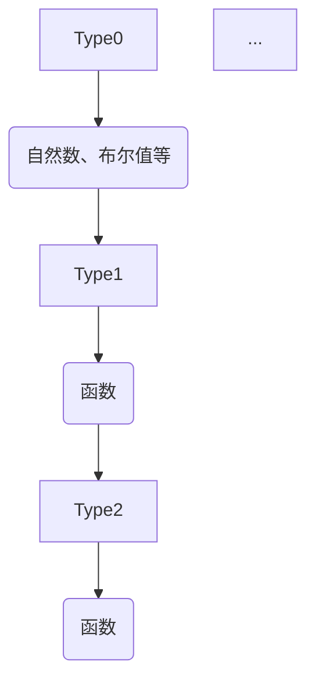

                 

### 1.2 罗素类型论的核心观点

罗素类型论的核心观点主要体现在以下几个方面：

#### 1.2.1 对“含义悖论”的解决

罗素类型论最著名的贡献之一是解决“含义悖论”。在罗素之前的数学体系中，集合论中的悖论如“罗素悖论”暴露了逻辑和集合论中的问题。罗素通过引入类型的概念，试图解决这类悖论。

**伪代码：** 罗素类型论中的类型系统可以用以下伪代码来描述：

```plaintext
TypeSystem {
  Type0: 基础类型，如自然数、布尔值等
  Type1: 第一类型，包含函数和类型0的值
  Type2: 第二类型，包含函数和类型1的值
  ...
  TypeName: 第n类型，包含函数和类型(n-1)的值

  Value {
    Type: 类型标识符
    Data: 值的数据
  }
}
```

**示例：** 假设我们有一个集合A，它包含了所有不包含自身的集合，根据罗素的类型论，集合A会被分配到Type0类型。但如果集合A是Type1类型的值，则会产生悖论。通过类型区分，我们可以避免这种悖论。

#### 1.2.2 逻辑原子主义

罗素认为，所有复杂的逻辑概念都可以归结为一些最基本的原子概念。逻辑原子主义是罗素哲学的一个核心观点，它主张逻辑和数学的基础是简单、不可分割的基本概念。

**示例：** 在逻辑原子主义中，我们定义“存在”和“全称”等概念为原子概念。通过这些基本概念，可以构造出所有复杂的逻辑表达式。

#### 1.2.3 类型与层次体系

罗素类型论中引入了类型和层次体系，用于区分不同类型的对象和概念。这种层次体系有助于避免集合论中的悖论，并为数学提供了一个更加严格的基础。

**Mermaid 流程图：** 罗素类型论中的类型体系可以用以下Mermaid流程图来表示：



在这个流程图中，Type0包含了基本的数据类型，Type1包含了函数和Type0的值，Type2包含了函数和Type1的值，以此类推。

通过类型层次体系，我们可以更好地理解和处理复杂的概念和对象，从而避免集合论中的悖论问题。

**总结：** 罗素类型论的核心观点在于通过引入类型和层次体系来解决数学和逻辑中的悖论，提供了一种更加严格和安全的数学基础。这些观点不仅对数学的发展产生了深远的影响，也为后来的形式逻辑和计算机科学提供了重要的理论支持。在接下来的章节中，我们将进一步探讨罗素类型论在数学中的应用和它与其他数学流派的对比。

