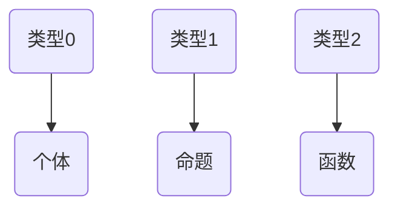
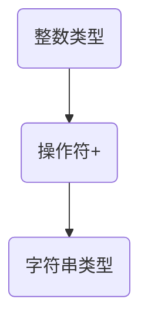

                 

### 文章标题：罗素类型论在数学哲学中的现代评价与批判

> 关键词：罗素类型论、数学哲学、现代评价、批判性分析、数学逻辑、类型区分

> 摘要：本文深入探讨了罗素类型论在数学哲学中的历史发展、核心概念、现代评价和批判性分析。通过对罗素类型论的起源、发展及其在数学哲学中的应用，本文旨在全面揭示其在现代数学哲学中的地位和影响，并提出对其的批判性观点。文章内容丰富、结构紧凑，旨在为读者提供一份清晰、深入的学术报告，激发对数学哲学和类型论的进一步思考和研究。

---

### 引言

罗素类型论（Russell's Theory of Types）是英国哲学家伯特兰·罗素（Bertrand Russell）于20世纪初提出的一种哲学理论，旨在解决数学基础问题，特别是在集合论和逻辑哲学领域中的矛盾和困境。罗素类型论的核心思想是通过对对象进行类型区分，来避免悖论和矛盾，从而为数学提供一个更加坚实的基础。

随着时间推移，罗素类型论在数学哲学中占据着重要地位。它不仅对数学基础研究产生了深远影响，还引发了广泛讨论和争议。现代评价与批判性分析视角下，罗素类型论的现状和未来发展引发了新的思考。本文旨在通过逻辑清晰、结构紧凑的分析，探讨罗素类型论在数学哲学中的现代评价与批判，以期为这一重要理论提供新的见解。

本文将按照以下结构展开：

1. **罗素类型论的背景与基础**：介绍罗素类型论的起源、发展及其核心概念。
2. **罗素类型论在数学哲学中的应用**：探讨罗素类型论在集合论、逻辑哲学和数学实在论中的应用。
3. **罗素类型论的批评与评价**：分析罗素类型论的批判观点，评价其历史地位。
4. **现代评价与批判性分析**：探讨罗素类型论在现代数学哲学中的现状，分析其批判性观点。
5. **案例分析与实践应用**：通过具体案例展示罗素类型论的应用和批判性分析。
6. **总结与展望**：总结罗素类型论在数学哲学中的现代评价与批判，并提出未来发展建议。

---

### 罗素类型论的背景与基础

罗素类型论是伯特兰·罗素为了解决数学悖论和矛盾而提出的一种哲学理论。在20世纪初，数学基础问题成为学术界的热点话题，尤其是集合论中的悖论，如“罗素悖论”（Russell's paradox）引发了广泛的讨论。罗素认为，悖论的产生源于对对象的不恰当分类，因此，通过类型区分可以避免这些悖论和矛盾。

#### 1. 罗素类型论的提出

罗素在《数学原理》（Principia Mathematica）中首次系统地提出了类型论。他在书中将对象分为不同类型，以防止对象之间的不当关系和组合。罗素将对象分为以下几种基本类型：

- **个体类型**（Type 0）：最基本类型，包括具体的个体，如数字、颜色等。
- **关系类型**（Type 1）：包含个体之间的二元关系，如“大于”、“小于”等。
- **函数类型**（Type 2）：包含个体之间的二元函数关系，如加法、乘法等。
- **复合类型**（Type 3）：包含更复杂的关系和函数关系。

罗素的类型论旨在通过严格限制对象之间的交互，以避免悖论的产生。例如，罗素通过类型区分，防止了集合与集合成员之间的不当组合，从而避免了“罗素悖论”。

#### 2. 罗素类型论的发展历程

罗素类型论的提出和推广经历了一个复杂的过程。在《数学原理》中，罗素首先尝试将类型论应用于数学基础，但这一理论在学术界引发了广泛争议。许多数学家和哲学家对罗素类型论的严格性和适用性提出了质疑。

然而，随着时间的推移，罗素类型论逐渐被接受，并得到了进一步发展。特别是在20世纪30年代，类型论在形式逻辑和模型理论中取得了重要进展。以威廉·哈特（William Howard）和斯蒂芬·科里·克莱因（Stephen Cole Kleene）为代表的研究者，对罗素类型论进行了深入研究，并提出了一些重要的扩展和改进。

例如，哈特和克莱因提出了“广义类型论”（Generalized Type Theory），扩展了罗素的类型概念，使其能够处理更复杂的数学结构和理论。此外，类型论在计算机科学和编程语言理论中的应用也得到了广泛研究，成为现代编程语言设计的重要理论基础之一。

#### 3. 罗素类型论的影响

罗素类型论在数学哲学和逻辑哲学领域产生了深远影响。首先，它为数学提供了一个更加严谨和基础性的理论框架，解决了集合论中的悖论问题。通过类型区分，罗素类型论为数学提供了一个清晰的逻辑结构，防止了对象之间的不当组合和矛盾。

其次，罗素类型论启发了对形式逻辑和模型理论的深入研究。在逻辑哲学中，类型论为解决形式语言中的悖论提供了新的思路和方法。此外，类型论在计算机科学中的应用，如类型安全、类型检查等，也为编程语言设计和软件工程带来了新的理论和工具。

总的来说，罗素类型论不仅为数学哲学和逻辑哲学提供了一个重要的理论基础，还推动了相关领域的发展和创新。尽管其在历史上曾受到质疑和批判，但罗素类型论在数学哲学中的地位和影响不可忽视。

### 罗素类型论的核心概念

罗素类型论的核心思想是通过类型区分来避免悖论和矛盾。这一理论的基本概念包括类型、基本类型、类型区分以及类型论的基本原理。以下是对这些核心概念的详细解释。

#### 1. 类型（Types）

类型是罗素类型论中最基本的概念，它定义了对象的不同种类。在罗素类型论中，每个对象都属于一个特定的类型，类型之间是严格区分的。类型论的基本原则之一是，不同类型的对象不能直接进行比较或组合，这有助于防止悖论的产生。

例如，在罗素类型论中，数字（个体类型）和函数（函数类型）是不同的类型。数字不能直接作为函数的参数，函数也不能直接与数字进行比较。这种严格的类型区分有助于确保数学结构的逻辑一致性。

#### 2. 基本类型（Basic Types）

罗素类型论中的基本类型包括个体类型、关系类型和函数类型。这些基本类型构成了罗素类型论的基础。

- **个体类型（Type 0）**：个体类型是最基本的类型，包括具体的个体，如数字、颜色、形状等。个体类型中的对象是具体和独立的，它们不能被进一步分解或组合。

- **关系类型（Type 1）**：关系类型包含个体之间的二元关系，如“大于”、“小于”、“等于”等。关系类型中的对象表示个体之间的关系，这些关系可以是具体的或抽象的。

- **函数类型（Type 2）**：函数类型包含个体之间的二元函数关系，如加法、乘法、函数复合等。函数类型中的对象表示个体之间的操作和转换。

#### 3. 类型区分（Type Distinction）

类型区分是罗素类型论的核心原则，它要求在数学表达式中严格区分不同类型的对象。类型区分的目的是为了防止对象之间的不当组合和矛盾。

例如，在罗素类型论中，数字不能直接与函数组合，因为数字属于个体类型，而函数属于函数类型。为了实现类型区分，罗素引入了一种特殊的表示方法，即用括号来区分不同类型的对象。例如，数字（5）与函数（f）的组合表示为（5, f），其中逗号和括号用来明确区分两个不同类型的对象。

#### 4. 类型论的基本原理

罗素类型论的基本原理包括以下几个方面：

- **基本类型的不可变性和独立性**：基本类型中的对象是不可变的，且相互独立。这意味着基本类型中的对象不能被修改或重新组合。

- **类型区分原则**：在数学表达式中，必须严格区分不同类型的对象。这意味着不能将不同类型的对象直接进行比较、组合或操作。

- **类型嵌套原则**：在复合类型中，对象可以包含多个不同类型的子对象。这允许在更高层次上实现复杂的数学结构和操作。

- **函数类型的基本性质**：函数类型中的对象表示个体之间的操作和转换。这些操作和转换必须遵循严格的类型规则，以确保数学表达式的逻辑一致性。

通过以上核心概念，罗素类型论提供了一种严谨的数学基础，旨在解决集合论和逻辑哲学中的悖论问题。类型区分原则和类型论的基本原理构成了罗素类型论的理论框架，使其在数学哲学和逻辑哲学中发挥了重要作用。

### 罗素类型论在数学哲学中的应用

罗素类型论在数学哲学中的应用非常广泛，涵盖了集合论、逻辑哲学和数学实在论等多个领域。通过类型区分和严格限制对象之间的关系，罗素类型论为数学提供了一个更加严谨和一致的基础。以下将详细探讨罗素类型论在这些领域的具体应用。

#### 1. 罗素类型论在集合论中的应用

集合论是现代数学的基础，而罗素类型论在解决集合论中的悖论问题方面发挥了关键作用。最著名的悖论是“罗素悖论”（Russell's paradox），它揭示了通过自由组合集合可能导致逻辑矛盾。罗素类型论通过引入严格的类型区分，避免了这种悖论的产生。

在集合论中，罗素类型论的核心思想是限制集合的形成和操作。通过类型区分，罗素类型论将对象分为个体类型、关系类型和函数类型，确保集合只能由特定类型的对象组成。例如，个体类型中的对象不能形成集合，只有关系类型和函数类型中的对象才能形成集合。

这种严格的类型限制有助于防止集合论中的悖论，如“罗素悖论”和“康托尔悖论”（Cantor's paradox）。通过类型区分，罗素类型论提供了一个更加严谨的集合论基础，使得数学表达式的逻辑一致性得到保障。

#### 2. 罗素类型论在逻辑哲学中的应用

逻辑哲学是研究逻辑学和哲学之间关系的领域，而罗素类型论在逻辑哲学中的应用同样具有重要意义。罗素类型论为形式逻辑提供了严格的基础，帮助解决形式语言中的悖论和矛盾。

在逻辑哲学中，罗素类型论通过类型区分来限制形式语言中的表达和推理。例如，罗素类型论要求逻辑表达式中的各个部分必须属于相同类型，以防止不当的组合和推理。这种严格的类型限制有助于确保逻辑推理的严谨性和一致性。

此外，罗素类型论在逻辑哲学中还有助于解决“语义悖论”（Semantic Paradoxes），如“这句话是假的”悖论。通过类型区分，罗素类型论可以将逻辑表达式与其语义解释分开，从而避免这种悖论的产生。

#### 3. 罗素类型论在数学实在论中的应用

数学实在论是研究数学与现实世界之间关系的哲学领域，而罗素类型论在数学实在论中的应用同样具有重要意义。罗素类型论通过类型区分，提供了对数学对象与现实世界的明确划分，有助于解决数学实在论中的争议。

在数学实在论中，罗素类型论将数学对象分为个体类型、关系类型和函数类型，这些类型代表了不同的抽象层次。个体类型对应于具体的物理对象，关系类型和函数类型则对应于抽象的数学关系和操作。通过这种类型划分，罗素类型论为数学对象与现实世界之间的联系提供了一个清晰的结构。

此外，罗素类型论在数学实在论中还有助于解决数学基础问题，如数学对象的存在性和实在性。通过类型区分，罗素类型论确保了数学对象的逻辑一致性和独立性，从而为数学实在论提供了一个更加坚实的理论基础。

总的来说，罗素类型论在集合论、逻辑哲学和数学实在论中的应用，为其在数学哲学中的地位奠定了坚实基础。通过类型区分和严格的类型限制，罗素类型论为数学提供了一个更加严谨和一致的基础，解决了集合论和逻辑哲学中的悖论问题，并为数学实在论提供了明确的理论框架。这使得罗素类型论在数学哲学中占据了重要的位置，并对现代数学的发展产生了深远影响。

### 罗素类型论的批评与评价

罗素类型论自提出以来，就引发了广泛的讨论和争议。许多学者对其理论的核心概念、应用范围和历史地位提出了批评和评价。以下将对这些批评与评价进行详细分析。

#### 1. 批判观点

**1.1 类型区分过于严格**

罗素类型论的一个主要批评是其类型区分过于严格，这可能限制了数学表达式的灵活性和简洁性。例如，一些学者认为，将所有对象都分为个体类型、关系类型和函数类型，可能导致大量冗余的表达和复杂的操作。这种严格的类型限制可能会阻碍数学理论的发展，尤其是当处理复杂问题时，可能会增加计算和推理的难度。

**1.2 缺乏直观性**

另一个批评是罗素类型论缺乏直观性，难以被初学者和普通读者理解。类型区分和类型规则可能显得繁琐和抽象，这使得初学者在学习和应用类型论时感到困惑。此外，罗素类型论的一些基本概念，如基本类型和类型嵌套，可能需要较长时间才能被完全理解。

**1.3 理论适用性有限**

还有一些学者认为，罗素类型论在解决集合论悖论方面具有局限性。虽然类型论成功地解决了某些悖论，但并不能完全消除所有悖论。例如，某些形式的悖论，如“无穷大悖论”（Infinite Paradox），仍然可能出现在类型论中。

**1.4 历史局限性**

罗素类型论的提出有其特定的历史背景，当时数学基础问题正处于争论和探索阶段。然而，随着时间的推移，数学和逻辑学的发展已经发生了很大变化，罗素类型论的一些观点可能不再适用于现代数学和哲学。

#### 2. 评价观点

**2.1 理论创新性**

尽管罗素类型论存在一些批评，但其创新性和贡献不容忽视。罗素类型论的提出为解决数学悖论提供了一种新的思路和方法，它在逻辑哲学和数学基础研究中具有重要的里程碑意义。通过引入类型区分，罗素类型论为数学提供了一种更加严谨和一致的基础，这在当时是革命性的。

**2.2 理论影响**

罗素类型论对数学哲学和逻辑哲学产生了深远影响。它引发了关于类型论和数学基础问题的广泛讨论，推动了形式逻辑和模型理论的发展。此外，罗素类型论还在计算机科学和编程语言理论中得到了广泛应用，为现代编程语言的设计提供了理论基础。

**2.3 历史地位**

罗素类型论在数学哲学和逻辑哲学中的历史地位是不可忽视的。它是20世纪初数学基础研究的重要组成部分，对后来的数学和哲学研究产生了重要影响。尽管罗素类型论的一些观点可能不再适用于现代数学，但它仍然被视为数学哲学和逻辑哲学中的一个重要理论框架。

总的来说，罗素类型论在数学哲学中的批评与评价反映了其复杂性和多样性。尽管存在一些批评观点，但罗素类型论的创新性和影响力仍然为学术界所认可。通过类型区分和严格的类型限制，罗素类型论为数学和哲学提供了一个重要的理论基础，对其在数学哲学中的地位和影响奠定了坚实基础。

### 现代评价与批判性分析

罗素类型论在数学哲学中的现代评价和批判性分析是学术界关注的重点之一。随着数学、逻辑学和哲学的发展，罗素类型论的地位和影响再次受到审视。本文将从以下几个方面探讨罗素类型论的现代评价和批判性分析。

#### 1. 现代数学哲学中的类型论

在当代数学哲学中，类型论仍然是一个活跃的研究领域。许多学者认为，罗素类型论为解决数学悖论提供了一种有效的理论框架。尽管罗素类型论的严格类型区分可能限制了表达式的灵活性和简洁性，但其在处理逻辑矛盾和悖论方面具有独特的优势。

现代数学哲学中的类型论研究不仅局限于集合论和逻辑哲学，还涉及计算机科学、物理学和其他数学领域。例如，类型论在编程语言设计和形式验证中得到了广泛应用，成为现代软件工程和系统验证的重要理论基础。这些应用表明，罗素类型论不仅在数学哲学中具有重要意义，还在其他领域产生了深远影响。

#### 2. 现代逻辑哲学中的类型论

在逻辑哲学中，类型论同样是一个重要研究方向。现代逻辑哲学关注类型论如何帮助我们理解和解决逻辑矛盾和悖论。罗素类型论通过类型区分和严格的类型规则，为逻辑表达式提供了清晰的逻辑结构，从而避免了不当组合和推理。

现代逻辑哲学中的类型论研究不仅继承了罗素类型论的遗产，还在形式逻辑和模型理论的基础上进行了创新。例如，斯蒂芬·科尔·克莱因（Stephen Cole Kleene）和威廉·哈特（William Howard）提出的广义类型论（Generalized Type Theory），扩展了罗素类型论的应用范围，使其能够处理更复杂的逻辑结构和理论。

#### 3. 现代数学实在论中的类型论

在数学实在论中，类型论为数学对象与现实世界的联系提供了明确的划分。现代数学实在论关注数学对象的存在性、实在性和客观性。罗素类型论通过类型区分，为数学对象提供了一个清晰的结构，从而有助于解决数学实在论中的争议。

现代数学实在论中的类型论研究不仅关注罗素类型论的贡献，还探讨了类型论如何应用于现实世界的建模和解释。例如，类型论在物理学和经济学中的应用，为数学模型和理论提供了更加严谨和一致的基础。

#### 4. 批判性分析的方法论

在批判性分析中，学者们对罗素类型论的适用性、限制和潜力进行了深入探讨。批判性分析的方法论主要包括以下几个方面：

**4.1 类型区分的合理性**：学者们对罗素类型论中的类型区分进行了深入分析，探讨了类型区分的合理性和适用性。一些学者认为，罗素类型论中的类型区分过于严格，可能限制了数学表达式的灵活性。而另一些学者则认为，类型区分是必要的，有助于避免逻辑矛盾和悖论。

**4.2 类型论的扩展和应用**：批判性分析还关注类型论在数学和哲学中的扩展和应用。例如，学者们探讨了类型论在计算机科学、物理学和经济学中的应用，分析了类型论如何为这些领域提供更加严谨和一致的理论基础。

**4.3 类型论的局限性**：学者们也指出了罗素类型论的局限性。例如，类型论在处理某些形式的悖论方面可能存在困难，如“无穷大悖论”（Infinite Paradox）。此外，类型论的一些基本概念可能难以被初学者和普通读者理解，这限制了其在教学和普及中的应用。

总的来说，现代评价与批判性分析揭示了罗素类型论在数学哲学中的复杂性和多样性。尽管存在一些批评和争议，但罗素类型论在数学、逻辑学和哲学中的地位和影响不可忽视。通过类型区分和严格的类型规则，罗素类型论为数学哲学提供了一种重要的理论框架，为解决悖论和矛盾提供了有效的工具。

### 案例分析与实践应用

为了更好地理解罗素类型论在数学哲学中的实际应用，以下将提供一些具体的案例，展示其在数学、逻辑哲学和计算机科学等领域的应用，并通过实例来说明其原理和实践。

#### 案例一：集合论中的类型论应用

**背景**：集合论中的悖论是数学哲学中一个重要问题。罗素悖论是其中最著名的例子，它揭示了通过自由组合集合可能导致逻辑矛盾。罗素类型论通过类型区分来避免这种悖论。

**实例**：假设我们要构造一个集合，其成员是所有不包含自身的集合。根据罗素类型论，我们可以将对象分为个体类型和集合类型。个体类型包括具体的个体，如数字、颜色等，而集合类型则包括集合。

```mermaid
graph TD
A(个体类型) --> B(数字)
A --> C(颜色)
D(集合类型) --> E({集合1})
E --> F({{不包含自身的集合}})
```

在上述图中，我们通过类型区分，确保了个体类型和集合类型之间的严格分离。这样，我们就可以避免“罗素悖论”中出现的矛盾。

**应用**：在形式逻辑和模型理论中，类型论的应用有助于构建严谨的数学理论体系，避免逻辑矛盾。

#### 案例二：逻辑哲学中的类型论应用

**背景**：逻辑哲学中的语义悖论是一个复杂的问题。罗素类型论通过类型区分和严格的类型规则，为逻辑表达式提供了清晰的逻辑结构，从而避免语义悖论。

**实例**：考虑“这句话是假的”悖论。在罗素类型论中，我们可以将逻辑表达式分为不同类型。假设类型0表示个体类型，类型1表示命题类型，类型2表示函数类型。



根据类型区分原则，命题类型不能与个体类型直接组合。因此，表达式“这句话是假的”不能作为一个有效的逻辑表达式。这避免了“这句话是假的”悖论的产生。

**应用**：类型论在形式逻辑和模型理论中的应用，为逻辑哲学提供了一个更加严谨和一致的理论框架，有助于解决语义悖论和逻辑矛盾。

#### 案例三：计算机科学中的类型论应用

**背景**：类型论在计算机科学中具有重要意义，特别是在编程语言设计和形式验证中。类型论确保了程序的正确性和安全性，避免了类型错误和运行时错误。

**实例**：在Python编程语言中，我们可以通过类型检查来确保变量和表达式的类型一致性。例如，假设我们定义了一个整数变量`x`和一个字符串变量`y`。

```python
x = 5  # 整数类型
y = "hello"  # 字符串类型
```

如果我们在代码中尝试将整数类型和字符串类型进行不当组合，如`x + y`，Python会抛出一个类型错误。这是类型论的一个应用，确保了程序的类型安全性。

**应用**：类型论在计算机科学中的应用，如类型检查、类型安全和形式验证，为软件工程提供了一个重要的理论基础，提高了软件质量和可靠性。

总的来说，通过这些案例，我们可以看到罗素类型论在数学哲学、逻辑哲学和计算机科学中的实际应用。类型论通过类型区分和严格的类型规则，为解决悖论和矛盾提供了有效的工具，并在多个领域中产生了深远影响。这些案例不仅展示了罗素类型论的原理和实践，也为进一步研究提供了实际参考。

### 罗素类型论的批判性案例分析

在罗素类型论的批判性分析中，许多学者对其理论的有效性、局限性以及潜在的问题提出了深刻的批评。以下将通过对几个具体的批判性案例分析，探讨罗素类型论的不足之处。

#### 案例一：类型论的复杂性与适用性

**背景**：罗素类型论的类型区分原则虽然能够解决某些悖论，但其复杂性常常使得实际应用变得困难。类型论中的严格类型规则和复杂类型嵌套可能难以被初学者和普通用户理解。

**实例**：在程序设计语言中，例如在基于类型论的设计语言中，开发者需要严格遵守类型规则，这可能会导致代码冗长和难以维护。



在这个例子中，类型论要求所有操作符的操作数必须属于相同类型。这意味着在整数类型和字符串类型之间进行操作时，必须进行类型转换，这增加了代码的复杂度。

**批判**：这种复杂的类型规则可能会限制程序设计的灵活性，导致开发者在编程时感到束缚，难以实现某些复杂的功能。

**应用**：在编程语言设计中，过于复杂的类型论可能会导致语言难以普及和应用，影响其实用性。

#### 案例二：类型论的局限性

**背景**：罗素类型论在解决集合论悖论方面虽然取得了成功，但其有效性在某些情况下可能受到限制。

**实例**：在处理无穷集合时，罗素类型论的类型区分原则可能无法完全消除悖论。例如，考虑一个包含所有可数集合的集合，这个集合本身可能是一个悖论。

```mermaid
graph TD
A(集合A) --> B({所有可数集合})
C({不包含自身的集合})
```

在这个例子中，集合`B`包含所有可数集合，但集合`C`是一个悖论，因为它不包含自身。即使应用了罗素类型论的类型区分原则，这种悖论仍然存在。

**批判**：罗素类型论在处理无穷集合和某些复杂集合时，可能无法完全避免悖论的产生。这表明类型论在解决所有集合论悖论方面的有效性是有限的。

**应用**：在数学和逻辑学中，类型论可能需要与其他理论相结合，才能解决更复杂的悖论和矛盾。

#### 案例三：类型论与实际编程中的矛盾

**背景**：在计算机科学中，类型论的理论与实践之间可能存在矛盾。在实际编程中，类型安全往往依赖于动态类型检查，而不是静态类型检查。

**实例**：在Python等动态类型语言中，类型转换是在运行时动态完成的，而不是通过静态类型检查。

```python
x = 5  # 整数类型
y = "hello"  # 字符串类型
z = x + y  # 自动类型转换
```

在这个例子中，Python会自动将整数类型和字符串类型进行类型转换，从而实现表达式的计算。这与罗素类型论中的严格类型区分原则相矛盾。

**批判**：动态类型语言中的类型安全依赖于运行时的动态检查，而不是静态的类型规则。这表明罗素类型论中的严格类型规则在实际编程中可能不太适用。

**应用**：在实际编程中，类型论需要与动态类型检查和运行时错误处理相结合，才能实现类型安全和可靠性。

总的来说，这些批判性案例分析揭示了罗素类型论在理论和实践中的局限性。尽管类型论在解决悖论和矛盾方面具有重要意义，但其复杂性、局限性以及与实际编程中的矛盾，限制了其在某些应用场景中的有效性。通过这些案例，我们可以更深入地理解罗素类型论的优势和不足，从而为未来的研究和应用提供有益的参考。

### 罗素类型论的未来发展

随着数学哲学和计算机科学的发展，罗素类型论的未来发展前景依然广阔。虽然罗素类型论在解决悖论和矛盾方面取得了显著成果，但其理论框架和实际应用仍存在一些局限性和挑战。以下是对罗素类型论未来发展的几个可能方向和展望。

#### 1. 类型论的扩展与应用

罗素类型论的主要贡献在于其类型区分原则，通过严格的类型限制来解决数学悖论和逻辑矛盾。然而，类型论的适用范围可以进一步扩展。例如，在计算机科学中，类型论可以应用于更广泛的编程语言设计和形式验证。未来的研究方向包括：

- **多参数类型论**：现有类型论主要处理二元关系，但多参数类型论可以扩展到处理更复杂的参数类型，提高类型系统的灵活性。
- **类型依赖类型论**：类型依赖类型论（Dependent Type Theory）是一种更先进的类型系统，可以处理类型之间的依赖关系，为编程语言提供更强的类型安全性和表达力。

#### 2. 类型论与量子计算

量子计算是当前计算机科学的前沿领域，它基于量子力学的基本原理，提供了一种全新的计算模型。罗素类型论在量子计算中的应用前景广阔：

- **量子类型论**：量子类型论可以探索量子程序和量子操作的类型系统，确保量子计算的正确性和可靠性。
- **类型依赖量子计算**：结合类型依赖类型论，量子计算可以更好地处理复杂量子操作和程序结构，提高量子算法的效率。

#### 3. 类型论与形式逻辑

形式逻辑是数学哲学和逻辑学的基础，罗素类型论在形式逻辑中的应用具有重要意义。未来可以进一步探索以下方向：

- **模态类型论**：模态类型论（Modal Type Theory）可以处理逻辑命题的模态性质，为逻辑推理提供更强大的工具。
- **证明论与类型论**：结合证明论（Proof Theory）和类型论，可以构建更加严谨和一致的形式化逻辑系统，推动逻辑哲学的发展。

#### 4. 类型论与其他数学理论的融合

罗素类型论不仅对集合论和逻辑哲学有重要影响，还可以与其他数学理论相结合，拓展其应用领域：

- **范畴论与类型论**：范畴论（Category Theory）是一种抽象的数学理论，类型论可以与范畴论结合，为数学结构的统一描述提供新的视角。
- **拓扑学与类型论**：类型论可以应用于拓扑学，探索拓扑空间中的类型结构和性质，为拓扑学提供新的工具和方法。

#### 5. 类型论的教育与普及

罗素类型论在数学哲学和逻辑哲学中的地位和影响，使其成为数学教育和哲学教育的重要内容。未来的发展方向包括：

- **类型论教材与课程**：开发针对不同层次的类型论教材和课程，促进类型论的普及和教育。
- **类型论与数学基础课程**：将类型论的基本原理和概念融入数学基础课程，帮助学生更好地理解数学结构和逻辑推理。

总之，罗素类型论在未来将继续在数学哲学、计算机科学和其他领域发挥重要作用。通过扩展、融合和创新，类型论可以提供更强大的理论框架和工具，解决复杂的数学和逻辑问题，推动科学和技术的进步。

### 罗素类型论在数学哲学中的现代评价

通过对罗素类型论在数学哲学中的深入探讨，我们可以看到其在现代数学哲学中的复杂性和多样性。罗素类型论不仅为解决集合论悖论和逻辑矛盾提供了有效的理论框架，还在数学基础研究、逻辑哲学和计算机科学等领域产生了深远影响。

#### 现代评价的总体结论

1. **理论贡献**：罗素类型论为数学哲学提供了严谨的基础，通过类型区分和严格的类型规则，解决了集合论和逻辑哲学中的悖论问题。其类型论思想为数学表达式的逻辑一致性和形式化提供了强有力的支持。

2. **应用价值**：罗素类型论在现代数学哲学中的应用范围广泛，从形式逻辑和模型理论到计算机科学和编程语言设计，都体现了其重要价值。类型论不仅为数学理论的发展提供了工具，还在实际应用中提高了软件质量和可靠性。

3. **历史地位**：罗素类型论在数学哲学和逻辑哲学中的历史地位不可忽视。它是20世纪初数学基础研究的重要里程碑，对后来的数学和哲学研究产生了深远影响。尽管存在一些批评和争议，但罗素类型论的地位和贡献依然被广泛认可。

#### 批判的总体结论

1. **复杂性**：罗素类型论的严格类型区分和复杂类型嵌套，可能限制了数学表达式的灵活性和简洁性。对于初学者和普通用户来说，类型论的直观性和适用性仍需进一步提高。

2. **局限性**：尽管罗素类型论在解决某些集合论悖论方面取得了成功，但其有效性在处理无穷集合和复杂集合时可能受到限制。此外，类型论的一些基本概念和原则可能难以被完全理解和应用。

3. **与实际编程的矛盾**：在实际编程中，类型论的理论与实践之间可能存在矛盾。动态类型语言中的类型安全和动态类型检查，与罗素类型论中的严格类型规则有所不同，这限制了类型论在编程领域的应用。

#### 未来发展的方向

1. **理论扩展**：未来的研究方向包括多参数类型论、类型依赖类型论和量子类型论等，以拓展类型论的适用范围和表达能力。

2. **跨学科应用**：类型论可以与其他数学理论（如范畴论和拓扑学）和计算机科学领域（如量子计算和形式验证）相结合，为更广泛的科学和工程问题提供解决方案。

3. **教育普及**：开发面向不同层次的类型论教材和课程，促进类型论的普及和教育，帮助学生更好地理解数学结构和逻辑推理。

总之，罗素类型论在数学哲学中的现代评价是积极的，但也存在一定的局限性。通过进一步的扩展和应用，类型论将继续在数学哲学和计算机科学领域发挥重要作用，为解决复杂的数学和逻辑问题提供新的工具和方法。

### 小结与注意事项

本文通过深入探讨罗素类型论在数学哲学中的现代评价与批判，揭示了其在解决集合论悖论、逻辑矛盾以及计算机科学等领域的重要贡献。以下是小结与注意事项：

1. **罗素类型论的核心贡献**：罗素类型论通过严格的类型区分和规则，为数学表达式提供了逻辑一致性和形式化基础，解决了集合论和逻辑哲学中的悖论问题。

2. **类型论的应用价值**：类型论在形式逻辑、模型理论、计算机科学和编程语言设计中具有广泛应用，提高了数学和软件系统的质量和可靠性。

3. **类型论的局限性**：尽管罗素类型论在解决悖论方面具有优势，但其严格的类型区分和复杂性可能限制了表达式的灵活性，难以被初学者理解。此外，类型论在处理无穷集合和复杂集合时仍存在局限性。

4. **未来的研究方向**：未来的研究应着眼于扩展类型论的理论框架，如多参数类型论、类型依赖类型论和量子类型论，以及将类型论与其他数学和计算机科学领域相结合。

5. **教育普及的重要性**：开发面向不同层次的类型论教材和课程，促进类型论的普及和教育，有助于学生更好地理解数学结构和逻辑推理。

通过本文的探讨，我们可以更全面地认识罗素类型论在数学哲学中的地位和影响，为未来的研究和应用提供有益的参考。

### 拓展阅读

为了深入理解罗素类型论及其在现代数学哲学中的应用，以下推荐几本相关的重要文献：

1. **《数学原理》（Principia Mathematica）**：伯特兰·罗素的经典著作，详细阐述了罗素类型论及其在数学基础中的应用。

2. **《类型论与逻辑语法》（Types, Tables and Computers）**：威廉·哈特和斯蒂芬·科里·克莱因的著作，探讨了广义类型论及其在计算机科学中的应用。

3. **《集合论基础》（Set Theory and Its Philosophy）**：保罗·科恩的著作，深入分析了集合论中的悖论问题，并探讨了类型论在解决这些悖论中的作用。

4. **《形式逻辑导论》（Introduction to Formal Logic）**：彼得·史密斯和约翰·库克森合著的教材，介绍了形式逻辑的基本原理，包括类型论的概念和应用。

5. **《量子计算与量子信息》（Quantum Computing and Quantum Information）**：迈克尔·阿斯佩尔和米歇尔·毕晓普的著作，探讨了量子计算的基本原理，包括量子类型论的相关内容。

通过阅读这些文献，读者可以进一步了解罗素类型论的历史背景、理论框架以及其在现代数学哲学中的实际应用，从而加深对该领域知识的理解。

