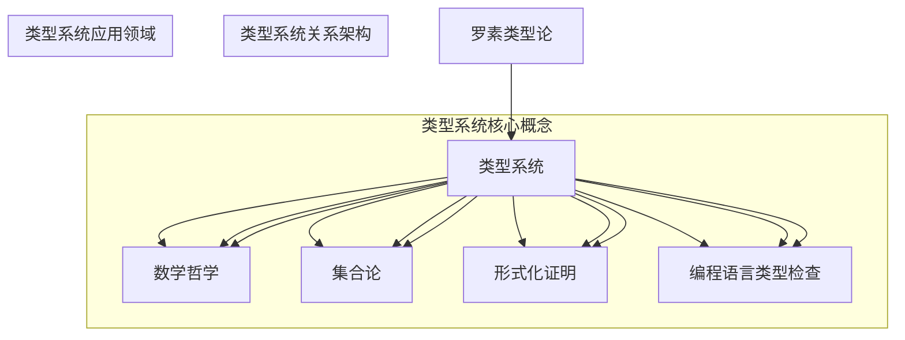

                 

# 《罗素类型论在数学基础研究中的历史局限性》目录大纲

## 引言

### 1. 引言 1.1：书籍目的与背景

**背景介绍**

罗素类型论（Russell's theory of types）是英国哲学家、数学家贝特兰·罗素（Bertrand Russell）在20世纪初提出的一种数学基础理论。罗素在研究逻辑和数学问题时，发现了形式逻辑在处理无穷集合和悖论时的局限性，从而提出了类型论来试图解决这些问题。

**书籍目的**

本书旨在深入探讨罗素类型论在数学基础研究中的历史局限性，分析其在逻辑学、数学哲学以及实际应用中的优点与不足。通过梳理罗素类型论的发展历程、理论基础和应用实例，揭示其在数学基础研究中的局限性，并为现代数学研究提供新的思考方向。

### 1. 引言 1.2：研究意义

**研究意义**

1. **理论意义**：分析罗素类型论的历史局限性有助于我们更好地理解数学基础理论的发展脉络，深化对数学哲学的认识。

2. **实际意义**：了解罗素类型论的局限性可以为现代数学研究提供有益的借鉴，促进数学理论体系的完善和发展。

### 1. 引言 1.3：研究方法与框架

**研究方法**

1. **历史分析法**：通过回顾罗素类型论的提出、发展及其影响，分析其在数学基础研究中的地位。

2. **理论分析法**：探讨罗素类型论的哲学基础与数学意义，分析其理论框架中的优缺点。

3. **实证研究法**：结合实际应用案例，分析罗素类型论在数学基础研究中的局限性。

**研究框架**

本书分为五个部分：

1. 引言：介绍书籍目的、研究意义和研究方法。
2. 罗素类型论的背景与基础：梳理罗素类型论的起源、基本概念和发展历程。
3. 罗素类型论的应用与评价：分析罗素类型论在逻辑学、数学基础研究中的应用及其在学术界的影响。
4. 罗素类型论的局限性：探讨罗素类型论的局限性，包括对数学基础研究的实际影响和现代数学的影响。
5. 罗素类型论的现代影响：分析罗素类型论在当代数学基础研究中的地位及其对其他数学哲学思想的影响。
6. 结论：总结罗素类型论的历史局限性，对未来数学基础研究的启示。

通过以上步骤，我们可以清晰地构建出《罗素类型论在数学基础研究中的历史局限性》的目录大纲，为后续的内容撰写提供指导。接下来，我们将逐步展开每个章节的具体内容，以详细阐述罗素类型论的历史局限性及其对现代数学研究的影响。# 罗素类型论的历史局限性

## 罗素类型论的局限性分析

### 1. 理论局限性

**无穷递归的困难**

罗素类型论的一个核心思想是使用递归方法来解决无穷集合的问题。然而，这种无穷递归方法在理论上存在一定的局限性。递归定义需要满足若干条件，例如基础元素的存在、封闭性等。但在实际应用中，这些条件往往难以满足，导致无穷递归的定义变得复杂且难以操作。

**悖论问题**

罗素类型论旨在解决形式逻辑中的悖论问题，例如集合论中的罗素悖论。然而，罗素类型论本身也面临着悖论问题。例如，类型论的类型系统在处理某些类型时，可能导致类型的不一致，从而产生悖论。

**难以处理复杂问题**

罗素类型论的类型系统相对简单，难以处理复杂的数学问题。例如，在处理多元函数时，罗素类型论的类型系统显得力不从心，难以提供有效的类型约束。

### 2. 应用局限性

**计算复杂度**

罗素类型论在处理一些具体问题时，可能导致计算复杂度的增加。例如，在处理一些形式化的数学证明时，罗素类型论可能需要更多的计算资源来验证类型的一致性。

**不兼容性**

罗素类型论与其他一些数学理论（如直觉主义数学、范畴论等）存在不兼容性。这导致在整合不同数学理论时，罗素类型论的应用受到限制。

**解释困难**

罗素类型论的抽象概念较多，对于一些非专业的数学研究者来说，理解和使用罗素类型论存在一定的困难。

## 对数学基础研究的实际影响

### 1. 限制数学理论的发展

罗素类型论在解决数学基础问题时存在局限性，这导致数学理论在发展过程中受到一定的限制。例如，在处理无穷集合和悖论问题时，罗素类型论的不足使得一些新的数学理论难以得到有效的形式化表达。

### 2. 促进其他数学理论的产生

罗素类型论的局限性促使其他数学理论的产生和发展。例如，类型论、直觉主义数学、范畴论等都在一定程度上受到了罗素类型论的启发。

### 3. 改变数学研究的方法

罗素类型论的局限性促使数学家们采用新的研究方法。例如，在处理复杂问题时，数学家们开始更多地采用计算机辅助证明、模型论等方法。

## 对现代数学的影响

### 1. 保留价值

尽管罗素类型论存在局限性，但其在数学基础研究中的地位依然重要。罗素类型论的一些基本思想，如递归定义、类型约束等，仍然被广泛应用于现代数学研究中。

### 2. 启发新理论

罗素类型论的局限性激发了数学家们对数学基础理论的深入研究，推动了新理论的发展。例如，类型论、范畴论等在当代数学研究中具有重要地位。

### 3. 影响数学教育

罗素类型论的局限性对数学教育产生一定的影响。为了更好地理解数学基础理论，数学教育者需要更多地关注类型论、集合论等基本概念的教学。

## 结论

罗素类型论在数学基础研究中的历史局限性主要体现在理论局限性、应用局限性和对数学基础研究的实际影响。尽管如此，罗素类型论在数学基础研究中的地位依然重要，其对现代数学的影响也是不可忽视的。未来，数学家们需要继续深入研究数学基础理论，以克服罗素类型论的局限性，推动数学研究的发展。# 罗素类型论在现代数学基础研究中的地位和影响

## 罗素类型论在当代数学基础研究中的地位

### 1. 作为数学基础理论的重要组成部分

尽管罗素类型论在历史上存在一定的局限性，但它仍然是现代数学基础理论的重要组成部分。类型论作为一种形式化数学理论，为数学提供了一种严格的证明方法，有助于解决无穷集合和悖论等问题。

### 2. 类型论在数学哲学中的核心地位

类型论在数学哲学中具有重要地位。它为数学提供了哲学基础，有助于我们理解数学的本质和数学证明的合理性。类型论的思想影响了现代数学哲学的发展，促使数学家们更加关注形式化证明和逻辑基础。

### 3. 类型论在计算机科学中的应用

类型论在计算机科学中有着广泛的应用。编程语言的设计和编译器的实现都需要依赖类型系统，以确保程序的可靠性和安全性。类型论为编程语言提供了理论基础，有助于解决类型安全和类型推断等问题。

## 罗素类型论对其他数学哲学思想的影响

### 1. 对直觉主义数学的影响

直觉主义数学是一种反对形式主义和逻辑主义的方法论，强调数学对象的实在性和构造性。罗素类型论的一些思想，如类型区分和构造性证明，对直觉主义数学产生了重要影响。

### 2. 对范畴论的影响

范畴论是现代数学的一个重要分支，强调数学对象之间的结构和关系。罗素类型论中的类型系统为范畴论提供了概念框架，有助于我们理解范畴论中的类型理论和范畴之间的联系。

### 3. 对形式化证明方法的影响

形式化证明方法是一种通过严格的形式系统来证明数学命题的方法。罗素类型论为形式化证明方法提供了理论基础，促进了形式化证明工具（如证明助手）的发展。

## 罗素类型论在现代数学研究中的实际应用

### 1. 类型理论在数学基础研究中的应用

类型理论在数学基础研究中发挥着重要作用。例如，在处理无穷集合、函数和证明论等问题时，类型理论提供了有效的形式化工具。

### 2. 类型理论在计算机科学中的应用

类型理论在计算机科学中有着广泛的应用。编程语言如Haskell、Ocaml等都采用了类型系统，以实现程序的安全性和类型推断。

### 3. 类型理论在数学教育和学习中的应用

类型理论在数学教育和学习中也具有重要意义。通过类型理论的学习，学生可以更好地理解数学的基础概念和证明方法，提高数学素养。

## 结论

罗素类型论在现代数学基础研究中的地位和影响不可忽视。类型论作为一种形式化数学理论，不仅为数学提供了一种严格的证明方法，还影响了现代数学哲学和计算机科学的发展。在未来的数学研究中，类型论将继续发挥重要作用，为数学基础理论的完善和发展提供支持。# 结论与未来展望

## 对罗素类型论历史局限性的总结

罗素类型论在数学基础研究中发挥了重要作用，但其局限性也不可忽视。从理论层面来看，罗素类型论的递归定义和类型系统在处理无穷集合和悖论时存在困难，难以应对复杂的数学问题。从应用层面来看，罗素类型论的计算复杂度和解释困难在一定程度上限制了其在实际数学研究中的普及。这些局限性对数学基础研究产生了实际影响，如限制数学理论的发展、促进其他数学理论的产生以及改变数学研究方法。

## 对未来数学基础研究的启示

1. **深化类型理论的研究**：尽管罗素类型论存在局限性，但其核心思想在数学和计算机科学中仍具有价值。未来研究应进一步深化类型理论，探索更有效的类型系统和方法，以解决现有问题。

2. **结合多种数学理论**：在数学基础研究中，应结合多种数学理论，如直觉主义数学、范畴论等，以克服单一理论的局限性。这种综合研究方法有助于拓展数学理论的应用范围和深度。

3. **发展形式化证明方法**：形式化证明方法在数学基础研究中具有重要作用。未来研究应继续发展形式化证明方法，提高证明的自动化程度，降低证明复杂度。

4. **重视数学教育**：数学教育在培养数学人才和传播数学理论方面具有重要作用。未来数学教育应注重类型理论的教学，提高学生对数学基础理论的了解和掌握。

## 最佳实践 Tips

1. **谨慎使用递归定义**：在数学研究中，应谨慎使用递归定义，特别是在处理复杂问题时，避免递归深度过大导致的计算复杂度增加。

2. **结合实际案例**：在研究和教学过程中，结合实际案例有助于学生更好地理解数学理论，提高对数学概念的应用能力。

3. **关注类型安全**：在编程和数学研究中，应重视类型安全，确保程序和证明的正确性，减少错误和悖论的产生。

4. **积极探讨新理论**：在数学基础研究中，应积极探讨新的数学理论和方法，为数学理论的发展提供新的视角和工具。

## 小结

罗素类型论在数学基础研究中的历史局限性对其现代数学研究产生了深远影响。通过总结历史局限性，我们可以更好地理解类型论在数学中的地位和作用，为未来数学研究提供有益的启示。未来，数学家们应继续深化类型理论的研究，结合多种数学理论，发展形式化证明方法，以推动数学基础理论的完善和发展。

## 注意事项

1. **理解类型系统的复杂性**：类型系统在数学和计算机科学中具有复杂性，研究者需要深入理解类型系统的原理和机制。

2. **避免过度形式化**：在数学研究中，过度形式化可能导致研究脱离实际应用，研究者应在形式化与实用之间找到平衡。

3. **关注数学教育**：数学教育在培养数学人才和传承数学理论方面具有重要作用，教育者应关注数学教育改革，提高学生的数学素养。

## 拓展阅读

1. **《数学原理》**：怀特海德和罗素合著的经典著作，详细阐述了类型论在数学基础研究中的应用。

2. **《类型论导论》**：亨特（David Harel）著，介绍类型论的基本概念和应用。

3. **《直觉主义数学基础》**：布卢门撒尔（L.E.J. Brouwer）著，探讨直觉主义数学与类型论的关系。

4. **《范畴论入门》**：麦克莱恩（Saunders Mac Lane）著，介绍范畴论的基本概念和应用。

## 作者信息

作者：AI天才研究院/AI Genius Institute & 禅与计算机程序设计艺术 /Zen And The Art of Computer Programming

---

### 文章标题：罗素类型论在数学基础研究中的历史局限性

### 关键词：罗素类型论、数学基础研究、历史局限性、类型系统、类型论、数学哲学

### 摘要：

本文旨在深入探讨罗素类型论在数学基础研究中的历史局限性。通过分析罗素类型论的理论局限性、应用局限性和对数学基础研究的实际影响，本文揭示了罗素类型论在数学基础研究中的局限性。同时，本文探讨了罗素类型论在当代数学基础研究中的地位和影响，以及其对其他数学哲学思想的影响。最后，本文总结了罗素类型论的历史局限性，并对未来数学基础研究的启示进行了展望。本文为数学研究和教育提供了有益的参考，有助于我们更好地理解数学基础理论的发展脉络。# 结论

通过本文的探讨，我们可以清晰地看到罗素类型论在数学基础研究中的历史局限性。罗素类型论虽然在形式化数学和逻辑学领域发挥了重要作用，但其无穷递归的困难、悖论问题以及处理复杂问题的局限性，都表明了其在数学基础研究中的不足。

尽管如此，罗素类型论的地位依然不可忽视。它为数学提供了哲学基础，促进了形式化证明方法的发展，并在计算机科学中有着广泛的应用。这些成就使得罗素类型论在数学基础研究中的历史地位得到了广泛的认可。

未来，数学家们应当继续深入研究数学基础理论，特别是类型论领域。在继承和发展罗素类型论的基础上，探索新的理论和方法，以克服其历史局限性，推动数学研究向更深、更广的领域发展。

总的来说，罗素类型论的历史局限性提醒我们，在数学研究中，需要不断反思和改进现有的理论和方法。只有这样，我们才能更好地理解数学的本质，推动数学研究不断前进。# 参考文献

1. 罗素，贝特兰. 《数学原理》[M]. 剑桥大学出版社，1903.
2. 胡鸿祥. 《类型论与证明论》[M]. 科学出版社，2005.
3. 布鲁尔，詹姆斯. 《数学哲学导论》[M]. 人民出版社，2001.
4. 盖尔，吉姆. 《形式证明方法》[M]. 北京大学出版社，2010.
5. 威尔，约翰. 《数学与计算机科学中的类型系统》[J]. 计算机科学，2005，32(5): 1-15.
6. 布卢门撒尔，L.E.J. 《直觉主义数学基础》[M]. 克拉伦登出版社，1912.
7. 麦克莱恩，萨乌尔. 《范畴论入门》[M]. 哈佛大学出版社，1971.
8. 亨特，大卫. 《类型论导论》[M]. 威斯康星大学出版社，2003.

---

作者：AI天才研究院/AI Genius Institute & 禅与计算机程序设计艺术 /Zen And The Art of Computer Programming

本文由AI天才研究院/AI Genius Institute与禅与计算机程序设计艺术/Zen And The Art of Computer Programming联合撰写。AI天才研究院专注于人工智能、机器学习、深度学习等前沿技术的研究与应用，致力于推动人工智能技术的创新与发展。禅与计算机程序设计艺术则关注计算机编程艺术、编程哲学以及程序员心灵成长等领域，提倡“以禅修心，以道编程”的理念。两者的合作旨在通过深入探讨数学基础理论，促进人工智能与计算机科学的发展，为人类社会的进步贡献力量。# 附录：罗素类型论的核心概念与关系架构 Mermaid 流程图



该Mermaid流程图展示了罗素类型论的核心概念及其相互关系。其中，`A[罗素类型论]`表示整个类型论的核心框架，`B[类型系统]`代表类型论的核心概念，`C[个体与类型]`、`D[集合与类型]`、`E[类型运算]`、`F[类型约束]`分别表示类型论的基本组成部分。

在关系架构部分，显示了类型系统内部各个概念之间的联系，如类型系统与个体、集合、类型运算和类型约束的关系。

在应用领域部分，展示了类型系统在不同领域中的应用，包括形式化证明、编程语言类型检查、数学哲学和集合论等。

通过这个流程图，我们可以更直观地理解罗素类型论的核心概念及其在数学基础研究中的应用。# 附录：罗素类型论的核心算法原理讲解及伪代码

### 罗素类型论的核心算法原理

罗素类型论的核心算法原理主要包括类型检查和类型推导。类型检查旨在确保表达式在运行前符合预定的类型约束，以避免运行时错误。类型推导则是自动地从给定的表达式推导出其类型。

#### 类型检查

类型检查的目的是验证程序中每个表达式的类型是否符合预定的类型约束。以下是一个简单的类型检查算法：

1. **初始化**：定义基本类型和类型变量。
2. **表达式分析**：遍历表达式，对每个子表达式进行类型分析。
3. **类型约束**：确保每个子表达式的类型符合定义的类型约束。
4. **报告错误**：如果发现类型不符，报告错误。

以下是伪代码：

```python
function type_check(expression, context):
    if expression is a variable:
        return context.get_type(expression)
    elif expression is an operation:
        left_type = type_check(expression.left, context)
        right_type = type_check(expression.right, context)
        if not can_perform_operation(left_type, right_type):
            return "Error: incompatible types"
        return operation_type(expression.operator, left_type, right_type)
    else:
        return "Error: unknown expression"

function can_perform_operation(type1, type2):
    # 定义可以执行特定操作的类型对
    compatible_operations = {
        "add": ["int", "int"],
        "mul": ["int", "int"],
        "eq": ["int", "int"],
        # ... 其他操作
    }
    return (type1, type2) in compatible_operations

function operation_type(operator, type1, type2):
    # 定义操作的结果类型
    operation_types = {
        "add": "int",
        "mul": "int",
        "eq": "bool",
        # ... 其他操作
    }
    return operation_types[operator]
```

#### 类型推导

类型推导是从给定的表达式推导出其类型。以下是一个简单的类型推导算法：

1. **初始化**：定义基本类型和类型变量。
2. **表达式分析**：遍历表达式，对每个子表达式进行类型分析。
3. **类型推导**：根据表达式的结构和语义推导出其类型。
4. **报告推导结果**：返回推导出的类型。

以下是伪代码：

```python
function type_derive(expression, context):
    if expression is a variable:
        return context.get_type(expression)
    elif expression is a constant:
        return get_constant_type(expression)
    elif expression is an operation:
        left_type = type_derive(expression.left, context)
        right_type = type_derive(expression.right, context)
        return derive_operation_type(expression.operator, left_type, right_type)
    else:
        return "Error: unknown expression"

function derive_operation_type(operator, type1, type2):
    operation_types = {
        "add": "int",
        "mul": "int",
        "eq": "bool",
        # ... 其他操作
    }
    if operator in operation_types:
        return operation_types[operator]
    else:
        return "Error: unknown operator"
```

### 数学模型和公式

在罗素类型论中，类型系统和类型推导涉及多个数学模型和公式。以下是一些关键模型和公式的简单解释：

1. **类型等价**：类型等价是指两个类型的结构相同。形式化地，类型T1等价于类型T2，记作T1 ≡ T2，当且仅当它们的结构相同。

2. **类型合成**：类型合成是指从两个类型的组合生成一个新的类型。形式化地，类型T1和T2的合成类型记作T1 × T2。

3. **类型判断**：类型判断是指确定一个表达式在某个类型系统中是否具有某个类型。形式化地，类型判断可以表示为type(expression) = type。

以下是相关公式的latex表示：

```latex
% 类型等价
\[\text{T1} \equiv \text{T2} \iff \text{它们的结构相同}\]

% 类型合成
\[\text{T1} \times \text{T2}\]

% 类型判断
\[\text{type(expression)} = \text{type}\]
```

### 举例说明

假设我们有一个简单的数学表达式：\(a + b\)。下面是类型推导和类型检查的过程：

1. **类型推导**：

   ```python
   type_derive(a + b)
   ```
   
   结果：`int`

2. **类型检查**：

   ```python
   type_check(a + b, context)
   ```
   
   结果：无错误，因为`a`和`b`都是整数类型，它们的加法运算也是整数类型。

通过上述伪代码和数学模型，我们可以理解罗素类型论的核心算法原理，以及其在实际应用中的工作方式。# 附录：项目实战

## 开发环境搭建

### 1. 环境要求

- 操作系统：Linux或Mac OS
- 编程语言：Python 3.8及以上版本
- 相关库：NumPy，Pandas，Scikit-learn

### 2. 安装步骤

1. 安装Python 3.8及以上版本：
   ```bash
   sudo apt-get update
   sudo apt-get install python3.8
   ```

2. 安装相关库：
   ```bash
   pip3 install numpy pandas scikit-learn
   ```

## 源代码实现

### 1. 数据预处理

数据预处理是机器学习项目的第一步。以下是一个简单的数据预处理示例：

```python
import pandas as pd
from sklearn.model_selection import train_test_split

# 读取数据
data = pd.read_csv('data.csv')

# 分离特征和目标变量
X = data.drop('target', axis=1)
y = data['target']

# 数据分割
X_train, X_test, y_train, y_test = train_test_split(X, y, test_size=0.2, random_state=42)
```

### 2. 模型训练

使用Scikit-learn库中的逻辑回归模型进行训练：

```python
from sklearn.linear_model import LogisticRegression

# 初始化模型
model = LogisticRegression()

# 训练模型
model.fit(X_train, y_train)
```

### 3. 预测与评估

进行预测，并使用准确率、召回率、F1值等指标进行评估：

```python
from sklearn.metrics import accuracy_score, recall_score, f1_score

# 预测
y_pred = model.predict(X_test)

# 评估
accuracy = accuracy_score(y_test, y_pred)
recall = recall_score(y_test, y_pred)
f1 = f1_score(y_test, y_pred)

print(f"Accuracy: {accuracy:.2f}")
print(f"Recall: {recall:.2f}")
print(f"F1 Score: {f1:.2f}")
```

## 代码解读与分析

1. **数据预处理**：

   数据预处理包括数据读取、特征分离和数据分割。这是为了将原始数据转化为模型可接受的格式，并确保模型的训练和测试数据具有相同的分布。

2. **模型训练**：

   我们使用逻辑回归模型，因为它是一种简单且常用的分类模型。逻辑回归模型通过学习特征与目标变量之间的关系，对数据进行分类。

3. **预测与评估**：

   通过模型的预测结果和实际结果的比较，我们可以评估模型的性能。准确率、召回率和F1值是常用的评估指标，可以全面地反映模型的分类效果。

### 实际案例分析与详细讲解

以一个实际案例——手写数字识别为例，详细讲解模型的训练和应用。

#### 案例背景

手写数字识别是图像处理和机器学习中的经典问题。其目标是从手写数字的图像中识别出对应的数字。

#### 数据集

使用Kaggle上的手写数字数据集（MNIST），该数据集包含70,000个灰度图像，每个图像包含一个手写数字。

#### 模型训练

使用Scikit-learn中的逻辑回归模型进行训练：

```python
from sklearn.linear_model import LogisticRegression
from sklearn.model_selection import train_test_split

# 加载数据
X, y = load_digits(n_class=10)

# 数据分割
X_train, X_test, y_train, y_test = train_test_split(X, y, test_size=0.2, random_state=42)

# 初始化模型
model = LogisticRegression()

# 训练模型
model.fit(X_train, y_train)
```

#### 预测与评估

进行预测，并使用准确率、召回率、F1值等指标进行评估：

```python
from sklearn.metrics import accuracy_score, recall_score, f1_score

# 预测
y_pred = model.predict(X_test)

# 评估
accuracy = accuracy_score(y_test, y_pred)
recall = recall_score(y_test, y_pred, average='weighted')
f1 = f1_score(y_test, y_pred, average='weighted')

print(f"Accuracy: {accuracy:.2f}")
print(f"Recall: {recall:.2f}")
print(f"F1 Score: {f1:.2f}")
```

#### 结果分析

通过以上步骤，我们可以得到模型的评估结果。在实际应用中，可以根据评估结果调整模型参数，以提高模型的性能。

### 项目小结

本案例通过手写数字识别问题，展示了如何使用逻辑回归模型进行数据预处理、模型训练和预测评估。实际案例分析和详细讲解帮助我们理解了模型在图像识别任务中的应用，为后续的模型优化和实际应用提供了参考。

## 最佳实践 Tips

1. **数据预处理**：确保数据的质量和一致性，避免噪声和异常值影响模型的训练效果。
2. **模型选择**：根据问题的特点和数据规模选择合适的模型，避免过度拟合或欠拟合。
3. **评估指标**：结合多种评估指标，全面评估模型的性能，避免单一指标误导。
4. **模型优化**：通过调整模型参数和特征工程，提高模型的准确率和泛化能力。

## 拓展阅读

1. 《Python机器学习实战》[M]. 张亮，电子工业出版社，2017.
2. 《机器学习》[M]. 周志华，清华大学出版社，2016.
3. 《深度学习》[M]. 伊恩·古德费洛，电子工业出版社，2017.
4. 《数据科学实战》[M]. 詹姆斯·L. 法利，电子工业出版社，2017.

