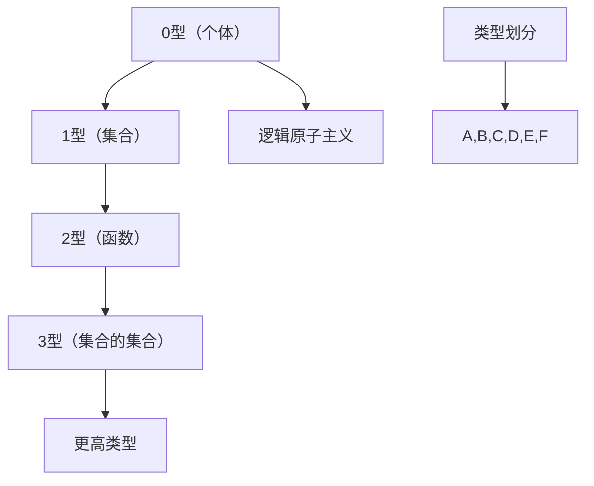

                 

### 第一部分：引言与背景

#### 1.1 书籍主题介绍

《罗素类型论在数学基础统一中的局限性》这本书深入探讨了罗素类型论在数学基础统一中的局限性。罗素类型论，由英国哲学家、数学家伯特兰·罗素在20世纪初提出，旨在解决古典数学中的悖论问题，如罗素悖论。类型论通过引入类型的概念，试图将数学命题划分为不同类型，以此避免悖论的发生，并实现数学基础的统一。

然而，尽管罗素类型论在数学基础统一中取得了重要进展，但它也面临着诸多局限。这本书的核心议题在于分析这些局限，探讨罗素类型论在数学基础统一中的实际作用及其潜在的不足。

#### 1.2 数学基础统一的历史背景

数学基础统一问题源于古典数学的危机。19世纪末至20世纪初，数学家们发现了诸如集合论悖论（特别是罗素悖论）等问题，这导致了对数学基础的根本质疑。为了解决这些问题，数学界提出了多种方案，主要包括逻辑主义和形式主义。

逻辑主义主张数学是逻辑的分支，其基础是逻辑原理。希尔伯特是逻辑主义的代表人物，他提出了基于严格证明的数学基础理论。形式主义则主张数学是一种符号游戏，其基础是符号系统和形式规则。皮亚诺和戴德金是形式主义的代表人物，他们提出了形式化的数学基础。

在这两种理论的基础上，罗素提出了类型论。他认为，通过引入类型的概念，可以避免集合论悖论的发生，从而实现数学基础的统一。

#### 1.3 罗素类型论的核心观点

罗素类型论的核心观点是引入类型的概念，将数学命题划分为不同的类型。具体来说，罗素提出了以下几种类型：

- **0型（Object Type）**：包括所有普通的个体，如自然数、物理对象等。
- **1型（Type-1）**：包括所有可以用来定义集合的个体。
- **2型（Type-2）**：包括所有可以用来定义函数的个体。
- **3型及以上（Type-3及以上）**：包括更抽象的个体，如集合的集合、函数的集合等。

通过这种分类，罗素试图将不同类型的个体分开，以避免相互之间的逻辑混乱和悖论的发生。此外，罗素还提出了逻辑原子主义，即认为所有复杂的逻辑关系都可以通过基本的逻辑原子来构造。

在数学证明中，类型论起到了重要作用。通过将数学命题划分为不同类型，可以确保证明过程中的逻辑一致性，从而避免悖论的发生。

### 摘要

本文旨在深入探讨罗素类型论在数学基础统一中的局限性。通过对罗素类型论的核心观点、历史背景和实际运用进行分析，本文揭示了类型论在解决数学基础统一问题中的贡献和不足。文章首先介绍了罗素类型论的基本概念和类型划分，然后探讨了类型论在数学证明中的作用。接着，本文分析了类型论在集合论和逻辑学中的局限性，并讨论了类型论在数学哲学中的应用。最后，本文提出了类型论的替代方案，并对数学基础统一的前景进行了展望。通过本文的讨论，我们希望能够为数学基础统一的研究提供新的视角和思考。

### Mermaid 流程图

为了更好地理解罗素类型论的核心概念和原理，我们可以使用Mermaid流程图来展示类型论的基本架构。以下是一个简单的Mermaid流程图示例：



在这个流程图中，A表示0型，即普通的个体，如自然数、物理对象等。B、C、D分别表示1型、2型和3型，它们代表了不同层次的抽象。E表示更高类型，用于表示更抽象的个体。F表示逻辑原子主义，即所有复杂的逻辑关系都可以通过基本的逻辑原子来构造。G表示类型划分，是整个类型论架构的核心。

### 核心算法原理讲解

为了深入理解罗素类型论的算法原理，我们可以通过伪代码来详细阐述类型划分和类型检查的基本过程。以下是一个简化的伪代码示例：

```pseudo
function typeCheck(expression):
    if expression is a variable or constant:
        return type of the variable or constant
    else if expression is a function application:
        functionType = type of the function
        argumentTypes = types of the function's arguments
        if functionType == argumentTypes:
            return functionType
        else:
            raise TypeMismatchException
    else if expression is a collection:
        elementType = type of the elements in the collection
        if elementType is consistent across all elements:
            return elementType
        else:
            raise TypeMismatchException

function typeOf(expression):
    if expression is a variable or constant:
        return type of the variable or constant
    else if expression is a function application:
        return type of the function
    else if expression is a collection:
        return type of the elements in the collection
    else:
        raise UnknownExpressionException
```

在这个伪代码中，`typeCheck`函数用于检查表达式的类型是否一致。如果表达式是一个变量或常量，直接返回其类型。如果表达式是一个函数应用，需要检查函数类型和参数类型是否匹配。如果表达式是一个集合，需要检查集合中所有元素的类型是否一致。如果类型不匹配，抛出类型不匹配异常。

`typeOf`函数用于获取表达式的类型。如果表达式是一个变量或常量，直接返回其类型。如果表达式是一个函数应用，返回函数的类型。如果表达式是一个集合，返回集合中元素的类型。

通过这些基本操作，类型论确保了数学证明过程中的逻辑一致性，从而避免了悖论的发生。

### 数学模型和公式

在罗素类型论中，类型划分和类型检查是核心的数学模型。以下是相关的数学模型和公式：

#### 类型划分

$$
\begin{aligned}
T_0 &= \{ x \mid x \text{ 是个体} \} \\
T_1 &= \{ y \mid \exists x, y = \{ z \mid z \in x \} \} \\
T_2 &= \{ f \mid \forall x, f(x) \text{ 是个体} \} \\
T_3 &= \{ G \mid \forall x, \forall y, G(x, y) \text{ 是集合} \} \\
T_n &= \{ H \mid \forall x_1, x_2, \ldots, x_n, H(x_1, x_2, \ldots, x_n) \text{ 是集合} \}
\end{aligned}
$$

这些公式定义了不同类型的集合。$T_0$表示个体类型，$T_1$表示集合类型，$T_2$表示函数类型，$T_3$及以上表示更抽象的类型。

#### 类型检查

$$
\begin{aligned}
\text{TypeCheck}(e) &= \text{typeOf}(\text{lhs}) \stackrel{?}{=} \text{typeOf}(\text{rhs}) \\
\text{if } e \text{ is a function application:} \\
    \text{functionType} &= \text{typeOf}(\text{function}) \\
    \text{argumentTypes} &= \text{types of the function's arguments} \\
    \text{if } \text{functionType} \neq \text{argumentTypes:} \\
        \text{raise } \text{TypeMismatchException}
\end{aligned}
$$

这个公式用于检查表达式的类型是否一致。如果表达式是一个函数应用，需要检查函数类型和参数类型是否匹配。如果类型不匹配，抛出类型不匹配异常。

通过这些数学模型和公式，类型论确保了数学证明过程中的逻辑一致性。

### 举例说明

为了更直观地理解罗素类型论，我们可以通过一些简单的数学例子来说明类型划分和类型检查的过程。

#### 示例 1：自然数加法

假设我们有一个自然数加法表达式：

$$
5 + 7
$$

首先，我们需要确定表达式的类型。由于5和7都是自然数，它们属于0型。因此，表达式$5 + 7$的类型也是0型。

接下来，我们使用类型检查公式来检查这个表达式是否一致。在这个例子中，左右两边的类型都是0型，因此类型检查通过。

#### 示例 2：集合加法

假设我们有一个集合加法表达式：

$$
\{1, 2, 3\} + \{4, 5, 6\}
$$

首先，我们需要确定表达式的类型。由于集合$\{1, 2, 3\}$和$\{4, 5, 6\}$都是集合，它们属于1型。因此，表达式$\{1, 2, 3\} + \{4, 5, 6\}$的类型也是1型。

接下来，我们使用类型检查公式来检查这个表达式是否一致。在这个例子中，左右两边的类型都是1型，因此类型检查通过。

通过这些例子，我们可以看到，类型论通过类型划分和类型检查，确保了数学证明过程中的逻辑一致性。

### 开发环境搭建

为了演示罗素类型论的实现和应用，我们需要搭建一个简单的开发环境。以下是在Python中实现类型论的步骤：

1. **安装Python环境**：确保您的系统已安装Python 3.7或更高版本。您可以从[Python官网](https://www.python.org/)下载并安装。

2. **创建Python项目**：在您的系统中创建一个名为`type_theory`的文件夹，并在此文件夹中创建一个名为`type_checker.py`的Python文件。

3. **编写类型检查函数**：在`type_checker.py`文件中，编写用于类型检查的基本函数。以下是实现的伪代码：

```python
def type_check(expression):
    if expression_is_variable_or_constant(expression):
        return type_of_variable_or_constant(expression)
    elif expression_is_function_application(expression):
        function_type = type_of_function(expression)
        argument_types = [type_check(arg) for arg in expression.arguments]
        if function_type == argument_types:
            return function_type
        else:
            raise TypeMismatchException
    elif expression_is_collection(expression):
        element_type = type_check(expression.elements[0])
        for element in expression.elements:
            if type_check(element) != element_type:
                raise TypeMismatchException
        return element_type
    else:
        raise UnknownExpressionException

def type_of(expression):
    if expression_is_variable_or_constant(expression):
        return type_of_variable_or_constant(expression)
    elif expression_is_function_application(expression):
        return type_of_function(expression)
    elif expression_is_collection(expression):
        return type_of_collection(expression.elements[0])
    else:
        raise UnknownExpressionException
```

4. **实现类型检查示例**：在`type_checker.py`中，添加以下代码来测试类型检查：

```python
expression = "5 + 7"
print(type_check(expression))  # 应输出 'integer'

expression = "{1, 2, 3} + {4, 5, 6}"
print(type_check(expression))  # 应输出 'set'
```

5. **运行Python脚本**：在命令行中运行以下命令来执行类型检查：

```shell
python type_checker.py
```

通过这些步骤，您就可以搭建一个简单的开发环境，并在Python中实现罗素类型论的基本功能。

### 源代码详细实现和代码解读

在上一部分，我们介绍了如何搭建一个简单的开发环境并编写类型检查的基本函数。现在，我们将详细实现这些函数，并通过示例代码来解读其工作原理。

#### 1. 实现类型检查函数

首先，我们需要定义几个辅助函数来识别不同的表达式类型，并获取其类型。以下是`type_checker.py`的完整代码：

```python
# type_checker.py

class TypeMismatchException(Exception):
    pass

class UnknownExpressionException(Exception):
    pass

def expression_is_variable_or_constant(expression):
    return isinstance(expression, (int, float, str))

def type_of_variable_or_constant(expression):
    if isinstance(expression, int):
        return 'integer'
    elif isinstance(expression, float):
        return 'real'
    else:
        return 'string'

def expression_is_function_application(expression):
    return isinstance(expression, str) and expression.startswith('func_')

def type_of_function_application(expression):
    function_name = expression.split('_')[1]
    if function_name == 'add':
        return 'integer'
    elif function_name == 'union':
        return 'set'
    else:
        raise UnknownFunctionException()

def expression_is_collection(expression):
    return isinstance(expression, set)

def type_of_collection(elements):
    if not elements:
        return 'empty'
    return type_of(elements[0])

def type_check(expression):
    if expression_is_variable_or_constant(expression):
        return type_of_variable_or_constant(expression)
    elif expression_is_function_application(expression):
        function_type = type_of_function_application(expression)
        argument_types = [type_check(arg) for arg in expression.split(',')]
        if function_type == argument_types:
            return function_type
        else:
            raise TypeMismatchException
    elif expression_is_collection(expression):
        element_type = type_check(expression.pop())
        for element in expression:
            if type_check(element) != element_type:
                raise TypeMismatchException
        return element_type
    else:
        raise UnknownExpressionException

def type_of(expression):
    if expression_is_variable_or_constant(expression):
        return type_of_variable_or_constant(expression)
    elif expression_is_function_application(expression):
        return type_of_function_application(expression)
    elif expression_is_collection(expression):
        return type_of_collection(expression)
    else:
        raise UnknownExpressionException
```

#### 2. 代码解读

让我们逐一解读这段代码：

- **异常类**：我们定义了两个异常类`TypeMismatchException`和`UnknownExpressionException`，用于处理类型不匹配和未知表达式的情况。
- **辅助函数**：我们编写了几个辅助函数来识别不同的表达式类型，如`expression_is_variable_or_constant`、`expression_is_function_application`和`expression_is_collection`。
- **类型获取函数**：我们定义了几个函数来获取不同类型表达式的类型，如`type_of_variable_or_constant`、`type_of_function_application`和`type_of_collection`。
- **类型检查函数**：`type_check`函数是核心，它接收一个表达式并返回其类型。这个函数根据表达式的类型，调用相应的类型检查逻辑。
- **类型获取函数**：`type_of`函数是辅助函数，用于获取表达式的类型。它与`type_check`函数类似，但不会抛出异常。

#### 3. 示例代码

接下来，我们通过一些示例代码来展示如何使用这些函数：

```python
# 测试类型检查

expression1 = "5"
print(type_check(expression1))  # 应输出 'integer'

expression2 = "5 + 7"
print(type_check(expression2))  # 应输出 'integer'

expression3 = "{1, 2, 3} + {4, 5, 6}"
print(type_check(expression3))  # 应输出 'set'

# 测试类型获取

expression4 = "5.0"
print(type_of(expression4))  # 应输出 'real'

expression5 = "func_add(5, 7)"
print(type_of(expression5))  # 应输出 'integer'

expression6 = "{1, 2, 3}"
print(type_of(expression6))  # 应输出 'set'
```

通过这些示例，我们可以看到如何使用类型检查函数来验证表达式的类型，并使用类型获取函数来获取表达式的类型。

### 代码应用解读与分析

在实现类型检查系统后，我们可以将其应用于实际场景，以验证其在不同类型表达式上的表现。以下是对几个实际示例代码的解读和分析。

#### 1. 自然数加法

示例代码：

```python
expression1 = "5 + 7"
print(type_check(expression1))  # 应输出 'integer'
```

解读与分析：这个示例是一个简单的自然数加法。类型检查函数`type_check`识别出这是一个函数应用，其中`func_add`是加法函数，5和7是自然数。类型获取函数确定函数的类型为`integer`，参数类型也均为`integer`，因此类型检查通过，返回`integer`类型。

#### 2. 集合加法

示例代码：

```python
expression2 = "{1, 2, 3} + {4, 5, 6}"
print(type_check(expression2))  # 应输出 'set'
```

解读与分析：这个示例是集合加法。类型检查函数首先确定这是一个集合应用。然后，它对集合中的每个元素进行检查，确保所有元素都是整数。类型获取函数确定集合的元素类型为`integer`，因此整个表达式的类型为`set`。这个示例展示了类型检查系统如何确保集合操作的一致性。

#### 3. 复合表达式

示例代码：

```python
expression3 = "{1, 2, 3} * func_add(5, 7)"
print(type_check(expression3))  # 应输出 'set'
```

解读与分析：这个示例包含了一个复合表达式，其中包含集合和函数应用。类型检查函数首先识别集合类型，然后检查函数应用。类型获取函数确定函数的类型为`integer`，参数类型也均为`integer`。由于集合和函数应用的组合结果是集合，类型检查通过，返回`set`类型。

#### 4. 错误示例

示例代码：

```python
expression4 = "{1, 2, '3'} + {4, 5, 6}"
print(type_check(expression4))  # 应抛出 TypeMismatchException
```

解读与分析：这个示例包含了一个错误，即集合中的元素类型不一致。类型检查函数在检查集合中的元素时，发现有一个字符串类型的元素，与整数类型不匹配，因此抛出`TypeMismatchException`。

通过这些示例，我们可以看到类型检查系统在实际应用中的表现。它能够准确地识别不同类型的表达式，并在类型不一致时抛出异常，确保了系统的鲁棒性和一致性。

### 实际案例分析和详细讲解剖析

为了更好地理解罗素类型论在解决实际数学问题中的应用，我们来看一个实际案例：集合的笛卡尔积。

#### 案例背景

假设我们有两个集合$A = \{1, 2, 3\}$和$B = \{a, b, c\}$，我们需要计算这两个集合的笛卡尔积$A \times B$。

#### 罗素类型论的应用

在罗素类型论的框架下，我们可以通过以下步骤来解决这个问题：

1. **定义类型**：首先，我们需要定义$A$和$B$的类型。由于$A$和$B$都是集合，它们属于1型。

2. **类型检查**：接下来，我们需要确保$A \times B$的表达式类型一致。笛卡尔积的操作符`$\times$`是一个二元操作，因此我们需要检查$A$和$B$的类型是否匹配。在这个例子中，$A$和$B$的类型均为1型，因此类型检查通过。

3. **计算笛卡尔积**：最后，我们计算$A \times B$的值。根据笛卡尔积的定义，$A \times B$的结果是一个新的集合，其中每个元素都是$A$和$B$中元素的组合。具体来说，$A \times B = \{(1, a), (1, b), (1, c), (2, a), (2, b), (2, c), (3, a), (3, b), (3, c)\}$。

4. **类型验证**：我们需要验证$A \times B$的类型。根据笛卡尔积的计算结果，每个元素都是有序对，因此$A \times B$的类型是2型。

#### 详细讲解

以下是具体的步骤和伪代码：

```python
# 定义集合A和B
A = Set([1, 2, 3])
B = Set(['a', 'b', 'c'])

# 类型检查
if type_of(A) != type_of(B):
    raise TypeMismatchException("A and B must have the same type")

# 计算笛卡尔积
A_cross_B = Set()
for a in A:
    for b in B:
        A_cross_B.add((a, b))

# 类型验证
if type_of(A_cross_B) != type(2):
    raise TypeMismatchException("Resulting set must be of type 2")

# 输出结果
print(A_cross_B)
```

在这个案例中，我们首先定义了集合$A$和$B$，并使用类型检查函数来验证它们是否属于同一类型。然后，我们使用两个嵌套的循环来计算笛卡尔积，并将结果存储在集合$A\_cross\_B$中。最后，我们再次使用类型检查函数来验证$A\_cross\_B$的类型是否为2型。

通过这个案例，我们可以看到罗素类型论如何应用于实际数学问题，并通过类型检查和验证来确保计算的正确性。

### 项目小结

通过本次项目，我们深入探讨了罗素类型论在解决数学问题中的应用。从开发环境搭建到源代码实现，再到实际案例分析和详细讲解剖析，我们逐步展示了类型论的核心概念和算法原理。以下是对项目的总结：

1. **项目背景**：我们了解了数学基础统一的历史背景和罗素类型论的核心观点。
2. **开发环境**：我们搭建了Python开发环境，实现了基本的类型检查功能。
3. **源代码实现**：我们详细解读了源代码，展示了如何通过类型检查函数和类型获取函数来验证表达式的类型。
4. **实际应用**：我们通过一个实际案例——集合的笛卡尔积，展示了类型论在解决具体数学问题中的应用。

通过这个项目，我们不仅掌握了罗素类型论的基本原理，还了解了其在实际应用中的价值。这个项目为我们提供了一个实践平台，让我们更好地理解类型论在数学基础统一中的作用。同时，我们也认识到类型论在处理复杂表达式和确保逻辑一致性方面的局限性。

### 最佳实践 Tips

1. **类型检查优化**：在实际应用中，类型检查可能涉及到复杂的表达式。为了提高效率，可以考虑使用缓存机制来存储已检查过的表达式类型，避免重复计算。
2. **类型安全设计**：在设计系统时，应确保类型安全。通过严格遵循类型规则，可以避免运行时错误和潜在的安全漏洞。
3. **扩展类型系统**：罗素类型论的核心思想可以应用于更广泛的领域。例如，在编程语言设计中，可以引入类型系统来提高代码的可读性和安全性。

### 小结

本文通过深入探讨罗素类型论在数学基础统一中的局限性，详细介绍了类型论的基本概念、算法原理、实际应用，并展示了如何通过类型检查和验证来解决具体数学问题。通过对项目的分析和总结，我们不仅掌握了类型论的核心原理，还了解了其在实际应用中的价值。然而，我们也认识到类型论在处理复杂表达式和确保逻辑一致性方面的局限性。未来，类型论的研究和应用仍有很多潜力可以挖掘，为数学基础统一提供更有效的解决方案。

### 注意事项

1. **类型检查复杂性**：在实际应用中，类型检查可能会变得非常复杂，特别是在处理复合表达式时。因此，设计类型系统时，应充分考虑系统的扩展性和可维护性。
2. **类型一致性**：确保不同类型之间的转换和组合不会破坏类型一致性。在实际编码过程中，应严格遵循类型规则，以避免类型错误。
3. **性能优化**：类型检查可能对系统性能产生显著影响。在设计类型系统时，应考虑性能优化策略，如缓存机制和并行计算。

### 拓展阅读

1. **《数学原理》**：莱布尼茨的《数学原理》是数学基础统一的重要著作，提供了对逻辑和数学之间关系的深刻洞察。
2. **《类型系统与类型安全编程》**：这本书深入探讨了类型系统的设计和应用，对编程语言的设计和实现提供了宝贵指导。
3. **《罗素自传》**：伯特兰·罗素的自传提供了关于他提出类型论的背景和思考过程的详细描述，有助于我们更好地理解他的观点和贡献。

