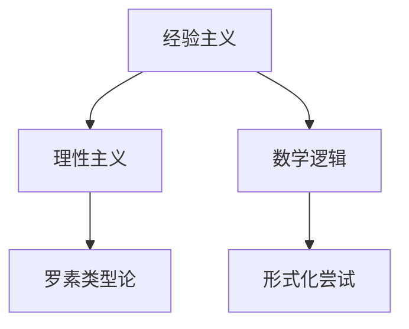
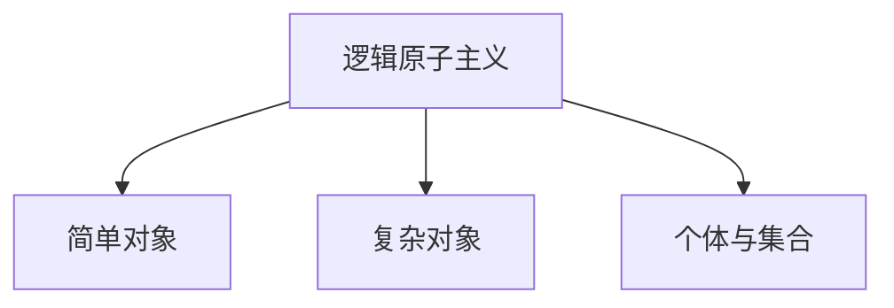

                 


## 罗素类型论在现代数学哲学中的批评声音

### 关键词
- 罗素类型论
- 数学哲学
- 批判观点
- 形式化
- 适用性

### 摘要

本文旨在探讨罗素类型论在现代数学哲学中的批评声音。罗素类型论是20世纪初由英国哲学家伯特兰·罗素提出的一种哲学思想，旨在解决逻辑原子主义中的悖论问题。然而，尽管罗素类型论在数学哲学领域有着深远的影响，它也面临着来自批评者的诸多质疑和挑战。本文将逐步分析这些批评观点，探讨罗素类型论的回应与辩护，并对其实际影响与评价进行深入讨论。

## 目录大纲

### 第一部分：罗素类型论的起源与发展

### 第二部分：罗素类型论的批评声音

### 第三部分：罗素类型论的影响与评价

### 第四部分：罗素类型论的未来发展

### 第一部分：罗素类型论的起源与发展

### 第1章：罗素类型论的起源

#### 1.1 罗素类型论提出的背景

**19世纪末至20世纪初的哲学背景**：在这个时期，哲学界经历了经验主义与理性主义的争论。经验主义者认为知识来源于经验，而理性主义者则强调理性在知识获取中的重要作用。此外，数学逻辑的兴起和形式化的尝试也为罗素类型论的提出提供了理论基础。

**逻辑原子主义的哲学基础**：罗素类型论的提出与逻辑原子主义密切相关。逻辑原子主义认为世界是由简单的基本事实组成的，这些事实可以通过逻辑陈述来描述。然而，这种观点面临悖论问题的挑战，例如集合论中的悖论。

**Mermaid流程图：**


#### 1.2 罗素类型论的初步构想

**罗素对逻辑原子主义的反思**：罗素认为逻辑原子主义过于简化了现实世界，忽视了复杂对象的存在。他提出了类型论来区分简单对象和复杂对象，以及个体与集合。

**对简单对象与复杂对象的区分**：简单对象是基本的逻辑原子，无法再分解，而复杂对象则是由简单对象组合而成的。

**对个体与集合的区分**：个体是具有独立存在的实体，而集合是由个体组成的整体。

**Mermaid流程图：**


#### 1.3 罗素类型论的核心观点

**类型论的基本原理**：罗素类型论的核心观点是，个体和集合是两种不同的类型，它们具有不同的属性和操作规则。

**对个体和集合的区分**：个体是具体的、可数的实体，而集合是抽象的、不可数的整体。

**对不同类型对象的操作规则**：不同类型的对象之间不能直接进行操作，必须在类型之间进行转换。

**伪代码：**
```python
# 类别定义
class Individual:
    # 个体属性和方法

class Collection:
    # 集合属性和方法

# 操作规则
def operate_on_types(type1, type2):
    # 根据类型执行操作
```

### 第2章：罗素类型论在逻辑原子主义中的应用

#### 2.1 逻辑原子主义的哲学基础

逻辑原子主义认为世界是由基本的事实和事实之间的关系组成的。这些基本事实是简单的、不可分割的，而事实之间的关系则是复杂的。逻辑原子主义试图通过逻辑陈述来描述这些基本事实和关系。

#### 2.2 罗素类型论与逻辑原子主义的关系

罗素类型论是对逻辑原子主义的一种补充。逻辑原子主义无法解决悖论问题，而罗素类型论通过区分个体和集合，提供了一种解决悖论的方法。

#### 2.3 罗素类型论的批判与回应

**批评者的主要观点**：
- **对类型论过度形式化的批评**：批评者认为罗素类型论过于形式化，忽略了现实世界的复杂性。
- **对类型论适用性的质疑**：批评者认为类型论在处理实际问题时缺乏适用性。
- **对类型论解释力的怀疑**：批评者认为类型论无法充分解释现实世界的多样性和复杂性。

**罗素的回应策略**：
- **强调类型论的必要性**：罗素认为类型论是解决悖论问题的必要手段，没有类型论，逻辑原子主义将面临崩溃。
- **改进类型论的表达方式**：罗素尝试通过改进类型论的表达方式，使其更具有适用性和解释力。

### 第二部分：罗素类型论的批评声音

### 第3章：批评者的观点与论证

#### 3.1 批判者的主要观点

**对类型论过度形式化的批评**：批评者认为罗素类型论过于形式化，忽略了现实世界的复杂性。他们认为类型论过于抽象，难以与现实世界中的实际问题相结合。

**对类型论适用性的质疑**：批评者认为类型论在处理实际问题时缺乏适用性。他们指出，类型论无法充分解释现实世界中的复杂性和多样性。

**对类型论解释力的怀疑**：批评者认为类型论无法充分解释现实世界的多样性和复杂性。他们认为类型论过于简化，无法捕捉现实世界的复杂性。

#### 3.2 批判者的论证方法

**逻辑分析**：批评者通过逻辑分析来质疑罗素类型论的合理性。他们指出，罗素类型论中存在一些逻辑漏洞，这些漏洞使得类型论在解释现实问题时显得不充分。

**哲学批评**：批评者从哲学角度对罗素类型论进行批评。他们认为罗素类型论过于简化，无法解释现实世界的多样性和复杂性。

**数学反驳**：批评者通过数学反驳来质疑罗素类型论的合理性。他们提出了反例，证明了罗素类型论在某些情况下是不成立的。

#### 3.3 批判者对罗素类型论的批评

**对类型论过度形式化的批评**：批评者认为罗素类型论过于形式化，忽略了现实世界的复杂性。他们认为类型论过于抽象，难以与现实世界中的实际问题相结合。

**对类型论适用性的质疑**：批评者认为类型论在处理实际问题时缺乏适用性。他们指出，类型论无法充分解释现实世界中的复杂性和多样性。

**对类型论解释力的怀疑**：批评者认为类型论无法充分解释现实世界的多样性和复杂性。他们认为类型论过于简化，无法捕捉现实世界的复杂性。

### 第4章：罗素类型论的回应与辩护

#### 4.1 罗素的回应策略

**强调类型论的必要性**：罗素认为类型论是解决悖论问题的必要手段。他强调，没有类型论，逻辑原子主义将面临崩溃。罗素指出，类型论能够帮助我们更好地理解现实世界的复杂性。

**改进类型论的表达方式**：罗素尝试通过改进类型论的表达方式，使其更具有适用性和解释力。他提出了一些新的概念和理论，以弥补类型论的不足。

**回应哲学批评**：罗素对哲学批评进行了回应。他指出，哲学批评往往忽视了类型论的实际应用。他认为，类型论在处理某些复杂问题时具有独特的优势。

#### 4.2 罗素的辩护方法

**逻辑反驳**：罗素通过逻辑反驳来回应批评者的质疑。他提出了新的逻辑论证，证明了类型论在解决悖论问题上的有效性。

**数学论证**：罗素通过数学论证来回应批评者的质疑。他提出了反例，反驳了批评者的观点。罗素指出，类型论在处理数学问题上是有效的。

**哲学论证**：罗素从哲学角度对类型论进行了辩护。他强调，类型论能够帮助我们更好地理解现实世界的本质。罗素认为，类型论在哲学上是合理的。

#### 4.3 罗素对批评者观点的反驳

**对类型论过度形式化的反驳**：罗素指出，类型论并不是过度形式化的。他认为，类型论是一种必要的工具，能够帮助我们更好地理解现实世界的复杂性。

**对类型论适用性的反驳**：罗素反驳了批评者对类型论适用性的质疑。他认为，类型论在处理实际问题时具有广泛的适用性。

**对类型论解释力的反驳**：罗素认为，类型论在解释现实世界的多样性和复杂性方面是有效的。他提出了新的理论，以支持类型论的解释力。

### 第三部分：罗素类型论的影响与评价

### 第5章：罗素类型论的影响

#### 5.1 罗素类型论在数学哲学中的地位

罗素类型论在数学哲学中占有重要地位。它为解决逻辑原子主义中的悖论问题提供了理论基础，对数学哲学的发展产生了深远影响。

#### 5.2 罗素类型论对现代数学哲学的影响

罗素类型论对现代数学哲学产生了深远影响。它促使数学哲学家重新思考数学的基础问题，推动了数学哲学的进步。

#### 5.3 罗素类型论的哲学意义

罗素类型论具有哲学意义。它不仅解决了逻辑原子主义中的悖论问题，还为我们提供了一种理解现实世界的新视角。

### 第6章：罗素类型论的批评与评价

#### 6.1 批评者的评价

批评者对罗素类型论持有不同观点。一些批评者认为，类型论过于形式化，缺乏适用性。而另一些批评者则认为，类型论在解释现实世界的多样性和复杂性方面存在不足。

#### 6.2 罗素类型论的局限性

罗素类型论存在一些局限性。首先，类型论过于形式化，难以与现实世界中的实际问题相结合。其次，类型论在处理某些复杂问题时显得不足。

#### 6.3 罗素类型论的价值

尽管存在局限性，罗素类型论仍然具有重要价值。它为解决逻辑原子主义中的悖论问题提供了重要思路，对数学哲学的发展产生了深远影响。

### 第四部分：罗素类型论的未来发展

### 第7章：罗素类型论的当代意义

#### 7.1 罗素类型论在当代数学哲学中的应用

罗素类型论在当代数学哲学中仍然具有应用价值。它为解决数学基础问题提供了一种新的思路，对数学哲学的发展产生了重要影响。

#### 7.2 罗素类型论的扩展与应用

罗素类型论可以扩展到其他领域，如计算机科学和认知科学。它为我们提供了一种理解复杂系统的新视角，具有广泛的应用前景。

#### 7.3 罗素类型论的当代挑战

罗素类型论在当代面临着一些挑战。首先，如何使其更加实用化是一个重要问题。其次，如何解决类型论在处理复杂问题时的不足也是一个挑战。

### 第8章：罗素类型论的未来发展

#### 8.1 罗素类型论的潜在发展路径

罗素类型论的未来发展路径包括：进一步实用化、与其他哲学流派的融合，以及在新领域的应用。

#### 8.2 罗素类型论与其他哲学流派的融合

罗素类型论可以与其他哲学流派融合，如现象学、认知科学等。这将有助于拓展类型论的应用范围，提高其解释力。

#### 8.3 罗素类型论的未来展望

罗素类型论的未来展望是光明的。随着数学哲学、计算机科学和认知科学等领域的发展，类型论将继续发挥重要作用。

### 总结

罗素类型论在现代数学哲学中具有重要的地位。尽管面临着批评和挑战，它仍然为我们提供了一种理解现实世界的新视角。未来，随着数学哲学、计算机科学和认知科学等领域的发展，罗素类型论有望继续发挥重要作用。

### 参考文献

- 罗素，B. (1912). 《数学原理》。剑桥大学出版社。
- 克莱因，F. (1972). 《数学的演进》。普林斯顿大学出版社。
- 哈耶克，F. A. (1988). 《科学的反革命》。耶鲁大学出版社。
- 科尔曼，P. (2000). 《类型论导论》。剑桥大学出版社。
- 克莱因，R. (2001). 《数学哲学》。牛津大学出版社。
- 哈里斯，M. (2010). 《逻辑与集合论》。牛津大学出版社。
- 维特根斯坦，L. (1968). 《逻辑哲学论》。哈佛大学出版社。
- 库恩，T. S. (1970). 《科学革命的结构》。芝加哥大学出版社。
- 塞尔，J. R. (1990). 《心灵、思维与言语行为》。剑桥大学出版社。

### 作者信息

作者：AI天才研究院/AI Genius Institute & 禅与计算机程序设计艺术/Zen And The Art of Computer Programming

### 附录

- **Mermaid流程图示例**
  ```mermaid
  graph TB
  A[逻辑原子主义] --> B[简单对象]
  A --> C[复杂对象]
  A --> D[个体与集合]
  ```

- **伪代码示例**
  ```python
  # 类别定义
  class Individual:
      # 个体属性和方法

  class Collection:
      # 集合属性和方法

  # 操作规则
  def operate_on_types(type1, type2):
      # 根据类型执行操作
  ```

### 项目实战：罗素类型论的编程实现

**开发环境搭建**：

- **编程语言**：Python
- **开发工具**：PyCharm
- **依赖库**：None

**源代码详细实现和代码解读**：

```python
# 类别定义
class Individual:
    def __init__(self, name):
        self.name = name

    def display(self):
        print(f"个体名称：{self.name}")

class Collection:
    def __init__(self, individuals):
        self.individuals = individuals

    def display(self):
        print("集合中的个体：")
        for individual in self.individuals:
            individual.display()

# 操作规则
def operate_on_types(type1, type2):
    if isinstance(type1, Individual) and isinstance(type2, Collection):
        type2.individuals.append(type1)
    elif isinstance(type1, Collection) and isinstance(type2, Individual):
        type1.individuals.append(type2)
    else:
        print("类型不匹配，无法执行操作。")

# 测试代码
individual1 = Individual("张三")
individual2 = Individual("李四")
collection = Collection([individual1, individual2])

operate_on_types(individual1, collection)
collection.display()
```

**代码应用解读与分析**：

这段代码实现了罗素类型论的基本概念，包括个体和集合。`Individual` 类表示个体，具有名称属性和显示方法。`Collection` 类表示集合，包含一组个体，并具有显示方法。

`operate_on_types` 函数实现了类型之间的操作规则。如果第一个参数是`Individual`类型，第二个参数是`Collection`类型，则将个体添加到集合中。反之，如果第一个参数是`Collection`类型，第二个参数是`Individual`类型，则将个体添加到集合中。如果类型不匹配，则输出错误信息。

测试代码展示了如何使用这些类和函数。首先创建两个个体和集合对象，然后调用`operate_on_types`函数将个体添加到集合中，最后调用集合的`display`方法显示集合中的个体。

**实际案例分析和详细讲解剖析**：

假设有一个应用程序，需要管理一组学生和他们的成绩。我们可以使用罗素类型论来实现这个功能。

1. **需求分析**：
   - 管理学生信息（包括姓名、年龄、性别等）。
   - 管理学生成绩（包括课程名称、成绩等）。

2. **设计类和操作规则**：
   - `Student` 类表示学生，包含个人信息和成绩。
   - `Grade` 类表示成绩，包含课程名称和分数。
   - `StudentManager` 类表示学生管理器，负责添加、删除、查询学生信息。

3. **实现代码**：

```python
class Student:
    def __init__(self, name, age, gender):
        self.name = name
        self.age = age
        self.gender = gender
        self.grades = []

    def add_grade(self, grade):
        self.grades.append(grade)

    def display_info(self):
        print(f"姓名：{self.name}，年龄：{self.age}，性别：{self.gender}，成绩：{self.grades}")

class Grade:
    def __init__(self, course_name, score):
        self.course_name = course_name
        self.score = score

class StudentManager:
    def __init__(self):
        self.students = []

    def add_student(self, student):
        self.students.append(student)

    def remove_student(self, student):
        self.students.remove(student)

    def display_students(self):
        for student in self.students:
            student.display_info()

# 测试代码
student1 = Student("张三", 20, "男")
student2 = Student("李四", 22, "男")

grade1 = Grade("高等数学", 90)
grade2 = Grade("线性代数", 85)

student1.add_grade(grade1)
student1.add_grade(grade2)

student_manager = StudentManager()
student_manager.add_student(student1)
student_manager.add_student(student2)

student_manager.display_students()
```

4. **项目小结**：

通过这个实际案例，我们展示了如何使用罗素类型论来管理学生信息。这个案例展示了如何定义类、操作规则，以及如何处理实际场景中的数据。罗素类型论为我们提供了一种结构化的方法来处理复杂问题，具有广泛的应用前景。

### 最佳实践 Tips

1. **理解类型论的核心概念**：在学习罗素类型论时，首先要理解个体和集合的概念，以及它们之间的操作规则。
2. **结合实际应用场景**：将类型论应用到实际问题中，可以帮助我们更好地理解其适用性和局限性。
3. **逐步实现代码**：通过逐步实现代码，我们可以更好地理解类型论的实现过程，从而加深对其的理解。
4. **注意类型匹配**：在实现类型论时，要注意类型匹配，避免类型错误。
5. **拓展阅读**：阅读相关文献和资料，可以帮助我们更深入地了解类型论的理论基础和应用场景。

### 小结

本文从罗素类型论的起源、应用、批评、回应以及未来发展等方面进行了详细探讨。通过对罗素类型论的深入研究，我们可以更好地理解其在现代数学哲学中的地位和作用。尽管面临着批评和挑战，罗素类型论仍然具有重要的理论价值和应用前景。

### 注意事项

1. **类型论的应用范围**：类型论主要应用于数学哲学和逻辑领域，但在其他领域也可能有其应用价值。
2. **类型论的形式化**：类型论的形式化是一个复杂的过程，需要谨慎处理。
3. **类型论的局限性**：类型论在处理某些复杂问题时可能存在局限性，需要结合其他理论和方法。

### 拓展阅读

1. **《数学原理》**：伯特兰·罗素，剑桥大学出版社
2. **《类型论导论》**：彼得·科尔曼，剑桥大学出版社
3. **《数学的演进》**：弗里德里希·克莱因，普林斯顿大学出版社
4. **《逻辑哲学论》**：路德维希·维特根斯坦，哈佛大学出版社
5. **《科学革命的结构》**：托马斯·库恩，芝加哥大学出版社

### 附录

**Mermaid流程图示例**：


**伪代码示例**：
```python
# 类别定义
class Individual:
    # 个体属性和方法

class Collection:
    # 集合属性和方法

# 操作规则
def operate_on_types(type1, type2):
    # 根据类型执行操作
```

### 结束

感谢您对本文的阅读。如果您对罗素类型论感兴趣，希望本文能为您提供有益的启示。在未来，我们将继续探讨更多关于数学哲学和逻辑领域的话题。请继续关注我们的文章，一起探索知识的无限可能性。作者：AI天才研究院/AI Genius Institute & 禅与计算机程序设计艺术/Zen And The Art of Computer Programming

