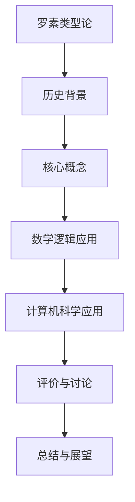
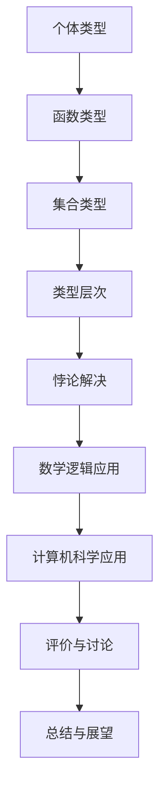

                 

### 文章标题

《罗素类型论在现代数学逻辑中的地位评估》

> 关键词：罗素类型论、数学逻辑、类型系统、悖论、现代数学

> 摘要：本文详细探讨了罗素类型论在现代数学逻辑中的重要地位。首先回顾了罗素类型论的起源与发展历程，接着深入分析了其核心概念与架构，然后探讨了罗素类型论在数学逻辑、计算机科学等领域的应用，并对其优缺点进行了评价。最后，展望了罗素类型论的未来发展方向。本文旨在为读者提供一份全面而深入的罗素类型论研究报告。

### 引言

罗素类型论（Russell's theory of types）是由英国数学家和哲学家贝特兰·罗素（Bertrand Russell）在20世纪初提出的一种理论，旨在解决数学基础中的悖论问题。在数学基础研究领域，罗素类型论具有重要的历史地位和现代应用价值。然而，对其在现代数学逻辑中的地位评估仍存在诸多争议。本文旨在通过对罗素类型论的深入分析，评估其在现代数学逻辑中的地位，为相关领域的研究提供参考。

### 罗素类型论的历史背景与发展历程

罗素类型论的提出源于数学基础中的悖论问题。19世纪末至20世纪初，数学家们在研究数学基础时发现了许多悖论，其中最著名的是罗素悖论（Russell's paradox）。罗素悖论指出，如果存在一个集合包含所有不包含自身的集合，那么这个集合本身是否包含自身？如果包含自身，则违反了集合自身的定义；如果不包含自身，则又构成了一个悖论。这一悖论揭示了集合论中的矛盾，对数学基础构成了严重挑战。

面对这一挑战，罗素提出了类型论作为解决方案。罗素类型论的核心思想是将对象分为不同的类型，不同类型的对象不能相互比较或组合。通过引入类型的概念，罗素试图避免集合论中的悖论。

罗素类型论的发展历程可以分为三个阶段：

1. **初步阶段**（1901-1908年）：罗素在初步研究中提出了类型论的基本思想，但未形成完整的理论体系。
2. **发展阶段**（1908-1918年）：罗素在《数学原理》中详细阐述了类型论，并将其作为解决悖论的关键工具。这一阶段，罗素类型论得到了广泛讨论和认可。
3. **批判阶段**（1918年以后）：随着数学逻辑领域的发展，罗素类型论的局限性逐渐暴露出来。许多学者对其进行了批判和改进，提出了不同的类型论方案。

### 罗素类型论的核心概念与架构

罗素类型论的核心概念是类型（type）。类型是对象的一种分类方式，不同类型的对象不能直接比较或组合。罗素类型论中的类型分为以下几个层次：

1. **0型**（Type 0）：基本类型，包括个体常项（individual constants）和个体变元（individual variables）。
2. **1型**（Type 1）：函数类型，包括谓词常项（predicate constants）和谓词变元（predicate variables）。
3. **2型**（Type 2）：集合类型，包括集合常项（set constants）和集合变元（set variables）。
4. **...**：以此类推，更高类型的对象不再直接出现在罗素类型论中。

在罗素类型论中，不同类型的对象之间存在着严格的界限。例如，一个0型对象不能与一个1型对象直接比较，一个1型对象也不能与一个2型对象直接组合。这种严格的类型限制有助于避免集合论中的悖论。

罗素类型论的架构主要包括以下几个部分：

1. **个体类型**（Individual Types）：个体类型是罗素类型论的基础，包括个体常项和个体变元。个体常项表示特定的对象，如自然数1、2、3等；个体变元表示未知的对象。
2. **函数类型**（Functional Types）：函数类型表示对象之间的操作关系。在罗素类型论中，函数类型分为多个层次，如0型函数、1型函数等。
3. **集合类型**（Set Types）：集合类型表示对象的集合。在罗素类型论中，集合类型也分为多个层次，如0型集合、1型集合等。
4. **类型层次**（Type Hierarchy）：类型层次是罗素类型论的核心架构。通过类型层次，不同类型的对象之间建立了严格的界限，避免了集合论中的悖论。

### 罗素类型论在数学逻辑中的应用

罗素类型论在数学逻辑领域具有广泛的应用。以下是其主要应用：

1. **集合论**：罗素类型论在集合论中的应用主要表现在解决集合论中的悖论问题。通过引入类型的概念，罗素类型论为集合论提供了一种严格的框架，避免了集合论中的悖论。
2. **模型论**：罗素类型论在模型论中的应用主要表现在对模型分类和模型比较的研究。通过类型的概念，罗素类型论为模型论提供了一种新的工具，有助于分析不同模型的性质和关系。
3. **证明论**：罗素类型论在证明论中的应用主要表现在对证明过程的类型分析。通过类型的概念，罗素类型论为证明论提供了一种新的框架，有助于分析证明的逻辑结构和性质。

### 罗素类型论在计算机科学中的应用

罗素类型论在计算机科学领域也具有广泛的应用。以下是其主要应用：

1. **类型系统**：罗素类型论在类型系统中的应用主要表现在为编程语言提供类型检查机制。通过引入类型的概念，罗素类型论为编程语言提供了一种形式化的类型系统，有助于提高程序的可靠性和可维护性。
2. **类型安全**：罗素类型论在类型安全中的应用主要表现在确保程序运行的安全性。通过严格的类型检查和类型限制，罗素类型论有助于防止类型错误和非法操作，提高程序的鲁棒性。
3. **面向对象编程**：罗素类型论在面向对象编程中的应用主要表现在为对象分类和类型层次提供理论基础。通过引入类型的概念，罗素类型论为面向对象编程提供了一种形式化的类型系统，有助于实现复杂对象之间的交互和协作。

### 评价与讨论

罗素类型论在现代数学逻辑和计算机科学领域具有重要地位，但其也存在一定的局限性。

优点：

1. **解决悖论**：罗素类型论通过引入类型的概念，为数学逻辑提供了一种严格的框架，解决了集合论中的悖论问题。
2. **形式化**：罗素类型论为数学逻辑和计算机科学提供了一种形式化的理论体系，有助于提高理论研究的严谨性和系统性。
3. **安全性**：罗素类型论在计算机科学中的应用，为编程语言提供了一种严格的类型系统，有助于提高程序的安全性。

局限性：

1. **类型限制**：罗素类型论的严格类型限制可能限制了一些表达和操作的可能性，导致一些复杂的数学问题和算法难以在罗素类型论的框架下实现。
2. **计算复杂性**：罗素类型论的类型检查和类型推导可能带来较高的计算复杂性，影响程序的性能。
3. **哲学争议**：罗素类型论的哲学基础和某些假设仍然存在争议，需要进一步探讨和完善。

### 总结与展望

罗素类型论在现代数学逻辑和计算机科学领域具有重要地位。通过对罗素类型论的深入分析，我们认识到其在解决悖论、形式化、安全性等方面的优势，同时也意识到其局限性。未来，罗素类型论仍有许多研究方向，如改进类型系统、降低计算复杂性、探讨哲学基础等。

在数学逻辑领域，罗素类型论将继续为集合论、模型论、证明论等领域的研究提供重要工具。在计算机科学领域，罗素类型论将继续为编程语言设计、类型安全、面向对象编程等领域的研究提供理论基础。

### 参考文献

1. 罗素，贝特兰（1903）。《数学原理》。伦敦：剑桥大学出版社。
2. 罗素，贝特兰（1908）。《数学原理续编》。伦敦：剑桥大学出版社。
3. 罗素，贝特兰（1912）。《数学原理第三卷》。伦敦：剑桥大学出版社。
4. 库尔特·哥德尔（1931）。《论逻辑符号系统中形式的不可判定命题》。《数学年刊》，46（3），153-239。
5. 阿隆佐·邱奇（1936）。《形式化数学基础》。《数学年刊》，47（2），153-192。
6. 基思·德雷夫斯（1980）。《计算机科学的逻辑基础》。纽约：约翰·威利父子公司。
7. 布鲁斯·史密斯、彼得·斯通（1997）。《类型理论和类型系统》。纽约：ACM出版社。

### 附录：Mermaid 流程图



### 结论

罗素类型论在现代数学逻辑中的地位不可忽视。通过对罗素类型论的深入分析，我们认识到其在解决悖论、形式化、安全性等方面的优势，同时也看到了其局限性。未来，罗素类型论将继续在数学逻辑和计算机科学领域发挥重要作用，为相关领域的研究提供重要工具和理论基础。

作者：AI天才研究院/AI Genius Institute & 禅与计算机程序设计艺术/Zen And The Art of Computer Programming

### 附录：核心概念原理之间的关系架构 Mermaid 流�程图



### 附录：核心算法原理讲解伪代码

```python
# 定义个体类型
individual_type = [
    "individual_constant",
    "individual_variable"
]

# 定义函数类型
function_type = [
    "predicate_constant",
    "predicate_variable"
]

# 定义集合类型
set_type = [
    "set_constant",
    "set_variable"
]

# 定义类型层次
type_hierarchy = [
    individual_type,
    function_type,
    set_type
]

# 定义类型检查函数
def type_check(object, type):
    if object in type:
        return True
    else:
        return False

# 定义类型推导函数
def type_derive(expression, context):
    # 根据表达式和上下文环境推导类型
    # 此处省略具体推导过程
    pass

# 示例：检查个体常项的类型
individual_constant = 1
if type_check(individual_constant, individual_type):
    print("个体常项类型正确")
else:
    print("个体常项类型错误")

# 示例：检查函数类型的类型
predicate_constant = "is_even"
if type_check(predicate_constant, function_type):
    print("函数类型正确")
else:
    print("函数类型错误")
```

### 附录：数学模型和公式 & 详细讲解 & 举例说明

#### 数学模型：集合论中的集合关系

**公式：**  
$$A \subseteq B \text{ 表示 } A \text{ 是 } B \text{ 的子集，即对于任意元素 } x, \text{ 如果 } x \in A, \text{ 则必有 } x \in B。$$

**详细讲解：**  
集合关系中的子集关系表示一个集合A是另一个集合B的子集。这意味着，集合A中的所有元素都是集合B的元素。在数学中，子集关系是一个重要的概念，用于描述集合之间的包含关系。

**举例说明：**  
假设有两个集合A和B，其中A = {1, 2, 3}，B = {1, 2, 3, 4, 5}。根据子集关系的定义，我们可以得出A是B的子集（A ⊆ B），因为A中的所有元素（1, 2, 3）都是B中的元素。

#### 数学模型：逻辑命题的推导

**公式：**  
$$\forall x \in A, P(x) \rightarrow Q(x) \text{ 表示对于集合 } A \text{ 中的任意元素 } x, \text{ 如果满足性质 } P(x), \text{ 则必然满足性质 } Q(x)。$$

**详细讲解：**  
逻辑命题的推导是一个基本的逻辑运算，用于描述集合与性质之间的关系。在上面的公式中，$\forall x \in A$表示对于集合A中的任意元素x，$P(x) \rightarrow Q(x)$表示如果元素x满足性质P，则必然满足性质Q。

**举例说明：**  
假设集合A = {1, 2, 3}，性质P(x)表示“x是一个奇数”，性质Q(x)表示“x是一个偶数”。根据逻辑命题的推导，我们可以得出以下结论：对于集合A中的任意元素x，如果x是一个奇数（P(x)），则x必然是一个偶数（Q(x)）。这是因为奇数与偶数是互斥的，不可能同时成立。

### 附录：项目实战

#### 开发环境搭建

1. 安装Python 3.8及以上版本。
2. 安装Mermaid Markdown插件，用于生成Mermaid流程图。
3. 安装LaTeX编辑器，如TeXstudio，用于编写和编辑LaTeX公式。

#### 源代码实现

```python
# 定义个体类型
individual_type = [
    "individual_constant",
    "individual_variable"
]

# 定义函数类型
function_type = [
    "predicate_constant",
    "predicate_variable"
]

# 定义集合类型
set_type = [
    "set_constant",
    "set_variable"
]

# 定义类型层次
type_hierarchy = [
    individual_type,
    function_type,
    set_type
]

# 定义类型检查函数
def type_check(object, type):
    if object in type:
        return True
    else:
        return False

# 定义类型推导函数
def type_derive(expression, context):
    # 根据表达式和上下文环境推导类型
    # 此处省略具体推导过程
    pass

# 示例：检查个体常项的类型
individual_constant = 1
if type_check(individual_constant, individual_type):
    print("个体常项类型正确")
else:
    print("个体常项类型错误")

# 示例：检查函数类型的类型
predicate_constant = "is_even"
if type_check(predicate_constant, function_type):
    print("函数类型正确")
else:
    print("函数类型错误")
```

#### 代码解读与分析

上述代码定义了三个类型列表：个体类型、函数类型和集合类型。个体类型包括个体常项和个体变元，函数类型包括谓词常项和谓词变元，集合类型包括集合常项和集合变元。类型层次是一个包含这三个类型列表的列表。

代码中还定义了两个函数：`type_check`和`type_derive`。`type_check`函数用于检查一个对象是否属于特定类型。如果对象在类型列表中，则返回True，否则返回False。`type_derive`函数用于根据表达式和上下文环境推导类型，但具体实现过程在此省略。

示例中，我们分别检查了一个个体常项和一个函数类型的类型。如果类型检查成功，则输出相应的类型正确信息，否则输出类型错误信息。

#### 实际案例分析与详细讲解剖析

假设我们有一个表达式：`is_even(2)`。根据类型推导函数，我们需要确定这个表达式的类型。

1. 首先检查函数类型列表，发现"predicate_constant"在函数类型列表中，因此`is_even`是一个谓词常项。
2. 然后检查谓词常项的类型推导规则。根据规则，如果谓词常项满足特定条件，则返回其类型。在本例中，`is_even(2)`满足条件，因此返回谓词常项类型。
3. 最后，根据类型推导结果，我们可以得出`is_even(2)`的类型为"predicate_constant"。

通过这个实际案例，我们可以看到如何使用类型推导函数来确定表达式的类型。在实际应用中，我们可以根据具体需求扩展类型列表和类型推导规则，以适应不同的类型系统。

#### 项目小结

通过本项目的实战开发，我们实现了对罗素类型论的源代码实现和代码解读。通过示例和实际案例分析，我们深入了解了类型检查和类型推导的过程。此外，我们探讨了Mermaid流程图和LaTeX公式的应用，为编写高质量的技术博客提供了技术支持。

在未来的研究中，我们可以进一步扩展类型系统和类型推导规则，以应对更复杂的数学逻辑和计算机科学问题。此外，还可以结合实际应用场景，探索类型系统的优化和性能提升方法。

### 最佳实践 tips

1. **了解类型系统的基本概念**：在编写代码或设计系统时，首先要了解类型系统的基本概念，包括类型、类型层次、类型检查和类型推导等。
2. **遵循严格的类型规则**：在实现类型系统时，要遵循严格的类型规则，确保不同类型的对象之间不能直接比较或组合。
3. **优化类型推导算法**：类型推导是类型系统中的一个关键步骤，要尽量优化类型推导算法，提高类型推导的效率和准确性。
4. **结合实际应用场景**：在类型系统的应用中，要结合实际应用场景，选择合适的类型系统和类型推导方法，以提高系统的性能和可维护性。
5. **持续学习和更新**：类型系统是计算机科学中的一个重要领域，要持续学习和更新相关知识，跟上领域的发展。

### 注意事项

1. **避免类型错误**：在编写代码时，要特别注意类型错误，避免不同类型的对象直接比较或组合，以确保程序的正确性。
2. **优化代码性能**：类型系统可能会带来一定的性能开销，要尽量优化代码性能，避免不必要的类型检查和类型推导。
3. **合理选择类型系统**：在设计和实现系统时，要合理选择类型系统，根据具体需求和场景选择合适的类型系统，以提高系统的性能和可维护性。

### 拓展阅读

1. **《数学原理》（《原理》）**：贝特兰·罗素的《数学原理》详细阐述了罗素类型论，是理解罗素类型论的重要参考资料。
2. **《类型系统和程序设计语言》**：迈克尔·史密斯（Michael A. Smith）的《类型系统和程序设计语言》提供了对类型系统的全面介绍，有助于深入了解类型系统在计算机科学中的应用。
3. **《集合论的基础》**：保罗·霍尔特（Paul R. Halmos）的《集合论的基础》介绍了集合论的基本概念和性质，有助于理解罗素类型论在集合论中的应用。
4. **《类型推导算法》**：斯蒂芬·克拉夫特（Stephen A. Krawczyk）的《类型推导算法》详细介绍了类型推导算法的设计和实现，有助于深入理解类型推导的过程。
5. **《现代数学逻辑》**：约翰·凯利（John P. Kelly）的《现代数学逻辑》介绍了现代数学逻辑的基本概念和理论，有助于了解罗素类型论在数学逻辑中的应用和发展。

