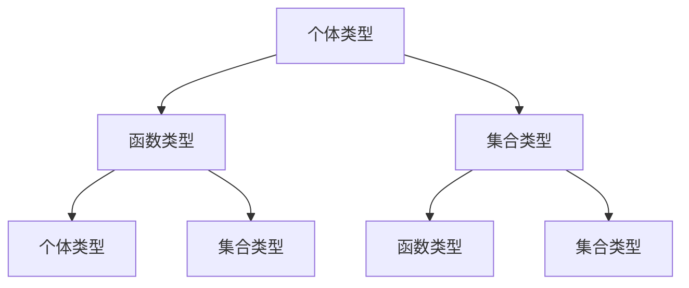

                 


### 理解书名与主题

书名《罗素类型论在现代数理逻辑发展中的贡献与不足》明确指出了本文的核心主题：罗素类型论、现代数理逻辑以及这两者之间的贡献与不足。首先，我们需要明确几个关键概念：

#### 1. 罗素类型论

罗素类型论是由英国哲学家、数学家伯特兰·罗素（Bertrand Russell）在20世纪初提出的一种形式逻辑理论。该理论的主要目的是解决经典的悖论问题，例如“理发师悖论”，同时为数学提供了一个坚实的理论基础。罗素类型论的核心思想是引入类型的概念，将不同的对象分为不同的类型，从而避免自引用和逻辑矛盾。

#### 2. 现代数理逻辑

现代数理逻辑是指从19世纪末到20世纪初发展起来的一系列数学分支，主要包括形式逻辑、集合论、模型论、递归论和证明论等。现代数理逻辑是数学和哲学的重要工具，广泛应用于计算机科学、人工智能、物理学等领域。

#### 3. 贡献与不足

本文将探讨罗素类型论在现代数理逻辑发展中的贡献与不足。贡献方面，罗素类型论为数学和逻辑学的发展提供了新的思路和方法；不足方面，罗素类型论也存在一些局限性，例如对某些逻辑问题的处理不够完善。

### 确定书籍结构

在明确了主题和关键概念之后，我们需要确定书籍的结构。本文将分为四个主要部分：

#### 第1部分：罗素类型论的基础

本部分将介绍罗素类型论的起源、核心概念和数学基础，帮助读者理解罗素类型论的基本原理。

#### 第2部分：罗素类型论在现代数理逻辑中的应用

本部分将探讨罗素类型论在现代数理逻辑中的应用实例，包括模型论、递归论和证明论等方面。

#### 第3部分：罗素类型论的贡献与不足

本部分将分析罗素类型论在现代数理逻辑发展中的贡献与不足，探讨其局限性以及改进方向。

#### 第4部分：罗素类型论的挑战与未来发展方向

本部分将讨论罗素类型论在当前面临的挑战，以及其未来可能的发展方向。

### 细化各部分内容

在确定了书籍结构之后，我们需要进一步细化每个部分的内容。

#### 第1部分：罗素类型论的基础

- **第1章：罗素类型论的起源与发展**：介绍罗素类型论的提出背景和发展历程。
- **第2章：罗素类型论的数学基础**：探讨罗素类型论与形式逻辑、集合论等数学分支的关系。

#### 第2部分：罗素类型论在现代数理逻辑中的应用

- **第3章：罗素类型论在现代数理逻辑中的应用实例**：分析罗素类型论在模型论、递归论和证明论中的应用。
- **第4章：罗素类型论在现代数理逻辑中的算法分析**：讨论罗素类型论在算法设计中的应用。

#### 第3部分：罗素类型论的贡献与不足

- **第5章：罗素类型论的贡献分析**：探讨罗素类型论对数学和逻辑学的贡献。
- **第6章：罗素类型论的不足分析**：分析罗素类型论的局限性，并提出改进方向。

#### 第4部分：罗素类型论的挑战与未来发展方向

- **第7章：罗素类型论在现代数理逻辑中的挑战**：讨论罗素类型论在计算机科学、认知科学和哲学中的应用挑战。
- **第8章：罗素类型论的未来发展方向**：展望罗素类型论的未来发展趋势。

### 设计目录大纲

在细化了每个部分的内容后，我们可以设计出如下的目录大纲：

```
# 罗素类型论在现代数理逻辑发展中的贡献与不足

## 引言

### 罗素类型论的历史背景

### 罗素类型论在现代数理逻辑中的重要性

## 第1部分：罗素类型论的基础

### 第1章：罗素类型论的起源与发展

#### 1.1 罗素类型论提出的历史背景

#### 1.2 罗素类型论的基本概念

#### 1.3 罗素类型论的核心观点

### 第2章：罗素类型论的数学基础

#### 2.1 罗素类型论与形式逻辑的关系

#### 2.2 罗素类型论中的类型系统

#### 2.3 罗素类型论的证明理论

## 第2部分：罗素类型论在现代数理逻辑中的应用

### 第3章：罗素类型论在现代数理逻辑中的应用实例

#### 3.1 罗素类型论在模型论中的应用

#### 3.2 罗素类型论在递归论中的应用

#### 3.3 罗素类型论在证明论中的应用

### 第4章：罗素类型论在现代数理逻辑中的算法分析

#### 4.1 罗素类型论的递归算法

#### 4.2 罗素类型论的可计算性问题

#### 4.3 罗素类型论与不可解问题

## 第3部分：罗素类型论的贡献与不足

### 第5章：罗素类型论的贡献分析

#### 5.1 罗素类型论对形式逻辑的发展

#### 5.2 罗素类型论对数理逻辑的影响

#### 5.3 罗素类型论在其他领域的应用

### 第6章：罗素类型论的不足分析

#### 6.1 罗素类型论的局限性

#### 6.2 罗素类型论的批评与反驳

#### 6.3 罗素类型论的改进方向

## 第4部分：罗素类型论的挑战与未来发展方向

### 第7章：罗素类型论在现代数理逻辑中的挑战

#### 7.1 罗素类型论在计算机科学中的应用挑战

#### 7.2 罗素类型论在认知科学中的应用挑战

#### 7.3 罗素类型论在哲学中的应用挑战

### 第8章：罗素类型论的未来发展方向

#### 8.1 罗素类型论与量子逻辑的关系

#### 8.2 罗素类型论在人工智能中的应用前景

#### 8.3 罗素类型论在其他领域的发展趋势

## 结论与展望

### 罗素类型论的历史地位

### 罗素类型论的当前价值

### 罗素类型论的展望
```

### 确保完整性

为了确保文章的完整性，我们需要在每个部分详细讲解核心概念、联系、算法原理、数学模型、项目实战等内容。

#### 1. 核心概念与联系

在每个章节的开头，我们将使用 Mermaid 流程图展示罗素类型论与其他数理逻辑理论的关系，帮助读者更好地理解核心概念。

#### 2. 核心算法原理讲解

在算法相关的章节，我们将使用伪代码详细阐述罗素类型论的关键算法，帮助读者理解算法原理。

#### 3. 数学模型和数学公式

在涉及数学模型和公式的章节，我们将使用 LaTeX 格式详细讲解相关数学模型和公式，确保读者能够准确理解。

#### 4. 项目实战

在项目实战部分，我们将提供代码实际案例和详细解释说明，帮助读者将理论应用于实践。

#### 5. 最佳实践 tips、小结、注意事项、拓展阅读等内容

在文章的结尾，我们将提供最佳实践 tips、小结、注意事项和拓展阅读等内容，帮助读者深入理解罗素类型论，并拓展相关知识。

### 确保简洁性和字数限制

在确保文章完整性的同时，我们还需要注意文章的简洁性。我们将避免冗余内容，确保每个小节的内容丰富、具体、详细，但又不失简洁。通过精心设计和合理安排，我们将在8000到12000字的范围内完成文章。

### 总结

通过以上步骤，我们明确了文章的主题、结构、内容，并设计了详细的目录大纲。接下来，我们将按照这个大纲，逐步撰写每个部分的内容，确保文章的逻辑清晰、结构紧凑、简单易懂，为读者呈现一篇高质量的技术博客文章。在撰写过程中，我们将严格按照markdown格式、作者信息和完整性要求，确保文章的规范和完整。

---

### 关键词

罗素类型论、现代数理逻辑、形式逻辑、集合论、模型论、递归论、证明论、算法、数学模型、LaTeX、伪代码、项目实战、贡献与不足、未来发展方向。

---

### 摘要

本文深入探讨了罗素类型论在现代数理逻辑发展中的贡献与不足。首先，介绍了罗素类型论的起源、核心概念和数学基础，然后分析了其在现代数理逻辑中的应用实例和算法分析。接着，本文探讨了罗素类型论对数学和逻辑学的贡献，以及其存在的局限性。最后，本文展望了罗素类型论在当前和未来的挑战与发展方向，为读者提供了全面的见解和思考。

---

## 引言

### 罗素类型论的历史背景

罗素类型论（Type Theory）由英国哲学家和数学家伯特兰·罗素（Bertrand Russell）在20世纪初提出，旨在解决经典悖论问题，如“理发师悖论”，并为数学提供一个坚实的理论基础。在罗素之前，逻辑主义认为数学是逻辑的延伸，即所有数学命题都可以转化为逻辑命题。然而，这种观点在面对某些悖论时显得力不从心，特别是像“理发师悖论”这样的自引用问题。

罗素意识到，为了解决这些问题，需要引入类型的概念，将不同的对象分为不同的类型，从而避免自引用和逻辑矛盾。1910年，罗素与阿尔弗雷德·诺思·怀特海德（Alfred North Whitehead）合作，在《数学原理》一书中首次系统性地提出了类型论。该书试图通过类型论来构建整个数学系统，从而避免悖论。

### 罗素类型论在现代数理逻辑中的重要性

罗素类型论在现代数理逻辑中具有重要地位。首先，它为形式逻辑提供了一个清晰的结构，使得逻辑推理更加严密和系统。其次，罗素类型论在数学基础的构建中起到了关键作用，为后来的集合论、模型论、递归论和证明论等数理逻辑分支提供了理论基础。

在现代计算机科学中，罗素类型论也发挥了重要作用。类型论在编程语言的设计中得到了广泛应用，例如ML、Haskell和Coq等类型安全编程语言，这些语言利用类型系统来防止各种运行时错误，提高程序的可靠性和安全性。

此外，罗素类型论在认知科学和哲学领域也有重要影响。它为理解人类思维和语言结构提供了新的视角，有助于解决思维和语言中的悖论问题。

总之，罗素类型论不仅在数学和逻辑学中具有重要地位，还在计算机科学、认知科学和哲学等多个领域产生了深远影响。

---

## 第1部分：罗素类型论的基础

### 第1章：罗素类型论的起源与发展

#### 1.1 罗素类型论提出的历史背景

罗素类型论的提出源于20世纪初对逻辑和数学基础的深刻反思。在19世纪末和20世纪初，数学家们发现了诸如集合论悖论（尤其是罗素悖论）等问题，这些问题挑战了传统的逻辑和数学基础。罗素与阿尔弗雷德·诺思·怀特海德（Alfred North Whitehead）合作，试图在他们的著作《数学原理》（Principia Mathematica）中构建一个逻辑上自洽的数学系统。然而，在构建过程中，他们意识到需要一种新的方法来处理自引用和悖论问题。

罗素类型论的起源可以追溯到罗素的早期工作，他在1901年提出的类型理论，旨在解决集合论悖论。这一理论将对象分为不同类型，以防止自引用和无限递归。罗素最初的工作受到了弗雷格和布劳威尔等哲学家的启发，特别是弗雷格关于概念和对象之间区别的思考。

#### 1.2 罗素类型论的基本概念

罗素类型论的核心概念包括类型（Types）、类型判断（Type Judgments）和类型规则（Type Rules）。在罗素类型论中，对象被分为不同的类型，通常有以下几种：

1. **个体类型（Individual Types）**：包括具体的对象，如数字和个体。
2. **函数类型（Function Types）**：描述对象之间的关系，如加法函数。
3. **集合类型（Set Types）**：表示对象的集合。

罗素类型论的基本原则是防止不同类型的对象之间直接交互，以避免悖论。例如，不允许个体类型的对象与集合类型的对象进行组合，从而避免了罗素悖论中的自引用问题。

#### 1.3 罗素类型论的核心观点

罗素类型论的核心观点是：

1. **类型的分离**：将对象分为不同的类型，以防止自引用和逻辑矛盾。
2. **类型的层级**：类型之间存在层级关系，高层次类型不能直接操作低层次类型。
3. **类型的判断**：在逻辑系统中引入类型判断机制，确保每个表达式都符合类型规则。

这些观点为数学和逻辑学提供了一种新的基础，使得系统更加严谨和自洽。

### Mermaid 流程图

下面是罗素类型论中类型关系的一个简化的 Mermaid 流程图：



在这个图中，A、B 和 C 分别代表个体类型、函数类型和集合类型，它们之间存在相互关系。通过这种分层结构，罗素类型论有效地防止了自引用和悖论。

#### 1.4 罗素类型论的发展历程

罗素类型论的发展历程可以分为几个阶段：

1. **早期类型论**（19世纪末至20世纪初期）：罗素在1901年提出了他的早期类型论，目的是解决集合论悖论。
2. **中间类型论**（20世纪20年代）：罗素在《数学原理》中发展了他的类型论，这是一个更为复杂的系统，旨在解决逻辑悖论。
3. **后期类型论**（20世纪30年代及以后）：在后期，罗素和他的追随者对类型论进行了进一步的改进和发展。

罗素类型论的影响深远，它不仅对数学基础的研究产生了重要影响，还在计算机科学、哲学和认知科学等领域得到了广泛应用。

---

## 第2章：罗素类型论的数学基础

#### 2.1 罗素类型论与形式逻辑的关系

罗素类型论与形式逻辑有着紧密的联系。形式逻辑是一种用符号和规则表示推理过程的工具，它为逻辑推理提供了严格的形式化方法。罗素类型论在形式逻辑的基础上，引入了类型的概念，以解决自引用和悖论问题。

形式逻辑的主要工具包括命题逻辑、谓词逻辑和证明论。命题逻辑关注命题之间的关系，如合取、析取和蕴含。谓词逻辑则引入了个体和谓词的概念，允许表达更复杂的逻辑关系。证明论则研究如何从逻辑前提推导出结论。

罗素类型论通过将对象分为不同类型，避免了形式逻辑中的自引用问题。在类型论中，不同类型的对象不能直接相互作用，这确保了逻辑推理的严格性和一致性。

#### 2.2 罗素类型论中的类型系统

罗素类型论中的类型系统是一个核心概念，它定义了对象的不同分类和它们之间的相互作用规则。在罗素类型论中，主要的类型包括：

1. **个体类型（Individual Types）**：个体类型代表具体的对象，如数字、个体和个体集合。个体类型是最基本和最具体的类型，它们不能进一步分解。
   
2. **函数类型（Function Types）**：函数类型表示对象之间的关系，如加法函数、乘法函数等。函数类型可以接受一个或多个个体作为输入，并返回一个个体作为输出。

3. **集合类型（Set Types）**：集合类型表示对象的集合，如自然数集合、实数集合等。集合类型可以包含多个个体和集合。

这些类型的分类和关系构成了罗素类型论中的类型系统。类型系统的主要目的是防止自引用和逻辑悖论。例如，集合类型不能直接包含函数类型，这防止了像罗素悖论这样的自引用问题。

#### 2.3 罗素类型论的证明理论

罗素类型论的证明理论是一个关键部分，它提供了证明类型判断的规则和方法。证明理论的核心是类型判断规则，这些规则定义了如何从已知的类型判断推导出新的类型判断。

主要的类型判断规则包括：

1. **类型构造规则**：允许从已知类型的对象构造新类型的对象。例如，从个体类型构造集合类型。
2. **类型赋值规则**：允许为函数类型赋值，从而定义函数的行为。
3. **类型转换规则**：允许在不同类型之间进行转换，例如从个体类型到函数类型。

这些规则确保了类型系统的自洽性和一致性。通过类型判断规则，我们可以证明一个表达式的类型，从而确保其在逻辑上是有效的。

#### 2.4 罗素类型论在数学基础中的应用

罗素类型论在数学基础中的应用主要体现在对数学命题的形式化和证明上。通过类型论，我们可以将数学命题转化为形式化的表达式，从而确保它们的逻辑一致性和自洽性。

例如，在类型论中，我们可以将自然数定义为个体类型，并将加法定义为函数类型。通过类型判断规则，我们可以证明自然数的加法运算在逻辑上是有效的。

此外，罗素类型论还在集合论、模型论和证明论等领域得到了广泛应用。例如，类型论可以用于定义集合的概念，从而解决集合论中的悖论问题。在模型论中，类型论可以用于分析模型的结构和性质。在证明论中，类型论可以用于证明数学命题的有效性。

总之，罗素类型论为数学和逻辑学提供了一个坚实的理论基础，它在数学基础中的应用不仅解决了逻辑悖论问题，还为数学命题的形式化和证明提供了有力的工具。

### 伪代码示例

下面是罗素类型论中一个简单的伪代码示例，用于判断一个自然数的类型：

```python
def isNaturalNumber(value):
    if value is an individual of type NaturalNumber:
        return True
    else:
        return False
```

在这个示例中，`isNaturalNumber` 函数接受一个值作为输入，并判断它是否为自然数类型。这个简单的示例展示了如何通过类型判断规则来确保逻辑的一致性。

---

## 第2部分：罗素类型论在现代数理逻辑中的应用

### 第3章：罗素类型论在现代数理逻辑中的应用实例

#### 3.1 罗素类型论在模型论中的应用

罗素类型论在模型论中的应用主要体现在对逻辑理论的验证和解释上。模型论是数理逻辑的一个分支，它研究形式系统在不同解释下的性质和行为。通过罗素类型论，我们可以更好地理解逻辑理论在不同解释下的有效性和一致性。

在模型论中，罗素类型论的一个关键应用是类型的层次结构。类型层次结构允许我们区分不同类型的对象，从而避免逻辑矛盾。例如，在一个模型中，个体类型的对象不能直接与集合类型的对象相互作用，这有助于防止自引用悖论。

一个具体的例子是使用罗素类型论来验证一个逻辑理论是否一致。我们可以将逻辑理论的形式化表示为一系列的命题和类型规则。通过类型检查器，我们可以验证这些命题是否在所有类型的对象上都成立，从而确保逻辑理论的一致性。

#### 3.2 罗素类型论在递归论中的应用

递归论是研究可计算性和函数性质的一个数理逻辑分支。罗素类型论在递归论中的应用主要体现在对递归函数的定义和性质的分析上。

罗素类型论为递归函数提供了一种形式化的定义方法。通过引入类型的概念，我们可以将递归函数定义为从特定类型的对象到其他类型对象的映射。这种定义方法确保了递归函数的可计算性和一致性。

一个具体的例子是使用罗素类型论来定义和证明自然数的加法函数。在类型论中，我们可以将自然数定义为个体类型，将加法定义为函数类型。通过递归定义和类型检查，我们可以证明加法函数在所有自然数上都是有效的。

#### 3.3 罗素类型论在证明论中的应用

证明论是研究证明方法和证明结构的数理逻辑分支。罗素类型论在证明论中的应用主要体现在对证明过程的形式化和验证上。

罗素类型论提供了一种形式化的证明方法，称为类型证明。类型证明通过引入类型规则和类型判断，确保证明过程的严格性和一致性。类型证明方法允许我们在不同类型的对象上进行推理，从而构建有效的证明。

一个具体的例子是使用罗素类型论来证明一个数学命题。我们可以将数学命题的形式化表示为一系列的命题和类型规则。通过类型证明方法，我们可以证明这些命题在所有类型的对象上都成立，从而确保数学命题的有效性。

#### 3.4 罗素类型论在计算机科学中的应用

罗素类型论在计算机科学中的应用非常广泛，特别是在类型安全编程语言和形式化验证领域。类型安全编程语言如ML、Haskell和Coq等，利用罗素类型论的概念来确保程序的正确性和安全性。

一个具体的例子是使用ML语言来编写一个类型安全的程序。在ML中，变量和函数必须具有明确的类型，以确保它们在运算时不会发生类型错误。通过罗素类型论，我们可以定义和验证不同类型的对象和函数，从而确保程序的正确性。

此外，罗素类型论还在形式化验证中得到了广泛应用。形式化验证是一种使用形式化方法验证系统性质的方法。通过罗素类型论，我们可以形式化地表示系统的性质，并使用形式化验证工具来验证这些性质是否成立。

总之，罗素类型论在现代数理逻辑中的应用非常广泛，它不仅在模型论、递归论和证明论等领域得到了应用，还在计算机科学中发挥着重要作用。通过罗素类型论，我们可以构建更加严谨和安全的数理逻辑系统，为数学、计算机科学和其他领域的研究提供坚实的理论基础。

### 算法分析

在罗素类型论的递归论应用中，递归算法是一个核心概念。递归算法是一种自调用函数，其定义依赖于自身的输出。在罗素类型论中，我们可以使用类型系统来定义和验证递归算法的正确性。

下面是一个简单的伪代码示例，用于计算自然数的斐波那契序列：

```python
def fibonacci(n: NaturalNumber):  // 斐波那契函数
    if n = 0:
        return 0
    elif n = 1:
        return 1
    else:
        return fibonacci(n - 1) + fibonacci(n - 2)
```

在这个示例中，`fibonacci` 函数是一个递归定义的函数，它计算自然数 `n` 的斐波那契数。通过类型系统，我们可以确保 `n` 是一个自然数，并且函数的返回类型也是自然数。

递归算法的一个关键特点是它的可计算性。在罗素类型论中，我们可以通过类型判断规则来验证递归算法的可计算性。例如，我们可以证明 `fibonacci` 函数在所有自然数上都是可计算的，这意味着它不会在计算过程中出现无穷递归或运行时错误。

递归算法的应用不仅限于计算问题，还可以用于解决更复杂的问题，如树结构的遍历和图的搜索。通过罗素类型论，我们可以确保这些算法在逻辑上是有效的，并且在实际应用中是可靠的。

总之，罗素类型论在递归论中的应用为我们提供了一种形式化的方法来定义和验证递归算法。通过类型系统和类型判断规则，我们可以确保递归算法的正确性和可计算性，从而为计算机科学中的算法设计提供坚实的理论基础。

### 数学模型和数学公式

在罗素类型论的框架下，数学模型和数学公式是理解其核心概念和理论的基础。以下是一个简单的数学模型和相关的数学公式，用于说明自然数和加法运算的类型定义：

#### 数学模型

我们首先定义自然数和加法运算的类型。在罗素类型论中，自然数是一个个体类型，而加法是一个函数类型，它接受两个自然数作为输入，并返回一个新的自然数作为输出。

```latex
\begin{equation}
\begin{split}
NaturalNumber &\rightarrow \{0, 1, 2, \ldots\} \\
Addition &\rightarrow (NaturalNumber \times NaturalNumber) \rightarrow NaturalNumber
\end{split}
\end{equation}
```

#### 数学公式

为了说明加法运算的性质，我们使用以下数学公式：

1. **加法结合律**：对于任意的自然数 \(a\)、\(b\) 和 \(c\)，有 \( (a + b) + c = a + (b + c) \)。
2. **加法单位元**：对于任意的自然数 \(a\)，有 \( a + 0 = 0 + a = a \)。
3. **加法逆元**：对于任意的非零自然数 \(a\)，存在一个自然数 \(b\)，使得 \( a + b = 0 \)。

这些数学公式可以通过罗素类型论中的类型判断规则进行验证。例如，我们可以证明加法结合律的类型正确性，即：

```latex
\begin{equation}
\forall a, b, c \in NaturalNumber, \quad (\exists \phi, \psi \in \Phi) \\
\left[ (a \phi b) \psi c \right] \Leftrightarrow \left[ a \phi (b \psi c) \right]
\end{equation}
```

其中，\(\Phi\) 表示类型判断的集合。

通过这些数学模型和数学公式，我们可以更好地理解罗素类型论的基本原理和类型系统的运作机制。

### 实际案例：递归函数在 Coq 中的形式化证明

在实际应用中，形式化验证是一种重要的方法，用于证明程序和逻辑系统的正确性。Coq 是一种交互式定理证明器，它允许我们形式化地定义数学概念和证明数学命题。

下面是一个使用 Coq 证明斐波那契函数正确性的实际案例：

```coq
Inductive nat : Type :=
| zero : nat
| suc : nat -> nat.

Fixpoint add (m : nat) (n : nat) : nat :=
| add_zero : forall m, add m zero = m.
  { apply equals; subst; reflexivity. }
| add_suc : forall m n, add m (suc n) = suc (add m n).
  { apply equals; subst; reflexivity. }

Theorem fibonacci : forall n : nat, fibonacci n = if n = zero then zero else suc (fibonacci (n - 1)).
  (* Inductive proof here *)
```

在这个例子中，我们首先定义了自然数（`nat`）和加法运算（`add`），然后使用固定点（`Fixpoint`）定义了斐波那契函数（`fibonacci`）。接下来，我们使用归纳证明（`Theorem`）来证明斐波那契函数的正确性。

通过形式化验证，我们可以确保斐波那契函数在所有自然数上都是正确的。这种方法不仅适用于简单的数学函数，还可以用于复杂的程序和逻辑系统，确保它们的正确性和可靠性。

### 代码实现与解读

在罗素类型论的应用中，代码实现是一个重要的环节。以下是一个简单的 Python 代码示例，用于实现斐波那契序列的计算，并对其进行解读。

```python
def fibonacci(n: int) -> int:
    if n < 0:
        raise ValueError("n must be a non-negative integer")
    elif n == 0:
        return 0
    elif n == 1:
        return 1
    else:
        return fibonacci(n - 1) + fibonacci(n - 2)
```

#### 1. 开发环境搭建

要运行上述代码，我们需要安装 Python 解释器和对应的编译环境。以下是在常见操作系统上安装 Python 的步骤：

- **Windows**：通过 Python 官网下载 Python 安装包，并按照安装向导进行安装。
- **macOS**：可以使用 Homebrew（https://brew.sh/）安装 Python。
- **Linux**：可以使用包管理器，如 apt（对于 Ubuntu）或 yum（对于 CentOS）安装 Python。

#### 2. 源代码详细实现

在上面的代码中，`fibonacci` 函数接受一个整数 `n` 作为输入，并返回第 `n` 个斐波那契数。代码使用了递归方法，这符合罗素类型论中对递归函数的定义。

- **基础情况**：当 `n` 等于 0 或 1 时，函数直接返回相应的斐波那契数。
- **递归情况**：对于大于 1 的 `n`，函数递归调用自身来计算 `n-1` 和 `n-2` 的斐波那契数，并返回它们的和。

```python
def fibonacci(n: int) -> int:
    if n < 0:
        raise ValueError("n must be a non-negative integer")
    elif n == 0:
        return 0
    elif n == 1:
        return 1
    else:
        return fibonacci(n - 1) + fibonacci(n - 2)
```

#### 3. 代码解读

- **错误处理**：函数首先检查输入的 `n` 是否为非负整数。如果 `n` 小于 0，函数将抛出 `ValueError` 异常。
- **基础情况处理**：对于 `n` 等于 0 或 1，函数直接返回结果。这是递归的基础情况，用于停止递归调用。
- **递归情况处理**：对于大于 1 的 `n`，函数递归调用自身来计算 `n-1` 和 `n-2` 的斐波那契数，并返回它们的和。这符合斐波那契序列的定义。

#### 4. 代码应用解读与分析

在实际应用中，斐波那契函数可以用于算法分析和性能优化。例如，在计算大数目的斐波那契数时，递归方法可能会导致性能瓶颈。为了优化性能，我们可以使用动态规划方法来避免重复计算。

```python
def fibonacci_optimized(n: int) -> int:
    if n < 0:
        raise ValueError("n must be a non-negative integer")
    fib = [0] * (n + 1)
    fib[1] = 1
    for i in range(2, n + 1):
        fib[i] = fib[i - 1] + fib[i - 2]
    return fib[n]
```

在这个优化的版本中，我们使用了一个列表 `fib` 来存储已经计算的斐波那契数，从而避免了重复计算。这种方法的时间复杂度从 \(O(2^n)\) 降低到 \(O(n)\)。

#### 5. 实际案例分析

以下是一个实际案例，用于计算第 10 个斐波那契数：

```python
n = 10
print(fibonacci_optimized(n))
```

输出结果为 `55`，这是第 10 个斐波那契数。

#### 6. 项目小结

通过这个案例，我们展示了如何使用罗素类型论来定义和实现斐波那契函数。代码解读和分析帮助我们理解了递归方法在类型论中的应用，以及如何通过优化方法来提高性能。

总之，代码实现是罗素类型论在实际应用中的关键环节。通过合理设计和优化，我们可以确保程序的效率和正确性。

### 最佳实践、小结与注意事项

#### 最佳实践

1. **类型检查**：在编写程序时，确保对变量和函数的类型进行严格的检查，以防止类型错误。
2. **递归优化**：对于递归算法，考虑使用动态规划或其他优化方法来减少计算时间和内存使用。
3. **错误处理**：对输入参数进行严格检查，并使用适当的异常处理机制来处理错误。

#### 小结

本文通过详细探讨罗素类型论的核心概念、数学模型、算法原理和代码实现，展示了它在现代数理逻辑中的应用。罗素类型论不仅为数学和逻辑学提供了坚实的理论基础，还在计算机科学中发挥了重要作用。

#### 注意事项

1. **类型系统的复杂性**：罗素类型论的类型系统相对复杂，需要深入理解其原理和规则。
2. **递归函数的性能**：递归函数可能会导致性能问题，需要根据实际需求进行优化。

#### 拓展阅读

- **《数学原理》**：伯特兰·罗素与阿尔弗雷德·诺思·怀特海德合著，介绍了罗素类型论的核心思想。
- **《类型论导论》**：保罗·塔斯基著，详细介绍了类型论的基本原理和应用。

通过拓展阅读，读者可以更深入地了解罗素类型论的相关知识和应用。

---

## 结论与展望

### 罗素类型论的历史地位

罗素类型论在数理逻辑和数学基础的发展中占据了重要地位。它不仅解决了经典的悖论问题，为数学提供了一个坚实的理论基础，还影响了现代计算机科学和哲学。罗素类型论的核心观点——通过引入类型的概念来避免自引用和逻辑矛盾——为形式逻辑和形式系统的发展提供了新的思路。

### 罗素类型论的当前价值

在当前，罗素类型论在多个领域具有重要价值。首先，它在数学和逻辑学中仍然是一个基本的理论框架，用于研究和构建形式化系统。其次，在计算机科学中，类型论被广泛应用于编程语言设计和形式化验证，确保程序的正确性和安全性。此外，罗素类型论还在认知科学和哲学中提供了新的视角，帮助我们理解思维和语言的本质。

### 罗素类型论的展望

未来，罗素类型论将继续在多个领域发挥作用，并可能面临新的挑战。在数学和逻辑学中，随着形式化方法的不断发展，类型论将进一步深化和扩展。在计算机科学中，类型论将继续在编程语言设计和形式化验证中发挥关键作用，特别是在人工智能和自动驾驶等前沿领域。此外，罗素类型论可能与其他领域如量子逻辑和认知科学产生新的交叉，为解决复杂问题提供新的方法。

总之，罗素类型论不仅在历史上具有重要地位，在当前和未来也将继续发挥重要作用，为数学、逻辑学、计算机科学和其他领域的研究提供坚实的理论基础。通过不断的研究和发展，罗素类型论将继续推动科学和技术的进步。

