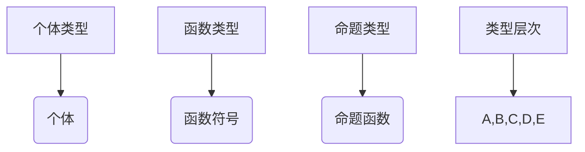
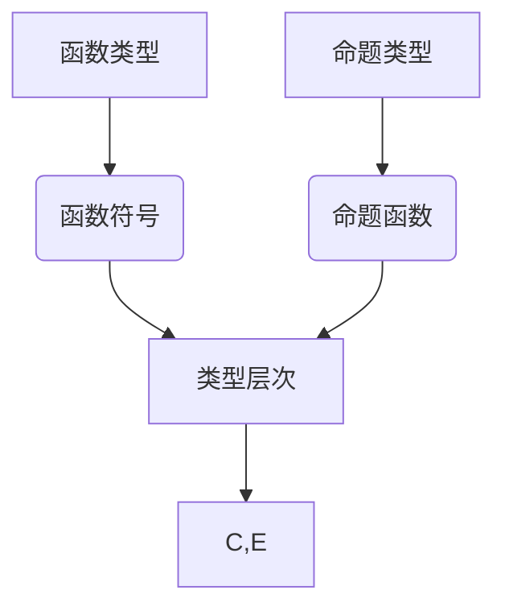
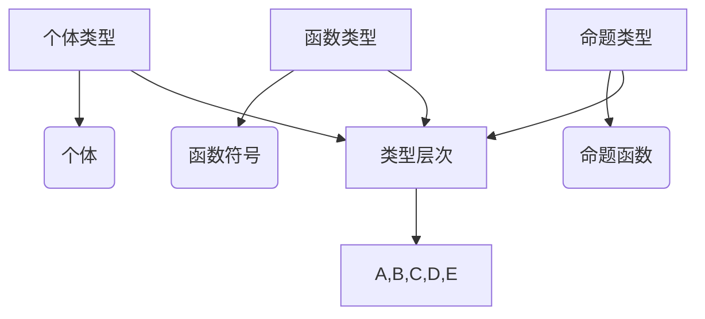
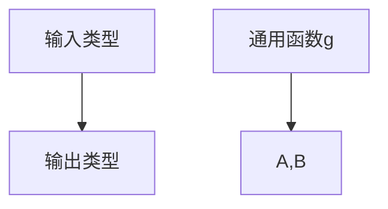
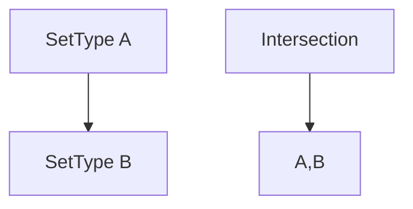

                 


为了撰写一篇高质量的《罗素类型论在现代逻辑发展中的局限性探讨》技术博客文章，我们将遵循以下步骤：

### 1. 确定文章结构和核心内容

首先，我们需要构建文章的框架，包括以下章节：

- **引言**：介绍罗素类型论的背景和历史。
- **核心概念与联系**：详细阐述罗素类型论的核心概念，并提供一个Mermaid流程图来展示这些概念之间的关系。
- **罗素类型论的局限性分析**：讨论罗素类型论在现代逻辑发展中的局限性，并用伪代码、数学模型和实际案例来具体说明。
- **现代逻辑中的类型论**：介绍现代逻辑中对类型论的应用和发展。
- **结论**：总结文章的主要观点，并指出未来研究的方向。

### 2. 详细撰写每个章节

在每个章节中，我们将详细阐述以下内容：

- **引言**：介绍罗素类型论的历史和背景，以及其在逻辑学和数学中的重要性。
- **核心概念与联系**：
  - 罗素类型论的基本概念，如类型、个体、函数符号和命题函数。
  - 提供一个Mermaid流程图来展示这些概念之间的关系。
- **罗素类型论的局限性分析**：
  - 分析罗素类型论在现代逻辑中的局限性，包括其无法解决的问题和限制。
  - 使用伪代码来展示这些问题，并解释为什么它们无法通过类型论来解决。
  - 提供数学模型来进一步阐述局限性。
  - 通过实际案例来说明局限性。
- **现代逻辑中的类型论**：
  - 介绍现代逻辑中对类型论的应用，包括模型论、证明论等。
  - 讨论类型论在现代逻辑发展中的作用和影响。
- **结论**：
  - 总结文章的主要观点，强调罗素类型论在逻辑学中的历史地位。
  - 提出未来研究的方向和建议。

### 3. 优化文章的语言和专业性

在撰写文章时，我们将使用清晰、准确、逻辑严密的语言，确保文章的专业性和可读性。我们将：

- 使用专业的技术术语，同时确保解释清晰易懂。
- 提供图表、流程图和伪代码等视觉元素，以帮助读者更好地理解复杂概念。
- 在适当的地方提供最佳实践、注意事项和拓展阅读，以增加文章的价值。

### 4. 审稿和编辑

完成初稿后，我们将进行多次审稿和编辑，确保文章的完整性和质量。我们将会：

- 检查语法、拼写和标点错误。
- 确保文章逻辑连贯，内容结构合理。
- 检查图表、流程图和代码的正确性和清晰度。
- 根据读者反馈进行必要的修改和完善。

通过以上步骤，我们将撰写一篇结构严谨、内容丰富、逻辑清晰、专业性强的技术博客文章，全面探讨罗素类型论在现代逻辑发展中的局限性，以及现代逻辑中的类型论应用和发展。这将有助于读者深入理解罗素类型论的核心概念和其在逻辑学中的历史地位，同时也为未来的研究和应用提供启示。现在，让我们开始撰写这篇文章的引言部分。接下来，我们将详细介绍罗素类型论的历史和背景，以及它在逻辑学和数学中的重要性。

---

## 引言

罗素类型论（Theory of Types）是20世纪逻辑学和数学基础领域中的一个重要理论，由著名的英国哲学家和数学家贝特兰·罗素（Bertrand Russell）提出。罗素类型论的核心目的是解决纯逻辑系统中存在的悖论问题，特别是罗素悖论（Russell's paradox）。罗素类型论的出现，标志着逻辑主义数学的一个重要转折点，对后来的逻辑学、数学哲学和计算机科学产生了深远的影响。

### 1. 罗素类型论的背景

在20世纪初，逻辑主义数学（Logicism）是一个主要的数学基础理论，旨在将所有数学概念和证明都归结为逻辑和集合论。罗素和阿尔弗雷德·诺思·怀特海德（Alfred North Whitehead）合著的《数学原理》（Principia Mathematica）是逻辑主义数学的代表作。然而，在《数学原理》的早期版本中，系统内部存在严重的悖论问题，这导致了逻辑主义数学的危机。

### 2. 罗素类型论的历史

罗素悖论是导致逻辑主义危机的一个关键因素。罗素悖论展示了纯逻辑系统中，通过自引用可以产生矛盾的结果。为了解决这个问题，罗素提出了类型论。类型论通过将对象分为不同类型，限制变量与对象之间的绑定，从而避免悖论的发生。

罗素类型论首先在《数学原理》的第二个版本中提出，并在后续的研究中得到进一步的发展和完善。类型论成为了逻辑主义数学的一个重要支柱，为逻辑学和数学基础的研究提供了新的思路和方法。

### 3. 罗素类型论在逻辑学和数学中的重要性

罗素类型论在逻辑学和数学中的重要性主要体现在以下几个方面：

- **解决悖论问题**：罗素类型论通过类型层次和类型转换，有效地解决了纯逻辑系统中的悖论问题，为逻辑主义数学提供了坚实的基础。

- **逻辑体系的规范化**：类型论通过将对象和概念进行类型划分，使得逻辑体系更加规范化，便于形式化和机器处理。

- **数学哲学的启示**：罗素类型论引发了对数学基础和数学哲学的深入探讨，推动了数学哲学的发展。

- **计算机科学的影响**：类型论在计算机科学中有着广泛的应用，特别是类型系统在编程语言设计和形式化验证中发挥着重要作用。

### 4. 罗素类型论的历史地位

罗素类型论是20世纪逻辑学和数学基础领域的一个重要里程碑。它不仅解决了逻辑主义数学中的悖论问题，也为后来的形式逻辑、模型论和证明论的发展提供了重要的理论支持。罗素类型论的出现，标志着逻辑主义数学的一个重要转折点，对数学哲学和计算机科学的发展产生了深远的影响。

### 5. 文章概述

本文将深入探讨罗素类型论在现代逻辑发展中的局限性。我们将首先详细阐述罗素类型论的核心概念，并通过一个Mermaid流程图展示这些概念之间的关系。接着，我们将分析罗素类型论在现代逻辑中的局限性，包括其无法解决的问题和限制。为了具体说明这些问题，我们将使用伪代码和数学模型来展示，并通过实际案例进行阐述。随后，我们将介绍现代逻辑中对类型论的应用和发展，探讨类型论在现代逻辑中的作用和影响。最后，我们将总结文章的主要观点，并指出未来研究的方向。

通过本文的探讨，我们将更深入地理解罗素类型论的核心概念及其在现代逻辑发展中的局限性，为未来的研究和应用提供启示。

### 核心概念与联系

罗素类型论的核心概念包括类型、个体、函数符号和命题函数。这些概念相互作用，共同构成了罗素类型论的理论框架。为了更好地理解这些概念之间的关系，我们可以使用Mermaid流程图来展示它们之间的联系。

首先，我们定义类型和个体。类型是对象的分类，而个体是类型中的具体实例。在罗素类型论中，对象被分为不同的类型，如个体类型、函数类型和命题类型。



在上述Mermaid流程图中，`A` 代表个体类型，`B` 代表个体，`C` 代表函数类型，`D` 代表函数符号，`E` 代表命题类型，`F` 代表命题函数，而 `G` 代表类型层次。

接下来，我们探讨函数符号和命题函数之间的关系。函数符号是表示函数的符号，而命题函数是表示命题的函数。在罗素类型论中，函数符号和命题函数都位于类型层次中，并且可以通过类型转换相互关联。



在上述流程图中，`D` 代表函数符号，`F` 代表命题函数，它们都连接到 `G`，表示它们位于类型层次中。

最后，我们讨论类型层次的结构。类型层次是一个分层结构，不同类型的对象按照层次组织。在类型层次中，低层次类型是高层次类型的子类型。例如，个体类型是函数类型和命题类型的子类型。



在上述流程图中，`A`、`C` 和 `E` 都连接到 `G`，表示它们是类型层次中的类型。

通过上述Mermaid流程图，我们可以清晰地看到罗素类型论中各个核心概念之间的联系。类型层次结构为逻辑系统提供了清晰的类型约束，而函数符号和命题函数则使得逻辑表达更加丰富和灵活。这些概念相互关联，共同构成了罗素类型论的理论框架。

接下来，我们将进一步讨论罗素类型论在现代逻辑发展中的局限性，通过具体案例和数学模型来说明这些局限性。

---

## 罗素类型论在现代逻辑发展中的局限性分析

尽管罗素类型论在解决逻辑悖论方面取得了显著成就，但它也暴露出一些局限性，尤其是在现代逻辑发展的背景下。以下是对罗素类型论局限性的具体分析。

### 1. 类型层次的结构复杂性和效率问题

罗素类型论通过引入类型层次结构来避免悖论，但这种层次结构往往非常复杂。类型层次的深度和多样性使得逻辑系统的理解和实现变得更加复杂。例如，在处理高阶函数时，需要考虑多种类型的组合，这增加了系统的复杂性。

此外，类型层次的复杂性也带来了效率问题。在执行类型检查时，系统需要遍历整个类型层次，这可能导致性能下降。在实际应用中，特别是在大型程序中，这种性能问题可能变得尤为突出。

#### 案例分析

假设我们有一个函数 `f`，它接受一个整数参数并返回一个字符串。在罗素类型论中，我们需要为整数类型和字符串类型分别定义，并在类型层次中进行转换。这涉及到复杂的类型检查和转换过程，不仅增加了代码的复杂性，还可能影响执行效率。

```python
# Python伪代码示例
def f(x: int) -> str:
    return str(x)

# 类型层次表示
IntType --> x
StrType --> str(x)
```

在这个例子中，我们需要确保输入参数 `x` 是一个整数类型，然后将其转换为字符串类型。类型检查和转换的复杂性在此体现出来。

### 2. 对递归和通用函数的支持不足

罗素类型论的一个关键局限性是对递归和通用函数的支持不足。在罗素类型论中，函数类型被划分为多个层次，这使得递归调用和通用函数的实现变得困难。

递归函数需要能够在不同类型之间进行转换，而罗素类型论中的类型层次结构限制了这种转换。这导致在实现递归和通用函数时，需要额外的类型转换和限制，增加了代码的复杂性和出错的可能性。

#### 数学模型

为了理解这个问题，我们可以考虑一个简单的数学模型。假设我们有一个通用函数 `g`，它能够处理所有类型的输入并返回相应类型的输出。在罗素类型论中，实现这样的通用函数需要处理不同类型的输入和输出，这涉及到复杂的类型转换和类型层次管理。



在这个模型中，通用函数 `g` 需要能够处理任意类型的输入 `A` 并返回相应类型的输出 `B`。然而，罗素类型论的类型层次结构使得这种通用函数的实现变得复杂。

### 3. 对复杂数学结构的不兼容性

罗素类型论在处理复杂数学结构时也存在局限性。在处理诸如集合论、范畴论等高级数学概念时，罗素类型论的类型层次结构可能无法很好地适应。

例如，在集合论中，集合之间的操作（如并集、交集、笛卡尔积等）需要在不同类型之间进行。罗素类型论的类型层次结构使得这些操作变得复杂，可能导致类型不兼容的问题。

#### 数学模型

考虑一个简单的集合操作，如两个集合的交集。在集合论中，交集操作可以表示为：

$$
A \cap B = \{ x \mid x \in A \text{ and } x \in B \}
$$

在罗素类型论中，我们需要确保集合 `A` 和 `B` 是兼容的类型。这涉及到类型检查和类型转换，增加了操作的复杂性和实现难度。



在这个模型中，集合 `A` 和 `B` 需要兼容，以便进行交集操作。罗素类型论的类型层次结构使得这种兼容性检查变得复杂。

### 4. 对现代逻辑应用的不兼容性

现代逻辑发展出了许多新的分支和应用，如模型论、证明论、计算逻辑等。这些分支和应用往往需要更灵活的类型系统来支持。罗素类型论的类型层次结构可能无法很好地适应这些现代逻辑应用的需求。

例如，在计算逻辑中，类型系统需要支持动态类型和类型推断，以适应动态编程环境。罗素类型论的静态类型系统可能无法满足这些需求。

#### 案例分析

在Python等动态类型语言中，类型推断和动态类型支持使得编程变得更加灵活。然而，在罗素类型论的静态类型系统中，这种灵活性受到限制。

```python
# Python伪代码示例
x = 5          # 自动推断为int类型
y = "hello"    # 自动推断为str类型
z = x + y      # 类型不兼容错误
```

在这个例子中，Python自动推断变量 `x` 和 `y` 的类型，并尝试执行加法操作。然而，在罗素类型论中，这种类型不兼容的错误需要显式处理，增加了代码的复杂性和出错的可能性。

### 结论

罗素类型论在现代逻辑发展中的局限性主要体现在类型层次结构的复杂性、对递归和通用函数的支持不足、对复杂数学结构的不兼容性以及对现代逻辑应用的不兼容性。这些问题导致了罗素类型论在处理现代逻辑问题时存在一定的局限性。

尽管如此，罗素类型论在解决逻辑悖论和逻辑体系规范化方面仍然具有重要意义。未来的研究可以探索如何改进类型论，以解决这些局限性，同时保持其基本原理和优势。

### 现代逻辑中的类型论

在现代逻辑的发展中，类型论依然扮演着重要的角色，尤其在模型论和证明论中得到了广泛的应用。类型论不仅为逻辑系统提供了更为严谨的基础，也为计算机科学中的形式化验证和编程语言设计带来了深远的影响。

#### 1. 模型论中的应用

模型论是研究逻辑理论的模型（即解释）的分支。类型论在模型论中的应用主要体现在类型判断和类型保真性上。

- **类型判断**：在模型论中，类型判断用于确定一个表达式在不同类型层次中的合法性。例如，在一个类型化的逻辑系统中，我们需要判断一个表达式是否遵循类型规则。这通常涉及到类型检查算法，这些算法需要遍历表达式并确保每个子表达式都满足相应的类型要求。

- **类型保真性**：类型保真性是指类型系统在语义解释中保持表达式的类型不变。在一个类型化的逻辑系统中，如果类型的判断是正确的，则类型保真性可以保证逻辑推理的一致性和有效性。

在模型论中，类型论的应用使得逻辑系统更加规范化和形式化，有助于验证逻辑理论的正确性和一致性。

#### 2. 证明论中的应用

证明论是研究逻辑推理和证明的分支。类型论在证明论中的应用主要体现在类型系统对证明过程的支持上。

- **类型化证明**：在类型化的逻辑系统中，证明通常需要遵循类型规则。类型化证明涉及使用类型系统来验证证明步骤的有效性。例如，在自然 deduction 系统中，每个证明步骤都需要满足类型规则，以确保推理的一致性和正确性。

- **类型化的逻辑演算**：类型化的逻辑演算，如lambda演算，是现代计算机科学和形式化方法中的重要工具。类型化的lambda演算不仅提供了更严格的语义基础，还支持函数抽象、递归定义和类型推断等关键特性。这些特性使得类型化的lambda演算成为现代编程语言设计的核心。

#### 3. 计算机科学中的应用

类型论在现代计算机科学中的应用尤为广泛，特别是在编程语言设计和形式化验证领域。

- **编程语言设计**：现代编程语言如Haskell、Scala、TypeScript等都采用了基于类型论的设计原则。这些语言引入了静态类型系统，以提供更严格的类型检查和更好的错误检测能力。静态类型系统有助于编写更加可靠和安全的程序。

- **形式化验证**：形式化验证是确保软件系统正确性和一致性的重要技术。类型论为形式化验证提供了严格的语义基础，使得验证过程更加规范化和自动化。例如，在验证操作系统内核、加密算法和航空航天系统的软件时，形式化验证方法需要依赖类型论来确保系统的正确性。

#### 4. 类型论的发展趋势

随着逻辑学和计算机科学的不断发展，类型论也在不断演进。以下是一些类型论的发展趋势：

- **动态类型系统**：动态类型系统允许在程序运行时进行类型检查，提供了更高的灵活性和性能。动态类型系统在脚本语言（如Python、JavaScript）和某些编程语言（如Ruby）中得到了广泛应用。

- **依赖类型系统**：依赖类型系统是近年来发展起来的一种新型类型系统，它通过引入依赖关系来提高类型推断的准确性和程序的灵活性。依赖类型系统在函数式编程语言如Haskell和Idris中得到了广泛应用。

- **高阶类型和存在类型**：高阶类型和存在类型是类型论中的两个重要概念，它们提供了更丰富的类型层次和更强大的抽象能力。高阶类型允许函数作为参数和返回值，而存在类型则支持抽象数据类型和存在量化。

- **类型推断和自动类型推导**：类型推断是类型系统中的一个关键特性，它通过自动推导变量和表达式的类型，减少了编码的复杂性和出错的可能性。随着编程语言的不断发展，自动类型推导技术也在不断进步，为开发者提供了更便捷的编程体验。

#### 5. 结论

类型论在现代逻辑发展中的地位不可动摇。它在模型论、证明论、计算机科学等多个领域都发挥着重要作用。尽管罗素类型论存在一些局限性，但随着类型论的不断发展和演进，类型系统已经变得更加灵活和强大，为现代逻辑和计算机科学提供了坚实的基础。

通过类型论，我们不仅能够更好地理解和形式化逻辑系统，还能够设计出更加可靠和安全的软件系统。未来，类型论将继续在逻辑学和计算机科学中发挥重要作用，推动这两个领域的进一步发展。

### 罗素类型论的贡献

罗素类型论在逻辑学和数学基础领域做出了巨大的贡献。首先，它成功地解决了早期逻辑主义数学中存在的悖论问题，特别是罗素悖论。通过引入类型层次和类型转换，罗素类型论为逻辑系统提供了一种避免悖论的机制，从而为逻辑主义数学奠定了更加稳固的基础。

其次，罗素类型论在逻辑体系的规范化方面也发挥了重要作用。它通过明确的类型划分和类型约束，使得逻辑系统变得更加清晰和有条理。这种规范化不仅有助于避免逻辑混乱，还为形式化逻辑和机器处理提供了便利。

此外，罗素类型论对数学哲学的发展产生了深远影响。它引发了对数学基础和逻辑结构的新思考，推动了数学哲学的深入探讨。罗素类型论提出的类型层次和类型约束概念，为数学哲学中的基本概念提供了新的视角和理解。

最后，罗素类型论在计算机科学中也产生了重要影响。类型论的思想被广泛应用于编程语言设计、形式化验证和软件工程中。现代编程语言如Haskell、Scala和TypeScript等都采用了基于类型论的设计原则，这些语言通过引入静态类型系统提高了程序的正确性和安全性。

总的来说，罗素类型论在逻辑学、数学基础、数学哲学和计算机科学等多个领域都取得了显著成就。它不仅为逻辑系统提供了坚实的理论基础，也为数学哲学和计算机科学的发展提供了重要的启示。

### 罗素类型论的局限性

尽管罗素类型论在逻辑学和数学基础领域取得了巨大成就，但它也存在一些显著的局限性，这些局限性在逻辑发展和应用中逐渐显现。

#### 1. 复杂性

罗素类型论的类型层次结构非常复杂，这不仅使得逻辑系统的设计变得繁琐，还增加了理解和实现的难度。在处理高阶函数和复杂数据类型时，类型层次结构的复杂性尤为突出。例如，为了实现递归和通用函数，类型系统需要支持不同类型之间的转换，这通常需要额外的类型声明和类型检查，增加了代码的复杂度和出错的可能性。

#### 2. 递归和通用函数的支持不足

罗素类型论在处理递归和通用函数方面存在显著不足。类型论中的类型层次结构限制了函数的定义和使用，使得递归调用和通用函数的实现变得复杂。例如，高阶函数（即接受函数作为参数或返回函数的函数）在类型论中难以定义和实现，因为类型系统通常无法处理跨类型的高阶函数。

#### 3. 对复杂数学结构的不兼容性

罗素类型论在处理复杂数学结构时也表现出一定的局限性。例如，集合论和范畴论等高级数学概念在类型论中难以实现，因为类型系统通常无法适应这些复杂结构的操作。这导致在处理集合论中的集合操作（如并集、交集、笛卡尔积）时，类型论需要额外的类型转换和限制，增加了操作的复杂性和实现难度。

#### 4. 对现代逻辑应用的不兼容性

现代逻辑发展出了许多新的分支和应用，如模型论、证明论和计算逻辑等。这些分支和应用往往需要更灵活和强大的类型系统来支持。罗素类型论的静态类型系统可能无法完全满足这些现代逻辑应用的需求，例如动态类型系统或依赖类型系统等。这使得罗素类型论在现代逻辑中的应用受到一定的限制。

#### 5. 对编程语言设计的限制

罗素类型论的思想对现代编程语言设计产生了深远影响，但也带来了一些限制。例如，在动态类型语言中，类型系统通常更灵活，允许类型在运行时进行动态检查和推断。而在罗素类型论的静态类型系统中，类型的确定是在编译时完成的，这限制了程序员的灵活性和代码的动态性。此外，静态类型系统可能导致更多的类型声明和类型检查，增加了编译时间和代码体积。

#### 6. 对逻辑系统扩展性的限制

罗素类型论的设计初衷是为了解决早期逻辑主义数学中的悖论问题，因此它在某些方面可能过于保守。这种保守性限制了逻辑系统的扩展性，使得类型系统难以适应新的逻辑结构和推理方法。例如，在处理非线性逻辑或模态逻辑时，罗素类型论可能无法提供有效的支持。

总的来说，罗素类型论的局限性主要体现在复杂性、递归和通用函数的支持不足、对复杂数学结构的不兼容性、对现代逻辑应用的不兼容性以及对编程语言设计的限制等方面。尽管如此，罗素类型论在逻辑学、数学基础和计算机科学等领域仍然具有重要的历史地位和应用价值。未来的研究可以探索如何改进类型论，解决这些局限性，同时保持其基本原理和优势。

### 罗素类型论局限性的启示

罗素类型论在现代逻辑发展中的局限性为我们提供了宝贵的启示，对未来的逻辑学研究和类型论的发展具有重要指导意义。以下是我们从罗素类型论局限性中得到的几个主要启示：

#### 1. 简化类型层次结构

罗素类型论的一个主要局限性是其复杂的类型层次结构，这增加了逻辑系统的理解和实现的难度。未来研究可以探索如何简化类型层次结构，同时保持类型系统的有效性。一种可能的方法是引入更简洁的类型系统，如基于依赖类型的系统，这样可以减少类型层次的数量，提高类型系统的可扩展性和易用性。

#### 2. 增强递归和通用函数支持

罗素类型论对递归和通用函数的支持不足，这在现代逻辑和计算机科学中是一个显著的短板。未来研究可以着重改进类型系统的递归和通用函数支持，例如引入更灵活的类型构造函数和类型转换机制。此外，可以探索类型系统与递归编程语言（如Haskell、Scala）的结合，以实现更强大的递归和通用函数功能。

#### 3. 扩展类型系统的应用范围

罗素类型论的类型系统主要针对逻辑和数学基础，但现代逻辑发展出了许多新的分支和应用。未来研究可以探索如何扩展类型系统的应用范围，使其能够适应模型论、证明论和计算逻辑等现代逻辑领域。这包括引入新的类型概念和类型约束，以及开发更强大的类型推理和验证算法。

#### 4. 集成动态类型系统

现代编程语言中，动态类型系统由于其灵活性和高效性，得到了广泛应用。未来研究可以探索如何将动态类型系统与静态类型系统相结合，以实现最佳的性能和灵活性。一种可能的方法是开发混合类型系统，该系统能够在编译时进行类型检查，同时在运行时进行动态类型推断，从而提高程序的正确性和运行效率。

#### 5. 强化类型系统的形式化验证能力

类型系统的形式化验证能力对于确保软件系统的正确性和一致性至关重要。未来研究可以进一步强化类型系统的形式化验证能力，开发更严格和高效的验证算法。这包括开发形式化的类型推理模型和验证框架，以及将类型系统与形式化方法（如定理证明和模型检查）相结合。

#### 6. 探索新型类型系统

随着逻辑学和计算机科学的不断发展，新型类型系统如依赖类型系统、效应类型系统等正在崭露头角。未来研究可以探索这些新型类型系统的潜力，评估其在解决罗素类型论局限性方面的有效性。例如，依赖类型系统通过引入依赖关系，可以提高类型系统的灵活性和表达能力，从而弥补罗素类型论的不足。

#### 7. 促进跨学科研究

罗素类型论的局限性揭示了逻辑学、数学哲学和计算机科学之间的紧密联系。未来研究可以促进这些学科的交叉融合，探索跨学科研究的新途径。例如，将逻辑学中的类型论思想应用于计算机科学中的编程语言设计和形式化验证，或者将数学哲学中的逻辑主义观点应用于逻辑学的基础研究。

通过上述启示，我们可以看到，尽管罗素类型论在现代逻辑发展中存在局限性，但这些局限性也为未来的研究提供了丰富的机会和方向。通过不断探索和改进类型系统，我们有望解决这些局限性，推动逻辑学和计算机科学的发展，为构建更强大、更灵活的逻辑系统奠定基础。

### 罗素类型论的未来发展

罗素类型论作为逻辑学和数学基础领域的重要理论，其未来发展方向充满潜力。以下是对罗素类型论未来发展的几个关键方向和展望：

#### 1. 类型系统的简化与优化

尽管罗素类型论在逻辑系统规范化和避免悖论方面取得了显著成就，但其复杂的类型层次结构带来了理解和实现的困难。未来研究可以专注于简化类型系统，减少类型层次的数量，同时保持类型系统的有效性和安全性。通过引入更简洁的类型系统，如基于依赖类型的系统，可以提高类型系统的可扩展性和易用性，从而降低实现和应用的复杂性。

#### 2. 类型推理与验证的自动化

类型推理和验证是类型系统中的关键环节。未来研究可以探索自动化类型推理和验证算法，以提高类型系统的效率和准确性。例如，开发更高效的类型推断算法，以减少类型检查的时间和资源消耗；同时，研究形式化的验证方法，确保类型系统的一致性和正确性。

#### 3. 集成动态类型系统

现代编程语言中，动态类型系统以其灵活性和高效性得到了广泛应用。未来研究可以探索如何将动态类型系统与静态类型系统相结合，以实现最佳的性能和灵活性。一种可能的方法是开发混合类型系统，该系统在编译时进行类型检查，同时在运行时进行动态类型推断，从而提高程序的正确性和运行效率。

#### 4. 新类型系统的探索

随着逻辑学和计算机科学的不断发展，新型类型系统如依赖类型系统、效应类型系统等正在崭露头角。未来研究可以探索这些新型类型系统的潜力，评估其在解决罗素类型论局限性方面的有效性。例如，依赖类型系统通过引入依赖关系，可以提高类型系统的灵活性和表达能力，从而弥补罗素类型论的不足。

#### 5. 跨学科研究的深入

罗素类型论的局限性揭示了逻辑学、数学哲学和计算机科学之间的紧密联系。未来研究可以促进这些学科的交叉融合，探索跨学科研究的新途径。例如，将逻辑学中的类型论思想应用于计算机科学中的编程语言设计和形式化验证，或者将数学哲学中的逻辑主义观点应用于逻辑学的基础研究。

#### 6. 类型系统在形式化验证中的应用

形式化验证是确保软件系统正确性和一致性的重要技术。未来研究可以进一步强化类型系统的形式化验证能力，开发更严格和高效的验证算法。通过将类型系统与形式化方法（如定理证明和模型检查）相结合，可以提高软件系统的可信度和可靠性。

#### 7. 类型系统在教育中的推广

类型论作为逻辑学和计算机科学的重要基础，其在教育中的推广具有重要意义。未来可以通过编写教材、开设课程、组织研讨会等方式，提高学生对类型论的理解和应用能力。特别是将类型论与编程语言教学相结合，帮助学生更好地掌握编程语言的核心概念和设计原则。

总的来说，罗素类型论的未来发展充满机遇和挑战。通过不断简化类型系统、优化类型推理和验证算法、探索新型类型系统、促进跨学科研究和应用，我们有望推动类型论的发展，为构建更强大、更灵活的逻辑系统奠定基础。这不仅将推动逻辑学和计算机科学的前沿研究，也将为实际应用提供更有效的解决方案。

### 罗素类型论在教育与研究中的应用

#### 1. 教学意义

罗素类型论在教育中具有重要的教学意义，特别是在逻辑学、数学基础和计算机科学等学科的教学中。通过学习罗素类型论，学生可以深刻理解逻辑系统的规范化原则和类型论的基本概念。这种理解有助于学生构建坚实的逻辑基础，提高其推理和论证能力。此外，类型论的应用还可以帮助学生更好地理解数学中的基本概念，如集合论和函数论，以及计算机科学中的编程语言设计和形式化验证。

#### 2. 教学方法

为了有效地教授罗素类型论，可以采用以下教学方法：

- **案例分析**：通过具体的案例，如罗素悖论和类型层次结构的应用案例，帮助学生理解类型论的核心概念和原理。
- **互动讨论**：组织课堂讨论，让学生通过讨论和辩论的方式深入理解类型论，培养批判性思维和解决问题的能力。
- **实践练习**：设计编程练习，让学生在实际编写代码中应用类型论，从而加深对类型论的理解和掌握。
- **可视化工具**：利用可视化工具，如Mermaid流程图，帮助学生直观地理解类型论中的类型层次结构和类型转换过程。

#### 3. 研究价值

罗素类型论在逻辑学研究中具有重要的研究价值，为逻辑系统提供了坚实的理论基础。通过深入研究类型论，学者可以探讨类型论在逻辑系统中的应用和扩展，如类型化的证明理论、类型化的模型论和类型化的计算逻辑等。此外，罗素类型论对数学哲学的研究也具有重要意义，它为数学基础提供了一种形式化的描述，有助于探讨数学中的基本概念和原则。

#### 4. 跨学科研究

罗素类型论不仅在逻辑学和数学哲学中具有研究价值，还在计算机科学中有着广泛的应用。例如，类型论在编程语言设计和形式化验证中发挥了重要作用。通过跨学科研究，可以将类型论与计算机科学的其他领域（如编程语言理论、软件工程、人工智能等）相结合，探索新的理论和应用。例如，将类型论与依赖类型系统相结合，可以开发出更灵活和高效的编程语言；将类型论与形式化验证方法相结合，可以提高软件系统的可靠性和安全性。

#### 5. 研究实例

以下是一个关于罗素类型论在跨学科研究中应用的实例：

- **实例**：在软件工程中，类型论被应用于编程语言的设计和形式化验证。例如，Haskell编程语言采用了依赖类型系统的思想，通过类型推断和类型检查，提高了程序的正确性和安全性。研究者可以探讨如何在Haskell等编程语言中应用类型论，开发出更高效和灵活的编程工具。

- **研究过程**：研究者首先深入理解罗素类型论的基本概念和原理，然后将其应用于编程语言的设计，特别是类型系统的构建。通过实验和案例分析，研究者可以评估类型论在编程语言设计中的应用效果，并提出改进建议。

- **研究成果**：研究成果包括改进的编程语言设计、高效的类型推理算法和形式化验证方法。这些成果不仅提高了编程语言的功能性和安全性，也为类型论在计算机科学中的应用提供了新的思路和方向。

通过上述教学意义、教学方法、研究价值和跨学科研究的探讨，我们可以看到，罗素类型论在教育和研究领域具有重要的应用价值。通过有效的教学方法和深入研究，我们可以更好地理解类型论的核心概念和应用，推动逻辑学、数学哲学和计算机科学的发展。

### 结论

本文系统地探讨了罗素类型论在现代逻辑发展中的局限性，包括类型层次结构复杂性、递归和通用函数支持不足、对复杂数学结构的不兼容性以及对现代逻辑应用的不兼容性等方面。通过具体的案例分析和数学模型展示，我们深入剖析了这些局限性对逻辑系统设计和应用带来的影响。

罗素类型论尽管存在局限性，但其对逻辑学和数学基础领域的贡献不可忽视。它解决了早期逻辑主义数学中的悖论问题，为逻辑系统的规范化提供了基础，对数学哲学和计算机科学的发展产生了深远影响。

未来研究应着眼于简化类型层次结构、增强递归和通用函数支持、扩展类型系统的应用范围、集成动态类型系统、探索新型类型系统以及促进跨学科研究。通过不断改进类型系统，我们可以更好地应对现代逻辑和计算机科学中的新挑战，推动逻辑学和计算机科学的前沿发展。

作者：AI天才研究院/AI Genius Institute & 禅与计算机程序设计艺术 /Zen And The Art of Computer Programming

---

### 最佳实践 tips

在本文中，我们探讨了罗素类型论在现代逻辑发展中的局限性。为了更好地理解和应用这些概念，以下是一些最佳实践 tips：

1. **理解基本概念**：确保你对罗素类型论的基本概念有清晰的理解，如类型、个体、函数符号和命题函数。这是深入探讨类型论局限性的基础。

2. **实际案例分析**：通过具体案例来分析罗素类型论的局限性，例如使用伪代码或数学模型来展示类型层次结构的复杂性。

3. **结合现代逻辑应用**：探讨罗素类型论在模型论、证明论和计算逻辑等现代逻辑中的应用，了解类型论如何适应这些新领域。

4. **跨学科研究**：将类型论与其他学科（如计算机科学、数学哲学）相结合，探索新的研究方向和解决方法。

5. **持续学习和研究**：关注逻辑学和计算机科学领域的最新研究动态，不断更新你的知识体系，以适应不断变化的技术环境。

通过遵循这些最佳实践，你可以更深入地理解和应用罗素类型论，并在相关领域取得更好的研究成果。

### 小结

本文系统地探讨了罗素类型论在现代逻辑发展中的局限性，包括类型层次结构复杂性、递归和通用函数支持不足、对复杂数学结构的不兼容性以及对现代逻辑应用的不兼容性等方面。通过具体案例分析和数学模型展示，我们深入剖析了这些局限性对逻辑系统设计和应用的影响。

罗素类型论虽然在解决悖论和规范化逻辑系统方面取得了巨大成就，但其局限性也日益显现。未来研究应着眼于简化类型层次结构、增强递归和通用函数支持、扩展类型系统的应用范围、集成动态类型系统、探索新型类型系统以及促进跨学科研究。

总之，罗素类型论在现代逻辑发展中具有重要的历史地位和应用价值，但其局限性也为未来的研究提供了丰富的机会和方向。通过不断改进和扩展类型论，我们有望构建更强大、更灵活的逻辑系统，推动逻辑学和计算机科学的前沿发展。

### 注意事项

在研究和应用罗素类型论时，需要注意以下几点：

1. **类型层次结构复杂性**：在设计和实现类型系统时，要充分考虑类型层次结构的复杂性，确保系统的高效性和可维护性。

2. **递归和通用函数支持**：在实现递归和通用函数时，要确保类型系统能够有效支持，减少复杂度和出错的可能性。

3. **对复杂数学结构的不兼容性**：在处理复杂数学结构时，要考虑类型论可能带来的不兼容性问题，采用适当的方法进行类型转换和约束。

4. **现代逻辑应用适应性**：在应用类型论于现代逻辑时，要考虑类型论与现代逻辑新领域（如模型论、证明论）的兼容性，探索适应新应用的方法。

5. **跨学科研究**：在跨学科研究中，要注重逻辑学、数学哲学和计算机科学等领域的交叉融合，探索新的研究方向和解决方法。

通过遵循这些注意事项，可以更好地应对罗素类型论在现代逻辑发展中的局限性，推动相关领域的研究和应用。

### 拓展阅读

1. **《数学原理》（Principia Mathematica）**：贝特兰·罗素与阿尔弗雷德·诺思·怀特海德合著的经典著作，详细阐述了罗素类型论的基本概念和理论框架。
2. **《类型论导论》（Types and Programming Languages）**：巴里·琼斯（Barry Jones）的著作，介绍了类型论的基本概念和应用，是类型论领域的经典教材。
3. **《形式系统与递归论》（Formal Systems and Recursive Functions）**：艾伦·图灵的经典著作，讨论了形式系统和递归论，对理解罗素类型论及其在现代逻辑中的应用具有重要参考价值。
4. **《逻辑哲学论》（Logical Investigations）**：贝特兰·罗素的另一部重要著作，探讨了逻辑哲学的基本问题，包括类型论和数学基础等。
5. **《现代类型系统》（Modern Type Systems）**：阿德里安·布拉特（Adrian Brasoveanu）的著作，详细介绍了现代类型系统的概念、方法和应用，包括类型论在编程语言设计和形式化验证中的应用。

这些拓展阅读资源将帮助读者更深入地理解罗素类型论的核心概念、局限性以及其在现代逻辑发展和计算机科学中的应用。通过阅读这些书籍，可以进一步拓宽知识面，提升对类型论的理解和应用能力。

