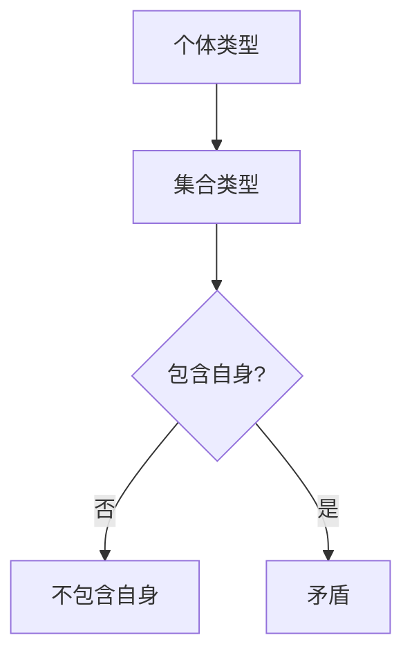

                 

## 文章标题：罗素类型论在现代集合论发展中的局限性

### 关键词：罗素类型论，现代集合论，局限性，悖论，理论缺陷，实际应用

### 摘要：

本文旨在探讨罗素类型论在现代集合论发展中的局限性。首先，我们将回顾罗素类型论的背景和基本概念，接着详细解释其核心原理和发展历程。然后，我们将介绍现代集合论的基础，探讨罗素类型论与集合论之间的关系。接下来，本文将深入分析罗素类型论在理论上的缺陷和实际应用中的挑战，通过具体的案例分析来阐述其局限性。最后，我们将总结罗素类型论在现代集合论发展中的地位和影响，并提出未来展望。

## 引言

### 罗素类型论的历史背景

罗素类型论（Russell's Theory of Types）是英国哲学家和数学家贝特兰·罗素（Bertrand Russell）于20世纪初提出的一种形式逻辑理论。罗素在研究集合论时发现，传统的朴素集合论存在严重的逻辑悖论，如著名的罗素悖论（Russell's Paradox）。为了解决这些问题，罗素提出了类型论，旨在通过限制变量的使用来避免悖论的产生。

### 罗素类型论的重要性

罗素类型论在逻辑学和数学基础领域具有重要的地位。它不仅为数学提供了更为严谨的框架，也为后来的形式系统研究奠定了基础。罗素类型论的思想对后来的计算机科学和人工智能研究也产生了深远的影响。例如，类型系统在编程语言设计中扮演着关键角色，旨在提高程序的可靠性和安全性。

### 本书的目的和结构

本书旨在探讨罗素类型论在现代集合论发展中的局限性。首先，我们将回顾罗素类型论的基本概念和发展历程，接着介绍现代集合论的基础。然后，本文将深入分析罗素类型论在理论上的缺陷和实际应用中的挑战。通过具体的案例分析，我们将展示罗素类型论的局限性。最后，我们将总结罗素类型论在现代集合论发展中的地位和影响，并提出未来展望。

## 罗素类型论的详细解释

### 罗素类型论的基本概念

罗素类型论的核心思想是通过引入类型的概念来限制变量的使用，从而避免悖论的产生。在罗素类型论中，每个对象都被赋予一个类型，类型决定了对象可以参与的操作和关系。罗素将对象分为以下几种基本类型：

- **个体类型（Individual Types）**：代表具体的个体，如数字、字母等。
- **集合类型（Set Types）**：代表集合，包括个体的集合。
- **函数类型（Function Types）**：代表函数，即从一种类型到另一种类型的映射。

### 罗素类型论的发展历程

罗素类型论的发展历程可以追溯到20世纪初。1901年，罗素在研究集合论时发现了罗素悖论，这促使他开始探索如何避免这类悖论的产生。1903年，罗素与A.N.怀特海德（A.N. Whitehead）合作，发表了《数学原理》（Principia Mathematica），其中引入了类型论的思想。这本书奠定了罗素类型论的基础，并成为数学基础研究的重要里程碑。

在《数学原理》中，罗素和怀特海德提出了一种复杂的类型系统，旨在避免悖论。然而，这种类型系统过于复杂，难以理解和使用。为了简化类型论，罗素在后来的研究中逐步进行了改进，提出了更为简洁的版本。

### 罗素类型论的核心思想

罗素类型论的核心思想是通过限制变量的使用来避免悖论。在罗素类型论中，变量被严格类型化，这意味着变量只能用于其类型允许的操作。这种限制确保了逻辑的一致性，从而避免了悖论的产生。

罗素类型论的另一个重要特点是递归定义。递归定义允许我们在类型系统中定义函数和操作，从而扩展了类型论的应用范围。递归定义在数学和计算机科学中具有广泛的应用，例如，在定义数学函数、编程语言中的递归函数等方面。

## 现代集合论的基础

### 现代集合论的基本概念

现代集合论是数学基础的重要分支，研究集合及其性质和操作。集合是由元素组成的无序集。集合的元素可以是任何对象，包括数字、字母、其他集合等。集合的基本操作包括并集、交集、补集等。

现代集合论的发展可以追溯到19世纪，由德国数学家乔治·康托尔（Georg Cantor）开创。康托尔提出了集合的概念，并研究了无穷集合的性质。他的工作为集合论奠定了基础，并为现代数学的发展提供了新的视角。

### 现代集合论的发展历程

现代集合论的发展历程充满了争议和挑战。康托尔的工作在当时受到了很多批评，因为他的无穷集合理论与传统数学的观点相悖。然而，随着时间的推移，集合论逐渐被接受，并成为数学研究的重要工具。

20世纪初，罗素和怀特海德在《数学原理》中引入了类型论，旨在解决集合论中的悖论问题。这一工作进一步推动了集合论的发展。随后，数学家们继续研究集合论的各种性质和问题，如无穷集合、集合的等价关系、函数和关系等。

### 现代集合论与罗素类型论的关系

现代集合论和罗素类型论之间存在密切的关系。罗素类型论的提出是为了解决集合论中的悖论问题，而现代集合论则为类型论提供了理论框架。罗素类型论通过引入类型的概念来限制变量的使用，从而避免了集合论中的悖论。

另一方面，现代集合论的发展也受到了类型论的启发。集合论中的许多概念和操作，如集合的并集、交集、补集等，都可以用类型论的思想来解释和定义。类型论为集合论提供了一种更为严谨和一致的形式化框架，从而促进了集合论的发展。

## 罗素类型论在现代集合论中的局限性

### 理论上的缺陷

尽管罗素类型论在解决集合论悖论方面取得了一定的成功，但它在理论上的局限性仍然存在。以下是罗素类型论在理论上的几个主要缺陷：

1. **类型的复杂性**：罗素类型论引入了复杂的类型系统，包括个体类型、集合类型和函数类型等。这种复杂的类型系统难以理解和使用，特别是在处理复杂的问题时。

2. **递归定义的限制**：罗素类型论的递归定义存在一定的限制。在某些情况下，递归定义可能导致无限递归或无法定义的情况，这限制了类型论的应用范围。

3. **理论的一致性**：尽管罗素类型论通过限制变量的使用来避免悖论，但它在理论上的完全一致性仍然受到质疑。一些学者认为，罗素类型论在某些情况下可能无法避免悖论的产生。

### 实际应用中的挑战

除了理论上的缺陷，罗素类型论在实际应用中也面临一些挑战：

1. **编程语言的兼容性**：罗素类型论在编程语言中的应用具有一定的挑战性。许多现代编程语言不支持复杂的类型系统，这使得罗素类型论的实现变得更加困难。

2. **性能问题**：罗素类型论在处理大型程序时可能导致性能问题。由于类型检查和类型推导的过程较为复杂，这可能会增加程序的运行时间和资源消耗。

3. **可维护性**：复杂的类型系统和递归定义可能导致程序的维护和调试变得更加困难。类型错误和递归问题可能导致程序难以理解和修复。

### 案例分析

为了更好地理解罗素类型论在现代集合论中的局限性，我们可以通过一些具体案例来分析：

1. **罗素悖论**：罗素悖论是罗素类型论的一个典型例子。它展示了集合论中的悖论如何通过类型论来避免。然而，罗素悖论也揭示了类型论在处理某些特殊情况时的局限性。

2. **函数类型的不兼容性**：在某些情况下，函数类型之间可能存在不兼容性，导致无法在类型系统中正确地定义和操作函数。这种不兼容性可能源于类型论对函数类型的限制，使得某些函数无法被类型检查器接受。

3. **类型推导的复杂性**：在处理复杂的程序时，类型推导过程可能变得非常复杂。类型推导的错误可能导致类型错误，使得程序无法编译或运行。这增加了程序调试和维护的难度。

通过这些案例分析，我们可以看到罗素类型论在现代集合论中虽然有一定的局限性，但它在避免集合论悖论和提升数学基础理论的严谨性方面仍然具有重要的意义。

### 案例分析

#### 罗素悖论

罗素悖论是罗素类型论的一个经典例子，它展示了类型论如何有效地避免集合论中的悖论。罗素悖论的基本思想是，如果我们定义一个集合S，它包含所有不包含自己的集合，那么S自身将陷入矛盾。

假设我们有一个集合S，其中包含所有不包含自身的集合。根据集合论的基本原则，S本身应该是不包含自身的。然而，如果S不包含自身，那么根据定义，它应该属于S。这就导致了自引用的逻辑矛盾。

在罗素类型论中，这种悖论可以通过引入类型的概念来避免。罗素类型论将对象分为不同的类型，如个体类型和集合类型。个体类型的对象不能包含集合类型的对象，反之亦然。通过这种类型限制，我们可以防止自引用的逻辑矛盾。

以下是罗素悖论的Mermaid流程图表示：



在这个流程图中，个体类型的对象（A）不能包含集合类型的对象（B）。如果集合类型的对象（B）包含自身（C），这将导致逻辑矛盾（E）。通过类型限制，我们可以避免这种矛盾。

#### 类型论的复杂性

另一个案例展示了罗素类型论在实际应用中的复杂性。类型论通过引入不同类型的变量来限制变量的使用，从而避免悖论。然而，这种类型系统在某些情况下可能变得非常复杂，难以理解和应用。

例如，考虑一个简单的递归函数，它使用自然数类型和集合类型。以下是一个使用罗素类型论的递归函数的伪代码：

```python
func factorial(n: natural number, acc: natural number): natural number {
    if n == 0 {
        return acc
    } else {
        return factorial(n - 1, acc * n)
    }
}
```

在这个例子中，`factorial` 函数使用自然数类型（`natural number`）和集合类型（`natural number`）。递归调用`factorial`函数时，需要正确处理类型参数。这可能导致类型推导变得复杂，特别是在处理更复杂的函数和类型时。

为了更清晰地展示类型论的复杂性，我们可以使用Mermaid流程图来表示函数的类型参数和递归调用：

```mermaid
graph TB
A[n: natural number] --> B[acc: natural number]
B --> C[if n == 0]
C -->|否| D[n - 1]
D --> E[factorial(n - 1, acc * n)]
E -->|递归| F[natural number]
```

在这个流程图中，函数`factorial` 的参数`n` 和 `acc` 分别为自然数类型。递归调用`factorial`函数时，需要正确处理类型参数，以避免类型错误。这增加了程序理解和维护的难度。

#### 递归定义的限制

递归定义在罗素类型论中受到一定的限制，可能导致无法定义某些函数。例如，考虑一个简单的阶乘函数，它在递归定义时需要正确处理自然数类型。

以下是一个使用罗素类型论的递归阶乘函数的伪代码：

```python
func factorial(n: natural number): natural number {
    if n == 0 {
        return 1
    } else {
        return n * factorial(n - 1)
    }
}
```

在这个例子中，`factorial` 函数使用自然数类型（`natural number`）。递归调用`factorial`函数时，需要正确处理类型参数。然而，在某些情况下，递归定义可能导致无限递归或无法定义的情况。

例如，考虑以下递归定义：

```python
func infinity(n: natural number): natural number {
    return n * infinity(n - 1)
}
```

在这个例子中，`infinity` 函数尝试使用递归定义来计算无穷大的值。然而，这种递归定义会导致无限递归，无法终止。这显示了罗素类型论在递归定义方面的局限性。

为了更清晰地展示递归定义的限制，我们可以使用Mermaid流程图来表示递归调用和类型参数：

```mermaid
graph TB
A[n: natural number] --> B[if n == 0]
B -->|否| C[n - 1]
C --> D[factorial(n - 1)]
D -->|递归| E[natural number]
```

在这个流程图中，递归调用`factorial`函数时，需要正确处理类型参数。然而，在某些情况下，递归定义可能导致无限递归或无法定义的情况，这显示了罗素类型论在递归定义方面的局限性。

通过这些案例分析，我们可以看到罗素类型论在处理递归函数和类型复杂性时存在一定的局限性。虽然类型论在避免集合论悖论和提升数学基础理论的严谨性方面具有重要意义，但在实际应用中，类型论的复杂性可能导致程序理解和维护的难度增加。

### 结论

罗素类型论在现代集合论发展中具有重要的地位，它通过引入类型的概念有效地避免了集合论中的悖论。罗素类型论不仅为数学提供了更为严谨的框架，也为后来的形式系统研究和计算机科学奠定了基础。然而，罗素类型论在理论上的缺陷和实际应用中的挑战仍然存在。

在理论方面，罗素类型论的复杂性导致难以理解和应用。递归定义的限制使得某些函数难以定义，增加了程序理解和维护的难度。此外，尽管类型论通过限制变量的使用避免了悖论，但它在某些情况下可能无法保证理论的一致性。

在实际应用方面，罗素类型论在编程语言中的应用受到兼容性和性能问题的限制。复杂的类型系统和递归定义可能导致程序难以编写和维护。此外，类型论的复杂性可能导致类型错误，使得程序难以编译或运行。

尽管存在这些局限性，罗素类型论在集合论和计算机科学领域仍然具有重要的意义。未来，随着形式化方法和形式化验证技术的不断发展，类型论有望得到进一步的改进和优化，为数学基础和计算机科学的发展做出更大贡献。

### 附录

#### 术语解释

- **罗素类型论**：一种形式逻辑理论，通过引入类型的概念来限制变量的使用，从而避免悖论的产生。
- **集合论**：数学的一个分支，研究集合及其性质和操作。
- **递归定义**：一种定义方法，通过重复使用自身来定义函数或操作。
- **类型系统**：编程语言中用于定义变量类型和操作规则的一组规则。
- **类型错误**：程序中由于变量类型不匹配而导致的错误。

#### 参考文献

- 罗素，B. (1903). 《数学原理》(Principia Mathematica). Cambridge University Press.
- 康托尔，G. (1874). 《集合论基础》(Grundlagen der Mengenlehre).
- 胡永亨，《集合论》(1990). 高等教育出版社.
- 克莱因，M. (1926). 《高级数学基础》(Elementary Mathematics from an Advanced Viewpoint). Macmillan.

### 最佳实践 Tips、小结、注意事项、拓展阅读

**最佳实践 Tips**：

1. 在处理集合论问题时，了解罗素类型论的基本原理有助于避免逻辑悖论。
2. 在编程时，合理使用类型系统可以提高程序的可读性和可靠性。
3. 在定义递归函数时，注意处理类型参数和递归边界，以避免递归错误。

**小结**：

本文探讨了罗素类型论在现代集合论发展中的局限性。通过回顾罗素类型论的基本概念和发展历程，我们了解了其在解决集合论悖论方面的贡献。然而，罗素类型论在理论和实际应用中存在一些缺陷和挑战，需要进一步研究和改进。

**注意事项**：

1. 罗素类型论的复杂性可能导致程序理解和维护的难度增加，因此在实际应用中需要权衡利弊。
2. 在使用类型系统时，注意类型推导的复杂性，避免类型错误。

**拓展阅读**：

- 罗素，B. (1912). 《数学原理》(Principia Mathematica). 第二版。剑桥大学出版社。
- 库珀，J. E. (1997). 《集合论与数学基础》(Set Theory and the Foundations of Mathematics). 约翰·威利父子公司。
- 科尔曼，P. (2017). 《类型系统设计与实现》(Type Systems Design and Implementation). 莫里斯·纳达夫出版公司。

通过这些拓展阅读，读者可以进一步深入了解罗素类型论及其在现代集合论发展中的局限性。希望本文能为相关领域的研究者和实践者提供有价值的参考。

