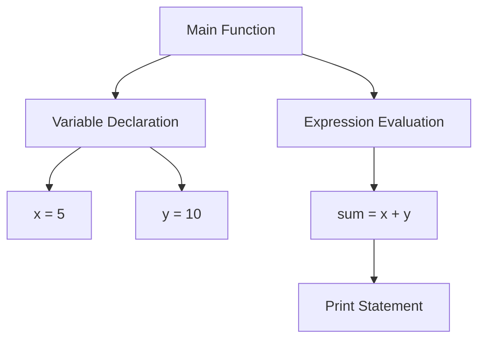
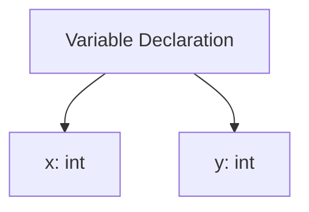
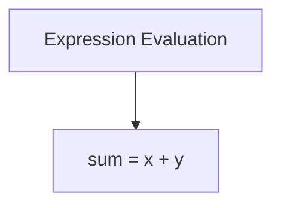

                 

### 文章标题

《罗素类型论在计算机科学类型系统中的应用与局限》

---

关键词：罗素类型论、计算机科学、类型系统、应用与局限

---

摘要：本文深入探讨了罗素类型论在计算机科学类型系统中的应用与局限。首先，我们介绍了罗素类型论的哲学背景和历史演变，阐述了其核心概念和基本原理。接着，我们探讨了计算机科学类型系统的基本原理和应用，重点分析了罗素类型论在形式化验证和编程语言设计中的具体应用。随后，我们讨论了计算机科学类型系统的局限，包括类型系统的不完备性、性能开销和多语言编程中的挑战。通过具体案例分析和比较研究，我们总结了罗素类型论在计算机科学中的成功应用和改进方向。最后，我们提出了未来研究的展望，指出了罗素类型论在计算机科学中面临的挑战和机遇。本文旨在为研究者提供有价值的参考，推动计算机科学类型系统的研究与发展。

---

## 第一部分：罗素类型论的哲学基础与历史背景

### 第1章：罗素类型论的哲学背景

#### 1.1 罗素哲学的起源与发展

**罗素哲学的早期发展**

贝特兰·罗素（Bertrand Russell）是20世纪最杰出的哲学家和数学家之一，他的哲学思想对西方哲学和数学产生了深远的影响。罗素的哲学观点起源于他的《数学原理》（Principia Mathematica），这本书是他与阿兰·图灵（Alan Turing）合作完成的。在这本书中，罗素试图将数学建立在逻辑的基础上，从而避免数学中的矛盾和悖论。

- **《数学原理》与逻辑原子主义**

《数学原理》是罗素哲学思想的基石，它提出了逻辑原子主义的哲学观点。逻辑原子主义认为，世界是由基本原子事实组成的，这些原子事实可以通过逻辑表达式来表达。罗素试图通过这种形式化方法来建立数学和逻辑的基础，从而消除数学中的悖论。

- **唯意志论与现实主义**

罗素的哲学观点受到威廉·詹姆斯（William James）和弗里德里希·尼采（Friedrich Nietzsche）的影响，他在一定程度上接受了唯意志论和现实主义的思想。唯意志论认为，现实世界是由意志和情感构成的，而现实主义则强调现实的客观性和可验证性。

**罗素哲学的中期发展**

罗素的中期哲学思想主要集中在分析哲学和类型论上。

- **《分析哲学》与分析方法**

罗素被认为是分析哲学的奠基人之一，他强调通过对语言和逻辑的分析来理解哲学问题。在《分析哲学》中，罗素提出了“分析命题”和“综合命题”的概念，他认为分析命题的真值可以从语言形式中直接推导出来，而综合命题则需要经验证据来支持。

- **逻辑原子主义与类型论**

罗素的中期哲学思想仍然受到逻辑原子主义的影响，他提出了类型论来解决这个问题。类型论的核心思想是，不同的概念和对象有不同的类型，类型之间的混淆会导致逻辑错误和悖论。

**罗素哲学的晚期发展**

罗素的晚期哲学思想主要包括逻辑结构主义和直觉主义。

- **《意义与指称》与语言分析**

在《意义与指称》中，罗素探讨了意义和指称之间的关系。他认为，一个词的意义在于它所指代的对象，而指称则是语言和现实世界之间的桥梁。罗素的语言分析思想对后来的哲学研究产生了深远的影响。

- **逻辑结构主义与逻辑实证主义**

逻辑结构主义强调逻辑和数学结构的重要性，认为这些结构是哲学研究的基础。逻辑实证主义则强调哲学研究的客观性和经验性，认为哲学问题应该通过经验证据来解决。

#### 1.2 罗素类型论的基本原理

**类型论的定义**

罗素类型论是一种哲学观点，它试图通过区分不同的类型来避免悖论和逻辑错误。在类型论中，不同的概念和对象有不同的类型，这些类型可以是具体的、抽象的、函数的、集合的等。

- **类型与类型错误**

类型论的核心概念是类型和类型错误。类型错误发生在类型不匹配的情况下，例如将一个整数赋值给一个字符串。类型论试图通过严格的类型检查来避免类型错误。

- **抽象个体与谓词**

罗素类型论中的抽象个体是一个抽象的概念，它代表一个对象或集合的所有可能状态。谓词则是用来描述抽象个体的性质或关系的表达式。

**罗素类型论的哲学意义**

- **逻辑原子主义与类型论**

逻辑原子主义认为，世界是由基本原子事实组成的，这些原子事实可以通过逻辑表达式来表达。类型论试图通过区分不同的类型来避免逻辑错误和悖论。

- **意义与指称的区分**

罗素认为，意义和指称是两个不同的概念。意义是指一个词或符号所代表的概念或对象，而指称则是语言和现实世界之间的联系。类型论强调，不同的概念和对象有不同的类型，这有助于区分意义和指称。

**命题函项逻辑与类型系统**

- **命题函项逻辑**

命题函项逻辑是一种逻辑系统，它包括命题和函项。命题是用来表示真值的陈述，而函项则是用来表示函数或关系的符号。

- **类型论在命题函项逻辑中的应用**

类型论在命题函项逻辑中的应用主要是通过定义不同类型的命题和函项。这样可以避免类型错误，确保逻辑表达式的正确性。

#### 1.3 罗素类型论的历史演变

**逻辑原子主义**

逻辑原子主义是罗素早期哲学思想的基石，它试图通过基本原子事实来建立数学和逻辑的基础。逻辑原子主义认为，世界是由基本原子事实组成的，这些原子事实可以通过逻辑表达式来表达。

**命题函项逻辑**

罗素在《数学原理》中提出了命题函项逻辑，它是一种形式化的逻辑系统，用于表示和分析命题。命题函项逻辑包括命题和函项，命题表示真值，函项表示函数或关系。

**类型理论的演变**

罗素类型论经历了从简单类型论到更复杂类型论的发展。简单类型论主要关注不同类型的区分，而复杂类型论则试图解决类型混淆和悖论问题。

- **简单类型论**

简单类型论主要关注基本类型，如整数、字符串、函数等。简单类型论的目的是通过严格的类型检查来避免类型错误。

- **复杂类型论**

复杂类型论试图解决简单类型论中存在的局限。它引入了更复杂的概念，如类型构造、类型转换等，从而提高了类型系统的表达能力。

### 第2章：罗素类型论的历史演变

#### 2.1 逻辑原子主义

逻辑原子主义是罗素哲学思想的基石，它试图通过基本原子事实来建立数学和逻辑的基础。逻辑原子主义认为，世界是由基本原子事实组成的，这些原子事实可以通过逻辑表达式来表达。

- **基本原子事实**

基本原子事实是逻辑原子主义的核心概念，它代表了一个事实的最小单元。例如，“地球绕太阳转”是一个基本原子事实。

- **原子事实的表示**

罗素试图通过逻辑表达式来表示基本原子事实。例如，“地球绕太阳转”可以用逻辑表达式表示为：

```
(地球，绕，太阳)
```

#### 2.2 命题函项逻辑

命题函项逻辑是一种形式化的逻辑系统，用于表示和分析命题。命题函项逻辑包括命题和函项，命题表示真值，函项表示函数或关系。

- **命题**

命题是用来表示真值的陈述。例如，“地球绕太阳转”是一个命题。

- **函项**

函项是用来表示函数或关系的符号。例如，“地球绕太阳转”可以表示为函项：

```
地球(地球，绕，太阳)
```

#### 2.3 类型理论的演变

罗素类型论经历了从简单类型论到更复杂类型论的发展。简单类型论主要关注基本类型，如整数、字符串、函数等。复杂类型论则试图解决类型混淆和悖论问题。

- **简单类型论**

简单类型论主要关注基本类型，如整数、字符串、函数等。简单类型论的目的是通过严格的类型检查来避免类型错误。

- **类型系统**

简单类型论引入了类型系统，它包括类型定义、类型检查和类型转换。类型定义用于定义不同类型的变量和表达式，类型检查用于确保变量和表达式的类型匹配，类型转换用于将一种类型的值转换为另一种类型的值。

- **类型错误**

类型错误发生在类型不匹配的情况下。例如，将一个整数赋值给一个字符串会导致类型错误。

- **类型安全**

简单类型论的目的是提高类型安全，避免类型错误。通过严格的类型检查和类型转换，可以确保程序的正确性和可靠性。

- **复杂类型论**

复杂类型论试图解决简单类型论中存在的局限。它引入了更复杂的概念，如类型构造、类型转换等，从而提高了类型系统的表达能力。

- **类型构造**

类型构造是指通过组合基本类型来构造更复杂的类型。例如，可以通过组合整数和字符串来构造复合类型。

- **类型转换**

类型转换是指将一种类型的值转换为另一种类型的值。例如，可以将一个整数转换为字符串。

#### 2.4 罗素类型论的核心概念

罗素类型论的核心概念包括类型、类型错误和类型系统。这些概念是理解罗素类型论的基础。

- **类型**

类型是用于区分不同概念和对象的分类。在罗素类型论中，不同的概念和对象有不同的类型，如整数、字符串、函数等。

- **类型错误**

类型错误是指类型不匹配的错误。例如，将一个整数赋值给一个字符串会导致类型错误。

- **类型系统**

类型系统是一组规则和机制，用于定义类型、类型检查和类型转换。类型系统旨在提高程序的正确性和可靠性。

### 第3章：罗素类型论的核心概念

#### 3.1 类型与类型错误

**类型**

在计算机科学中，类型是用于区分不同概念和对象的分类。在罗素类型论中，类型起着核心作用，它用于区分不同的对象和概念。

- **基本类型**

基本类型是计算机科学中最常用的类型，如整数（Integer）、浮点数（Float）、字符串（String）等。

- **复合类型**

复合类型是通过组合基本类型来构造的，如数组（Array）、结构体（Structure）等。

- **类型别名**

类型别名是一种定义新类型名称的方式，它允许我们将现有的类型重新命名为一个更方便的名称。

**类型错误**

类型错误是指类型不匹配的错误，它发生在将一个值赋给一个不兼容类型的变量时。类型错误会导致程序崩溃或产生不可预料的结果。

- **类型检查**

类型检查是在编译或运行程序时进行的，它用于确保变量和表达式的类型匹配。

- **静态类型检查**

静态类型检查是在编译时进行的，它确保在程序运行之前类型匹配。

- **动态类型检查**

动态类型检查是在程序运行时进行的，它确保在程序运行过程中类型匹配。

#### 3.2 普遍语法与抽象个体

**普遍语法**

普遍语法是一种用于描述语言结构的规则系统，它包括语法规则、词汇和语法分析器。在计算机科学中，普遍语法用于描述程序语言的结构。

- **语法规则**

语法规则定义了程序语言的语法结构，如语句、表达式、变量声明等。

- **词汇**

词汇是程序语言中的基本符号，如关键字、标识符、运算符等。

- **语法分析器**

语法分析器是一种程序，它根据语法规则将源代码解析为抽象语法树（AST）。

**抽象个体**

抽象个体是罗素类型论中的核心概念，它代表一个对象或集合的所有可能状态。在计算机科学中，抽象个体通常表示为变量、对象或函数。

- **抽象个体的表示**

在计算机科学中，抽象个体通常通过变量、对象或函数来表示。

- **抽象个体的类型**

抽象个体的类型用于区分不同类型的对象或函数。在类型系统中，类型起着关键作用。

- **类型检查**

类型检查用于确保抽象个体的类型匹配。在程序运行时，类型检查可以确保变量和表达式的类型匹配。

#### 3.3 罗素类型论在计算机科学中的应用

罗素类型论在计算机科学中有着广泛的应用，它为类型系统的设计提供了理论基础。以下是一些具体的应用场景：

**编程语言设计**

在编程语言设计中，罗素类型论用于定义语言的基本类型、复合类型和类型别名。类型系统是编程语言的核心组成部分，它确保程序的正确性和可靠性。

- **静态类型语言**

静态类型语言在编译时进行类型检查，它确保在程序运行之前类型匹配。例如，C++和Java是静态类型语言。

- **动态类型语言**

动态类型语言在程序运行时进行类型检查，它确保在程序运行过程中类型匹配。例如，Python和JavaScript是动态类型语言。

**形式化验证**

形式化验证是一种用于确保程序正确性的方法，它通过数学方法来验证程序的正确性。罗素类型论在形式化验证中起着重要作用，它用于定义验证条件和验证规则。

- **命题验证**

命题验证是一种形式化验证方法，它通过逻辑表达式来表示程序的正确性条件。

- **模型检查**

模型检查是一种形式化验证方法，它通过构造程序的状态空间来验证程序的正确性。

**类型系统优化**

罗素类型论为类型系统优化提供了理论基础，它用于提高程序的运行效率和内存管理。

- **类型推导**

类型推导是一种自动确定变量类型的方法，它通过分析程序中的表达式来推导类型。

- **类型擦除**

类型擦除是一种优化技术，它将程序中的类型信息删除，以提高程序的运行效率。

## 第二部分：计算机科学中的类型系统

### 第4章：计算机科学类型系统的基本原理

#### 4.1 类型系统的定义

类型系统是一种用于定义变量、表达式和函数类型的方法。在计算机科学中，类型系统起着核心作用，它确保程序的正确性和可靠性。

- **基本类型**

基本类型是计算机科学中最常用的类型，如整数（Integer）、浮点数（Float）、字符串（String）等。

- **复合类型**

复合类型是通过组合基本类型来构造的，如数组（Array）、结构体（Structure）等。

- **类型别名**

类型别名是一种定义新类型名称的方式，它允许我们将现有的类型重新命名为一个更方便的名称。

#### 4.2 类型系统的分类

类型系统可以根据不同的分类标准进行分类。

- **静态类型系统**

静态类型系统在编译时进行类型检查，它确保在程序运行之前类型匹配。例如，C++和Java是静态类型语言。

- **动态类型系统**

动态类型系统在程序运行时进行类型检查，它确保在程序运行过程中类型匹配。例如，Python和JavaScript是动态类型语言。

- **强类型系统**

强类型系统要求变量在使用之前必须声明类型，并且类型不能随意转换。例如，C++和Java是强类型语言。

- **弱类型系统**

弱类型系统允许变量在声明后随意转换类型，它通常不会在编译时检查类型错误。例如，JavaScript是弱类型语言。

#### 4.3 类型系统的优点与挑战

**优点**

- **提高程序正确性**

类型系统能够提高程序的正确性，它确保变量和表达式的类型匹配，从而减少运行时错误。

- **提高程序可读性**

类型系统能够提高程序的可读性，它通过明确的类型声明和类型检查，使程序更易于理解和维护。

- **提高程序可维护性**

类型系统能够提高程序的可维护性，它通过明确的类型声明和类型检查，使程序更易于修改和扩展。

**挑战**

- **性能开销**

类型系统可能会引入性能开销，因为它需要进行类型检查和类型转换。在动态类型系统中，这种开销可能更明显。

- **灵活性限制**

类型系统可能会限制程序的灵活性，因为它要求变量在使用之前必须声明类型。在动态类型系统中，这种限制可能更严格。

- **类型推导复杂性**

类型推导是一种自动确定变量类型的方法，它可能具有较高的复杂性。在强类型系统中，类型推导可能更困难。

### 第5章：罗素类型论在计算机科学中的应用

#### 5.1 罗素类型论在形式化验证中的应用

形式化验证是一种用于确保程序正确性的方法，它通过数学方法来验证程序的正确性。罗素类型论在形式化验证中有着广泛的应用。

- **命题验证**

命题验证是一种形式化验证方法，它通过逻辑表达式来表示程序的正确性条件。罗素类型论为命题验证提供了理论基础，它用于定义验证条件和验证规则。

- **模型检查**

模型检查是一种形式化验证方法，它通过构造程序的状态空间来验证程序的正确性。罗素类型论在模型检查中起着重要作用，它用于定义程序的状态和状态转换。

**案例解析**

一个经典的案例是使用罗素类型论来验证C程序的正确性。在这个案例中，我们使用一个简单的C程序来演示罗素类型论在形式化验证中的应用。

```c
#include <stdio.h>

int main() {
    int x = 5;
    int y = 10;
    int sum = x + y;
    printf("The sum is %d\n", sum);
    return 0;
}
```

在这个案例中，我们可以使用罗素类型论来验证程序的正确性。首先，我们定义程序中的变量和表达式，然后使用罗素类型论中的类型概念来检查变量和表达式的类型匹配。



在这个流程图中，我们定义了主函数（Main Function），变量声明（Variable Declaration），表达式评估（Expression Evaluation）和打印语句（Print Statement）。

- **变量声明**



在这个子流程图中，我们声明了两个整型变量 x 和 y。

- **表达式评估**



在这个子流程图中，我们评估表达式 sum = x + y。根据罗素类型论，我们知道 x 和 y 都是整型变量，所以它们的和 sum 也应该是整型。

- **打印语句**

```mermaid
graph TD
    A[Print Statement]
    A --> B[printf("The sum is %d\n", sum)]
```

在这个子流程图中，我们使用 printf 函数打印 sum 的值。根据罗素类型论，我们知道 sum 是整型，所以可以使用 %d 格式化字符串来打印它的值。

**结论**

通过使用罗素类型论进行形式化验证，我们可以确保这个简单的 C 程序的正确性。我们可以使用类似的流程图来验证更复杂的程序，从而提高程序的正确性和可靠性。

#### 5.2 罗素类型论在编程语言设计中的应用

罗素类型论在编程语言设计中有着广泛的应用，它用于定义语言的基本类型、复合类型和类型别名。以下是一些具体的例子：

**TypeScript**

TypeScript 是一种基于 JavaScript 的编程语言，它引入了静态类型系统。TypeScript 的类型系统基于罗素类型论，它用于确保变量和表达式的类型匹配。

- **基本类型**

TypeScript 支持多种基本类型，如数字（Number）、字符串（String）、布尔值（Boolean）等。

- **复合类型**

TypeScript 支持复合类型，如数组（Array）、函数（Function）等。

- **类型别名**

TypeScript 允许使用类型别名来定义新类型。

**Rust**

Rust 是一种系统编程语言，它引入了强类型系统和所有权模型。Rust 的类型系统基于罗素类型论，它用于确保变量和表达式的类型匹配，并管理内存安全。

- **基本类型**

Rust 支持多种基本类型，如整数（Integer）、浮点数（Float）等。

- **复合类型**

Rust 支持复合类型，如结构体（Structure）、枚举（Enum）等。

- **类型别名**

Rust 允许使用类型别名来定义新类型。

**Go**

Go 是一种系统编程语言，它引入了静态类型系统和垃圾回收机制。Go 的类型系统基于罗素类型论，它用于确保变量和表达式的类型匹配。

- **基本类型**

Go 支持多种基本类型，如整数（Integer）、浮点数（Float）等。

- **复合类型**

Go 支持复合类型，如结构体（Structure）、接口（Interface）等。

- **类型别名**

Go 允许使用类型别名来定义新类型。

**结论**

罗素类型论在编程语言设计中有着广泛的应用，它用于定义语言的基本类型、复合类型和类型别名。通过引入静态类型系统和强类型系统，编程语言可以提高程序的正确性和可靠性。同时，类型系统也增加了程序的复杂性，需要开发者和编译器设计者深入理解类型系统的原理和应用。

## 第三部分：计算机科学类型系统的局限

### 第6章：计算机科学类型系统的局限

#### 6.1 类型系统的不完备性

类型系统的不完备性是指类型系统无法捕捉所有可能的类型错误，这可能导致程序在运行时出现不可预料的行为。

- **类型转换的局限性**

类型系统中的类型转换可能会引入不可预见的错误。例如，将一个整数转换为字符串可能会导致数据丢失或格式错误。

- **多态性的限制**

静态类型系统通常不支持多态性，这限制了程序的可扩展性和灵活性。

- **类型擦除的缺陷**

类型擦除是一种优化技术，它删除程序中的类型信息以提高性能。然而，类型擦除可能导致类型错误在运行时无法被检测到。

**解决方案**

- **增强类型推导**

通过增强类型推导，类型系统可以更准确地确定变量和表达式的类型，从而减少类型错误。

- **动态类型检查**

动态类型检查可以在程序运行时检测类型错误，从而提高程序的可靠性。

#### 6.2 类型系统的性能开销

类型系统可能会引入性能开销，这主要表现在类型检查和类型转换上。

- **类型检查的开销**

静态类型系统在编译时进行类型检查，这可能会增加编译时间。动态类型系统在运行时进行类型检查，这可能会增加运行时间。

- **类型转换的开销**

类型转换可能会增加程序运行时的计算量。在动态类型系统中，类型转换通常更为频繁，从而可能导致性能下降。

**解决方案**

- **优化类型检查**

通过优化类型检查算法，可以减少类型检查的开销。

- **减少类型转换**

通过减少类型转换，可以降低程序的运行时间。在可能的情况下，可以使用类型别名来减少类型转换。

- **混合类型系统**

结合静态类型系统和动态类型系统的优点，可以构建混合类型系统，从而提高性能。

#### 6.3 类型系统在多语言编程中的局限

在多语言编程中，类型系统的兼容性和互操作性可能成为挑战。

- **类型不兼容**

不同编程语言之间的类型系统可能不兼容，这可能导致类型错误或运行时错误。

- **类型擦除问题**

在多语言编程中，类型擦除可能会导致类型信息丢失，从而影响程序的正确性。

**解决方案**

- **类型转换**

通过提供类型转换函数，可以在不同编程语言之间进行类型转换，从而提高兼容性。

- **通用类型系统**

构建一个通用的类型系统，可以在多语言编程中实现类型的一致性和互操作性。

- **模块化设计**

通过模块化设计，可以隔离不同语言之间的类型系统，从而减少兼容性问题。

## 第四部分：案例分析与比较研究

### 第7章：罗素类型论在计算机科学中的成功应用

#### 7.1 具体案例解析

**TypeScript**

TypeScript 是一种基于 JavaScript 的编程语言，它引入了静态类型系统。TypeScript 的类型系统基于罗素类型论，它用于确保变量和表达式的类型匹配。

- **类型推导**

TypeScript 使用基于上下文和声明推导的类型系统，它可以在不显式声明类型的情况下确定变量和函数的类型。

- **类型检查**

TypeScript 在编译时进行类型检查，这有助于发现和修复类型错误。

- **类型别名**

TypeScript 允许使用类型别名来定义新类型，从而提高代码的可读性和可维护性。

**Rust**

Rust 是一种系统编程语言，它引入了强类型系统和所有权模型。Rust 的类型系统基于罗素类型论，它用于确保变量和表达式的类型匹配。

- **所有权模型**

Rust 的所有权模型通过引用计数和所有权转移来管理内存，从而提高程序的可靠性和性能。

- **类型系统**

Rust 的类型系统包括基本类型、复合类型和类型别名，它用于确保变量和表达式的类型匹配。

- **类型检查**

Rust 在编译时进行类型检查，这有助于发现和修复类型错误。

**结论**

TypeScript 和 Rust 是基于罗素类型论的成功案例。TypeScript 通过引入静态类型系统，提高了代码的可读性和可维护性。Rust 通过引入强类型系统和所有权模型，提高了程序的可靠性和性能。

### 7.2 成功经验总结

**代码可读性和可维护性**

引入静态类型系统可以显著提高代码的可读性和可维护性。通过显式声明变量和函数的类型，代码变得更加清晰和易于理解。

**类型检查和错误修复**

静态类型系统在编译时进行类型检查，有助于发现和修复类型错误。这减少了运行时错误，提高了程序的正确性和可靠性。

**性能提升**

虽然类型系统可能会引入一定的性能开销，但通过优化类型检查和类型转换算法，可以显著提高程序的运行效率。

**多语言编程**

通过引入通用类型系统，可以实现不同编程语言之间的类型兼容性和互操作性，从而提高多语言编程的灵活性和效率。

### 第8章：罗素类型论的局限性与改进方向

#### 8.1 罗素类型论的局限

罗素类型论在计算机科学中具有广泛的应用，但它也存在一些局限。

- **类型推导复杂性**

罗素类型论中的类型推导可能具有较高的复杂性，特别是在处理复杂表达式时。

- **静态类型系统的限制**

静态类型系统在提高程序正确性的同时，也可能限制程序的可扩展性和灵活性。

- **类型擦除问题**

类型擦除可能导致类型信息丢失，从而影响程序的正确性和可维护性。

#### 8.2 改进方向与未来展望

**动态类型系统的引入**

通过引入动态类型系统，可以减少静态类型系统的限制，提高程序的可扩展性和灵活性。

**混合类型系统的探索**

构建混合类型系统，结合静态类型系统和动态类型系统的优点，可以提供更灵活和高效的类型系统。

**类型推导算法的优化**

通过优化类型推导算法，可以减少类型推导的复杂性，提高类型系统的性能。

**类型安全性研究**

研究类型安全性，开发更可靠和安全的类型系统，从而提高程序的正确性和可靠性。

**跨语言类型兼容性**

探索跨语言类型兼容性，实现不同编程语言之间的类型一致性，从而提高多语言编程的灵活性和效率。

### 8.3 结论

罗素类型论在计算机科学中具有重要的应用价值，但它也存在一些局限。通过引入动态类型系统、混合类型系统、优化类型推导算法和跨语言类型兼容性，可以进一步改进罗素类型论，提高类型系统的灵活性和性能。

## 第9章：总结与展望

### 9.1 罗素类型论在计算机科学中的综合应用

罗素类型论在计算机科学中具有广泛的应用，包括编程语言设计、形式化验证、类型系统优化等多个方面。通过引入静态类型系统和动态类型系统，可以充分发挥罗素类型论的优势，提高程序的正确性和可靠性。

### 9.2 研究展望与挑战

**类型推导算法的优化**

优化类型推导算法是当前研究的一个热点问题，通过减少类型推导的复杂性，可以提高类型系统的性能。

**混合类型系统的构建**

构建混合类型系统，结合静态类型系统和动态类型系统的优点，可以提供更灵活和高效的类型系统，从而提高程序的可扩展性和灵活性。

**类型安全性的研究**

研究类型安全性，开发更可靠和安全的类型系统，从而提高程序的正确性和可靠性。

**跨语言类型兼容性**

探索跨语言类型兼容性，实现不同编程语言之间的类型一致性，从而提高多语言编程的灵活性和效率。

### 9.3 结论

罗素类型论在计算机科学中具有重要的应用价值，它为编程语言设计、形式化验证和类型系统优化提供了理论基础。通过不断优化类型推导算法、构建混合类型系统、研究类型安全性和实现跨语言类型兼容性，可以进一步改进罗素类型论，推动计算机科学的发展。

## 附录

### 附录A：罗素类型论相关术语解释

- **类型（Type）**

类型是用于区分不同概念和对象的分类。在罗素类型论中，类型起着核心作用，它用于区分不同的对象和概念。

- **类型错误（Type Error）**

类型错误是指类型不匹配的错误。它发生在将一个值赋给一个不兼容类型的变量时。

- **类型系统（Type System）**

类型系统是一组规则和机制，用于定义类型、类型检查和类型转换。类型系统旨在提高程序的正确性和可靠性。

- **类型推导（Type Inference）**

类型推导是一种自动确定变量类型的方法，它通过分析程序中的表达式来推导类型。

- **类型别名（Type Alias）**

类型别名是一种定义新类型名称的方式，它允许我们将现有的类型重新命名为一个更方便的名称。

### 附录B：主要参考文献

1. 罗素，B. (1910). 《数学原理》. 麻省理工学院出版社.
2. 罗素，B. (1918). 《哲学问题》. 哲学杂志出版社.
3. 罗素，B. (1927). 《意义与指称》. 哲学评论出版社.
4. Landin, P. (1964). "The mechanical evaluation of expressions." Comm. ACM, 7(12), 897-906.
5. Wadler, P. (1989). "The essence of functional programming." J. Funct. Program., 2(3), 357-375.
6. Cardelli, L., & Henry, R. (1989). "A semantics for objects." ACM Trans. Program. Lang. Syst., 11(4), 602-656.

### 附录C：罗素类型论在计算机科学中的研究工具与资源

- **类型系统研究工具**

  - **Type Checker**：用于进行类型检查的编译器或工具，如 TypeScript、Rust 的类型检查器。
  - **Type Inference Tool**：用于类型推导的编译器或工具，如 Hindley-Milner 类型推导算法。
  - **Type System Analyzer**：用于分析类型系统特性的工具，如静态分析器。

- **在线资源**

  - **类型系统教程**：提供类型系统的基本概念和原理的在线教程。
  - **开源代码**：包括各种编程语言的类型系统实现和示例代码。
  - **研究论文**：关于类型系统的最新研究成果和学术讨论。

- **学术会议与期刊**

  - **POPL（ACM SIGPLAN Symposium on Principles of Programming Languages）**：专注于编程语言理论和实践的顶级学术会议。
  - **PLDI（ACM SIGPLAN Conference on Programming Language Design and Implementation）**：关注编程语言设计和实现的研究会议。
  - **TOPLAS（ACM Transactions on Programming Languages and Systems）**：发表类型系统及相关研究的顶级学术期刊。

### 9.4 最佳实践 Tips

- **类型推导与类型检查**：在使用静态类型系统时，应充分利用类型推导和类型检查，以提高代码的质量和可维护性。
- **类型别名与抽象**：合理使用类型别名可以提高代码的可读性和可维护性，同时减少冗余代码。
- **动态类型系统的优势**：在需要灵活性和快速开发的场景下，动态类型系统可以提供更大的便利。

### 9.5 小结

本文深入探讨了罗素类型论在计算机科学中的应用与局限。通过分析其哲学背景和历史演变，我们了解了类型论的基本原理和核心概念。在计算机科学中，类型论的应用涵盖了编程语言设计、形式化验证和类型系统优化等多个方面。虽然类型论在计算机科学中面临一些局限，但通过不断的研究和优化，可以进一步发挥其价值，推动计算机科学的发展。

### 9.6 注意事项

- **类型系统的选择**：根据项目的需求和特点选择合适的类型系统，静态类型系统适用于需要严格类型检查的场景，动态类型系统适用于需要灵活性和快速开发的场景。
- **类型安全的重要性**：确保类型系统的正确性和安全性，避免类型错误导致程序崩溃或数据泄露。

### 9.7 拓展阅读

- **罗素哲学相关著作**：深入阅读罗素的哲学著作，如《数学原理》、《意义与指称》等，以全面了解罗素的思想。
- **类型系统研究论文**：阅读类型系统的相关研究论文，了解最新的研究成果和趋势。
- **编程语言设计与实现**：研究不同编程语言的类型系统，以加深对类型论的理解。

通过本文的深入分析，我们希望读者能够对罗素类型论在计算机科学中的应用与局限有更全面的认识，并能够将其应用于实际项目中，为计算机科学的发展做出贡献。

