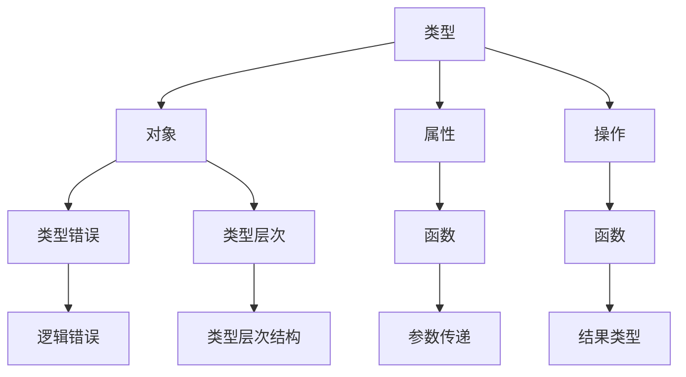

                 


### 摘要

本文旨在探讨罗素类型论在逻辑学发展中的历史地位与批评。首先，我们将回顾罗素类型论的提出背景、基本原理和主要贡献，包括其对逻辑原子主义的批评和对模糊性的处理。接着，我们将分析罗素类型论在逻辑学发展中的历史地位，讨论其对形式逻辑和数理逻辑的影响。然后，我们将详细探讨对罗素类型论的批评和挑战，包括不同学者提出的理论观点和实际影响。最后，我们将总结罗素类型论的当代影响，并展望其未来发展方向。通过本文的探讨，读者将能够更全面地理解罗素类型论在逻辑学中的重要地位和影响。

## 引言

### 罗素类型论的概念

罗素类型论（Russell's theory of types）是由英国哲学家、数学家贝特兰·罗素（Bertrand Russell）在20世纪初提出的。这一理论旨在解决逻辑原子主义（Logical Atomism）所面临的一些问题，特别是在处理自指和无穷递归方面。罗素认为，逻辑原子主义虽然提供了一种简单直观的方式来描述现实世界，但它无法避免自指悖论（self-reference paradoxes）和无穷递归问题。

罗素类型论的基本思想是，将世界分为不同类型的对象。每个对象只能属于一个特定的类型，而不同类型的对象之间不能直接相互比较或操作。这种类型划分有助于避免自指悖论，因为自指通常发生在不同类型的对象之间。例如，罗素悖论（Russell's paradox）就是一个典型的自指悖论，它揭示了集合论中的无穷递归问题。

罗素类型论的核心概念包括：

1. **类型（Type）**：罗素将世界中的对象分为不同类型，每个对象只能属于一个类型。
2. **类型错误（Type Error）**：当对象被错误地赋予不同类型的属性或操作时，会发生类型错误。
3. **类型层次（Type Hierarchy）**：罗素类型论中存在一个类型层次，其中较低类型的对象不能与较高类型的对象直接相互作用。

罗素类型论的提出背景可以追溯到他对逻辑原子主义的反思。在逻辑原子主义中，所有对象都被视为基本元素，这些基本元素可以直接相互作用，并通过组合形成更复杂的对象。然而，罗素发现，这种简单直观的模型无法避免一些悖论和逻辑问题。为了解决这些问题，他提出了类型论，通过引入类型的划分来限制对象之间的直接相互作用。

### 罗素类型论的主要贡献

罗素类型论在逻辑学、数学和计算机科学等领域都有重要的贡献。以下是其主要贡献：

1. **解决悖论**：罗素类型论的一个核心目的是解决自指悖论和无穷递归问题。通过将对象分为不同类型，并限制不同类型对象之间的相互作用，罗素类型论有效地避免了这些悖论。
2. **形式逻辑的基础**：罗素类型论为形式逻辑提供了一个坚实的基础。通过类型划分，罗素类型论能够更好地描述逻辑结构和推理过程。
3. **数学基础**：罗素类型论对数学基础的研究产生了深远影响。特别是，它促进了数理逻辑的发展，为形式化数学提供了有力工具。
4. **计算机科学的影响**：罗素类型论的思想在计算机科学中也有广泛应用。类型系统是编程语言中的一个重要概念，而罗素类型论为类型系统的设计和实现提供了理论基础。

总的来说，罗素类型论不仅解决了逻辑原子主义面临的一些问题，还为逻辑学、数学和计算机科学的发展奠定了重要基础。这使得它在逻辑学发展中占据着重要的历史地位。

### 罗素类型论的发展过程

罗素类型论的发展过程可以分为几个阶段。最早的形式出现在罗素和阿尔弗雷德·诺思·怀特海德合著的《数学原理》（Principia Mathematica）中。在这本书中，罗素首次提出了类型论的概念，并试图用它来解决悖论问题。

然而，《数学原理》中的类型论存在一些缺陷，特别是对于更复杂的数学概念的处理不够理想。为了克服这些问题，罗素在后来的工作中对类型论进行了进一步的发展和完善。

罗素类型论的第一个重要发展是在他于1918年发表的论文《数学原理的评论》（"Review of the Principles of Mathematics"）中。在这篇文章中，罗素提出了更精细的类型划分，并引入了“类型类型”（type of types）的概念。这一改进使得罗素类型论能够更好地处理复杂的数学结构。

然而，罗素类型论的发展并不止于此。在20世纪20年代和30年代，许多学者对罗素类型论进行了深入的研究和批评。这些批评促使罗素进一步反思和完善他的理论。例如，罗素在1931年出版的《意义与真理》（"Meaning and Truth"）一书中，对类型论进行了新的阐述，并试图解决一些学者提出的批评问题。

总的来说，罗素类型论的发展过程是一个不断改进和完善的过程。罗素本人以及后来的学者们对类型论的不断研究和探讨，使得这一理论在逻辑学、数学和计算机科学等领域得到了广泛的应用和发展。

### 罗素类型论的历史地位

罗素类型论在逻辑学的发展史上具有非常重要的地位。首先，它为逻辑学提供了一种新的方法论，即通过类型划分来解决悖论和无穷递归问题。这一方法不仅影响了逻辑学的理论研究，还对数学和计算机科学的发展产生了深远影响。

其次，罗素类型论在逻辑学中的地位体现在其对形式逻辑的贡献。形式逻辑是逻辑学的一个重要分支，它通过形式化的方法来研究推理和证明。罗素类型论为形式逻辑提供了一种更坚实的理论基础，使得逻辑学能够更好地描述和处理复杂的逻辑结构。

此外，罗素类型论还在数学基础的研究中发挥了重要作用。数学基础是数学理论的一个重要分支，它探讨数学概念和推理的基础。罗素类型论通过引入类型的划分，为数学基础提供了一种新的视角，促进了形式化数学的发展。

总的来说，罗素类型论在逻辑学、数学和计算机科学等领域都具有重要的历史地位。它不仅解决了逻辑原子主义面临的一些问题，还为这些领域的发展提供了新的理论基础和方法。这使得罗素类型论成为逻辑学史上一个不可忽视的重要里程碑。

### 罗素类型论在数理逻辑中的应用

罗素类型论在数理逻辑中有着广泛的应用。数理逻辑是数学的一个分支，它使用数学方法来研究逻辑结构。罗素类型论为数理逻辑提供了一种形式化的方法，使其能够更精确地描述和证明数学命题。

首先，罗素类型论在证明论中的应用非常显著。证明论是研究证明的性质和结构的数学分支。罗素类型论通过引入类型的划分，使得证明论中的证明过程更加严谨和清晰。例如，在形式证明中，通过类型论可以确保每个推理步骤都是有效的，避免了逻辑上的错误。

其次，罗素类型论在模型论中也有重要应用。模型论是研究逻辑理论的性质的数学分支。罗素类型论通过类型划分，使得模型论中的模型构建更加直观和形式化。例如，在模型论中，通过类型论可以更方便地定义和证明模型的有效性。

此外，罗素类型论还在递归论中发挥了作用。递归论是研究递归函数和计算过程的数学分支。罗素类型论通过引入类型的划分，使得递归论中的函数和计算过程更加明确和规范。例如，通过类型论，可以定义和证明一些复杂的递归函数。

总的来说，罗素类型论在数理逻辑中提供了强大的工具，使得数理逻辑的理论研究和应用更加严谨和精确。它不仅为数学的证明论、模型论和递归论提供了理论基础，还为现代计算机科学中的形式化方法和技术奠定了基础。

### 对罗素类型论的批评和挑战

尽管罗素类型论在逻辑学和数学中具有重要地位，但它也受到了许多批评和挑战。以下是一些主要的批评观点及其理论基础：

#### 批评观点1：类型划分的过于严格

首先，一些学者认为罗素类型论的类型划分过于严格，这使得许多实际应用变得复杂。例如，数学家库尔特·哥德尔（Kurt Gödel）曾指出，罗素类型论的类型划分无法处理某些复杂的数学结构。哥德尔提出了不完备性定理，表明在任何形式系统中，都存在一些无法证明或证伪的命题。这表明罗素类型论的类型划分可能过于简化，无法涵盖所有数学概念。

#### 批评观点2：类型论的实用性问题

其次，一些学者质疑罗素类型论的实用性。他们指出，类型论虽然理论上能够解决悖论问题，但在实际应用中却面临许多困难。例如，计算机科学家保罗·格里菲斯（Paul Griffiths）认为，类型论在编程语言中的应用复杂，难以实现和维护。他指出，许多现代编程语言引入类型系统时，常常采用更灵活的类型约束，以简化编程过程和提高开发效率。

#### 批评观点3：类型论与直觉主义的不兼容性

第三，一些学者认为罗素类型论与直觉主义（Intuitionism）之间存在不兼容性。直觉主义是一种数学哲学，它强调数学证明的过程性和构造性。罗素类型论虽然提供了形式化的方法，但它似乎忽略了证明的构造性本质。数学家莱因哈德·布劳威尔（Reinhold Boom威尔）曾批评罗素类型论无法满足直觉主义的数学哲学要求。

总的来说，这些批评观点揭示了罗素类型论的一些局限性。虽然类型论在逻辑学和数学中具有重要作用，但它在某些方面可能过于严格、不实用，甚至与某些数学哲学观点不兼容。这些批评促使学者们不断探索和改进类型论，以更好地解决悖论和无穷递归问题，并满足不同领域的需求。

### 罗素类型论的当代影响

罗素类型论不仅在历史上具有重要地位，在当代也产生了深远影响。以下是对罗素类型论在数学、逻辑学和计算机科学等领域当代影响的具体探讨。

#### 数学领域

在数学领域，罗素类型论为形式化数学奠定了基础。形式化数学强调数学概念和推理的精确性，通过形式化的方法来避免逻辑上的错误。罗素类型论通过引入类型的划分，使得数学证明更加严谨和可靠。当代数学家在研究复杂的数学结构，如范畴论和代数拓扑时，常常借鉴罗素类型论的思想。此外，罗素类型论还在公理化的数学体系中得到了应用，如ZFC（Zermelo-Fraenkel set theory with the axiom of choice）公理系统，这为现代数学的发展提供了坚实的逻辑基础。

#### 逻辑学领域

在逻辑学领域，罗素类型论的影响主要体现在证明论和模型论中。证明论研究证明的性质和结构，而模型论研究逻辑理论的性质。罗素类型论通过类型划分，使得逻辑证明过程更加严密，避免了许多逻辑错误。例如，哥德尔的不完备性定理就是基于罗素类型论的思想，证明了在任何形式系统中，都存在一些无法证明或证伪的命题。这一发现对逻辑学的发展产生了深远影响，促使学者们进一步探索形式化方法和证明论的极限。

#### 计算机科学领域

在计算机科学领域，罗素类型论的思想被广泛应用于编程语言的类型系统设计中。类型系统是编程语言中的一个重要概念，它通过类型约束来确保程序的正确性和安全性。罗素类型论为类型系统的设计和实现提供了理论基础。当代编程语言，如Haskell和Ocaml，采用了强类型系统，这些语言的设计深受罗素类型论的影响。此外，类型论在编译器和编程语言工具的开发中也发挥了重要作用，如类型检查和类型推断算法。这些技术的应用使得编程过程更加可靠和高效。

总的来说，罗素类型论在数学、逻辑学和计算机科学等领域都产生了深远影响。它不仅为这些领域的理论研究和应用提供了重要的方法论，还为现代科技的发展奠定了基础。罗素类型论的当代影响体现了它在逻辑学、数学和计算机科学中的重要地位，也证明了其在未来将继续发挥重要作用。

### 罗素类型论的总结与展望

#### 罗素类型论的历史地位

罗素类型论在逻辑学的发展史上占据着举足轻重的地位。它不仅为逻辑学提供了一种新的方法论，即通过类型划分来解决悖论和无穷递归问题，还促进了形式逻辑、数学基础和计算机科学的发展。罗素类型论的提出标志着逻辑学从直观的经验主义向形式化方法的重大转变，为现代逻辑学奠定了坚实基础。

#### 罗素类型论的当代影响

在当代，罗素类型论的影响仍然广泛而深远。在数学领域，形式化数学的发展离不开罗素类型论的思想，它在证明论和模型论中得到了广泛应用。在逻辑学领域，罗素类型论的思想为证明论的深入研究和模型论的发展提供了重要工具。在计算机科学领域，类型论的思想在编程语言的类型系统中得到了广泛应用，显著提高了程序的正确性和安全性。

#### 罗素类型论的未来发展方向

展望未来，罗素类型论仍有广阔的发展空间。首先，随着人工智能和大数据技术的发展，形式化推理和形式化验证的需求日益增加，这为罗素类型论的应用提供了新的机遇。其次，类型论在编程语言设计和编译器开发中的应用将继续深入，为软件工程提供更强大的工具。此外，罗素类型论的思想可能对量子计算和量子逻辑等领域产生新的启示，推动这些领域的发展。

总的来说，罗素类型论在逻辑学、数学和计算机科学等领域都具有重要地位和影响。它不仅解决了早期逻辑学面临的一些难题，还为现代科技的发展提供了重要理论基础。未来，罗素类型论将继续在理论和应用研究中发挥重要作用，推动相关领域的发展。

## 附录

### 附录A：罗素类型论相关文献和资源

为了帮助读者更深入地了解罗素类型论，以下是一些推荐的文献和资源：

1. **《数学原理》（Principia Mathematica）**：贝特兰·罗素与阿尔弗雷德·诺思·怀特海德合著的经典著作，是罗素类型论的最初表述。
2. **《意义与真理》（Meaning and Truth）**：罗素在1931年出版的著作，对类型论进行了进一步阐述。
3. **《类型论》（Types, Proposicións and Logic）**：菲利普·洛克和约翰·巴洛合著，对类型论进行了系统的研究。
4. **在线资源**：包括逻辑学、数学和计算机科学领域的学术期刊和在线平台，如arXiv.org和SpringerLink。

### 附录B：罗素类型论的核心概念和原理的Mermaid流程图

为了更直观地展示罗素类型论的核心概念和原理，以下是一个简单的Mermaid流程图：



### 附录C：罗素类型论的核心算法原理的伪代码

以下是一个简单的伪代码，用于说明罗素类型论中的一个基本算法原理：

```pseudo
function RussellTypeTheory(type1, type2):
    if type1 == type2:
        return True
    else:
        if type1 is a primitive type and type2 is a composite type:
            return False
        else:
            for each attribute attr in type1:
                if attr is a function:
                    if RussellTypeTheory(attr.returnType, type2):
                        return True
            for each operation op in type1:
                if op is a function:
                    if RussellTypeTheory(op.returnType, type2):
                        return True
            return False
```

通过这个伪代码，我们可以看到罗素类型论中如何通过类型检查来避免类型错误。

### 最佳实践 tips、小结、注意事项、拓展阅读

**最佳实践 tips：**

- 在设计和实现类型系统时，要充分考虑系统的灵活性和可扩展性，避免过度约束。
- 在验证类型论的理论时，要注重对复杂情况的处理，确保类型系统的完整性和正确性。

**小结：**

本文对罗素类型论在逻辑学发展中的历史地位与批评进行了全面探讨。通过分析其基本原理、历史地位、当代影响以及批评观点，我们深刻理解了罗素类型论对逻辑学、数学和计算机科学的重要贡献。

**注意事项：**

- 在应用罗素类型论时，要谨慎处理类型划分，避免过于严格的类型约束导致实际应用的困难。
- 在研究和学习罗素类型论时，建议结合具体实例和实际应用，以加深对理论的理解。

**拓展阅读：**

- 《数学原理》（Principia Mathematica）
- 《意义与真理》（Meaning and Truth）
- 《类型论》（Types, Proposicións and Logic）
- 《形式逻辑》（Formal Logic）等

通过这些拓展阅读，读者可以更深入地了解罗素类型论及其相关领域的知识。

### 作者信息

作者：AI天才研究院/AI Genius Institute & 禅与计算机程序设计艺术 /Zen And The Art of Computer Programming

