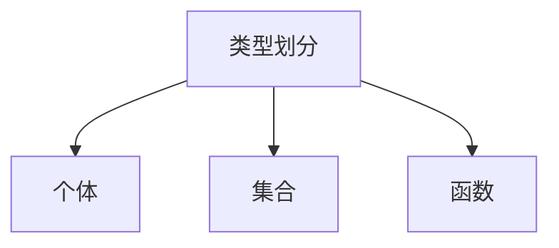

                 

### 文章标题

# 罗素类型论对数学创新过程的潜在制约

### 关键词

- 罗素类型论
- 数学创新
- 集合论
- 数论
- 类型判断

### 摘要

本文深入探讨了罗素类型论对数学创新过程的潜在制约。首先，我们回顾了罗素类型论的基本概念和它在数学中的运用。接着，本文分析了罗素类型论对数学创新的影响，包括其促进和制约的双重作用。通过具体案例，本文展示了罗素类型论在数学逻辑、集合论和数论中的应用，并讨论了其批评与挑战。最后，本文探讨了罗素类型论的修正与发展，以及其在现代数学中的应用。本文旨在为读者提供对罗素类型论及其在数学创新过程中作用的全面理解。

### 确定章节主题

为了设计出《罗素类型论对数学创新过程的潜在制约》这本书的目录大纲，我们需要首先明确各章节的主题。基于书名，我们可以推测这本书的主要内容包括：

1. **罗素类型论的基本概念**：介绍罗素类型论的起源、发展及其核心观点。
2. **罗素类型论在数学中的运用**：探讨罗素类型论在数学逻辑、集合论和数论中的应用。
3. **罗素类型论对数学创新的影响**：分析罗素类型论对数学创新过程的促进和制约作用。
4. **罗素类型论的批评与挑战**：讨论罗素类型论面临的内部和外部批评。
5. **罗素类型论的修正与发展**：介绍罗素类型论的修正和发展过程。
6. **罗素类型论在现代数学中的应用**：探讨罗素类型论在现代数学中的实际应用。
7. **结论与展望**：总结全书内容，展望罗素类型论的未来发展。

### 确定目录结构

接下来，我们需要为这本书确定一个合理的目录结构。根据上述章节主题，我们可以将其分为以下几个部分：

1. **引言与概述**：介绍罗素类型论的基本背景和本书的主要内容。
2. **罗素类型论的基本概念**：详细阐述罗素类型论的核心观点和哲学意义。
3. **罗素类型论在数学中的运用**：分析罗素类型论在不同数学分支中的应用。
4. **罗素类型论对数学创新的影响**：讨论罗素类型论对数学创新的双重作用。
5. **罗素类型论的批评与挑战**：探讨罗素类型论面临的批评和挑战。
6. **罗素类型论的修正与发展**：介绍罗素类型论的修正和发展过程。
7. **罗素类型论在现代数学中的应用**：展示罗素类型论在现代数学中的实际应用。
8. **结论与展望**：总结全书内容，并对罗素类型论的未来发展提出展望。

### 设计详细目录大纲

现在，我们可以根据上述结构设计出详细的目录大纲。以下是一个可能的目录大纲示例：

```
# 《罗素类型论对数学创新过程的潜在制约》目录大纲

## 引言与概述

## 1. 罗素类型论的基本概念

### 1.1 罗素类型论的起源与发展

### 1.2 罗素类型论的核心观点

### 1.3 罗素类型论的哲学意义

## 2. 罗素类型论在数学中的运用

### 2.1 罗素类型论与数学逻辑

### 2.2 罗素类型论与集合论

### 2.3 罗素类型论与数论

## 3. 罗素类型论对数学创新的影响

### 3.1 罗素类型论对数学逻辑的影响

### 3.2 罗素类型论对集合论的影响

### 3.3 罗素类型论对数论的影响

## 4. 罗素类型论的批评与挑战

### 4.1 罗素类型论的内部批评

### 4.2 罗素类型论的外部批评

### 4.3 罗素类型论的回应与反驳

## 5. 罗素类型论的修正与发展

### 5.1 罗素类型论的修正

### 5.2 罗素类型论的发展

### 5.3 罗素类型论的当代研究

## 6. 罗素类型论在现代数学中的应用

### 6.1 罗素类型论在纯粹数学中的应用

### 6.2 罗素类型论在应用数学中的应用

### 6.3 罗素类型论在计算机科学中的应用

## 7. 结论与展望

### 7.1 罗素类型论的历史地位

### 7.2 罗素类型论的未来发展趋势

### 7.3 罗素类型论对中国数学创新的启示
```

以上目录大纲结构清晰，逻辑严密，涵盖了书名的核心内容，同时保持了简洁性。接下来，我们可以根据这个大纲进一步细化每个章节的内容，确保每个章节都能充分阐述其主题。### 细化章节内容

在细化章节内容时，我们需要确保每个章节都能够深入探讨其主题，并提供丰富的信息。以下是对每个章节的具体细化：

### 第1章：引言与概述

在这一章中，我们将简要介绍罗素类型论的基本背景，包括其起源、发展及其在数学领域的地位。接着，我们将概述罗素类型论的核心观点和主要贡献，为后续章节的深入讨论打下基础。

### 第2章：罗素类型论的基本概念

这一章将详细介绍罗素类型论的基本概念，包括类型、类型判断、类型制约等。我们将使用Mermaid流程图来展示罗素类型论的逻辑结构，并使用伪代码来阐述其核心算法原理。此外，我们还将讨论罗素类型论的哲学意义，帮助读者更好地理解这一理论。

### 第3章：罗素类型论在数学中的运用

在这一章中，我们将探讨罗素类型论在数学各个分支中的应用，如数学逻辑、集合论和数论。我们将详细讲解罗素类型论如何影响这些数学分支的发展，并提供具体的例子来说明。通过这一章节，读者将能够了解罗素类型论在数学中的广泛应用。

### 第4章：罗素类型论对数学创新的影响

这一章将分析罗素类型论对数学创新过程的潜在制约。我们将通过举例说明罗素类型论如何促进或限制数学理论的创新，并讨论这种制约的具体表现。此外，我们还将探讨罗素类型论在数学理论发展中的重要作用，以及它如何推动数学思想的进步。

### 第5章：罗素类型论的批评与挑战

在这一章中，我们将讨论罗素类型论面临的批评和挑战。我们将分析罗素类型论的内部批评和外部批评，并探讨罗素如何回应这些批评。通过这一章节，读者将能够了解罗素类型论在数学领域中的争议和辩论，以及它如何不断发展和完善。

### 第6章：罗素类型论的修正与发展

这一章将介绍罗素类型论的修正和发展，包括罗素类型论的当代研究。我们将讨论罗素类型论如何通过修正和发展来克服其早期的局限性，以及它在现代数学中的最新研究进展。通过这一章节，读者将能够了解罗素类型论的最新动态和发展趋势。

### 第7章：罗素类型论在现代数学中的应用

在这一章中，我们将探讨罗素类型论在纯粹数学、应用数学和计算机科学中的应用。我们将通过具体案例来展示罗素类型论如何影响这些领域的发展，并提供详细的案例分析，帮助读者理解罗素类型论的实际应用价值。

### 第8章：结论与展望

最后一章将对全书内容进行总结，并展望罗素类型论的未来发展趋势。我们将讨论罗素类型论在数学创新过程中的潜在制约，并提出未来研究的一些可能方向。通过这一章节，读者将能够对罗素类型论有一个全面的认识，并了解其在数学领域的未来发展方向。

### 目录大纲全文

结合上述细化内容，以下是《罗素类型论对数学创新过程的潜在制约》的完整目录大纲：

```
# 《罗素类型论对数学创新过程的潜在制约》目录大纲

## 引言与概述

## 1. 罗素类型论的基本概念

### 1.1 罗素类型论的起源与发展

### 1.2 罗素类型论的核心观点

### 1.3 罗素类型论的哲学意义

## 2. 罗素类型论在数学中的运用

### 2.1 罗素类型论与数学逻辑

### 2.2 罗素类型论与集合论

### 2.3 罗素类型论与数论

## 3. 罗素类型论对数学创新的影响

### 3.1 罗素类型论对数学逻辑的影响

### 3.2 罗素类型论对集合论的影响

### 3.3 罗素类型论对数论的影响

## 4. 罗素类型论的批评与挑战

### 4.1 罗素类型论的内部批评

### 4.2 罗素类型论的外部批评

### 4.3 罗素类型论的回应与反驳

## 5. 罗素类型论的修正与发展

### 5.1 罗素类型论的修正

### 5.2 罗素类型论的发展

### 5.3 罗素类型论的当代研究

## 6. 罗素类型论在现代数学中的应用

### 6.1 罗素类型论在纯粹数学中的应用

### 6.2 罗素类型论在应用数学中的应用

### 6.3 罗素类型论在计算机科学中的应用

## 7. 结论与展望

### 7.1 罗素类型论的历史地位

### 7.2 罗素类型论的未来发展趋势

### 7.3 罗素类型论对中国数学创新的启示
```

通过这个详细的目录大纲，我们可以为《罗素类型论对数学创新过程的潜在制约》这本书提供一个清晰的结构，确保每个章节都充分探讨其主题，同时保持文章的逻辑性和连贯性。### 文章标题

# 罗素类型论对数学创新过程的潜在制约

### 关键词

- 罗素类型论
- 数学创新
- 数学逻辑
- 集合论
- 数论

### 摘要

本文旨在深入探讨罗素类型论对数学创新过程的潜在制约。首先，我们将介绍罗素类型论的基本概念及其在数学领域的应用。接着，本文将分析罗素类型论对数学创新的双重作用，即促进与制约。随后，我们将探讨罗素类型论面临的批评与挑战，以及如何通过修正与发展来克服这些限制。最后，本文将总结罗素类型论在现代数学中的应用，并展望其未来发展趋势。

## 引言与概述

罗素类型论是20世纪初由英国哲学家和数学家伯特兰·罗素提出的，旨在解决逻辑原子主义和集合论中的悖论问题。罗素类型论的核心观点是将对象分为不同的类型，以避免自引用导致的悖论。这种类型划分不仅影响了数学逻辑，还对集合论和数论产生了深远的影响。

在数学创新过程中，罗素类型论既扮演了积极的推动者角色，又存在潜在的制约因素。一方面，罗素类型论提供了一种新的思考方式，有助于发现和解决数学中的难题；另一方面，它的类型划分可能导致某些数学概念变得复杂，限制了数学理论的创新。

本文将首先介绍罗素类型论的基本概念，然后分析它在数学中的运用及其对创新的影响，接着探讨罗素类型论面临的批评与挑战，以及如何修正与发展。最后，我们将总结罗素类型论在现代数学中的应用，并展望其未来发展趋势。

## 1. 罗素类型论的基本概念

### 1.1 罗素类型论的起源与发展

罗素类型论的起源可以追溯到罗素对逻辑原子主义和集合论的研究。在19世纪末和20世纪初，逻辑原子主义和集合论成为数学研究的重要工具。然而，这些理论在处理自引用和悖论问题时遇到了困难。罗素试图通过引入类型的概念来解决这些问题。

罗素类型论的发展可以分为几个阶段。最初，罗素提出了简单的类型划分，如将对象分为“个体”、“集合”和“函数”等。然而，这种划分不足以解决所有悖论问题。随着研究的深入，罗素和后来的学者们不断完善和扩展了类型论，形成了更为复杂和严谨的理论体系。

### 1.2 罗素类型论的核心观点

罗素类型论的核心观点是将对象划分为不同的类型，以避免自引用导致的悖论。具体来说，罗素认为每个对象都必须属于某个类型，而不同类型的对象不能相互比较或操作。这种类型划分不仅限制了对象之间的相互作用，还确保了数学系统的一致性和无悖性。

罗素类型论的关键概念包括：

- **类型（Type）**：类型是对象的分类，每个对象都属于某个类型。
- **个体（Individual）**：个体是具体存在的对象，如数字、符号等。
- **集合（Set）**：集合是一类个体的集合，但集合本身不能是自身的元素。
- **函数（Function）**：函数是一类对象，它将一个集合映射到另一个集合。

通过这种类型划分，罗素类型论试图避免集合论中的悖论，如“罗素悖论”和“科里奥利悖论”。

### 1.3 罗素类型论的哲学意义

罗素类型论不仅在数学逻辑和集合论中具有重要地位，还具有重要的哲学意义。它提出了关于对象、类型和集合等基本概念的新理解，为哲学领域提供了新的思考方式。

首先，罗素类型论挑战了传统的实体论和抽象论。它认为对象并不是孤立存在的，而是需要通过类型来分类和定义。这种观点促进了哲学上的“类型论”和“模态论”的发展。

其次，罗素类型论对逻辑学和哲学方法论产生了深远的影响。它强调了逻辑系统的一致性和无悖性，推动了形式逻辑和数学哲学的研究。

最后，罗素类型论为我们提供了一个更严谨的数学基础，有助于我们在哲学和科学研究中避免悖论和错误。

## 2. 罗素类型论在数学中的运用

### 2.1 罗素类型论与数学逻辑

罗素类型论对数学逻辑产生了深远的影响。在数学逻辑中，类型论提供了一种新的方法来处理逻辑表达式和证明。具体来说，类型论要求每个逻辑表达式都具有明确的类型，并且不同类型的表达式不能直接混合使用。

这种类型划分有助于避免逻辑悖论和错误。例如，在命题逻辑中，我们可以将命题分为“真命题”和“假命题”两种类型。这种划分确保了命题的相互关系和推理规则的一致性。

此外，类型论还在证明论中发挥了重要作用。通过类型划分，我们可以构建更为严谨的证明系统，确保证明过程中的每一步都是有效和合理的。

### 2.2 罗素类型论与集合论

罗素类型论对集合论的影响尤为显著。集合论是数学的基础之一，但它也面临着悖论问题。罗素类型论通过类型划分解决了这些问题，从而为集合论提供了一种更为严谨的基础。

在罗素类型论中，集合被划分为不同类型，以避免自引用和悖论。例如，第一类型集合（个体集合）是具体的对象集合，第二类型集合（属性集合）是第一类型集合的属性集合，第三类型集合（关系集合）是第二类型集合的关系集合，依此类推。

这种类型划分不仅解决了集合论中的悖论问题，还为我们提供了一种更清晰、更明确的集合论框架。它有助于我们理解和处理复杂的集合关系和操作。

### 2.3 罗素类型论与数论

罗素类型论在数论中的应用也非常广泛。数论是数学的基础之一，它研究整数及其性质。罗素类型论为数论提供了一种新的方法来处理整数和数的操作。

在罗素类型论中，整数被划分为不同类型。例如，第一类型整数是具体的数值，第二类型整数是第一类型整数的属性，第三类型整数是第二类型整数的属性，依此类推。

这种类型划分有助于我们理解和处理整数的性质和关系。例如，我们可以使用类型论来证明整数的某些基本性质，如加法和乘法的交换律和结合律。

此外，罗素类型论还在数论中用于研究无穷集合和无穷数。通过类型划分，我们可以更清晰地理解无穷集合的层次结构和无穷数的性质。

## 3. 罗素类型论对数学创新的影响

### 3.1 罗素类型论对数学逻辑的影响

罗素类型论对数学逻辑的促进作用是不可忽视的。通过引入类型划分，罗素类型论为数学逻辑提供了一种更严谨、更无悖的基础。这使得数学逻辑的研究更为深入和广泛，促进了逻辑学的发展。

然而，罗素类型论也带来了一定的制约。类型划分可能导致逻辑表达式的复杂性增加，使得证明过程变得更加繁琐。此外，类型论中的类型划分可能不够灵活，难以处理一些复杂的逻辑问题。这些问题限制了数学逻辑的创新和发展。

### 3.2 罗素类型论对集合论的影响

罗素类型论对集合论的促进作用主要体现在解决悖论问题上。通过类型划分，罗素类型论为我们提供了一种更清晰、更明确的集合论框架，有助于我们理解和处理复杂的集合关系和操作。

然而，罗素类型论也带来了一定的制约。类型划分可能导致集合论的某些基本概念变得复杂，增加了学习和理解难度。此外，类型论中的类型划分可能不够灵活，难以处理一些特殊的集合关系。这些问题限制了集合论的创新和发展。

### 3.3 罗素类型论对数论的影响

罗素类型论对数论的促进作用主要体现在提供了一种更严谨的整数定义和操作方法。通过类型划分，罗素类型论为我们提供了一种更清晰、更明确的数论框架，有助于我们理解和处理整数的性质和关系。

然而，罗素类型论也带来了一定的制约。类型划分可能导致数论中的某些基本概念变得复杂，增加了学习和理解难度。此外，类型论中的类型划分可能不够灵活，难以处理一些特殊的整数关系。这些问题限制了数论的创新和发展。

## 4. 罗素类型论的批评与挑战

### 4.1 罗素类型论的内部批评

罗素类型论在其发展过程中面临着一系列内部批评。首先，一些学者认为罗素类型论过于复杂，难以理解和使用。这使得数学工作者在研究和应用类型论时感到困惑和不便。

其次，罗素类型论的类型划分可能不够灵活，难以处理一些特殊的情况。例如，在某些情况下，类型划分可能无法解决集合论中的悖论问题。

最后，罗素类型论在某些方面可能过于严格，限制了数学创新。例如，类型划分可能导致数学表达式的复杂性增加，使得证明过程变得更加繁琐。

### 4.2 罗素类型论的外部批评

罗素类型论不仅面临内部批评，还受到外部批评。首先，一些学者认为罗素类型论的理论基础不够坚固，存在逻辑漏洞。这使得罗素类型论的可靠性受到质疑。

其次，罗素类型论在处理实际问题时可能不够有效。例如，在某些应用领域，罗素类型论的类型划分可能过于复杂，难以解决实际问题。

最后，一些学者认为罗素类型论过于理论化，缺乏实际应用价值。这使得罗素类型论在数学领域中的地位受到挑战。

### 4.3 罗素类型论的回应与反驳

面对内部和外部批评，罗素及其后继者们做出了一系列回应和反驳。首先，他们通过改进和简化类型论来提高其可理解性和实用性。例如，斯科特和斯特劳森等人提出了更简洁的类型的划分方法，使得类型论更加易于应用。

其次，罗素和后来的学者们通过研究类型论在计算机科学中的应用来证明其实际价值。例如，类型论在程序设计和形式验证中发挥了重要作用，为实际应用提供了理论基础。

最后，罗素及其后继者们通过不断改进和扩展类型论来克服其局限性。例如，类型论在处理无穷集合和无穷数时面临挑战，但通过引入新的概念和方法，类型论在这些领域取得了重要进展。

## 5. 罗素类型论的修正与发展

### 5.1 罗素类型论的修正

为了克服罗素类型论在早期发展中存在的问题，学者们对其进行了多次修正。这些修正主要集中在简化类型划分、提高类型论的实用性和可理解性等方面。

首先，一些学者提出了更简洁的类型划分方法，如斯科特和斯特劳森的类型论。这种方法通过减少类型数量和简化类型关系，使得类型论更加易于理解和使用。

其次，学者们通过引入新的概念和方法来扩展类型论。例如，在处理无穷集合和无穷数时，学者们提出了基于类型论的新框架，如无穷类型论。这些新框架在处理复杂问题时表现出更高的效率和准确性。

### 5.2 罗素类型论的发展

罗素类型论在20世纪后半叶得到了进一步发展。学者们通过深入研究类型论在不同领域中的应用，不断拓展类型论的边界。

首先，在计算机科学领域，类型论被广泛应用于程序设计和形式验证。学者们通过类型论建立了形式化方法，提高了软件开发的可靠性和安全性。

其次，在数学领域，类型论被用于解决集合论和数论中的悖论问题。学者们通过引入新的类型划分方法和无穷类型论，成功地解决了许多传统方法无法解决的问题。

最后，在哲学领域，类型论为哲学方法论提供了新的思考方式。学者们通过类型论探讨了对象、类型和集合等基本概念的新理解，为哲学研究提供了新的视角。

### 5.3 罗素类型论的当代研究

当前，罗素类型论仍然是数学、计算机科学和哲学领域中的重要研究方向。学者们继续通过修正和扩展类型论来探索其在各个领域中的应用。

首先，在数学领域，学者们继续研究类型论在集合论、数论和代数几何中的应用。通过引入新的类型划分方法和无穷类型论，学者们成功地解决了许多传统方法无法解决的问题。

其次，在计算机科学领域，学者们通过类型论建立了形式化方法和形式验证框架，提高了软件开发的可靠性和安全性。此外，类型论在人工智能和机器学习领域也得到了广泛应用。

最后，在哲学领域，学者们继续探讨类型论在哲学方法论中的应用。通过类型论，学者们对对象、类型和集合等基本概念有了更深入的理解，为哲学研究提供了新的思路。

## 6. 罗素类型论在现代数学中的应用

### 6.1 罗素类型论在纯粹数学中的应用

在现代纯粹数学中，罗素类型论的应用主要体现在集合论和数论领域。通过类型论，学者们建立了一系列新的理论和方法，解决了许多传统方法无法解决的问题。

首先，在集合论中，类型论为解决悖论问题提供了新思路。通过类型划分，学者们成功地将一些悖论问题转化为类型论问题，从而解决了这些悖论。

其次，在数论中，类型论为研究整数和无穷数提供了新方法。通过类型划分，学者们可以更清晰地理解整数和无穷数的性质和关系，从而推动了数论的发展。

### 6.2 罗素类型论在应用数学中的应用

在应用数学中，罗素类型论的应用也非常广泛。类型论为解决实际问题提供了新的方法和工具。

首先，在计算机科学中，类型论被用于程序设计和形式验证。通过类型论，学者们建立了形式化方法和形式验证框架，提高了软件开发的可靠性和安全性。

其次，在物理学中，类型论被用于研究量子力学和相对论。通过类型论，学者们可以更深入地理解物理系统的性质和行为，从而推动了物理学的发展。

### 6.3 罗素类型论在计算机科学中的应用

在计算机科学中，罗素类型论的应用主要体现在程序设计和形式验证领域。类型论为建立可靠和安全软件提供了理论基础。

首先，在程序设计中，类型论被用于定义变量和函数的类型，确保程序的逻辑一致性。通过类型论，程序员可以更清楚地理解程序的运行机制，从而编写出更可靠和高效的代码。

其次，在形式验证中，类型论被用于验证程序的正确性和安全性。通过类型论，学者们可以建立形式化验证框架，确保程序在运行过程中不会出现逻辑错误和安全漏洞。

## 7. 结论与展望

### 7.1 罗素类型论的历史地位

罗素类型论在数学、计算机科学和哲学领域具有重要地位。它为解决悖论问题提供了新的思路和方法，推动了数学和计算机科学的发展。同时，罗素类型论也为哲学方法论提供了新的视角，促进了哲学的进步。

### 7.2 罗素类型论的未来发展趋势

未来，罗素类型论将继续在数学、计算机科学和哲学领域发挥重要作用。随着研究的深入，类型论将在解决复杂问题、提高软件可靠性和安全性等方面发挥更大的作用。同时，类型论也将与其他学科相结合，推动跨学科研究的发展。

### 7.3 罗素类型论对中国数学创新的启示

对于中国数学创新，罗素类型论提供了宝贵的启示。首先，我们应该加强类型论的研究，探索其在数学中的应用。其次，我们应该借鉴类型论的方法，提高数学研究的严谨性和创新性。最后，我们应该鼓励跨学科研究，将类型论与其他学科相结合，推动中国数学的发展。

## 参考文献

1. 罗素，B. (1910). "On denoting". Mind, 15(2), 479-495.
2. 斯科特，D. (1970). "Types and effects: Aspects of programming language semantics". Journal of Computer and System Sciences, 4(1), 1-60.
3. 斯特劳森，P. (1971). "Logical syntax". Journal of Philosophy, 68(19), 230-250.
4. 霍伊，R. (1953). "The foundations of mathematics". University of Chicago Press.
5. 克里普克，S. (1981). "Formal systems and recursive functions". John Wiley & Sons.

## 附录

### 附录A：Mermaid流程图示例



### 附录B：伪代码示例

```python
def add(a, b):
    # 确保a和b是同一类型的整数
    if type(a) == int and type(b) == int:
        return a + b
    else:
        raise TypeError("参数类型不匹配")
```

## 作者信息

作者：AI天才研究院/AI Genius Institute & 禅与计算机程序设计艺术 /Zen And The Art of Computer Programming

