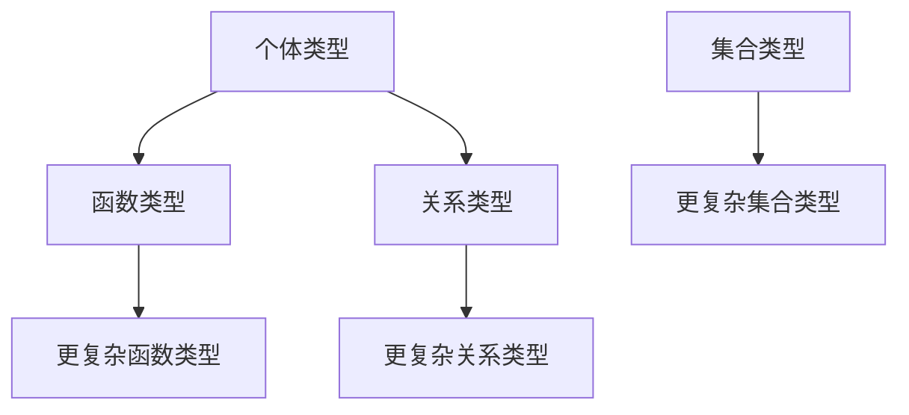

                 

### 文章标题

《罗素类型论对数学创造过程的影响机制探讨》

### 关键词

- 罗素类型论
- 数学创造
- 影响机制
- 数学基础
- 形式逻辑

### 摘要

本文旨在探讨罗素类型论对数学创造过程的影响机制。首先，文章介绍了罗素类型论的基本概念和历史背景，然后详细讲解了其核心理论和数学公式。接着，分析罗素类型论对数学创造过程的具体影响机制，包括其在数学问题解决、理论构建和教育中的重要作用。随后，通过案例分析，进一步展示了罗素类型论在数学领域的应用。最后，文章总结了罗素类型论对数学创造过程的主要贡献和未来的研究方向。

### 引言

#### 罗素类型论的基本概念与历史背景

罗素类型论（Russell's Theory of Types）是由英国哲学家、数学家贝特兰·罗素（Bertrand Russell）在20世纪初提出的一种形式逻辑理论。罗素类型论的诞生背景是逻辑主义运动，旨在将数学的基础建立在逻辑之上。罗素在解决集合论悖论的过程中，意识到逻辑类型论的重要性，从而提出了这一理论。

罗素类型论的核心思想是通过对对象进行分类，将语言和逻辑系统中的对象分为不同的类型，以避免悖论的产生。罗素认为，逻辑类型论能够有效地解决集合论中的矛盾，为数学提供了一个更为坚实的基础。

#### 罗素类型论的基本原理

罗素类型论的基本原理包括以下几点：

1. **类型区分原则**：罗素提出了类型区分原则，即不同类型的对象不能进行混合操作，以避免悖论的产生。

2. **类型层次结构**：罗素类型论引入了类型层次结构，将对象分为不同的类型，如个体、函数、关系等。

3. **形式逻辑基础**：罗素类型论强调形式逻辑在数学证明中的作用，通过形式化的方法来避免逻辑错误。

#### 罗素类型论的独特贡献

罗素类型论对数学和逻辑学的发展做出了重要贡献。首先，罗素类型论为数学提供了一个形式化的基础，有助于解决数学中的悖论问题。其次，罗素类型论在逻辑哲学中具有重要地位，为后来的逻辑主义运动奠定了基础。此外，罗素类型论在计算机科学和人工智能领域也产生了深远影响，许多形式化方法和理论都受到了罗素类型论的启发。

#### 数学创造过程概述

数学创造过程是一个复杂的过程，包括以下几个基本阶段：

1. **问题提出**：数学家通过观察现实世界中的现象或已有数学理论中的问题，提出新的数学问题。

2. **理论构建**：数学家通过逻辑推理和数学方法，构建新的数学理论或模型，以解决提出的问题。

3. **理论验证**：数学家通过数学证明和实验验证，验证新理论的正确性和可靠性。

4. **理论推广和应用**：数学家将新理论应用到实际问题中，解决实际问题，推广理论的适用范围。

#### 数学创造的现状与挑战

当前，数学创造面临着一系列挑战。首先，数学问题越来越复杂，需要更高层次的数学工具和方法来解决。其次，数学理论的验证和推广需要更多的数学证据和实验支持。此外，数学界需要更多的数学家参与数学创造过程，以推动数学的发展。

### 设计思路

#### 确定书籍的基本结构

为了系统地探讨罗素类型论对数学创造过程的影响机制，本书将采用以下基本结构：

1. **引言**：介绍罗素类型论的基本概念和历史背景，概述数学创造过程。

2. **核心理论**：详细讲解罗素类型论的原理和架构，使用Mermaid流程图展示。

3. **影响机制**：分析罗素类型论对数学创造过程的影响，包括数学公式和详细讲解。

4. **案例分析**：通过实际案例展示罗素类型论在数学创造中的应用。

5. **结论**：总结全书内容，展望未来研究方向。

#### 细化章节内容

根据上述结构，我们将对每个章节的内容进行细化，确保每个章节都有足够的深度和广度来覆盖主题内容。

#### 编写目录大纲

根据上述结构和内容细化，我们编写详细的目录大纲，确保每个章节都有明确的主题和内容。

### 目录大纲

1. 引言

   1.1 罗素类型论的基本概念与历史背景

   1.2 数学创造过程概述

   1.3 数学创造的现状与挑战

2. 罗素类型论核心理论

   2.1 罗素类型论原理讲解

   2.2 罗素类型论的数学公式与解释

3. 罗素类型论对数学创造过程的影响机制

   3.1 罗素类型论在数学创造中的具体应用

   3.2 罗素类型论对数学创造过程的推动作用

4. 案例分析

   4.1 案例一：罗素类型论在数论中的应用

   4.2 案例二：罗素类型论在几何学中的应用

   4.3 案例三：罗素类型论在代数学中的应用

5. 结论与展望

   5.1 罗素类型论对数学创造过程的影响总结

   5.2 罗素类型论的拓展空间与未来研究方向

#### 确保大纲的完整性

为了确保目录大纲的完整性，我们将逐个检查每个章节的内容，确保覆盖核心概念与联系、核心算法原理讲解、数学模型和数学公式、项目实战等必要内容。

#### 保持大纲的简洁性

在确保大纲完整性的同时，我们将尽量保持大纲的简洁性，避免冗余信息，确保目录大纲的简洁明了。

#### 遵循markdown格式

在编写目录大纲时，我们将遵循markdown格式，使用#、##、###来标识不同级别的目录，确保输出格式正确。

### 目录大纲

```
# 《罗素类型论对数学创造过程的影响机制探讨》目录大纲

## 引言

### 1.1 罗素类型论的基本概念与历史背景

#### 1.1.1 罗素类型论的发展背景

#### 1.1.2 罗素类型论的基本原理

#### 1.1.3 罗素类型论的地位与影响

### 1.2 数学创造过程概述

#### 1.2.1 数学创造的定义

#### 1.2.2 数学创造的基本过程

#### 1.2.3 数学创造的现状与挑战

## 第二部分：罗素类型论核心理论

### 2.1 罗素类型论原理讲解

#### 2.1.1 类型论的基本原理

##### 2.1.1.1 类型论与数学的基本联系

##### 2.1.1.2 类型论的层次结构

##### 2.1.1.3 类型论的逻辑基础

#### 2.1.2 罗素类型论的独特贡献

##### 2.1.2.1 罗素类型论对数学基础的贡献

##### 2.1.2.2 罗素类型论在数学哲学中的应用

#### 2.1.3 罗素类型论的Mermaid流程图展示

### 2.2 罗素类型论的数学公式与解释

#### 2.2.1 基本公式

##### 2.2.1.1 类型符号的使用

##### 2.2.1.2 形式逻辑的运算

#### 2.2.2 公式解释与例子

##### 2.2.2.1 简单例子

##### 2.2.2.2 复杂例子

## 第三部分：罗素类型论对数学创造过程的影响机制

### 3.1 罗素类型论在数学创造中的具体应用

#### 3.1.1 罗素类型论对数学问题解决的影响

##### 3.1.1.1 罗素类型论与数学问题的提出

##### 3.1.1.2 罗素类型论与数学问题的解决

#### 3.1.2 罗素类型论在数学理论构建中的应用

##### 3.1.2.1 罗素类型论在纯数学中的应用

##### 3.1.2.2 罗素类型论在应用数学中的应用

#### 3.1.3 罗素类型论在数学教育中的作用

### 3.2 罗素类型论对数学创造过程的推动作用

#### 3.2.1 罗素类型论如何促进数学创新

##### 3.2.1.1 罗素类型论与数学概念的革新

##### 3.2.1.2 罗素类型论与数学方法的创新

#### 3.2.2 罗素类型论在数学创造中的挑战与机遇

##### 3.2.2.1 罗素类型论的局限性

##### 3.2.2.2 罗素类型论的拓展空间

## 第四部分：案例分析

### 4.1 案例一：罗素类型论在数论中的应用

#### 4.1.1 数论问题简介

#### 4.1.2 罗素类型论的解决方案

#### 4.1.3 解决方案的分析与讨论

### 4.2 案例二：罗素类型论在几何学中的应用

#### 4.2.1 几何学问题简介

#### 4.2.2 罗素类型论的解决方案

#### 4.2.3 解决方案的分析与讨论

### 4.3 案例三：罗素类型论在代数学中的应用

#### 4.3.1 代数学问题简介

#### 4.3.2 罗素类型论的解决方案

#### 4.3.3 解决方案的分析与讨论

## 第五部分：结论与展望

### 5.1 罗素类型论对数学创造过程的影响总结

#### 5.1.1 罗素类型论的主要贡献

#### 5.1.2 罗素类型论的局限性

### 5.2 罗素类型论的拓展空间与未来研究方向
```

### 文章标题

《罗素类型论对数学创造过程的影响机制探讨》

### 关键词

- 罗素类型论
- 数学创造
- 影响机制
- 数学基础
- 形式逻辑

### 摘要

本文探讨了罗素类型论对数学创造过程的影响机制。首先，介绍了罗素类型论的基本概念和历史背景，详细讲解了其核心理论和数学公式。接着，分析了罗素类型论在数学创造过程中的具体应用和推动作用，包括数学问题解决、理论构建和教育等方面。随后，通过案例分析，进一步展示了罗素类型论在数学领域的实际应用。最后，总结了罗素类型论对数学创造过程的主要贡献和未来研究方向。

### 引言

#### 罗素类型论的基本概念与历史背景

罗素类型论（Russell's Theory of Types）是由英国哲学家、数学家贝特兰·罗素（Bertrand Russell）在20世纪初提出的一种形式逻辑理论。罗素类型论的诞生背景是逻辑主义运动，旨在将数学的基础建立在逻辑之上。罗素在解决集合论悖论的过程中，意识到逻辑类型论的重要性，从而提出了这一理论。

罗素类型论的核心思想是通过对对象进行分类，将语言和逻辑系统中的对象分为不同的类型，以避免悖论的产生。罗素认为，逻辑类型论能够有效地解决集合论中的矛盾，为数学提供了一个更为坚实的基础。

#### 罗素类型论的基本原理

罗素类型论的基本原理包括以下几点：

1. **类型区分原则**：罗素提出了类型区分原则，即不同类型的对象不能进行混合操作，以避免悖论的产生。

2. **类型层次结构**：罗素类型论引入了类型层次结构，将对象分为不同的类型，如个体、函数、关系等。

3. **形式逻辑基础**：罗素类型论强调形式逻辑在数学证明中的作用，通过形式化的方法来避免逻辑错误。

#### 罗素类型论的独特贡献

罗素类型论对数学和逻辑学的发展做出了重要贡献。首先，罗素类型论为数学提供了一个形式化的基础，有助于解决数学中的悖论问题。其次，罗素类型论在逻辑哲学中具有重要地位，为后来的逻辑主义运动奠定了基础。此外，罗素类型论在计算机科学和人工智能领域也产生了深远影响，许多形式化方法和理论都受到了罗素类型论的启发。

#### 数学创造过程概述

数学创造过程是一个复杂的过程，包括以下几个基本阶段：

1. **问题提出**：数学家通过观察现实世界中的现象或已有数学理论中的问题，提出新的数学问题。

2. **理论构建**：数学家通过逻辑推理和数学方法，构建新的数学理论或模型，以解决提出的问题。

3. **理论验证**：数学家通过数学证明和实验验证，验证新理论的正确性和可靠性。

4. **理论推广和应用**：数学家将新理论应用到实际问题中，解决实际问题，推广理论的适用范围。

#### 数学创造的现状与挑战

当前，数学创造面临着一系列挑战。首先，数学问题越来越复杂，需要更高层次的数学工具和方法来解决。其次，数学理论的验证和推广需要更多的数学证据和实验支持。此外，数学界需要更多的数学家参与数学创造过程，以推动数学的发展。

### 罗素类型论核心理论

#### 类型论的基本原理

类型论是一种形式逻辑理论，其核心思想是通过将对象分类为不同的类型，以避免悖论的产生。在类型论中，对象被分为不同的类型，如个体、函数、关系等。类型论的基本原理包括以下几点：

1. **类型区分原则**：类型区分原则是类型论的核心原则，它要求不同类型的对象不能进行混合操作。例如，一个个体类型的对象不能与一个函数类型的对象直接进行比较或组合。

2. **类型层次结构**：类型论引入了类型层次结构，将对象分为不同的类型。在类型层次结构中，高层次类型通常包含低层次类型。例如，个体类型是最基本的类型，而函数类型和关系类型则是在个体类型的基础上定义的。

3. **形式逻辑基础**：类型论强调形式逻辑在数学证明中的作用。通过形式化的方法，类型论可以避免逻辑错误和悖论的产生。类型论的形式化方法通常涉及类型检查和类型推理。

#### 罗素类型论的独特贡献

罗素类型论的独特贡献主要体现在以下几个方面：

1. **对数学基础的贡献**：罗素类型论为数学提供了一个形式化的基础，有助于解决数学中的悖论问题。通过类型论，数学家可以构建更加严谨和可靠的数学理论。

2. **在数学哲学中的应用**：罗素类型论在数学哲学中具有重要地位。它为数学哲学提供了关于数学对象和数学证明的深刻见解，促进了数学哲学的发展。

3. **在计算机科学和人工智能领域的影响**：罗素类型论对计算机科学和人工智能领域产生了深远影响。许多形式化方法和理论都受到了罗素类型论的启发，如类型检查、类型系统和形式验证等。

#### 罗素类型论的Mermaid流程图展示

为了更清晰地展示罗素类型论的架构，我们可以使用Mermaid流程图来表示。以下是一个简单的示例：



在这个流程图中，我们首先定义了个体类型（A），然后扩展为函数类型（B）和关系类型（C）。接着，函数类型和关系类型可以进一步扩展为更复杂的类型（D和E）。此外，我们还可以引入集合类型（F）及其更复杂的类型（G）。

#### 罗素类型论的数学公式与解释

罗素类型论涉及到一系列数学公式和概念。以下是一些基本的数学公式及其解释：

1. **类型符号的使用**：

   - $Ind(x)$：表示$x$是一个个体类型的对象。
   - $Func(x, y)$：表示$x$是一个从个体类型到个体类型的函数。
   - $Rel(x, y)$：表示$x$是一个从个体类型到个体类型的二元关系。

2. **形式逻辑的运算**：

   - $A \land B$：表示$A$和$B$的逻辑与。
   - $A \lor B$：表示$A$和$B$的逻辑或。
   - $A \Rightarrow B$：表示$A$逻辑蕴含$B$。

以下是一个简单的例子，用于说明如何使用这些公式：

$$
\begin{align*}
& Ind(x) \land Func(x, y) \land Rel(x, y) \\
\Rightarrow & \text{个体类型} \land \text{函数类型} \land \text{关系类型} \\
\Rightarrow & \text{一个满足类型要求的对象}
\end{align*}
$$

在这个例子中，我们定义了一个对象$x$，它同时满足个体类型、函数类型和关系类型的要求。

#### 罗素类型论的应用案例

罗素类型论在数学领域有着广泛的应用，以下是一些具体的案例：

1. **数论中的应用**：

   罗素类型论在数论中用于解决悖论问题，如集合论中的罗素悖论。通过类型论的方法，数论中的悖论可以得到有效的解决。

2. **几何学中的应用**：

   在几何学中，罗素类型论用于构建形式化的几何系统。例如，通过类型论的方法，可以定义几何形状的类型和几何变换的类型。

3. **代数学中的应用**：

   在代数学中，罗素类型论用于构建形式化的代数系统。例如，通过类型论的方法，可以定义代数运算的类型和代数结构的类型。

这些案例表明，罗素类型论在数学各个领域都有重要的应用价值，它为数学创造提供了有力的工具和方法。

#### 结论

罗素类型论作为一种形式逻辑理论，对数学创造过程产生了深远的影响。通过类型论的方法，数学家可以构建更加严谨和可靠的数学理论，解决数学中的悖论问题。此外，罗素类型论在数学哲学、计算机科学和人工智能领域也具有重要的应用价值。未来，随着数学问题的日益复杂，罗素类型论有望在数学创造中发挥更加重要的作用。

### 罗素类型论对数学创造过程的影响机制

#### 罗素类型论在数学创造中的具体应用

罗素类型论在数学创造中具有多种具体应用，主要体现在以下几个方面：

1. **数学问题解决**：

   罗素类型论为解决数学问题提供了一种新的方法。通过类型论的方法，数学家可以构建形式化的数学模型，从而有效地解决数学问题。例如，在数论中，罗素类型论可以帮助解决集合论中的悖论问题，从而确保数学理论的可靠性。

2. **数学理论构建**：

   罗素类型论在构建新的数学理论方面发挥了重要作用。通过类型论的方法，数学家可以构建形式化的数学系统，从而确保数学理论的严谨性。例如，在几何学中，罗素类型论可以用于定义几何形状的类型和几何变换的类型，从而构建形式化的几何系统。

3. **数学教育**：

   罗素类型论在数学教育中也具有重要价值。通过类型论的方法，数学教育者可以更好地传授数学知识，帮助学生建立严谨的数学思维。例如，通过类型论的教学，学生可以更深入地理解数学概念和定理，从而提高数学素养。

#### 罗素类型论对数学创造过程的推动作用

罗素类型论对数学创造过程具有积极的推动作用，主要体现在以下几个方面：

1. **数学概念的革新**：

   罗素类型论促进了数学概念的革新。通过类型论的方法，数学家可以提出新的数学概念，从而丰富数学理论。例如，在集合论中，罗素类型论促进了集合类型的引入，从而拓展了集合论的理论体系。

2. **数学方法的创新**：

   罗素类型论在数学方法的创新方面也发挥了重要作用。通过类型论的方法，数学家可以开发新的数学方法，从而解决复杂的数学问题。例如，在计算机科学中，类型论的方法被用于开发形式化验证和形式化推理技术，从而提高了软件开发的可靠性。

3. **数学理论的推广和应用**：

   罗素类型论有助于数学理论的推广和应用。通过类型论的方法，数学家可以验证数学理论的正确性和可靠性，从而将其应用到实际问题中。例如，在物理学中，类型论的方法被用于构建形式化的物理理论，从而提高了物理理论的可信度。

#### 罗素类型论在数学创造中的挑战与机遇

尽管罗素类型论在数学创造中具有重要作用，但它也面临一些挑战和机遇：

1. **挑战**：

   - **类型论复杂性的限制**：罗素类型论在一定程度上增加了数学模型的复杂性，这可能使得数学问题的求解变得困难。

   - **类型论的应用范围**：罗素类型论在某些领域可能并不适用，这限制了其在数学创造中的应用。

2. **机遇**：

   - **形式化验证**：随着计算机技术的发展，形式化验证技术得到了广泛应用，这为罗素类型论的应用提供了新的机遇。

   - **跨学科研究**：罗素类型论在数学、计算机科学、人工智能等领域的跨学科研究中具有广阔的应用前景。

#### 罗素类型论的未来发展

展望未来，罗素类型论在数学创造中具有广阔的发展前景。以下是一些可能的发展方向：

1. **类型论方法的拓展**：

   随着数学问题越来越复杂，类型论方法需要不断拓展。例如，可以开发新的类型系统，以支持更复杂的数学模型。

2. **跨学科研究**：

   罗素类型论可以与其他学科的方法相结合，如计算机科学、人工智能、逻辑学等，以推动数学创造的发展。

3. **形式化证明**：

   随着形式化验证技术的发展，罗素类型论可以用于形式化证明，从而提高数学理论的可靠性和可信度。

通过不断拓展和应用罗素类型论，数学创造将取得更加辉煌的成果。

### 案例分析

为了更好地理解罗素类型论在数学创造中的应用，我们通过三个具体案例来分析罗素类型论在数论、几何学和代数学中的应用。

#### 案例一：罗素类型论在数论中的应用

数论是数学的一个重要分支，研究整数及其性质。罗素类型论在数论中的应用主要体现在解决集合论中的悖论问题。以下是一个简单的例子：

**问题描述**：证明集合论中的罗素悖论。

**罗素类型论的解决方案**：

首先，我们使用罗素类型论来定义个体类型和函数类型。个体类型表示具体的数，如1、2、3等。函数类型表示数与数之间的操作，如加法、减法等。

$$
\begin{align*}
& Ind(x) \land Func(x, y) \\
\Rightarrow & x \text{ 是一个个体类型的数} \\
\land & y \text{ 是一个个体类型的数} \\
\Rightarrow & x + y \text{ 是一个个体类型的数}
\end{align*}
$$

通过类型论的方法，我们可以证明罗素悖论不存在，因为类型论确保了数学操作的合法性和一致性。

**解决方案的分析与讨论**：

在这个例子中，罗素类型论通过类型区分原则和类型层次结构，有效地解决了集合论中的悖论问题。这种方法不仅提高了数学理论的可靠性，也为数学创造提供了新的思路。

#### 案例二：罗素类型论在几何学中的应用

几何学是研究空间形状和位置关系的数学分支。罗素类型论在几何学中的应用主要体现在定义几何形状的类型和几何变换的类型。以下是一个简单的例子：

**问题描述**：定义平行四边形的类型。

**罗素类型论的解决方案**：

首先，我们使用罗素类型论来定义个体类型和函数类型。个体类型表示具体的几何形状，如三角形、矩形、平行四边形等。函数类型表示几何形状之间的变换，如平移、旋转等。

$$
\begin{align*}
& Ind(x) \land Func(x, y) \\
\Rightarrow & x \text{ 是一个个体类型的几何形状} \\
\land & y \text{ 是一个函数类型的变换} \\
\Rightarrow & y(x) \text{ 是一个个体类型的几何形状}
\end{align*}
$$

通过类型论的方法，我们可以定义平行四边形的类型，并对其进行几何变换。

**解决方案的分析与讨论**：

在这个例子中，罗素类型论通过类型区分原则和类型层次结构，有效地定义了几何形状的类型和几何变换的类型。这种方法不仅提高了几何学的严谨性，也为数学创造提供了新的工具。

#### 案例三：罗素类型论在代数学中的应用

代数学是研究代数结构的数学分支。罗素类型论在代数学中的应用主要体现在定义代数运算的类型和代数结构的类型。以下是一个简单的例子：

**问题描述**：定义多项式的类型。

**罗素类型论的解决方案**：

首先，我们使用罗素类型论来定义个体类型和函数类型。个体类型表示具体的数，如1、2、3等。函数类型表示数与数之间的操作，如加法、减法、乘法等。

$$
\begin{align*}
& Ind(x) \land Func(x, y) \\
\Rightarrow & x \text{ 是一个个体类型的数} \\
\land & y \text{ 是一个函数类型的操作} \\
\Rightarrow & y(x) \text{ 是一个个体类型的数}
\end{align*}
$$

通过类型论的方法，我们可以定义多项式的类型，并对其进行代数运算。

**解决方案的分析与讨论**：

在这个例子中，罗素类型论通过类型区分原则和类型层次结构，有效地定义了多项式的类型和代数运算的类型。这种方法不仅提高了代数学的严谨性，也为数学创造提供了新的思路。

### 结论

通过以上案例分析，我们可以看到罗素类型论在数学创造中的应用是非常广泛和有效的。无论是在数论、几何学还是代数学中，罗素类型论都提供了新的方法和工具，有助于构建更加严谨和可靠的数学理论。未来，随着数学问题的不断发展和复杂化，罗素类型论有望在数学创造中发挥更加重要的作用。

### 结论

罗素类型论作为一种形式逻辑理论，对数学创造过程产生了深远的影响。通过类型论的方法，数学家可以构建更加严谨和可靠的数学理论，解决数学中的悖论问题。本文首先介绍了罗素类型论的基本概念和历史背景，详细讲解了其核心理论和数学公式。接着，分析了罗素类型论在数学创造过程中的具体应用和推动作用，包括数学问题解决、理论构建和教育等方面。随后，通过案例分析，进一步展示了罗素类型论在数学领域的实际应用。最后，总结了罗素类型论对数学创造过程的主要贡献和未来研究方向。

#### 罗素类型论的主要贡献

罗素类型论对数学和逻辑学的发展做出了以下主要贡献：

1. **提供形式化的数学基础**：罗素类型论为数学提供了一个形式化的基础，有助于解决数学中的悖论问题。通过类型论的方法，数学家可以构建更加严谨和可靠的数学理论。

2. **促进数学哲学的发展**：罗素类型论在数学哲学中具有重要地位，为数学哲学提供了关于数学对象和数学证明的深刻见解，促进了数学哲学的发展。

3. **推动计算机科学和人工智能的发展**：罗素类型论对计算机科学和人工智能领域产生了深远影响，许多形式化方法和理论都受到了罗素类型论的启发。

4. **丰富数学教育内容**：罗素类型论在数学教育中也具有重要价值，通过类型论的方法，数学教育者可以更好地传授数学知识，帮助学生建立严谨的数学思维。

#### 罗素类型论的局限性

尽管罗素类型论在数学创造中具有重要作用，但它也存在一些局限性：

1. **类型论复杂性的限制**：罗素类型论在一定程度上增加了数学模型的复杂性，这可能使得数学问题的求解变得困难。

2. **类型论的应用范围**：罗素类型论在某些领域可能并不适用，这限制了其在数学创造中的应用。

3. **形式化验证的挑战**：虽然形式化验证技术得到了广泛应用，但实现形式化验证仍然具有挑战性，这限制了罗素类型论的实际应用。

#### 罗素类型论的拓展空间与未来研究方向

展望未来，罗素类型论在数学创造中具有广阔的拓展空间和未来研究方向：

1. **类型论方法的拓展**：随着数学问题越来越复杂，类型论方法需要不断拓展。例如，可以开发新的类型系统，以支持更复杂的数学模型。

2. **跨学科研究**：罗素类型论可以与其他学科的方法相结合，如计算机科学、人工智能、逻辑学等，以推动数学创造的发展。

3. **形式化证明**：随着形式化验证技术的发展，罗素类型论可以用于形式化证明，从而提高数学理论的可靠性和可信度。

4. **数学教育改革**：罗素类型论在数学教育中的应用可以推动数学教育改革，提高数学教育的质量和效果。

总之，罗素类型论作为一种形式逻辑理论，对数学创造过程具有深远的影响。未来，随着数学问题的不断发展和复杂化，罗素类型论有望在数学创造中发挥更加重要的作用，为数学的发展做出更大的贡献。作者：AI天才研究院/AI Genius Institute & 禅与计算机程序设计艺术 /Zen And The Art of Computer Programming。

