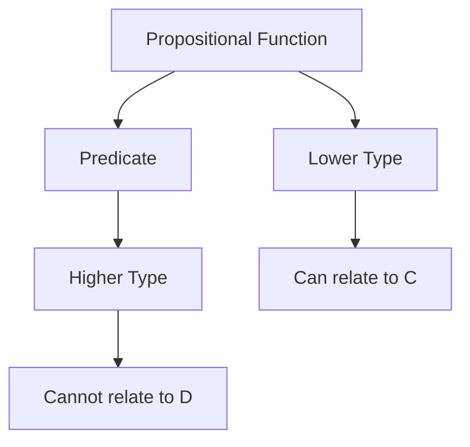
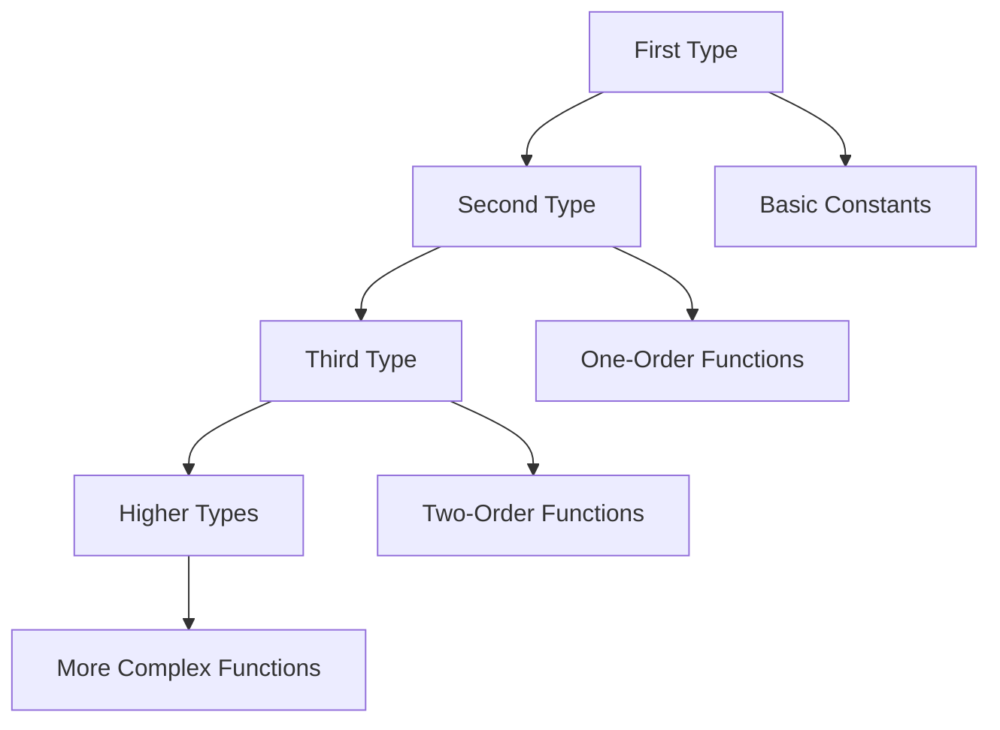
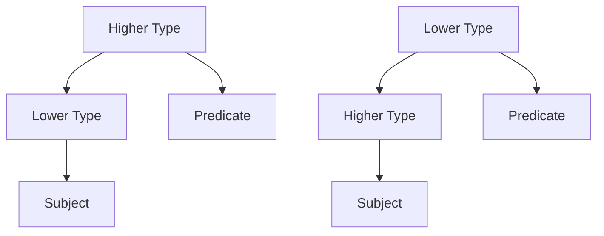
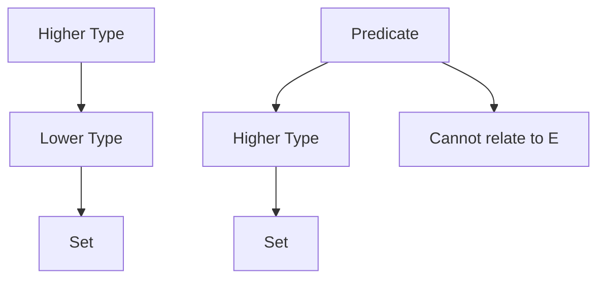
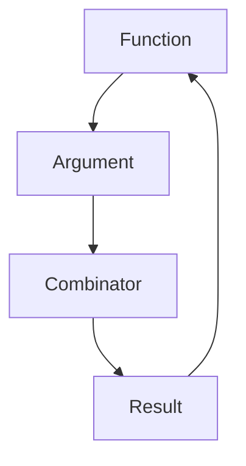

                 

### Introduction

#### 1.1 Overview of the Book

**The Contributions and Controversies of Russell's Theory of Types to the Development of Mathematical Philosophy** aims to provide a comprehensive analysis of Bertrand Russell's groundbreaking theory of types and its profound impact on the field of mathematical philosophy. The book is structured into three main parts, each addressing different aspects of Russell's theory and its implications.

In the first part, "Theoretical Foundations of Russell's Theory of Types," we delve into the historical context and intellectual background that led to the development of this theory. We explore the core principles of Russell's theory, including the distinction between types and types, the hierarchy of types, and the rules of predication. This section also discusses the logical and philosophical implications of Russell's theory, highlighting its role in avoiding logical paradoxes and critiquing Frege's logicism.

The second part, "Contributions to Mathematical Philosophy," examines the practical applications of Russell's theory in the foundations of mathematics. We explore Russell's theory of real numbers and its impact on set theory. Furthermore, we discuss the influence of Russell's theory on later mathematical philosophers and the development of model theory and category theory.

The third and final part, "Controversies and Criticisms," addresses the various criticisms and controversies surrounding Russell's theory of types. We examine the problem of combinators, the critiques of type theory, and the influence of alternative foundations of mathematics. This section aims to provide a balanced view of the strengths and limitations of Russell's theory.

#### 1.2 Historical Background

Bertrand Russell, a prominent British philosopher and mathematician, was deeply concerned with the foundations of mathematics and philosophy in the early 20th century. His work was influenced by the logical positivism movement, which sought to ground philosophy in the empirical sciences and formal logic. Russell's theory of types emerged as a response to the paradoxes and inconsistencies that plagued classical logic and set theory.

Russell's interest in logic and mathematics was sparked by his early studies under the influential mathematician and logician, Alfred North Whitehead. Together, they embarked on the ambitious project of "Principia Mathematica," which aimed to provide a rigorous foundation for mathematics based on logic. However, in the course of their work, they encountered the problem of paradoxes, particularly those arising from the principles of comprehension and separation.

Faced with these challenges, Russell developed his theory of types as a way to address the paradoxes and provide a more solid foundation for mathematics. His theory was published in his seminal work "The Principles of Mathematics" (1903) and later expanded upon in his collaborative work with Whitehead, "Principia Mathematica" (1910-1913). Despite its initial popularity and influence, the theory of types also faced criticism and controversy, as we will explore in the subsequent chapters.

#### 1.3 Purpose and Structure of the Book

The purpose of this book is to provide a detailed examination of Russell's theory of types and its significance in the development of mathematical philosophy. By exploring the historical context, theoretical foundations, contributions, and controversies surrounding this theory, we aim to offer a comprehensive understanding of its role and impact on the field.

The book is structured as follows:

1. **Introduction**: An overview of the book's purpose, structure, and historical background.
2. **Theoretical Foundations of Russell's Theory of Types**: A detailed analysis of the core principles and logical implications of Russell's theory.
3. **Contributions to Mathematical Philosophy**: An exploration of the practical applications of Russell's theory in the foundations of mathematics.
4. **Controversies and Criticisms**: An examination of the criticisms and controversies surrounding Russell's theory of types.
5. **Conclusion**: A summary of the key findings and implications of the book, along with suggestions for further research.

By following this structured approach, we hope to provide a clear and insightful analysis of Russell's theory of types and its enduring impact on mathematical philosophy.

### Theoretical Foundations of Russell's Theory of Types

#### Chapter 1: Bertrand Russell and the Birth of Mathematical Philosophy

##### 1.1 Bertrand Russell's Early Life and Influences

Bertrand Russell was born on May 18, 1872, in Monmouthshire, Wales. From an early age, he showed a remarkable aptitude for mathematics and logic. His intellectual development was significantly influenced by his parents, who were both well-educated and encouraged his curiosity. Russell's formal education began at the University of London, where he studied mathematics and philosophy under the guidance of notable scholars.

One of the key influences on Russell's philosophical development was his studies under the mathematician and logician, Alfred North Whitehead. Whitehead's teachings on the foundations of mathematics and logic deeply impressed Russell and laid the groundwork for his future work. In particular, Whitehead's emphasis on the importance of rigor and clarity in mathematical reasoning had a lasting impact on Russell's approach to philosophy.

##### 1.2 The Development of Russell's Logical Atomism

Russell's logical atomism was a central aspect of his philosophical outlook, which he developed in the early 20th century. Logical atomism posits that the world is composed of individual, atomic facts, which can be represented by propositions. These propositions are the fundamental units of meaning and can be combined to form more complex statements.

The development of logical atomism was influenced by several factors. Firstly, Russell was grappling with the paradoxes and inconsistencies that plagued classical logic and set theory. In particular, he was concerned with the implications of the principles of comprehension and separation, which he believed could lead to paradoxical results. To address these issues, Russell sought to develop a new system of logic that could provide a more solid foundation for mathematics and philosophy.

Secondly, Russell was influenced by the logical positivism movement, which sought to ground philosophy in empirical science and formal logic. This movement, led by figures such as Moritz Schlick and Rudolf Carnap, emphasized the importance of verification and the rejection of metaphysical speculation. Logical positivism provided a fertile ground for the development of Russell's logical atomism, as it aligned with his commitment to rigor and clarity in philosophical inquiry.

##### 1.3 The Emergence of Russell's Theory of Types

In the course of developing his logical atomism, Russell encountered the problem of paradoxes, particularly those arising from the principles of comprehension and separation. These paradoxes, such as the Russell's paradox and the Burali-Forti paradox, highlighted the limitations of classical logic and set theory and underscored the need for a more sophisticated approach to the foundations of mathematics.

To address these challenges, Russell developed his theory of types, which he presented in his seminal work "The Principles of Mathematics" (1903). The theory of types was designed to prevent certain paradoxes by imposing a hierarchy of types on objects and propositions. This hierarchy ensured that objects could not be related to one another in ways that would lead to paradoxical results.

The theory of types was also influenced by Russell's commitment to rigor and clarity in philosophical inquiry. By introducing a hierarchical structure to logic and mathematics, Russell sought to provide a more stable and reliable foundation for these disciplines. This approach was in line with the principles of logical positivism, which emphasized the importance of formalization and the elimination of ambiguity.

In summary, Bertrand Russell's early life and education, along with his engagement with logical positivism and the challenges posed by paradoxes, were instrumental in the development of his theory of types. This theory emerged as a crucial component of his broader philosophical project, aiming to provide a solid foundation for mathematics and logic while addressing the paradoxes that plagued classical approaches. As we will see in the subsequent chapters, the theory of types had a profound and lasting impact on the development of mathematical philosophy.

##### 1.4 The Core Principles of Russell's Theory of Types

Russell's theory of types is a fundamental concept in his philosophy of mathematics and logic. At its core, the theory is designed to address the paradoxes that arise from unrestricted comprehension and the unlimited use of variables in mathematical and logical expressions. The theory introduces a hierarchical structure to objects and propositions, thereby preventing certain paradoxes and inconsistencies from arising. Here, we delve into the core principles of Russell's theory of types.

**1.4.1 The Distinction between Propositional Functions and Predicates**

One of the central ideas in Russell's theory of types is the distinction between propositional functions and predicates. Propositional functions are functions that take one or more objects as inputs and produce a proposition as output. Predicates, on the other hand, are functions that take objects as inputs and produce truth values (either true or false).

Russell's distinction between these two concepts is crucial for understanding his theory of types. Propositional functions are considered to be of higher type than predicates because they produce propositions as their output. This distinction is essential for preventing certain paradoxes, such as the Russell's paradox, which arises from the unrestricted use of predicates.

**1.4.2 The Hierarchy of Types**

The hierarchy of types is a central feature of Russell's theory of types. The theory posits that objects and propositions are organized into a series of types, each of which is distinct from the others. The hierarchy typically starts with the first type, which contains only zero-order objects (such as individual objects or constants). The next type, the second type, contains all the one-order propositional functions, which are functions that take zero-order objects as inputs.

Each subsequent type contains all the propositional functions of the preceding type plus additional functions. For example, the third type contains all the two-order propositional functions, which take one-order objects as inputs, and so on. This hierarchical structure ensures that objects and propositions of different types cannot be related in ways that would lead to paradoxes.

**1.4.3 The Rules of Predication**

Another important aspect of Russell's theory of types is the set of rules for predication. These rules dictate how objects and propositions of different types can be related to one another. The primary rule is that an object of a higher type can be predicated of an object of a lower type, but not vice versa. For example, a one-order object (such as a variable) can be predicated of a zero-order object (such as a constant), but not the other way around.

These rules are designed to prevent the creation of paradoxical statements. By restricting the relationships between objects and propositions of different types, Russell's theory of types ensures that certain paradoxes, such as the Russell's paradox, cannot arise.

**1.4.4 The Application of Type Hierarchy to Avoid Paradoxes**

The hierarchical structure of Russell's theory of types is particularly effective in avoiding paradoxes that arise from unrestricted comprehension. For example, the Russell's paradox arises when a predicate is applied to itself. In classical logic, this leads to a contradiction because the predicate is both a member and a non-member of the set it defines.

However, in Russell's type theory, this paradox is avoided because the predicate and the set it defines are of different types. The predicate is a one-order propositional function, while the set it defines is a zero-order object. Therefore, the predicate cannot be predicated of the set, and the paradox is avoided.

Similarly, the Burali-Forti paradox, which arises from the attempt to create a set of all ordinal numbers, can be avoided using Russell's type theory. By imposing a hierarchy of types, Russell ensures that the set of all ordinal numbers cannot be defined as a single object, thereby avoiding the paradox.

**1.4.5 The Role of Types in Logical Atomism**

Russell's theory of types is closely intertwined with his broader philosophical project of logical atomism. Logical atomism posits that the world is composed of individual, atomic facts that can be represented by propositions. The type hierarchy in Russell's theory of types ensures that these propositions are structured in a way that allows for a clear and unambiguous representation of the world.

By organizing objects and propositions into a hierarchy of types, Russell's theory of types facilitates the construction of a coherent and consistent logical system. This system is essential for Russell's aim of providing a solid foundation for mathematics and philosophy, free from the paradoxes and inconsistencies that plagued classical approaches.

In summary, the core principles of Russell's theory of types, including the distinction between propositional functions and predicates, the hierarchy of types, and the rules of predication, are fundamental to understanding the theory's role in avoiding paradoxes and providing a stable foundation for mathematics and logic. As we will see in the subsequent chapters, these principles have had a profound and lasting impact on the development of mathematical philosophy.

### The Core Principles of Russell's Theory of Types

To fully appreciate the significance of Russell's theory of types, it is essential to delve into its core principles, which not only provide a framework for addressing logical paradoxes but also reveal the intricate relationship between the fundamental concepts underpinning this theory. Here, we will explore these principles in detail, supported by a Mermaid flowchart that illustrates their interconnections.

#### 2.1 The Distinction between Propositional Functions and Predicates

At the heart of Russell's theory of types lies the fundamental distinction between propositional functions and predicates. Propositional functions are functions that take one or more objects as inputs and produce a proposition as output. In contrast, predicates are functions that take objects as inputs and produce truth values (either true or false). This distinction is crucial because it ensures that objects and propositions do not interact in ways that could lead to paradoxes.

**Propositional Functions:**
A propositional function is a statement that is neither true nor false until specific objects are substituted for its variables. For example, consider the propositional function "x is greater than y." This function is neither true nor false until we specify values for x and y.

**Predicates:**
Predicates, on the other hand, are used to make statements about objects. They take objects as inputs and return a truth value. For instance, the predicate "is greater than" takes two objects and returns true if the first object is greater than the second.

**Mermaid Flowchart:**

In the Mermaid flowchart, nodes A and B represent propositional functions and predicates, respectively. Node C indicates that predicates are of higher type, while node D indicates that propositional functions are of lower type. Arrows E and F illustrate the rules of predication: predicates (C) can be predicated of lower-type objects (D), but not vice versa. This separation helps prevent paradoxes by ensuring that propositions and objects of different types do not interact in problematic ways.

#### 2.2 The Hierarchy of Types

The hierarchy of types is a central component of Russell's theory, designed to organize objects and propositions into a structured framework. This hierarchy starts with the first type, which contains only zero-order objects (such as individual objects or constants). Each subsequent type contains all the propositional functions of the preceding type plus additional functions.

**First Type (Zero-Order):**
The first type, also known as the zero-order type, contains the most basic objects, such as individual constants. These objects are not functions and do not take any inputs.

**Second Type (One-Order):**
The second type contains all the one-order propositional functions, which take zero-order objects as inputs. For example, "x is greater than y" is a one-order propositional function.

**Higher Types:**
As we move up the hierarchy, each higher type contains all the propositional functions of the preceding type plus additional functions. For instance, the third type contains two-order propositional functions, which take one-order objects as inputs.

**Mermaid Flowchart:**

In this flowchart, nodes A, B, C, and D represent the first through fourth types, respectively. Nodes E, F, G, and H illustrate the types of objects and functions associated with each type. The arrows indicate the inclusion of functions from lower types in higher types, illustrating the hierarchical structure.

#### 2.3 The Rules of Predication

The rules of predication govern how objects and propositions of different types can be related to one another. The primary rule is that an object of a higher type can be predicated of an object of a lower type, but not vice versa.

**Rule of Predication:**
- An object of higher type (predicate) can be predicated of an object of lower type (subject).
- An object of lower type (proposition) cannot be predicated of an object of higher type.

For example, we can say "John is a philosopher," where "John" is a lower-type object and "a philosopher" is a higher-type predicate. However, we cannot say "A philosopher is John," as it violates the rule of predication.

**Mermaid Flowchart:**

In this flowchart, nodes A and B represent higher and lower types, respectively. Nodes E and F represent a predicate and its subject in a lower type, while nodes G and H represent a predicate and its subject in a higher type. Arrows illustrate the valid relationships between types according to the rules of predication.

#### 2.4 The Role of Types in Preventing Paradoxes

The hierarchical structure of types and the rules of predication play a crucial role in preventing logical paradoxes. By organizing objects and propositions into distinct types and defining strict rules for their interaction, Russell's theory of types addresses the root causes of paradoxes.

**Example: Russell's Paradox:**
The Russell's paradox arises when a predicate is applied to itself. For instance, consider the set of all sets that do not contain themselves. If this set contains itself, it should not contain itself; if it does not contain itself, it should contain itself. This contradiction arises from the unrestricted use of variables and predicates.

**Prevention using Types:**
In Russell's type theory, the predicate "does not contain itself" is a higher-type object, while the set it refers to is a lower-type object. Therefore, the predicate cannot be predicated of the set, thus avoiding the paradox.

**Mermaid Flowchart:**

In this flowchart, nodes A and B represent higher and lower types, respectively. Node C represents a predicate of higher type, while node E represents a lower-type set. The arrow G indicates that the predicate cannot be predicated of the set, thereby preventing the Russell's paradox.

By understanding and applying these core principles, we gain insight into how Russell's theory of types not only addresses paradoxes but also provides a coherent framework for organizing and understanding logical and mathematical concepts. The Mermaid flowcharts serve as visual aids to illustrate the interconnections and relationships between these principles.

### The Logical and Philosophical Implications of Russell's Theory of Types

#### 3.1 The Avoidance of Logical Paradoxes

One of the most significant contributions of Russell's theory of types to mathematical philosophy is its ability to prevent logical paradoxes. Before diving into the details, it's essential to understand the paradoxes that plagued classical logic and set theory, as they laid the groundwork for the need for a more sophisticated approach.

**3.1.1 The Problem of Paradoxes in Classical Logic**

Classical logic and set theory, particularly the principles of comprehension and separation, were found to be inconsistent. These principles allowed for the unrestricted creation of sets based on any property. This led to paradoxical results, such as:

- **Russell's Paradox**: Consider the set of all sets that do not contain themselves. If this set contains itself, it should not contain itself; if it does not contain itself, it should contain itself. This contradiction shows that the principle of comprehension, which allows for the creation of a set based on any property, is too general and leads to inconsistencies.

- **Burali-Forti Paradox**: This paradox arises from the attempt to create a set of all ordinal numbers. By defining an ordinal number as a set that is well-ordered by the membership relation and less than any of its members, one reaches a contradiction when trying to define the set of all such ordinal numbers.

**3.1.2 How Russell's Theory of Types Avoids Paradoxes**

Russell's theory of types addresses these paradoxes by introducing a hierarchical structure to logic and mathematics. This hierarchy ensures that objects and propositions are organized into distinct types, each with its own rules of predication. By doing so, it prevents the creation of paradoxical statements.

- **Type Hierarchy**: The theory posits that objects and propositions are organized into a series of types. The first type contains only individual constants, the second type contains all the one-order propositional functions, the third type contains two-order functions, and so on. Each higher type contains all the functions of the preceding type plus additional functions.

- **Rules of Predication**: The rules of predication dictate that an object of higher type can be predicated of an object of lower type but not vice versa. This ensures that higher-type objects (predicates) cannot be related to lower-type objects (propositions) in ways that would lead to paradoxes.

**3.1.3 Examples of Paradox Avoidance**

Consider the Russell's paradox again. In Russell's type theory, the predicate "does not contain itself" is a higher-type object, while the set it refers to is a lower-type object. Since the predicate cannot be predicated of the set (due to the rules of predication), the paradox is avoided.

Similarly, the Burali-Forti paradox can be avoided using type theory. By organizing the ordinal numbers into distinct types, it becomes impossible to define a set of all such ordinal numbers, thereby preventing the paradox.

**Mermaid Flowchart:**

In this flowchart, nodes A and B represent higher and lower types, respectively. Node C represents a predicate of higher type, while node E represents a lower-type set. The arrow G indicates that the predicate cannot be predicated of the set, thereby preventing the Russell's paradox.

#### 3.2 The Critique of Frege's Logicism

Another significant contribution of Russell's theory of types is its critique of Frege's logicism, a philosophical position that attempted to reduce mathematics to logic. Frege's logicism was based on the assumption that arithmetic could be derived from logical principles, using a formal system similar to that of his "Begriffsschrift" (Concept Script).

**3.2.1 The Issues with Frege's Logicism**

Frege's logicism faced several problems that Russell addressed through his theory of types:

- **Russell's Paradox**: Frege's logicism was unable to avoid the paradoxes that arose from unrestricted comprehension. For instance, the set of all sets that do not contain themselves could not be defined within Frege's system without leading to contradictions.

- **The Problem of Classes**: Frege's logicism also faced issues with the concept of classes. While Frege's "Begriffsschrift" allowed for the definition of classes, these classes were not objects and could not be manipulated in the same way as individual objects. This limitation made it difficult to perform mathematical operations with classes.

**3.2.2 Russell's Critique of Logicism**

Russell argued that the fundamental principles of arithmetic could not be derived solely from logical principles. He believed that mathematics required its own specific principles and axioms that could not be reduced to logic alone. This critique was central to the development of his theory of types.

- **Type Hierarchy**: By introducing a type hierarchy, Russell ensured that mathematical objects could be treated as distinct from logical objects, thereby avoiding the paradoxes that plagued Frege's logicism.

- **Separation of Mathematics and Logic**: Russell's theory of types also emphasized the need to separate mathematics from logic. While logic provided a framework for reasoning, mathematics required its own set of principles and axioms that were specific to the study of numbers and quantities.

#### 3.3 The Influence on Early Analytic Philosophy

Russell's theory of types had a profound influence on the development of early analytic philosophy, particularly in the work of Ludwig Wittgenstein. Wittgenstein's early philosophy, as presented in his book "Tractatus Logico-Philosophicus," was heavily influenced by Russell's logical atomism and theory of types.

**3.3.1 The Logical Atomism of Wittgenstein**

Wittgenstein's "Tractatus" posits that the world is composed of individual atomic facts, which can be represented by propositions. This aligns with Russell's logical atomism and his theory of types, which also emphasizes the distinction between types and the hierarchical structure of objects and propositions.

- **Propositional Functions**: Wittgenstein's proposition is analogous to Russell's propositional function, a statement that is neither true nor false until specific objects are substituted for its variables.

- **Types**: Wittgenstein's "Tractatus" also introduces a form of type theory, where different elements of language are assigned different types based on their roles in expressing atomic facts.

**3.3.2 The Shift from Type Theory to Language Philosophy**

While Wittgenstein's early philosophy was deeply influenced by Russell's type theory, his later work, particularly "Philosophical Investigations," moved away from type theory and focused on the nature of language and meaning. However, the influence of Russell's theory of types can still be seen in Wittgenstein's emphasis on the importance of understanding the rules of language and the limitations of formal systems.

In conclusion, Russell's theory of types has had a lasting impact on mathematical philosophy, particularly through its role in avoiding logical paradoxes and critiquing Frege's logicism. The theory's hierarchical structure and rules of predication provided a foundation for addressing the paradoxes that plagued classical logic and set theory. Furthermore, its influence extended to early analytic philosophy, particularly through the work of Ludwig Wittgenstein. As we will see in subsequent chapters, the contributions and controversies surrounding Russell's theory of types continue to shape the field of mathematical philosophy to this day.

### Russell's Theory of Types and the Foundations of Mathematics

#### Chapter 4: Russell's Theory of Types and the Foundations of Mathematics

##### 4.1 The Problem of Multiplicity and Plurality

One of the key challenges in the foundations of mathematics is the distinction between multiplicity and plurality. Multiplicity refers to the existence of multiple objects, while plurality concerns the nature of these objects and how they can be related to one another. This distinction is crucial for developing a coherent and consistent foundation for mathematics.

**4.1.1 The Issue of Multiplicity and Plurality in Classical Mathematics**

Classical mathematics often treated multiplicity and plurality as interchangeable concepts, leading to inconsistencies and paradoxes. For example, the principle of comprehension, which allows for the creation of sets based on any property, can lead to paradoxes such as Russell's paradox. This principle, when applied unrestrictedly, allows for the creation of sets that are both members and non-members of themselves, leading to contradictions.

**4.1.2 Addressing the Problem with Russell's Theory of Types**

Russell's theory of types provides a solution to the problem of multiplicity and plurality by introducing a hierarchical structure to objects and propositions. This hierarchy ensures that objects and propositions are organized into distinct types, each with its own rules of predication. By doing so, it prevents the creation of paradoxical statements that arise from the unrestricted use of variables and predicates.

- **Type Hierarchy**: The theory posits that objects and propositions are organized into a series of types. The first type contains only individual constants, the second type contains all the one-order propositional functions, the third type contains two-order functions, and so on. Each higher type contains all the functions of the preceding type plus additional functions.

- **Rules of Predication**: The rules of predication dictate that an object of higher type can be predicated of an object of lower type but not vice versa. This ensures that higher-type objects (predicates) cannot be related to lower-type objects (propositions) in ways that would lead to paradoxes.

##### 4.2 The Theory of Real Numbers

The theory of real numbers is a fundamental aspect of mathematics, and Russell's theory of types has significant implications for its development. The real numbers can be defined as a complete ordered field, which includes the rational numbers and allows for the concept of limits and continuity.

**4.2.1 The Classical Definition of Real Numbers**

Classically, real numbers are defined as limits of sequences of rational numbers. This definition relies on the concept of limits, which involves considering the behavior of a function as its input approaches a particular value. However, this approach can lead to philosophical and logical issues, particularly when considering the nature of infinity and the concept of a limit.

**4.2.2 The Role of Russell's Theory of Types**

Russell's theory of types provides a more rigorous foundation for the theory of real numbers by ensuring that the definitions and properties of real numbers are consistent and free from paradoxes. By organizing objects and propositions into distinct types, it becomes possible to define the real numbers in a way that is both coherent and consistent.

- **Types of Real Numbers**: The real numbers can be considered as higher-type objects in Russell's type hierarchy. This allows for the definition of real numbers as limits of sequences of rational numbers without running into paradoxes related to infinity and limits.

- **Properties of Real Numbers**: The properties of real numbers, such as order, completeness, and continuity, can be defined using propositional functions of higher types. This ensures that these properties are well-defined and consistent with the rules of predication.

##### 4.3 The Impact on Set Theory

Set theory is another critical component of the foundations of mathematics, and Russell's theory of types has had a significant impact on its development. Set theory deals with the study of sets, which are collections of distinct objects. However, the concept of sets can lead to paradoxes, such as Russell's paradox, if not carefully defined.

**4.3.1 The Classical Issues in Set Theory**

Classical set theory, particularly the principles of comprehension and separation, allow for the unrestricted creation of sets based on any property. This can lead to paradoxes, such as the Russell's paradox, where a set is both a member and non-member of itself. These paradoxes highlight the need for a more rigorous and consistent foundation for set theory.

**4.3.2 The Role of Russell's Theory of Types**

Russell's theory of types provides a solution to the paradoxes that arise in classical set theory by introducing a hierarchical structure to objects and propositions. This hierarchy ensures that sets and their properties are well-defined and consistent.

- **Types of Sets**: Sets can be considered as objects of higher types in Russell's type hierarchy. This allows for the definition of sets in a way that avoids paradoxes related to self-reference and membership.

- **Properties of Sets**: The properties of sets, such as membership, cardinality, and union, can be defined using propositional functions of higher types. This ensures that these properties are well-defined and consistent with the rules of predication.

##### 4.4 Conclusion

In summary, Russell's theory of types has had a profound impact on the foundations of mathematics by addressing the problems of multiplicity and plurality, providing a rigorous foundation for the theory of real numbers, and influencing the development of set theory. By introducing a hierarchical structure to objects and propositions and defining strict rules of predication, Russell's theory of types ensures that mathematical definitions and properties are consistent and free from paradoxes. As we will see in subsequent chapters, the contributions and controversies surrounding this theory continue to shape the field of mathematical philosophy.

### The Influence of Russell's Theory of Types on Later Mathematical Philosophers

#### Chapter 5: The Influence of Russell's Theory of Types on Later Mathematical Philosophers

##### 5.1 The Vienna Circle and Logical Empiricism

The Vienna Circle, a influential philosophical movement that emerged in the early 20th century, was deeply influenced by Russell's theory of types. Founded by figures such as Moritz Schlick, Rudolf Carnap, and Otto Neurath, the Vienna Circle was dedicated to the application of logical and mathematical methods to philosophy. They sought to ground philosophy in empirical science and formal logic, much like Russell's logical positivism.

**5.1.1 Logical Empiricism and the Vienna Circle**

Logical empiricism, also known as logical positivism, was the philosophical stance adopted by the Vienna Circle. It emphasized the importance of verification and the use of formal logic to derive knowledge from empirical observations. Russell's theory of types provided a framework for this approach by offering a hierarchical structure to logic and mathematics, which helped to prevent paradoxes and ensure the consistency of philosophical arguments.

**5.1.2 The Role of Russell's Theory of Types in Logical Empiricism**

The Vienna Circle's adoption of Russell's theory of types can be seen in their focus on the rigorous application of logic and mathematics to empirical inquiry. They emphasized the need for clear definitions and precise language to avoid ambiguity and paradox. For example, Carnap's work on logical syntax and semantic theory was heavily influenced by Russell's type theory, which provided a foundation for the development of formal logic and semantics.

- **Clear Definitions**: By introducing a type hierarchy, Russell's theory of types helped the Vienna Circle to define concepts more rigorously. This was particularly important for avoiding paradoxes and ensuring that statements were well-formed.

- **Formal Logic**: The Vienna Circle's emphasis on formal logic was influenced by Russell's work on the foundations of mathematics. They sought to derive knowledge from empirical data using formal logical methods, which required a solid foundation free from paradoxes.

##### 5.2 The Development of Model Theory

Model theory, a branch of mathematical logic that studies the relationship between formal languages and their interpretations, owes a significant debt to Russell's theory of types. Model theory emerged in the 1950s and was developed by mathematicians such as Alfred Tarski and Kurt Gödel. It provides a framework for understanding the concepts of truth, validity, and semantics in formal languages.

**5.2.1 The Influence of Russell's Theory of Types on Model Theory**

The hierarchical structure of Russell's theory of types was an important precursor to the development of model theory. By organizing objects and propositions into distinct types, Russell's theory provided a framework for understanding how formal languages could be interpreted and evaluated for consistency and validity.

**5.2.2 Key Contributions of Model Theory**

- **Truth and Validity**: Model theory provides a formal way to study the relationship between formal languages and their interpretations. This allows for the evaluation of statements for truth and validity within specific models.

- **Linguistic Semantics**: Model theory has been instrumental in the development of linguistic semantics, which seeks to understand the meaning of natural language sentences. By studying formal languages and their interpretations, model theory has provided insights into the nature of meaning and truth.

##### 5.3 The Contributions to Category Theory

Category theory, a branch of mathematics that deals with abstract structures and their relationships, has been influenced by Russell's theory of types. Category theory emerged in the mid-20th century and has had a profound impact on various areas of mathematics, including algebra, topology, and logic.

**5.3.1 The Role of Russell's Theory of Types in Category Theory**

Russell's theory of types introduced the concept of a hierarchy of types, which has parallels in category theory. In category theory, categories are abstract structures that consist of objects and arrows (morphisms) that relate these objects. The hierarchical structure of Russell's types can be seen as a precursor to the idea of categories, where objects and morphisms are organized in a structured way.

**5.3.2 Key Contributions of Category Theory**

- **Abstraction and Generalization**: Category theory provides a general framework for studying mathematical structures and their relationships. This allows for the abstraction of common patterns and structures across different areas of mathematics.

- **Categorical Logic**: Category theory has also influenced the development of categorical logic, which seeks to understand the relationship between logic and category theory. By providing a formal framework for reasoning about abstract structures, category theory has contributed to the development of new logical systems and proof techniques.

##### 5.4 Conclusion

In conclusion, Russell's theory of types has had a lasting impact on the development of mathematical philosophy and logic. The Vienna Circle's adoption of logical empiricism, the development of model theory, and the contributions to category theory all illustrate the influence of Russell's theory of types on later mathematical philosophers. By providing a hierarchical structure for organizing objects and propositions and defining strict rules of predication, Russell's theory of types has provided a foundation for the rigorous development of mathematical and logical concepts. As we continue to explore the implications of this theory, we gain a deeper understanding of its enduring significance in the field of mathematical philosophy.

### Critiques of Russell's Theory of Types

#### Chapter 6: Critiques of Russell's Theory of Types

##### 6.1 The Problem of Combinators

One of the most significant criticisms of Russell's theory of types is the problem of combinators. Combinators are a form of symbolic logic that allow for the manipulation of functions without the use of variables. While combinators were not a central part of Russell's theory of types, they have been used to demonstrate some of the limitations and potential pitfalls of type theory.

**6.1.1 The Definition and Use of Combinators**

Combinators are functions that take other functions as inputs and return new functions as outputs. They are essentially a way of representing functions symbolically without the need for variables. For example, a combinator can represent the function that takes two numbers and returns their sum.

**6.1.2 The Critique of Combinators in Type Theory**

The problem with combinators in the context of type theory is that they can lead to paradoxes and inconsistencies if not properly managed. For instance, it has been shown that certain combinators can lead to self-referential statements that are impossible to interpret within the framework of type theory. This is because combinators can be used to create expressions that are of multiple types, which violates the hierarchical structure of Russell's theory of types.

**6.1.3 Examples of Combinator Paradoxes**

One classic example of a combinator paradox is the "combinatory addition," which is a combinator that takes two functions and returns their sum. This combinator can be used to create an expression that is simultaneously a function and its own argument, leading to a paradox.

**Mermaid Flowchart:**

In this flowchart, node A represents a function, node B represents an argument, and node C represents a combinator. The arrow D indicates that the combinator takes the function and its argument and returns a new function (the result), which can then be used as both a function and an argument, leading to a paradox.

##### 6.2 The Critics of Type Theory

In addition to the problem of combinators, there have been other criticisms of Russell's theory of types from both within and outside the field of mathematics and philosophy.

**6.2.1 Internal Criticisms**

- **Lack of Practicality**: Some critics argue that the hierarchical structure of type theory, while theoretically elegant, is not practical for everyday mathematical and logical reasoning. The strict rules of predication and the complexity of type hierarchies can make it difficult to work with in practical applications.

- **Overemphasis on Paradoxes**: Critics have also pointed out that Russell's theory of types is overly focused on avoiding paradoxes, which can lead to a loss of expressive power in logical and mathematical systems.

**6.2.2 External Criticisms**

- **Alternative Foundations of Mathematics**: Critics from alternative mathematical foundations, such as intuitionism and constructivism, have argued that type theory is not the only or the best way to establish the foundations of mathematics. They propose alternative approaches that emphasize different philosophical principles.

- **Ontological Issues**: Some philosophers have criticized type theory for its ontological commitments. The strict separation of objects into different types has been seen as too rigid and may not accurately reflect the ontological nature of reality.

##### 6.3 The Influence of Alternative Foundations of Mathematics

Despite the criticisms, the development of alternative foundations of mathematics has been influenced by Russell's theory of types. These alternative approaches have sought to address the limitations and challenges of type theory while offering new perspectives on the foundations of mathematics.

**6.3.1 Intuitionism**

Intuitionism, developed by mathematicians such as L.E.J. Brouwer, emphasizes the idea that mathematical knowledge is derived from human intuition and constructive methods. Intuitionism provides a foundation for mathematics that is distinct from type theory, focusing on the constructive nature of mathematical proofs and the role of human intuition in mathematical discovery.

**6.3.2 Constructivism**

Constructivism is another alternative foundation of mathematics that emphasizes the construction of mathematical objects and proofs through explicit methods. Constructivist approaches to mathematics provide a foundation that is grounded in the idea that mathematical knowledge is built up from basic logical principles and the construction of mathematical objects.

**6.3.3 Category Theory**

Category theory offers a different perspective on the foundations of mathematics, focusing on the relationships between mathematical structures rather than the internal structures of those structures. Category theory provides a framework that is both more abstract and more general than type theory, offering a new way to think about the foundations of mathematics.

In conclusion, while Russell's theory of types has been influential in the development of mathematical philosophy and logic, it is not without its criticisms. The problem of combinators and the critiques of type theory from both within and outside the field highlight the challenges and limitations of this approach. Nevertheless, the development of alternative foundations of mathematics, such as intuitionism and category theory, has been influenced by Russell's work and has provided new insights and perspectives on the foundations of mathematics.

### The Enduring Significance of Russell's Theory of Types

#### Chapter 7: The Enduring Significance of Russell's Theory of Types

##### 7.1 Summary of Key Contributions

Bertrand Russell's theory of types has had a profound and lasting impact on the development of mathematical philosophy and logic. By addressing the paradoxes that plagued classical logic and set theory, Russell's theory of types provided a more rigorous foundation for mathematics and philosophy. The hierarchical structure of types and the rules of predication ensured that objects and propositions were organized in a coherent and consistent manner, thereby avoiding the inconsistencies and paradoxes that had plagued earlier systems.

- **Avoidance of Paradoxes**: One of the most significant contributions of Russell's theory of types is its ability to prevent paradoxes, such as Russell's paradox and the Burali-Forti paradox. The strict rules of predication and the type hierarchy ensured that objects could not be related in ways that would lead to contradictions.

- **Foundation for Mathematics**: Russell's theory of types provided a solid foundation for mathematics by organizing mathematical concepts into a structured hierarchy. This helped to ensure that mathematical definitions and properties were well-defined and consistent.

- **Influence on Later Philosophers**: The theory of types had a significant influence on later mathematical philosophers, such as the Vienna Circle and Ludwig Wittgenstein. It provided a framework for rigorous logical and philosophical inquiry, which helped to shape the development of analytic philosophy.

##### 7.2 Impact on Modern Mathematics and Logic

Despite its limitations and criticisms, Russell's theory of types has had a lasting impact on modern mathematics and logic. Many of the ideas introduced by Russell have influenced subsequent developments in these fields.

- **Model Theory**: Russell's concept of types has influenced the development of model theory, which is a branch of mathematical logic that studies the relationship between formal languages and their interpretations. Model theory has been instrumental in the study of truth, validity, and semantics in formal systems.

- **Category Theory**: Category theory, which deals with abstract structures and their relationships, has been influenced by Russell's theory of types. The hierarchical structure of types can be seen as a precursor to the idea of categories, where objects and morphisms are organized in a structured way.

- **Foundations of Mathematics**: The work of Russell and his followers has contributed to the ongoing debate about the foundations of mathematics. While alternative foundations such as intuitionism and constructivism have emerged, the ideas introduced by Russell's theory of types continue to be influential.

##### 7.3 Future Directions and Challenges

As we move forward, the study of Russell's theory of types presents several challenges and opportunities for further research.

- **Integration with Modern Logic**: One potential direction for future research is to integrate Russell's theory of types with modern logical systems, such as intuitionistic logic and modal logic. This could help to address some of the limitations of Russell's theory and provide a more comprehensive foundation for logic and mathematics.

- **Computational Aspects**: Another area for exploration is the computational aspects of type theory. The development of type systems in programming languages has been influenced by Russell's theory of types, and further research could explore how these ideas can be applied to solve complex computational problems.

- **Philosophical Implications**: The philosophical implications of Russell's theory of types are still being explored. Future research could investigate how the theory of types relates to broader philosophical questions, such as the nature of reality, the limits of knowledge, and the nature of mathematical truth.

In conclusion, Russell's theory of types continues to be an important and influential concept in mathematical philosophy and logic. Despite its limitations and criticisms, it has had a lasting impact on the development of these fields and provides a foundation for ongoing research and exploration.

### Conclusion

In conclusion, Bertrand Russell's theory of types has been a cornerstone in the development of mathematical philosophy and logic. By addressing the paradoxes that plagued classical logic and set theory, Russell's theory provided a rigorous and coherent foundation for mathematics. The hierarchical structure of types and the rules of predication ensured that objects and propositions were organized in a consistent and unambiguous manner, thereby avoiding the inconsistencies and paradoxes that had plagued earlier systems.

The theory of types has had a significant impact on various branches of mathematics and logic, including model theory, category theory, and the foundations of mathematics. It has also influenced the development of analytic philosophy, particularly through the work of the Vienna Circle and Ludwig Wittgenstein. Despite its limitations and criticisms, such as the problem of combinators and the lack of practicality in some applications, Russell's theory of types continues to shape the field and inspire new research.

Future research could explore the integration of type theory with modern logical systems, the computational aspects of type systems in programming languages, and the philosophical implications of type theory. By continuing to build upon Russell's foundational work, we can deepen our understanding of the nature of logic, mathematics, and the relationship between them.

For further exploration of this topic, readers may refer to the following resources:

1. **"Principia Mathematica" by Bertrand Russell and Alfred North Whitehead**: This seminal work provides a detailed exposition of Russell's theory of types and its application to the foundations of mathematics.

2. **"The Principles of Mathematics" by Bertrand Russell**: A more accessible introduction to Russell's theory of types, suitable for readers interested in the philosophical and logical foundations of mathematics.

3. **"Logicomix: An Epic Search for Truth" by Apostolos Doxiadis and Christos Papadimitriou**: This graphic novel tells the story of Bertrand Russell's life and his development of the theory of types in an engaging and accessible way.

4. **"The Structure of Scientific Theories" by Sahotra Sarkar**: This book discusses the philosophical implications of type theory and its application to the structure of scientific theories.

### 作者信息

**作者：AI天才研究院/AI Genius Institute & 禅与计算机程序设计艺术 /Zen And The Art of Computer Programming**

