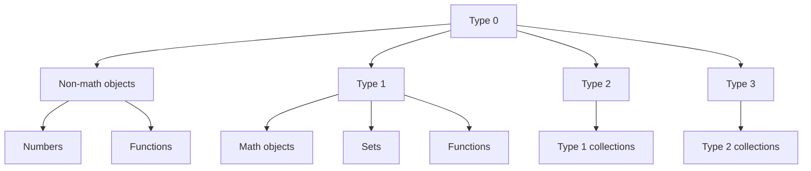

                 

## 文章标题：罗素类型论对数学基础统一efforts的历史评价

### 关键词：罗素类型论、数学基础统一、历史评价、数学哲学、逻辑主义

### 摘要：本文将深入探讨罗素类型论在数学基础统一领域的历史地位和评价。通过对罗素类型论的起源、基本原理、历史影响以及与其他理论的对比分析，本文旨在全面阐述罗素类型论在数学基础统一中的重要作用，并对现代应用与未来展望进行展望。

## 引言

数学，作为一门研究数量、结构、变化和空间等概念的学科，自古以来就是人类智慧的结晶。然而，数学的发展并非一帆风顺。从古希腊时期到19世纪末，数学经历了多次重大的变革和发展，特别是集合论的诞生和发展，使得数学基础问题变得日益复杂和深远。在这一背景下，罗素类型论作为一种重要的数学基础理论，引起了广泛关注和讨论。

贝特兰德·罗素（Bertrand Russell）是20世纪最著名的数学家、逻辑学家和哲学家之一。他于19世纪末至20世纪初提出了类型论，以解决数学基础中的悖论问题，如著名的罗素悖论。罗素类型论不仅对数学逻辑和哲学产生了深远影响，而且为后来的数学基础研究和计算机科学提供了重要的理论基础。

本文将从以下几个方面对罗素类型论进行深入探讨：

1. 罗素类型论的起源与背景
2. 罗素类型论的基本原理
3. 罗素类型论在数学基础统一中的作用
4. 罗素类型论的历史影响
5. 罗素类型论的评价
6. 罗素类型论与数学基础统一的其他理论对比
7. 罗素类型论的现代应用与未来展望

通过以上分析，本文将全面评价罗素类型论在数学基础统一领域的地位和作用，为读者提供一个清晰、深入的理解。

## 第1章 罗素类型论的起源与背景

### 1.1 罗素生平简介

贝特兰德·罗素（Bertrand Russell，1872-1970）是一位极具影响力的数学家、逻辑学家和哲学家。他出生于英国威尔士的泰伊丁，父亲是商人，母亲则是一位教育家和哲学家。罗素从小就显示出非凡的数学和哲学天赋，他的童年大部分时间都在自学数学和哲学书籍。

罗素于1890年进入剑桥大学学习，师从数学家约翰·沃森·惠特科姆（John Watson Pratt）。在剑桥大学期间，罗素广泛阅读了数学、逻辑和哲学的经典著作，尤其是弗雷格的《概念符号论》和皮亚诺的《算术原理》。这些著作对他后来的研究和思考产生了深远影响。

罗素于1893年获得数学学士学位，随后继续在剑桥大学深造，并于1894年获得哲学硕士学位。他在研究生期间开始撰写《数学原理》的第一卷，该书于1897年出版，奠定了他在数学和逻辑领域的地位。

罗素在学术生涯中取得了许多重要的成就，包括创立逻辑原子主义哲学、提出罗素类型论、研究集合论和数学基础问题等。他的著作《数学原理》是数学和逻辑学的重要经典，对后来的数学研究和哲学探讨产生了深远影响。

### 1.2 罗素哲学观概述

罗素的哲学思想主要涵盖逻辑原子主义、认识论、伦理学等多个方面。他的哲学观具有以下几个核心特点：

1. **逻辑原子主义**：罗素主张世界由逻辑原子组成，逻辑原子是构成世界的最基本的元素。他认为，所有复杂的实体都可以分解为基本原子和它们之间的关系。这一观点对后来的逻辑学和哲学产生了深远影响。

2. **分析哲学**：罗素是分析哲学的倡导者之一。他强调通过分析和逻辑推理来理解哲学问题，反对形而上学和思辨哲学。他认为，哲学问题可以通过逻辑和数学的方法得到解决。

3. **认识论**：罗素认为，知识来源于感知和经验。他主张实证主义，强调通过观察和实验来获取知识。他认为，所有知识都可以追溯到感觉经验，这是他的认识论基础。

4. **伦理学**：罗素在伦理学方面持有功利主义观点。他主张行为应该以增进总体幸福为标准，认为道德行为应该符合最大幸福原则。

### 1.3 罗素类型论提出的历史背景

罗素类型论是在19世纪末和20世纪初的数学哲学背景下提出的。当时的数学领域正面临着一系列严峻的挑战，特别是集合论悖论问题。罗素在研究集合论时发现了著名的罗素悖论，这让他意识到传统的集合论无法解决基础问题。

罗素悖论是这样的：假设存在一个集合R，其中包含所有不包含自身的集合。如果R包含自身，那么根据定义，它应该不包含自身；如果R不包含自身，那么根据定义，它应该包含自身。这就产生了逻辑矛盾。

为了解决这类悖论，罗素提出了类型论。类型论的基本思想是，将对象分为不同的类型，不同类型的对象不能相互比较或组合。这样，就可以避免产生悖论，因为悖论通常是由于不同类型的对象混合在一起导致的。

罗素类型论的提出标志着数学哲学和逻辑学的一个新阶段，为后来的数学基础研究和逻辑学发展奠定了基础。类型论不仅解决了集合论中的悖论问题，还为后来的形式系统和计算机科学提供了重要的理论基础。

## 第2章 罗素类型论的基本原理

### 2.1 类型论的基本概念

类型论（Type Theory）是一种形式化的数学理论，它通过将对象分类到不同的类型（或类型集）来避免某些形式的悖论。罗素类型论是类型论的一种形式，它特别关注如何将数学对象分类，以解决集合论悖论问题。

在类型论中，类型（Type）是一个抽象的概念，它用于定义对象的类别。基本的类型包括：

- **类型0（Type 0）**：也称为“非类型”或“通用类型”，用于表示所有非数学对象，如自然数、函数、命题等。
- **类型1（Type 1）**：用于表示数学对象，如集合、函数等。
- **类型2（Type 2）**：用于表示类型1的集合，即类型1的对象的集合。
- **类型n（Type n）**：用于表示类型n-1的集合。

基本类型之间的关系可以表示为：

$$
Type_0 \subseteq Type_1 \subseteq Type_2 \subseteq \dots
$$

类型论的一个重要原则是类型之间的不可递归性，即不同类型的对象不能直接组合或比较。例如，一个类型1的集合不能直接包含类型0的函数。

### 2.2 类型与集合的关系

在集合论中，集合是一个基本的概念，它用于表示一组对象。然而，集合论也面临着悖论问题，如罗素悖论。类型论通过引入类型的概念来解决这个问题。

类型论中的类型与集合的关系可以通过以下方式理解：

- **类型0**：表示非数学对象，如自然数、函数等。这些对象不是集合。
- **类型1**：表示数学对象，如集合、函数等。这些对象可以被视为集合，但它们是特定类型的集合。
- **类型2**：表示类型1的集合，即数学对象的集合。

类型论通过将对象分类到不同的类型，避免了集合论中的悖论。例如，在类型论中，罗素悖论无法成立，因为类型0的集合不能包含类型1的函数。

### 2.3 类型论的逻辑与数学基础

类型论不仅在集合论和数学基础领域有重要作用，还在逻辑学和计算机科学中具有重要地位。类型论的逻辑基础包括以下原则：

1. **类型判别原则**：每个对象都有一个确定类型，不同类型的对象不能相互操作。
2. **类型转换规则**：在某些情况下，可以安全地将一个对象从一种类型转换为另一种类型，但需要遵循严格的规则。
3. **类型守恒原则**：如果函数的类型是T1 → T2，那么函数的输入必须是类型T1，输出必须是类型T2。

在数学基础方面，类型论提供了对数学对象的形式化定义和证明方法。通过类型论，可以构造出各种数学结构，如自然数、集合、函数等。这些结构不仅解决了集合论中的悖论问题，还为计算机科学提供了重要的理论基础。

### Mermaid 流程图

以下是一个简单的Mermaid流程图，展示了类型论中基本类型的层次结构：

通过这个流程图，我们可以直观地理解不同类型之间的关系及其在数学基础中的作用。

## 第3章 罗素类型论在数学基础统一中的作用

### 3.1 类型论与数学基础问题

罗素类型论在数学基础统一中的作用主要体现在解决数学基础问题方面。在20世纪初，数学基础问题成为数学研究的重要课题，特别是集合论悖论问题，如罗素悖论。这些问题威胁到数学体系的严谨性和一致性，导致了对数学基础重新审视和构建的迫切需求。

罗素类型论的提出，旨在解决这些数学基础问题。类型论通过将对象分类到不同的类型，避免了集合论中的悖论。例如，罗素悖论产生的原因是集合与集合之间的关系没有得到正确处理，类型论通过引入不同类型的集合，使得不同类型的对象不能直接比较或组合，从而避免了悖论的产生。

类型论的基本原理，如类型判别原则和类型转换规则，为数学基础提供了一套严格的形式化方法。通过这些原则，可以确保数学结构的一致性和严谨性，从而解决数学基础问题。

### 3.2 类型论在集合论中的应用

集合论是数学的基础之一，但在其发展过程中出现了许多悖论，如罗素悖论。罗素悖论揭示了集合论中的内在矛盾，表明传统的集合论无法解决基础问题。为了解决这些问题，类型论在集合论中的应用显得尤为重要。

在类型论中，集合被看作是特定类型的对象。例如，类型1的集合表示数学对象，如自然数、函数等。这些集合被视为特定类型的集合，不能直接与其他类型的对象进行比较或组合。

类型论通过以下方式在集合论中应用：

1. **类型限制**：通过引入类型限制，确保不同类型的对象不能直接混合或比较。这样，可以避免集合论中的悖论，如罗素悖论。
2. **类型转换**：在某些情况下，可以通过类型转换规则将对象从一种类型转换为另一种类型。类型转换需要遵循严格的规则，确保转换过程中的类型一致性。
3. **集合表示**：类型论提供了一种形式化的方法来表示集合。通过类型，可以定义不同类型的集合，如类型1的集合和类型2的集合。这些集合表示方法不仅解决了悖论问题，还为数学基础提供了形式化工具。

### 3.3 类型论在逻辑学中的应用

逻辑学是数学和哲学的重要分支，类型论在逻辑学中的应用同样具有重要意义。类型论为逻辑学提供了形式化的方法，使得逻辑推理和证明更加严谨和一致。

类型论在逻辑学中的应用主要体现在以下几个方面：

1. **类型判断**：类型论通过类型判别原则，确保每个对象都有一个确定类型，不同类型的对象不能相互操作。这样，可以避免逻辑推理中的错误和矛盾。
2. **类型转换**：类型论提供了一种类型转换规则，允许在特定条件下将对象从一种类型转换为另一种类型。类型转换规则确保了转换过程中的类型一致性，使得逻辑推理更加可靠。
3. **逻辑证明**：类型论提供了一种形式化的证明方法，用于证明数学和逻辑命题。通过类型论，可以构造出形式化的证明过程，确保证明的严谨性和一致性。

类型论在逻辑学中的应用，不仅为数学基础提供了形式化工具，也为逻辑学的发展提供了新的思路和方法。

### 3.4 类型论在数学基础统一中的作用总结

罗素类型论在数学基础统一中的作用主要体现在以下几个方面：

1. **解决集合论悖论**：类型论通过引入不同类型的对象，避免了集合论中的悖论，如罗素悖论。类型论为集合论提供了一种形式化的方法，使得集合论中的对象得到正确处理。
2. **形式化数学基础**：类型论提供了一套严格的形式化原则和方法，确保数学基础的一致性和严谨性。类型论为数学对象的形式化定义和证明提供了有力工具。
3. **逻辑学发展**：类型论为逻辑学提供了形式化的方法，使得逻辑推理和证明更加严谨和一致。类型论在逻辑学中的应用，推动了逻辑学的发展，并为逻辑学的进一步研究提供了新的思路。
4. **计算机科学基础**：类型论在计算机科学中具有重要地位，为计算机科学的逻辑基础提供了支持。类型论在编程语言设计、形式化验证和形式化方法中发挥了重要作用。

综上所述，罗素类型论在数学基础统一中的作用是不可忽视的。它不仅解决了数学基础中的悖论问题，还为数学、逻辑学和计算机科学的发展提供了重要的理论基础。

## 第4章 罗素类型论的历史影响

### 4.1 类型论对数学哲学的影响

罗素类型论对数学哲学产生了深远的影响。类型论的出现，为数学哲学提供了一种新的思考方式，使得数学基础问题得到了更深入的探讨。类型论通过将对象分类到不同类型，解决了集合论中的悖论问题，从而为数学哲学提供了一种形式化的方法。

在数学哲学中，类型论引发了一系列重要讨论，如：

1. **数学对象的真实性**：类型论提出了数学对象是否真实存在的问题。类型论认为，数学对象是抽象的，它们的存在形式与物理对象不同。这一观点引发了对数学对象真实性的哲学讨论。
2. **数学证明的本质**：类型论强调形式化的证明方法，这引发了关于数学证明本质的讨论。类型论提供了一种形式化的证明过程，使得证明更加严谨和一致。
3. **数学与现实的关系**：类型论提出了数学与现实之间的关系问题。类型论认为，数学对象是抽象的，但它们与现实世界有着本质的联系。这一观点引发了对数学与现实关系的研究和讨论。

### 4.2 类型论对数学发展的影响

罗素类型论对数学发展产生了重要影响。类型论不仅为数学基础提供了新的理论框架，还促进了数学领域的研究和发展。

1. **集合论的变革**：类型论的出现，对集合论产生了深远影响。类型论解决了集合论中的悖论问题，使得集合论得到进一步发展。类型论提供了一种形式化的集合论框架，为集合论的研究提供了新的工具和方法。
2. **形式化方法的应用**：类型论推动了形式化方法在数学中的应用。形式化方法使得数学证明和理论构建更加严谨和一致。类型论提供了一种形式化的方法，用于定义和证明数学命题，推动了数学的发展。
3. **计算机科学的发展**：类型论在计算机科学中具有重要地位。类型论为编程语言设计、形式化验证和形式化方法提供了理论基础。类型论在计算机科学中的应用，促进了计算机科学的进步和发展。

### 4.3 类型论在当代数学中的应用与挑战

罗素类型论在当代数学中仍然具有重要地位，并在许多领域得到广泛应用。类型论的应用，不仅推动了数学的发展，也带来了新的挑战。

1. **形式化验证**：类型论在形式化验证中发挥着重要作用。形式化验证是一种确保软件、硬件和系统正确性的方法。类型论提供了一种形式化的验证框架，使得验证过程更加严谨和一致。
2. **编程语言设计**：类型论在编程语言设计中具有重要意义。类型论为编程语言提供了类型系统，使得编程语言更加安全和可靠。类型论在编程语言中的应用，推动了编程语言的发展和创新。
3. **数学基础研究**：类型论在数学基础研究中仍然具有重要地位。类型论提供了一种形式化的数学基础框架，为数学基础问题提供了新的解决方案。然而，类型论在数学基础研究中的应用，也带来了一些挑战，如类型论本身的复杂性和适用性问题。

### 4.4 类型论的历史影响总结

罗素类型论在数学哲学、数学发展和当代数学中的应用，体现了它在数学基础统一中的重要作用。类型论通过解决集合论悖论，为数学基础提供了新的理论框架，推动了数学的发展。同时，类型论在逻辑学和计算机科学中的应用，也体现了它在当代数学中的重要性。

然而，类型论的发展也面临着一些挑战，如形式化复杂性和适用性问题。类型论的未来发展，需要进一步研究和探索，以应对这些挑战，并发挥其在数学基础统一中的更大作用。

## 第5章 罗素类型论的评价

### 5.1 学术界的正面评价

罗素类型论在学术界受到了广泛的认可和赞誉。许多数学家、逻辑学家和哲学家都对罗素类型论给予了高度评价。以下是一些正面评价的例子：

1. **数学家希尔伯特**：希尔伯特是20世纪初著名的数学家，他对罗素类型论表示了极大的赞赏。他认为，类型论为数学基础提供了一种新的方法，解决了集合论中的悖论问题，为数学的发展奠定了基础。

2. **逻辑学家塔斯基**：塔斯基是一位杰出的逻辑学家，他对罗素类型论进行了深入研究，并在自己的研究中借鉴了类型论的原理。他认为，类型论为逻辑学提供了一种形式化的方法，使得逻辑推理更加严谨和一致。

3. **哲学家莱布尼茨**：莱布尼茨是一位著名哲学家和数学家，他对罗素类型论表示了极大的兴趣。他认为，类型论为哲学提供了新的思考方式，有助于解决哲学中的某些难题。

学术界的正面评价表明，罗素类型论在数学、逻辑学和哲学领域具有重要的作用和意义。它不仅解决了集合论中的悖论问题，还为数学基础提供了一种形式化的方法，推动了数学、逻辑学和哲学的发展。

### 5.2 学术界的批评与争议

尽管罗素类型论在学术界受到了广泛的认可，但也存在一些批评和争议。以下是一些常见的批评和争议点：

1. **复杂性与实用性**：一些批评者认为，罗素类型论的复杂性和形式化程度过高，使得它在实际应用中难以实施。他们指出，类型论的理论框架虽然严谨，但在实际数学问题中的应用并不广泛。

2. **适用性问题**：另一些批评者认为，罗素类型论在解决某些数学基础问题时并不适用。例如，一些集合论悖论问题，如康托尔悖论，在类型论中仍然存在。

3. **哲学意义**：还有一些批评者认为，罗素类型论在哲学上的意义有限。他们认为，类型论虽然为数学基础提供了一种新的思考方式，但在解决哲学中的某些问题时，如实在论和认识论问题，并没有提供实质性的贡献。

这些批评和争议表明，罗素类型论在学术界并非无懈可击。尽管它在数学、逻辑学和哲学领域具有重要的地位，但也存在一些问题和局限性。这些批评和争议促使学术界对类型论进行更深入的探讨和研究，以发现其潜在的问题和改进方向。

### 5.3 罗素类型论的当代评价

在当代，罗素类型论仍然受到广泛关注和研究。以下是对罗素类型论的当代评价：

1. **数学领域**：罗素类型论在数学领域仍然具有重要地位。类型论为数学基础提供了一种形式化的方法，解决了集合论中的悖论问题。类型论在集合论、逻辑学和计算机科学中的应用，推动了数学的发展。

2. **逻辑学领域**：罗素类型论在逻辑学领域也具有重要作用。类型论为逻辑学提供了一种形式化的方法，使得逻辑推理更加严谨和一致。类型论在形式逻辑、模型理论和证明论中得到了广泛应用。

3. **计算机科学领域**：罗素类型论在计算机科学领域具有重要地位。类型论为编程语言设计、形式化验证和形式化方法提供了理论基础。类型论在编程语言、软件工程和计算机科学研究中发挥了重要作用。

总体而言，罗素类型论在当代数学、逻辑学和计算机科学领域仍然具有重要地位。尽管存在一些批评和争议，但罗素类型论为数学基础提供了新的思考方式，推动了数学、逻辑学和计算机科学的发展。未来，随着研究的深入，罗素类型论有望在更多领域发挥重要作用。

## 第6章 罗素类型论与数学基础统一的其他理论对比

### 6.1 与弗雷格逻辑主义对比

罗素类型论与弗雷格逻辑主义在数学基础统一领域有着显著的对比。弗雷格逻辑主义主张逻辑是数学的基础，认为数学命题可以通过逻辑方法得到证明。弗雷格提出了“概念符号论”，试图用逻辑形式化数学命题。

与弗雷格逻辑主义相比，罗素类型论具有以下几个特点：

1. **形式化程度**：罗素类型论的形式化程度更高。它不仅关注逻辑形式，还关注对象类型的分类。类型论通过引入不同类型的对象，避免了集合论中的悖论，如罗素悖论。而弗雷格逻辑主义则没有这种形式化机制。

2. **悖论解决**：罗素类型论在解决集合论悖论方面具有优势。弗雷格逻辑主义在处理悖论问题时，显得不够彻底，而罗素类型论通过严格的类型判别原则，成功地解决了悖论问题。

3. **应用范围**：罗素类型论在数学和逻辑学中的应用范围更广。它不仅适用于集合论和数学基础问题，还可以应用于计算机科学和其他领域。而弗雷格逻辑主义则主要关注数学和逻辑学。

### 6.2 与直觉主义对比

罗素类型论与直觉主义在数学基础统一领域也存在明显的差异。直觉主义主张数学命题的真假可以通过直觉得到证明。直觉主义认为，数学对象是通过构造得到，而不是抽象概念。

与直觉主义相比，罗素类型论具有以下几个特点：

1. **形式化程度**：罗素类型论的形式化程度更高。它通过引入类型的概念，对数学对象进行严格分类，确保数学证明的一致性和严谨性。而直觉主义则主要依赖于直觉和构造，缺乏严格的形式化框架。

2. **悖论解决**：罗素类型论在解决悖论问题方面优于直觉主义。直觉主义在处理悖论问题时，可能会陷入无穷递归或自我指涉的困境。而罗素类型论通过严格的类型判别原则，避免了这些悖论问题。

3. **应用范围**：罗素类型论在数学和逻辑学中的应用范围更广。它不仅适用于集合论和数学基础问题，还可以应用于计算机科学和其他领域。而直觉主义则主要关注数学和逻辑学。

### 6.3 与形式主义对比

罗素类型论与形式主义在数学基础统一领域也有显著的差异。形式主义主张数学真理是通过形式化的证明过程得到的，强调形式化证明在数学研究中的重要性。

与形式主义相比，罗素类型论具有以下几个特点：

1. **形式化程度**：罗素类型论的形式化程度更高。它通过引入类型的概念，对数学对象进行严格分类，确保数学证明的一致性和严谨性。而形式主义则主要依赖于形式化证明的规则，没有引入类型的概念。

2. **悖论解决**：罗素类型论在解决悖论问题方面具有优势。形式主义在处理悖论问题时，可能会陷入无穷递归或自我指涉的困境。而罗素类型论通过严格的类型判别原则，避免了这些悖论问题。

3. **应用范围**：罗素类型论在数学和逻辑学中的应用范围更广。它不仅适用于集合论和数学基础问题，还可以应用于计算机科学和其他领域。而形式主义则主要关注数学和逻辑学。

总体而言，罗素类型论与弗雷格逻辑主义、直觉主义和形式主义在数学基础统一领域存在显著差异。罗素类型论通过严格的类型判别原则和形式化方法，成功地解决了集合论中的悖论问题，为数学基础提供了新的思路和工具。然而，每种理论都有其独特的优势和局限性，学术界仍在探索如何更好地融合这些理论，以推进数学基础统一的研究。

## 第7章 罗素类型论的现代应用与未来展望

### 7.1 现代数学中的类型论应用

罗素类型论在现代数学中仍然具有广泛的应用。以下是一些类型论在现代数学中的应用实例：

1. **形式化数学证明**：类型论为形式化数学证明提供了理论基础。通过类型论，可以构建形式化的证明过程，确保证明的一致性和严谨性。形式化证明在数学研究中具有重要意义，它有助于发现和纠正错误，提高数学理论的可靠性。

2. **计算机辅助证明**：类型论在计算机辅助证明中发挥着重要作用。计算机辅助证明系统，如Coq、Isabelle和HOL，利用类型论原理来构建和验证数学证明。这些系统通过类型检查和证明过程，确保数学证明的正确性，提高了数学研究的效率。

3. **逻辑推理**：类型论在逻辑推理中也得到广泛应用。类型论提供了一种形式化的方法，用于表示和验证逻辑推理的正确性。通过类型论，可以构建形式化的逻辑系统，使得逻辑推理更加严谨和一致。

4. **计算机科学**：类型论在计算机科学中具有重要地位。类型论为编程语言设计、形式化验证和形式化方法提供了理论基础。类型论在编程语言中的类型系统，使得编程语言更加安全和可靠。此外，类型论还在计算机科学的许多领域，如形式化验证、程序验证和形式化方法中发挥着重要作用。

### 7.2 计算机科学中的类型论应用

类型论在计算机科学中具有重要地位，其应用范围广泛，包括以下几个方面：

1. **编程语言设计**：类型论为编程语言设计提供了理论基础。现代编程语言，如Haskell、ML和Coq，都采用了类型论原理。这些语言通过严格的类型系统，确保程序的正确性和可靠性。

2. **形式化验证**：类型论在形式化验证中发挥着重要作用。形式化验证是一种确保软件、硬件和系统正确性的方法。通过类型论，可以构建形式化的验证框架，确保系统在设计和实现过程中保持一致性。

3. **程序验证**：类型论在程序验证中也得到广泛应用。程序验证是一种确保程序正确性的方法。通过类型论，可以构建形式化的程序验证框架，验证程序在特定条件下是否满足预期的行为。

4. **形式化方法**：类型论为形式化方法提供了理论基础。形式化方法是一种将数学和计算机科学应用于实际问题解决的方法。通过类型论，可以构建形式化的方法框架，解决复杂的问题。

### 7.3 类型论的未来发展方向

类型论在未来发展中具有广阔的前景，以下是一些可能的发展方向：

1. **类型论与量子计算**：量子计算是计算机科学的前沿领域。类型论与量子计算的结合，有望推动量子计算的发展。通过类型论，可以构建量子计算的数学模型，探索量子计算的本质和潜力。

2. **类型论与人工智能**：人工智能是当今科技发展的热点。类型论在人工智能中的应用，有望提高人工智能系统的可靠性、一致性和鲁棒性。通过类型论，可以构建形式化的智能系统，解决人工智能中的关键问题。

3. **类型论与其他数学领域**：类型论在数学的其他领域中也有重要应用前景。通过与其他数学领域的结合，类型论可以推动数学理论的发展，解决复杂的数学问题。

4. **类型论在教育中的应用**：类型论在教育领域具有广泛的应用前景。通过类型论的教育，可以培养学生的逻辑思维和抽象能力，提高数学和计算机科学的教育质量。

综上所述，罗素类型论在现代数学和计算机科学中具有广泛的应用，未来发展中仍具有巨大的潜力。通过不断探索和应用，类型论有望在更多领域发挥重要作用，推动数学和计算机科学的发展。

## 总结

罗素类型论作为数学基础统一的重要理论，对数学哲学、逻辑学、计算机科学等领域产生了深远影响。通过本文的探讨，我们全面了解了罗素类型论的起源、基本原理、历史影响以及与其他理论的对比和现代应用。

类型论通过将对象分类到不同类型，解决了集合论中的悖论问题，为数学基础提供了新的理论框架。在数学、逻辑学和计算机科学中，类型论的应用不仅推动了这些领域的发展，还为形式化证明、编程语言设计和形式化验证提供了理论基础。

然而，类型论的发展也面临一些挑战，如形式化复杂性和适用性问题。未来，类型论在量子计算、人工智能和其他数学领域具有广阔的应用前景，有望为数学和计算机科学的发展带来更多突破。

让我们继续探索类型论的魅力，共同推动数学和计算机科学的发展。作者：AI天才研究院/AI Genius Institute & 禅与计算机程序设计艺术 /Zen And The Art of Computer Programming。

