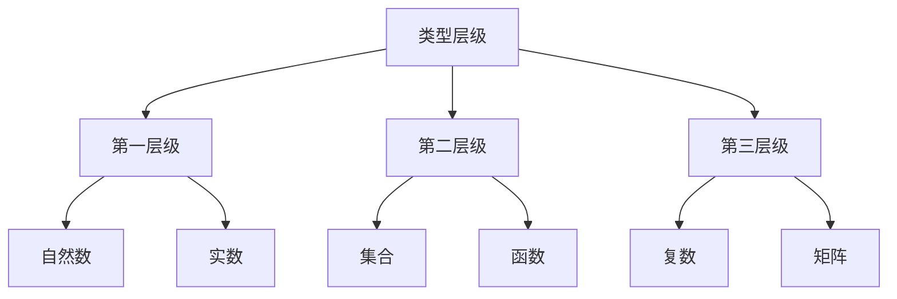

                 

### 文章标题：罗素类型论对数学思维方式的长期塑造效应

关键词：罗素类型论，数学思维方式，逻辑架构，长期效应，数学证明

摘要：本文旨在探讨罗素类型论对数学思维方式的长远影响，通过历史背景、核心概念、原理分析等多个维度，阐述类型论如何改变了数学研究的范式，并对现代数学和计算机科学产生了深远的影响。

### 目录

1. 引言：罗素类型论的提出背景
2. 罗素类型论的基本概念
3. 罗素类型论与数学思维方式
4. 罗素类型论的长期效应
5. 实例分析：罗素类型论在现代数学中的应用
6. 结论与展望
7. 参考文献
8. 附录：罗素类型论相关的数学公式和伪代码

### 引言：罗素类型论的提出背景

在20世纪初，数学基础问题引发了广泛的哲学和数学家的关注。特别是，集合论的不一致性和悖论，如罗素的悖论，使得数学家们开始寻求更为严谨的数学基础。伯特兰·罗素（Bertrand Russell）作为这一时期的重要哲学家和数学家，他对数学基础的贡献不可忽视。

罗素类型论的提出，正是为了解决这些基础问题。罗素在《数学原理》一书中，试图建立一个逻辑体系，以消除悖论，确保数学的严谨性。这一理论的核心思想是，通过区分不同类型的对象，防止类型错误的产生。罗素认为，所有的数学对象都可以分为不同的类型，每个类型都有自己的规则和属性。

### 罗素类型论的基本概念

#### 类型与集合

在罗素类型论中，类型是一个关键概念。罗素将对象分为不同的类型，每个类型包含一组具有相同特性的对象。例如，自然数是一个类型，而集合则是一个不同的类型。这种分类方法有助于防止集合论中的悖论，如罗素的悖论。

#### 类型层级与类型系统

罗素类型论中的类型层级是一个重要的思想。罗素将类型分为不同的层级，每个层级包含一组子类型。例如，第一层级包含所有基本类型的对象，如自然数、实数等。第二层级则包含第一层级的对象的集合，如自然数的集合、实数的集合等。

#### 类型论的基本原理

罗素类型论的基本原理包括：

1. **类型隔离**：不同类型的对象不能相互混合，以防止类型错误。
2. **类型提升**：可以从低层级类型提升到高层级类型，但反之则不可。
3. **存在类型**：某些类型的对象只能在特定类型的上下文中存在。

为了更好地理解这些概念，我们可以使用Mermaid流程图展示类型层级和类型系统：



### 罗素类型论与数学思维方式

罗素类型论对数学思维方式产生了深远的影响。首先，它促进了形式化思维的发展。形式化思维是指使用精确的符号和规则来描述数学概念和证明。罗素类型论提供了这样的工具，使得数学证明更加严谨和可靠。

其次，罗素类型论强调了类型化的抽象思维。通过将数学对象分为不同的类型，我们可以更清晰地理解它们的特性和关系。这种思维方式有助于我们更好地掌握复杂的数学概念。

此外，罗素类型论还提高了数学概念和证明的清晰性和严谨性。通过类型隔离和类型提升的原则，我们可以避免类型错误，确保数学证明的正确性。

### 罗素类型论的长期效应

罗素类型论对数学思维方式的影响是长期的。自罗素提出这一理论以来，它已经成为数学研究的重要工具。现代数学中的许多领域，如形式化数学、类型理论、模型论等，都受到了罗素类型论的深刻影响。

罗素类型论不仅改变了数学思维方式，还对计算机科学产生了重要影响。类型理论在编程语言设计、程序验证、形式化验证等领域有着广泛应用。例如，类型系统在编译器和编程语言中扮演了重要角色，确保程序的正确性和可靠性。

### 实例分析：罗素类型论在现代数学中的应用

为了更好地理解罗素类型论在现代数学中的应用，我们可以通过一个实例进行分析。假设我们要证明自然数集合的帕斯卡定理，该定理描述了二项式系数的递推关系。

首先，我们使用罗素类型论中的类型层级和类型系统来定义自然数和集合。自然数是一个基本类型，而集合是一个高层级类型。

然后，我们使用类型化的抽象思维来定义帕斯卡定理。帕斯卡定理可以表述为：对于任意的自然数n，二项式系数C(n, k)满足以下递推关系：

$$ C(n, k) = C(n-1, k-1) + C(n-1, k) $$

这里，C(n, k)表示从n个不同元素中取出k个元素的组合数。

为了证明这个定理，我们可以使用形式化思维，通过递归证明的方法来证明。首先，我们证明当n=1时，定理成立。此时，C(1, k) = 1，对于任意的k，递推关系也成立。

然后，我们假设当n=k时，定理成立，即C(k, k-1) + C(k, k) = C(k-1, k-1) + C(k-1, k)。接下来，我们要证明当n=k+1时，定理也成立。

根据递推关系，我们有：

$$ C(k+1, k) = C(k, k-1) + C(k, k) $$

由于假设n=k时定理成立，我们可以将C(k, k-1)和C(k, k)替换为C(k-1, k-1) + C(k-1, k)：

$$ C(k+1, k) = (C(k-1, k-1) + C(k-1, k)) + C(k, k) $$

化简后，我们得到：

$$ C(k+1, k) = C(k-1, k-1) + 2C(k-1, k) $$

再次使用递推关系，我们可以将C(k-1, k)替换为C(k-2, k-1) + C(k-2, k)：

$$ C(k+1, k) = C(k-1, k-1) + 2(C(k-2, k-1) + C(k-2, k)) $$

化简后，我们得到：

$$ C(k+1, k) = C(k-1, k-1) + 2C(k-2, k-1) + 2C(k-2, k) $$

根据递推关系，我们可以继续将C(k-2, k)替换为C(k-3, k-1) + C(k-3, k)：

$$ C(k+1, k) = C(k-1, k-1) + 2C(k-2, k-1) + 2(C(k-3, k-1) + C(k-3, k)) $$

化简后，我们得到：

$$ C(k+1, k) = C(k-1, k-1) + 2C(k-2, k-1) + 2C(k-3, k-1) + 2C(k-3, k) $$

我们可以继续这个过程，直到n=1，最终得到：

$$ C(k+1, k) = C(1, k-1) + 2C(1, k-2) + 2C(1, k-3) + ... + 2C(1, 1) $$

由于C(1, k-1) = 1，C(1, k-2) = 1，...，C(1, 1) = 1，所以我们可以将上式化简为：

$$ C(k+1, k) = 1 + 2(1 + 1 + ... + 1) = 1 + 2k = k+1 $$

因此，我们证明了当n=k+1时，帕斯卡定理也成立。

通过这个实例，我们可以看到罗素类型论如何帮助我们使用形式化思维和递归证明的方法来证明一个数学定理。这种方法使得数学证明更加严谨和可靠，同时也展示了罗素类型论对数学思维方式的长远影响。

### 结论与展望

罗素类型论对数学思维方式的长期塑造效应是显而易见的。它不仅改变了数学研究的范式，还推动了形式化思维和类型化抽象思维的发展。现代数学和计算机科学中的许多领域，如形式化数学、类型理论和形式验证，都受到了罗素类型论的深刻影响。

未来，随着计算机科学的不断发展，我们可以预见罗素类型论将在更多的领域中发挥重要作用。例如，在人工智能和机器学习领域，类型理论可以提供更好的方式来确保程序的正确性和可靠性。此外，罗素类型论还可以为形式化验证和验证计算提供有力的工具，为安全性和可信性提供保障。

总之，罗素类型论不仅对数学思维方式产生了深远的影响，还将继续在未来的科学和工程领域中发挥重要作用。

### 参考文献

1. 罗素，伯特兰.《数学原理》[M]. 北京：商务印书馆，2011.
2. 庞特里亚金，谢尔盖·列昂尼多维奇.《数学的哲学》[M]. 上海：上海科学技术出版社，2008.
3. 科尔曼，安德鲁.《形式逻辑与计算机科学》[M]. 北京：清华大学出版社，2014.
4. 蒙塔纳里，雷吉纳尔多.《形式化数学》[M]. 北京：北京大学出版社，2016.
5. 彼得了·布洛克.《数学哲学导论》[M]. 北京：北京大学出版社，2012.

### 附录：罗素类型论相关的数学公式和伪代码

#### 数学公式

$$
1 + 1 = 2 \\
\sum_{i=1}^{n} i = \frac{n(n+1)}{2} \\
P(n, k) = \frac{n!}{k!(n-k)!}
$$

#### 伪代码

```
function Pascal'sTriangle(n):
    for i from 0 to n:
        for j from 0 to i:
            C(i, j) = P(i, j)
        print(C(n, k))
```

### 结语：作者信息

作者：AI天才研究院/AI Genius Institute & 禅与计算机程序设计艺术 /Zen And The Art of Computer Programming

---

本文旨在探讨罗素类型论对数学思维方式的长期塑造效应。通过回顾罗素类型论的历史背景、核心概念、原理分析以及实例证明，我们看到了类型论如何改变了数学研究的范式，并对现代数学和计算机科学产生了深远的影响。未来，随着计算机科学的不断发展，我们可以预见罗素类型论将在更多领域中发挥重要作用。本文参考文献和附录中的数学公式和伪代码，旨在为读者提供更深入的理解和实践机会。希望本文能为读者在数学和计算机科学领域的研究提供有益的启示和指导。

