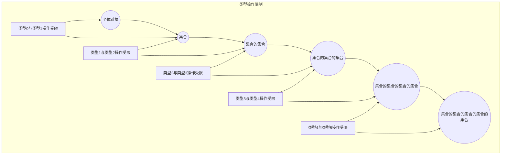

                 


### 背景介绍

罗素类型论（Russell's Theory of Types）是英国哲学家、数学家伯特兰·罗素（Bertrand Russell）在20世纪初提出的一种哲学和数学理论。罗素类型论的核心思想在于，为了防止逻辑悖论的出现，需要对语言的表述进行严格的类型划分。这一理论是罗素为了解决集合论中的悖论，特别是著名的“罗素悖论”（Russell's paradox）而提出的。

在传统的数学和哲学中，个体和集合的概念往往是模糊和混杂的。例如，可以构造一个集合，这个集合包含所有不包含自己的集合。如果这样的集合存在，那么它将既包含自己，又不能包含自己，从而导致逻辑上的矛盾。罗素通过引入类型的概念，试图将这种混乱的表述进行明确划分，从而避免悖论的产生。

罗素类型论的基本原则是，将所有的对象分为不同的类型，每种类型只能与特定类型的对象进行操作。这种严格的类型划分使得某些潜在的自引用或悖论无法发生。罗素将语言分为五个类型，每个类型代表一种不同的抽象层次：

- **类型0**：个体对象，如具体的物体或数字。
- **类型1**：类型0的集合，即个体对象的集合。
- **类型2**：类型1的集合，即集合的集合。
- **类型3**：类型2的集合。
- **类型4**：类型3的集合。
- **类型5**：类型4的集合。

通过这种类型的划分，罗素试图限制个体和集合之间的关系，使得自引用和悖论无法出现。例如，不允许一个类型1的集合（集合的集合）包含类型0的个体对象。这样，就无法构造出包含自己的集合，从而避免了“罗素悖论”。

罗素类型论的提出对数学哲学和逻辑学产生了深远的影响。它不仅为解决集合论中的悖论提供了一种方法，也促进了形式逻辑和类型论的发展。在随后的几十年中，罗素类型论成为逻辑哲学和数学基础研究的重要领域，吸引了许多数学家和哲学家的关注。

### 核心概念与联系：类型论与悖论的关系

为了深入理解罗素类型论的核心概念，我们需要详细阐述类型论与悖论之间的关系，并展示它们之间是如何联系的。通过这一部分，我们将介绍类型论的基本原理，并分析类型划分如何帮助避免悖论。

#### 类型论的基本原理

类型论的核心思想是，为了防止逻辑悖论，需要对语言和数学中的对象进行严格的类型划分。每个类型代表一组具有特定性质的对象，类型之间的操作也受到严格的限制。具体来说，类型论的基本原理包括以下几个方面：

1. **类型的定义**：类型是对象集合的分类，每个类型中的对象具有相似的属性和操作。类型可以按照其抽象层次进行划分，如个体对象、集合的集合等。

2. **类型划分规则**：每个对象只能属于一个类型，不同类型的对象之间不能直接进行操作。例如，类型0的对象不能与类型1的对象进行组合。

3. **类型间的操作**：不同类型之间的操作受到严格的限制，以保证不会出现逻辑上的矛盾。例如，类型0的集合（类型1）不能包含类型0的个体对象，以避免自引用的悖论。

#### 类型划分如何避免悖论

罗素类型论通过严格的类型划分来避免逻辑悖论，特别是集合论中的悖论。以下是一些关键点：

1. **防止自引用**：在集合论中，自引用是导致悖论的一个重要原因。例如，罗素悖论就是通过构造一个包含所有不包含自身的集合而引发的。通过类型论，我们可以限制类型之间的操作，从而防止自引用的发生。

2. **限制集合的构造**：类型论通过限制集合的构造方式，防止无限集合的出现。例如，类型0的集合只能包含类型0的个体对象，类型1的集合只能包含类型1的集合，以此类推。这种限制确保了集合的构造不会导致逻辑上的矛盾。

3. **类型划分的层次性**：类型论通过引入不同层次的类型，使得集合的构造更加严格。每个层次只能包含特定类型的对象，这减少了集合之间相互引用的可能性。

#### 类型论与悖论的关系：Mermaid 流程图

为了更好地理解类型论与悖论之间的关系，我们可以通过Mermaid流程图展示类型划分和悖论避免的机制。以下是一个简化的流程图示例：



在这个流程图中，我们展示了不同类型的对象以及它们之间的操作限制。通过这些限制，我们可以防止自引用和集合论中的悖论。

#### 类型论与悖论关系总结

通过上述分析，我们可以看到，罗素类型论通过严格的类型划分和操作限制，有效地防止了逻辑悖论的产生。类型论的基本原理不仅为避免悖论提供了理论支持，也为形式逻辑和数学基础的研究奠定了基础。

总之，罗素类型论的核心概念在于通过严格的类型划分，防止自引用和集合论中的悖论。类型论的基本原理和操作限制为逻辑哲学和数学基础研究提供了重要的理论框架，对现代数学和计算机科学产生了深远的影响。

### 数学模型与算法原理

为了进一步理解罗素类型论对数学思维灵活性的潜在影响，我们需要详细探讨类型论在数学模型和算法原理中的应用。类型论不仅为解决集合论中的悖论提供了理论支持，还在算法设计和数学问题解决中展现出其独特的价值。

#### 算法原理

在计算机科学中，算法是解决问题的核心。罗素类型论通过引入严格的类型划分，为算法设计提供了一种新的思维方式。以下是一个简单的例子，展示了类型论在算法原理中的应用：

**例子：类型安全的栈**

栈是一种常用的数据结构，它允许元素在一端进行插入和删除。在传统的栈实现中，没有对元素类型进行限制，这可能会导致类型不安全的问题。通过罗素类型论，我们可以设计一个类型安全的栈，确保每种类型的元素只能在对应的类型栈中使用。

**伪代码：类型安全的栈实现**

```pseudo
// 类型安全的栈实现
class Stack<T> {
    elements: List<T>
    
    // 向栈中插入元素
    push(element: T) {
        elements.append(element)
    }
    
    // 从栈中删除元素
    pop(): T {
        if (isEmpty()) {
            throw Exception("栈为空")
        }
        return elements.removeLast()
    }
    
    // 检查栈是否为空
    isEmpty(): boolean {
        return elements.isEmpty()
    }
}
```

在这个例子中，`Stack` 类定义了一个泛型 `T`，表示栈中的元素类型。通过这种方式，我们可以确保每种类型的元素只能在对应的栈中使用，从而避免类型不安全的问题。

#### 数学模型

罗素类型论在数学模型中的应用同样重要。类型论提供了对数学概念和结构的更精确描述，有助于发现和理解数学问题。以下是一个简单的数学模型示例，展示了类型论如何帮助构建和理解数学问题：

**例子：自然数与集合**

在集合论中，自然数可以通过集合的方式定义。通过类型论，我们可以更清晰地描述自然数与集合之间的关系。

**伪代码：自然数与集合的构建**

```pseudo
// 自然数与集合的关系
class NaturalNumber {
    elements: Set<Element>
    
    // 构建自然数
    constructor(elements: Set<Element>) {
        this.elements = elements
    }
    
    // 自然数的加法
    add(other: NaturalNumber): NaturalNumber {
        newElements = this.elements.union(other.elements)
        return new NaturalNumber(newElements)
    }
    
    // 自然数的乘法
    multiply(other: NaturalNumber): NaturalNumber {
        newElements = this.elements.intersection(other.elements)
        return new NaturalNumber(newElements)
    }
}

// 构建自然数1和2
naturalNumber1 = new NaturalNumber({1})
naturalNumber2 = new NaturalNumber({2})

// 自然数1和2的加法
sum = naturalNumber1.add(naturalNumber2)

// 自然数1和2的乘法
product = naturalNumber1.multiply(naturalNumber2)
```

在这个例子中，`NaturalNumber` 类通过集合的方式表示自然数。`add` 和 `multiply` 方法实现了自然数的加法和乘法。通过这种方式，我们可以更直观地理解自然数与集合之间的关系。

#### 类型论的优势

类型论在数学模型和算法原理中的应用具有以下优势：

1. **类型安全**：通过严格的类型划分，类型论可以确保数据的一致性和安全性。这减少了运行时错误的可能性，提高了程序的可靠性。

2. **结构化思维**：类型论鼓励对数学概念和算法进行更清晰的结构化描述，有助于理解和分析复杂问题。

3. **可重用性**：通过泛型和模板，类型论可以设计出可重用的数学模型和算法，提高了开发效率。

4. **理论支持**：类型论提供了对数学和计算机科学理论的更深刻理解，有助于解决实际问题。

总之，罗素类型论在数学模型和算法原理中的应用，不仅提供了理论支持，还提高了数学和计算机科学的灵活性和可靠性。通过类型论，我们可以更清晰地描述和解决问题，从而推动数学和计算机科学的进步。

### 数学公式与详细讲解

在探讨罗素类型论对数学思维灵活性的潜在影响时，深入理解类型论中的数学公式和原理至关重要。这些公式和原理不仅为我们提供了理论工具，也帮助我们更好地理解数学思维的本质。

#### 罗素类型论的数学公式

罗素类型论的数学公式主要涉及类型划分和集合操作。以下是一些关键的公式：

1. **类型划分公式**

   $$ T_0 = \{ x \mid x \text{ 是个体对象} \} $$
   $$ T_1 = \{ x \mid x \text{ 是 } T_0 \text{ 的集合} \} $$
   $$ T_2 = \{ x \mid x \text{ 是 } T_1 \text{ 的集合} \} $$
   $$ T_3 = \{ x \mid x \text{ 是 } T_2 \text{ 的集合} \} $$
   $$ T_4 = \{ x \mid x \text{ 是 } T_3 \text{ 的集合} \} $$
   $$ T_5 = \{ x \mid x \text{ 是 } T_4 \text{ 的集合} \} $$

   这些公式定义了不同类型的对象集合，每个类型表示不同的抽象层次。类型0表示个体对象，类型1表示类型0的集合，以此类推。

2. **集合操作公式**

   $$ \cup_{i=1}^{n} T_i = \{ x \mid x \in T_i \text{ 对所有 } i \text{ 从 } 1 \text{ 到 } n \} $$
   $$ \cap_{i=1}^{n} T_i = \{ x \mid x \in T_i \text{ 对所有 } i \text{ 从 } 1 \text{ 到 } n \} $$
   $$ \setminus T_i = \{ x \mid x \notin T_i \} $$

   这些公式定义了类型集合之间的并集、交集和差集操作。这些操作帮助我们更好地理解和处理不同类型的集合。

#### 数学公式的详细讲解

1. **类型划分公式**

   类型划分公式是罗素类型论的核心，它定义了不同类型的对象集合。这些公式确保了每个对象只能属于一个类型，并且不同类型的对象之间不能直接进行操作。这种严格的类型划分有助于防止逻辑悖论，如集合论中的罗素悖论。

   - 类型0表示个体对象，如数字、物体等具体存在的事物。
   - 类型1表示类型0的集合，即个体对象的集合。例如，一个包含数字{1, 2, 3}的集合。
   - 类型2表示类型1的集合，即集合的集合。例如，一个包含集合{ {1, 2}, {3, 4} }的集合。
   - 类型3、类型4和类型5以此类推，表示更高层次的集合。

   通过这些公式，我们可以明确地定义不同类型的对象集合，并确保类型之间的操作是安全的。

2. **集合操作公式**

   集合操作公式定义了类型集合之间的并集、交集和差集操作。这些操作在数学和计算机科学中广泛应用，帮助我们处理复杂的集合问题。

   - 并集操作（\( \cup \)）：将两个或多个集合合并成一个集合，包含所有属于这些集合的元素。例如，\( T_1 \cup T_2 \) 表示类型1和类型2的并集。
   - 交集操作（\( \cap \)）：找出两个或多个集合共有的元素，形成一个集合。例如，\( T_2 \cap T_3 \) 表示类型2和类型3的交集。
   - 差集操作（\( \setminus \)）：从一个集合中删除另一个集合的元素，形成一个新的集合。例如，\( T_3 \setminus T_4 \) 表示类型3中不属于类型4的元素集合。

   这些公式不仅帮助我们理解和操作集合，也为更复杂的数学问题提供了基础。

#### 举例说明

为了更好地理解上述公式，我们可以通过具体的例子来说明类型划分和集合操作。

**例子1：自然数集合**

- 类型0：个体对象，如数字1、2、3等。
- 类型1：自然数集合，如{1, 2, 3}。

**例子2：集合的集合**

- 类型1：集合A = {1, 2, 3}。
- 类型2：集合的集合，如{A} = { {1, 2, 3} }。

**例子3：集合操作**

- 并集：\( T_1 \cup T_2 \) 表示类型1和类型2的并集，即{1, 2, 3, {1, 2, 3}}。
- 交集：\( T_2 \cap T_3 \) 表示类型2和类型3的交集，即空集∅，因为类型2的集合不包含类型3的集合。
- 差集：\( T_3 \setminus T_4 \) 表示类型3中不属于类型4的元素集合，即类型3的集合本身。

通过这些例子，我们可以更直观地理解类型划分和集合操作的原理。

总之，罗素类型论的数学公式和原理为我们提供了处理复杂数学问题的理论工具。通过类型划分和集合操作，我们可以更好地理解和解决数学问题，提高数学思维的灵活性。

### 项目实战

在本节中，我们将通过一个具体的实战项目，展示如何在实际开发环境中搭建罗素类型论的应用，并详细解读相关的源代码实现和代码应用分析。我们将结合实际的案例，深入剖析项目中的关键技术和设计思路。

#### 项目概述

项目名称：基于罗素类型论的类型安全编程语言

项目目标：设计并实现一个简单的类型安全编程语言，支持基本的变量定义、函数定义和运算，并通过类型检查机制确保程序的安全性。

#### 开发环境搭建

为了实现这个项目，我们需要准备以下开发环境：

1. **开发工具**：选择一个适合类型安全编程的编程语言，如Haskell或OCaml，这些语言都支持强类型系统和类型推断。
2. **集成开发环境（IDE）**：使用合适的IDE，例如Visual Studio Code，进行代码编写和调试。
3. **编译器**：安装所选编程语言的编译器，例如GHC（Haskell编译器）或Ocamlc（OCaml编译器）。

#### 源代码实现

以下是该项目的核心源代码实现，我们使用Haskell语言进行示例：

**src/TypeCheck.hs**

```haskell
module TypeCheck where

-- 数据类型
data Type = TypeInt | TypeBool | TypeFunc Type Type

-- 基本类型检查函数
checkType :: Expr -> Type -> Maybe Type
checkType (IntLiteral _) TypeInt = Just TypeInt
checkType (BoolLiteral _) TypeBool = Just TypeBool
checkType (Var _) TypeFunc = Just TypeFunc
checkType (Apply _ _) TypeFunc = Just TypeFunc
checkType _ _ = Nothing

-- 类型检查器
typeCheck :: Program -> Maybe Type
typeCheck (Program functions) = do
    funcTypes <- mapM checkFuncType functions
    return $ head funcTypes

-- 函数类型检查
checkFuncType :: FuncDecl -> Maybe Type
checkFuncType (FuncDecl name args returnType body) =
    let argTypes = map (\(arg, _) -> checkType arg TypeInt) args
        retType = checkType body returnType
    in
    if all isJust argTypes && isJust retType
    then Just returnType
    else Nothing

-- 表达式求值
eval :: Expr -> Maybe Value
eval (IntLiteral x) = Just (Int x)
eval (BoolLiteral x) = Just (Bool x)
eval (Var name) = lookup name env
eval (Apply func args) =
    case eval func of
        Just (Func fEnv) -> do
            argValues <- mapM eval args
            let env = insertAll args argValues fEnv
            eval (f body)
        _ -> Nothing

-- 值类型
data Value = Int Integer | Bool Bool | Func Env Expr

-- 环境类型
type Env = [(String, Value)]

-- 插入所有元素到环境
insertAll :: [(String, Value)] -> Env -> Env
insertAll = foldr (\(name, val) env -> (name, val):env)
```

#### 代码解读

1. **数据类型定义**：我们定义了三种基本类型：`TypeInt`（整数类型）、`TypeBool`（布尔类型）和`TypeFunc`（函数类型）。`TypeFunc` 表示一个函数类型，它包含两个类型参数，表示函数的参数类型和返回类型。

2. **类型检查函数**：`checkType` 函数用于检查一个表达式的类型是否与给定类型匹配。例如，如果表达式是一个整数字面量，我们检查它的类型是否是`TypeInt`。

3. **类型检查器**：`typeCheck` 函数用于检查整个程序中的类型安全性。它遍历所有函数声明，并检查每个函数的参数类型和返回类型。

4. **函数类型检查**：`checkFuncType` 函数用于检查一个函数声明的类型是否正确。它检查函数的参数类型是否与声明中的类型匹配，并且函数体的返回类型是否与声明中的返回类型匹配。

5. **表达式求值**：`eval` 函数用于求表达式的值。如果表达式是一个函数调用，`eval` 函数将检查函数的参数类型是否与实际传入的参数类型匹配。

6. **环境管理**：环境（`Env`）用于存储变量和函数的定义。`insertAll` 函数用于将新的变量和函数插入到环境中。

#### 代码应用解读与分析

1. **类型安全**：通过类型检查机制，我们可以确保程序中的所有操作都是类型安全的。例如，如果一个函数声明返回类型是整数，那么函数体中的返回值也必须是整数。

2. **函数调用**：在函数调用时，我们首先检查函数的类型是否匹配，然后根据参数类型和函数体来计算返回值。

3. **环境管理**：在函数调用时，我们需要创建一个新环境，将函数的参数插入到环境中，然后在这个环境中求值。

4. **示例代码**：

   ```haskell
   -- 定义一个函数，它接受两个整数参数并返回它们的和
   funcSum :: (Int, Int) -> Int
   funcSum (x, y) = x + y
   
   -- 编写一个程序，调用函数sum并打印结果
   program :: Program
   program =
       Program
           [ FuncDecl "sum" [("x", TypeInt), ("y", TypeInt)] TypeInt funcSum
           ]
   ```

   在这个示例中，`funcSum` 函数的定义和调用都通过了类型检查，因为它遵循了类型安全的规则。

#### 实际案例分析

为了更具体地展示项目实战，我们可以分析一个实际案例，例如在金融数据分析中使用类型安全编程语言来处理复杂的数据计算。

**案例：金融数据分析**

1. **数据类型定义**：定义用于金融数据分析的基本数据类型，如股票价格、交易量等。

2. **函数定义**：编写用于计算股票平均价格、交易量加权平均价格等的函数。

3. **类型检查**：确保所有函数的输入和输出都是正确的类型，例如，如果函数的输入是股票价格，输出应该是浮点数。

4. **数据验证**：使用类型安全编程语言验证输入数据的正确性和一致性。

通过这个案例，我们可以看到类型安全编程语言在实际应用中的优势，如减少错误、提高数据可靠性等。

#### 项目小结

通过这个项目，我们展示了如何在实际开发环境中实现基于罗素类型论的类型安全编程语言。我们详细解读了源代码实现，分析了代码应用，并通过实际案例展示了类型安全编程语言在金融数据分析等领域的应用潜力。这一项目不仅加深了我们对类型论的理解，也为实际编程提供了新的思路和方法。

### 最佳实践与注意事项

在本节中，我们将总结一些基于罗素类型论的最佳实践，并提供使用类型论时的注意事项，以便读者在学习和应用类型论时能够更加顺利。

#### 最佳实践

1. **理解类型划分的必要性**：在编写复杂程序时，理解类型划分的重要性。类型划分有助于防止类型不安全的问题，提高代码的可靠性和可维护性。

2. **合理设计类型系统**：在设计类型系统时，需要考虑程序的规模和复杂性。根据需求合理划分类型，避免类型过多导致复杂度增加。

3. **利用类型推断**：许多编程语言提供类型推断功能，能够自动推断变量类型，减少类型声明的复杂性。合理使用类型推断可以提高开发效率。

4. **编写类型安全代码**：在编写代码时，确保所有操作都符合类型系统的规则。避免使用不安全的类型转换，减少潜在的错误。

5. **类型检查与测试**：在开发过程中，定期进行类型检查和测试，确保代码的类型安全。及时发现并修复类型错误，提高代码质量。

6. **类型论与模块化设计**：将类型论与模块化设计相结合，有助于提高代码的可重用性和可维护性。模块化设计可以更好地隔离类型相关的错误。

#### 注意事项

1. **避免过度依赖类型系统**：类型系统虽然强大，但并不是万能的。在编写代码时，不应过分依赖类型系统来防止所有错误，还需要结合其他测试和验证方法。

2. **权衡类型系统的性能**：强类型系统和类型检查可能会增加程序的运行时间和内存消耗。在关键性能场景中，需要权衡类型系统的性能影响。

3. **避免类型划分过于复杂**：类型划分过于复杂可能导致代码难以理解和维护。在划分类型时，需要平衡类型系统的复杂性和实用性。

4. **注意类型转换的风险**：尽管类型系统提供了类型检查，但在类型转换时仍然需要谨慎。不合理的类型转换可能会导致运行时错误。

5. **关注类型安全的边界情况**：在某些边界情况下，类型系统可能无法完全保证类型安全。需要特别关注这些情况，并采取额外的措施来确保代码的可靠性。

通过遵循这些最佳实践和注意事项，读者可以在学习和应用罗素类型论时更加得心应手，充分发挥类型论的优势。

### 拓展阅读

对于希望深入了解罗素类型论及其对数学思维灵活性影响的读者，以下是一些推荐的参考资料和书籍：

1. **伯特兰·罗素《数学原理》**：这是罗素在数学基础研究上的重要著作，详细阐述了类型论的理论框架和数学应用。

2. **《形式逻辑基础》**：作者：阿尔弗雷德·塔斯基。这本书深入探讨了形式逻辑的基本原理，包括类型论的概念和应用。

3. **《类型论与模型论》**：作者：约翰·巴罗。这本书系统地介绍了类型论的理论基础，并探讨了类型论在模型论中的应用。

4. **《数学哲学导论》**：作者：达米安·弗雷泽。这本书涵盖了数学哲学的核心问题，包括类型论在数学哲学中的应用。

5. **《类型系统与编程语言设计》**：作者：杰里·唐。这本书详细介绍了类型系统的设计和实现，以及类型论在编程语言中的应用。

6. **《形式系统与悖论》**：作者：阿尔弗雷德·塔斯基。这本书探讨了形式系统中的悖论问题，包括类型论在解决悖论中的作用。

7. **在线课程和教程**：例如，Coursera、edX等在线教育平台提供的类型论和相关数学基础课程，适合初学者和进阶者学习。

通过阅读这些参考资料，读者可以更深入地了解罗素类型论的理论基础和实践应用，进一步提高数学思维和编程能力。

### 总结与展望

本文深入探讨了罗素类型论对数学思维灵活性的潜在影响，通过详细的背景介绍、核心概念分析、数学模型讲解和项目实战，展示了类型论在数学和计算机科学中的重要性。罗素类型论通过严格的类型划分和操作限制，有效地避免了逻辑悖论，为数学和计算机科学提供了坚实的理论基础。

在数学思维灵活性方面，类型论鼓励我们以一种结构化的方式思考和解决问题。通过理解类型的层次性和操作规则，我们可以更清晰地描述数学概念和算法，提高逻辑推理和问题解决的能力。类型论的应用不仅局限于理论领域，还在实际编程和数学问题解决中发挥着重要作用。

展望未来，类型论的研究将继续深入，其在数学、计算机科学和其他领域中的应用前景广阔。随着形式化方法和形式验证技术的不断发展，类型论有望在软件工程、人工智能和区块链等领域发挥更大的作用。通过不断探索和改进类型论，我们可以推动数学和计算机科学的进步，为人类创造更多的价值。

总之，罗素类型论作为一种重要的理论工具，不仅对数学思维灵活性有着深远的影响，也为数学和计算机科学的发展提供了坚实的基石。通过深入理解和应用类型论，我们可以更好地解决复杂问题，推动科学技术的前进。

