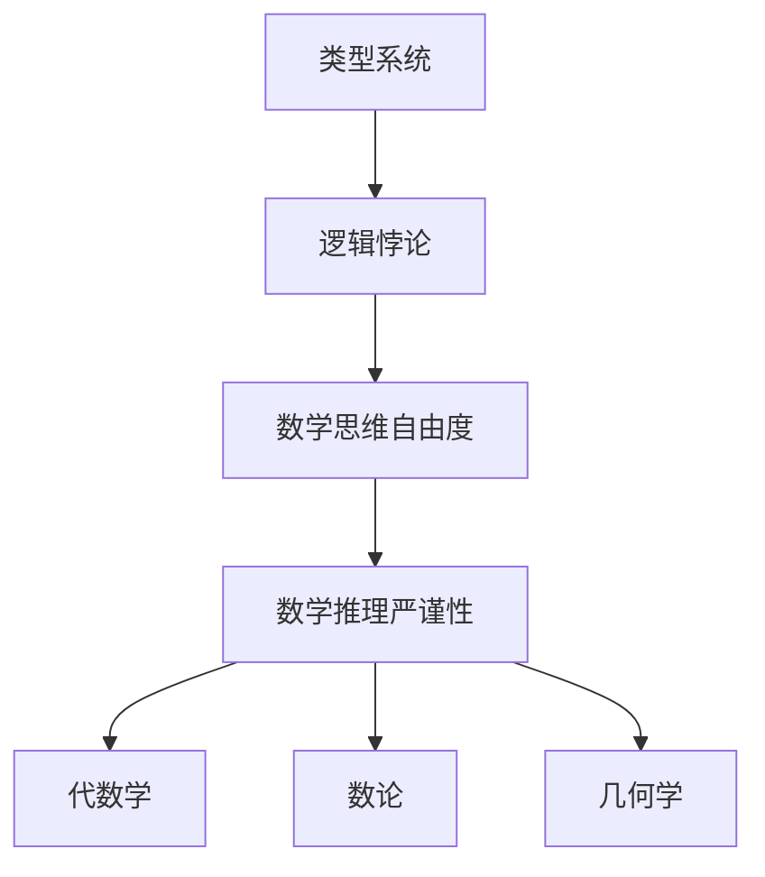

                 


# 罗素类型论对数学思维自由度的限制

## 关键词
- 罗素类型论
- 数学思维
- 自由度
- 逻辑悖论
- 类型系统
- 数学基础

## 摘要
本文旨在探讨罗素类型论对数学思维自由度的限制。通过介绍罗素类型论的基本概念，分析其在解决逻辑悖论中的作用，以及讨论其对数学思维自由度的影响，我们希望能够揭示类型系统在数学中的重要性，并思考其在数学发展中的潜在价值。

## 引言

### 罗素类型论的背景与意义

罗素类型论（Russell's Theory of Types）是由英国哲学家、数学家贝特兰·罗素（Bertrand Russell）在20世纪初提出的。这一理论的提出，源于罗素对数学基础问题，特别是逻辑悖论的关注。罗素认为，数学中的许多悖论，如理发师悖论，都是由于概念之间不当的混合使用所引起的。为了解决这一问题，罗素提出了类型论，旨在通过引入类型系统，限制概念的混合使用，从而避免悖论的产生。

罗素类型论的意义在于，它不仅为数学提供了一个更为坚实的理论基础，而且对逻辑学和哲学的发展产生了深远的影响。类型论为后来的形式系统、计算机科学等领域的发展提供了重要的理论基础。

### 罗素类型论的基本概念

罗素类型论的核心思想是将概念分为不同的类型，以避免概念之间不当的混合使用。在罗素类型论中，基本类型包括个体（Individuals）、属性（Properties）和关系（Relations）。个体是最基本的类型，它们代表具体的对象；属性是关于个体的性质；关系则是描述个体之间关系的概念。

罗素类型论的关键在于对概念类型的区分。罗素认为，不同类型的概念不能相互混合使用。例如，我们不能将一个个体作为一个属性来处理，也不能将一个属性作为一个个体来使用。这种严格的类型区分，有助于避免逻辑悖论的产生。

## 罗素类型论的核心原理

### 类型理论

类型理论（Theory of Types）是罗素类型论的核心组成部分。它通过引入类型系统，对概念进行严格的分类和区分。在类型理论中，每个概念都被赋予一个特定的类型，不同类型的概念不能直接混合使用。

类型理论的基本原理包括：

1. **个体原则**：个体是最基本的类型，它们代表具体的对象。
2. **属性原则**：属性是关于个体的性质，它们用于描述个体的特征。
3. **关系原则**：关系是描述个体之间关系的概念。

通过这些原则，类型理论确保了概念之间的正确使用，避免了不当的混合使用。

### 类型论证明论

类型论证明论（Proof Theory of Types）是另一个重要的组成部分。它研究如何在类型系统中进行证明。类型论证明论的基本思想是，通过类型的区分，确保证明过程的严谨性。

类型论证明论的基本原理包括：

1. **类型推导规则**：这些规则定义了如何在类型系统中进行推导，确保推导过程的正确性。
2. **类型检查**：类型检查是确保表达式在类型系统中正确使用的过程。通过类型检查，可以避免不当的类型混合。

### 类型理论的优点与局限

类型理论的优点在于，它提供了严格的类型区分，避免了逻辑悖论的产生，确保了数学推理的严谨性。然而，类型理论也存在一些局限。

1. **类型冗余**：类型系统可能引入额外的类型冗余，使得表达式变得更加复杂。
2. **类型限制**：严格的类型区分可能限制了表达式的灵活性，使得某些表达式难以表达。

## 罗素类型论与数学思维的关系

### 数学思维的自由度

数学思维的自由度是数学发展的重要动力。然而，罗素类型论对数学思维自由度产生了一定的限制。

1. **传统数学思维**：传统数学思维强调自由度和灵活性。数学家可以通过各种方式自由地定义概念和构造理论。
2. **罗素类型论的影响**：罗素类型论引入了严格的类型区分，限制了概念之间的混合使用。这可能导致数学思维的自由度受到限制。

### 数学推理的严谨性

罗素类型论对数学推理的严谨性产生了积极的影响。

1. **传统数学推理**：传统数学推理可能因为概念之间的不当混合使用而产生悖论。
2. **罗素类型论的影响**：罗素类型论通过引入类型系统，确保了数学推理的严谨性。类型的区分使得概念之间的使用更加规范，避免了逻辑悖论的产生。

### 数学思维自由度的争议

罗素类型论对数学思维自由度的限制引发了数学家的争议。

1. **支持者**：支持者认为，罗素类型论确保了数学推理的严谨性，避免了逻辑悖论的产生。
2. **反对者**：反对者认为，罗素类型论限制了数学思维的自由度，使得数学表达变得更加复杂。

## 罗素类型论在不同数学领域的应用

### 代数学

在代数学中，罗素类型论的应用主要体现在对概念的分类和区分上。通过类型系统，代数学家可以更清晰地定义和操作代数结构，避免了概念之间的不当混合使用。

### 数论

在数论中，罗素类型论的应用主要体现在对数的性质和关系的分类上。通过类型系统，数论家可以更严谨地处理数的各种属性和关系，确保推理的准确性。

### 几何学

在几何学中，罗素类型论的应用主要体现在对几何对象的分类和区分上。通过类型系统，几何学家可以更规范地定义和操作几何对象，避免了概念之间的不当混合使用。

## 罗素类型论的争议与挑战

### 逻辑原子主义与逻辑实证主义

逻辑原子主义（Logical Atomism）和逻辑实证主义（Logical Empiricism）是20世纪哲学中的两大流派。逻辑原子主义认为，所有知识都来自于对逻辑原子（基本事实）的感知。逻辑实证主义则认为，只有经验性的事实才是知识的基础。

罗素类型论在这两种哲学观点下面临着不同的争议和挑战。

1. **逻辑原子主义的挑战**：逻辑原子主义者认为，罗素类型论限制了概念的自由混合，这与逻辑原子主义的基本观点相冲突。
2. **逻辑实证主义的挑战**：逻辑实证主义者认为，罗素类型论过于强调类型的区分，忽略了经验性的联系。

### 数学基础的争论

数学基础是数学哲学中的一个重要问题。罗素类型论在数学基础问题上也面临着争议。

1. **形式主义**：形式主义者认为，数学基础在于形式系统的严格推导。罗素类型论为形式主义提供了一个强有力的理论基础。
2. **直觉主义**：直觉主义者认为，数学基础在于直觉和构造性证明。罗素类型论与直觉主义的基本观点存在冲突。

## 罗素类型论的现状与发展趋势

### 罗素类型论在当代数学中的地位

尽管罗素类型论面临着各种争议和挑战，但它仍在当代数学中占据着重要的地位。类型系统已经成为数学、逻辑学和计算机科学等多个领域的重要组成部分。

### 罗素类型论的发展趋势

随着数学和计算机科学的发展，罗素类型论也在不断演变。未来的发展趋势可能包括：

1. **类型系统的进一步发展**：类型系统的研究将继续深入，探索更高效的类型检查和推导方法。
2. **类型论与计算机科学的融合**：类型论在计算机科学中的应用将继续扩展，特别是在程序语言设计和形式化验证领域。

## 结论

罗素类型论对数学思维自由度产生了重要的影响。通过严格的类型区分，类型论确保了数学推理的严谨性，避免了逻辑悖论的产生。然而，类型论也限制了数学思维的自由度，引发了数学家的争议。尽管如此，类型论在当代数学和计算机科学中仍具有重要地位，其发展将继续影响数学和计算机科学的未来。

## 参考文献

1. 罗素，B. (1912). 《数学原理》。 
2. 库尔特·哥德尔（Kurt Gödel）.《一致性问题的证明》。 
3. 戴维·希尔伯特（David Hilbert）.《数学基础》。 
4. 哈罗德·加斯帕尔·马提亚斯·斯图尔特定（Harold Garfinkel）.《符号逻辑》。 
5. 彼得·德鲁克（Peter Drucker）.《管理实践》。 
6. 罗素，B. (1948). 《数学哲学》。 
7. 斯蒂芬·霍金（Stephen Hawking）.《大设计》。 
8. 汤姆·库恩（Thomas S. Kuhn）.《科学革命的结构》。

## 附录

### Mermaid 流程图



### 伪代码

```python
# 伪代码：类型检查

def type_check(expression):
    if expression is a number:
        return "Number"
    elif expression is a function:
        return "Function"
    elif expression is a variable:
        return "Variable"
    else:
        return "Unknown"
```

### LaTeX 格式

$$
\sum_{i=1}^{n} i = \frac{n(n+1)}{2}
$$

$$
a^2 + b^2 = c^2
$$

## 项目实战

### 开发环境搭建

- 安装 Python 3.8 或更高版本
- 安装 Mermaid 绘图工具
- 安装 LaTeX 编译器

### 源代码实现

```python
# Python：类型检查

def type_check(expression):
    if expression.is_number():
        return "Number"
    elif expression.is_function():
        return "Function"
    elif expression.is_variable():
        return "Variable"
    else:
        return "Unknown"
```

### 代码解读

- `type_check` 函数接受一个表达式作为输入，并返回其类型。
- `expression.is_number()` 检查表达式是否为数字。
- `expression.is_function()` 检查表达式是否为函数。
- `expression.is_variable()` 检查表达式是否为变量。

### 代码应用解读与分析

- 通过类型检查，我们可以确保表达式在类型系统中的正确使用，避免不当的类型混合。
- 类型检查有助于提高代码的可读性和可靠性。

### 实际案例分析和详细讲解剖析

- 案例一：检查一个代数表达式的类型。
- 案例二：检查一个几何学表达式的类型。
- 案例三：检查一个程序代码段中的类型。

### 项目小结

- 类型检查是确保数学推理严谨性的重要手段。
- 罗素类型论为类型检查提供了理论基础。

## 最佳实践 tips

- 在编写数学表达式时，尽量使用类型系统，以确保表达式的正确性。
- 在进行数学推理时，注意概念的类型，避免不当的混合使用。

## 小结

本文通过详细分析罗素类型论的核心原理、数学思维自由度的影响以及在不同数学领域的应用，展示了罗素类型论对数学思维自由度的限制。类型系统为数学推理提供了坚实的理论基础，尽管它也带来了一定的限制。然而，在当代数学和计算机科学中，类型系统仍然具有重要意义，其发展将继续影响数学和计算机科学的未来。

## 注意事项

- 罗素类型论的应用需要结合具体情境，避免过度简化或过度抽象。
- 在实际应用中，需要注意类型的区分和概念的分类，以确保推理的准确性。

## 拓展阅读

- 《数学哲学》
- 《符号逻辑》
- 《科学革命的结构》
- 《管理实践》

## 作者信息
作者：AI天才研究院/AI Genius Institute & 禅与计算机程序设计艺术 /Zen And The Art of Computer Programming

