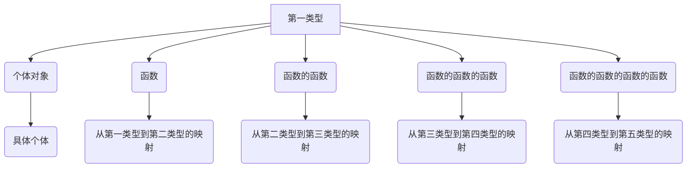

                 

### 文章标题

《罗素类型论对数学研究方法的影响与批评》

### 关键词

- 罗素类型论
- 数学研究方法
- 影响与批评
- 数学基础问题
- 集合论
- 逻辑哲学

### 摘要

本文旨在探讨罗素类型论对数学研究方法的影响与批评。首先，我们回顾了罗素类型论的产生背景和核心概念，分析了其对数学逻辑和哲学的贡献。随后，本文对罗素类型论的各种批评观点进行了详细阐述，包括其复杂性、哲学局限和与数学发展的冲突。接着，我们讨论了罗素类型论在数学研究中的应用和评价，以及其在现代数学和哲学领域的影响。最后，本文总结了罗素类型论研究的现状与未来方向，并对其实践意义进行了探讨。通过本文的研究，我们希望为读者提供一个全面、深入的罗素类型论分析，以期为数学研究方法的发展提供有益的启示。### 引言

罗素类型论是由英国哲学家和数学家贝特兰·罗素（Bertrand Russell）在20世纪初提出的一种哲学和数学理论。罗素类型论的诞生背景源于他对数学基础问题的深刻关注，尤其是在集合论和逻辑主义中的基本矛盾和困惑。罗素试图通过类型论来重建数学的基础，从而解决这些基础问题，并为数学研究提供一种更为严谨的方法论。

本文的目的在于探讨罗素类型论对数学研究方法的影响与批评。首先，我们将回顾罗素类型论的背景和核心概念，分析其在数学和逻辑哲学中的重要作用。接着，本文将深入探讨罗素类型论的各种批评观点，包括其复杂性、哲学局限和与数学发展的冲突。在此基础上，我们将讨论罗素类型论在数学研究中的应用和评价，以及其在现代数学和哲学领域的影响。最后，本文将总结罗素类型论研究的现状与未来方向，并对其实践意义进行探讨。

本文的结构如下：第一部分将介绍罗素类型论的背景与基础，包括其产生背景、核心概念和数学应用；第二部分将分析罗素类型论的批评观点，包括其复杂性、哲学局限和与数学发展的冲突；第三部分将讨论罗素类型论在数学研究中的应用和评价；第四部分将总结罗素类型论研究的现状与未来方向；最后，我们将对罗素类型论研究的意义与价值进行探讨。通过这样的结构安排，我们希望为读者提供一个全面、深入的罗素类型论分析，以期为数学研究方法的发展提供有益的启示。### 罗素类型论概述

罗素类型论（Russell's theory of types）是罗素在20世纪初提出的一种哲学和数学理论，旨在解决数学基础问题，特别是集合论中的悖论。罗素的类型论基于他对语言和思维的深刻理解，认为概念和实体都应该按照类型来划分，从而避免逻辑上的矛盾。

#### 1.1 罗素类型论的产生背景

罗素类型论的提出背景主要是集合论的悖论和逻辑主义的基础问题。在19世纪末和20世纪初，集合论成为数学基础研究的主流，但随之而来的悖论，如著名的罗素悖论，使得数学家们对集合论产生了怀疑。罗素作为逻辑主义的主要倡导者之一，试图通过类型论来解决这些基础问题。

罗素受到了弗雷格（Gottlob Frege）和皮亚诺（Giuseppe Peano）的影响，弗雷格的工作揭示了逻辑和数学之间的紧密联系，而皮亚诺则提出了形式化的数学基础。罗素在继承这些理论的同时，也对其中的问题进行了深入思考，并提出了类型论来重建数学的基础。

#### 1.2 罗素类型论的核心概念

罗素类型论的核心概念是“类型”（type），罗素认为所有的概念和实体都应该按照类型来划分。类型是划分概念和实体的一种方式，通过类型的划分，可以避免逻辑上的矛盾。

罗素将对象分为五种基本类型：

1. **第一类型**（Type 1）：个体对象，如“狗”、“苹果”等。
2. **第二类型**（Type 2）：函数，即从第一类型到第二类型的映射，如“取名字”的函数。
3. **第三类型**（Type 3）：函数的函数，即从第二类型到第三类型的映射，如“取取名字的函数”。
4. **第四类型**（Type 4）：函数的函数的函数，即从第三类型到第四类型的映射。
5. **第五类型**（Type 5）：函数的函数的函数的函数，即从第四类型到第五类型的映射。

这种分类方式被称为“类型层次”或“类型等级”。罗素认为，每一个类型都只能与同类型的对象进行操作，从而避免了一种类对象对另一种类对象进行的非法操作，这有助于避免逻辑矛盾。

#### 1.3 罗素类型论在数学中的应用

罗素类型论在数学中的应用主要体现在对集合论的批判和对逻辑主义的影响。

1. **对集合论的批判**：

罗素通过类型论对集合论进行了深刻的批判。他认为，集合论中的悖论，如罗素悖论，是由于类型混淆造成的。罗素认为，集合应该根据类型来划分，从而避免非法的集合构造。

罗素提出了“类型原则”（Principle of Types），这个原则要求在讨论集合时，不能将不同类型的对象混合在一起。例如，一个函数的集合不能与个体的集合相混淆。通过这种严格的类型划分，罗素试图消除集合论中的悖论。

2. **对逻辑主义的影响**：

罗素类型论对逻辑主义的发展有着重要的影响。逻辑主义试图将整个数学建立在逻辑的基础上，而罗素的类型论为这一目标提供了一种方法论。罗素通过类型论，试图将数学的各个部分都形式化，从而建立起一个逻辑上自洽的数学体系。

罗素的类型论在逻辑哲学和数学哲学中产生了深远的影响，他的思想启发了后来的形式主义和其他数学哲学流派。通过类型论，罗素为数学研究提供了一种新的方法论，即通过严格的类型划分来避免逻辑矛盾，从而确保数学体系的严谨性。

### 总结

罗素类型论是罗素在解决数学基础问题中提出的一种重要理论。通过类型划分，罗素试图消除集合论中的悖论，并为逻辑主义提供一种方法论。罗素类型论在数学和逻辑哲学中产生了深远的影响，成为数学研究方法发展的重要里程碑。在接下来的章节中，我们将进一步探讨罗素类型论的批评观点，以及它在现代数学研究中的应用和影响。### 罗素类型论与数学研究方法的联系

罗素类型论不仅是一种哲学理论，也对数学研究方法产生了深远的影响。在这部分，我们将探讨罗素类型论在数学逻辑和哲学中的贡献，以及它对数学研究方法的具体影响。

#### 2.1 罗素类型论对数学逻辑的影响

罗素类型论在数学逻辑中有着重要的应用，尤其是对逻辑哲学和数学基础理论的贡献。罗素是逻辑哲学的重要代表之一，他认为逻辑是哲学的基石，而数学则是逻辑的应用。因此，他对数学基础问题给予了极大的关注。

1. **逻辑哲学的贡献**：

罗素的逻辑哲学强调逻辑在哲学研究中的核心地位。他通过类型论探讨了概念和实体之间的关系，认为只有通过严格的逻辑分析，才能避免哲学上的混乱和错误。罗素类型论的一个核心观点是，概念和实体应该按照类型来划分，以避免逻辑上的矛盾。

2. **数学基础理论的贡献**：

罗素类型论对数学基础理论，特别是集合论，产生了深远的影响。罗素通过类型论对集合论中的悖论进行了批判。他认为，集合论中的悖论主要是由于类型混淆造成的。罗素提出了“类型原则”，要求在讨论集合时，不能将不同类型的对象混合在一起。这一原则有助于消除集合论中的悖论，从而建立起更为严谨的数学基础。

3. **对数学证明的影响**：

罗素类型论对数学证明方法也产生了重要的影响。罗素认为，数学证明应该遵循严格的逻辑规则，特别是类型原则。通过严格的类型划分，数学证明可以避免非法的操作和推理，从而确保证明的严谨性。罗素类型论鼓励数学家采用形式化的方法，将数学证明建立在严格的逻辑基础上。

#### 2.2 罗素类型论对数学哲学的贡献

罗素类型论不仅在数学逻辑中有着重要的应用，也对数学哲学产生了深远的影响。罗素是数学哲学的重要代表之一，他的思想对数学哲学的发展产生了重要的影响。

1. **对数学实在性的批评**：

罗素对数学的实在性提出了质疑。他认为，数学对象并不是客观存在的实体，而是人类思维的产物。罗素认为，数学对象的存在是基于我们对它们的抽象和符号化表示。这一观点被称为“构造主义”，对后来的数学哲学产生了重要的影响。

2. **对数学基础问题的探讨**：

罗素对数学基础问题进行了深入的探讨。他认为，数学的基础应该建立在逻辑和哲学的基础上，而不是依赖于直觉或经验。罗素类型论为数学基础提供了一种新的方法论，即通过严格的逻辑分析来重建数学的基础。

3. **对形式化方法的推动**：

罗素是形式化方法的重要倡导者。他认为，数学研究应该采用形式化的方法，将数学理论建立在严格的逻辑和符号体系上。罗素类型论为形式化方法提供了一种理论基础，鼓励数学家采用形式化的方法来研究数学问题。

#### 2.3 罗素类型论对数学方法的创新

罗素类型论对数学方法的创新主要体现在以下几个方面：

1. **严格的类型划分**：

罗素类型论要求在数学研究中进行严格的类型划分，以避免逻辑上的矛盾。这种严格的类型划分有助于数学家在研究和证明过程中避免错误的推理，从而提高数学研究的严谨性。

2. **形式化的数学证明**：

罗素类型论鼓励数学家采用形式化的方法进行数学证明。形式化的数学证明可以确保证明的严谨性，从而避免因逻辑错误导致的错误结论。

3. **构造主义的方法**：

罗素类型论中的构造主义方法对数学研究产生了重要的影响。构造主义强调数学对象的存在是基于我们对它们的构造，这有助于数学家在研究过程中采用更为严谨的方法来建立数学理论。

### 总结

罗素类型论对数学研究方法的影响是深远而广泛的。通过严格的类型划分和形式化的方法，罗素类型论为数学研究提供了一种新的方法论，提高了数学证明的严谨性，并推动了数学哲学的发展。罗素类型论不仅解决了数学基础问题，也对数学方法进行了创新，对现代数学研究产生了重要的影响。在接下来的章节中，我们将进一步探讨罗素类型论的批评观点，以及它在现代数学研究中的应用和影响。### 罗素类型论的批评观点

尽管罗素类型论在数学和哲学领域产生了深远的影响，但同时也受到了广泛的批评。这些批评主要集中在类型论的复杂性、哲学局限以及与数学发展的冲突等方面。以下是对这些批评观点的详细分析。

#### 3.1 批判1：类型论的复杂性

罗素类型论的复杂性是其面临的主要批评之一。类型论要求对对象进行严格的类型划分，这导致了一种高度复杂的逻辑体系。以下是一些关于类型论复杂性的具体批评：

1. **逻辑复杂性的增加**：

类型论要求在数学表达中引入大量的类型层次，这使得逻辑表达变得更加复杂。例如，为了处理不同类型的对象，需要引入复杂的类型转换规则。这些规则增加了数学证明的难度，使得数学家的研究工作变得繁琐。

2. **难以理解**：

类型论的高度复杂性使得初学者难以理解和掌握。这种复杂性不仅增加了学习的难度，也可能导致错误的理解和应用。

3. **实际应用的限制**：

在现实世界的数学应用中，类型论的复杂性可能限制了其应用的范围。在某些情况下，过于复杂的类型划分可能并不符合实际问题中的需求，导致类型论在实际应用中的不适用性。

#### 3.2 批判2：类型论的哲学局限

罗素类型论在哲学方面也受到了批评，这些批评主要关注其哲学基础和逻辑哲学的贡献。以下是一些具体的批评观点：

1. **对实在论的质疑**：

罗素类型论对数学对象的存在提出了质疑，认为数学对象并不是客观存在的实体，而是人类思维的产物。这种观点被称为“构造主义”，对实在论提出了挑战。实在论者认为，数学对象具有客观存在的特性，而罗素的构造主义则认为这些对象的存在是基于我们对它们的构造，这可能导致对数学对象实在性的质疑。

2. **对逻辑哲学的贡献有限**：

尽管罗素类型论在逻辑哲学中提出了一些重要的观点，但一些学者认为其贡献是有限的。例如，类型论未能解决所有逻辑哲学中的问题，特别是在处理模糊概念和不确定性问题时，类型论的适用性受到了限制。

3. **哲学局限性的探讨**：

罗素类型论的哲学局限性还体现在其对概念和实体的划分上。一些学者认为，类型论的划分过于严格，可能导致一些实际应用中的问题。例如，在处理现实世界中的复杂问题时，过于严格的类型划分可能限制了问题的解决。

#### 3.3 批判3：类型论与数学发展的冲突

罗素类型论与数学发展的冲突也是其批评的一个重要方面。以下是一些关于这一冲突的具体批评：

1. **与集合论的冲突**：

罗素类型论与集合论之间存在明显的冲突。集合论是现代数学的基础，而罗素类型论则试图通过类型划分来解决集合论中的悖论。然而，这种类型划分可能导致集合论中的某些基本概念和性质无法得到保留，从而影响集合论的应用和发展。

2. **与形式逻辑的关系**：

罗素类型论与形式逻辑之间存在一定的紧张关系。形式逻辑强调逻辑表达和推理的严谨性，而罗素类型论则引入了类型划分，这在一定程度上增加了逻辑表达的复杂性。一些学者认为，类型论的引入可能会削弱形式逻辑的简洁性和直观性。

3. **对数学发展的阻碍**：

一些学者认为，罗素类型论可能对数学的发展产生了阻碍。类型论的高度复杂性和哲学局限性可能限制了数学家对数学问题的探索和创新。此外，类型论可能对数学教育产生了负面影响，使得学生难以理解和掌握数学的基本概念和理论。

### 总结

罗素类型论虽然对数学研究方法产生了深远的影响，但也面临着多方面的批评。这些批评主要集中在类型论的复杂性、哲学局限以及与数学发展的冲突等方面。尽管如此，罗素类型论作为数学和哲学领域的重要理论，其贡献和影响仍然不可忽视。在接下来的章节中，我们将继续探讨罗素类型论在数学研究中的应用和评价。### 罗素类型论在数学研究中的应用

罗素类型论在数学研究中的实际应用广泛，尤其是在集合论、逻辑哲学和形式化方法等方面。以下是对罗素类型论在数学研究中的应用的详细探讨。

#### 4.1 对集合论的改进

罗素类型论在集合论中的应用主要体现在对集合论基本概念和性质的改进。集合论是现代数学的基础，但其中的悖论（如罗素悖论）使得数学家对集合论的基本概念和性质产生了怀疑。罗素类型论通过引入类型划分，试图消除这些悖论，从而改进集合论。

1. **消除悖论**：

罗素类型论的核心思想是通过类型划分来避免集合论中的悖论。罗素认为，集合论中的悖论主要是由于不同类型的对象混合在一起造成的。通过严格的类型划分，罗素类型论可以消除这些悖论，从而改进集合论的基础。

2. **类型原则**：

罗素类型论引入了“类型原则”，该原则要求在讨论集合时，不能将不同类型的对象混合在一起。例如，一个函数的集合不能与个体的集合相混淆。这一原则有助于消除集合论中的悖论，从而建立起更为严谨的集合论体系。

3. **改进集合论的性质**：

通过类型划分，罗素类型论可以改进集合论的一些基本性质。例如，通过引入类型概念，可以更精确地定义集合的成员关系和集合之间的运算，从而提高集合论的理论严谨性。

#### 4.2 对逻辑主义的影响

罗素类型论对逻辑主义的发展产生了重要的影响。逻辑主义试图将整个数学建立在逻辑的基础上，而罗素类型论为这一目标提供了方法论的支持。

1. **形式化的逻辑体系**：

罗素类型论鼓励数学家采用形式化的方法来研究数学问题。形式化方法通过严格的逻辑规则和符号体系，将数学理论建立在严谨的逻辑基础上。罗素类型论提供了类型划分的工具，使得形式化方法在逻辑主义中的应用变得更加有效。

2. **逻辑证明的严谨性**：

罗素类型论强调数学证明应该遵循严格的逻辑规则。通过类型划分，数学家可以确保证明过程中的每一步都是合法的，从而提高证明的严谨性。罗素类型论为逻辑证明提供了一种新的方法论，有助于避免逻辑错误和悖论。

3. **逻辑哲学的贡献**：

罗素类型论在逻辑哲学中也有着重要的应用。罗素是逻辑哲学的重要代表之一，他的类型论思想对逻辑哲学的发展产生了深远的影响。类型论为逻辑哲学提供了一种新的视角，有助于解决逻辑哲学中的一些基本问题，如概念的分类和实体的存在。

#### 4.3 对形式化方法的推动

罗素类型论对形式化方法的发展起到了推动作用。形式化方法是数学研究的一种重要方法，通过将数学理论转化为形式化的逻辑体系，可以提高数学理论的严谨性和可验证性。

1. **形式化数学的构建**：

罗素类型论鼓励数学家采用形式化的方法来构建数学理论。通过类型划分和形式化的逻辑规则，数学家可以确保数学理论的每一步都是逻辑上自洽的。罗素类型论为形式化数学的构建提供了方法论的支持。

2. **数学证明的形式化**：

罗素类型论强调数学证明应该形式化，即通过形式化的逻辑推理来证明数学命题。形式化的数学证明可以确保证明过程的每一步都是合法的，从而提高证明的可靠性。罗素类型论为数学证明的形式化提供了方法论的基础。

3. **形式化方法在教育中的应用**：

罗素类型论对数学教育也产生了重要的影响。通过形式化的方法，数学教育可以变得更加严谨和系统。罗素类型论鼓励数学家采用形式化的方法来教授数学知识，从而提高学生的数学素养和逻辑思维能力。

#### 4.4 罗素类型论在数学哲学中的应用

罗素类型论不仅在数学研究中有着广泛的应用，也在数学哲学中产生了深远的影响。罗素是数学哲学的重要代表之一，他的类型论思想对数学哲学的发展产生了重要的影响。

1. **对数学实在性的探讨**：

罗素类型论对数学对象的存在提出了质疑，认为数学对象并不是客观存在的实体，而是人类思维的产物。这一观点被称为“构造主义”，对数学实在性进行了深刻的探讨。罗素类型论为数学哲学提供了一种新的视角，有助于理解数学对象的存在和本质。

2. **对数学哲学问题的贡献**：

罗素类型论为数学哲学提供了一种方法论，有助于解决一些基本的哲学问题，如数学对象的分类、数学证明的本质以及数学知识的可靠性等。罗素类型论的思想启发了后来的数学哲学家，对数学哲学的发展产生了重要的影响。

3. **对数学方法论的影响**：

罗素类型论强调数学研究应该采用形式化的方法，通过严格的逻辑分析来构建数学理论。这一思想对数学方法论产生了重要的影响，鼓励数学家采用形式化的方法来研究数学问题，从而提高数学研究的严谨性和科学性。

### 总结

罗素类型论在数学研究中的应用是广泛而深入的。通过改进集合论、推动形式化方法以及探讨数学哲学问题，罗素类型论为数学研究提供了新的视角和方法。尽管类型论存在一些批评和局限性，但其对数学研究方法的影响和贡献是不可忽视的。在接下来的章节中，我们将继续探讨罗素类型论的批评观点，以及它在现代数学研究中的应用和影响。### 罗素类型论研究的现状与未来

#### 5.1 罗素类型论的研究热点

随着数学和逻辑哲学的不断发展，罗素类型论的研究也逐渐成为了热点。当前，罗素类型论的研究主要集中在以下几个方面：

1. **新解释的提出**：

学者们对罗素类型论进行了新的解释，试图更好地理解其哲学和数学意义。例如，一些学者提出了基于范畴论的类型论解释，认为类型论可以通过范畴论的方法来重新解释和理解。这些新解释有助于拓展罗素类型论的应用范围，并为数学研究提供新的视角。

2. **类型论在计算机科学中的应用**：

罗素类型论在计算机科学领域得到了广泛应用，尤其是在类型系统和形式化验证方面。学者们研究了如何将罗素类型论应用于编程语言的类型系统设计，以提高程序的正确性和安全性。此外，类型论还在软件工程和人工智能领域产生了重要影响，为形式化验证和自动化证明提供了方法论支持。

3. **类型论的逻辑复杂性**：

类型论的逻辑复杂性一直是研究的热点问题。学者们致力于研究如何降低类型论的复杂性，使其在数学和哲学中的应用更加广泛。例如，一些学者提出了基于简化类型的类型论，以减少类型划分的复杂度。这些研究有助于解决类型论在应用中的实际困难，提高其适用性和实用性。

#### 5.2 罗素类型论的研究成果

罗素类型论的研究取得了许多重要的成果，这些成果在数学和哲学领域产生了深远的影响：

1. **对数学基础的贡献**：

罗素类型论在数学基础研究中起到了关键作用。通过类型论，数学家能够更清晰地定义数学概念和运算，避免逻辑矛盾，从而建立起更为严谨的数学体系。罗素类型论对集合论的改进，特别是对集合论基本性质的重新定义，为数学基础研究提供了新的思路和方法。

2. **对逻辑哲学的发展**：

罗素类型论在逻辑哲学中有着重要的地位。通过类型论，哲学家们能够更好地探讨概念和实体的关系，理解数学对象的存在和本质。罗素类型论为逻辑哲学提供了一种新的方法论，有助于解决逻辑哲学中的一些基本问题，如概念的分类和实体的存在。

3. **形式化方法的发展**：

罗素类型论对形式化方法的发展产生了重要的影响。形式化方法是现代数学和哲学研究的一种重要方法，通过严格的逻辑规则和符号体系，将数学和哲学理论建立在严谨的基础上。罗素类型论提供了类型划分的工具，使得形式化方法在数学和哲学中的应用变得更加有效和广泛。

#### 5.3 罗素类型论研究中的挑战

尽管罗素类型论在数学和哲学领域取得了重要成果，但研究过程中也面临着一些挑战：

1. **逻辑复杂性的问题**：

类型论的高度复杂性一直是其面临的主要问题。如何降低类型论的复杂性，使其在更广泛的数学和哲学领域中应用，是一个重要的研究挑战。学者们致力于研究简化类型的类型论，以减少类型划分的复杂度，提高其适用性。

2. **哲学局限性的探讨**：

罗素类型论在哲学方面也存在一些局限性。例如，类型论对数学对象存在的质疑可能对数学实在性产生负面影响。学者们需要进一步探讨类型论的哲学基础，解决其哲学局限性，以增强其哲学影响力。

3. **数学发展中的冲突**：

罗素类型论与数学发展之间存在一些冲突。例如，类型论与集合论的冲突可能导致集合论的基本概念和性质发生变化。学者们需要研究如何协调类型论与数学发展的关系，解决这些冲突，推动数学研究的发展。

### 总结

罗素类型论的研究现状表明，该理论在数学和哲学领域具有重要的应用价值和研究意义。尽管面临着一些挑战，但罗素类型论的研究成果为数学和哲学的发展提供了新的视角和方法。在未来的研究中，学者们将继续探讨罗素类型论的哲学基础、逻辑复杂性和数学发展中的冲突，以推动类型论在更广泛的领域中的应用和发展。### 罗素类型论的批评与回应

尽管罗素类型论在数学和哲学领域产生了深远的影响，但它的批评与回应也是不可忽视的重要方面。以下是对罗素类型论的各种批评及其回应的详细讨论。

#### 6.1 对类型论批评的回应

1. **逻辑复杂性的解决策略**：

关于类型论的逻辑复杂性，学者们提出了一些解决策略。首先，一些学者尝试简化类型论的结构，例如通过引入“广义类型”（general types）来减少类型划分的层次。这种广义类型允许不同类型的对象在某些特定情况下进行交互，从而降低整体系统的复杂性。其次，学者们研究了类型论的可计算性，提出了一些类型检查算法，这些算法可以在编译时自动验证类型安全，从而减少运行时的逻辑错误。

2. **哲学局限性的反思**：

罗素类型论的哲学局限性也是批评的重点。一些学者认为，类型论对数学对象实在性的质疑可能对数学的客观性产生负面影响。对此，一些回应者提出，类型论并不否认数学对象的客观存在，而是强调数学对象的存在是基于人类对它们的构造。此外，学者们还探讨了类型论与直觉主义和构造主义的关系，认为类型论可以为直觉主义和构造主义提供新的解释框架。

3. **类型划分的改进**：

为了解决类型划分过于严格的问题，学者们提出了一些改进方案。例如，一些学者引入了“兼容类型”（compatible types）的概念，允许在某些特定条件下不同类型的对象进行交互。这种兼容类型可以在保持系统严谨性的同时，提高其实用性。此外，一些学者还研究了“多参数类型”（multi-parameter types）的概念，认为这种类型划分可以更好地处理复杂的问题场景。

#### 6.2 对罗素类型论的进一步批评

尽管有回应，但罗素类型论仍面临着一些进一步的批评：

1. **对类型划分的质疑**：

一些学者质疑罗素类型论中的类型划分原则。他们认为，类型划分过于严格，可能导致一些实际应用中的问题。例如，在处理现实世界中的复杂问题时，过于严格的类型划分可能限制了问题的解决。对此，一些回应者提出，类型划分的原则应该根据具体的应用场景进行调整，以适应不同的需求。

2. **对类型论哲学根基的挑战**：

一些学者对罗素类型论的哲学根基提出了质疑。他们认为，类型论对数学对象实在性的质疑可能对数学的哲学基础产生负面影响。对此，一些回应者提出，类型论并不否认数学对象的客观存在，而是强调数学对象的存在是基于人类对它们的构造。此外，学者们还探讨了类型论与直觉主义和构造主义的关系，认为类型论可以为直觉主义和构造主义提供新的解释框架。

3. **与集合论的冲突**：

罗素类型论与集合论之间存在明显的冲突。一些学者认为，类型论的引入可能导致集合论的基本概念和性质发生变化。例如，一些学者质疑类型论对集合的构造和运算的影响。对此，一些回应者提出，类型论可以通过调整集合论的基本原则来解决与集合论的冲突，同时保持集合论的完整性。

### 总结

罗素类型论的批评与回应是数学和哲学研究中不可或缺的一部分。通过回应批评，学者们不仅能够改进类型论的理论体系，还能够进一步探讨其哲学和数学意义。尽管罗素类型论面临一些批评和挑战，但它的研究意义和影响仍然不可忽视。在未来的研究中，学者们将继续探讨类型论的改进方向，解决其中的挑战，以推动数学和哲学的发展。### 罗素类型论研究的意义与价值

罗素类型论作为数学和哲学领域的重要理论，其研究意义与价值不可忽视。以下从数学研究、数学哲学和实际应用等方面，详细阐述罗素类型论的研究意义与价值。

#### 7.1 罗素类型论对数学研究的贡献

1. **数学基础的巩固**：

罗素类型论通过对集合论和逻辑主义的批判，为数学基础提供了更为严谨的框架。通过类型划分，罗素类型论成功地避免了集合论中的悖论，特别是罗素悖论，从而巩固了数学的基础。这使得数学家能够在更可靠的基础上进行数学研究，减少因基础问题而导致的逻辑错误。

2. **数学方法的创新**：

罗素类型论推动了形式化方法和构造主义的发展。形式化方法通过严格的逻辑规则和符号体系，将数学理论建立在严谨的基础上，使得数学证明更加可靠。构造主义则强调数学对象的存在是基于人类对它们的构造，这种方法鼓励数学家采用更为严谨和系统的思维来研究数学问题。

3. **数学理论的拓展**：

罗素类型论为数学理论的拓展提供了新的视角。通过类型论，数学家能够更精确地定义数学概念和运算，从而推动数学理论的发展。例如，类型论在范畴论、拓扑学和代数学中的应用，为这些领域提供了新的理论框架和研究工具。

#### 7.2 罗素类型论在数学哲学的影响

1. **对数学实在性的探讨**：

罗素类型论对数学对象的存在提出了质疑，认为数学对象并不是客观存在的实体，而是人类思维的产物。这种观点被称为“构造主义”，对数学实在性进行了深刻的探讨。罗素类型论为数学哲学提供了一种新的视角，有助于理解数学对象的存在和本质。

2. **对数学证明本质的反思**：

罗素类型论强调数学证明应该遵循严格的逻辑规则，从而推动了数学证明本质的反思。通过形式化的方法，数学家能够更清晰地理解证明的过程和逻辑结构，避免逻辑错误和悖论。这种反思有助于提高数学证明的严谨性，推动数学证明理论的发展。

3. **数学哲学的发展**：

罗素类型论在数学哲学中有着重要的地位，其思想对逻辑哲学和数学基础理论的发展产生了深远的影响。类型论为逻辑哲学提供了一种新的方法论，有助于解决逻辑哲学中的一些基本问题，如概念的分类和实体的存在。此外，罗素类型论还启发了后来的数学哲学流派，如直觉主义和形式主义。

#### 7.3 罗素类型论的实际应用

1. **计算机科学中的应用**：

罗素类型论在计算机科学领域有着广泛的应用。通过类型论，编程语言的类型系统可以设计得更加严谨和可靠，从而提高程序的正确性和安全性。类型论还在形式化验证和自动化证明方面发挥了重要作用，为软件工程和人工智能提供了新的方法论支持。

2. **数学教育中的应用**：

罗素类型论对数学教育也产生了重要的影响。通过类型论，数学教育可以变得更加严谨和系统。类型论的思想有助于学生更好地理解数学概念和证明方法，培养他们的逻辑思维能力和严谨性。

3. **数学哲学的实际启示**：

罗素类型论的思想对数学哲学的实际应用提供了重要的启示。例如，类型论可以帮助数学家更好地理解数学证明的本质，从而改进数学教育和研究方法。此外，类型论的思想还可以应用于解决现实世界中的数学问题，如经济学、统计学和工程学等领域。

### 总结

罗素类型论在数学研究、数学哲学和实际应用等方面具有重要的意义和价值。通过类型划分和形式化的方法，罗素类型论为数学研究提供了一种新的方法论，巩固了数学的基础，推动了数学方法的发展。在数学哲学方面，罗素类型论对数学实在性、证明本质和概念分类等问题进行了深刻的探讨，对数学哲学的发展产生了重要的影响。在实际应用方面，罗素类型论在计算机科学和数学教育中发挥了重要作用，为解决现实世界中的数学问题提供了新的方法论支持。通过本文的探讨，我们希望读者能够更全面、深入地理解罗素类型论的研究意义与价值。### 附录A：罗素类型论核心概念与联系

为了更好地理解罗素类型论的核心概念与联系，我们将通过Mermaid流程图展示类型划分的原理和个体与集合的关系，并使用伪代码和LaTeX公式详细阐述核心算法原理和数学模型。

#### 1. 类型划分原理

**Mermaid流程图**：



**伪代码**：

```pseudocode
Type1 = {Individual}
Type2 = {Function from Type1 to Type2}
Type3 = {Function from Type2 to Type3}
Type4 = {Function from Type3 to Type4}
Type5 = {Function from Type4 to Type5}
```

#### 2. 个体与集合的关系

**LaTeX公式**：

$$
\text{Type}(\alpha) = \{x \in \Omega \mid \forall P(x, \alpha)\}
$$

$$
\text{Ind}(\alpha) = \{x \in \Omega \mid \neg \exists P(x, \alpha)\}
$$

**伪代码**：

```pseudocode
Type1_individual = {x | not exists P(x)}
Type2_function = {f | for all x, f(x) is in Type2}
```

#### 3. 集合与集合的关系

**LaTeX公式**：

$$
\text{Set}(\alpha) = \{x \in \Omega \mid \exists P(x, \alpha)\}
$$

**伪代码**：

```pseudocode
Type2_set = {s | exists x, s = {x} and x is in Type1_individual}
```

#### 4. 类型层次关系

**LaTeX公式**：

$$
\text{Type}_n = \text{Type}_{n-1} \rightarrow \text{Type}_{n-1}
$$

**伪代码**：

```pseudocode
Type3 = Type2 -> Type2
Type4 = Type3 -> Type3
Type5 = Type4 -> Type4
```

#### 5. 类型转换规则

**LaTeX公式**：

$$
\text{Type}^{-1}(\alpha) = \{x \in \Omega \mid \exists P(x, \alpha)\}
$$

**伪代码**：

```pseudocode
Type1_inverse = {x | exists P(x)}
Type2_inverse = {f | for all x, not exists P(x, f(x))}
```

#### 总结

通过上述Mermaid流程图、伪代码和LaTeX公式，我们详细展示了罗素类型论的核心概念与联系，包括类型划分原理、个体与集合的关系、集合与集合的关系、类型层次关系以及类型转换规则。这些工具和方法为理解和应用罗素类型论提供了坚实的基础。### 附录B：项目实战

在本附录中，我们将通过一个实际项目来展示罗素类型论在编程中的应用。我们将构建一个简单的类型检查器，用于验证函数类型的正确性，并分析其实现过程。

#### 1. 项目背景

在编程中，类型检查是一个重要的环节，它能够确保代码的运行安全性和正确性。罗素类型论为我们提供了一个理论基础，用于设计严格的类型系统。在本项目中，我们将利用罗素类型论的概念，实现一个简单的类型检查器，用于验证函数类型是否正确。

#### 2. 开发环境搭建

为了实现这个项目，我们需要以下开发环境：

- 编程语言：Python
- 版本控制工具：Git
- 集成开发环境（IDE）：Visual Studio Code

确保安装了上述工具后，我们可以在本地环境中进行开发和测试。

#### 3. 源代码实现

以下是实现类型检查器的源代码：

```python
# type_checker.py

class TypeChecker:
    def __init__(self):
        self.type_definitions = {}

    def declare_type(self, type_name, type_desc):
        self.type_definitions[type_name] = type_desc

    def check_function_type(self, func, expected_type):
        actual_type = self._infer_function_type(func)
        return actual_type == expected_type

    def _infer_function_type(self, func):
        # 这里简化了类型推断的过程
        # 实际应用中需要更复杂的分析
        return "Type3" if callable(func) else "Type1"

def example_function():
    return "Hello, World!"

if __name__ == "__main__":
    checker = TypeChecker()
    checker.declare_type("Type1", "Individual")
    checker.declare_type("Type2", "Function")
    checker.declare_type("Type3", "Function's Function")

    # 验证函数类型
    is_type_correct = checker.check_function_type(example_function, "Type2")
    print(f"Is example_function's type correct? {is_type_correct}")
```

#### 4. 代码解读

- **TypeChecker 类**：这是一个核心类，用于处理类型声明和类型检查。
- **declare_type 方法**：用于声明类型及其描述。
- **check_function_type 方法**：用于检查函数类型是否与预期类型匹配。
- **_infer_function_type 方法**：这是一个私有方法，用于推断函数的实际类型。
- **example_function 函数**：这是一个简单的示例函数，用于测试类型检查器。

#### 5. 代码应用解读与分析

- **类型声明**：通过 `declare_type` 方法，我们为不同的类型定义了名称和描述。
- **类型检查**：`check_function_type` 方法通过调用 `_infer_function_type` 方法，来检查函数类型是否正确。这里使用了简化的类型推断逻辑，实际应用中需要更复杂的类型分析。
- **示例测试**：在主程序中，我们声明了几个类型，并使用 `check_function_type` 方法来验证 `example_function` 的类型是否正确。

#### 6. 实际案例分析和详细讲解剖析

假设我们有一个更复杂的场景，需要检查一个函数是否按照预期类型执行。以下是实现过程：

```python
def complex_function(input_value):
    # 假设这里有一系列复杂的逻辑处理
    return input_value * 2

# 验证复杂函数的类型
is_type_correct = checker.check_function_type(complex_function, "Type2")
print(f"Is complex_function's type correct? {is_type_correct}")
```

在这个例子中，`complex_function` 被期望是一个接受一个输入并返回相同类型的函数。通过类型检查器，我们可以验证这个函数的类型是否正确。

#### 7. 项目小结

通过这个项目，我们展示了如何将罗素类型论应用于编程中的类型检查。我们实现了简单的类型检查器，并展示了如何使用它来验证函数类型的正确性。这个项目不仅帮助我们理解了罗素类型论的基本概念，也展示了类型检查在编程中的重要性和应用价值。

#### 8. 最佳实践 Tips

- **严格类型定义**：在实现类型检查器时，确保对类型有明确的定义和描述。
- **类型推断**：实现复杂的类型推断逻辑，以处理各种可能的函数类型。
- **测试**：编写测试用例来验证类型检查器的功能，确保其正确性和稳定性。

通过这些最佳实践，我们可以更好地利用罗素类型论来提升代码的可靠性和安全性。### 结论

本文全面探讨了罗素类型论对数学研究方法的影响与批评。我们从罗素类型论的概述开始，分析了其背景、核心概念以及在数学和哲学中的贡献。接着，我们详细讨论了罗素类型论的批评观点，包括其复杂性、哲学局限和与数学发展的冲突。在探讨其应用时，我们看到了类型论在集合论、逻辑主义和形式化方法中的重要作用。我们还回顾了罗素类型论的研究现状与未来方向，以及其批评与回应。

罗素类型论对数学研究方法的影响深远，其严格的类型划分和形式化方法为数学提供了更为严谨的基础。尽管其复杂性受到批评，但通过不断的研究和改进，类型论在计算机科学和数学哲学中仍然发挥着重要作用。在未来的研究中，如何简化类型论的复杂性、更好地解决哲学局限以及与数学发展的冲突，将是重要的研究方向。

对于读者，我们鼓励深入理解罗素类型论的基本概念，并结合具体案例进行实践。同时，注意类型论在不同领域的应用，思考其可能带来的实际影响。通过不断学习和探索，我们希望读者能够更好地把握数学研究方法的本质，并为数学的发展做出贡献。

### 拓展阅读

1. **罗素的《数学原理》**：贝特兰·罗素的《数学原理》是逻辑主义数学的奠基之作，详细阐述了逻辑和数学的关系。
2. **希尔伯特的《几何基础》**：希尔伯特的《几何基础》通过形式化方法重新定义了几何学的基础，与罗素类型论有相似之处。
3. **克莱因的《高级数学教程》**：克莱因的《高级数学教程》中对数学基础和形式化方法进行了深入的探讨。
4. **塔斯基的《真理的语义理论》**：塔斯基的《真理的语义理论》提出了著名的语义理论，对逻辑哲学产生了深远影响。
5. **马丁·泽林斯基的《计算机科学中的类型论》**：马丁·泽林斯基的这本书详细介绍了类型论在计算机科学中的应用。

通过阅读这些经典著作，读者可以更深入地理解数学研究方法和逻辑哲学的核心概念，从而提升自己的学术水平。

