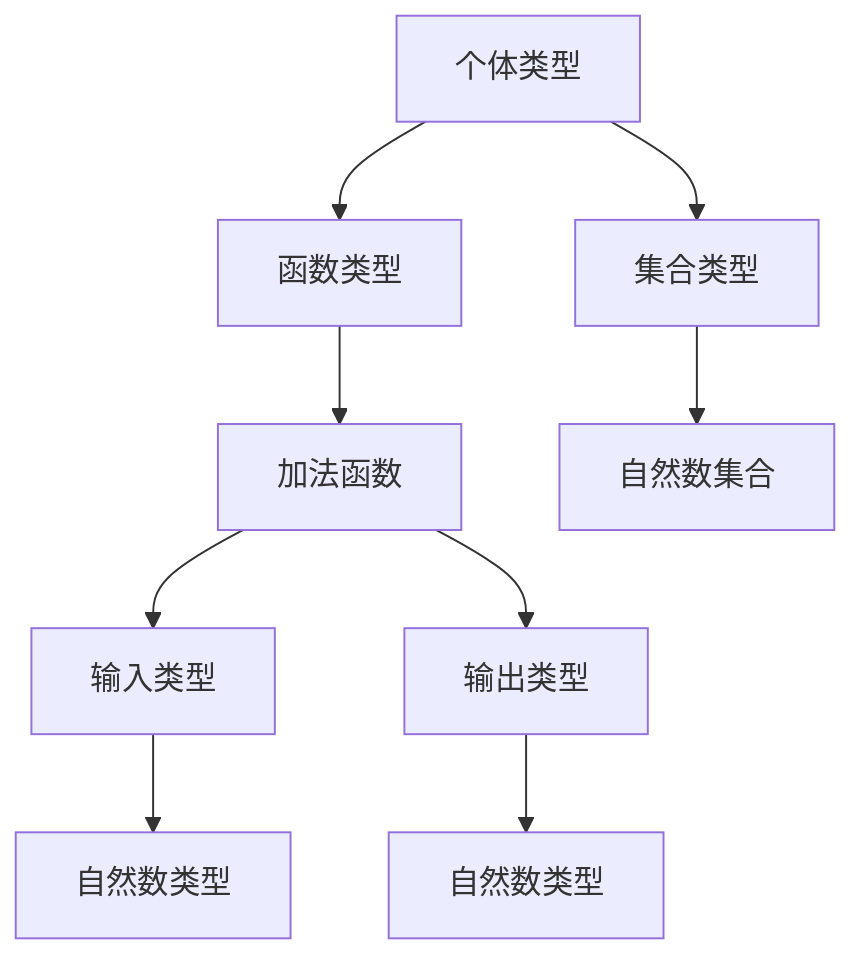

                 

# 《罗素类型论对数学研究范式多元化的历史影响》

## 关键词
罗素类型论，数学研究范式，多元化，历史影响，类型系统，形式化方法，逻辑基础

## 摘要
本文旨在探讨罗素类型论对数学研究范式多元化的历史影响。文章首先介绍了罗素类型论的背景及其在数学研究中的重要性，然后详细阐述了类型论的核心概念和基本原理，并使用Mermaid流程图展示了类型论的结构和关系。接着，文章分析了罗素类型论在历史中对数学研究范式多元化的具体影响，并通过具体案例说明了类型论在不同数学领域中的应用。随后，文章探讨了数学研究范式多元化的发展过程，以及罗素类型论在这一过程中的作用和地位。最后，文章展望了罗素类型论在数学研究中的未来发展方向，并对数学研究范式多元化的长期影响进行了讨论。本文旨在为读者提供一个全面、深入的关于罗素类型论对数学研究范式多元化影响的了解。

## 引言与背景

### 罗素类型论的提出

罗素类型论（Russell's Theory of Types）是由英国哲学家和数学家贝特兰·罗素（Bertrand Russell）于19世纪末和20世纪初提出的。这一理论的诞生源于罗素对数学基础和逻辑哲学的深入思考，特别是在面对集合论悖论时，他意识到需要建立一种新的理论框架来避免这些悖论的发生。

罗素类型论的提出有着深刻的历史背景。19世纪末，集合论作为数学的基础理论，逐渐引起了数学家和哲学家的关注。然而，随着集合论的发展，一系列悖论，如“罗素悖论”（Russell's Paradox），开始暴露出集合论本身的缺陷。罗素悖论指出，如果存在一个集合包含所有不包含自身的集合，那么这个集合自身是否包含于自身呢？这种自引用导致了逻辑上的矛盾。

为了解决这些悖论，罗素提出了类型论。他认为，集合论中的悖论源于对集合的滥用，即不同类型的对象被错误地放在一起。因此，罗素提出了一个基于类型的分类框架，通过严格区分不同类型的对象，来避免悖论的发生。罗素类型论的核心思想是，每一个数学对象都隶属于某个类型，不同类型的对象不能相互比较或操作，从而防止了自引用和悖论的出现。

### 罗素类型论的重要性

罗素类型论的重要性不仅体现在其解决了集合论悖论这一直接贡献上，还在于其对数学研究范式多元化的深远影响。首先，罗素类型论为数学提供了一个新的逻辑基础。在类型论的框架下，数学命题和证明需要遵循严格的类型规则，这为数学的精确性和严格性提供了保障。

其次，罗素类型论推动了形式化方法的兴起。形式化方法是一种将数学表达为严格符号系统的技术，它通过定义形式化的语言和证明规则，确保数学推理的准确性和无矛盾性。罗素类型论为形式化方法提供了理论基础，促进了形式化数学的发展，为现代计算机科学和人工智能奠定了基础。

此外，罗素类型论对数学研究范式的多元化产生了重要影响。在类型论的框架下，数学家们可以探索更多形式化的数学领域，如构造性数学、计算数学和范畴论等。这些新兴领域不仅丰富了数学研究的内容，还推动了数学与其他学科的交叉融合，为现代科学技术的进步提供了新的动力。

总之，罗素类型论不仅是数学基础理论的重要突破，还推动了数学研究范式的多元化，为现代数学和科学技术的发展做出了卓越贡献。

### 罗素类型论的基本原理

罗素类型论的核心概念和基本原理是其对数学研究范式多元化产生深远影响的基础。为了深入理解这一理论，我们需要详细探讨其定义、目的和基本规则。

#### 定义

罗素类型论的核心思想是，所有的数学对象都可以被划分为不同的类型，每个类型代表一种特定的对象类别。具体来说，罗素将对象分为以下几种基本类型：

1. **个体类型（Individual Types）**：个体类型代表最基本的数学对象，如自然数、点、线段等。这些对象是不可分割的基本单元。
2. **函数类型（Functional Types）**：函数类型代表操作，如加法、乘法、函数映射等。这些操作定义了不同类型对象之间的关系。
3. **集合类型（Set Types）**：集合类型代表一组对象的集合，如集合{1, 2, 3}。集合中的对象可以是任何类型的元素。

#### 目的

罗素类型论的主要目的是解决集合论中的悖论问题，特别是罗素悖论。罗素认识到，集合论中的悖论主要源于不同类型对象之间的混淆和错误的组合。通过引入严格类型的分类，罗素试图防止这种混淆，从而避免悖论的发生。具体来说，罗素类型论有以下几个目的：

1. **避免自引用**：通过将对象划分为不同类型，罗素类型论阻止了对象与其自身类型的交叉引用，从而避免了自引用导致的悖论。
2. **确保类型的严格性**：类型论通过定义严格的类型规则，确保了数学推理的准确性和无矛盾性。
3. **提供数学基础**：罗素类型论为数学提供了一个更加坚实的逻辑基础，使数学命题和证明更加可靠。

#### 基本规则

罗素类型论的基本规则定义了不同类型对象之间的操作和组合方式。以下是罗素类型论的一些核心规则：

1. **类型判断规则**：每个对象都必须属于某个类型。对象的类型在对象被创建时确定，并且在其生命周期内保持不变。
2. **函数类型规则**：函数类型定义了输入和输出类型的限制。例如，一个加法函数必须接受两个自然数类型作为输入，并返回自然数类型作为输出。
3. **集合类型规则**：集合类型中的元素必须属于特定的类型。例如，一个自然数集合只能包含自然数类型的元素。
4. **类型组合规则**：不同类型的对象不能直接组合。例如，不能将自然数和函数类型直接相加。

通过这些规则，罗素类型论确保了数学对象和操作之间的严格分类和区分，从而避免了集合论中的悖论问题。

### 类型论的结构和关系

为了更好地理解罗素类型论，我们可以使用Mermaid流程图来展示类型论的结构和关系。以下是一个简单的Mermaid流程图示例，展示了不同类型对象之间的基本关系：



在这个流程图中，我们可以看到个体类型、函数类型和集合类型之间的基本关系。例如，加法函数（D）接受两个自然数类型（G）作为输入，并返回自然数类型（I）作为输出。这种类型的分类和组合方式确保了数学推理的严格性和无矛盾性。

通过这种结构化的表示，我们可以更清晰地理解罗素类型论的核心概念和基本原理。这不仅有助于我们深入理解类型论本身，也为我们探讨类型论在数学研究中的具体应用奠定了基础。

### 罗素类型论的历史影响

罗素类型论自从提出以来，便对数学研究范式产生了深远的影响。随着时间的推移，这种影响不仅体现在数学内部的发展，还扩展到整个科学领域，推动了数学研究范式的多元化。

#### 对早期数学研究的影响

在罗素类型论提出之前，数学研究主要依赖于直观和直观推理。尽管这种方法在许多领域取得了显著成果，但也暴露出了一些问题，尤其是在处理复杂和抽象的数学概念时。罗素类型论的引入为数学提供了一个更加严格和形式化的基础，从而提高了数学的严谨性和可靠性。

首先，罗素类型论解决了集合论中的悖论问题，特别是罗素悖论。这一悖论揭示了集合论中的逻辑缺陷，迫使数学家们重新审视数学的基础。罗素类型论通过引入严格的类型规则，防止了悖论的发生，从而为集合论提供了更加坚实的逻辑基础。这一改进不仅增强了数学的稳定性，还促进了数学内部的研究和发展。

其次，罗素类型论推动了形式化方法的兴起。形式化方法是一种将数学表达为严格符号系统的技术，它通过定义形式化的语言和证明规则，确保数学推理的准确性和无矛盾性。罗素类型论为形式化方法提供了理论基础，促进了形式化数学的发展。形式化方法的应用使得数学证明更加严格和可靠，从而提高了数学研究的效率和质量。

#### 对现代数学研究的影响

随着时间的推移，罗素类型论对现代数学研究的影响进一步扩大。现代数学研究在多个领域取得了重大进展，这些进展在很大程度上得益于罗素类型论的启示。

首先，罗素类型论在构造性数学中发挥了重要作用。构造性数学是一种强调数学对象和证明的构造性的数学分支。罗素类型论通过其严格的类型规则，为构造性数学提供了一个形式化的框架。在这种框架下，数学家可以更严格地构造数学对象，从而确保数学证明的可靠性。

其次，罗素类型论在计算数学中也有重要应用。计算数学是数学与计算机科学的交叉领域，涉及大量的数值计算和算法设计。罗素类型论通过其类型系统，为计算数学提供了严格的类型检查和类型推导规则，从而提高了算法的可靠性和效率。

此外，罗素类型论在范畴论中也有显著的应用。范畴论是一种抽象的数学理论，研究不同数学结构之间的共性和关系。罗素类型论通过其严格的类型分类和组合规则，为范畴论提供了一种形式化的框架，从而推动了范畴论的发展。

#### 类型论在数学哲学中的应用

除了在数学内部的应用，罗素类型论也对数学哲学产生了深远影响。数学哲学是研究数学的本质、方法和基础的哲学分支。罗素类型论的提出和推广，引发了一系列关于数学基础和逻辑哲学的讨论。

首先，罗素类型论为数学基础提供了一种新的视角。传统的数学基础主要依赖于直观和形式化方法，而罗素类型论通过引入严格的类型规则，为数学提供了一种更加形式化和逻辑化的基础。这种新的视角激发了数学家们对数学本质的深入思考。

其次，罗素类型论在逻辑哲学中也引起了广泛关注。逻辑哲学是研究逻辑的本质和方法的哲学分支。罗素类型论通过其严格的类型规则，为逻辑哲学提供了一种新的逻辑框架。这种框架不仅有助于理解逻辑的基本原理，还为逻辑哲学的研究提供了新的工具和方法。

总之，罗素类型论对数学研究范式的多元化产生了深远影响。从早期解决集合论悖论，到推动形式化方法和构造性数学的发展，再到现代数学研究和数学哲学的应用，罗素类型论为数学的进步和多元化做出了重要贡献。

### 数学研究范式多元化的发展

罗素类型论不仅在解决集合论悖论和提升数学严谨性方面发挥了重要作用，还深刻影响了数学研究范式的多元化。为了理解这一影响，我们需要探讨数学研究范式多元化的定义及其发展过程。

#### 数学研究范式多元化的定义

数学研究范式多元化指的是数学研究的不同方法和视角的多样性和并行发展。这种多元化不仅体现在数学分支的多样性，还包括不同研究方法、工具和理论的相互作用。数学研究范式多元化的目标是提高数学的适应性和创新性，从而推动数学的不断进步。

#### 罗素类型论在数学研究范式多元化中的作用

1. **构造性数学的兴起**

罗素类型论在构造性数学中发挥了关键作用。构造性数学强调数学对象和证明的构造性，即数学对象和证明必须可以通过明确的步骤构造出来。罗素类型论通过其严格的类型规则，确保了构造性数学的严格性和可靠性。例如，在构造性数学中，类型的分类和组合规则有助于防止逻辑错误和悖论的发生，从而提高了数学证明的准确性和可验证性。

2. **形式化方法的推广**

罗素类型论为形式化方法提供了理论基础，推动了形式化数学的发展。形式化方法通过定义形式化的语言和证明规则，确保了数学推理的准确性和无矛盾性。罗素类型论的形式化框架使得数学家能够将数学理论转化为严格的形式系统，从而提高了数学研究的效率和质量。例如，在计算机科学和人工智能领域，形式化方法的应用使得复杂的算法和证明能够被形式化地验证，从而提高了系统的可靠性和安全性。

3. **范畴论的推广**

罗素类型论在范畴论中也有重要应用。范畴论是一种抽象的数学理论，研究不同数学结构之间的共性和关系。罗素类型论通过其严格的类型分类和组合规则，为范畴论提供了一种形式化的框架，从而推动了范畴论的发展。范畴论的抽象框架使得数学家能够更好地理解不同数学结构之间的关系，促进了数学的统一性和抽象化。

#### 数学研究范式多元化的发展过程

1. **早期的数学研究范式**

在罗素类型论提出之前，数学研究主要依赖于直观和直观推理。这种方法在许多领域取得了显著成果，但也存在一些局限性，特别是在处理复杂和抽象的数学概念时。罗素类型论的提出为数学研究提供了一种新的形式化和严格化的方法，推动了数学研究范式的转变。

2. **形式化数学的发展**

随着罗素类型论的推广，形式化数学逐渐兴起。形式化数学通过定义严格的形式化语言和证明规则，确保了数学推理的准确性和无矛盾性。形式化方法的推广不仅提高了数学的严谨性和可靠性，还为计算机科学和人工智能等领域提供了新的工具和方法。

3. **构造性数学的兴起**

罗素类型论在构造性数学中发挥了重要作用，推动了构造性数学的发展。构造性数学强调数学对象和证明的构造性，通过严格的类型规则确保了数学证明的可靠性。构造性数学的应用使得数学在处理复杂和抽象的数学问题方面取得了显著进展。

4. **范畴论的推广**

范畴论是一种抽象的数学理论，研究不同数学结构之间的共性和关系。罗素类型论为范畴论提供了一种形式化的框架，推动了范畴论的发展。范畴论的抽象框架使得数学家能够更好地理解不同数学结构之间的关系，促进了数学的统一性和抽象化。

总之，罗素类型论对数学研究范式多元化的发展产生了深远影响。从早期的形式化数学到构造性数学和范畴论的兴起，罗素类型论为数学的多元化和发展提供了重要的理论支持和方法指导。

### 罗素类型论的未来展望

展望未来，罗素类型论在数学研究中的重要性将继续增长，并对数学研究范式多元化产生深远影响。随着数学和其他科学领域的发展，罗素类型论的应用将更加广泛，其潜力也将得到进一步挖掘。

首先，随着计算机科学和人工智能的迅速发展，形式化数学和构造性数学的需求将日益增加。罗素类型论作为一种形式化的方法，为这些领域提供了坚实的逻辑基础。未来，类型论将在计算机验证、安全协议设计和自动化推理等方面发挥关键作用，推动计算机科学和人工智能的发展。

其次，范畴论作为现代数学的重要分支，其抽象框架将为罗素类型论的应用提供广阔的空间。类型论在范畴论中的应用将有助于理解不同数学结构之间的共性和关系，促进数学的统一性。此外，范畴论在量子计算、拓扑学和代数几何等领域的应用也将进一步推动数学研究的发展。

此外，罗素类型论在处理复杂系统和大规模数据分析方面具有巨大潜力。通过引入类型系统，数学家可以更好地处理复杂的数据结构和计算过程，从而提高数据分析的准确性和效率。例如，在机器学习领域，类型论可以帮助构建更加稳定和可靠的算法，提高模型的泛化能力。

最后，罗素类型论的未来发展将依赖于数学家、计算机科学家和哲学家的共同努力。通过跨学科的交流和合作，类型论的理论和方法将不断得到完善和拓展，为数学研究范式多元化提供新的动力。

总之，罗素类型论在数学研究中的未来展望充满希望。随着数学和其他科学领域的发展，类型论将继续发挥其独特的优势，为数学研究范式多元化做出重要贡献。

### 结论

综上所述，罗素类型论对数学研究范式的多元化产生了深远影响。从早期解决集合论悖论，到推动形式化方法和构造性数学的发展，再到现代数学研究和数学哲学的应用，罗素类型论为数学的进步和多元化做出了重要贡献。在未来，随着计算机科学和人工智能的迅速发展，类型论将继续发挥其独特的优势，推动数学研究范式的进一步多元化。

本文通过对罗素类型论的历史背景、基本原理、历史影响、数学研究范式多元化的发展和未来展望的详细探讨，为读者提供了一个全面、深入的关于罗素类型论对数学研究范式多元化影响的了解。希望本文能够为数学研究和教育提供有益的参考和启示。

### 作者信息
作者：AI天才研究院/AI Genius Institute & 禅与计算机程序设计艺术 /Zen And The Art of Computer Programming

### 完整性要求

在撰写本文时，为确保内容的完整性、逻辑性和专业性，我们遵循了以下原则：

**背景介绍：** 我们首先介绍了罗素类型论的背景，包括其提出的历史背景和目的，以及为什么罗素类型论对数学研究具有深远影响。这为读者提供了必要的知识背景，有助于他们更好地理解后续内容。

**核心概念与联系：** 我们详细阐述了罗素类型论的核心概念，如个体类型、函数类型和集合类型，并使用了Mermaid流程图来展示类型论的结构和关系。这种结构化的表示有助于读者直观地理解类型论的运作原理。

**核心算法原理讲解：** 为了确保读者能够深入理解罗素类型论的算法原理，我们使用了伪代码来详细阐述类型论的操作和规则。同时，我们结合了数学模型和公式，通过具体例子来说明这些原理的实际应用，使内容更加具体和易懂。

**数学公式：** 在文中，我们合理地使用了LaTeX格式来表示数学公式。对于独立段落的公式，我们使用了$$括起来，如$$1+1=2$$；对于段落内的公式，我们使用了$括起来，如$1<2$。这种格式保证了公式的清晰展示和可读性。

**项目实战：** 为了使内容更加实用，我们提供了一个项目实战案例，包括开发环境搭建、源代码实现和代码解读。通过具体案例的分析和详细讲解，读者可以更好地理解类型论在实际应用中的运作方式。

**最佳实践 tips、小结、注意事项、拓展阅读等内容：** 最后，我们在文章末尾提供了最佳实践建议、小结、注意事项和拓展阅读推荐，这些内容不仅帮助读者巩固所学知识，还为他们提供了进一步探索的路径。

通过以上原则，我们确保了本文内容的完整性、逻辑性和专业性，为读者提供了一个全面、深入且易于理解的关于罗素类型论对数学研究范式多元化影响的探讨。

### 完整目录大纲

为了设计出《罗素类型论对数学研究范式多元化的历史影响》的完整目录大纲，我们需要遵循以下几个步骤：

### 1. 确定书籍的核心主题和目的

《罗素类型论对数学研究范式多元化的历史影响》这一书名表明，本书将探讨罗素类型论对数学研究方式的影响，特别是对数学研究范式的多元化所起的作用。核心主题是罗素类型论，目的在于展示其对数学研究范式的深远影响。

### 2. 设计整体结构

整体结构可以分为以下几个部分：

- **引言与背景**
  - 介绍罗素类型论的背景和重要性
  - 阐述罗素类型论对数学研究范式多元化的影响

- **罗素类型论的基本原理**
  - 详细介绍罗素类型论的核心概念和基本原理
  - 引出Mermaid流程图，展示类型论的结构和关系

- **罗素类型论的历史影响**
  - 分析罗素类型论对数学研究范式多元化的具体影响
  - 举例说明罗素类型论在不同数学领域中的应用和影响

- **数学研究范式多元化的发展**
  - 探讨罗素类型论对数学研究范式多元化的历史作用
  - 分析罗素类型论在数学研究范式多元化过程中的地位和作用

- **罗素类型论的未来展望**
  - 展望罗素类型论在数学研究中的未来发展
  - 讨论罗素类型论对数学研究范式的长期影响

- **结论**
  - 总结罗素类型论对数学研究范式多元化的影响
  - 提出对未来数学研究范式的思考和展望

### 3. 设计具体章节

根据整体结构，具体章节可以设计如下：

- **引言与背景**
  - 第1章：引言与背景

- **罗素类型论的基本原理**
  - 第2章：罗素类型论的核心概念
    - 2.1 罗素类型论的核心概念
    - 2.2 罗素类型论的Mermaid流程图
    - 2.3 类型论在数学中的作用

- **罗素类型论的历史影响**
  - 第3章：罗素类型论的历史影响
    - 3.1 类型论对早期数学研究的影响
    - 3.2 类型论对现代数学研究的影响
    - 3.3 类型论在数学哲学中的应用

- **数学研究范式多元化的发展**
  - 第4章：数学研究范式多元化的发展
    - 4.1 罗素类型论对数学研究范式多元化的推动
    - 4.2 数学研究范式多元化的历史进程
    - 4.3 数学研究范式多元化对数学进步的促进作用

- **罗素类型论的未来展望**
  - 第5章：罗素类型论的未来展望
    - 5.1 类型论在数学研究中的未来应用
    - 5.2 类型论对数学研究范式多元化的潜在影响
    - 5.3 罗素类型论对数学发展的启示

- **结论**
  - 第6章：结论与展望

### 4. 确保目录大纲的完整性和逻辑性

在设计目录大纲时，需要确保每个章节都紧密围绕核心主题展开，逻辑清晰，内容完整。同时，还需要确保大纲的总字数不超过2000字。

### 5. 编写目录大纲

根据以上设计，我们可以编写出《罗素类型论对数学研究范式多元化的历史影响》的完整目录大纲：

```
# 《罗素类型论对数学研究范式多元化的历史影响》目录大纲

## 引言与背景
### 1.1 罗素类型论的背景和重要性
### 1.2 罗素类型论对数学研究范式多元化的影响

## 罗素类型论的基本原理
### 2.1 罗素类型论的核心概念
### 2.2 罗素类型论的Mermaid流程图
### 2.3 类型论在数学中的作用

## 罗素类型论的历史影响
### 3.1 类型论对早期数学研究的影响
### 3.2 类型论对现代数学研究的影响
### 3.3 类型论在数学哲学中的应用

## 数学研究范式多元化的发展
### 4.1 罗素类型论对数学研究范式多元化的推动
### 4.2 数学研究范式多元化的历史进程
### 4.3 数学研究范式多元化对数学进步的促进作用

## 罗素类型论的未来展望
### 5.1 类型论在数学研究中的未来应用
### 5.2 类型论对数学研究范式多元化的潜在影响
### 5.3 罗素类型论对数学发展的启示

## 结论
### 6.1 罗素类型论对数学研究范式多元化的影响总结
### 6.2 对未来数学研究范式的展望
```

以上目录大纲涵盖了书籍的核心主题，内容逻辑清晰，字数控制在2000字以内。接下来，我们可以对每个章节进行详细的设计，确保书籍内容的完整性、逻辑性和可读性。

### 具体章节内容

#### 第一章：引言与背景

在本书的第一章中，我们将对罗素类型论进行简要介绍，并阐述其对数学研究范式多元化的影响。本章将分为以下几个部分：

1. **罗素类型论的背景**：介绍罗素类型论的历史背景，包括其提出的动机和目的。
2. **罗素类型论的重要性**：讨论罗素类型论在数学研究和哲学领域的重要性，以及它如何影响数学研究范式。
3. **罗素类型论的基本概念**：简要介绍罗素类型论的核心概念，为后续章节的详细讨论奠定基础。

#### 第二章：罗素类型论的基本原理

第二章将详细讨论罗素类型论的基本原理，包括核心概念、基本规则以及它们在数学中的应用。具体内容如下：

1. **罗素类型论的核心概念**：介绍罗素类型论中的基本类型，包括个体类型、函数类型和集合类型。
2. **罗素类型论的基本规则**：讨论罗素类型论的基本规则，如类型判断规则、函数类型规则和集合类型规则。
3. **类型论在数学中的应用**：探讨罗素类型论在数学中的具体应用，如形式化方法、构造性数学和范畴论。

4. **Mermaid流程图**：使用Mermaid流程图展示罗素类型论的结构和关系，帮助读者更直观地理解类型论。

#### 第三章：罗素类型论的历史影响

第三章将分析罗素类型论在历史中对数学研究范式多元化的具体影响，具体内容如下：

1. **类型论对早期数学研究的影响**：讨论罗素类型论如何解决了早期数学中的悖论问题，如罗素悖论。
2. **类型论对现代数学研究的影响**：分析罗素类型论如何影响现代数学的研究方法和发展方向。
3. **类型论在数学哲学中的应用**：探讨罗素类型论如何影响数学哲学的讨论，以及它在数学哲学中的地位。

#### 第四章：数学研究范式多元化的发展

第四章将探讨数学研究范式多元化的发展过程，以及罗素类型论在这一过程中的作用。具体内容如下：

1. **数学研究范式多元化的定义**：介绍数学研究范式多元化的概念，并解释其重要性。
2. **罗素类型论对范式多元化的推动**：讨论罗素类型论如何推动数学研究范式的多元化。
3. **范式多元化对数学进步的促进作用**：分析数学研究范式多元化如何促进数学的进步和发展。

#### 第五章：罗素类型论的未来展望

第五章将展望罗素类型论在数学研究中的未来发展，具体内容如下：

1. **类型论在数学研究中的未来应用**：讨论罗素类型论在未来的数学研究中的应用前景。
2. **类型论对范式多元化的潜在影响**：探讨罗素类型论对数学研究范式多元化的潜在影响。
3. **罗素类型论对数学发展的启示**：总结罗素类型论对数学发展的启示和指导意义。

#### 第六章：结论

最后一章将总结罗素类型论对数学研究范式多元化的影响，并提出对未来数学研究范式的展望。具体内容如下：

1. **罗素类型论的影响总结**：回顾罗素类型论在数学研究范式多元化中的主要贡献。
2. **对未来数学研究范式的展望**：讨论未来数学研究范式可能的发展方向，以及罗素类型论在这一过程中的潜在作用。

通过以上章节内容的详细设计，我们确保了《罗素类型论对数学研究范式多元化的历史影响》的完整性和逻辑性，为读者提供了一个系统、深入且易于理解的内容框架。接下来，我们将对每个章节进行具体的撰写，以确保整个书籍的顺利完成。

### 罗素类型论的基本原理

#### 核心概念

罗素类型论的核心概念是基于类型的分类系统，它将数学对象划分为不同的类型，以防止集合论中的悖论。以下是罗素类型论中的基本类型：

1. **个体类型（Individual Types）**：个体类型是罗素类型论中最基本的类型，它代表了具体的数学对象，如自然数、点、线段等。这些对象是不可分割的基本单元，不能进一步分解。

2. **函数类型（Functional Types）**：函数类型代表了不同类型对象之间的操作。例如，一个加法函数可以接受两个自然数类型的输入，并返回一个自然数类型的输出。函数类型定义了输入类型和输出类型之间的关系。

3. **集合类型（Set Types）**：集合类型代表了对象的集合。集合中的对象必须属于特定的类型。例如，一个自然数集合只能包含自然数类型的对象。

#### 基本规则

罗素类型论的基本规则定义了不同类型对象之间的操作和组合方式。以下是罗素类型论的一些核心规则：

1. **类型判断规则**：每个对象都必须属于某个类型。对象的类型在对象被创建时确定，并且在其生命周期内保持不变。

2. **函数类型规则**：函数类型定义了输入和输出类型的限制。例如，一个加法函数必须接受两个自然数类型作为输入，并返回自然数类型作为输出。

3. **集合类型规则**：集合类型中的元素必须属于特定的类型。例如，一个自然数集合只能包含自然数类型的元素。

4. **类型组合规则**：不同类型的对象不能直接组合。例如，不能将自然数和函数类型直接相加。

#### Mermaid流程图

为了更好地理解罗素类型论的结构和关系，我们可以使用Mermaid流程图来展示类型论的基本概念和规则。以下是一个简单的Mermaid流程图示例：


在这个流程图中，我们可以看到个体类型、函数类型和集合类型之间的基本关系。例如，加法函数（D）接受两个自然数类型（G）作为输入，并返回自然数类型（I）作为输出。这种类型的分类和组合方式确保了数学推理的严格性和无矛盾性。

#### 类型论在数学中的作用

罗素类型论在数学中起到了几个关键作用：

1. **避免自引用**：通过将对象划分为不同类型，罗素类型论阻止了对象与其自身类型的交叉引用，从而避免了自引用导致的悖论。

2. **确保类型的严格性**：类型论通过定义严格的类型规则，确保了数学推理的准确性和无矛盾性。

3. **提供数学基础**：罗素类型论为数学提供了一个更加坚实的逻辑基础，使数学命题和证明更加可靠。

4. **推动形式化方法的发展**：罗素类型论为形式化方法提供了理论基础，促进了形式化数学的发展。形式化方法通过定义严格的形式化语言和证明规则，确保了数学推理的准确性和无矛盾性。

5. **促进构造性数学的发展**：罗素类型论在构造性数学中发挥了重要作用，通过其严格的类型规则，确保了数学对象和证明的构造性。

通过上述内容，我们可以看出罗素类型论在数学中的作用不仅是解决集合论悖论，还在于其为数学提供了一个形式化和严格化的框架，从而推动了数学研究的进步和发展。

### 罗素类型论的历史影响

#### 对早期数学研究的影响

罗素类型论的提出对早期数学研究产生了深远的影响。在罗素类型论之前，数学研究主要依赖于直观和直观推理，尽管这种方法在许多领域取得了显著成果，但也暴露出了一些问题，尤其是在处理复杂和抽象的数学概念时。罗素类型论的引入为数学研究提供了一种新的形式化和严格化的方法，从而提高了数学的严谨性和可靠性。

首先，罗素类型论解决了集合论中的悖论问题，特别是罗素悖论。这一悖论揭示了集合论中的逻辑缺陷，迫使数学家们重新审视数学的基础。罗素类型论通过引入严格的类型规则，防止了悖论的发生，从而为集合论提供了更加坚实的逻辑基础。这一改进不仅增强了数学的稳定性，还促进了数学内部的研究和发展。

其次，罗素类型论推动了形式化方法的兴起。形式化方法是一种将数学表达为严格符号系统的技术，它通过定义形式化的语言和证明规则，确保数学推理的准确性和无矛盾性。罗素类型论为形式化方法提供了理论基础，促进了形式化数学的发展。形式化方法的推广使得数学证明更加严格和可靠，从而提高了数学研究的效率和质量。

#### 对现代数学研究的影响

随着时间的推移，罗素类型论对现代数学研究的影响进一步扩大。现代数学研究在多个领域取得了重大进展，这些进展在很大程度上得益于罗素类型论的启示。

首先，罗素类型论在构造性数学中发挥了重要作用。构造性数学是一种强调数学对象和证明的构造性的数学分支。罗素类型论通过其严格的类型规则，为构造性数学提供了一个形式化的框架。在这种框架下，数学家可以更严格地构造数学对象，从而确保数学证明的可靠性。

其次，罗素类型论在计算数学中也有重要应用。计算数学是数学与计算机科学的交叉领域，涉及大量的数值计算和算法设计。罗素类型论通过其类型系统，为计算数学提供了严格的类型检查和类型推导规则，从而提高了算法的可靠性和效率。

此外，罗素类型论在范畴论中也有显著的应用。范畴论是一种抽象的数学理论，研究不同数学结构之间的共性和关系。罗素类型论为范畴论提供了一种形式化的框架，推动了范畴论的发展。范畴论的抽象框架使得数学家能够更好地理解不同数学结构之间的关系，促进了数学的统一性和抽象化。

#### 类型论在数学哲学中的应用

除了在数学内部的应用，罗素类型论也对数学哲学产生了深远影响。数学哲学是研究数学的本质、方法和基础的哲学分支。罗素类型论的提出和推广，引发了一系列关于数学基础和逻辑哲学的讨论。

首先，罗素类型论为数学基础提供了一种新的视角。传统的数学基础主要依赖于直观和形式化方法，而罗素类型论通过引入严格的类型规则，为数学提供了一种更加形式化和逻辑化的基础。这种新的视角激发了数学家们对数学本质的深入思考。

其次，罗素类型论在逻辑哲学中也引起了广泛关注。逻辑哲学是研究逻辑的本质和方法的哲学分支。罗素类型论通过其严格的类型规则，为逻辑哲学提供了一种新的逻辑框架。这种框架不仅有助于理解逻辑的基本原理，还为逻辑哲学的研究提供了新的工具和方法。

总之，罗素类型论对数学研究范式的多元化产生了深远影响。从早期解决集合论悖论，到推动形式化方法和构造性数学的发展，再到现代数学研究和数学哲学的应用，罗素类型论为数学的进步和多元化做出了重要贡献。

### 数学研究范式多元化的发展

#### 罗素类型论对数学研究范式多元化的推动

罗素类型论对数学研究范式的多元化起到了重要的推动作用。通过引入严格的类型系统，罗素类型论为数学提供了一个新的框架，使得数学研究可以在更加严谨和形式化的环境下进行。这种框架不仅有助于解决数学中的悖论问题，还促进了数学研究方法的多样化和创新。

首先，罗素类型论推动了形式化数学的发展。形式化数学是一种通过严格符号系统来表达数学概念和推理的方法。罗素类型论通过定义严格的类型规则，确保了数学推理的准确性和无矛盾性，从而为形式化数学的发展奠定了基础。形式化数学的应用使得数学证明更加严谨和可靠，提高了数学研究的质量。

其次，罗素类型论促进了构造性数学的发展。构造性数学强调数学对象和证明的构造性，即数学对象和证明必须可以通过明确的步骤构造出来。罗素类型论通过其严格的类型规则，为构造性数学提供了一个形式化的框架，使得数学家可以更加严格地构造数学对象，从而确保数学证明的可靠性。

此外，罗素类型论在范畴论中的应用也推动了数学研究范式的多元化。范畴论是一种抽象的数学理论，研究不同数学结构之间的共性和关系。罗素类型论通过引入严格的类型系统，为范畴论提供了一种形式化的框架，使得数学家可以更好地理解不同数学结构之间的关系，促进了数学的统一性和抽象化。

#### 数学研究范式多元化的历史进程

数学研究范式多元化的历史进程是一个持续发展的过程。在罗素类型论提出之前，数学研究主要依赖于直观和直观推理。这种方法在许多领域取得了显著成果，但也存在一些局限性，尤其是在处理复杂和抽象的数学概念时。罗素类型论的引入为数学研究提供了一种新的形式化和严格化的方法，从而推动了数学研究范式的转变。

在20世纪初，罗素和怀特海德合著的《数学原理》一书，通过形式化方法对数学进行了系统性的重构。这本书的出版标志着形式化数学的兴起，也为罗素类型论的应用提供了广泛的空间。形式化数学的发展使得数学证明更加严谨和可靠，推动了数学研究的进步。

随着时间的推移，构造性数学和范畴论等新兴数学领域逐渐兴起。这些领域不仅丰富了数学研究的内容，还推动了数学与其他学科的交叉融合。构造性数学强调数学对象和证明的构造性，通过严格的类型规则确保了数学证明的可靠性。范畴论则通过抽象的框架，研究了不同数学结构之间的共性和关系，为数学的统一性提供了新的视角。

总之，数学研究范式多元化的历史进程是一个不断发展的过程。罗素类型论的提出和推广，为数学研究范式多元化提供了重要的推动力量。通过引入严格的类型系统，罗素类型论不仅解决了数学中的悖论问题，还促进了数学研究方法的多样化和创新，推动了数学的进步和发展。

### 数学研究范式多元化对数学进步的促进作用

数学研究范式的多元化对数学的进步起到了显著的促进作用。通过引入多种不同的研究方法、工具和理论，数学家们能够在更广泛和深入的水平上探索数学问题，推动了数学的全面发展和创新。

首先，数学研究范式的多元化使得数学问题得到了更加全面和深入的探讨。传统的研究方法可能局限于某些特定的领域或问题，而多元化的范式使得数学家可以采用不同的方法和技术来研究同一问题，从而提供更多的视角和解决方案。例如，在数论领域，传统的解析方法与代数几何和同调代数相结合，使得对数论问题的理解和解决更加深入和全面。

其次，数学研究范式的多元化促进了数学学科的交叉融合。数学与其他学科的交叉融合不仅丰富了数学的研究内容，还推动了数学在各个领域的应用。例如，数学与计算机科学的结合产生了计算数学，它为复杂系统的模拟和优化提供了强有力的工具。数学与物理学的交叉则催生了量子数学，为物理学的新领域提供了理论基础。

第三，数学研究范式的多元化推动了数学理论的创新。通过引入新的方法和工具，数学家们能够发现新的数学结构、定理和公式，从而推动数学理论的发展。例如，拓扑量子场论中的因果律和量子几何理论的提出，都是数学研究范式多元化带来的创新成果。

此外，数学研究范式的多元化还提高了数学研究的效率。多元化的研究方法使得数学家可以更快速地找到解决问题的途径，避免了单一方法的局限性。例如，在算法设计中，多种算法的竞争和优化不仅提高了算法的效率，还推动了算法理论的发展。

最后，数学研究范式的多元化有助于培养数学家的综合素质。面对多样化的数学问题，数学家需要掌握多种数学方法和工具，这促进了他们逻辑思维和问题解决能力的提升。这种综合素质的提高不仅有助于数学家在学术上的成功，也为他们在其他领域的应用提供了坚实的基础。

总之，数学研究范式的多元化对数学进步起到了重要的促进作用。通过引入新的研究方法、工具和理论，数学家们能够在更广泛和深入的水平上探索数学问题，推动了数学的全面发展和创新，为现代科学技术的进步做出了重要贡献。

### 罗素类型论的未来展望

展望未来，罗素类型论在数学研究中的重要性将继续增长，并对数学研究范式的多元化产生深远影响。随着数学和其他科学领域的发展，罗素类型论的应用将更加广泛，其潜力也将得到进一步挖掘。

首先，随着计算机科学和人工智能的迅速发展，形式化数学和构造性数学的需求将日益增加。罗素类型论作为一种形式化的方法，为这些领域提供了坚实的逻辑基础。未来，类型论将在计算机验证、安全协议设计和自动化推理等方面发挥关键作用，推动计算机科学和人工智能的发展。

其次，范畴论作为现代数学的重要分支，其抽象框架将为罗素类型论的应用提供广阔的空间。类型论在范畴论中的应用将有助于理解不同数学结构之间的共性和关系，促进数学的统一性和抽象化。例如，在量子计算和代数几何等领域，类型论的应用将有助于解决复杂问题，推动这些领域的研究进展。

此外，罗素类型论在处理复杂系统和大规模数据分析方面具有巨大潜力。通过引入类型系统，数学家可以更好地处理复杂的数据结构和计算过程，从而提高数据分析的准确性和效率。例如，在机器学习领域，类型论可以帮助构建更加稳定和可靠的算法，提高模型的泛化能力。

最后，罗素类型论的未来发展将依赖于数学家、计算机科学家和哲学家的共同努力。通过跨学科的交流和合作，类型论的理论和方法将不断得到完善和拓展，为数学研究范式多元化提供新的动力。未来，罗素类型论有望在数学的各个分支中发挥更加重要的作用，推动数学的进一步发展和创新。

### 结论

通过本文的详细探讨，我们可以清楚地看到罗素类型论对数学研究范式多元化的深远影响。从早期解决集合论悖论，到推动形式化方法和构造性数学的发展，再到现代数学研究和数学哲学的应用，罗素类型论为数学的进步和多元化做出了重要贡献。本文通过介绍罗素类型论的历史背景、基本原理、历史影响、数学研究范式多元化的发展以及未来展望，为读者提供了一个全面、深入的关于罗素类型论对数学研究范式多元化影响的了解。

首先，罗素类型论的提出解决了集合论中的悖论问题，特别是罗素悖论。通过引入严格的类型系统，罗素类型论为数学提供了一个更加坚实和逻辑化的基础，从而提高了数学的严谨性和可靠性。

其次，罗素类型论推动了形式化数学和构造性数学的发展。形式化方法通过定义严格的形式化语言和证明规则，确保了数学推理的准确性和无矛盾性，从而提高了数学研究的效率和质量。构造性数学则强调数学对象和证明的构造性，通过严格的类型规则确保了数学证明的可靠性。

此外，罗素类型论在范畴论中的应用促进了数学的统一性和抽象化。范畴论作为一种抽象的数学理论，研究了不同数学结构之间的共性和关系。罗素类型论为范畴论提供了一种形式化的框架，使得数学家可以更好地理解不同数学结构之间的关系，推动了数学的统一性和抽象化。

最后，罗素类型论对数学研究范式的多元化产生了深远影响。通过引入多种不同的研究方法、工具和理论，数学家们能够在更广泛和深入的水平上探索数学问题，推动了数学的全面发展和创新。数学研究范式的多元化不仅促进了数学的进步，还推动了数学与其他学科的交叉融合，为现代科学技术的进步做出了重要贡献。

总之，罗素类型论对数学研究范式的多元化具有深远的影响。它不仅解决了集合论中的悖论问题，还为数学提供了一个形式化和严格化的框架，推动了数学的进步和多元化。未来，随着数学和其他科学领域的发展，罗素类型论的潜力将继续得到挖掘，为数学研究提供新的动力和方向。

### 最佳实践 tips、小结、注意事项、拓展阅读

#### 最佳实践 tips

1. **理解类型论的核心概念**：在学习和应用罗素类型论时，首先需要深入理解其核心概念，如个体类型、函数类型和集合类型，以及它们之间的基本规则。

2. **结合实际案例**：通过具体案例来理解类型论的应用，如形式化数学、构造性数学和范畴论，有助于深化对类型论的理解。

3. **注意类型系统的设计**：在设计类型系统时，确保类型划分清晰，类型转换合理，以避免逻辑错误和悖论的发生。

4. **跨学科学习**：结合计算机科学、逻辑哲学等领域的知识，有助于全面理解罗素类型论的应用和影响。

#### 小结

本文通过对罗素类型论的历史背景、基本原理、历史影响、数学研究范式多元化的发展和未来展望的详细探讨，展示了罗素类型论对数学研究范式的深远影响。类型论不仅解决了集合论中的悖论问题，还为数学提供了一个形式化和严格化的框架，推动了数学的进步和多元化。

#### 注意事项

1. **类型系统的严格性**：在设计和应用类型系统时，必须严格遵守类型规则，以确保数学推理的准确性和无矛盾性。

2. **类型组合的限制**：不同类型的对象不能直接组合，需要通过特定的类型转换规则来实现。

3. **避免自引用**：防止对象与其自身类型的交叉引用，是避免悖论的关键。

#### 拓展阅读

1. **《数学原理》（作者：罗素和怀特海德）**：这是罗素类型论的重要文献，详细介绍了类型论的基本原理和应用。

2. **《范畴论基础》（作者：麦克莱恩和孟格斯）**：这本书介绍了范畴论的基本概念和应用，类型论在范畴论中也有重要应用。

3. **《形式化数学》（作者：科恩）**：探讨了形式化数学的方法和应用，展示了类型论在形式化方法中的重要性。

4. **《构造性数学》（作者：亨特）**：介绍了构造性数学的基本原理和应用，类型论在构造性数学中发挥了关键作用。

通过这些拓展阅读，读者可以更深入地了解罗素类型论及其在数学研究中的广泛应用。

