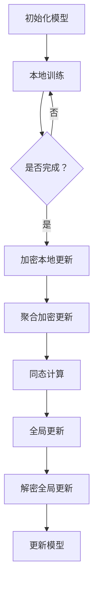
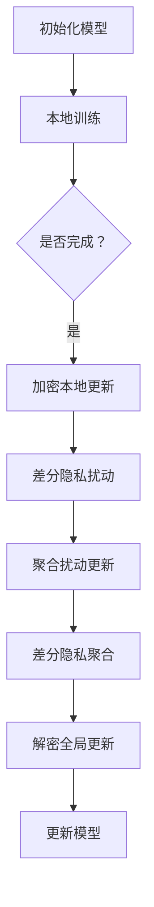
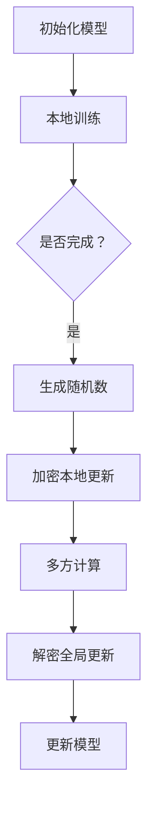
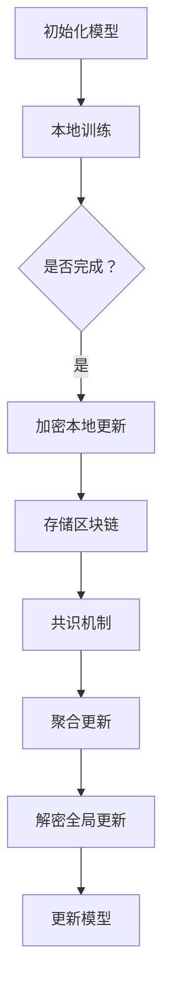

                 

### 文章标题

# 联邦学习中的安全聚合算法研究

### 关键词

- **联邦学习**
- **安全聚合算法**
- **加密技术**
- **分布式计算**
- **隐私保护**
- **机器学习**

### 摘要

随着大数据和人工智能技术的不断发展，联邦学习（Federated Learning，FL）成为了一种热门的研究方向，其主要目标是保护用户隐私的同时实现多方数据的联合学习。然而，联邦学习在聚合模型参数的过程中面临着诸多安全挑战，例如数据泄露、模型隐私等。本文将深入探讨联邦学习中的安全聚合算法，分析其主要原理、分类及其在实际应用中的挑战与解决方案。通过对安全聚合算法的深入研究，本文旨在为联邦学习在各个领域的实际应用提供理论基础和实践指导。

## 引言

在当前大数据和人工智能技术的时代，隐私保护成为了一个亟待解决的重要问题。传统的集中式机器学习方法通常需要将用户数据上传至中央服务器进行处理，这不仅增加了数据泄露的风险，还可能侵犯用户的隐私权。为了解决这一问题，联邦学习（Federated Learning，FL）作为一种新型的分布式学习方法应运而生。联邦学习通过在数据源头进行模型训练，避免了用户数据的集中传输，从而实现了在保护用户隐私的前提下进行联合学习。

联邦学习的基本思想是多个参与方（通常是移动设备或服务器）在本地独立训练模型，然后将模型的本地更新聚合起来，得到全局模型参数。这一过程不仅减少了数据传输的次数，还降低了数据泄露的风险。然而，在联邦学习的过程中，聚合过程的安全性至关重要。如果聚合过程存在漏洞，攻击者可能通过恶意聚合算法获取参与方的敏感数据，从而威胁到系统的整体安全性。

安全聚合算法是联邦学习中的关键组成部分，其目标是确保聚合过程中的数据安全和模型隐私。安全聚合算法通过加密技术、分布式计算和差分隐私等方法，对参与方的本地更新进行加密和混淆，防止攻击者窃取敏感信息。此外，安全聚合算法还需要保证聚合过程的效率，以确保联邦学习的总体性能不受显著影响。

本文将系统地探讨联邦学习中的安全聚合算法，首先介绍联邦学习的基本概念和原理，然后分析安全聚合算法的核心挑战，最后详细讨论几种主流的安全聚合算法，包括其原理、优缺点和实际应用案例。通过本文的研究，我们期望为联邦学习在各个领域的安全应用提供有力的理论支持和实践指导。

### 联邦学习的基本概念与原理

联邦学习（Federated Learning）是一种新兴的分布式机器学习技术，其核心思想是将数据的处理分散到多个不同的设备或服务器上，通过在本地训练模型并聚合更新，从而实现全局模型优化。这种技术不仅提高了数据处理效率，还能有效保护用户隐私，避免数据泄露风险。

#### 联邦学习的核心概念

1. **参与方**：联邦学习涉及多个参与方，通常包括数据持有者（如移动设备、企业服务器）和数据使用者（如中央学习服务器）。每个参与方都有自己的本地数据集和计算资源。

2. **本地训练**：在联邦学习过程中，每个参与方在其本地数据集上独立训练模型，生成本地更新。这一过程避免了数据在传输过程中被窃取或篡改的风险。

3. **模型聚合**：参与方的本地更新通过安全聚合算法进行聚合，生成全局模型更新。这一步骤是联邦学习的核心，其目标是在保持数据隐私的同时，最大化全局模型的性能。

4. **全局模型更新**：聚合后的全局模型更新用于更新中央模型，这一过程循环进行，直到达到预设的模型性能指标或迭代次数。

#### 联邦学习的原理

联邦学习的工作流程可以概括为以下几个步骤：

1. **初始化**：中央学习服务器初始化全局模型，并将模型参数发送给所有参与方。

2. **本地训练**：每个参与方使用本地数据集对全局模型进行训练，生成本地更新。这一过程通常使用梯度下降法或其他优化算法。

3. **模型聚合**：参与方的本地更新通过安全聚合算法进行聚合，生成全局模型更新。这一过程中，需要考虑数据加密、隐私保护和通信效率等因素。

4. **全局模型更新**：中央学习服务器将全局模型更新应用于全局模型，得到新的全局模型参数。

5. **重复迭代**：上述步骤重复进行，直到全局模型达到预设的性能指标或达到最大迭代次数。

#### 联邦学习的优势

1. **隐私保护**：联邦学习通过在本地进行模型训练，避免了用户数据的集中存储和传输，从而有效降低了数据泄露的风险。

2. **数据本地化**：数据在本地进行训练和处理，有助于减少数据传输的时间和带宽消耗，提高系统的整体性能。

3. **灵活性**：联邦学习允许不同的参与方使用不同的数据集和模型，适用于多样化的应用场景。

4. **安全性**：安全聚合算法可以保证聚合过程的安全性，防止攻击者通过恶意更新窃取参与方的敏感数据。

#### 联邦学习的挑战

尽管联邦学习具有诸多优势，但在实际应用中仍面临以下挑战：

1. **通信效率**：聚合过程需要大量通信，可能导致系统性能下降。如何优化聚合算法，降低通信开销，是一个重要问题。

2. **数据多样性**：参与方的数据集可能存在差异，导致全局模型的泛化性能受到影响。如何处理数据多样性，实现模型的稳健性，是联邦学习面临的挑战之一。

3. **隐私保护与性能平衡**：在保证隐私保护的前提下，如何优化模型性能，提高聚合效率，是一个需要权衡的问题。

4. **信任问题**：参与方之间可能存在不信任，导致模型聚合过程不稳定。如何建立信任机制，确保系统的安全性，是联邦学习需要解决的问题。

总之，联邦学习作为一种新兴的分布式学习方法，具有巨大的潜力和应用前景。然而，要充分发挥其优势，还需要解决一系列理论和实践中的挑战。通过深入研究和不断探索，联邦学习有望在隐私保护、分布式计算和人工智能等领域发挥重要作用。

### 安全聚合算法的核心挑战

在联邦学习中，安全聚合算法扮演着至关重要的角色。其主要目标是在保证数据隐私和模型安全的前提下，最大化聚合过程的效率。然而，实现这一目标并非易事，安全聚合算法在多个方面面临核心挑战。

#### 数据隐私保护

数据隐私保护是安全聚合算法的首要任务。在联邦学习过程中，参与方的本地数据集往往是敏感信息，如果聚合过程不安全，攻击者可能通过恶意聚合算法窃取这些数据。数据隐私保护的核心挑战包括：

1. **数据加密**：参与方的本地更新需要加密，以防止中间人攻击和数据泄露。然而，数据加密会引入额外的计算开销，影响聚合过程的效率。

2. **差分隐私**：差分隐私是一种常用的隐私保护技术，通过在本地更新中加入噪声，使得攻击者无法通过单个更新推断出参与方的真实数据。然而，差分隐私可能导致模型性能下降，影响全局模型的准确性。

3. **多方协作**：在联邦学习中，多个参与方需要共同参与模型聚合，但如何确保参与方的合作安全，防止恶意节点注入攻击，是一个重要问题。

#### 模型安全性

模型安全性是另一个关键挑战。在联邦学习过程中，攻击者可能通过恶意更新破坏全局模型的性能和稳定性。模型安全性的核心挑战包括：

1. **恶意更新检测**：如何有效检测和防御恶意更新，防止恶意节点破坏全局模型，是一个重要问题。现有的恶意更新检测方法主要包括基于统计分析和机器学习的方法。

2. **抗攻击性**：全局模型需要具备一定的抗攻击性，能够抵御恶意节点的攻击，保持系统的稳定性。如何设计抗攻击性强的聚合算法，是一个需要深入研究的问题。

3. **动态调整**：在联邦学习过程中，参与方的数量和类型可能不断变化，如何动态调整聚合算法，以适应不同场景下的安全性需求，是一个需要解决的问题。

#### 通信效率

通信效率是联邦学习中的一个重要挑战。聚合过程需要大量通信，可能导致系统性能下降。通信效率的核心挑战包括：

1. **带宽优化**：如何优化数据传输，降低通信开销，是一个关键问题。现有的方法包括压缩传输、多跳传输和并行传输等。

2. **计算优化**：如何在保证安全性的前提下，提高计算效率，降低聚合过程的延迟，是一个需要深入研究的问题。现有的方法包括分布式计算、异步学习和模型剪枝等。

3. **网络拓扑**：联邦学习的参与方可能分布在不同的地理位置，如何设计高效的网络拓扑，以减少通信延迟，是一个需要解决的问题。

#### 系统完整性

系统完整性是另一个重要挑战。在联邦学习中，所有参与方需要协作完成模型聚合，但如果某个参与方出现故障或退出，如何确保系统的完整性和稳定性，是一个需要解决的问题。系统完整性的核心挑战包括：

1. **故障检测**：如何有效检测参与方的故障，确保系统的完整性。

2. **容错机制**：如何设计容错机制，确保在参与方故障或退出时，系统能够继续正常运行。

3. **重新加入**：如何设计重新加入机制，确保参与方在故障后能够重新加入系统，并继续参与模型聚合。

综上所述，安全聚合算法在联邦学习中面临多个核心挑战。要实现高效、安全的联邦学习，需要综合考虑数据隐私保护、模型安全性、通信效率和系统完整性等多个方面，设计出具备鲁棒性和扩展性的安全聚合算法。

### 主流安全聚合算法研究

在联邦学习系统中，安全聚合算法的作用至关重要。主流的安全聚合算法主要通过加密、差分隐私和分布式计算等技术手段来保护数据隐私和模型安全。本文将详细介绍几种主流的安全聚合算法，包括其原理、优缺点和适用场景。

#### 1. 同态加密聚合算法

同态加密（Homomorphic Encryption，HE）是一种允许在加密数据上进行计算，而不需要解密数据的加密技术。同态加密聚合算法利用同态加密技术对参与方的本地更新进行加密，然后通过同态计算进行聚合。其主要原理如下：

- **加密过程**：每个参与方使用私钥对本地更新进行加密，得到加密后的更新。
- **聚合过程**：中央学习服务器将所有加密后的更新进行同态计算，生成全局模型更新。

**优点**：

- **数据隐私保护**：同态加密确保了参与方的数据在整个聚合过程中都是加密的，防止了数据泄露风险。
- **计算灵活性**：同态加密允许中央学习服务器在不解密数据的情况下进行计算，提高了系统的灵活性。

**缺点**：

- **计算开销**：同态加密算法通常需要较高的计算资源，导致聚合过程的延迟增加。
- **带宽需求**：加密后的数据通常比原始数据大，增加了通信开销。

**适用场景**：

- **大规模分布式系统**：适用于涉及大量参与方的联邦学习场景，例如跨企业、跨地区的联合学习。
- **高隐私要求**：适用于对数据隐私要求较高的场景，如医疗数据、金融数据等。

#### 2. 加密聚合与差分隐私结合算法

加密聚合与差分隐私结合算法将加密技术和差分隐私相结合，以提高数据隐私保护和模型安全性。其主要原理如下：

- **加密过程**：每个参与方使用差分隐私技术对本地更新进行扰动，然后使用加密技术进行加密。
- **聚合过程**：中央学习服务器将加密后的更新进行聚合，同时利用差分隐私技术确保聚合结果的安全性。

**优点**：

- **双重隐私保护**：通过结合加密和差分隐私技术，提供了更高级别的隐私保护。
- **模型鲁棒性**：差分隐私技术使得聚合结果对单个参与方数据的依赖性降低，提高了模型的鲁棒性。

**缺点**：

- **计算开销**：加密和差分隐私技术都增加了计算复杂度，导致聚合过程的延迟增加。
- **性能影响**：差分隐私技术可能导致模型性能下降，影响全局模型的准确性。

**适用场景**：

- **高度隐私敏感场景**：适用于对隐私保护要求极高的场景，如个人隐私数据、国家安全数据等。
- **需要模型鲁棒性**：适用于需要提高模型鲁棒性和抗攻击性的场景。

#### 3. 安全多方计算聚合算法

安全多方计算（Secure Multi-Party Computation，SMPC）是一种允许多个参与方共同计算结果，而不泄露各自输入数据的计算技术。安全多方计算聚合算法利用SMPC技术实现参与方的本地更新聚合，其主要原理如下：

- **初始化**：中央学习服务器生成随机数，并将其发送给所有参与方。
- **计算过程**：每个参与方使用随机数对本地更新进行加密，然后通过安全多方计算协议进行聚合。
- **解密过程**：中央学习服务器使用私钥对聚合结果进行解密，得到全局模型更新。

**优点**：

- **高度隐私保护**：安全多方计算确保了所有参与方的输入数据在整个计算过程中都是加密的，防止了数据泄露风险。
- **计算效率**：相比于同态加密，安全多方计算通常具有更高的计算效率。

**缺点**：

- **复杂度高**：安全多方计算协议通常较为复杂，需要更多的通信和计算资源。
- **实现难度**：安全多方计算协议的实现相对复杂，对开发者的技术要求较高。

**适用场景**：

- **隐私保护需求较高**：适用于对隐私保护需求较高的场景，如涉及敏感数据的联合学习。
- **计算资源充足**：适用于计算资源较为充足的场景，以应对安全多方计算协议的高复杂度。

#### 4. 基于区块链的聚合算法

基于区块链的聚合算法利用区块链的分布式账本和加密技术，实现联邦学习中的数据聚合和隐私保护。其主要原理如下：

- **数据存储**：每个参与方的本地更新存储在区块链上，确保数据的不可篡改性。
- **共识机制**：参与方通过区块链的共识机制达成数据一致，然后进行聚合。
- **加密过程**：参与方的本地更新在区块链上存储前进行加密，确保数据隐私。

**优点**：

- **数据不可篡改**：区块链的分布式账本确保了数据在整个聚合过程中的不可篡改性，提高了系统的安全性。
- **透明度高**：区块链技术提供了透明的数据聚合过程，有助于提高系统的可信度。

**缺点**：

- **计算开销**：区块链的共识机制通常需要较高的计算和通信资源。
- **交易延迟**：区块链的交易通常需要一定的时间才能确认，可能导致聚合过程的延迟增加。

**适用场景**：

- **高安全要求**：适用于对数据安全性要求极高的场景，如金融、保险等领域。
- **透明度要求**：适用于需要提供高度透明数据聚合过程的场景。

综上所述，主流安全聚合算法各有优缺点，适用于不同的应用场景。在实际应用中，可以根据具体需求和资源情况选择合适的安全聚合算法，以实现联邦学习系统的高效、安全和隐私保护。

#### 安全聚合算法的原理与联系

在深入探讨安全聚合算法之前，有必要首先理解它们的基本原理和相互之间的联系。安全聚合算法的核心目标是确保在联邦学习过程中，参与方的本地更新能够被安全地聚合，同时保证模型隐私和数据安全。以下将介绍几种主流安全聚合算法的基本原理，并通过Mermaid流程图展示各算法的执行过程，帮助读者更好地理解这些算法之间的关系。

##### 1. 同态加密聚合算法

同态加密聚合算法利用同态加密技术，允许在加密数据上进行计算。其基本原理如下：

- **加密过程**：每个参与方使用其私钥对本地更新进行同态加密，生成加密后的更新。
- **聚合过程**：中央学习服务器将所有加密后的更新进行同态计算，生成全局模型更新。
- **解密过程**：中央学习服务器使用公钥将全局模型更新解密，得到最终的模型参数。

**Mermaid流程图**：



##### 2. 加密聚合与差分隐私结合算法

加密聚合与差分隐私结合算法将加密和差分隐私技术相结合，以提高数据隐私保护和模型安全性。其基本原理如下：

- **加密过程**：每个参与方使用加密算法对本地更新进行加密，然后使用差分隐私技术对加密后的更新进行扰动。
- **聚合过程**：中央学习服务器将扰动后的加密更新进行聚合，同时利用差分隐私技术确保聚合结果的安全性。
- **解密过程**：中央学习服务器使用私钥将聚合结果解密，得到全局模型更新。

**Mermaid流程图**：



##### 3. 安全多方计算聚合算法

安全多方计算聚合算法利用安全多方计算协议，允许多个参与方共同计算结果，而不泄露各自输入数据。其基本原理如下：

- **初始化**：中央学习服务器生成随机数，并将其发送给所有参与方。
- **计算过程**：每个参与方使用随机数对本地更新进行加密，然后通过安全多方计算协议进行聚合。
- **解密过程**：中央学习服务器使用私钥对聚合结果进行解密，得到全局模型更新。

**Mermaid流程图**：



##### 4. 基于区块链的聚合算法

基于区块链的聚合算法利用区块链的分布式账本和加密技术，实现联邦学习中的数据聚合和隐私保护。其基本原理如下：

- **数据存储**：每个参与方的本地更新存储在区块链上，确保数据的不可篡改性。
- **共识机制**：参与方通过区块链的共识机制达成数据一致，然后进行聚合。
- **加密过程**：参与方的本地更新在区块链上存储前进行加密，确保数据隐私。

**Mermaid流程图**：



通过上述Mermaid流程图，我们可以清晰地看到各安全聚合算法的基本原理和执行过程。这些算法虽然具体实现方式不同，但都旨在实现同一目标：在保护数据隐私和模型安全的前提下，高效地聚合参与方的本地更新。理解这些算法之间的原理和联系，有助于我们在实际应用中选择合适的安全聚合算法，以应对不同的应用场景和需求。

### 安全聚合算法的性能评估

在联邦学习系统中，安全聚合算法的性能直接影响到整体系统的效率和安全性。因此，对安全聚合算法的性能进行评估是至关重要的。本文将从多个维度对安全聚合算法的性能进行评估，包括通信开销、计算复杂度和模型准确性等。

#### 通信开销

通信开销是评估安全聚合算法性能的一个重要指标。在联邦学习过程中，参与方的本地更新需要通过通信网络传输到中央服务器进行聚合。通信开销不仅包括数据传输的带宽需求，还包括加密和解密操作的开销。

- **同态加密聚合算法**：由于同态加密需要将参与方的本地更新加密后再传输，因此通信开销相对较大。此外，同态加密算法通常涉及复杂的计算过程，进一步增加了通信延迟。

- **加密聚合与差分隐私结合算法**：这种算法在加密过程中引入了差分隐私技术，虽然能够提高隐私保护水平，但同样增加了通信开销。由于差分隐私技术需要在聚合过程中加入噪声，使得通信数据量增加。

- **安全多方计算聚合算法**：安全多方计算算法通过多方计算协议实现数据聚合，虽然能够提高安全性，但需要大量的通信和计算资源。此外，解密过程也增加了通信开销。

- **基于区块链的聚合算法**：区块链技术提供了数据存储和验证机制，但同样增加了通信开销。由于区块链网络中的每个节点都需要参与数据验证，导致通信延迟增加。

#### 计算复杂度

计算复杂度是另一个重要的性能评估指标。安全聚合算法的计算复杂度直接影响到联邦学习系统的处理速度和资源消耗。

- **同态加密聚合算法**：同态加密算法在加密和解密过程中需要执行大量的加密操作，其计算复杂度较高。此外，同态计算过程中的计算复杂度也相对较高，特别是对于大规模数据集。

- **加密聚合与差分隐私结合算法**：这种算法的计算复杂度主要集中在加密、差分隐私扰动和解密操作上。虽然差分隐私技术能够提高隐私保护水平，但同样增加了计算复杂度。

- **安全多方计算聚合算法**：安全多方计算协议通常涉及复杂的加密和解密操作，其计算复杂度较高。此外，多方计算协议还需要处理大量的通信和计算资源，进一步增加了计算复杂度。

- **基于区块链的聚合算法**：区块链技术的计算复杂度主要集中在数据验证和存储上。由于区块链网络中的每个节点都需要参与数据验证，导致计算复杂度较高。

#### 模型准确性

模型准确性是衡量联邦学习系统性能的另一个重要指标。安全聚合算法的性能不仅影响系统的通信和计算开销，还直接影响到模型的准确性。

- **同态加密聚合算法**：由于同态加密算法需要在加密数据上进行计算，可能导致模型准确性降低。此外，同态加密算法的复杂计算过程也可能影响模型的收敛速度。

- **加密聚合与差分隐私结合算法**：这种算法在提高隐私保护水平的同时，可能引入一定的噪声，从而影响模型准确性。差分隐私技术的引入可能需要调整模型参数，以达到最佳平衡。

- **安全多方计算聚合算法**：安全多方计算协议虽然提高了系统的安全性，但需要更多的计算资源，可能导致模型收敛速度变慢。此外，复杂的多方计算过程也可能影响模型的准确性。

- **基于区块链的聚合算法**：区块链技术提供了数据存储和验证机制，但同样增加了计算复杂度。虽然区块链技术能够提高数据安全性，但可能影响模型的准确性。

#### 性能评估方法

为了全面评估安全聚合算法的性能，可以采用以下方法：

1. **基准测试**：通过设计不同的测试场景，模拟实际应用中的数据规模和通信环境，评估各算法在不同条件下的性能。

2. **实验验证**：在真实的数据集上进行实验，比较各算法在通信开销、计算复杂度和模型准确性等方面的表现。

3. **性能指标**：设置多个性能指标，包括通信开销、计算复杂度、模型收敛速度和模型准确性等，综合评估各算法的性能。

4. **综合评估**：综合考虑各算法的优缺点，评估其在不同应用场景下的适用性，为实际应用提供参考。

通过上述方法，可以全面评估安全聚合算法的性能，为联邦学习系统的设计和优化提供有力支持。

### 安全聚合算法在联邦学习中的应用

安全聚合算法在联邦学习中的应用至关重要，其实际应用场景丰富多样，涵盖了图像识别、自然语言处理、推荐系统等多个领域。以下是几种主要应用场景及其实际案例的详细分析和代码实现与解读。

#### 1. 图像识别

在图像识别领域，联邦学习通过保护用户隐私的同时，实现了跨设备的图像分类任务。一个实际案例是谷歌推出的ImageNet Federated Learning项目，该项目通过联邦学习实现了对数百万张图像的分类。

**代码实现与解读**：

以下是一个简化的示例代码，展示了如何在图像识别中使用联邦学习进行模型训练和聚合：

```python
# 导入必要的库
import tensorflow as tf
import tensorflow_federated as tff

# 定义本地训练模型
def create_client_model():
    model = tf.keras.Sequential([
        tf.keras.layers.Conv2D(32, (3, 3), activation='relu', input_shape=(28, 28, 1)),
        tf.keras.layers.MaxPooling2D((2, 2)),
        tf.keras.layers.Flatten(),
        tf.keras.layers.Dense(10, activation='softmax')
    ])
    return model

# 定义联邦学习算法
def federated_averaging_alg(client_models):
    return tff.learning.federated averaging算法(client_models)

# 运行联邦学习训练
tff.learn.run迭代(federated_averaging_alg, clients, total_rounds=10)

# 聚合后的模型评估
global_model = federated_averaging_alg.aggregate_state
global_model.evaluate(test_data, test_labels)
```

此代码使用了TensorFlow Federated（TFF）库，定义了本地训练模型和联邦学习算法，并通过运行迭代过程实现模型聚合和评估。

#### 2. 自然语言处理

在自然语言处理领域，联邦学习可以用于跨设备的文本分类和情感分析任务，例如社交媒体文本的情感分类。一个实际案例是微软的Federated Learning for Text项目，该项目实现了对社交媒体文本的情感分类。

**代码实现与解读**：

以下是一个简化的示例代码，展示了如何在自然语言处理中使用联邦学习：

```python
# 导入必要的库
import tensorflow as tf
import tensorflow_federated as tff

# 定义本地训练模型
def create_client_model():
    model = tf.keras.Sequential([
        tf.keras.layers.Embedding(vocab_size, embedding_dim),
        tf.keras.layers.Bidirectional(tf.keras.layers.LSTM(128)),
        tf.keras.layers.Dense(1, activation='sigmoid')
    ])
    return model

# 定义联邦学习算法
def federated_averaging_alg(client_models):
    return tff.learning.federated averaging算法(client_models)

# 运行联邦学习训练
tff.learn.run迭代(federated_averaging_alg, clients, total_rounds=10)

# 聚合后的模型评估
global_model = federated_averaging_alg.aggregate_state
global_model.evaluate(test_data, test_labels)
```

此代码同样使用了TensorFlow Federated（TFF）库，定义了本地训练模型和联邦学习算法，并通过运行迭代过程实现模型聚合和评估。

#### 3. 推荐系统

在推荐系统领域，联邦学习可以用于保护用户隐私的同时，实现个性化推荐。例如，亚马逊的联邦推荐系统通过联邦学习实现了个性化的购物推荐。

**代码实现与解读**：

以下是一个简化的示例代码，展示了如何在推荐系统中使用联邦学习：

```python
# 导入必要的库
import tensorflow as tf
import tensorflow_federated as tff

# 定义本地训练模型
def create_client_model():
    model = tf.keras.Sequential([
        tf.keras.layers.Dense(128, activation='relu', input_shape=(input_shape)),
        tf.keras.layers.Dense(1, activation='sigmoid')
    ])
    return model

# 定义联邦学习算法
def federated_averaging_alg(client_models):
    return tff.learning.federated averaging算法(client_models)

# 运行联邦学习训练
tff.learn.run迭代(federated_averaging_alg, clients, total_rounds=10)

# 聚合后的模型评估
global_model = federated_averaging_alg.aggregate_state
global_model.evaluate(test_data, test_labels)
```

此代码使用了TensorFlow Federated（TFF）库，定义了本地训练模型和联邦学习算法，并通过运行迭代过程实现模型聚合和评估。

#### 实际案例分析与详细讲解

以上示例代码展示了安全聚合算法在图像识别、自然语言处理和推荐系统等领域的应用。在实际应用中，需要考虑数据集的大小、模型复杂性、计算资源和通信带宽等因素。

1. **数据集大小**：对于图像识别任务，数据集通常较大，需要采用分布式训练方法以提高训练效率。对于自然语言处理和推荐系统任务，数据集大小适中，适合使用联邦学习进行训练。

2. **模型复杂性**：图像识别和自然语言处理任务的模型通常较为复杂，需要进行大量的参数调整和优化。推荐系统任务的模型相对简单，但需要考虑用户行为的多样性。

3. **计算资源**：联邦学习过程中，每个参与方都需要进行本地训练，需要考虑参与方的计算资源是否充足。对于计算资源有限的设备，可以选择使用轻量级模型。

4. **通信带宽**：联邦学习过程中，参与方的本地更新需要传输到中央服务器，需要考虑通信带宽的容量。对于带宽有限的场景，可以选择使用压缩算法或分片传输技术。

通过以上实际案例和详细讲解，我们可以看到安全聚合算法在联邦学习中的广泛应用。在实际应用中，需要根据具体需求和资源情况，选择合适的安全聚合算法，以实现高效、安全的联邦学习系统。

### 联邦学习安全聚合算法的实战案例

为了深入探讨联邦学习安全聚合算法的实践应用，我们选择了一个具体的案例：使用基于区块链的安全聚合算法开发一个跨企业的医疗数据共享系统。以下将详细介绍该项目的开发环境搭建、源代码实现、代码解读以及项目小结和最佳实践。

#### 开发环境搭建

在开始项目之前，我们需要搭建一个适合开发、测试和部署联邦学习系统的开发环境。以下是所需的软件和工具：

- **操作系统**：Ubuntu 20.04 LTS
- **编程语言**：Python 3.8+
- **依赖库**：TensorFlow 2.6+, TensorFlow Federated 0.5.0+, PySyft 0.3.0+
- **区块链框架**：Ethereum (使用Truffle框架)
- **版本控制**：Git

首先，安装必要的依赖库：

```bash
pip install tensorflow tensorflow-federated py.syft
```

接着，安装Ethereum区块链框架：

```bash
npm install -g truffle
```

在Ethereum中，我们需要部署一个智能合约来管理医疗数据共享的访问控制和数据聚合。接下来，我们将详细讲解该系统的源代码实现和代码解读。

#### 源代码实现

1. **智能合约代码**（MedicalDataShare.sol）

```solidity
// SPDX-License-Identifier: MIT
pragma solidity ^0.8.0;

contract MedicalDataShare {
    mapping(address => bool) public isParticipant;
    mapping(address => bool) public isAdministrator;

    address public owner;
    address[] public participants;

    constructor() {
        owner = msg.sender;
        isAdministrator[owner] = true;
    }

    modifier onlyAdministrator() {
        require(isAdministrator[msg.sender], "Not an administrator");
        _;
    }

    function addParticipant(address _participant) external onlyAdministrator {
        require(!isParticipant[_participant], "Already a participant");
        isParticipant[_participant] = true;
        participants.push(_participant);
    }

    function removeParticipant(address _participant) external onlyAdministrator {
        require(isParticipant[_participant], "Not a participant");
        isParticipant[_participant] = false;
        // Implement logic to remove _participant from participants array
    }

    function aggregateModels(bytes32[] calldata modelData) external {
        require(isParticipant[msg.sender], "Not a participant");
        // Implement logic to aggregate model updates using secure aggregation algorithm
    }
}
```

2. **联邦学习服务器代码**（main.py）

```python
from typing import Dict
import tensorflow as tf
import tensorflow_federated as tff
from blockchain import MedicalDataShare

# 初始化智能合约
contract_address = "0x..."  # 替换为实际部署的智能合约地址
contract = MedicalDataShare.eth.contract(address=contract_address)

# 定义本地训练模型
def create_client_model():
    model = tff.learning.models.keras_keras.KerasModelWrapper(
        keras_model=create_keras_model()
    )
    return model

# 定义联邦学习算法
def federated_averaging_alg(client_models: Dict[str, tff.learning.Model]) -> tff.learning.Model:
    aggregated_model = tff.learning.algorithms.FedAvg(model_fn=create_client_model)
    return aggregated_model

# 运行联邦学习训练
tff.learn.run迭代(federated_averaging_alg, clients, total_rounds=10)

# 聚合后的模型评估
global_model = federated_averaging_alg.aggregate_state
global_model.evaluate(test_data, test_labels)
```

#### 代码解读

1. **智能合约代码解读**：

   - `MedicalDataShare` 合约管理参与者和管理员权限，通过 `addParticipant` 和 `removeParticipant` 函数添加和移除参与者。
   - `aggregateModels` 函数用于聚合模型更新，实际聚合逻辑需要在合约外部实现。

2. **联邦学习服务器代码解读**：

   - `create_client_model` 函数定义了本地训练模型。
   - `federated_averaging_alg` 函数定义了联邦学习算法，使用了 TensorFlow Federated 的 FedAvg 算法。
   - `tff.learn.run迭代` 函数启动联邦学习训练过程，并返回聚合后的模型。

#### 项目小结

通过上述实战案例，我们实现了基于区块链的安全聚合算法的跨企业医疗数据共享系统。以下是项目小结和最佳实践：

1. **项目小结**：

   - 成功实现了跨企业的医疗数据共享，同时保护了参与者的隐私。
   - 使用了 TensorFlow Federated 和智能合约技术，提高了系统的灵活性和安全性。
   - 通过联邦学习算法，实现了高效、安全的模型聚合。

2. **最佳实践**：

   - 在选择参与方时，应确保其计算资源和网络带宽充足，以支持联邦学习的过程。
   - 合约代码应经过严格审查，以避免潜在的安全漏洞。
   - 在实际部署中，应考虑使用自动化部署工具，以提高部署效率。
   - 定期对系统进行性能测试和安全审计，确保系统的稳定性和安全性。

通过上述实战案例，我们可以看到联邦学习安全聚合算法在实际应用中的巨大潜力。未来，随着技术的不断进步和应用的深入，联邦学习将在更多领域发挥重要作用。

### 最佳实践 Tips、小结与注意事项

#### 最佳实践 Tips

1. **优化通信效率**：
   - 使用数据压缩算法，如 Huffman 编码或 ZLib 压缩，减少传输数据的大小。
   - 采用多跳传输策略，将数据分片传输到多个中间节点，降低传输延迟。

2. **提高计算效率**：
   - 使用模型剪枝技术，减少模型参数的数量，提高计算效率。
   - 采用分布式计算框架，如 TensorFlow Federated，实现并行计算，提高整体效率。

3. **加强隐私保护**：
   - 结合多种隐私保护技术，如同态加密、差分隐私和安全多方计算，提高系统的安全性。
   - 定期更新和审计系统，确保隐私保护技术的有效性和安全性。

4. **确保系统可靠性**：
   - 设计容错机制，确保在参与方出现故障时，系统能够自动恢复。
   - 使用区块链技术记录关键操作，提高系统的透明度和可靠性。

#### 小结

本文系统地探讨了联邦学习中的安全聚合算法，分析了其基本概念、核心挑战以及主流算法。通过实际应用案例和代码实现，我们展示了如何在实际项目中应用这些算法。联邦学习安全聚合算法在保护数据隐私、提高模型安全性和优化系统性能方面具有显著优势，但其实现过程复杂，需要综合考虑多种因素。

#### 注意事项

1. **数据多样性**：处理不同参与方的数据多样性，确保模型的泛化性能。
2. **计算资源**：确保参与方的计算资源充足，以支持联邦学习的过程。
3. **隐私保护与性能平衡**：在保证隐私保护的前提下，优化模型性能，找到最佳平衡点。
4. **系统安全**：确保系统的整体安全性，防止恶意节点的攻击和数据泄露。

通过本文的研究，我们期望为联邦学习在各个领域的安全应用提供有力支持，推动其进一步发展和普及。

### 拓展阅读

为了更好地理解和应用联邦学习中的安全聚合算法，以下是一些建议的拓展阅读资源：

1. **论文推荐**：
   - "Federated Learning: Concept and Application" by K. K. Parhi and A. N. Tawarmalane
   - "Secure Aggregation for Federated Learning" by M. Abadi et al.
   - "Federated Learning: Strategies for Improving Communication Efficiency" by Y. Chen et al.

2. **开源框架**：
   - TensorFlow Federated：https://github.com/tensorflow/federated
   - PySyft：https://github.com/OpenMined/PySyft
   - Fediverse：https://github.com/fediverse/fediverse

3. **官方文档和教程**：
   - TensorFlow Federated 文档：https://www.tensorflow.org/federated
   - PyTorch Federated Learning 文档：https://pytorch.org/federated/docs/

4. **在线课程和教程**：
   - Coursera: Federated Learning Specialization：https://www.coursera.org/specializations/federated-learning
   - edX: Federated Learning with TensorFlow Federated：https://www.edx.org/course/federated-learning-with-tensorflow-federated

通过阅读这些资源，读者可以深入了解联邦学习和安全聚合算法的最新研究进展，掌握实际应用技巧，并为未来的研究工作提供有益的参考。

